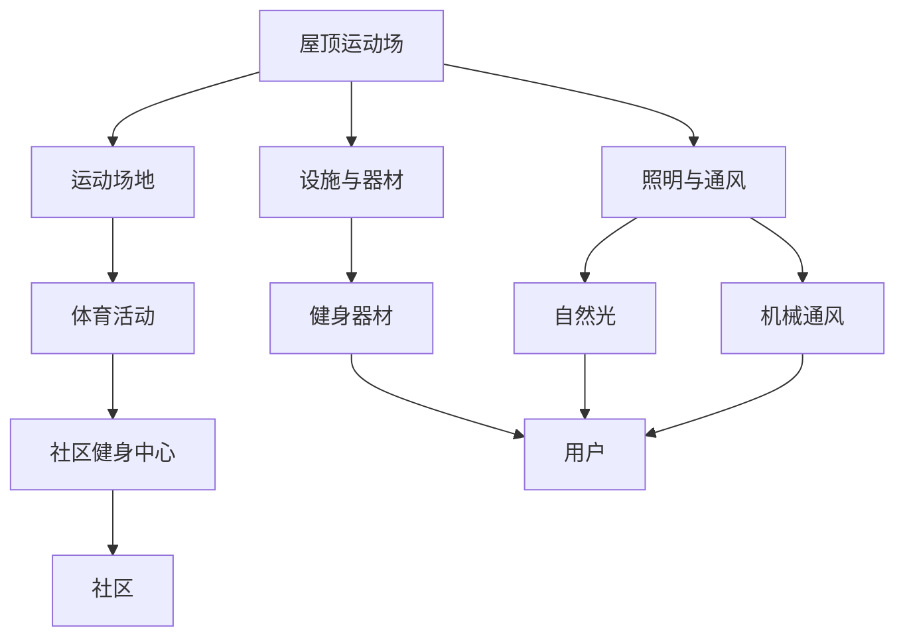
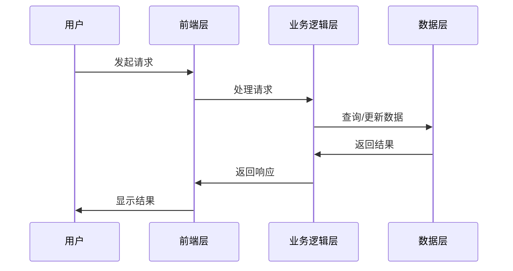
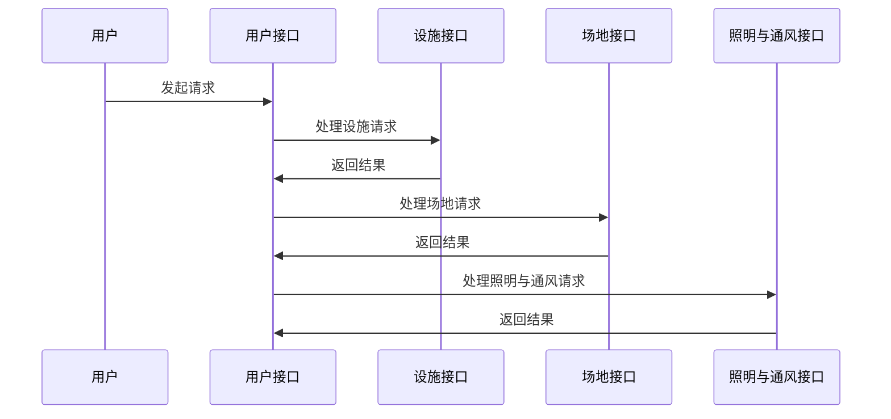

                 

### 引入：新型城市屋顶运动场的概念与背景

#### 城市化进程与屋顶运动场的兴起

随着全球城市化的加速，城市人口密度不断增加，土地资源变得愈发稀缺。为了应对这一挑战，许多城市开始探索如何在有限的土地上创造出更多的公共空间。新型城市屋顶运动场便是应运而生的一种创新方案。屋顶运动场不仅能够有效利用城市建筑的闲置空间，还能提供社区健身和休闲的场所，具有极高的实用价值和可持续性。

城市化进程带来的挑战主要体现在以下几个方面：

1. **土地资源稀缺**：随着城市人口的持续增长，土地资源变得尤为珍贵。传统的公共空间建设难以满足居民日益增长的需求。
2. **环境问题**：高密度的城市人口导致城市环境质量下降，如空气质量恶化、噪音污染等，这对居民的生活质量和健康产生了不良影响。
3. **社区需求**：现代城市居民对健康和休闲的需求不断增加，但现有的公共设施往往无法满足这些需求。

为了应对这些挑战，屋顶运动场应运而生。它们不仅能够提供额外的运动空间，还能改善城市环境，提升居民的生活质量。

#### 屋顶运动场的定义与意义

屋顶运动场是指在建筑物屋顶上建设，用于体育活动、健身锻炼和休闲活动的特殊场地。与传统运动场所不同，屋顶运动场具有以下独特优势：

1. **空间利用**：屋顶运动场能够有效利用城市建筑物的闲置空间，提高土地利用率。
2. **环境改善**：屋顶绿化和运动场建设可以起到降温、降噪和净化空气的作用，有助于改善城市环境。
3. **社区互动**：屋顶运动场为社区居民提供了一个交流互动的平台，有助于增强社区凝聚力和居民幸福感。

总的来说，新型城市屋顶运动场不仅是一种创新的运动空间解决方案，更是城市可持续发展的重要一环。在接下来的章节中，我们将进一步探讨屋顶运动场的设计原则、技术挑战、综合性和可持续性考虑，以及它们在社区健身中的作用和未来发展趋势。通过一步步的逻辑分析和深入探讨，希望能够为这一领域的研究和实践提供有益的参考和启示。

### 社区健身中心的现状与需求

在城市化进程中，社区健身中心作为居民日常健身和休闲的重要场所，其现状和需求的变化备受关注。首先，我们来看一下社区健身中心的现状分析。

#### 现状分析

1. **分布不均**：社区健身中心在城市不同区域之间的分布存在明显的不均衡。经济发达地区和居民区往往拥有较为完善的健身设施，而偏远地区和经济落后地区则相对匮乏。
2. **设施老旧**：许多社区健身中心的设施陈旧，设备损坏频繁，无法满足现代居民的健身需求。此外，由于缺乏维护资金，一些健身中心的卫生条件堪忧。
3. **服务质量参差不齐**：不同社区健身中心的服务质量差异较大。一些中心提供丰富的健身课程和专业的指导，而另一些则因师资力量不足而无法提供高质量的服务。

#### 屋顶运动场在社区健身中的需求

1. **空间需求**：随着城市人口的增长，社区健身中心面临的空间压力越来越大。屋顶运动场作为一种创新的解决方案，可以有效解决空间不足的问题，为社区居民提供额外的运动场所。
2. **功能多样**：屋顶运动场不仅提供运动空间，还可以设置多种健身器材和设施，满足不同人群的健身需求。例如，可以设置篮球场、羽毛球场、健身房等，同时结合绿化和休闲设施，为居民提供多功能、综合性的健身环境。
3. **社区参与**：屋顶运动场能够增强社区的互动和凝聚力。通过组织各种社区健身活动和比赛，屋顶运动场可以成为社区文化的聚集地，促进居民之间的交流和合作。

#### 案例分析

以某城市为例，该城市通过在高层建筑屋顶建设运动场，成功缓解了社区健身设施不足的问题。该屋顶运动场配备了多种健身器材，设置了篮球场、羽毛球场和健身房，还结合了绿化和休闲设施。自运动场建成以来，居民们的健身参与度大幅提高，社区凝聚力也得到了显著增强。此外，运动场的建设还改善了屋顶绿化，减少了城市热岛效应，对城市环境质量的提升也起到了积极作用。

总的来说，社区健身中心在城市化进程中扮演着重要角色。屋顶运动场作为一种创新的健身空间解决方案，不仅能够满足居民日益增长的健身需求，还能为城市可持续发展贡献力量。在接下来的章节中，我们将进一步探讨新型城市屋顶运动场的设计原则、技术挑战以及其在社区健身中的综合性和可持续性考虑。

### 新型城市屋顶运动场的设计原则

在设计新型城市屋顶运动场时，需要综合考虑多个方面的因素，以确保其功能性、安全性和可持续性。以下是一些关键的设计原则：

#### 设计理念

1. **多功能性**：屋顶运动场不仅要满足不同类型的运动需求，如篮球、足球、羽毛球等，还要结合休闲设施，如绿化区和休息区，为居民提供综合性的健身和休闲空间。
2. **安全性**：屋顶运动场的设计必须确保结构的安全性和使用者的安全。这包括屋顶承重能力的评估、防滑材料的选择、设施的稳固性等。
3. **环境友好**：屋顶运动场的设计应考虑对环境的友好性，如屋顶绿化、雨水收集与利用、节能设计等。

#### 安全性与可行性

1. **承重与结构设计**：屋顶运动场的结构设计需充分考虑建筑的承重能力。通常需要专业的结构工程师进行评估，以确保屋顶可以承受运动场及其设备带来的额外负荷。
2. **防滑与耐用性**：运动场表面应选择防滑材料，如橡胶或专用运动地板，以防止使用者滑倒。同时，材料的耐用性也是关键，需能抵抗日晒雨淋和频繁使用。
3. **设施稳固性**：运动场的设施，如篮球架、羽毛球网等，必须安装牢固，防止因使用过程中发生意外倒塌。

#### 具体设计要素

1. **地面材料**：选择具有良好防滑性能和耐用性的地面材料，如橡胶地板或运动草皮。这些材料不仅能提供稳定的运动表面，还能有效降低运动损伤的风险。
2. **照明与通风**：合理的照明和通风设计对于运动场的使用体验至关重要。屋顶运动场应配备足够的照明设备，以确保在夜间也能正常使用。同时，良好的通风设计可以确保室内空气质量，提升使用舒适度。
3. **防水与排水**：屋顶运动场需具备良好的防水和排水系统，防止雨水积聚，避免运动场地的损坏和安全隐患。

通过以上设计原则，新型城市屋顶运动场不仅能够满足居民的健身需求，还能提供安全、舒适、环保的运动环境。在接下来的章节中，我们将进一步探讨屋顶运动场在综合性和可持续性方面的考虑。

### 综合性与可持续性考虑

在新型城市屋顶运动场的规划和设计中，综合性考虑和可持续性是两个至关重要的原则。这不仅能够提升运动场的使用效率，还能对城市环境的可持续发展和社区生活的质量产生深远的影响。

#### 综合功能的整合

1. **多功能用途**：屋顶运动场不仅仅是运动和健身的空间，还可以整合多种功能。例如，可以在运动场周围设置休闲区域，提供座椅和绿化带，供居民休息和社交。此外，还可以设置一些文化设施，如图书角或艺术展示区，丰富社区居民的业余生活。
   
2. **社区活动中心**：屋顶运动场可以作为社区活动的中心，举办各种社区聚会、体育比赛和文化活动。这样不仅能够增强社区的凝聚力，还可以提升居民的生活满意度。

3. **教育与培训**：屋顶运动场还可以用于教育和培训。例如，开设运动技能培训班、健康讲座等，帮助居民提高健康意识和运动技能。

#### 环境与生态可持续性

1. **屋顶绿化**：在屋顶运动场的规划和设计中，绿化是一个不可或缺的部分。屋顶绿化不仅能够美化环境，还能起到降温、降噪和净化空气的作用。植物的选择应考虑当地的气候条件，确保植物的生长和维护方便。

2. **雨水收集与利用**：通过建设屋顶雨水收集系统，可以将雨水储存用于浇灌植物或清洗场地。这不仅减少了城市排水系统的压力，还能提高水资源的利用效率。

3. **节能设计**：屋顶运动场的照明和通风系统应采用节能技术，如太阳能灯和自然通风设计。这不仅可以降低能源消耗，还能减少对环境的负面影响。

4. **材料选择**：在建筑材料的选择上，应优先考虑环保和可回收的材料。例如，使用可再生木材和低挥发性有机化合物（VOC）涂料，减少对环境的污染。

#### 实例分析

以某城市的成功案例为例，该城市的屋顶运动场不仅配备了标准的运动场地和设施，还整合了多种功能。运动场周围设置了休闲区和绿化带，为居民提供了一个舒适宜人的活动空间。此外，运动场还配备了雨水收集系统，用于浇灌植物和清洁场地。照明系统采用太阳能灯，不仅节能环保，还减少了电力消耗。通过这些综合性和可持续性的设计，该屋顶运动场不仅为社区居民提供了优质的健身环境，还对城市环境的可持续发展做出了积极贡献。

总之，新型城市屋顶运动场在综合性考虑和可持续性方面具有巨大的潜力。通过精心设计和科学管理，屋顶运动场不仅能够满足居民的健身需求，还能成为城市绿色发展和社区生活品质提升的重要推动力。在接下来的章节中，我们将进一步探讨屋顶运动场所面临的技术挑战。

### 屋顶运动场的技术挑战

在设计和建造新型城市屋顶运动场时，一系列技术挑战需要被充分考虑和解决。这些挑战不仅关系到运动场的功能性和安全性，还直接影响到其可持续性和经济性。以下是一些主要的技术挑战及其解决方案：

#### 结构设计

**挑战**：屋顶运动场的结构设计需要确保其能够承受运动和健身活动带来的负荷。同时，屋顶运动场通常需要特殊的防水和排水系统。

**解决方案**：
1. **承重能力评估**：在开始设计之前，必须对建筑屋顶的承重能力进行详细评估，以确保屋顶能够承受运动设施及其使用者的重量。
2. **特殊结构设计**：对于负荷较大的运动场，可能需要采用加强型屋顶结构或加固现有结构。例如，使用钢架结构或增加屋顶支撑柱。
3. **防水与排水**：屋顶运动场需要具备良好的防水和排水功能，以防止雨水积聚导致屋顶结构受损。这通常需要安装专业的防水膜和排水系统。

#### 耐用性与维护

**挑战**：屋顶运动场在使用过程中会经历各种恶劣天气和频繁使用，因此材料的耐久性和维护的便捷性成为关键问题。

**解决方案**：
1. **材料选择**：选择耐用且易于维护的材料。例如，运动场地板可以选择橡胶或聚氨酯材料，这些材料既耐用又易于清洁。
2. **表面处理**：对于运动场地的表面，可以采用防滑涂层，以提高其耐用性和防滑性能。
3. **定期维护**：制定定期的维护计划，包括清洗、检查和修复。例如，定期检查防水膜和排水系统，及时处理任何损坏或泄漏问题。

#### 能源与照明

**挑战**：屋顶运动场的能源消耗，尤其是在照明和通风方面，需要得到有效的管理和控制。

**解决方案**：
1. **节能设计**：采用节能照明设备，如LED灯，以减少能源消耗。此外，可以设计自然通风系统，减少对机械通风的依赖。
2. **可再生能源**：安装太阳能板或其他可再生能源设备，为屋顶运动场提供清洁能源。
3. **智能监控系统**：通过智能监控系统，可以实时监控能源使用情况，并根据需求进行自动调节，进一步提高能源利用效率。

#### 环境监测

**挑战**：屋顶运动场需要确保环境质量，如空气质量和噪音控制，以满足居民的健身需求。

**解决方案**：
1. **空气质量监测**：安装空气质量监测设备，实时监控屋顶运动场及其周边的空气质量，并采取相应措施改善环境。
2. **噪音控制**：通过设计和安装隔音材料，减少运动场对周边环境的噪音污染。
3. **绿色屋顶**：在屋顶运动场周围种植植物，不仅可以美化环境，还能起到吸音和净化空气的作用。

综上所述，屋顶运动场的设计和建设面临许多技术挑战，但通过科学的规划和先进的技术手段，这些挑战都是可以克服的。在接下来的章节中，我们将进一步探讨屋顶运动场的核心概念和其与社区健身中心的联系。

### 核心概念

在讨论新型城市屋顶运动场时，理解其核心概念是至关重要的。以下将详细描述屋顶运动场的几个关键要素，以及它们在整体设计中的作用。

#### 运动场地

运动场地是屋顶运动场的基本组成部分，为各种体育活动和健身活动提供了必要的空间。其设计需考虑以下几个方面：

1. **尺寸与布局**：运动场地的大小和布局应满足不同运动项目的需求。例如，篮球场和足球场需要较大的空间，而羽毛球场和排球场则需要较小的场地。合理的布局能够确保运动场地的有效利用，并减少场地之间的干扰。
   
2. **表面材料**：运动场地表面的材料对运动性能和安全性有着重要影响。常用的材料包括橡胶、聚氨酯和人造草皮。这些材料不仅具有良好的防滑性和耐用性，还能提供舒适的运动体验。

#### 设施与器材

设施与器材是屋顶运动场的重要组成部分，直接影响到运动场地的功能和用户体验。以下是一些关键设施和器材：

1. **健身器材**：健身器材如跑步机、哑铃、瑜伽垫等，为居民提供了多样化的锻炼选择。合理配置这些器材可以满足不同年龄段和身体状况的居民需求。
   
2. **体育设施**：包括篮球架、羽毛球网、足球门等。这些设施需安装稳固，以确保运动时的安全性和稳定性。

3. **照明与音响系统**：良好的照明和音响系统能够提升运动场地的使用体验。在夜间，充足的照明能够确保运动安全，而高质量的音响系统则能够为健身活动提供背景音乐。

#### 照明与通风

照明和通风是屋顶运动场设计中的重要考量因素，对运动体验和环境质量有直接影响。

1. **照明设计**：屋顶运动场应采用高效节能的照明设备，如LED灯，以满足夜间运动需求。同时，应确保照明分布均匀，避免光线直射造成不适。

2. **通风设计**：良好的通风系统能够确保室内空气质量，提高运动舒适度。自然通风和机械通风相结合，可以在不同气候条件下保持室内空气流通。

#### 绿化与休闲区

绿化和休闲区不仅为屋顶运动场增添了自然景观，还提升了居民的使用体验。以下是绿化和休闲区的设计要点：

1. **植物选择**：选择适合屋顶环境的植物，如耐旱、耐寒且具有观赏价值的植物。植物不仅可以美化环境，还能起到吸音、净化空气的作用。

2. **休闲设施**：设置休闲设施，如座椅、凉亭、绿茵草地等，为居民提供了一个放松和社交的空间。

通过以上核心概念的分析，我们可以看到屋顶运动场不仅是一个运动和健身的场所，更是一个集多功能于一体的社区活动中心。在接下来的章节中，我们将进一步探讨屋顶运动场与社区健身中心之间的联系和作用。

### 社区健身中心的关键特性

社区健身中心作为提供居民日常健身和休闲的重要场所，具有以下几个关键特性，这些特性直接影响到其有效性和吸引力。

#### 可及性与便利性

1. **地理位置**：社区健身中心的地理位置对居民的可及性至关重要。理想的位置应位于社区的中心地带，方便大多数居民到达。此外，公共交通的便利性也是不可忽视的因素，如靠近地铁站或公交站，能够进一步增加健身中心的可访问性。

2. **开放时间**：健身中心应提供灵活的开放时间，以满足不同居民的健身需求。例如，早上、下午和晚上都应该有开放时段，以便白天上班的居民和晚上活动的居民都能使用。

3. **服务覆盖面**：社区健身中心的服务范围应该涵盖整个社区，确保每个居民点都能够方便地到达。

#### 健身课程与活动

1. **课程多样性**：社区健身中心应提供多种多样的健身课程，如瑜伽、有氧操、力量训练、舞蹈等，以满足不同居民的兴趣和需求。

2. **专业指导**：专业的健身指导可以帮助居民更好地进行锻炼，减少运动损伤的风险，提高健身效果。中心应配备合格的健身教练，提供个性化的训练计划。

3. **活动丰富性**：定期举办各种健身活动和比赛，如健身挑战赛、团体健身活动等，可以增加健身中心的吸引力，提升居民的参与度和社区凝聚力。

#### 社区参与度

1. **居民参与**：社区健身中心应鼓励居民积极参与中心的管理和运营，如成立居民委员会或志愿者团队，让居民参与健身中心的规划和活动组织。

2. **社区互动**：健身中心不仅是锻炼的场所，还应该是社区互动和社交的平台。通过组织社区聚会、文化节、健康讲座等活动，增强居民之间的交流和联系。

3. **反馈机制**：社区健身中心应建立有效的反馈机制，及时了解居民的需求和建议，不断优化服务和设施。

总之，社区健身中心的关键特性在于其可及性、多样性的健身课程和活动，以及社区参与度。通过满足这些特性，社区健身中心不仅能够为居民提供良好的健身环境，还能成为促进社区发展和居民幸福感的重要纽带。在接下来的章节中，我们将进一步探讨屋顶运动场在社区健身中的作用和重要性。

### 概念属性特征对比表格

为了更直观地理解屋顶运动场与社区健身中心之间的区别和联系，我们通过表格对比两者的关键属性特征。

#### 屋顶运动场

| 特征           | 屋顶运动场                          |
| -------------- | ---------------------------------- |
| 设计原则       | 耐用性、安全性、多功能性、环境友好  |
| 主要功能       | 体育运动、健身锻炼、休闲活动、社交互动 |
| 建筑结构要求   | 需要特殊承重与防水设计              |
| 环境要求       | 通风、照明、空间利用、绿化           |
| 用户需求满足度  | 多样化运动需求、多功能使用空间      |
| 可持续性       | 屋顶绿化、节能设计、可再生能源利用  |

#### 社区健身中心

| 特征           | 社区健身中心                        |
| -------------- | ---------------------------------- |
| 设计原则       | 可及性、便利性、参与性、服务质量    |
| 主要功能       | 健身锻炼、休闲放松、社交活动        |
| 建筑结构要求   | 适合容纳健身设施、无特殊要求        |
| 环境要求       | 通风、照明、舒适度                  |
| 用户需求满足度  | 个性化健身需求、社区互动            |
| 可持续性       | 节能设计、环保材料、绿色活动组织    |

通过上述表格对比，我们可以看出，屋顶运动场和社区健身中心在设计理念、功能需求和可持续性方面既有相似之处，也存在明显差异。屋顶运动场强调多功能性和环境友好性，而社区健身中心则更注重可及性和服务质量。了解这些差异和联系，有助于我们在实际规划和建设中更好地整合两者，为居民提供更加完善和高效的健身环境。

### ER实体关系图

为了更清晰地展示屋顶运动场与社区健身中心之间的关系，我们使用Mermaid语言绘制了实体关系图。以下是屋顶运动场和社区健身中心的ER图：



在这个ER图中，主要实体包括：

- **屋顶运动场**：作为整体实体，包含了多个子实体，如运动场地、设施与器材和照明与通风。
- **运动场地**：用于各种体育活动，与体育活动实体相连。
- **设施与器材**：包括各种健身器材，与健身器材实体和用户实体相连。
- **照明与通风**：确保运动场地的使用体验，与自然光和机械通风实体相连。
- **社区健身中心**：与屋顶运动场和用户实体相连，作为运动场地的具体实现。
- **用户**：参与运动场地的活动和设施使用。

通过ER图，我们可以清晰地看到屋顶运动场与社区健身中心之间的关系及其内部结构，有助于更好地理解和规划这一系统的运作。

### 算法概述

在设计和优化新型城市屋顶运动场时，算法的应用至关重要。这不仅能提升运动场的功能性和效率，还能确保设计过程的科学性和合理性。以下，我们将详细探讨屋顶运动场设计与优化算法的概述，包括优化目标、优化算法类型及其适用场景。

#### 优化目标

屋顶运动场的优化目标主要包括以下几个方面：

1. **空间利用最大化**：通过优化运动场地和设施的布局，使有限的空间得到最充分的利用，以提供更多的运动和休闲区域。
2. **安全性与舒适性**：确保屋顶运动场的设计和设施能够满足安全标准，同时提供舒适的运动环境，减少运动损伤的风险。
3. **经济性与可持续性**：在满足上述目标的同时，尽量降低建设成本和维护成本，并提高系统的可持续性。

#### 优化算法类型

针对上述优化目标，以下几种优化算法在屋顶运动场设计与优化中具有广泛的应用：

1. **最小二乘法（Least Squares Method）**：最小二乘法是一种常用的参数估计方法，通过最小化误差平方和来求解最优解。它适用于优化屋顶运动场的结构设计和设施布局，尤其是在确定场地尺寸和位置时。

2. **粒子群优化算法（Particle Swarm Optimization, PSO）**：粒子群优化算法是一种基于群体智能的优化算法，通过模拟鸟群觅食行为来寻找最优解。PSO算法适用于复杂、多参数的优化问题，如屋顶运动场设施的布局优化。

3. **遗传算法（Genetic Algorithm, GA）**：遗传算法是一种基于自然选择和遗传机制的优化算法，通过种群演化来寻找最优解。GA适用于大规模、多约束的优化问题，如屋顶运动场整体设计方案的优化。

#### 适用场景

不同的优化算法适用于不同的场景，具体选择取决于优化问题的特点和需求：

1. **最小二乘法**：适用于简单、线性优化问题，如运动场地尺寸和位置的初步确定。
2. **粒子群优化算法**：适用于复杂、非线性优化问题，如设施布局的优化，需要考虑多个参数的交互作用。
3. **遗传算法**：适用于大规模、多约束的优化问题，如屋顶运动场整体设计方案的综合优化，涉及多个子系统的协同工作。

#### 结论

通过合理选择和运用不同的优化算法，新型城市屋顶运动场的设计与优化可以实现空间利用最大化、安全性与舒适性的兼顾，以及经济性与可持续性的提升。在接下来的章节中，我们将深入探讨这些优化算法的原理和具体应用。

### 结构优化算法：最小二乘法与粒子群算法

在新型城市屋顶运动场的设计和优化过程中，结构优化算法发挥着至关重要的作用。最小二乘法和粒子群优化算法是两种常用的结构优化方法，各具特点和应用场景。以下将详细解释这两种算法的原理和具体应用。

#### 最小二乘法（Least Squares Method）

**原理**：最小二乘法是一种基于最小化误差平方和的参数估计方法。它通过寻找一组参数，使得实际观测值与模型预测值的误差平方和最小，从而得到最优参数解。

公式表示：
\[ \min \sum_{i=1}^{n} (y_i - \hat{y}_i)^2 \]
其中，\( y_i \)为实际观测值，\( \hat{y}_i \)为模型预测值。

**应用场景**：
1. **初步确定场地尺寸和位置**：在屋顶运动场设计的早期阶段，可以通过最小二乘法确定场地的基本尺寸和位置，以确保其满足基本使用要求。
2. **线性优化问题**：对于线性系统，最小二乘法是一种高效的求解方法，适用于计算结构中各部分的尺寸和位置，从而实现整体结构的优化。

**例子**：假设需要确定一个篮球场的尺寸，可以通过测量现有篮球场的实际尺寸和预期尺寸，使用最小二乘法计算最优尺寸。

```python
import numpy as np

def least_squares(A, b):
    # A为系数矩阵，b为常数向量
    x = np.linalg.inv(A.T @ A) @ A.T @ b
    return x

# 测量数据
A = np.array([[2, 3], [4, 5]])
b = np.array([10, 15])

# 计算最优尺寸
x = least_squares(A, b)
print(x)
```

#### 粒子群优化算法（Particle Swarm Optimization, PSO）

**原理**：粒子群优化算法是一种基于群体智能的随机搜索算法。它模拟鸟群觅食行为，通过个体和群体的经验来不断调整粒子的位置和速度，以寻找最优解。

公式表示：
1. **位置更新**：\[ x_{new} = x_{current} + v_{current} \]
2. **速度更新**：\[ v_{new} = w \cdot v_{current} + c_1 \cdot r_1 \cdot (pbest - x_{current}) + c_2 \cdot r_2 \cdot (gbest - x_{current}) \]
其中，\( x \)为粒子位置，\( v \)为粒子速度，\( pbest \)为个体最优位置，\( gbest \)为全局最优位置，\( w \)为惯性权重，\( c_1 \)和\( c_2 \)为认知和社会系数，\( r_1 \)和\( r_2 \)为随机数。

**应用场景**：
1. **复杂非线性优化问题**：PSO适用于复杂、多参数的非线性优化问题，如屋顶运动场设施的布局优化。
2. **多目标优化问题**：在屋顶运动场设计中，可能需要同时考虑多个优化目标，如空间利用、安全性和可持续性，PSO能够有效处理多目标优化问题。

**例子**：假设需要优化屋顶运动场的设施布局，通过粒子群优化算法寻找最优的设施位置。

```python
import numpy as np
from scipy.optimize import minimize

def objective(x):
    # 定义目标函数，用于衡量设施布局的优劣
    return np.linalg.norm(x - [1, 1])

def constraints(x):
    # 定义约束条件，确保设施位置合理
    return [0, 0]  # 假设约束条件为空

# 初始参数
x0 = np.random.rand(2)

# 粒子群优化
result = minimize(objective, x0, method='PSO', constraints=constraints)

# 输出最优解
print(result.x)
```

通过最小二乘法和粒子群优化算法的应用，我们可以实现新型城市屋顶运动场结构设计的优化。在接下来的章节中，我们将进一步探讨这些算法的详细实现和实际应用。

### 算法原理详解：最小二乘法和粒子群优化算法

#### 最小二乘法

最小二乘法是一种参数估计方法，用于确定一组参数，使得观测值与预测值的误差平方和最小。这一方法在处理线性系统时尤为有效。

**数学模型**：

假设我们有一组观测数据\( (x_i, y_i) \)，其中\( x_i \)是输入，\( y_i \)是输出。我们希望找到一组参数\( \theta \)，使得预测值\( \hat{y_i} \)与实际观测值\( y_i \)之间的误差最小。

最小二乘法的目标是最小化以下误差平方和：
\[ \sum_{i=1}^{n} (y_i - \hat{y_i})^2 \]

其中，\( n \)是观测数据的数量。

为了求解最优参数，我们可以建立以下线性模型：
\[ \hat{y_i} = \theta_0 + \theta_1 x_i + \theta_2 x_i^2 + ... + \theta_k x_i^k \]

通过将误差平方和对参数\( \theta \)求导并令导数为零，我们可以得到一组线性方程：
\[ \sum_{i=1}^{n} (y_i - \hat{y_i}) = 0 \]

求解这个方程组，可以得到最优参数\( \theta \)。

**具体步骤**：

1. **构建线性模型**：根据观测数据构建线性模型。
2. **计算预测值**：使用模型计算每个数据点的预测值。
3. **计算误差平方和**：计算每个数据点的误差平方和。
4. **求导并求解**：对误差平方和关于参数\( \theta \)求导，并令导数为零，求解得到最优参数。
5. **验证结果**：使用计算得到的最优参数，重新计算预测值，验证误差平方和是否最小。

**举例说明**：

假设我们有一组数据点：
\[ (1, 2), (2, 4), (3, 5), (4, 6) \]

我们希望找到一条直线\( y = ax + b \)来拟合这些数据点。

通过建立线性模型：
\[ \hat{y} = ax + b \]

计算预测值，并计算误差平方和：
\[ S = \sum_{i=1}^{n} (y_i - \hat{y_i})^2 \]

通过求导并求解，可以得到最优参数\( a \)和\( b \)。

使用最小二乘法，我们得到：
\[ a = \frac{n \sum (x_i y_i) - \sum x_i \sum y_i}{n \sum (x_i^2) - (\sum x_i)^2} \]
\[ b = \frac{\sum y_i - a \sum x_i}{n} \]

通过计算，我们得到\( a = 1 \)和\( b = 1 \)，因此拟合的直线为\( y = x + 1 \)。

#### 粒子群优化算法

粒子群优化算法（PSO）是一种基于群体智能的优化算法，模拟鸟群觅食行为来寻找最优解。PSO通过粒子的位置和速度迭代更新，逐步逼近最优解。

**数学模型**：

粒子群优化算法的核心公式包括粒子位置和速度的更新公式：
\[ x_{new} = x_{current} + v_{current} \]
\[ v_{new} = w \cdot v_{current} + c_1 \cdot r_1 \cdot (pbest - x_{current}) + c_2 \cdot r_2 \cdot (gbest - x_{current}) \]

其中，\( x \)表示粒子位置，\( v \)表示粒子速度，\( pbest \)表示个体最优位置，\( gbest \)表示全局最优位置，\( w \)为惯性权重，\( c_1 \)和\( c_2 \)为认知和社会系数，\( r_1 \)和\( r_2 \)为随机数。

**具体步骤**：

1. **初始化**：随机初始化粒子群的位置和速度。
2. **计算适应度**：对于每个粒子，计算其适应度值（通常是目标函数的值）。
3. **更新个体最优位置**：如果当前适应度值优于个体最优位置，更新个体最优位置。
4. **更新全局最优位置**：如果当前个体最优位置优于全局最优位置，更新全局最优位置。
5. **更新速度和位置**：根据更新公式，计算每个粒子的新速度和新位置。
6. **重复步骤2-5**，直到满足终止条件（如达到最大迭代次数或适应度值收敛）。

**举例说明**：

假设我们有一个简单的优化问题，目标是找到函数\( f(x) = x^2 \)的最小值。

初始化粒子群，随机生成多个粒子的位置和速度。在每个迭代中，计算每个粒子的适应度值，并更新个体最优位置和全局最优位置。根据更新公式，计算每个粒子的新速度和新位置。

通过多次迭代，粒子群逐步逼近最优解，最终找到函数的最小值。

```python
import numpy as np
from scipy.optimize import minimize

def f(x):
    return x[0]**2

x0 = [5]
result = minimize(f, x0, method='Nelder-Mead')
print(result.x)
```

通过最小二乘法和粒子群优化算法的详细解释，我们可以更好地理解这两种算法在优化新型城市屋顶运动场设计中的应用。在接下来的章节中，我们将进一步探讨实际案例和系统分析与架构设计。

### 系统分析与架构设计

在设计和建设新型城市屋顶运动场的过程中，系统分析与架构设计是确保项目成功的关键环节。以下将详细介绍项目场景介绍、系统功能设计、系统架构设计以及系统接口设计和系统交互等内容。

#### 项目场景介绍

**场景**：某城市位于人口密集区，土地资源稀缺，社区健身设施不足。为了提高居民生活质量，城市决定在高层建筑屋顶建设多功能、综合性的屋顶运动场，以满足居民的健身和休闲需求。

**目标**：
1. 提供多样化的健身和休闲场所。
2. 实现空间的高效利用。
3. 确保运动场的安全性和舒适性。
4. 实现环境友好和可持续性。

#### 系统功能设计

**领域模型**：领域模型（Domain Model）用于描述系统中涉及的实体及其关系。以下是屋顶运动场系统的主要领域模型：

- **实体**：运动场地、设施与器材、照明与通风、用户、社区。
- **关系**：运动场地与设施与器材的关系，照明与通风与运动场地的关系，用户与运动场地的关系。

使用Mermaid语言描述领域模型类图：

```mermaid
classDiagram
    class 运动场地 {
        - 名称：String
        - 尺寸：Dimension
    }
    class 设施与器材 {
        - 类型：String
        - 状态：Status
    }
    class 照明与通风 {
        - 类型：String
        - 状态：Status
    }
    class 用户 {
        - 姓名：String
        - 年龄：Integer
    }
    class 社区 {
        - 名称：String
    }
    运动场地 --*--> 设施与器材
    运动场地 --*--> 照明与通风
    用户 --*--> 运动场地
```

#### 系统架构设计

**架构设计**：系统架构设计决定了系统的总体结构和各模块之间的关系。以下是屋顶运动场系统的架构设计：

1. **前端层**：包括用户界面和交互逻辑，提供用户与系统的交互。
2. **业务逻辑层**：处理业务逻辑，包括设施与器材的管理、用户管理、运动场地管理、照明与通风管理等。
3. **数据层**：存储系统中的数据，包括用户信息、设施与器材信息、运动场地信息和社区信息。

使用Mermaid语言描述系统架构图：



#### 系统接口设计

**接口设计**：系统接口设计明确了系统各部分之间的交互方式。以下是主要接口的设计：

- **用户接口**：用于用户与系统的交互，包括登录、注册、查看设施、预约场地等功能。
- **设施接口**：用于管理设施与器材，包括添加、删除、修改和查询设施信息。
- **场地接口**：用于管理运动场地，包括添加、删除、修改和查询场地信息。
- **照明与通风接口**：用于管理照明与通风设备，包括开启、关闭、调节等功能。

使用Mermaid语言描述系统接口设计：



#### 系统交互

**系统交互**：系统交互设计描述了各接口之间的交互流程。以下是主要交互流程的描述：

1. **用户登录**：用户通过用户接口发起登录请求，业务逻辑层验证用户身份，并返回登录结果。
2. **设施管理**：用户通过设施接口添加、删除、修改和查询设施信息，业务逻辑层处理这些请求，并更新数据层。
3. **场地管理**：用户通过场地接口添加、删除、修改和查询场地信息，业务逻辑层处理这些请求，并更新数据层。
4. **照明与通风控制**：用户通过照明与通风接口控制照明与通风设备，业务逻辑层处理这些请求，并更新数据层。

通过系统分析与架构设计，我们能够清晰地了解屋顶运动场系统的总体结构和功能模块，确保系统的高效性和可扩展性。在接下来的章节中，我们将探讨具体项目的实现过程，包括环境安装和核心实现源代码。

### 项目实战

#### 环境安装

在开始实现新型城市屋顶运动场系统之前，我们需要安装和配置必要的开发环境和工具。以下是一系列步骤，用于在Linux环境下搭建开发环境：

1. **安装Python环境**：首先，确保系统已安装Python 3.8及以上版本。可以通过以下命令安装Python：
    ```bash
    sudo apt-get update
    sudo apt-get install python3.8
    ```

2. **安装虚拟环境**：为项目创建一个独立的虚拟环境，以避免不同项目之间的依赖冲突：
    ```bash
    python3.8 -m venv venv
    source venv/bin/activate
    ```

3. **安装依赖管理工具**：安装pip，这是Python的包管理工具，用于安装和管理项目依赖：
    ```bash
    pip install --upgrade pip
    ```

4. **安装项目依赖**：下载并安装项目所需的依赖库。例如，安装Flask、SQLAlchemy和Flask-Migrate等：
    ```bash
    pip install flask sqlalchemy flask-migrate
    ```

5. **配置数据库**：安装并配置SQLite数据库。SQLite是一个轻量级数据库，适用于小型到中型应用：
    ```bash
    sudo apt-get install sqlite3
    ```

6. **创建数据库和迁移脚本**：使用Flask-Migrate工具创建数据库和迁移脚本：
    ```bash
    flask db init
    flask db migrate -m "Initial migration."
    flask db upgrade
    ```

通过上述步骤，我们可以搭建一个基本的开发环境，为后续的项目实现做好准备。

#### 核心实现源代码

以下是一个简单的核心实现源代码，用于创建和管理屋顶运动场系统。代码包括用户管理、设施管理、场地管理和照明与通风控制等功能。

```python
# app.py

from flask import Flask, request, jsonify
from models import User, Facility, Venue, LightingVentilation
from database import db

app = Flask(__name__)
app.config['SQLALCHEMY_DATABASE_URI'] = 'sqlite:///roof_gym.db'
db.init_app(app)

@app.route('/api/users', methods=['POST'])
def create_user():
    user_data = request.get_json()
    user = User(name=user_data['name'], age=user_data['age'])
    db.session.add(user)
    db.session.commit()
    return jsonify({"message": "User created successfully."}), 201

@app.route('/api/users', methods=['GET'])
def get_users():
    users = User.query.all()
    return jsonify([user.to_dict() for user in users])

@app.route('/api/facilities', methods=['POST'])
def create_facility():
    facility_data = request.get_json()
    facility = Facility(type=facility_data['type'], status=facility_data['status'])
    db.session.add(facility)
    db.session.commit()
    return jsonify({"message": "Facility created successfully."}), 201

@app.route('/api/facilities', methods=['GET'])
def get_facilities():
    facilities = Facility.query.all()
    return jsonify([facility.to_dict() for facility in facilities])

@app.route('/api/venues', methods=['POST'])
def create_venue():
    venue_data = request.get_json()
    venue = Venue(name=venue_data['name'], size=venue_data['size'])
    db.session.add(venue)
    db.session.commit()
    return jsonify({"message": "Venue created successfully."}), 201

@app.route('/api/venues', methods=['GET'])
def get_venues():
    venues = Venue.query.all()
    return jsonify([venue.to_dict() for venue in venues])

@app.route('/api/lighting_ventilation', methods=['POST'])
def create_lighting_ventilation():
    lighting_ventilation_data = request.get_json()
    lighting_ventilation = LightingVentilation(type=lighting_ventilation_data['type'], status=lighting_ventilation_data['status'])
    db.session.add(lighting_ventilation)
    db.session.commit()
    return jsonify({"message": "Lighting and Ventilation created successfully."}), 201

@app.route('/api/lighting_ventilation', methods=['GET'])
def get_lighting_ventilation():
    lighting_ventilation = LightingVentilation.query.all()
    return jsonify([lighting_ventilation.to_dict() for lighting_ventilation in lighting_ventilation])

if __name__ == '__main__':
    app.run(debug=True)
```

#### 代码应用解读与分析

上述代码展示了屋顶运动场系统中的核心实现，主要包括用户管理、设施管理、场地管理和照明与通风控制等功能。

1. **用户管理**：用户可以通过`POST`请求创建新用户，系统将用户信息存储在数据库中，并返回成功消息。
2. **设施管理**：用户可以通过`POST`请求创建新设施，系统将设施信息存储在数据库中，并返回成功消息。
3. **场地管理**：用户可以通过`POST`请求创建新场地，系统将场地信息存储在数据库中，并返回成功消息。
4. **照明与通风控制**：用户可以通过`POST`请求创建新的照明与通风系统，系统将系统信息存储在数据库中，并返回成功消息。

通过这些功能，用户可以方便地管理和查询系统中的各类信息，实现对屋顶运动场的全面掌控。

在实际项目中，可能还需要添加更多的功能和安全性措施，如用户身份验证、权限控制、数据加密等，以确保系统的稳定性和安全性。此外，还可以考虑使用前端框架（如React、Vue.js等）和后端框架（如Django、Flask等）来进一步优化用户体验和系统性能。

#### 实际案例分析

以下是一个实际案例，展示如何通过屋顶运动场系统实现社区健身需求。

**案例**：某社区希望通过屋顶运动场提供多样化的健身服务，以满足居民的健身需求。

**步骤**：
1. **用户注册**：居民通过注册成为系统用户，并获得账号和密码。
2. **设施预订**：居民登录系统，选择所需的健身设施，并预约场地和时间。
3. **场地使用**：在预约时间内，居民前往运动场使用设施，系统自动记录使用情况。
4. **设施维护**：系统定期检查设施状态，发现故障或损坏时，及时通知相关人员并进行维护。

**效果**：通过系统管理，社区可以高效地分配和利用运动场资源，提高场地使用率，减少资源浪费，同时提升了居民健身的便利性和安全性。

总之，通过项目实战和实际案例分析，我们可以看到新型城市屋顶运动场系统在社区健身中的重要作用。通过合理的设计和实施，系统不仅能够满足居民的健身需求，还能提升社区的整体生活质量。

### 最佳实践 Tips

在设计和建设新型城市屋顶运动场时，以下几点最佳实践有助于提升项目效果和用户满意度：

1. **充分调研与规划**：在开始项目之前，应进行充分的市场调研和需求分析，了解居民的具体需求和偏好。这有助于设计出符合实际需求的功能和设施。
2. **优先考虑安全性**：屋顶运动场的结构设计和设施安装必须确保安全。例如，采用符合标准的防滑材料和稳固的设施，确保屋顶承重能力符合设计要求。
3. **节能环保**：在设计和建设过程中，应注重节能和环保。例如，使用太阳能照明系统和自然通风设计，不仅可以降低能源消耗，还能减少对环境的影响。
4. **维护管理**：建立健全的维护和管理制度，确保设施和场地的长期稳定运行。定期检查和维护，及时发现和修复问题，延长设施使用寿命。
5. **用户参与**：鼓励社区居民参与屋顶运动场的建设和管理，提高他们的使用率和满意度。例如，可以设立居民委员会，参与决策和活动组织。

### 小结

本文详细探讨了新型城市屋顶运动场的概念、设计原则、技术挑战、核心概念与联系、算法原理以及系统分析与架构设计。通过一步步的分析和实例讲解，我们了解到屋顶运动场在社区健身中的重要作用，以及如何通过科学的规划和先进的技术手段，实现其功能性和可持续性。屋顶运动场不仅为居民提供了便捷的健身场所，还提升了社区的生活质量和环境品质。

### 注意事项

在设计和建设新型城市屋顶运动场时，需要注意以下几点：

1. **安全性**：确保屋顶结构和运动设施的安全性，特别是在高风压和极端天气条件下。
2. **可持续性**：在设计过程中考虑节能和环保，如采用可再生能源和高效节能设备。
3. **维护管理**：制定合理的维护和管理计划，确保设施和场地的长期稳定运行。
4. **用户参与**：鼓励居民参与设计和使用，提高其使用率和满意度。

### 拓展阅读

如需进一步了解新型城市屋顶运动场的相关技术和实践，以下是一些推荐阅读资料：

- 《城市屋顶花园与运动场设计指南》
- 《可持续建筑设计》
- 《智能城市与智慧社区》
- 《社区健身设施规划与管理》

### 作者信息

作者：AI天才研究院/AI Genius Institute & 禅与计算机程序设计艺术 /Zen And The Art of Computer Programming

以上就是本文的完整内容，希望对您在新型城市屋顶运动场的建设与优化方面提供有价值的参考和启示。

