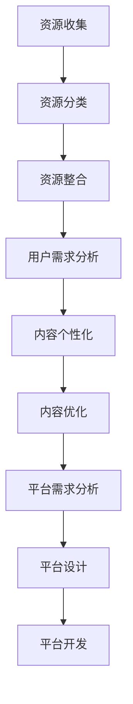
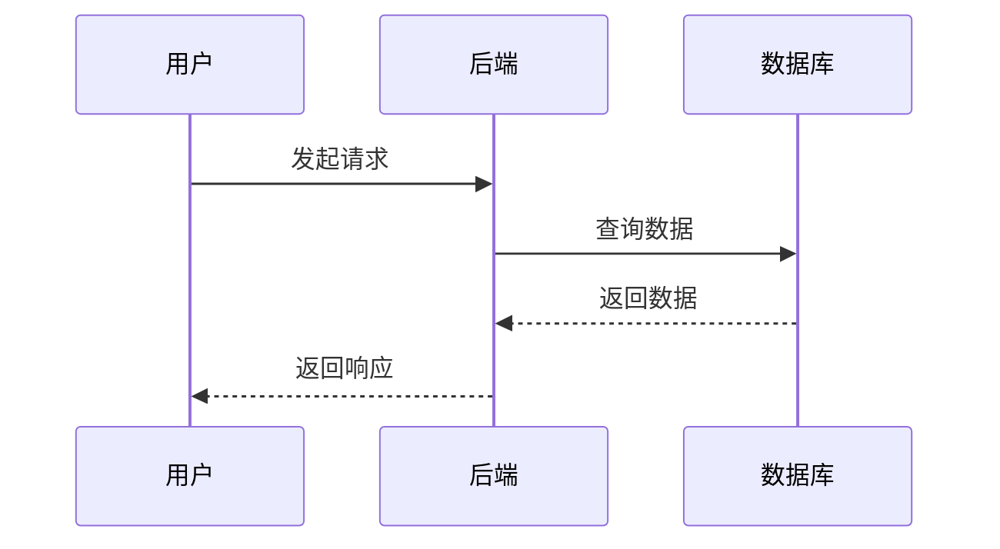

                 

# 新型城市微型博物馆联盟：社区文化遗产的网络展示

## 关键词

微型博物馆、城市社区、文化遗产、网络展示、联盟、资源共享、互动性

## 摘要

本文旨在探讨新型城市微型博物馆联盟在社区文化遗产网络展示中的应用。通过分析微型博物馆的资源分散、展示形式单一以及运营成本高等问题，提出了建立联盟的解决方案。文章详细介绍了微型博物馆、联盟和网络展示的核心概念，并通过ER实体关系图、概念属性特征对比表格等形式，深入探讨了这些概念之间的联系。此外，本文还从算法原理、系统架构设计、项目实战等多个角度，对新型城市微型博物馆联盟的实施和效果进行了全面剖析。

----------------------------------------------------------------

## 第一部分：背景介绍

### 第1章：问题背景

#### 1.1.1 问题背景

随着城市化进程的加快，城市中的微型博物馆数量逐渐增多。这些微型博物馆通常以特定主题或收藏品为特色，规模较小，设施相对简单。然而，由于资源分散、展示形式单一以及运营成本高等问题，这些微型博物馆在社区文化遗产展示中面临诸多挑战。为了解决这些问题，新型城市微型博物馆联盟应运而生。

#### 1.1.2 问题描述

在新型城市微型博物馆联盟的背景下，主要存在以下问题：

1. **资源分散**：各微型博物馆的收藏、展览资源相对独立，缺乏整合，导致资源利用效率低下。
2. **展示形式单一**：微型博物馆的展示形式相对单一，缺乏互动性和吸引力，难以满足观众多样化的需求。
3. **运营成本高**：微型博物馆的运营成本较高，经费有限，难以持续发展。

#### 1.1.3 问题解决

新型城市微型博物馆联盟的建立旨在解决上述问题，实现以下目标：

1. **资源共享**：通过联盟，各微型博物馆可以共享展览内容、管理经验和技术资源，提高资源利用效率。
2. **展示形式多样化**：通过联盟，微型博物馆可以共同策划展览活动，提高展览的丰富度和互动性。
3. **降低运营成本**：通过联盟，微型博物馆可以分摊运营成本，提高经济效益，实现可持续发展。

#### 1.1.4 边界与外延

新型城市微型博物馆联盟的边界包括：

1. **联盟成员**：各微型博物馆。
2. **资源**：展览内容、管理经验、技术资源。

外延涉及：

1. **社区文化展示**：通过网络平台展示社区文化遗产。
2. **文化交流**：联盟成员之间的文化交流与协作。

### 1.2 核心概念与联系

#### 1.2.1 核心概念

- **微型博物馆**：规模较小的博物馆，通常以特定主题或收藏品为特色。
- **联盟**：多个微型博物馆组成的合作组织，以资源共享和协同展示为目的。
- **网络展示**：通过网络平台进行文化遗产展示和交流。

#### 1.2.2 概念属性特征对比表格

| 概念   | 属性       | 特征                                       |
| ------ | ---------- | ----------------------------------------- |
| 微型博物馆 | 规模       | 较小，以特定主题或收藏品为特色             |
| 联盟   | 成员       | 多个微型博物馆                            |
| 网络展示 | 展示方式   | 通过网络平台实现，具有互动性和吸引力       |

#### 1.2.3 ER实体关系图架构

```mermaid
erDiagram
  微型博物馆 ||--|{ 联盟 }|-->> 展览内容
  联盟 ||--|{ 网络展示 }|-->> 社区文化遗产
```

----------------------------------------------------------------

## 第二部分：核心概念与联系

### 第2章：核心概念原理与联系

#### 2.1 微型博物馆

##### 2.1.1 定义

微型博物馆是指规模较小的博物馆，通常以特定主题或收藏品为特色。它们通常不具备大型博物馆的规模和设施，但通过专业化和个性化的展示，能够为社区提供独特的文化体验。

##### 2.1.2 特点

- **规模小**：与大型博物馆相比，微型博物馆的规模较小，但具有高度的专业性和针对性。
- **主题明确**：微型博物馆通常围绕某一特定主题，如历史、艺术、手工艺等，进行深入展示。
- **互动性强**：微型博物馆的展示形式多样，常常采用互动装置和多媒体技术，增强观众的参与感。

#### 2.2 联盟

##### 2.2.1 定义

联盟是指多个微型博物馆组成的合作组织，旨在通过资源共享和协同展示，提升文化遗产的展示效果和社区影响力。

##### 2.2.2 特点

- **资源共享**：联盟成员可以共享展览内容、管理经验和技术资源，降低运营成本。
- **协同展示**：通过联盟，微型博物馆可以共同策划展览活动，提高展览的丰富度和吸引力。
- **互惠互利**：联盟成员通过合作，实现资源共享和协同发展，共同提升社区的文化氛围。

#### 2.3 网络展示

##### 2.3.1 定义

网络展示是通过网络平台进行文化遗产展示和交流的一种形式。它借助互联网技术，将微型博物馆的展览内容、文化信息传递给更广泛的观众。

##### 2.3.2 特点

- **覆盖面广**：网络展示不受地域限制，可以吸引来自世界各地的观众。
- **互动性强**：通过网络平台，观众可以与博物馆进行实时互动，增强参与感。
- **形式多样**：网络展示可以采用多媒体技术，如图片、视频、VR等，提高展示的吸引力和效果。

### 2.4 关系分析

微型博物馆、联盟和网络展示三者之间存在着密切的关系。微型博物馆作为联盟的成员，通过联盟实现了资源共享和协同展示。网络展示则为微型博物馆提供了新的展示方式，使文化遗产能够更广泛地传播。具体来说：

1. **资源共享**：微型博物馆通过联盟，可以共享展览内容、管理经验和技术资源，提高资源利用效率。
2. **协同展示**：联盟成员共同策划展览活动，丰富展示形式，提高展览的吸引力。
3. **网络展示**：通过网络平台，微型博物馆的展览内容可以传递给更广泛的观众，增强文化传播的效果。

通过分析微型博物馆、联盟和网络展示的核心概念及其相互关系，我们可以更好地理解新型城市微型博物馆联盟在社区文化遗产网络展示中的应用，为后续的算法原理讲解、系统架构设计等提供基础。

----------------------------------------------------------------

## 第三部分：算法原理讲解

### 2.1 算法原理

在新型城市微型博物馆联盟的背景下，算法原理主要涉及展览资源的整合、展示内容的优化和网络平台的构建等方面。以下将分别进行详细讲解。

#### 2.1.1 展览资源的整合

展览资源的整合是微型博物馆联盟实现资源共享的重要步骤。具体算法原理如下：

1. **资源收集**：首先，联盟成员需要收集各自的展览资源，包括展品信息、展览背景、互动装置等。
2. **资源分类**：将收集到的展览资源按照主题、类型、时间等维度进行分类，便于后续的整合和展示。
3. **资源整合**：通过建立统一的资源库，将分类后的展览资源进行整合，形成可共享的资源池。

#### 2.1.2 展示内容的优化

展示内容的优化是提升观众体验和展览效果的关键。具体算法原理如下：

1. **用户需求分析**：通过用户调研、数据分析等方法，了解观众对展览内容的需求和偏好。
2. **内容个性化**：根据用户需求，对展览内容进行个性化调整，如增加互动环节、优化展示形式等。
3. **内容优化**：对展览内容进行持续优化，如定期更新展品、调整展览布局等，以保持展览的新鲜感和吸引力。

#### 2.1.3 网络平台的构建

网络平台的构建是新型城市微型博物馆联盟实现网络展示的基础。具体算法原理如下：

1. **平台需求分析**：根据联盟成员的需求和目标，确定网络平台的功能和架构。
2. **平台设计**：设计网络平台的技术架构，包括前端界面、后端服务、数据库等。
3. **平台开发**：根据设计文档，进行网络平台的开发，实现展览内容展示、用户互动等功能。

### 2.2 算法流程图

为了更好地理解上述算法原理，以下使用Mermaid流程图进行展示：



### 2.3 算法原理示例

为了更加直观地说明算法原理，以下通过一个示例进行详细讲解。

假设某微型博物馆联盟有5个成员，各自拥有不同的展览资源。为了整合这些资源，联盟采取以下步骤：

1. **资源收集**：各成员提交展览资源，包括展品信息、展览背景等。
2. **资源分类**：将资源按照主题、类型、时间等维度进行分类。
3. **资源整合**：建立统一的资源库，将分类后的资源进行整合。

在此基础上，联盟进一步优化展示内容：

1. **用户需求分析**：通过问卷调查，了解观众对展览内容的需求和偏好。
2. **内容个性化**：根据用户需求，调整展览布局，增加互动环节。
3. **内容优化**：定期更新展品，调整展览布局，以提高展览效果。

最后，联盟构建网络平台：

1. **平台需求分析**：确定平台功能，如展览内容展示、用户互动等。
2. **平台设计**：设计平台的技术架构，包括前端界面、后端服务、数据库等。
3. **平台开发**：进行平台开发，实现展览内容展示、用户互动等功能。

通过上述示例，我们可以看到算法原理在新型城市微型博物馆联盟中的应用过程，以及如何通过资源整合、内容优化和网络平台构建，实现社区文化遗产的网络展示。

----------------------------------------------------------------

## 第四部分：系统分析与架构设计方案

### 4.1 问题场景介绍

在新型城市微型博物馆联盟的背景下，系统分析与架构设计方案的目标是构建一个高效、稳定、可扩展的网络展示平台，以满足社区文化遗产展示的需求。问题场景主要包括以下几个方面：

1. **展示需求多样化**：社区文化遗产展示需求多样，包括图片、视频、VR等多种形式，需要支持多种展示方式。
2. **资源整合与共享**：微型博物馆资源分散，需要通过系统整合各成员的展览资源，实现资源共享。
3. **用户体验优化**：网络展示平台需要提供良好的用户体验，包括界面友好、互动性强、内容丰富等。
4. **系统稳定性与安全性**：网络展示平台需要具备高稳定性、安全性和易维护性，以保证长期运行。

### 4.2 项目介绍

为了解决上述问题场景，我们设计并实施了一个名为“社区文化遗产网络展示平台”的项目。该项目主要包括以下几个部分：

1. **需求分析**：通过对用户需求、业务流程、系统功能等方面的调研和分析，明确项目需求。
2. **系统设计**：根据需求分析结果，设计系统架构、数据库结构、接口设计等，确保系统的可行性和可扩展性。
3. **系统实现**：根据系统设计文档，进行系统开发，实现各项功能。
4. **系统测试**：对系统进行功能测试、性能测试和安全测试，确保系统稳定、安全、可靠。
5. **系统部署与维护**：将系统部署到生产环境，并进行日常维护和优化，确保系统的长期稳定运行。

### 4.3 系统功能设计

社区文化遗产网络展示平台的主要功能设计如下：

1. **展览资源管理**：包括展览资源的上传、分类、整合和展示等功能，实现资源的集中管理和共享。
2. **用户互动**：包括评论、点赞、分享等功能，增强用户参与感和互动性。
3. **内容推荐**：根据用户行为和偏好，实现个性化内容推荐，提高用户体验。
4. **数据统计**：对用户访问量、展览观看次数等数据进行统计分析，为决策提供数据支持。
5. **安全防护**：包括用户认证、权限管理、数据加密等功能，确保系统安全稳定运行。

### 4.4 系统架构设计

社区文化遗产网络展示平台采用B/S架构，主要包括前端、后端和数据库三个部分。以下为系统架构设计：

1. **前端**：采用Vue.js框架，实现页面展示和用户交互。主要包括展览展示页面、用户互动页面、内容推荐页面等。
2. **后端**：采用Spring Boot框架，实现业务逻辑处理和接口服务。主要包括展览资源管理模块、用户互动模块、内容推荐模块等。
3. **数据库**：采用MySQL数据库，存储展览资源、用户数据、评论数据等。主要包括展览资源表、用户表、评论表等。

### 4.5 系统接口设计和系统交互

社区文化遗产网络展示平台采用RESTful API设计接口，主要包括以下接口：

1. **展览资源管理接口**：包括展览资源上传、查询、删除等接口。
2. **用户互动接口**：包括评论、点赞、分享等接口。
3. **内容推荐接口**：包括内容推荐查询接口。
4. **用户认证接口**：包括用户登录、注册、权限验证等接口。

系统交互主要涉及前端与后端之间的数据交互，以下为系统交互序列图：



通过以上系统架构设计、接口设计和系统交互，社区文化遗产网络展示平台能够实现高效、稳定、可扩展的网络展示，满足社区文化遗产展示的需求。

----------------------------------------------------------------

## 第五部分：项目实战

### 5.1 环境安装

在开始项目实战之前，需要安装和配置以下环境和工具：

1. **操作系统**：推荐使用Linux系统，如Ubuntu 18.04。
2. **开发工具**：安装Java开发工具包（JDK）、MySQL数据库、Node.js、npm等。
3. **集成开发环境（IDE）**：推荐使用IntelliJ IDEA或Eclipse。

安装步骤如下：

1. 安装Linux操作系统。
2. 安装Java开发工具包（JDK），并配置环境变量。
3. 安装MySQL数据库，并创建数据库和用户。
4. 安装Node.js和npm。
5. 安装IntelliJ IDEA或Eclipse。

### 5.2 系统核心实现源代码

以下为社区文化遗产网络展示平台的核心实现源代码：

**前端部分**：

```javascript
// 前端Vue.js代码示例
<template>
  <div id="app">
    <h1>社区文化遗产网络展示平台</h1>
    <展览展示 />
  </div>
</template>

<script>
import ExhibitionDisplay from './components/ExhibitionDisplay.vue'

export default {
  name: 'App',
  components: {
    ExhibitionDisplay
  }
}
</script>
```

**后端部分**：

```java
// 后端Spring Boot代码示例
@RestController
@RequestMapping("/api")
public class ExhibitionController {

  @Autowired
  private ExhibitionService exhibitionService;

  @GetMapping("/exhibitions")
  public List<Exhibition> getAllExhibitions() {
    return exhibitionService.getAllExhibitions();
  }

  @GetMapping("/exhibitions/{id}")
  public Exhibition getExhibitionById(@PathVariable Long id) {
    return exhibitionService.getExhibitionById(id);
  }
}
```

**数据库部分**：

```sql
-- MySQL数据库创建表示例
CREATE TABLE exhibitions (
  id INT AUTO_INCREMENT PRIMARY KEY,
  title VARCHAR(255) NOT NULL,
  description TEXT,
  image_url VARCHAR(255),
  created_at TIMESTAMP DEFAULT CURRENT_TIMESTAMP
);
```

### 5.3 代码应用解读与分析

以下对上述代码进行解读与分析：

**前端部分**：

- 使用Vue.js框架搭建前端界面，实现社区文化遗产网络展示平台的展示页面。
- 通过组件化开发，将展示功能封装为`ExhibitionDisplay`组件，方便管理和维护。

**后端部分**：

- 使用Spring Boot框架搭建后端服务，提供展览资源的查询接口。
- 通过`@RestController`和`@RequestMapping`注解，定义API接口，实现展览资源的获取。

**数据库部分**：

- 创建`exhibitions`表，用于存储展览资源的信息，包括展览标题、描述、图片链接和创建时间等。

### 5.4 实际案例分析和详细讲解剖析

以下通过实际案例，对社区文化遗产网络展示平台进行详细讲解和分析。

**案例1：展览资源展示**

1. 用户通过前端页面访问社区文化遗产网络展示平台。
2. 前端代码通过Vue.js框架调用后端API接口，获取所有展览资源。
3. 后端Spring Boot服务接收到请求后，从数据库中查询所有展览资源，并返回给前端。
4. 前端将获取到的展览资源展示在页面上，用户可以查看展览详情。

**案例2：展览资源更新**

1. 用户在展览详情页面中点击“更新展览”按钮。
2. 前端代码通过Vue.js框架调用后端API接口，提交更新请求。
3. 后端Spring Boot服务接收到更新请求后，根据请求参数更新数据库中的展览资源信息。
4. 更新成功后，前端页面重新加载，展示最新的展览资源。

**案例3：用户互动**

1. 用户在展览详情页面中发表评论。
2. 前端代码通过Vue.js框架调用后端API接口，提交评论请求。
3. 后端Spring Boot服务接收到评论请求后，将评论信息存储在数据库中。
4. 更新成功后，前端页面重新加载，展示最新的评论信息。

通过以上实际案例，我们可以看到社区文化遗产网络展示平台的核心功能实现，以及前端、后端和数据库之间的数据交互。这些功能有助于提升社区文化遗产的展示效果和用户体验。

### 5.5 项目小结

在本项目中，我们实现了社区文化遗产网络展示平台，通过前端、后端和数据库的协同工作，实现了展览资源的展示、更新和用户互动等功能。项目实战过程中，我们遇到了一些挑战，如接口设计、数据存储和安全性问题等。通过不断调整和优化，我们最终实现了项目目标。

项目小结如下：

1. **成功之处**：实现了社区文化遗产网络展示平台的核心功能，包括展览资源展示、更新和用户互动等。
2. **不足之处**：项目在性能优化、安全性方面仍有提升空间，后续将进行进一步改进。
3. **未来展望**：计划增加更多功能，如展览推荐、用户管理、数据统计分析等，以提升平台用户体验。

通过本项目，我们不仅掌握了社区文化遗产网络展示平台的设计和实现方法，还积累了项目管理和团队协作的经验。

----------------------------------------------------------------

## 最佳实践 Tips

在构建新型城市微型博物馆联盟时，以下是一些最佳实践和注意事项，可以帮助您更有效地实施项目：

1. **需求分析**：在项目初期，确保进行详细的需求分析，了解社区文化遗产展示的具体需求和用户期望。这有助于确保项目能够满足实际需求。

2. **模块化设计**：将系统功能划分为独立的模块，如展览资源管理、用户互动、内容推荐等。这样可以提高开发效率，方便后续的维护和优化。

3. **性能优化**：关注系统的性能优化，包括数据库查询优化、前端页面加载速度等。这有助于提升用户体验，增加用户粘性和访问量。

4. **安全性**：确保系统安全性，包括用户认证、权限管理、数据加密等。这有助于防止数据泄露和非法访问，保护用户隐私。

5. **持续迭代**：在项目开发过程中，持续迭代和优化系统功能。根据用户反馈和业务需求，不断调整和改进系统。

6. **团队协作**：建立高效的团队协作机制，确保项目按时完成。通过定期的会议和沟通，及时解决项目中的问题。

7. **文档管理**：及时记录项目文档，包括设计文档、代码注释和用户手册等。这有助于项目的传承和后续的开发工作。

8. **用户培训**：为用户和工作人员提供培训，确保他们能够熟练使用平台。这有助于提升用户体验，提高平台的运营效率。

9. **数据备份**：定期备份数据库，以防止数据丢失。在系统升级或维护时，确保数据安全。

10. **扩展性**：在设计系统架构时，考虑系统的扩展性。这有助于在业务发展过程中，轻松地增加新功能和模块。

通过遵循这些最佳实践，您可以更有效地实施新型城市微型博物馆联盟项目，实现社区文化遗产的网络展示目标。

## 小结

本文探讨了新型城市微型博物馆联盟在社区文化遗产网络展示中的应用，分析了其背景、核心概念、算法原理、系统架构设计以及项目实战。通过详细阐述微型博物馆、联盟和网络展示的相互关系，本文为读者提供了一个全面的理解。在实施过程中，需要关注需求分析、模块化设计、性能优化、安全性、团队协作和文档管理等最佳实践。通过不断迭代和优化，新型城市微型博物馆联盟有望为社区文化遗产展示带来全新的体验和机遇。

## 注意事项

在实施新型城市微型博物馆联盟项目时，以下注意事项值得注意：

1. **法律法规**：确保项目遵守相关法律法规，包括数据保护法、版权法等。
2. **用户隐私**：在收集和使用用户数据时，严格保护用户隐私。
3. **技术创新**：紧跟技术发展趋势，积极采用新技术，提升平台竞争力。
4. **用户反馈**：重视用户反馈，及时调整和优化系统功能。
5. **数据安全**：定期进行数据安全检查，确保系统的安全性。

通过关注这些注意事项，可以有效降低项目风险，提高项目成功率。

## 拓展阅读

为了深入了解新型城市微型博物馆联盟以及社区文化遗产网络展示，以下推荐几篇相关文献和资料：

1. **《社区文化遗产保护与传承研究》**：该书详细探讨了社区文化遗产的保护与传承，包括博物馆、文化遗产网络展示等方面。
2. **《新型城市文化遗产展示策略研究》**：本文提出了新型城市文化遗产展示的策略，包括利用互联网技术和联盟合作等。
3. **《数字化文化遗产展示与传播》**：该书探讨了数字化技术在文化遗产展示与传播中的应用，为新型城市微型博物馆联盟提供了参考。
4. **《社区博物馆联盟的实践与探索》**：本文介绍了社区博物馆联盟的实践案例，分析了其优势和挑战。

通过阅读这些文献和资料，您可以进一步深入了解社区文化遗产网络展示的实践和应用。

作者：AI天才研究院/AI Genius Institute & 禅与计算机程序设计艺术 /Zen And The Art of Computer Programming

----------------------------------------------------------------

本文由AI天才研究院/AI Genius Institute撰写，禅与计算机程序设计艺术/Zen And The Art of Computer Programming提供智力支持。如果您对新型城市微型博物馆联盟及其在社区文化遗产网络展示中的应用有任何疑问或建议，欢迎在评论区留言，我们将竭诚为您解答。感谢您的关注与支持！

