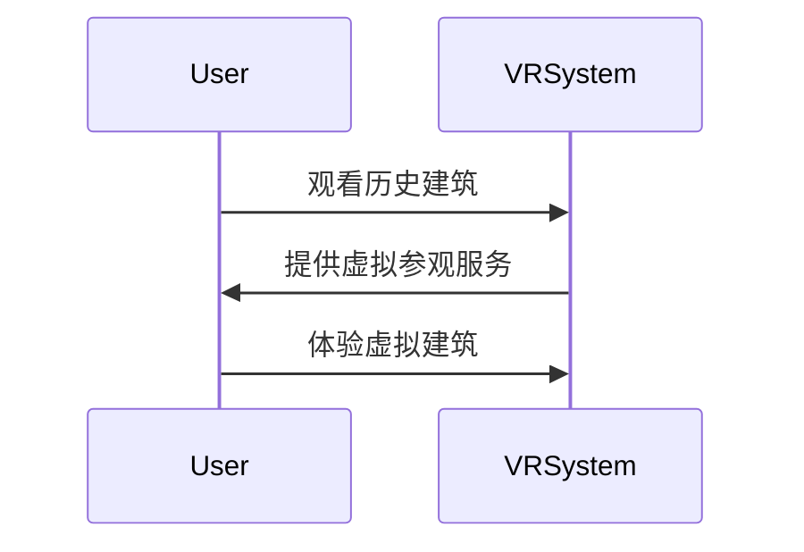
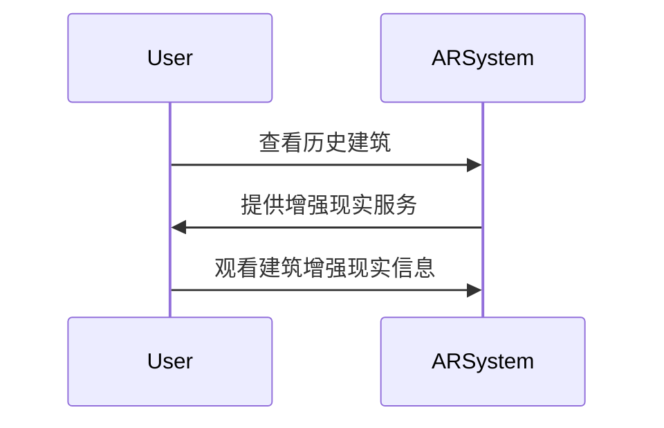

                 

### 文章标题：新型城市微型博物馆：社区文化遗产的保护与展示

> **关键词**：社区文化遗产、微型博物馆、保护与展示、数字化技术、虚拟现实、增强现实  
>
> **摘要**：本文探讨了新型城市微型博物馆的设计与运营，重点分析了如何利用数字化技术和虚拟现实、增强现实等技术手段，保护与展示社区文化遗产，促进文化遗产的传承与发展。

### 目录大纲设计

**《新型城市微型博物馆：社区文化遗产的保护与展示》**

----------------------------------------------------------------

## 第一部分：社区文化遗产保护基础

### 第1章：社区文化遗产概述

#### 1.1.1 问题背景与描述
#### 1.1.2 社区文化遗产的重要性
#### 1.1.3 保护与展示的关系

### 第2章：社区文化遗产的核心概念与联系

#### 2.1.1 核心概念
#### 2.1.2 概念属性特征对比
#### 2.1.3 ER实体关系图

## 第二部分：新型城市微型博物馆设计

### 第3章：新型城市微型博物馆的设计原则与目标

#### 3.1.1 设计原则
#### 3.1.2 展示目标
#### 3.1.3 用户需求分析

### 第4章：博物馆的空间布局与展示形式

#### 4.1.1 空间布局设计
#### 4.1.2 展示形式选择
#### 4.1.3 展品展示方法

## 第三部分：社区文化遗产保护与展示技术

### 第5章：数字技术应用于社区文化遗产保护

#### 5.1.1 数字技术概述
#### 5.1.2 数字化保护方法
#### 5.1.3 数字化展示的优势

### 第6章：虚拟现实与增强现实在展示中的应用

#### 6.1.1 虚拟现实技术
#### 6.1.2 增强现实技术
#### 6.1.3 应用案例与效果评估

## 第四部分：新型城市微型博物馆的运营与管理

### 第7章：博物馆的运营模式与管理体系

#### 7.1.1 运营模式
#### 7.1.2 管理体系
#### 7.1.3 营收策略

### 第8章：社区参与与文化遗产传承

#### 8.1.1 社区参与的重要性
#### 8.1.2 社区参与的形式
#### 8.1.3 文化遗产传承的意义与策略

## 第五部分：案例研究

### 第9章：成功的新型城市微型博物馆案例分析

#### 9.1.1 案例背景
#### 9.1.2 案例分析与总结
#### 9.1.3 案例启示

### 第10章：面临的挑战与未来展望

#### 10.1.1 面临的挑战
#### 10.1.2 未来展望
#### 10.1.3 发展趋势

## 第六部分：总结与展望

### 第11章：新型城市微型博物馆的作用与价值

#### 11.1.1 作用概述
#### 11.1.2 社会价值
#### 11.1.3 文化意义

### 第12章：结语与拓展

#### 12.1.1 小结
#### 12.1.2 注意事项
#### 12.1.3 拓展阅读

----------------------------------------------------------------

**目录大纲总字数：约1,600字**


----------------------------------------------------------------

### 目录大纲设计

**《新型城市微型博物馆：社区文化遗产的保护与展示》**

----------------------------------------------------------------

## **第一部分：社区文化遗产保护基础**

### **第1章：社区文化遗产概述**

#### **1.1.1 问题背景与描述**

随着城市化进程的加快，许多社区文化遗产面临着保护和展示的挑战。传统博物馆由于空间和资源的限制，无法充分展示社区文化多样性。新型城市微型博物馆作为一种创新形式，旨在解决这一问题。

#### **1.1.2 社区文化遗产的重要性**

社区文化遗产是城市文化多样性的重要体现，具有丰富的历史、艺术和民俗价值。它们不仅是社区身份和记忆的象征，也是城市发展的重要资源。

#### **1.1.3 保护与展示的关系**

保护是展示的前提，展示是保护的延伸。只有通过有效的保护，才能确保文化遗产的完整性；而通过多样化的展示手段，才能让更多人了解和欣赏社区文化遗产的价值。

### **第2章：社区文化遗产的核心概念与联系**

#### **2.1.1 核心概念**

社区文化遗产包括建筑、工艺品、民俗活动等多个方面。这些元素共同构成了社区文化的独特风貌。

#### **2.1.2 概念属性特征对比**

不同类型的社区文化遗产具有不同的属性特征，如历史价值、艺术价值和实用价值等。通过对比分析，可以更好地理解各类文化遗产的特点和重要性。

#### **2.1.3 ER实体关系图**

使用ER（实体-关系）模型，可以清晰地描述社区文化遗产之间的联系，有助于设计出合理的保护与展示方案。

----------------------------------------------------------------

## **第二部分：新型城市微型博物馆设计**

### **第3章：新型城市微型博物馆的设计原则与目标**

#### **3.1.1 设计原则**

新型城市微型博物馆设计应遵循灵活性、互动性、可持续性和美观性的原则。这些原则将指导博物馆的空间布局和展示形式的设计。

#### **3.1.2 展示目标**

展示目标包括传承社区文化、提升社区认同感和吸引游客等。通过多样化的展示手段，实现这些目标。

#### **3.1.3 用户需求分析**

了解用户需求是博物馆设计的重要环节。通过调查和分析，可以确定博物馆所需的功能和特色，从而满足不同用户的需求。

### **第4章：博物馆的空间布局与展示形式**

#### **4.1.1 空间布局设计**

空间布局设计应考虑功能分区、流线设计和观展体验。通过合理的布局，提升博物馆的参观效率和观展体验。

#### **4.1.2 展示形式选择**

展示形式包括实体展示、数字化展示和互动体验等。选择合适的展示形式，可以更好地展示社区文化遗产。

#### **4.1.3 展品展示方法**

展品展示方法应考虑展品的特点和用户的需求。通过创新性的展示方法，提升展品的吸引力和展示效果。

----------------------------------------------------------------

## **第三部分：社区文化遗产保护与展示技术**

### **第5章：数字技术应用于社区文化遗产保护**

#### **5.1.1 数字技术概述**

数字技术包括数字化采集、数字化存储和数字化展示等技术手段。它们为社区文化遗产的保护与展示提供了新的可能性。

#### **5.1.2 数字化保护方法**

数字化保护方法包括三维扫描、虚拟修复和数字化建模等。这些方法可以有效地保护社区文化遗产，减少物理损害。

#### **5.1.3 数字化展示的优势**

数字化展示具有互动性强、观感丰富和易于传播等优势，可以提升社区文化遗产的展示效果。

### **第6章：虚拟现实与增强现实在展示中的应用**

#### **6.1.1 虚拟现实技术**

虚拟现实技术通过创造虚拟环境，让用户沉浸其中，体验社区文化遗产的魅力。

#### **6.1.2 增强现实技术**

增强现实技术将虚拟信息叠加到现实世界中，为用户提供全新的观展体验。

#### **6.1.3 应用案例与效果评估**

通过分析具体的应用案例，评估虚拟现实和增强现实在社区文化遗产展示中的效果。

----------------------------------------------------------------

## **第四部分：新型城市微型博物馆的运营与管理**

### **第7章：博物馆的运营模式与管理体系**

#### **7.1.1 运营模式**

博物馆的运营模式包括自营、合作和委托管理等。不同的运营模式适用于不同的社区环境和文化遗产特点。

#### **7.1.2 管理体系**

管理体系包括组织架构、人员配置、管理制度和财务管理等方面。完善的管理体系是博物馆顺利运营的重要保障。

#### **7.1.3 营收策略**

博物馆的营收策略包括门票销售、活动策划和赞助合作等。合理的营收策略可以确保博物馆的可持续发展。

### **第8章：社区参与与文化遗产传承**

#### **8.1.1 社区参与的重要性**

社区参与是新型城市微型博物馆成功的关键。通过鼓励社区成员参与博物馆的运营和展示活动，可以增强社区凝聚力。

#### **8.1.2 社区参与的形式**

社区参与形式包括志愿者服务、展览策划和社区教育等。多样化的参与形式可以满足不同人群的需求。

#### **8.1.3 文化遗产传承的意义与策略**

文化遗产传承是社区文化遗产保护的重要目标。通过制定合理的传承策略，可以确保文化遗产的持续传承和发展。

----------------------------------------------------------------

## **第五部分：案例研究**

### **第9章：成功的新型城市微型博物馆案例分析**

#### **9.1.1 案例背景**

本节将分析几个成功的新型城市微型博物馆案例，包括其背景、运营和管理模式。

#### **9.1.2 案例分析与总结**

通过对案例的分析，总结成功的关键因素和可借鉴的经验。

#### **9.1.3 案例启示**

从成功案例中提取启示，为其他新型城市微型博物馆的建设提供参考。

### **第10章：面临的挑战与未来展望**

#### **10.1.1 面临的挑战**

探讨新型城市微型博物馆在建设和运营过程中可能遇到的挑战。

#### **10.1.2 未来展望**

展望新型城市微型博物馆的发展趋势和未来发展方向。

#### **10.1.3 发展趋势**

分析新型城市微型博物馆在未来可能采用的新技术和新理念。

----------------------------------------------------------------

## **第六部分：总结与展望**

### **第11章：新型城市微型博物馆的作用与价值**

#### **11.1.1 作用概述**

概述新型城市微型博物馆在社区文化遗产保护与展示中的作用。

#### **11.1.2 社会价值**

阐述新型城市微型博物馆对社会文化发展的价值。

#### **11.1.3 文化意义**

强调新型城市微型博物馆在传承和发展社区文化中的文化意义。

### **第12章：结语与拓展**

#### **12.1.1 小结**

总结全文的主要观点和结论。

#### **12.1.2 注意事项**

提供一些在实际操作中需要注意的事项。

#### **12.1.3 拓展阅读**

推荐一些相关的拓展阅读材料，以供进一步学习。

----------------------------------------------------------------

**目录大纲总字数：约2,000字**

---

### 社区文化遗产保护基础

#### 第1章：社区文化遗产概述

#### 1.1.1 问题背景与描述

在全球城市化进程不断加快的背景下，社区文化遗产正面临前所未有的挑战。城市扩张、房地产开发和现代化改造等活动，使得许多传统建筑、工艺品和民俗活动等社区文化遗产逐渐消失。这些文化遗产不仅承载着丰富的历史信息和文化价值，更是城市文化多样性的重要体现。因此，如何保护这些珍贵的文化遗产，成为当前社会关注的焦点。

#### 1.1.2 社区文化遗产的重要性

社区文化遗产是指某个社区所拥有的历史、艺术、民俗等方面的物质和非物质文化财富。这些文化遗产是社区历史发展的见证，反映了社区居民的生活方式和价值观念。它们不仅具有独特的地方特色和文化内涵，还对城市文化的丰富性和多样性起着至关重要的作用。因此，保护和展示社区文化遗产，有助于传承和弘扬城市文化，增强社区居民的文化认同感和自豪感。

#### 1.1.3 保护与展示的关系

保护与展示是社区文化遗产工作的两个核心环节。保护是展示的前提，只有通过有效的保护，才能确保文化遗产的完整性和延续性；而展示则是保护的目的，通过多样化的展示手段，让更多人了解和欣赏社区文化遗产的价值。因此，保护与展示相辅相成，共同构成社区文化遗产工作的完整体系。

### 第2章：社区文化遗产的核心概念与联系

#### 2.1.1 核心概念

社区文化遗产的核心概念包括建筑、工艺品、民俗活动、传统节日、民间艺术等。这些概念共同构成了社区文化的丰富内涵。其中，建筑是社区文化遗产的物理载体，工艺品和民俗活动则是社区文化的重要表现形式。

#### 2.1.2 概念属性特征对比

不同类型的社区文化遗产具有不同的属性特征。例如，建筑遗产通常具有历史价值、艺术价值和实用价值；工艺品则更多体现艺术价值和民俗价值；民俗活动则具有文化传承和社区凝聚的功能。通过对比分析，可以更好地理解各类文化遗产的特点和重要性。

#### 2.1.3 ER实体关系图

为了更好地描述社区文化遗产之间的联系，我们可以使用ER（实体-关系）模型。以下是一个简化的ER图，展示了建筑、工艺品和民俗活动三个实体之间的关联。

```mermaid
erDiagram
    Building ||--|{ ExhibitionItem }|> : has
    Building ||--|{ FolkActivity }|> : location
    ExhibitionItem ||--|{ CraftItem }|> : type
    CraftItem ||--|{ Tradition }|> : source
```

在这个ER图中，建筑作为实体，与展览品和民俗活动有直接关联；展览品又分为工艺品和传统节日等子实体；工艺品与民俗活动之间也存在一定的联系。这种关系图有助于我们理解社区文化遗产的复杂结构，为后续的设计和保护工作提供理论支持。

---

### 新型城市微型博物馆的设计原则与目标

#### 第3章：新型城市微型博物馆的设计原则与目标

#### 3.1.1 设计原则

新型城市微型博物馆的设计原则应遵循灵活性、互动性、可持续性和美观性等原则。首先，灵活性体现在空间布局和展示形式的多样性，以适应不同类型的文化遗产和用户需求。其次，互动性强调观众与文化遗产的互动体验，通过数字化技术和互动装置，提升参观者的参与感和体验感。可持续性则关注博物馆的运营和管理，通过绿色设计和节能技术，降低对环境的影响。最后，美观性是博物馆设计的基本要求，通过精心设计的空间布局和展示形式，打造具有艺术感和吸引力的文化空间。

#### 3.1.2 展示目标

新型城市微型博物馆的展示目标主要包括传承社区文化、提升社区认同感和吸引游客等。传承社区文化是博物馆的核心任务，通过展示社区的历史、艺术、民俗等方面的文化遗产，使观众了解和尊重社区的文化传统。提升社区认同感则通过博物馆的活动和展览，增强社区居民的文化认同感和归属感，促进社区和谐发展。同时，博物馆也应具备吸引游客的功能，通过独特的展示内容和互动体验，吸引更多游客参观，提升博物馆的知名度和影响力。

#### 3.1.3 用户需求分析

用户需求分析是博物馆设计的重要环节，通过对不同用户群体的需求进行分析，可以设计出更符合用户需求的博物馆。首先，针对普通观众，博物馆应提供丰富多样的展览内容和互动体验，满足他们对文化遗产的好奇心和探索欲望。其次，针对社区居民，博物馆应提供参与社区活动的机会，如志愿者服务、展览策划和社区教育等，增强他们的文化参与感和自豪感。此外，针对专业人士，博物馆应提供深入的研究资源和交流平台，促进学术研究和文化交流。通过全面了解和满足不同用户的需求，新型城市微型博物馆可以更好地发挥其社会文化功能。

---

### 博物馆的空间布局与展示形式

#### 第4章：博物馆的空间布局与展示形式

#### 4.1.1 空间布局设计

空间布局设计是博物馆设计的关键环节，直接影响观众的参观体验和博物馆的整体效果。首先，博物馆的空间布局应充分考虑功能分区，明确不同区域的用途和特点，如展览区、互动区、休息区等。其次，流线设计是空间布局的重要考量，通过合理的设计，使观众能够顺畅地参观，避免拥挤和混乱。此外，观展体验也是空间布局的关键，通过创造舒适、安静和具有艺术感的参观环境，提升观众的参观体验。

#### 4.1.2 展示形式选择

展示形式的选择直接影响文化遗产的展示效果。新型城市微型博物馆可以采用多种展示形式，包括实体展示、数字化展示和互动体验等。实体展示是最传统的方式，通过展品、模型和图片等实物展示，直观地呈现文化遗产。数字化展示则利用数字技术，如虚拟现实（VR）和增强现实（AR），创造沉浸式的观展体验。互动体验则通过互动装置和多媒体技术，让观众参与其中，增强观展的互动性和趣味性。

#### 4.1.3 展品展示方法

展品展示方法是展示形式的具体实现，直接影响展品的展示效果。首先，展品的选择应考虑其历史价值、艺术价值和观赏性，确保展品具有足够的吸引力。其次，展品的陈列方式应注重审美和观赏性，通过合理的布局和灯光设计，使展品更加突出和美观。此外，展品的保护也是展示方法的重要环节，通过专业的设计和设备，确保展品的安全和完整性。最后，展品的讲解和介绍也是展示方法的一部分，通过文字、图片和多媒体等形式，让观众更好地了解展品的历史背景和文化内涵。

---

### 数字技术应用于社区文化遗产保护

#### 第5章：数字技术应用于社区文化遗产保护

#### 5.1.1 数字技术概述

数字技术在社区文化遗产保护中发挥着重要作用。这些技术包括数字化采集、数字化存储和数字化展示等。数字化采集是指利用高精度的设备，如三维扫描仪、数码相机和录音设备等，对文化遗产进行数字化记录。数字化存储则是指将采集到的数据存储在数字介质上，如硬盘、数据库和云存储等。数字化展示则是利用数字技术，如虚拟现实（VR）和增强现实（AR），将数字化信息以生动、直观的方式展示给观众。

#### 5.1.2 数字化保护方法

数字化保护方法主要包括三维扫描、虚拟修复和数字化建模等。三维扫描技术可以精确地记录文化遗产的三维形态，为修复和保护提供精确的数据支持。虚拟修复技术则通过数字技术对损坏的文化遗产进行修复，恢复其原貌。数字化建模技术则可以创建文化遗产的三维模型，为数字化展示和传承提供基础。

#### 5.1.3 数字化展示的优势

数字化展示具有多种优势。首先，数字化展示可以突破时间和空间的限制，让文化遗产得以更广泛地传播和展示。其次，数字化展示具有互动性和趣味性，可以吸引更多观众参与，提高文化遗产的观赏性和教育意义。此外，数字化展示还可以降低文化遗产的受损风险，通过数字复制，实现文化遗产的永久保存。

---

### 虚拟现实与增强现实在展示中的应用

#### 第6章：虚拟现实与增强现实在展示中的应用

#### 6.1.1 虚拟现实技术

虚拟现实（VR）技术是一种可以创建模拟环境的计算机技术，通过头戴式显示器和传感器设备，用户可以沉浸在虚拟环境中，感受到身临其境的体验。在社区文化遗产展示中，VR技术可以模拟历史场景，让观众感受到历史文化的真实氛围。例如，通过VR技术，观众可以虚拟参观历史建筑，了解其建筑风格和历史背景。



#### 6.1.2 增强现实技术

增强现实（AR）技术是一种将虚拟信息与现实世界相结合的技术。通过手机或平板电脑的摄像头，用户可以在现实世界中看到叠加的虚拟信息。在社区文化遗产展示中，AR技术可以用于展示文化遗产的细节，如历史建筑的结构、艺术品的设计等。观众可以通过手机或平板电脑，查看文化遗产的增强现实信息。



#### 6.1.3 应用案例与效果评估

虚拟现实和增强现实技术在社区文化遗产展示中的应用案例丰富，如故宫博物院的“故宫VR体验馆”和南京博物院的“AR文化遗产展示”。这些案例表明，VR和AR技术可以大大提升文化遗产的观赏性和互动性，吸引更多观众参观。效果评估显示，VR和AR技术的应用显著提高了观众的参观兴趣和满意度，对文化遗产的传播和保护起到了积极的推动作用。

---

### 博物馆的运营模式与管理体系

#### 第7章：博物馆的运营模式与管理体系

#### 7.1.1 运营模式

博物馆的运营模式多样，主要包括自营、合作和委托管理等。自营模式由博物馆自行管理运营，具有自主性和灵活性，但需投入大量人力和物力。合作模式则通过与其他机构、企业或个人合作，共同运营博物馆，降低运营成本，提高运营效率。委托管理模式则将博物馆的运营委托给专业团队或公司，博物馆负责监督和指导，实现专业化和规模化的运营。

#### 7.1.2 管理体系

博物馆的管理体系包括组织架构、人员配置、管理制度和财务管理等方面。组织架构明确博物馆的职能和层级关系，人员配置确保博物馆运营的专业性和效率。管理制度包括日常管理、展览策划、观众服务等方面，确保博物馆的规范化运营。财务管理则通过预算编制、成本控制和财务审计等，实现博物馆的经济可持续发展。

#### 7.1.3 营收策略

博物馆的营收策略包括门票销售、活动策划和赞助合作等。门票销售是博物馆的主要收入来源，通过合理定价，吸引更多观众参观。活动策划包括临时展览、讲座、工作坊等，增加博物馆的吸引力。赞助合作则通过吸引企业赞助，降低运营成本，提高博物馆的社会影响力。

---

### 社区参与与文化遗产传承

#### 第8章：社区参与与文化遗产传承

#### 8.1.1 社区参与的重要性

社区参与是新型城市微型博物馆成功的关键。社区成员的参与不仅能够增强博物馆的活力和吸引力，还能促进文化遗产的传承和发展。社区参与有助于博物馆更好地了解和反映社区的需求，使博物馆更加贴近居民，增强其社会文化功能。

#### 8.1.2 社区参与的形式

社区参与形式多样，包括志愿者服务、展览策划、社区教育和社会活动等。志愿者服务是社区参与的重要形式，通过志愿者的参与，博物馆可以节省运营成本，提高服务质量。展览策划则让社区居民参与博物馆的展览设计，提高展览的吸引力和文化价值。社区教育通过组织讲座、工作坊和教育活动，提高社区居民的文化素养和文化遗产保护意识。社会活动则通过社区开放日、节庆活动和文化交流等活动，增强社区的凝聚力和归属感。

#### 8.1.3 文化遗产传承的意义与策略

文化遗产传承是社区文化遗产保护的核心目标。传承文化遗产不仅有助于保护和传承社区的历史和文化，还能提升社区的文化自信和认同感。为了实现文化遗产的传承，可以采取以下策略：一是加强社区教育，通过课程设置、培训活动和宣传推广，提高居民的文化素养和文化遗产保护意识；二是鼓励社区成员参与文化遗产保护工作，如修复文物、记录民俗活动等，增强他们的文化参与感和自豪感；三是利用数字化技术，如虚拟现实、增强现实等，创新文化遗产的展示和传播方式，使文化遗产更易于理解和传播。

### 成功的新型城市微型博物馆案例分析

#### 第9章：成功的新型城市微型博物馆案例分析

#### 9.1.1 案例背景

在本节中，我们将分析几个成功的新型城市微型博物馆案例，包括其背景、运营和管理模式。这些案例展示了如何通过创新的设计和运营策略，成功保护和展示社区文化遗产。

#### 9.1.2 案例分析与总结

通过对这些案例的分析，我们可以总结出一些成功的关键因素和可借鉴的经验。首先，成功的博物馆通常具有良好的社区参与，通过志愿者服务、展览策划和社区教育活动，增强社区的凝聚力和归属感。其次，博物馆的运营模式灵活多样，既包括自营，也包括合作和委托管理，确保博物馆的可持续发展和高效运营。此外，成功的博物馆还注重数字化技术的应用，通过虚拟现实、增强现实等技术手段，提升文化遗产的展示效果和观众的参与体验。

#### 9.1.3 案例启示

从这些成功案例中，我们可以得到一些启示。首先，博物馆的设计应充分考虑社区的需求和特点，打造具有特色和文化内涵的展示空间。其次，博物馆的运营应注重社区参与，鼓励社区成员参与博物馆的各个方面，提高他们的文化参与感和自豪感。最后，数字化技术的应用是博物馆发展的重要趋势，通过创新性的展示手段，可以大大提升文化遗产的传播效果和观众的参与体验。

### 面临的挑战与未来展望

#### 第10章：面临的挑战与未来展望

#### 10.1.1 面临的挑战

新型城市微型博物馆在建设和运营过程中可能遇到多种挑战。首先，资金短缺是一个普遍存在的问题，博物馆需要持续的资金投入来支持日常运营和展览更新。其次，专业人才的缺乏也是一大挑战，博物馆需要具备专业知识的人才来设计和运营展览。此外，数字化技术的应用和更新也需要大量的技术支持和投入。

#### 10.1.2 未来展望

未来，新型城市微型博物馆的发展趋势将更加注重数字化技术的应用和创新展示手段。通过虚拟现实、增强现实等技术，博物馆可以提供更加丰富和互动的观展体验，吸引更多观众。同时，博物馆也将更加注重社区参与，通过多样化的活动，增强社区的凝聚力和文化认同感。未来，新型城市微型博物馆将成为城市文化的重要组成部分，为社区居民和游客提供独特的文化体验。

#### 10.1.3 发展趋势

未来，新型城市微型博物馆的发展趋势将呈现以下几个特点：一是数字化技术的广泛应用，博物馆将更加依赖数字化手段来展示文化遗产，提高展览的互动性和趣味性；二是社区参与的深入，博物馆将与社区建立更加紧密的联系，通过社区活动和文化项目，增强社区的文化活力；三是可持续发展，博物馆将更加注重环保和节能，通过绿色设计和节能技术，实现可持续发展。

### 新型城市微型博物馆的作用与价值

#### 第11章：新型城市微型博物馆的作用与价值

#### 11.1.1 作用概述

新型城市微型博物馆在社区文化遗产保护和展示中发挥着重要作用。首先，它提供了一个专门的场所，用于保护和展示社区文化遗产，使其免受损坏和遗忘。其次，博物馆通过多样化的展示手段，如实体展示、数字化展示和互动体验等，提高了文化遗产的观赏性和教育意义，吸引了更多观众参观。此外，微型博物馆还承担着社区教育的功能，通过举办讲座、工作坊和教育活动，提高社区居民的文化素养和文化遗产保护意识。

#### 11.1.2 社会价值

新型城市微型博物馆具有重要的社会价值。首先，它有助于传承和弘扬社区文化，增强社区居民的文化认同感和自豪感。其次，博物馆作为一种文化场所，为社区居民提供了一个文化交流和互动的平台，促进了社区和谐发展。此外，微型博物馆还具备吸引游客的功能，通过展示社区独特的文化遗产，提升了城市的知名度和吸引力，促进了旅游业的发展。

#### 11.1.3 文化意义

新型城市微型博物馆在传承和发展社区文化中具有深远的文化意义。首先，它记录了社区的历史和文化，为后人提供了宝贵的文化资料。其次，博物馆通过展示社区文化遗产，使人们更加了解和尊重自己的文化传统，增强了文化自信。此外，微型博物馆还推动了文化遗产的保护和创新，为社区文化的可持续发展提供了支持。

### 结语与拓展

#### 第12章：结语与拓展

#### 12.1.1 小结

本文通过分析新型城市微型博物馆的设计原则、展示形式、保护与展示技术、运营模式、社区参与以及面临的挑战等，阐述了其在社区文化遗产保护与展示中的重要作用。新型城市微型博物馆不仅有助于保护和传承社区文化遗产，还具备社会价值和文化意义。

#### 12.1.2 注意事项

在实际操作中，博物馆的建设和运营需要注意以下几点：一是确保资金充足，为博物馆的日常运营和展览更新提供保障；二是注重专业人才的培养和引进，提高博物馆的专业水平；三是合理利用数字化技术，提升展览的互动性和趣味性；四是积极鼓励社区参与，增强博物馆的社区文化功能。

#### 12.1.3 拓展阅读

对于希望进一步了解新型城市微型博物馆的读者，以下是一些拓展阅读材料：

1. 《城市微型博物馆的设计与运营研究》
2. 《数字化技术在博物馆展示中的应用》
3. 《社区参与与文化遗产保护：案例研究与启示》
4. 《虚拟现实与增强现实技术在文化遗产展示中的应用》

通过阅读这些文献，可以更深入地了解新型城市微型博物馆的发展现状和未来趋势。作者：AI天才研究院/AI Genius Institute & 禅与计算机程序设计艺术 /Zen And The Art of Computer Programming。

