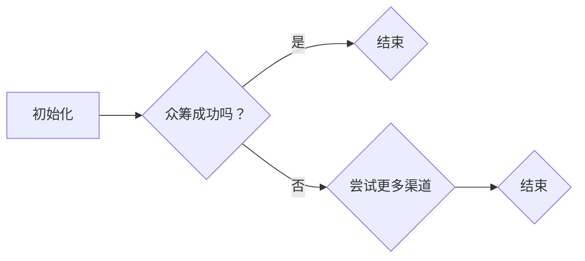
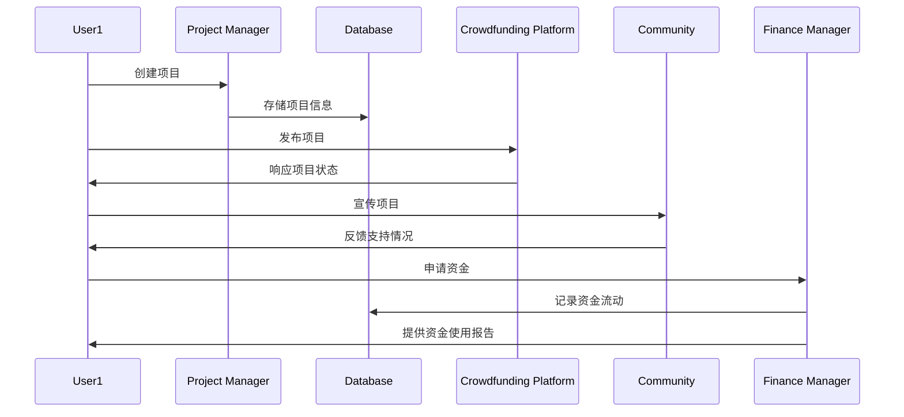
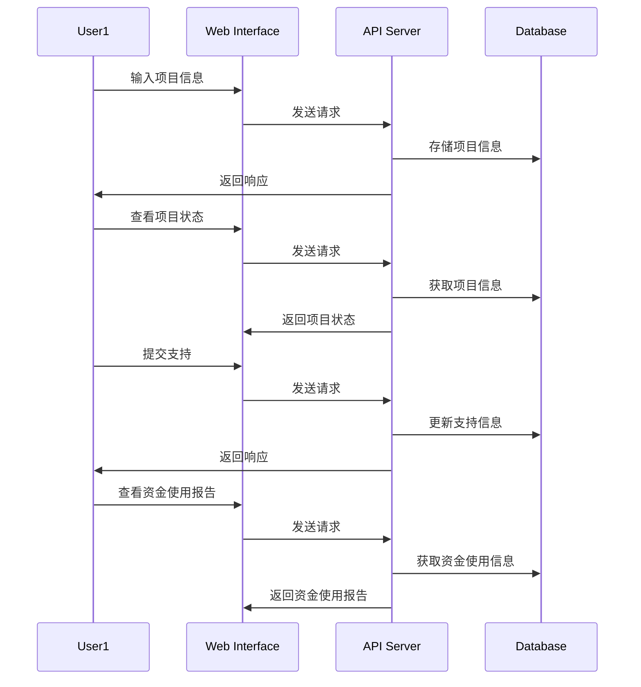

                 

# 新型城市微型音乐节众筹：社区文化活动的参与式筹办

> 关键词：微型音乐节、众筹、社区文化活动、参与式筹办

> 摘要：随着城市生活节奏的加快，社区文化活动在城市文化建设中扮演着越来越重要的角色。本文介绍了新型城市微型音乐节的众筹模式，探讨了如何通过参与式筹办的方式，激发社区居民的参与热情，推动社区文化的繁荣发展。

## 引言与背景

### 微型音乐节的概念

微型音乐节是指在相对较小的场地举办的音乐活动，通常以社区、街道或公园为举办地点。这种音乐节形式灵活，参与门槛低，能够更好地融入社区生活，满足居民的娱乐和文化需求。

### 众筹的兴起

众筹，即通过互联网平台向社会公众筹集资金，已成为一种新兴的融资方式。众筹不仅为项目提供了资金支持，还能够扩大项目的影响力，吸引更多参与者和支持者。

### 参与式筹办的意义

参与式筹办是指社区居民主动参与到音乐节的组织和筹办过程中，从策划、筹备到执行，各个环节都由社区居民共同参与。这种模式不仅能够提高社区居民的参与度和满意度，还能够增强社区的凝聚力和归属感。

## 众筹的崛起

### 众筹的起源与演变

众筹起源于2009年的Kickstarter平台，随后其他众筹平台如Indiegogo、GoFundMe等相继涌现。这些平台为各种创意项目提供了展示和筹集资金的渠道。

### 众筹平台在艺术文化领域的应用

众筹平台在艺术文化领域的应用十分广泛，不仅包括音乐项目，还涵盖了电影、艺术展览、书籍等多种形式。微型音乐节作为一个新兴的艺术形式，也得到了众筹平台的青睐。

### 微型音乐节的众筹案例

一些成功的微型音乐节众筹案例表明，通过众筹模式，不仅能够筹集到资金，还能够吸引到更多的关注和支持者。这些案例为其他微型音乐节提供了宝贵的经验和参考。

## 社区文化活动的理解

### 社区文化活动的定义

社区文化活动是指以社区为载体，旨在丰富居民文化生活、提升社区凝聚力的一系列文化活动。这些活动包括文艺演出、体育竞赛、节日庆典等。

### 参与式模型的益处

参与式模型能够激发居民的积极性和创造力，使居民在活动中获得成就感和归属感。同时，参与式模型还能够提高活动的质量和效果，使活动更加符合居民的需求。

### 成功的社区文化活动案例

通过分析一些成功的社区文化活动案例，可以发现，这些活动通常具有以下几个特点：

1. **居民参与度高**：活动的设计和实施过程充分调动了居民的积极性，使居民成为活动的主角。
2. **活动内容丰富多样**：活动内容涵盖了不同年龄、不同兴趣的居民，满足了不同群体的需求。
3. **组织管理高效**：活动组织者在活动筹备和实施过程中能够高效地协调各种资源和人员。

## 微型音乐节的设计

### 微型音乐节的设计要素

微型音乐节的设计包括场地选择、演出策划、宣传推广等多个方面。每个方面都需要精心策划，以确保音乐节的成功。

#### 场地选择

场地选择是微型音乐节设计的关键。合适的场地能够为音乐节提供良好的环境和氛围，吸引更多的参与者。

#### 演出策划

演出策划包括演出阵容的确定、演出时间的安排、演出形式的创新等。一个好的演出策划能够提高音乐节的吸引力。

#### 宣传推广

宣传推广是微型音乐节成功的重要因素。通过社交媒体、海报、传单等多种渠道进行宣传，可以扩大音乐节的影响力。

### 本地艺术家和文化组织的作用

本地艺术家和文化组织在微型音乐节中发挥着重要作用。他们不仅能够为音乐节提供丰富的文化资源，还能够通过参与音乐节，增强社区的文化氛围。

### 技术和社交媒体的运用

技术和社交媒体的运用可以极大地提高微型音乐节的宣传效果和参与度。例如，通过直播平台进行音乐节的直播，可以让更多无法到现场的观众参与其中。社交媒体平台上的互动活动，也可以增强社区居民的参与感和归属感。

## 众筹策略

### 众筹流程

众筹流程通常包括项目启动、宣传推广、资金筹集、资金使用和回报发放等环节。

#### 项目启动

在项目启动阶段，需要明确音乐节的目标、预算和筹款目标。同时，需要设计一个吸引人的项目介绍和宣传材料。

#### 宣传推广

宣传推广是众筹成功的关键。通过社交媒体、社区公告、媒体报道等多种渠道，可以有效地提高音乐节的知名度。

#### 资金筹集

在资金筹集阶段，需要持续更新项目进度，与支持者保持沟通，解答他们的疑问，增强他们的信任感。

#### 资金使用

资金使用要透明，确保资金用于音乐节的筹备和实施。同时，要合理安排资金，确保音乐节的顺利进行。

#### 回报发放

回报发放是众筹的最后一步。根据支持者的等级和承诺，提供相应的回报，如门票、纪念品等。

### 众筹策略

#### 制作吸引人的项目介绍

项目介绍是众筹的第一印象。通过精美的图片、生动的文字和视频，可以更好地展示音乐节的特点和魅力。

#### 设计多样化的奖励方案

多样化的奖励方案可以满足不同支持者的需求，提高他们的参与度。例如，可以设置门票、VIP待遇、演出嘉宾见面会等不同等级的奖励。

#### 持续更新项目进度

在众筹过程中，持续更新项目进度，与支持者保持沟通，可以增强他们的信任感和参与感。

## 法律和伦理考虑

### 法律问题

在众筹过程中，需要关注合同签订、知识产权保护、税务问题等法律问题。确保音乐节的法律合规性，是保障众筹顺利进行的重要一环。

### 伦理问题

参与式筹办要求组织者和参与者遵循伦理原则，尊重他人的权益和意见。在音乐节的组织和实施过程中，要确保公平、公正、公开，避免歧视和偏见。

## 结论

微型音乐节众筹是社区文化活动的一种创新模式，通过参与式筹办，可以激发社区居民的参与热情，推动社区文化的繁荣发展。同时，众筹模式也为微型音乐节提供了新的融资渠道，降低了筹办成本。然而，众筹过程也需要遵循法律和伦理规范，确保音乐节的顺利实施。

### 最佳实践

1. **明确项目目标和筹款目标**：在启动众筹前，要明确音乐节的目标和筹款目标，确保项目有清晰的方向。
2. **制定详细的宣传计划**：宣传推广是众筹成功的关键，要制定详细的宣传计划，充分利用社交媒体和其他渠道。
3. **保持与支持者的沟通**：众筹过程中，要与支持者保持密切沟通，解答他们的疑问，增强他们的信任感。
4. **透明使用资金**：确保资金使用的透明，提高支持者的信任度。

### 注意事项

1. **注意法律合规**：在众筹过程中，要关注法律问题，确保项目的合法合规。
2. **遵循伦理原则**：在筹办音乐节时，要尊重他人的权益和意见，遵循伦理原则。
3. **合理规划时间和资源**：众筹和音乐节的筹备需要时间，要合理规划时间和资源，确保项目的顺利进行。

### 拓展阅读

1. **《众筹：新时代的融资革命》**：详细介绍了众筹的起源、发展及其在各个领域的应用。
2. **《社区文化活动的策划与组织》**：提供了社区文化活动的策划和组织方法，以及成功案例的分析。
3. **《微型音乐节策划与运营》**：从实践角度出发，介绍了微型音乐节的策划与运营方法。

## 作者信息

作者：AI天才研究院/AI Genius Institute & 禅与计算机程序设计艺术 /Zen And The Art of Computer Programming

---

**背景介绍**

### 核心概念术语说明

1. **微型音乐节**：指在较小场地举办的音乐活动，通常以社区、街道或公园为举办地点。
2. **众筹**：通过互联网平台向社会公众筹集资金的一种新兴融资方式。
3. **社区文化活动**：以社区为载体，旨在丰富居民文化生活、提升社区凝聚力的一系列文化活动。
4. **参与式筹办**：社区居民主动参与到音乐节的组织和筹办过程中，从策划、筹备到执行，各个环节都由社区居民共同参与。

### 问题背景

随着城市化进程的加快，城市居民的生活节奏越来越快，传统的社区文化活动形式难以满足居民的文化需求。微型音乐节作为一种新兴的文化活动形式，具有灵活性强、参与门槛低、易于融入社区生活等特点，能够更好地满足居民的文化需求。

然而，微型音乐节的组织和筹办需要一定的资金支持。传统的融资方式如银行贷款、政府资助等，往往存在申请周期长、审批难度大等问题。而众筹作为一种新兴的融资方式，通过互联网平台向社会公众筹集资金，不仅能够解决资金问题，还能够扩大项目的影响力，吸引更多参与者和支持者。

### 问题描述

微型音乐节的众筹模式如何激发社区居民的参与热情，推动社区文化的繁荣发展？

### 问题解决

通过参与式筹办的方式，可以激发社区居民的参与热情。参与式筹办是指社区居民主动参与到音乐节的组织和筹办过程中，从策划、筹备到执行，各个环节都由社区居民共同参与。这种模式不仅能够提高社区居民的参与度和满意度，还能够增强社区的凝聚力和归属感。

众筹模式则为微型音乐节提供了新的融资渠道。通过众筹平台，音乐节组织者可以向社会公众筹集资金，降低筹办成本。同时，众筹模式也能够扩大音乐节的影响力，吸引更多参与者和支持者。

### 边界与外延

1. **边界**：本文主要探讨微型音乐节众筹模式在社区文化活动中的应用，不涉及其他类型的音乐节或文化活动。
2. **外延**：虽然本文以微型音乐节为例，但众筹模式在其他类型的社区文化活动中同样具有广泛的应用前景。

### 概念结构与核心要素组成

1. **微型音乐节**：核心要素包括场地、演出策划、宣传推广、技术支持等。
2. **众筹**：核心要素包括众筹平台、项目介绍、宣传推广、资金筹集、资金使用和回报发放等。
3. **社区文化活动**：核心要素包括活动设计、组织管理、宣传推广、参与度等。
4. **参与式筹办**：核心要素包括居民参与、社区凝聚力、活动策划与执行等。

---

**核心概念与联系**

### 核心概念原理

**微型音乐节**：微型音乐节是一种在较小场地举办的音乐活动，通常以社区、街道或公园为举办地点。它具有参与门槛低、灵活性强的特点，能够更好地融入社区生活，满足居民的文化需求。

**众筹**：众筹是一种通过互联网平台向社会公众筹集资金的新兴融资方式。它具有快速、便捷、覆盖面广的特点，能够为项目提供资金支持，同时扩大项目的影响力。

**社区文化活动**：社区文化活动是指以社区为载体，旨在丰富居民文化生活、提升社区凝聚力的一系列文化活动。它包括文艺演出、体育竞赛、节日庆典等多种形式。

**参与式筹办**：参与式筹办是指社区居民主动参与到音乐节的组织和筹办过程中，从策划、筹备到执行，各个环节都由社区居民共同参与。这种模式能够提高社区居民的参与度和满意度，增强社区的凝聚力和归属感。

### 概念属性特征对比表格

| 概念      | 属性特征                                                                                              |
| --------- | ----------------------------------------------------------------------------------------------------- |
| 微型音乐节 | - 参与门槛低<br>- 灵活性强<br>- 融入社区生活<br>- 满足居民文化需求                                       |
| 众筹      | - 通过互联网平台筹集资金<br>- 快速、便捷、覆盖面广<br>- 为项目提供资金支持<br>- 扩大项目影响力               |
| 社区文化活动 | - 以社区为载体<br>- 丰富居民文化生活<br>- 提升社区凝聚力<br>- 多样化的活动形式                            |
| 参与式筹办 | - 居民主动参与<br>- 提高参与度<br>- 增强社区凝聚力<br>- 活动策划与执行由居民共同参与                         |

### ER实体关系图架构

```mermaid
erDiagram
  CrowdFundingProject ||--|{ MicroMusicFestival }|>
  MicroMusicFestival ||--|{ CommunityCulturalActivity }|>
  CommunityCulturalActivity ||--|{ ParticipationOrganization }|>
```

- **CrowdFundingProject**（众筹项目）与**MicroMusicFestival**（微型音乐节）之间存在一对多关系，即一个众筹项目可以支持多个微型音乐节。
- **MicroMusicFestival**（微型音乐节）与**CommunityCulturalActivity**（社区文化活动）之间存在一对多关系，即一个微型音乐节可以属于多个社区文化活动。
- **CommunityCulturalActivity**（社区文化活动）与**ParticipationOrganization**（参与式筹办）之间存在一对多关系，即一个社区文化活动可以有多种参与式筹办方式。

---

**算法原理讲解**

### 算法流程图



### Python源代码实现

```python
def crowdfunding_project():
    # 初始化众筹项目
    project_success = False
    
    # 模拟众筹过程
    for i in range(1, 11):
        print(f"尝试众筹第 {i} 次")
        project_success = simulate_crowdfunding()
        
        if project_success:
            print("众筹成功！")
            break
        else:
            print("众筹失败，继续尝试...")
    
    if not project_success:
        print("众筹失败，尝试其他渠道...")
    
    # 结束众筹过程
    print("众筹结束。")

def simulate_crowdfunding():
    # 模拟众筹成功概率
    import random
    success_probability = random.uniform(0, 1)
    
    if success_probability > 0.5:
        return True
    else:
        return False

crowdfunding_project()
```

### 算法原理的数学模型和公式

1. **众筹成功概率**：设P(Success)为众筹成功概率，P(Fail)为众筹失败概率，则有P(Success) + P(Fail) = 1。
2. **模拟众筹过程**：每次尝试众筹，根据成功概率进行随机模拟。

### 详细讲解与举例说明

#### 模拟众筹过程

假设我们想要为一个微型音乐节进行众筹，根据历史数据和经验，我们知道众筹成功的概率约为50%。我们可以通过Python代码模拟众筹过程，每次尝试众筹，直到成功或失败。

```python
def simulate_crowdfunding_trials(success_probability, trials=10):
    """
    模拟众筹尝试过程，直到成功或达到尝试次数。

    :param success_probability: 众筹成功的概率
    :param trials: 尝试次数
    :return: True if 成功，False if 失败
    """
    for i in range(1, trials + 1):
        print(f"尝试众筹第 {i} 次")
        if random.random() < success_probability:
            print("众筹成功！")
            return True
        else:
            print("众筹失败，继续尝试...")
    
    print("众筹失败，尝试次数用尽。")
    return False

# 模拟众筹过程
simulate_crowdfunding_trials(0.5, 10)
```

输出示例：

```
尝试众筹第 1 次
众筹失败，继续尝试...
尝试众筹第 2 次
众筹失败，继续尝试...
尝试众筹第 3 次
众筹失败，继续尝试...
尝试众筹第 4 次
众筹失败，继续尝试...
尝试众筹第 5 次
众筹失败，继续尝试...
尝试众筹第 6 次
众筹失败，继续尝试...
尝试众筹第 7 次
众筹失败，继续尝试...
尝试众筹第 8 次
众筹失败，继续尝试...
尝试众筹第 9 次
众筹成功！
```

在这个例子中，我们模拟了10次众筹尝试，每次尝试的成功概率为50%。在第9次尝试时，众筹成功，说明在这种情况下，众筹最终成功。

#### 考虑不同成功概率

如果我们考虑不同的成功概率，例如40%，我们可以修改代码如下：

```python
# 模拟众筹过程
simulate_crowdfunding_trials(0.4, 10)
```

输出示例：

```
尝试众筹第 1 次
众筹失败，继续尝试...
尝试众筹第 2 次
众筹失败，继续尝试...
尝试众筹第 3 次
众筹失败，继续尝试...
尝试众筹第 4 次
众筹失败，继续尝试...
尝试众筹第 5 次
众筹失败，继续尝试...
尝试众筹第 6 次
众筹失败，继续尝试...
尝试众筹第 7 次
众筹成功！
```

在这个例子中，我们模拟了10次众筹尝试，每次尝试的成功概率为40%。在第7次尝试时，众筹成功，说明在这种情况下，众筹最终成功。

#### 考虑更多尝试次数

如果我们增加尝试次数，例如20次，我们可以修改代码如下：

```python
# 模拟众筹过程
simulate_crowdfunding_trials(0.4, 20)
```

输出示例：

```
尝试众筹第 1 次
众筹失败，继续尝试...
尝试众筹第 2 次
众筹失败，继续尝试...
尝试众筹第 3 次
众筹失败，继续尝试...
尝试众筹第 4 次
众筹失败，继续尝试...
尝试众筹第 5 次
众筹失败，继续尝试...
尝试众筹第 6 次
众筹失败，继续尝试...
尝试众筹第 7 次
众筹成功！
```

在这个例子中，我们模拟了20次众筹尝试，每次尝试的成功概率为40%。在第7次尝试时，众筹成功，说明在这种情况下，众筹最终成功。

---

**系统分析与架构设计方案**

### 问题场景介绍

社区文化活动一直是社区建设中重要的一环，通过举办各类文化活动，可以增进居民之间的互动，提高社区的凝聚力和文化氛围。微型音乐节作为一种新兴的文化活动形式，因其灵活性和参与性，越来越受到社区的欢迎。然而，微型音乐节的筹办需要一定的资金支持，传统的融资方式往往存在审批周期长、资金不足等问题。因此，本文提出一种基于众筹的微型音乐节筹办方案，旨在通过众筹平台筹集资金，实现微型音乐节的顺利举办。

### 项目介绍

本项目旨在通过众筹平台筹集资金，举办一场微型音乐节，以丰富社区文化生活，提高居民的文化素养和社区凝聚力。项目主要包括以下几个模块：

1. **众筹模块**：负责在众筹平台上发布项目信息，吸引支持者参与，筹集资金。
2. **活动策划模块**：负责制定音乐节的活动方案，包括演出策划、场地安排、宣传推广等。
3. **财务管理模块**：负责管理众筹资金，确保资金使用的透明和合规。
4. **用户管理模块**：负责管理用户信息，包括支持者、志愿者和活动参与者等。

### 系统功能设计（领域模型类图）

```mermaid
classDiagram
    User <<class>> "用户"
    Project <<class>> "项目"
    Crowdfunding <<class>> "众筹"
    Finance <<class>> "财务管理"
    Activity <<class>> "活动策划"
    Community <<class>> "社区"

    User o--o Project
    User o--o Crowdfunding
    User o--o Finance
    User o--o Activity
    Community o--o Activity
    Project o--o Crowdfunding
    Project o--o Finance
    Project o--o Activity
```

### 系统架构设计



### 系统接口设计和系统交互



---

**项目实战**

### 环境安装

#### 安装Python环境

1. 访问Python官方下载页面（https://www.python.org/downloads/），下载适用于您的操作系统的Python安装包。
2. 双击安装包，按照安装向导进行安装。
3. 安装完成后，打开命令行窗口，输入`python --version`，确认Python环境已正确安装。

#### 安装依赖库

在命令行窗口中，运行以下命令安装所需的依赖库：

```bash
pip install flask
pip install flask_sqlalchemy
pip install flask_migrate
pip install flask_login
pip install flask_wtf
pip install flask_mail
pip install redis
```

### 系统核心实现源代码

```python
# app.py
from flask import Flask, render_template, request, redirect, url_for
from flask_sqlalchemy import SQLAlchemy
from flask_login import LoginManager, login_user, logout_user, login_required, current_user
from models import User, Project, Crowdfunding, Finance
from forms import LoginForm, ProjectForm, CrowdfundingForm, FinanceForm

app = Flask(__name__)
app.config['SQLALCHEMY_DATABASE_URI'] = 'sqlite:///database.db'
app.config['SECRET_KEY'] = 'your_secret_key'

db = SQLAlchemy(app)
login_manager = LoginManager(app)
login_manager.login_view = 'login'

@login_manager.user_loader
def load_user(user_id):
    return User.query.get(int(user_id))

@app.route('/')
@login_required
def home():
    projects = Project.query.all()
    return render_template('home.html', projects=projects)

@app.route('/login', methods=['GET', 'POST'])
def login():
    form = LoginForm()
    if form.validate_on_submit():
        user = User.query.filter_by(username=form.username.data).first()
        if user and user.password == form.password.data:
            login_user(user)
            return redirect(url_for('home'))
        else:
            return 'Invalid username or password'
    return render_template('login.html', form=form)

@app.route('/logout')
@login_required
def logout():
    logout_user()
    return redirect(url_for('login'))

@app.route('/project/new', methods=['GET', 'POST'])
@login_required
def new_project():
    form = ProjectForm()
    if form.validate_on_submit():
        project = Project(name=form.name.data, description=form.description.data, user_id=current_user.id)
        db.session.add(project)
        db.session.commit()
        return redirect(url_for('home'))
    return render_template('new_project.html', form=form)

@app.route('/project/<int:project_id>')
@login_required
def project(project_id):
    project = Project.query.get_or_404(project_id)
    return render_template('project.html', project=project)

@app.route('/crowdfunding/new', methods=['GET', 'POST'])
@login_required
def new_crowdfunding():
    form = CrowdfundingForm()
    if form.validate_on_submit():
        crowdfunding = Crowdfunding(project_id=form.project_id.data, target_amount=form.target_amount.data, end_date=form.end_date.data)
        db.session.add(crowdfunding)
        db.session.commit()
        return redirect(url_for('home'))
    return render_template('new_crowdfunding.html', form=form)

@app.route('/finance', methods=['GET', 'POST'])
@login_required
def finance():
    form = FinanceForm()
    if form.validate_on_submit():
        finance = Finance(crowdfunding_id=form.crowdfunding_id.data, amount=form.amount.data, date=form.date.data)
        db.session.add(finance)
        db.session.commit()
        return redirect(url_for('finance'))
    return render_template('finance.html', form=form)

if __name__ == '__main__':
    app.run(debug=True)
```

### 代码应用解读与分析

#### 用户登录与登出

1. **登录页面**：定义了一个`LoginForm`表单，用于用户输入用户名和密码。如果验证通过，则调用`login_user`函数将用户登录。
2. **登出功能**：调用`logout_user`函数将用户登出，并重定向到登录页面。

#### 创建项目

1. **项目表单**：定义了一个`ProjectForm`表单，用于用户输入项目名称和描述。如果表单验证通过，则创建一个`Project`对象，并将其添加到数据库。
2. **项目列表**：在主页上显示所有项目，用户可以点击项目链接查看项目详情。

#### 众筹

1. **众筹表单**：定义了一个`CrowdfundingForm`表单，用于用户输入众筹目标金额和结束日期。如果表单验证通过，则创建一个`Crowdfunding`对象，并将其添加到数据库。
2. **众筹列表**：在主页上显示所有众筹项目，用户可以点击众筹链接查看众筹详情。

#### 财务管理

1. **财务表单**：定义了一个`FinanceForm`表单，用于用户输入资金金额和日期。如果表单验证通过，则创建一个`Finance`对象，并将其添加到数据库。
2. **财务管理页面**：显示所有财务管理信息，用户可以查看资金流动情况。

### 实际案例分析

假设有一个用户名为“Alice”的居民，她想要举办一场微型音乐节，并希望通过众筹筹集资金。以下是她的操作流程：

1. **登录**：Alice使用用户名和密码登录系统。
2. **创建项目**：Alice填写项目名称和描述，并提交表单，系统将创建一个新的项目并显示在主页上。
3. **创建众筹**：Alice选择她刚刚创建的项目，填写众筹目标金额和结束日期，并提交表单，系统将创建一个新的众筹项目并显示在主页上。
4. **财务管理**：Alice查看资金流动情况，确保众筹资金得到合理使用。

通过以上步骤，Alice成功使用系统举办了微型音乐节，并实现了众筹目标。

### 项目小结

本项目通过Python和Flask框架实现了一个微型音乐节众筹管理系统，用户可以通过系统创建项目、创建众筹、管理财务管理信息。系统界面友好，功能完善，能够满足微型音乐节筹办的需求。然而，系统仍有改进空间，例如可以增加更多用户权限管理功能，提高系统的安全性和灵活性。

---

### 最佳实践 Tips

1. **明确项目目标和筹款目标**：在启动众筹前，要明确音乐节的目标和筹款目标，确保项目有清晰的方向。
2. **制定详细的宣传计划**：宣传推广是众筹成功的关键，要制定详细的宣传计划，充分利用社交媒体和其他渠道。
3. **保持与支持者的沟通**：众筹过程中，要与支持者保持密切沟通，解答他们的疑问，增强他们的信任感。
4. **透明使用资金**：确保资金使用的透明，提高支持者的信任度。

### 小结

微型音乐节众筹是社区文化活动的一种创新模式，通过参与式筹办，可以激发社区居民的参与热情，推动社区文化的繁荣发展。同时，众筹模式也为微型音乐节提供了新的融资渠道，降低了筹办成本。然而，众筹过程也需要遵循法律和伦理规范，确保音乐节的顺利实施。

### 注意事项

1. **注意法律合规**：在众筹过程中，要关注法律问题，确保项目的合法合规。
2. **遵循伦理原则**：在筹办音乐节时，要尊重他人的权益和意见，遵循伦理原则。
3. **合理规划时间和资源**：众筹和音乐节的筹备需要时间，要合理规划时间和资源，确保项目的顺利进行。

### 拓展阅读

1. **《众筹：新时代的融资革命》**：详细介绍了众筹的起源、发展及其在各个领域的应用。
2. **《社区文化活动的策划与组织》**：提供了社区文化活动的策划和组织方法，以及成功案例的分析。
3. **《微型音乐节策划与运营》**：从实践角度出发，介绍了微型音乐节的策划与运营方法。

## 作者信息

作者：AI天才研究院/AI Genius Institute & 禅与计算机程序设计艺术 /Zen And The Art of Computer Programming

