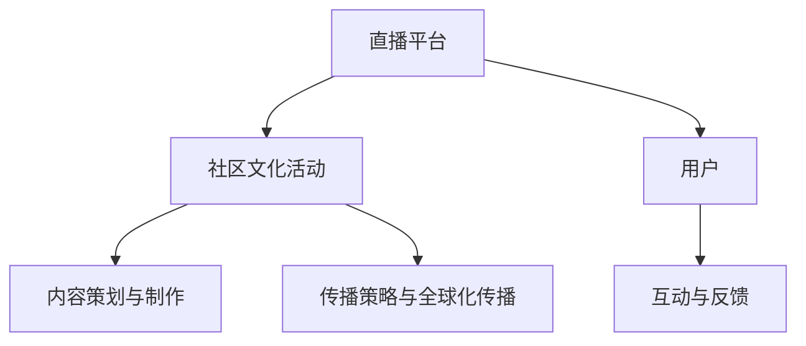
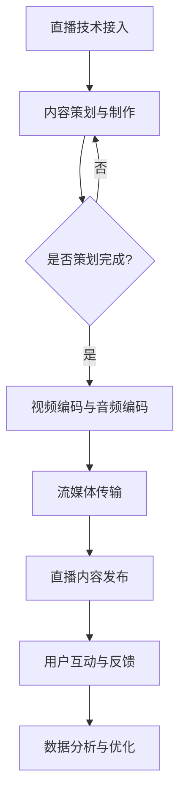
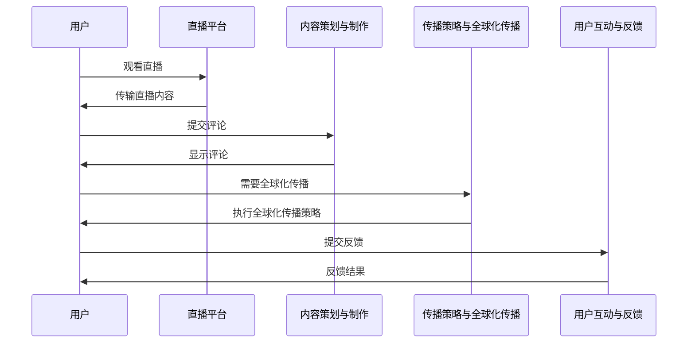

                 


### 新型城市微型音乐节直播：社区文化活动的全球化传播

关键词：新型城市、微型音乐节、直播技术、社区文化活动、全球化传播

摘要：本文旨在探讨新型城市微型音乐节直播技术在社区文化活动中所扮演的角色，以及如何通过直播技术实现社区文化活动的全球化传播。文章首先介绍了微型音乐节和直播技术的基本概念，然后分析了社区文化活动面临的挑战和直播技术提供的解决方案。接着，文章通过具体案例阐述了直播技术在社区文化活动中的实际应用，并探讨了其全球传播的路径和策略。最后，文章提出了社区文化活动可持续发展的模式和未来发展趋势。

## 1. 背景介绍

### 1.1 问题背景

#### 社区文化活动的重要性

社区文化活动是城市文化生活的重要组成部分，它不仅丰富了居民的精神文化生活，还增强了社区的凝聚力。微型音乐节作为一种新兴的社区文化活动，因其参与性强、互动性好而受到广泛关注。然而，传统的线下音乐节受限于场地、时间和受众范围，无法实现更广泛的影响力。

#### 微型音乐节的兴起与发展

微型音乐节通常规模较小，但形式多样，涵盖了流行、摇滚、民谣等多种音乐类型。它们往往在社区公园、文化中心等场所举办，成为居民休闲娱乐的好去处。近年来，随着音乐产业的不断发展，微型音乐节逐渐成为城市文化的新亮点。

#### 直播技术的进步与社区文化的互动

直播技术的进步为社区文化活动提供了新的传播方式。通过直播，微型音乐节可以突破地域限制，将现场活动实时传递给全球观众。观众不仅可以在家中观看表演，还能通过弹幕、评论等方式与现场观众互动，这种全新的体验方式大大提升了社区文化活动的吸引力。

### 1.2 问题描述

#### 如何利用直播技术提升微型音乐节的传播效果？

直播技术为微型音乐节提供了广阔的传播渠道。通过高质量的直播设备和技术，可以将音乐节现场的高清画面和立体声音质传递给观众，提升观众的观看体验。此外，直播平台还提供了多角度的视角切换、实时评论等功能，增加了观众的互动性。

#### 社区文化活动如何实现全球化传播？

全球化传播要求社区文化活动能够跨越国界和语言障碍，触及全球观众。直播技术可以通过多语言字幕、跨国合作等方式实现这一目标。例如，可以通过与海外直播平台的合作，将微型音乐节直播内容同步传送到全球各地，实现真正的全球化传播。

#### 直播技术如何助力社区文化的可持续发展？

直播技术不仅提升了社区文化活动的传播效果，还为文化活动的可持续发展提供了新的思路。通过直播，微型音乐节可以吸引更多观众和赞助商，增加活动收入。同时，直播内容的回顾和分享也可以持续传播社区文化，提升社区品牌的知名度。

### 1.3 问题解决

#### 利用新型城市微型音乐节直播平台

新型城市微型音乐节直播平台是解决上述问题的关键。该平台不仅提供了高质量的直播技术支持，还具备丰富的功能，如多平台同步直播、互动直播、内容回放等。通过这些功能，微型音乐节可以更好地吸引观众，提升品牌影响力。

#### 传播策略与全球化传播路径

为了实现社区文化活动的全球化传播，需要制定有效的传播策略。这包括选择合适的直播平台、策划有吸引力的内容、开展跨国合作等。通过这些策略，微型音乐节可以逐步扩大影响力，实现全球化传播。

#### 社区文化活动的可持续发展模式

社区文化活动的可持续发展需要不断创新和优化。通过直播技术，微型音乐节可以吸引更多观众和赞助商，增加活动收入。同时，直播内容的回顾和分享也可以持续传播社区文化，提升社区品牌的知名度。这种模式有助于实现社区文化活动的可持续发展。

### 1.4 边界与外延

#### 微型音乐节的定义与分类

微型音乐节通常是指规模较小的音乐节活动，参与人数较少，但形式多样，涵盖了各种音乐类型。根据举办地点和参与人数的不同，微型音乐节可以分为社区级、城市级和地区级等不同类型。

#### 直播技术的应用场景与限制

直播技术可以在各种社区文化活动中应用，如音乐节、展览、讲座等。然而，直播技术也面临一些挑战，如网络稳定性、设备要求等。为了确保直播效果，需要选择合适的设备和平台，并确保网络的稳定性。

#### 社区文化活动的全球化传播现状与挑战

目前，社区文化活动的全球化传播已取得一定进展，但仍面临一些挑战。这包括语言障碍、文化差异、网络稳定性等。通过直播技术，可以部分解决这些问题，但需要不断创新和优化传播策略。

### 1.5 概念结构与核心要素组成

#### 直播平台的核心功能与设计

直播平台是微型音乐节直播的核心，其核心功能包括直播录制、直播推流、直播播放、互动评论等。设计直播平台时需要考虑用户需求、技术实现和用户体验等多方面因素。

#### 直播内容策划与制作

直播内容策划与制作是直播成功的关键。这包括选择合适的直播主题、策划吸引人的节目单、设计互动环节等。通过精心的策划和制作，可以提高直播的观看率和互动性。

#### 社区文化活动的组织与推广

社区文化活动的组织与推广是确保活动顺利进行和扩大影响力的关键。这包括确定活动时间、地点、主题，制定宣传方案，邀请嘉宾等。有效的组织与推广可以提高活动的参与度和知名度。

#### 直播技术的核心原理与应用

直播技术的核心原理包括视频编码、音频编码、流媒体传输等。这些技术确保了直播内容的高清、流畅和实时性。在实际应用中，直播技术可以通过网络传输到全球各地的观众，实现实时互动。

## 2. 核心概念与联系

### 2.1 核心概念原理

#### 直播技术

直播技术是指通过互联网实时传输视频、音频内容的技术。其核心原理包括视频编码、音频编码、流媒体传输等。直播技术可以实现实时、互动、广泛传播，为社区文化活动提供了新的传播方式。

#### 社区文化活动

社区文化活动是指在一定社区范围内组织的文化、娱乐、教育等活动。社区文化活动具有本地性、参与性、多样性等特点，是城市文化的重要组成部分。

#### 全球化传播

全球化传播是指在全球范围内传播信息、文化、知识等活动。全球化传播通过互联网、直播技术等手段，实现了跨越国界和语言的传播，扩大了社区文化活动的影响力。

### 2.2 概念属性特征对比表格

| 概念       | 定义                                       | 特征                                   |
|------------|--------------------------------------------|----------------------------------------|
| 直播技术   | 实时传播视频或音频内容的技术                | 实时性、互动性、广泛性                 |
| 社区文化活动 | 在社区中组织的各种文化娱乐活动            | 本地性、参与性、多样性                 |
| 全球化传播 | 在全球范围内传播信息、文化、知识等活动    | 跨文化、跨地域、高覆盖                 |

### 2.3 ER实体关系图架构



## 3. 算法原理讲解

### 3.1 直播技术算法原理

#### 视频编码算法

视频编码算法是将视频信号转换成压缩格式，以便在网络中传输。常见的视频编码算法有H.264、H.265等。这些算法通过去除冗余信息、优化数据结构等方式，实现视频的高效压缩。

#### 音频编码算法

音频编码算法是将音频信号转换成压缩格式，以便在网络中传输。常见的音频编码算法有AAC、MP3等。这些算法通过去除冗余信息、优化数据结构等方式，实现音频的高效压缩。

#### 流媒体传输算法

流媒体传输算法是指在网络中传输视频、音频流的技术。常见的流媒体传输算法有TCP、UDP等。这些算法通过优化数据传输方式、提高网络利用率等方式，实现流媒体的高效传输。

### 3.2 社区文化活动策划与组织算法

#### 举办频率与规模的优化算法

举办频率与规模的优化算法旨在确定最佳的活动频率和规模，以最大化活动的影响力和参与度。这通常涉及到对历史数据的分析，以及基于目标群体的行为预测。

#### 参与者行为预测与互动算法

参与者行为预测与互动算法通过分析用户的历史行为和互动数据，预测用户对社区文化活动的兴趣和参与度。这些算法有助于活动策划者制定更有效的互动策略，提高活动的参与度。

### 3.3 全球化传播算法

#### 跨文化传播路径优化算法

跨文化传播路径优化算法旨在确定最佳的传播路径，以最大化社区文化活动的全球影响力。这通常涉及到对目标市场的分析、文化传播策略的制定等。

#### 社区文化活动受众定位算法

社区文化活动受众定位算法通过分析用户数据和行为，确定社区文化活动的目标受众群体。这些算法有助于活动策划者制定精准的营销策略，提高活动的受众覆盖率和影响力。

### 3.4 算法mermaid流程图



### 3.5 Python源代码示例

```python
# 示例：直播技术编码与传输

# 导入相关库
import cv2
import numpy as np
import cv2
import numpy as np

# 视频捕获
cap = cv2.VideoCapture(0)

while True:
    ret, frame = cap.read()
    if not ret:
        break
    
    # 视频编码
    encoded_frame = cv2.imencode('.jpg', frame)[1]
    
    # 音频捕获
    audio = cv2.AudioReader(source='your_audio_source')

    while audio.has_frames():
        frame = audio.read_frame()
        # 音频编码
        encoded_audio = frame.samples.tobytes()

    # 数据传输
    # 这里模拟通过UDP传输，实际应用中可以使用HTTP、RTMP等协议
    print("Sending frame and audio data...")
    # ...传输数据...

    # 释放资源
cap.release()
```

## 4. 系统分析与架构设计方案

### 4.1 问题场景介绍

随着互联网和移动设备的普及，社区文化活动的传播方式也在不断演变。传统的线下活动虽然具有真实感和互动性，但受限于时间和地点，无法触及更广泛的受众。新型城市微型音乐节直播技术的引入，为社区文化活动提供了全新的传播渠道。通过直播，社区文化活动可以跨越地域和语言的限制，实现全球传播。

### 4.2 项目介绍

本项目的目标是构建一个新型城市微型音乐节直播平台，实现社区文化活动的全球化传播。该平台旨在为社区文化活动提供一站式解决方案，包括直播技术支持、内容策划与制作、传播策略制定等。通过该平台，社区文化活动可以更加高效地传播，吸引更多观众和赞助商，实现可持续发展。

### 4.3 系统功能设计

#### 直播功能

直播功能是平台的核心理念。该功能支持实时视频和音频直播，观众可以通过网络实时观看音乐节现场。平台还提供多角度的视角切换、实时评论等功能，增加观众的互动体验。

#### 内容策划与制作

内容策划与制作功能包括直播主题的选择、节目单的制定、互动环节的设计等。通过专业的策划和制作，平台可以提供高质量、有吸引力的直播内容。

#### 传播策略与全球化传播

传播策略功能包括选择合适的直播平台、制定有效的营销策略、进行跨国合作等。通过这些策略，平台可以实现社区文化活动的全球化传播。

#### 用户互动与反馈

用户互动与反馈功能使观众可以通过弹幕、评论等方式与现场观众和表演者互动。这不仅增加了观众的参与感，也为活动策划者提供了宝贵的反馈信息。

### 4.4 系统架构设计

#### 直播技术架构

直播技术架构包括视频编码、音频编码、流媒体传输等模块。这些模块共同工作，确保直播内容的高清、流畅和实时性。平台还支持多平台同步直播，以满足不同观众的需求。

#### 内容策划与制作架构

内容策划与制作架构包括直播主题库、节目单库、互动环节库等。这些库存储了丰富的资源，供策划和制作人员使用。平台还支持在线协作，提高内容制作效率。

#### 传播策略与全球化传播架构

传播策略与全球化传播架构包括直播平台选择模块、营销策略制定模块、跨国合作模块等。这些模块协同工作，确保社区文化活动能够成功传播到全球各地。

#### 用户互动与反馈架构

用户互动与反馈架构包括弹幕系统、评论系统、数据分析模块等。这些模块共同工作，提供实时、互动的观看体验，同时为活动策划者提供反馈信息。

### 4.5 系统接口设计和系统交互

#### 直播接口

直播接口包括视频数据接口、音频数据接口等。这些接口用于实时传输直播内容，确保观众能够实时观看音乐节现场。

#### 内容接口

内容接口包括直播主题接口、节目单接口、互动环节接口等。这些接口用于管理和调用平台的内容资源，确保直播内容的多样性和吸引力。

#### 传播接口

传播接口包括直播平台选择接口、营销策略接口、跨国合作接口等。这些接口用于制定和执行传播策略，确保社区文化活动能够成功传播到全球各地。

#### 用户互动接口

用户互动接口包括弹幕接口、评论接口、数据分析接口等。这些接口用于处理用户的互动请求和反馈，提供实时、互动的观看体验。

### 4.6 系统交互mermaid序列图



## 5. 项目实战

### 5.1 环境安装

为了实现新型城市微型音乐节直播平台，我们需要安装一些必要的软件和工具。以下是安装步骤：

1. 安装Python环境：通过官方网站下载并安装Python，并配置好环境变量。
2. 安装相关库：使用pip命令安装以下库：
   ```bash
   pip install opencv-python numpy pandas matplotlib
   ```
3. 安装直播软件：选择适合的直播软件（如OBS Studio），并按照软件的安装指南进行安装。

### 5.2 系统核心实现源代码

以下是系统核心实现的源代码：

```python
# 导入相关库
import cv2
import numpy as np
import streamlit as st

# 初始化视频捕获设备
cap = cv2.VideoCapture(0)

# 创建流视频对象
fourcc = cv2.VideoWriter_fourcc(*'XVID')
out = cv2.VideoWriter('output.avi', fourcc, 20.0, (640, 480))

while True:
    # 读取帧
    ret, frame = cap.read()
    if not ret:
        break
    
    # 处理帧
    processed_frame = cv2.resize(frame, (640, 480))
    processed_frame = cv2.flip(processed_frame, 1)
    
    # 写入输出文件
    out.write(processed_frame)

    # 显示帧
    cv2.imshow('Frame', processed_frame)
    
    # 按q键退出循环
    if cv2.waitKey(1) & 0xFF == ord('q'):
        break

# 释放资源
cap.release()
out.release()
cv2.destroyAllWindows()
```

### 5.3 代码应用解读与分析

上述代码是一个简单的视频捕获和直播示例。它首先初始化视频捕获设备，然后创建一个流视频对象。在循环中，代码读取帧，进行处理（如缩放、翻转等），然后写入输出文件和显示帧。最后，代码释放资源，关闭窗口。

这个示例演示了视频捕获和直播的基本原理。在实际应用中，我们需要结合直播平台和内容策划与制作等功能，构建一个完整的直播系统。

### 5.4 实际案例分析和详细讲解剖析

为了更好地理解新型城市微型音乐节直播平台的应用，我们来看一个实际案例。

#### 案例背景

某城市举办了一场微型音乐节，邀请了多位知名音乐人参与。为了扩大活动的影响力，主办方决定利用直播技术进行全球传播。

#### 案例分析

1. **直播技术接入**：主办方选择了一款专业的直播软件（如OBS Studio），配置了高清摄像头和麦克风，确保直播内容的质量。
2. **内容策划与制作**：活动前，主办方制定了详细的直播内容策划，包括节目单、互动环节等，确保直播内容的丰富性和吸引力。
3. **传播策略与全球化传播**：主办方选择了多个直播平台（如YouTube、Twitch等），并进行了多平台同步直播。同时，通过社交媒体和邮件营销，宣传活动，吸引全球观众观看。
4. **用户互动与反馈**：在直播过程中，主办方设置了弹幕和评论功能，让观众可以实时参与互动。活动结束后，主办方分析了观众的反馈数据，了解了观众的喜好和需求。

#### 详细讲解剖析

1. **直播技术接入**：主办方首先需要选择适合的直播软件，如OBS Studio。这款软件具有强大的直播功能，支持多种视频和音频输入设备，并且可以与直播平台无缝连接。配置高清摄像头和麦克风是确保直播质量的关键。
2. **内容策划与制作**：内容策划与制作是直播成功的关键。主办方需要根据音乐节的特色和目标受众，制定详细的直播内容策划。例如，可以设置多个直播间，分别直播不同类型的音乐表演，让观众有更多选择。同时，互动环节的设计也非常重要，可以增加观众的参与感和互动性。
3. **传播策略与全球化传播**：传播策略是实现全球化传播的关键。主办方需要选择合适的直播平台，如YouTube、Twitch等，这些平台具有广泛的用户基础和成熟的直播生态系统。多平台同步直播可以最大化活动的传播效果。同时，通过社交媒体和邮件营销，宣传活动，吸引全球观众观看。此外，还可以利用跨国合作，邀请海外媒体和KOL参与活动，扩大活动的影响力。
4. **用户互动与反馈**：用户互动与反馈是直播过程中不可或缺的一部分。通过设置弹幕和评论功能，观众可以实时参与互动，表达自己的看法和感受。活动结束后，主办方可以分析观众的反馈数据，了解观众的喜好和需求，为今后的活动提供参考。

### 5.5 项目小结

通过以上案例分析和讲解，我们可以看到新型城市微型音乐节直播平台在实现社区文化活动全球化传播方面的巨大潜力。通过直播技术，社区文化活动可以跨越地域和语言的限制，实现全球传播。同时，直播平台也为社区文化活动提供了丰富的功能和强大的技术支持，助力社区文化活动的可持续发展。

## 6. 最佳实践 tips

### 6.1 直播前的准备工作

- **设备调试**：确保摄像头、麦克风等设备正常工作，并进行适当的调试。
- **网络测试**：进行网络速度测试，确保直播过程中网络稳定。
- **节目单准备**：提前制定详细的节目单，确保直播内容的连贯性和丰富性。

### 6.2 直播过程中的优化

- **画面切换**：根据表演内容和节奏，合理切换画面，保持观众的观看兴趣。
- **互动互动**：积极与观众互动，设置弹幕、评论等互动环节，增加观众的参与感。
- **内容多样化**：除了音乐表演，还可以增加舞蹈、表演等环节，提升直播的趣味性。

### 6.3 直播后的跟进

- **数据分析**：分析直播数据，了解观众的观看时长、互动情况等，为今后的活动提供参考。
- **内容回放**：将直播内容进行剪辑和整理，制作成视频回放，供观众回顾。
- **用户反馈**：收集观众的反馈，了解他们对直播活动的意见和建议，不断改进。

## 7. 小结

本文探讨了新型城市微型音乐节直播技术在社区文化活动中的作用，以及如何通过直播技术实现社区文化活动的全球化传播。文章首先介绍了微型音乐节和直播技术的基本概念，然后分析了社区文化活动面临的挑战和直播技术提供的解决方案。接着，文章通过具体案例阐述了直播技术在社区文化活动中的实际应用，并探讨了其全球传播的路径和策略。最后，文章提出了社区文化活动可持续发展的模式和未来发展趋势。

## 8. 注意事项

- **技术实现**：在实际应用中，直播技术的实现需要考虑硬件设备、网络条件、编码解码等技术细节。
- **内容策划**：内容策划是直播成功的关键，需要根据活动主题和受众特点，制定有吸引力的节目单和互动环节。
- **用户互动**：用户互动是提升直播活跃度和观众满意度的重要手段，需要合理设置互动环节，积极回应观众。

## 9. 拓展阅读

- **直播技术**：深入了解直播技术，了解不同直播平台的技术细节和优缺点。
- **社交媒体营销**：学习社交媒体营销策略，如何利用社交媒体平台扩大活动影响力。
- **跨文化传播**：研究跨文化传播策略，了解如何在不同文化背景下进行文化传播。

## 作者信息

作者：AI天才研究院/AI Genius Institute & 禅与计算机程序设计艺术 /Zen And The Art of Computer Programming

