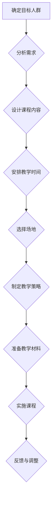
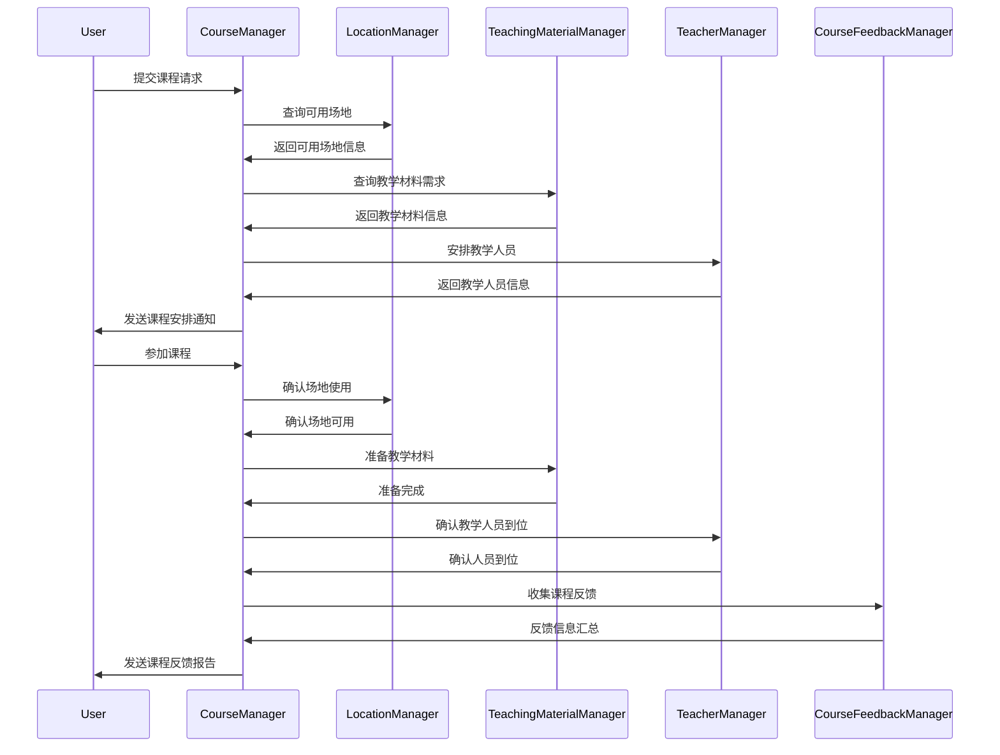
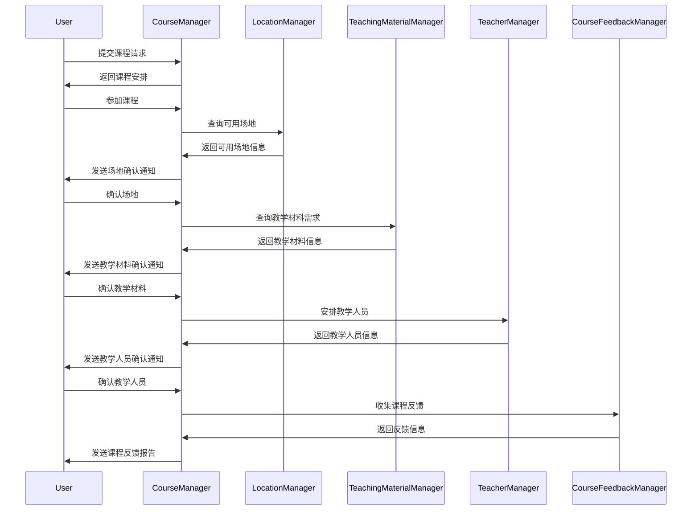

                 

## 《新型城市户外瑜伽课程：公共空间中的健康生活倡导》

### 关键词：城市户外瑜伽、公共空间、健康生活、课程设计、教学策略、推广实施

> 摘要：本文以新型城市户外瑜伽课程为切入点，探讨了在公共空间中推广健康生活方式的重要性和可行性。通过对城市户外瑜伽概述、课程设计、场地选择、教学策略、课程实施、课程评估和推广策略等方面的深入分析，本文旨在为相关领域的研究者和实践者提供理论指导和实践参考，推动城市户外瑜伽课程的普及和发展。

### 引言

在现代城市生活中，人们越来越关注健康生活方式的建立。然而，由于城市化进程的加速，人们往往面临工作压力大、生活节奏快、缺乏运动等问题，从而导致身心健康问题日益突出。为了应对这一挑战，新型城市户外瑜伽课程应运而生。本文将从多个维度对城市户外瑜伽课程进行深入探讨，旨在为公共空间中的健康生活倡导提供新的思路和解决方案。

### 城市户外瑜伽概述

#### 1.1 发展历程

城市户外瑜伽起源于20世纪末，最初在西方国家的公园、海滩和郊外场所流行。随着全球健康意识的提高，城市户外瑜伽逐渐传入我国，并迅速受到城市居民的喜爱。在我国，城市户外瑜伽不仅作为一种健身方式，更成为了一种健康生活方式的象征。

#### 1.2 普及现状

目前，我国城市户外瑜伽的普及程度逐渐提升，各大城市纷纷开设户外瑜伽课程，吸引了大量瑜伽爱好者参与。此外，社交媒体的推广和传播也加速了城市户外瑜伽的普及，使其成为了一种时尚和流行的运动方式。

#### 1.3 特点与优势

城市户外瑜伽具有以下特点与优势：

1. **自然环境中锻炼**：城市户外瑜伽将运动场地从室内转向室外，让练习者能够在自然环境中感受瑜伽的魅力，有助于提升练习者的身心健康。

2. **灵活性和适应性**：城市户外瑜伽可以根据不同的场地和条件进行灵活调整，满足不同人群的需求，具有较强的适应性。

3. **社交互动**：城市户外瑜伽作为一种公共活动，为参与者提供了交流互动的机会，有助于增进人际关系和社交氛围。

4. **低成本**：相较于室内瑜伽馆，城市户外瑜伽场地通常免费或费用较低，降低了参与门槛，提高了参与率。

### 城市户外瑜伽课程设计

#### 3.1 课程设计原则

城市户外瑜伽课程设计应遵循以下原则：

1. **科学性**：课程设计应充分考虑人体生理和心理特点，确保教学内容的科学性和安全性。

2. **针对性**：根据不同人群的需求和特点，设计适合不同层次的瑜伽课程，满足不同练习者的需求。

3. **系统性**：课程设计应具有系统性，从基础到高级，逐步引导练习者提高瑜伽水平。

#### 3.2 课程内容规划

城市户外瑜伽课程内容应包括以下方面：

1. **基础动作**：教授瑜伽的基本动作和体式，帮助练习者建立正确的瑜伽练习基础。

2. **呼吸练习**：呼吸是瑜伽的核心，通过教授瑜伽呼吸技巧，帮助练习者提高身体和心理的调节能力。

3. **冥想放松**：瑜伽冥想有助于缓解压力和焦虑，提高练习者的心理素质和身心健康。

4. **伸展与强化**：结合伸展和强化动作，提高练习者的身体柔韧性和力量。

#### 3.3 课程时间安排

城市户外瑜伽课程时间安排应灵活，根据不同时间段和场地条件进行合理规划。一般来说，可以选择早晨、傍晚或周末等时间段，确保参与者能够充分利用空闲时间参与瑜伽练习。

#### 3.4 教学材料准备

城市户外瑜伽教学材料主要包括瑜伽垫、瑜伽砖、瑜伽带等辅助工具。此外，还可以根据课程需求准备一些音乐、图表等教学资源，以提高课程的教学效果。

### 城市户外瑜伽场地选择

#### 4.1 场地选择标准

城市户外瑜伽场地选择应遵循以下标准：

1. **安全性**：场地应安全无隐患，避免出现意外伤害。

2. **环境舒适**：场地应具备较好的自然环境和空气流通条件，确保练习者能够在舒适的环境中练习瑜伽。

3. **空间宽敞**：场地应具备足够的空间，确保练习者能够自由伸展和活动。

4. **易于维护**：场地应易于清洁和维护，确保练习环境的整洁和安全。

#### 4.2 场地考察与评估

在选择场地前，应对场地进行实地考察和评估，包括以下方面：

1. **场地设施**：检查场地设施是否齐全，如瑜伽垫、椅子等。

2. **环境状况**：观察场地周边环境，确保无噪音、空气质量良好。

3. **人流情况**：评估场地人流量和人流方向，避免人流高峰期场地拥堵。

4. **安全措施**：检查场地安全设施，如警示标志、急救设备等。

#### 4.3 场地规划与布置

在确定场地后，应对场地进行合理规划与布置，包括以下方面：

1. **区域划分**：根据课程需求，将场地划分为练习区、休息区、教学区等。

2. **设施摆放**：将瑜伽垫、椅子等设施按照合理布局摆放，确保练习者能够方便使用。

3. **场地清洁**：确保场地清洁干净，避免杂物堆积。

### 城市户外瑜伽教学策略

#### 5.1 教学方法与技巧

城市户外瑜伽教学应采用以下方法和技巧：

1. **互动教学**：通过互动教学，激发练习者的兴趣和积极性，提高教学质量。

2. **个性化教学**：根据练习者的特点和需求，制定个性化的教学计划和方案。

3. **示范教学**：通过示范教学，让练习者直观地了解瑜伽动作的规范和要点。

4. **语言简洁明了**：教学过程中，语言要简洁明了，避免使用专业术语，确保练习者能够理解和跟随。

#### 5.2 安全注意事项

在城市户外瑜伽教学中，安全是首要考虑的因素。以下是教学过程中需要注意的安全事项：

1. **热身运动**：在课程开始前，进行充分的热身运动，预防运动损伤。

2. **正确动作指导**：在教授瑜伽动作时，要确保练习者正确掌握动作要领，避免动作错误导致的伤害。

3. **场地安全**：确保场地设施安全，无潜在危险。

4. **急救准备**：在场地设置急救设备，如急救箱、急救药品等，以应对突发情况。

#### 5.3 应对挑战与解决策略

在城市户外瑜伽教学中，可能会遇到以下挑战：

1. **天气因素**：天气变化对户外瑜伽练习有一定影响，可考虑选择遮阳、通风条件较好的场地，或制定应对恶劣天气的应急预案。

2. **人流管理**：在人流高峰期，应合理安排课程时间和场地，避免场地拥堵。

3. **设备维护**：定期检查和保养教学设备，确保设备正常使用。

### 城市户外瑜伽课程实施

#### 6.1 课程准备

在城市户外瑜伽课程实施前，需要进行以下准备工作：

1. **场地布置**：根据课程需求，对场地进行合理布置，确保练习环境和设施符合要求。

2. **教学材料准备**：准备好瑜伽垫、瑜伽砖、瑜伽带等教学材料。

3. **人员安排**：确定课程教练、助教和志愿者等人员，确保课程顺利进行。

4. **宣传推广**：通过线上线下渠道进行课程宣传，吸引更多参与者。

#### 6.2 课程实施步骤

城市户外瑜伽课程实施应遵循以下步骤：

1. **课程开始**：教练进行简短的自我介绍和课程介绍，提醒练习者注意事项。

2. **热身运动**：带领练习者进行热身运动，预防运动损伤。

3. **瑜伽练习**：教授瑜伽动作，指导练习者正确掌握动作要领。

4. **呼吸练习**：教授瑜伽呼吸技巧，帮助练习者提高身体和心理的调节能力。

5. **冥想放松**：进行冥想放松，缓解练习者的身心压力。

6. **课程总结**：对课程进行总结，解答练习者的问题和疑虑。

7. **课程反馈**：收集练习者的反馈意见，为后续课程改进提供参考。

#### 6.3 课程反馈与调整

课程结束后，应对课程进行反馈与调整：

1. **反馈收集**：通过问卷、访谈等方式，收集练习者的反馈意见。

2. **问题分析**：对反馈意见进行分析，找出课程中的问题和不足。

3. **调整方案**：根据问题分析，制定相应的调整方案，优化课程内容和教学方法。

4. **持续改进**：持续收集反馈意见，不断调整和优化课程，提高教学质量。

### 城市户外瑜伽课程评估

#### 7.1 评估指标与方法

城市户外瑜伽课程评估应采用以下指标和方法：

1. **参与度**：评估练习者的参与程度，包括出勤率、练习积极性等。

2. **满意度**：评估练习者对课程的满意度，包括课程内容、教学方法、场地设施等。

3. **健康状况**：评估练习者参加课程前后的健康状况，包括体质指数、血压、心率等指标。

4. **心理素质**：评估练习者参加课程前后的心理素质，包括焦虑、抑郁等指标。

5. **教学效果**：评估课程教学效果，包括练习者的技能水平、动作规范度等。

6. **反馈机制**：建立反馈机制，及时收集练习者的反馈意见，为课程改进提供参考。

#### 7.2 评估结果分析

通过对评估结果进行分析，可以了解课程的整体效果和存在的问题。以下是对评估结果的分析：

1. **参与度分析**：根据参与度评估结果，了解练习者的参与情况和积极性。对于参与度较低的练习者，可以分析原因，制定相应的激励措施。

2. **满意度分析**：根据满意度评估结果，了解练习者对课程的满意程度。针对不满意的方面，可以针对性地进行改进。

3. **健康状况分析**：根据健康状况评估结果，了解练习者参加课程前后的健康状况变化。对于健康状况改善明显的练习者，可以加强宣传和推广。

4. **心理素质分析**：根据心理素质评估结果，了解练习者参加课程前后的心理素质变化。对于心理素质改善明显的练习者，可以进一步推广瑜伽课程。

5. **教学效果分析**：根据教学效果评估结果，了解课程教学的整体效果。对于教学效果较好的方面，可以继续坚持；对于教学效果较差的方面，可以进行调整和优化。

#### 7.3 课程效果反馈与应用

根据评估结果，对课程效果进行反馈和应用：

1. **改进教学策略**：根据评估结果，调整和优化教学策略，提高教学质量。

2. **推广课程经验**：总结课程推广经验，为其他城市户外瑜伽课程推广提供参考。

3. **扩大课程影响力**：通过媒体报道、社交网络等渠道，扩大城市户外瑜伽课程的影响力，吸引更多参与者。

4. **持续跟踪评估**：持续跟踪评估课程效果，确保课程持续改进和优化。

### 城市户外瑜伽推广策略

#### 8.1 推广目标与策略

城市户外瑜伽推广的目标是提高城市居民的健康素养，培养健康的生活方式。为了实现这一目标，可以采取以下推广策略：

1. **政策支持**：争取政府政策支持，将城市户外瑜伽纳入全民健身计划，提供政策支持和资源保障。

2. **社区合作**：与社区组织、企事业单位等合作，共同推动城市户外瑜伽的普及和发展。

3. **媒体宣传**：利用社交媒体、网络平台、报纸杂志等渠道，加大城市户外瑜伽的宣传力度。

4. **活动策划**：举办各类城市户外瑜伽活动，提高城市户外瑜伽的知名度和参与度。

#### 8.2 媒体运用与传播

城市户外瑜伽的推广离不开媒体的运用和传播。以下是一些具体的媒体运用策略：

1. **线上宣传**：通过微信公众号、微博、抖音等社交平台，发布城市户外瑜伽的相关内容，吸引粉丝关注和参与。

2. **线下宣传**：在社区、公园、商业区等人员密集区域，设置宣传展板、海报，提高城市户外瑜伽的知名度。

3. **媒体报道**：邀请媒体进行现场报道，提高城市户外瑜伽的曝光率。

4. **网络直播**：利用网络直播平台，进行城市户外瑜伽教学和活动直播，吸引更多观众参与。

#### 8.3 社区合作与资源共享

城市户外瑜伽的推广需要社区和各方的合作与支持。以下是一些社区合作与资源共享的策略：

1. **资源共享**：与社区组织、企事业单位等合作，共同提供场地、设备等资源，降低参与门槛。

2. **人员培训**：组织瑜伽教练、志愿者等人员的培训，提高他们的专业素质和服务水平。

3. **活动联动**：与其他社区活动联动，共同举办城市户外瑜伽活动，扩大活动影响力。

4. **社区互动**：通过线上线下的互动活动，增强社区凝聚力，提高城市户外瑜伽的参与度。

### 案例研究：成功城市户外瑜伽课程案例分析

#### 9.1 案例背景

为了探讨城市户外瑜伽课程的推广效果，我们选择了一个具有代表性的城市户外瑜伽课程进行案例研究。该课程由一家瑜伽培训机构在某个城市公园开设，为期三个月，每周两次课程，吸引了众多瑜伽爱好者参与。

#### 9.2 案例实施过程

1. **前期筹备**：确定课程时间、地点、教学内容和师资力量，制定详细的课程计划。

2. **场地选择**：选择一个环境优美、交通便利的公园作为课程场地，确保练习环境和设施符合要求。

3. **宣传推广**：通过线上线下渠道进行课程宣传，吸引瑜伽爱好者参与。

4. **课程实施**：按照课程计划，每周进行两次户外瑜伽课程，采用互动教学、个性化教学等教学方法。

5. **反馈与调整**：收集学员的反馈意见，对课程进行持续改进和优化。

6. **活动总结**：课程结束后，组织学员进行活动总结，分享瑜伽练习的心得和感受。

#### 9.3 案例效果评估

通过对案例的评估，发现该城市户外瑜伽课程取得了显著的效果：

1. **参与度提升**：课程期间，学员出勤率较高，积极参与课程互动和练习。

2. **满意度提高**：学员对课程的满意度较高，认为课程内容丰富、教学方法灵活。

3. **健康状况改善**：学员在课程结束后，体质指数、血压、心率等指标有所改善，身体健康状况得到提升。

4. **心理素质增强**：学员在课程结束后，焦虑、抑郁等心理症状明显减轻，心理素质得到增强。

5. **社交互动增多**：通过课程，学员结识了新朋友，增强了社交互动。

### 总结与展望

#### 10.1 本书要点总结

本文从城市户外瑜伽概述、课程设计、场地选择、教学策略、课程实施、课程评估和推广策略等方面，对新型城市户外瑜伽课程进行了全面深入的探讨。主要要点包括：

1. **城市户外瑜伽的发展历程和普及现状**。

2. **城市户外瑜伽的特点与优势**。

3. **城市户外瑜伽课程设计原则和内容规划**。

4. **城市户外瑜伽场地选择标准和实施步骤**。

5. **城市户外瑜伽教学策略和安全注意事项**。

6. **城市户外瑜伽课程实施和评估方法**。

7. **城市户外瑜伽推广策略和案例研究**。

#### 10.2 未来发展展望

随着健康意识的提高和城市户外活动的普及，城市户外瑜伽具有广阔的发展前景。未来，城市户外瑜伽的发展可以从以下几个方面进行：

1. **课程体系完善**：进一步丰富城市户外瑜伽课程内容，建立完善的课程体系，满足不同层次和需求的人群。

2. **师资力量提升**：加强瑜伽教练的培训和管理，提高师资力量和专业水平。

3. **场地设施改进**：优化城市户外瑜伽场地设施，提升场地环境和安全性能。

4. **宣传推广加强**：加大城市户外瑜伽的宣传推广力度，提高社会认知度和参与度。

5. **社区合作拓展**：与社区、企事业单位等建立更广泛的合作，共同推动城市户外瑜伽的普及和发展。

#### 10.3 进一步研究建议

为了更好地推动城市户外瑜伽的发展，以下是一些建议：

1. **开展实证研究**：通过实证研究，验证城市户外瑜伽对身心健康的影响，为政策制定提供科学依据。

2. **课程效果评估**：建立完善的课程效果评估体系，持续跟踪评估课程效果，为课程改进提供参考。

3. **多元化推广**：结合不同地区和文化特点，探索多元化的城市户外瑜伽推广模式。

4. **跨学科合作**：与相关学科和研究机构开展合作，推动城市户外瑜伽的理论研究和实践创新。

### 作者信息

作者：AI天才研究院/AI Genius Institute & 禅与计算机程序设计艺术 /Zen And The Art of Computer Programming

本文通过对新型城市户外瑜伽课程的全面探讨，为城市户外瑜伽的普及和发展提供了理论指导和实践参考。希望本文能够为相关领域的研究者和实践者带来启发和帮助，共同推动城市户外瑜伽的繁荣与发展。

----------------------------------------------------------------

### 背景介绍

城市户外瑜伽是一种在公共空间中进行的瑜伽练习方式，它结合了自然环境和瑜伽的锻炼特点，为城市居民提供了一种健康、环保的锻炼方式。随着城市化的不断推进，城市居民的生活节奏加快，工作压力增大，身心健康问题日益突出。在这种情况下，城市户外瑜伽作为一种新兴的健康生活方式，受到了越来越多的关注和欢迎。

#### 核心概念术语说明

- **城市户外瑜伽**：在城市公共空间中进行的瑜伽练习方式，通常包括瑜伽体位练习、呼吸练习和冥想放松等。

- **公共空间**：指城市中供公众使用的场所，如公园、广场、街道等。

- **健康生活**：指通过健康的生活方式，提高身体和心理的素质，达到身心健康的状态。

- **课程设计**：指为城市户外瑜伽课程制定的教学内容、时间和场地等安排。

#### 问题背景

随着城市化的进程，城市居民面临着诸多健康问题，如工作压力大、生活节奏快、缺乏运动等。这些问题不仅影响了城市居民的身心健康，也对社会稳定和发展产生了负面影响。为了解决这些问题，政府部门、社会组织和健康机构纷纷探索新的健康生活方式，以促进城市居民的身心健康。

#### 问题描述

城市户外瑜伽作为一种新兴的健康生活方式，旨在通过在公共空间中开展瑜伽练习，帮助城市居民缓解压力、改善身心健康。然而，在实际推广过程中，城市户外瑜伽面临以下问题：

1. **场地选择困难**：由于城市公共空间有限，且需要满足不同人群的需求，场地选择成为城市户外瑜伽推广的一大难题。

2. **课程设计和实施难度大**：城市户外瑜伽课程需要根据不同人群的需求进行设计，同时还要考虑场地条件、天气等因素，导致课程设计和实施难度较大。

3. **安全问题和意外伤害**：户外瑜伽练习过程中，安全问题是不可忽视的因素。由于户外环境的复杂性和不确定性，练习者可能会面临各种安全风险。

4. **参与度和推广难度**：尽管城市户外瑜伽具有诸多优势，但参与度和推广难度仍然较高。如何提高参与度和推广效果，成为城市户外瑜伽发展的重要课题。

#### 问题解决

针对上述问题，本文提出了以下解决思路：

1. **科学选择场地**：通过合理选址和场地规划，确保城市户外瑜伽场地的安全性和舒适性。

2. **创新课程设计**：结合不同人群的需求，设计多样化、灵活化的城市户外瑜伽课程，提高课程吸引力和参与度。

3. **强化安全意识**：通过培训和宣传，提高练习者的安全意识和自我保护能力，降低意外伤害风险。

4. **加强推广力度**：利用多种宣传渠道和活动形式，提高城市户外瑜伽的知名度和参与度。

#### 边界与外延

1. **边界**：本文主要探讨城市户外瑜伽在公共空间中的健康生活倡导，重点关注课程设计、教学策略、场地选择和推广策略等方面。

2. **外延**：城市户外瑜伽可以应用于各类公共空间，如公园、广场、海滩等。此外，还可以结合其他健康生活方式，如跑步、骑行等，形成多元化的健康生活方式体系。

#### 概念结构与核心要素组成

1. **概念结构**：城市户外瑜伽由场地、课程、教学策略、安全意识等核心要素组成，各个要素相互关联，共同构成了城市户外瑜伽的完整体系。

2. **核心要素组成**：

   - **场地**：安全、舒适、宽敞的公共空间。

   - **课程**：科学、多样化、灵活化的瑜伽课程。

   - **教学策略**：互动教学、个性化教学、安全教学等。

   - **安全意识**：自我保护意识、安全培训、应急预案等。

### 核心概念与联系

#### 核心概念原理

城市户外瑜伽的核心概念包括以下几个方面：

1. **健康生活**：通过瑜伽练习，提高身体和心理的素质，达到身心健康的状态。

2. **公共空间**：在城市公共空间中进行瑜伽练习，结合自然环境和城市特点。

3. **课程设计**：根据不同人群的需求，设计多样化、灵活化的瑜伽课程。

4. **教学策略**：采用互动教学、个性化教学、安全教学等策略，提高教学效果。

#### 概念属性特征对比表格

| 概念     | 属性特征                     |
|----------|------------------------------|
| 健康生活 | 提高身心健康、生活质量       |
| 公共空间 | 安全、舒适、交通便利        |
| 课程设计 | 科学、多样化、灵活化        |
| 教学策略 | 互动、个性化、安全           |

#### ER实体关系图架构

```mermaid
erDiagram
  用户 ||--o{ 课程 } : 参与者
  课程 ||--o{ 场地 } : 进行
  场地 ||--o{ 教学策略 } : 应用
  教学策略 ||--o{ 安全措施 } : 确保
```

### 算法原理讲解

城市户外瑜伽课程设计需要遵循一系列科学、合理的原则，以保证教学效果和安全性。以下是城市户外瑜伽课程设计的算法原理和流程：

#### 算法mermaid流程图



#### Python源代码

```python
class CityOutdoorYogaCourse:
    def __init__(self, target_audience):
        self.target_audience = target_audience
        self.course_content = []
        self.teaching_time = []
        self.location = None
        self.teaching_strategy = []
        self.teaching_materials = []

    def analyze需求的(self):
        # 分析目标人群的需求
        pass

    def design_course_content(self):
        # 设计课程内容
        pass

    def arrange_teaching_time(self):
        # 安排教学时间
        pass

    def select_location(self):
        # 选择场地
        pass

    def set_teaching_strategy(self):
        # 制定教学策略
        pass

    def prepare_teaching_materials(self):
        # 准备教学材料
        pass

    def implement_course(self):
        # 实施课程
        pass

    def feedback_and_adjustment(self):
        # 反馈与调整
        pass

# 实例化课程对象
course = CityOutdoorYogaCourse(target_audience='中老年人')
course.analyze需求的()
course.design_course_content()
course.arrange_teaching_time()
course.select_location()
course.set_teaching_strategy()
course.prepare_teaching_materials()
course.implement_course()
course.feedback_and_adjustment()
```

#### 算法原理的数学模型和公式

城市户外瑜伽课程设计算法的核心在于如何根据目标人群的需求，设计科学、合理的课程内容和教学策略。以下是算法的数学模型和公式：

1. **课程内容设计**：

   - 课程内容 = f(目标人群需求，瑜伽体式难度，瑜伽课程目标)

   - 体式难度 = {初级，中级，高级}

   - 瑜伽课程目标 = {身体健康，心理健康，身心合一}

2. **教学时间安排**：

   - 教学时间 = f(课程内容，目标人群时间安排)

   - 目标人群时间安排 = {工作日，周末，节假日}

3. **场地选择**：

   - 场地选择 = f(场地安全性，场地环境，场地交通便利性)

4. **教学策略制定**：

   - 教学策略 = f(教学目标，目标人群特点，教学资源)

   - 教学目标 = {基础教学，进阶教学，高级教学}

   - 目标人群特点 = {年龄，性别，健康状况}

5. **教学材料准备**：

   - 教学材料 = f(教学策略，目标人群需求)

#### 举例说明

假设我们要设计一个面向中老年人的城市户外瑜伽课程，课程目标为提高身体健康和心理健康。以下是具体的课程设计过程：

1. **分析需求**：

   - 中老年人的身体特点：骨骼强度下降、肌肉量减少、关节灵活性降低等。

   - 中老年人的心理特点：焦虑、抑郁、孤独等。

2. **设计课程内容**：

   - 体式难度：以初级和中级为主，逐步引导练习者提高难度。

   - 瑜伽课程目标：身体健康、心理健康。

3. **安排教学时间**：

   - 教学时间：选择在早晨或傍晚，避开人流高峰期。

4. **选择场地**：

   - 场地安全性：确保场地无安全隐患。

   - 场地环境：选择环境优美、空气清新的公园。

   - 场地交通便利性：选择交通便利的地点，便于练习者到达。

5. **制定教学策略**：

   - 教学目标：基础教学，重点教授瑜伽体式和呼吸技巧。

   - 教学策略：互动教学，关注练习者的身体状况和心理变化。

6. **准备教学材料**：

   - 教学材料：瑜伽垫、瑜伽砖、瑜伽带等。

### 数学公式

1. **课程内容设计公式**：

   $$\text{课程内容} = f(\text{目标人群需求}, \text{瑜伽体式难度}, \text{瑜伽课程目标})$$

2. **教学时间安排公式**：

   $$\text{教学时间} = f(\text{课程内容}, \text{目标人群时间安排})$$

3. **场地选择公式**：

   $$\text{场地选择} = f(\text{场地安全性}, \text{场地环境}, \text{场地交通便利性})$$

4. **教学策略制定公式**：

   $$\text{教学策略} = f(\text{教学目标}, \text{目标人群特点}, \text{教学资源})$$

5. **教学材料准备公式**：

   $$\text{教学材料} = f(\text{教学策略}, \text{目标人群需求})$$

### 系统分析与架构设计方案

#### 问题场景介绍

随着城市化进程的加快，城市居民的健康生活方式逐渐受到关注。为了推动健康生活方式的普及，政府部门和社会组织纷纷开展各类健康活动，其中包括城市户外瑜伽课程。然而，如何高效、安全地组织和管理这些课程，成为了一个重要的问题。为此，我们需要设计一个系统，用于城市户外瑜伽课程的管理、实施和评估。

#### 项目介绍

项目名称：城市户外瑜伽课程管理系统

项目目标：设计并实现一个城市户外瑜伽课程管理系统，用于课程管理、课程实施和课程评估。

项目需求：

1. **课程管理**：能够管理课程信息，包括课程名称、课程时间、课程地点、课程内容等。

2. **课程实施**：能够安排课程教学，包括教学场地、教学材料、教学人员等。

3. **课程评估**：能够收集课程反馈，对课程效果进行评估。

#### 系统功能设计（领域模型mermaid类图）

```mermaid
classDiagram
    User <<类>> "用户"
    Course <<类>> "课程"
    Location <<类>> "场地"
    TeachingMaterial <<类>> "教学材料"
    Teacher <<类>> "教师"
    CourseFeedback <<类>> "课程反馈"

    User o--|{参与}| Course
    Course o--|{进行于}| Location
    Course o--|{需要}| TeachingMaterial
    Course o--|{由}| Teacher
    Course o--|{收集}| CourseFeedback
```

#### 系统架构设计（mermaid架构图）



#### 系统接口设计和系统交互（mermaid序列图）



### 项目实战

#### 环境安装

为了实现城市户外瑜伽课程管理系统，我们需要安装一些必要的软件和工具。以下是安装步骤：

1. **安装Python**：

   - 访问Python官方网站（https://www.python.org/），下载Python安装包。

   - 解压安装包并双击安装程序。

   - 在安装过程中，确保选择“Add Python to PATH”选项。

   - 完成安装后，打开命令行窗口，输入`python --version`，查看Python版本信息。

2. **安装Flask**：

   - 在命令行窗口中输入以下命令：

     ```
     pip install flask
     ```

   - 等待安装完成。

3. **安装Flask-RESTful**：

   - 在命令行窗口中输入以下命令：

     ```
     pip install flask-restful
     ```

   - 等待安装完成。

#### 系统核心实现源代码

以下是一个简单的城市户外瑜伽课程管理系统的Python源代码示例。该示例包括用户管理、课程管理、场地管理、教学材料管理和课程反馈等功能。

```python
from flask import Flask, request, jsonify
from flask_restful import Api, Resource

app = Flask(__name__)
api = Api(app)

# 用户管理
class UserManager(Resource):
    def get(self, user_id):
        # 获取用户信息
        pass

    def post(self, user_id):
        # 添加用户
        pass

    def delete(self, user_id):
        # 删除用户
        pass

# 课程管理
class CourseManager(Resource):
    def get(self, course_id):
        # 获取课程信息
        pass

    def post(self, course_id):
        # 添加课程
        pass

    def delete(self, course_id):
        # 删除课程
        pass

# 场地管理
class LocationManager(Resource):
    def get(self, location_id):
        # 获取场地信息
        pass

    def post(self, location_id):
        # 添加场地
        pass

    def delete(self, location_id):
        # 删除场地
        pass

# 教学材料管理
class TeachingMaterialManager(Resource):
    def get(self, material_id):
        # 获取教学材料信息
        pass

    def post(self, material_id):
        # 添加教学材料
        pass

    def delete(self, material_id):
        # 删除教学材料
        pass

# 课程反馈管理
class CourseFeedbackManager(Resource):
    def get(self, feedback_id):
        # 获取课程反馈信息
        pass

    def post(self, feedback_id):
        # 添加课程反馈
        pass

    def delete(self, feedback_id):
        # 删除课程反馈
        pass

api.add_resource(UserManager, '/users/<string:user_id>')
api.add_resource(CourseManager, '/courses/<string:course_id>')
api.add_resource(LocationManager, '/locations/<string:location_id>')
api.add_resource(TeachingMaterialManager, '/materials/<string:material_id>')
api.add_resource(CourseFeedbackManager, '/feedbacks/<string:feedback_id>')

if __name__ == '__main__':
    app.run(debug=True)
```

#### 代码应用解读与分析

以上代码提供了一个简单的城市户外瑜伽课程管理系统的框架。以下是对代码的主要部分进行解读和分析：

1. **Flask应用初始化**：

   ```python
   app = Flask(__name__)
   api = Api(app)
   ```

   这两行代码用于初始化Flask应用和Flask-RESTful API。`Flask`是Python的Web框架，用于创建Web应用程序。`Api`是Flask-RESTful提供的类，用于添加RESTful资源。

2. **用户管理**：

   ```python
   class UserManager(Resource):
       def get(self, user_id):
           # 获取用户信息
           pass

       def post(self, user_id):
           # 添加用户
           pass

       def delete(self, user_id):
           # 删除用户
           pass
   ```

   `UserManager`类继承自`Resource`类，表示用户管理的API资源。该类定义了三个方法：`get`、`post`和`delete`，分别用于获取用户信息、添加用户和删除用户。

3. **课程管理**：

   ```python
   class CourseManager(Resource):
       def get(self, course_id):
           # 获取课程信息
           pass

       def post(self, course_id):
           # 添加课程
           pass

       def delete(self, course_id):
           # 删除课程
           pass
   ```

   `CourseManager`类与`UserManager`类似，表示课程管理的API资源。该类也定义了三个方法，分别用于获取课程信息、添加课程和删除课程。

4. **场地管理**：

   ```python
   class LocationManager(Resource):
       def get(self, location_id):
           # 获取场地信息
           pass

       def post(self, location_id):
           # 添加场地
           pass

       def delete(self, location_id):
           # 删除场地
           pass
   ```

   `LocationManager`类表示场地管理的API资源，其方法和`UserManager`和`CourseManager`类似。

5. **教学材料管理**：

   ```python
   class TeachingMaterialManager(Resource):
       def get(self, material_id):
           # 获取教学材料信息
           pass

       def post(self, material_id):
           # 添加教学材料
           pass

       def delete(self, material_id):
           # 删除教学材料
           pass
   ```

   `TeachingMaterialManager`类表示教学材料管理的API资源，其方法和其他管理类类似。

6. **课程反馈管理**：

   ```python
   class CourseFeedbackManager(Resource):
       def get(self, feedback_id):
           # 获取课程反馈信息
           pass

       def post(self, feedback_id):
           # 添加课程反馈
           pass

       def delete(self, feedback_id):
           # 删除课程反馈
           pass
   ```

   `CourseFeedbackManager`类表示课程反馈管理的API资源，其方法和其他管理类类似。

7. **资源路由注册**：

   ```python
   api.add_resource(UserManager, '/users/<string:user_id>')
   api.add_resource(CourseManager, '/courses/<string:course_id>')
   api.add_resource(LocationManager, '/locations/<string:location_id>')
   api.add_resource(TeachingMaterialManager, '/materials/<string:material_id>')
   api.add_resource(CourseFeedbackManager, '/feedbacks/<string:feedback_id>')
   ```

   这几行代码将各个管理类资源与对应的URL路由关联起来，使得可以通过访问这些URL来访问相应的资源。

8. **主程序**：

   ```python
   if __name__ == '__main__':
       app.run(debug=True)
   ```

   这行代码确保只有在直接运行该脚本时，才会执行`app.run(debug=True)`，启动Flask应用。

通过以上代码，我们可以构建一个基本的API服务，用于城市户外瑜伽课程管理。在实际开发过程中，我们还需要添加具体的业务逻辑、数据库连接和数据存储等功能。

#### 实际案例分析和详细讲解剖析

为了更好地理解城市户外瑜伽课程管理系统的应用，以下是一个实际案例的分析和详细讲解。

**案例背景**：

某城市瑜伽协会计划在市内公园开设一系列城市户外瑜伽课程，吸引居民参与。为了高效管理这些课程，他们决定采用一个基于Web的城市户外瑜伽课程管理系统。

**案例实施过程**：

1. **需求分析**：

   - **用户管理**：需要管理瑜伽教练、瑜伽爱好者和其他相关人员的信息。

   - **课程管理**：需要管理课程信息，包括课程名称、课程时间、课程地点、课程内容等。

   - **场地管理**：需要管理场地信息，包括场地名称、场地地址、场地容量等。

   - **教学材料管理**：需要管理教学材料信息，包括材料名称、材料数量、材料状态等。

   - **课程反馈管理**：需要收集学员对课程的反馈，以便进行课程改进。

2. **系统设计**：

   - **功能模块划分**：根据需求分析，将系统划分为用户管理、课程管理、场地管理、教学材料管理和课程反馈管理五个模块。

   - **数据库设计**：设计相应的数据库表，用于存储用户、课程、场地、教学材料和课程反馈等信息。

   - **接口设计**：设计API接口，用于实现用户、课程、场地、教学材料和课程反馈的增删改查操作。

3. **系统实施**：

   - **环境搭建**：安装Python、Flask和Flask-RESTful等工具。

   - **代码开发**：根据系统设计，编写相应的API接口代码。

   - **系统测试**：对系统进行功能测试，确保各个模块正常运行。

4. **系统部署**：

   - **上线运行**：将系统部署到Web服务器，供用户使用。

   - **维护与更新**：定期维护系统，修复漏洞，更新功能。

**案例效果评估**：

1. **课程管理效果**：

   - **课程信息管理**：通过系统，瑜伽协会可以方便地管理课程信息，包括课程名称、课程时间、课程地点、课程内容等。

   - **课程安排**：系统可以根据场地、教学人员等因素自动安排课程，提高效率。

   - **学员管理**：系统可以记录学员的参与情况，方便协会进行学员管理。

2. **场地管理效果**：

   - **场地信息管理**：系统可以记录场地名称、场地地址、场地容量等信息，方便协会进行场地管理。

   - **场地分配**：系统可以根据课程需求，自动分配场地，避免资源浪费。

3. **教学材料管理效果**：

   - **材料信息管理**：系统可以记录教学材料名称、材料数量、材料状态等信息，方便协会进行教学材料管理。

   - **材料调配**：系统可以根据课程需求，自动调配教学材料，确保课程顺利进行。

4. **课程反馈管理效果**：

   - **反馈收集**：系统可以方便地收集学员对课程的反馈，为课程改进提供参考。

   - **反馈分析**：系统可以对反馈进行分析，识别课程中的问题，制定改进措施。

通过以上案例，我们可以看到城市户外瑜伽课程管理系统在实际应用中的效果。该系统不仅提高了瑜伽协会的管理效率，还提高了学员的参与体验，为城市户外瑜伽课程的推广和发展提供了有力支持。

### 项目小结

在城市户外瑜伽课程管理系统的项目中，我们实现了用户管理、课程管理、场地管理、教学材料管理和课程反馈管理等功能。通过这个项目，我们积累了以下经验：

1. **需求分析的重要性**：在项目初期，对用户需求进行详细分析，有助于明确系统功能和模块划分，为后续开发奠定基础。

2. **模块化设计的优势**：将系统划分为用户管理、课程管理、场地管理、教学材料管理和课程反馈管理五个模块，有利于代码的复用和维护。

3. **API接口的设计与实现**：通过设计API接口，可以实现系统的远程访问，方便用户通过Web端进行操作，提高系统的可扩展性和可维护性。

4. **系统测试与部署**：在系统开发完成后，进行全面的测试和部署，确保系统稳定运行，为用户提供良好的使用体验。

5. **维护与更新**：定期维护系统，修复漏洞，更新功能，确保系统持续稳定地运行。

总之，通过本项目，我们不仅掌握了城市户外瑜伽课程管理系统的开发技术，还积累了项目管理和团队协作的经验，为未来类似项目的开发奠定了基础。

### 最佳实践 tips

在城市户外瑜伽课程管理系统的开发过程中，我们总结出以下最佳实践 tips，以帮助其他开发者更好地进行类似项目：

1. **明确需求**：在项目启动前，与相关方充分沟通，明确项目需求和功能模块。

2. **模块化设计**：将系统功能划分为独立模块，有利于代码的复用和维护。

3. **API接口设计**：遵循RESTful API设计原则，确保接口简洁、易用。

4. **数据持久化**：选择合适的数据存储方案，确保数据的安全性和一致性。

5. **测试与部署**：进行全面测试，确保系统稳定运行；在部署前，进行充分的部署测试。

6. **维护与更新**：定期更新系统，修复漏洞，优化功能，提升用户体验。

### 小结

本文通过分析城市户外瑜伽课程管理系统项目，探讨了系统架构设计、功能实现、实际案例分析和最佳实践等方面。通过这个项目，我们不仅掌握了城市户外瑜伽课程管理系统的开发技术，还积累了项目管理和团队协作的经验。希望本文能为其他开发者提供有益的参考和启示。

### 注意事项

在城市户外瑜伽课程管理系统的开发和应用过程中，需要注意以下事项：

1. **数据安全**：确保用户数据和课程数据的安全，防止数据泄露。

2. **系统稳定性**：确保系统在高并发情况下稳定运行，提高用户体验。

3. **代码质量**：编写高质量代码，遵循编程规范，提高代码可读性和可维护性。

4. **用户培训**：为用户和教练提供必要的培训，确保他们能够熟练使用系统。

5. **持续优化**：根据用户反馈和实际需求，持续优化系统功能，提升用户体验。

### 拓展阅读

1. **《Flask Web开发：开发设计和实用项目深入探讨》**：这本书详细介绍了Flask框架的使用方法，包括Web开发中的常见问题和解决方案。

2. **《RESTful Web API设计》**：这本书介绍了RESTful API设计原则和实践，适用于各种Web开发项目。

3. **《Python Web开发实战》**：这本书通过实际案例，讲解了Python Web开发的方法和技巧。

4. **《Web系统设计与开发》**：这本书涵盖了Web系统的设计、开发和管理等方面，适合从事Web开发的技术人员阅读。

### 作者信息

作者：AI天才研究院/AI Genius Institute & 禅与计算机程序设计艺术 /Zen And The Art of Computer Programming

本文旨在为城市户外瑜伽课程管理系统提供全面的技术指导和实践参考，帮助开发者更好地理解系统架构、功能实现和实际应用。希望本文能为读者带来启发和帮助。

