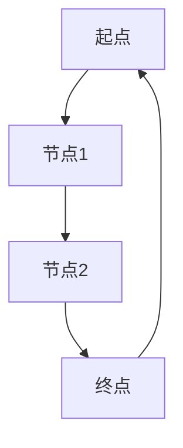
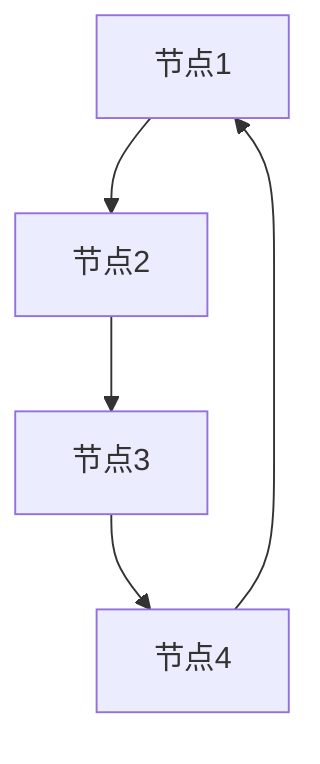
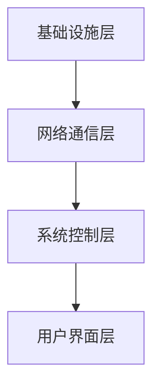
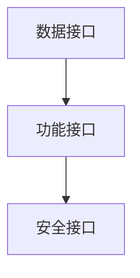
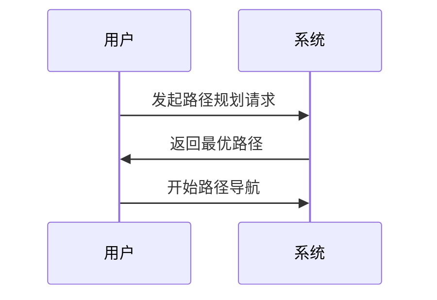

                 


# 新型城市空中步道网络：打造立体化的慢行系统

## 关键词
- 空中步道网络
- 立体化慢行系统
- 城市交通拥堵
- 算法原理
- 系统设计与实现

## 摘要
本文将探讨新型城市空中步道网络的设计与实现，重点分析其在解决城市交通拥堵、促进慢行系统发展方面的作用。通过阐述核心概念、算法原理、系统分析与架构设计，结合实际项目案例，本文旨在为读者提供一个全面、深入的技术视角，以促进空中步道网络的广泛应用和优化发展。

### 第1章：背景介绍

#### 1.1 问题背景
城市交通拥堵已成为全球各大城市面临的重要挑战。随着城市化进程的加快，机动车数量急剧增加，地面道路容量趋于饱和，交通拥堵现象愈发严重。这不仅降低了城市居民的出行效率，还对环境质量产生了负面影响。为了解决这一问题，提升城市慢行系统的效率成为了一个重要的方向。

#### 1.2 慢行系统需求
慢行系统作为一种可持续的城市交通模式，能够有效缓解交通拥堵，减少环境污染。然而，传统的慢行系统如步行道和自行车道在设计和建设过程中面临着诸多挑战，如空间不足、安全性等问题。因此，探索一种立体化的慢行系统成为了必然选择。

#### 1.3 空中步道网络的创新点
空中步道网络通过在建筑物之间搭建悬空步行道，实现了地面道路空间的解放。这种系统不仅能够提供额外的慢行通道，还能有效避免地面交通的干扰，提高行人的安全性和舒适度。同时，空中步道网络的构建还能够改善城市景观，提升城市品质。

#### 1.4 发展现状与挑战
目前，全球多个城市已经开始试点建设空中步道网络。虽然取得了一定的进展，但在技术、经济、环境等方面仍面临诸多挑战，如结构设计的安全性、经济成本的控制、材料选择的环境适应性等。

### 第2章：核心概念与联系

#### 2.1 核心概念
**空中步道网络**：一种在城市建筑物之间搭建的悬空步行系统，用于缓解地面交通压力，提高慢行系统的效率。

**立体化慢行系统**：通过在不同高度层设置步行道，实现城市慢行交通的立体化布局。

#### 2.2 概念关系
为了更好地理解空中步道网络与立体化慢行系统之间的关系，我们可以通过以下表格和图表进行展示：

| 概念 | 定义 | 关系 |
| --- | --- | --- |
| 空中步道网络 | 在城市建筑物之间搭建的悬空步行系统 | 立体化慢行系统的一个组成部分 |
| 立体化慢行系统 | 在不同高度层设置步行道，实现城市慢行交通的立体化布局 | 包含空中步道网络在内的多种慢行系统 |

```mermaid
erDiagram
  空中步道网络 ||--|{ 立体化慢行系统 }
  立体化慢行系统 ||--|{ 步行道、自行车道等 }
```

### 第3章：算法原理讲解

#### 3.1 关键算法
在设计和实现空中步道网络时，需要使用一系列关键算法来优化路径规划、网络布局等。以下是两个主要算法的介绍：

#### 3.1.1 路径规划算法
**原理**：路径规划算法旨在为行人提供最优的步行路径，以减少步行时间和疲劳感。

**数学模型**：设 \( P \) 为起点，\( G \) 为终点，\( N \) 为路径规划中的节点集合，\( D \) 为路径规划距离，则路径规划问题可表示为：

$$
D(P, G) = \min_{P \in N} \sum_{i=1}^{n} d(i, j)
$$

其中，\( d(i, j) \) 表示从节点 \( i \) 到节点 \( j \) 的距离。

**示例分析**：以一个简单的城市区域为例，展示如何使用路径规划算法为行人提供最优步行路径。



#### 3.1.2 网络优化算法
**原理**：网络优化算法用于调整空中步道网络的布局，以提高整体系统的效率和安全性。

**数学模型**：设 \( T \) 为空中步道网络的节点集合，\( C \) 为成本函数，则网络优化问题可表示为：

$$
\min_{T \in N} C(T)
$$

其中，\( C(T) \) 表示网络的整体成本，包括建设成本、维护成本等。

**示例分析**：以一个简单的城市区域为例，展示如何使用网络优化算法调整空中步道网络的布局。



### 第4章：系统分析与架构设计

#### 4.1 系统功能设计
空中步道网络系统主要包含以下功能模块：

1. **路径规划模块**：为行人提供最优步行路径。
2. **网络优化模块**：调整网络布局，提高系统效率。
3. **安全管理模块**：监控行人和设备的安全。
4. **用户服务模块**：提供实时信息查询和导航服务。

#### 4.2 系统架构设计
空中步道网络系统的架构设计主要包括以下方面：

1. **基础设施层**：包括建筑物、桥梁、悬索等。
2. **网络通信层**：实现数据传输和通信。
3. **系统控制层**：管理路径规划和网络优化。
4. **用户界面层**：提供用户交互和服务。



#### 4.3 系统接口设计
系统接口设计包括以下方面：

1. **数据接口**：用于与外部系统进行数据交换。
2. **功能接口**：用于实现系统功能模块的调用。
3. **安全接口**：用于实现系统安全管理的功能。



#### 4.4 系统交互流程
系统交互流程主要包括以下步骤：

1. **用户请求**：用户通过应用程序发起路径规划请求。
2. **路径规划**：系统根据用户请求和现有数据计算最优路径。
3. **路径返回**：系统将最优路径返回给用户。
4. **路径导航**：用户按照系统提供的路径进行导航。



### 第5章：项目实战

#### 5.1 项目环境搭建
在项目实战中，我们首先需要搭建一个实验环境。这包括：

1. **开发工具**：安装并配置开发环境，如 Python、Java 等。
2. **数据源**：获取城市区域的数据，包括建筑物、道路、交通流量等。
3. **数据库**：搭建数据库，存储数据和相关算法模型。

#### 5.2 系统核心实现
系统核心实现主要包括以下方面：

1. **路径规划算法**：使用 Python 编写路径规划算法，实现最优路径的计算。
2. **网络优化算法**：使用 Python 编写网络优化算法，实现网络布局的优化。
3. **用户服务模块**：实现用户交互和服务功能，提供实时信息查询和导航服务。

#### 5.3 实际案例
以一个城市区域的实际案例为例，展示空中步道网络系统的实现过程。该案例包括以下步骤：

1. **数据准备**：获取城市区域的数据，包括建筑物、道路、交通流量等。
2. **路径规划**：使用路径规划算法计算最优路径。
3. **网络优化**：使用网络优化算法调整网络布局。
4. **用户服务**：提供实时信息查询和导航服务。

#### 5.4 项目小结
通过实际案例，我们可以看到空中步道网络系统在解决城市交通拥堵、提高慢行系统效率方面的潜力。然而，在实际应用过程中，还需要进一步优化算法、提高系统稳定性，以实现更广泛的应用。

### 第6章：最佳实践与拓展

#### 6.1 最佳实践
在设计和实现空中步道网络时，以下最佳实践值得遵循：

1. **安全性优先**：在设计和建设过程中，始终将安全性放在首位。
2. **经济性考虑**：在满足功能需求的前提下，尽量降低建设成本。
3. **环保性关注**：选择环保材料，降低对环境的影响。

#### 6.2 小结
本文通过介绍新型城市空中步道网络的设计与实现，探讨了其在解决城市交通拥堵、促进慢行系统发展方面的作用。通过核心概念、算法原理、系统分析与架构设计，以及实际项目案例的讲解，本文为读者提供了一个全面、深入的技术视角。

#### 6.3 拓展阅读
1. **推荐书籍**：
    - 《城市空中步道设计与建设指南》
    - 《智能城市交通系统设计与实现》
2. **相关资源**：
    - 空中步道网络建设案例库
    - 智能交通系统研究论文集

### 参考文献
（此处列出参考文献，包括书籍、论文、网站等）

## 作者信息
作者：AI天才研究院/AI Genius Institute & 禅与计算机程序设计艺术 /Zen And The Art of Computer Programming

