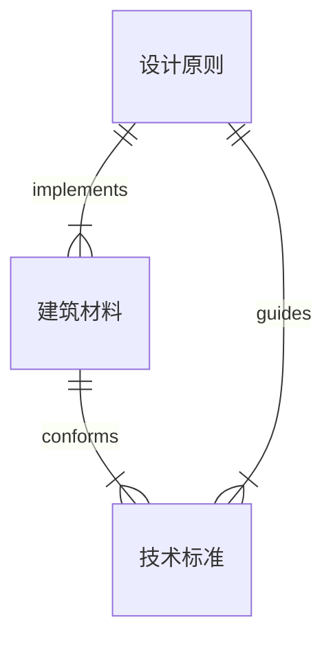

                 


### 一、文章标题：新型城市空中步道：连接社区的绿色通道

### 二、关键词：新型城市空中步道、社区连接、绿色通道、设计原则、建筑材料、技术标准

### 三、摘要：

本文将从背景介绍、核心概念与联系、设计与规划、施工与维护、社会与经济影响、案例研究以及未来展望与趋势七个方面，深入探讨新型城市空中步道的概念、必要性、设计原则、建筑材料、技术标准、施工与维护策略、社会与经济影响、案例研究以及未来发展。通过这一系统的分析，旨在为读者提供一个全面、深入的了解，为新型城市空中步道的应用与发展提供参考。

### 四、文章正文

#### 第一部分：背景介绍

1. **核心概念术语说明**：
   - **新型城市空中步道**：一种结合了城市交通、休闲、观光等功能，采用架空设计，贯穿城市各区域的步道系统。
   - **社区连接**：指通过新型城市空中步道，实现城市内各社区之间的高效连接。
   - **绿色通道**：强调新型城市空中步道的环保特性，以及其对城市生态环境的积极影响。

2. **问题背景**：
   - 随着城市化进程的加速，城市交通拥堵、空间资源紧张等问题日益突出。
   - 需要一种既能够缓解交通压力，又能提升城市居民生活质量的新方式。

3. **问题描述**：
   - 如何在有限的城市空间中，建设一种既美观又实用的空中步道系统，实现社区之间的高效连接？

4. **问题解决**：
   - 新型城市空中步道应具备以下特点：
     - **多功能性**：满足步行、骑行等多种交通方式。
     - **环境友好**：采用环保材料，降低对环境的影响。
     - **人性化设计**：充分考虑用户体验，提供舒适的步行环境。

5. **边界与外延**：
   - 新型城市空中步道不仅限于城市中心区域，也应向城市外围扩展，实现全面覆盖。

6. **概念结构与核心要素组成**：
   - **设计原则**：多功能性、环境友好性、人性化设计。
   - **建筑材料**：轻质高强、环保节能。
   - **技术标准**：包括结构安全、使用舒适度、环保标准等。

#### 第二部分：核心概念与联系

1. **核心概念原理**：
   - **设计原则**：新型城市空中步道的设计应遵循可持续性、多功能性、美观性等原则。
   - **建筑材料与技术**：选择轻质高强、环保节能的材料，如铝合金、碳纤维等。
   - **技术标准**：确保结构安全、使用舒适度、符合环保要求。

2. **概念属性特征对比表格**：

| 特征类别 | 设计原则 | 建筑材料 | 技术标准 |
| --- | --- | --- | --- |
| 功能性 | 多样性、人性化 | 轻质高强、耐腐蚀 | 安全性、耐用性 |
| 环保性 | 节能、环保材料 | 资源可持续性 | 减少污染、环保材料 |
| 舒适性 | 舒适性设计、照明系统 | 人性化设施 | 舒适、无障碍 |

3. **ER实体关系图架构**：

```mermaid
erDiagram
  step1 ||--|{ step2 : contains
  step2 ||--|{ step3 : includes
  step3 ||--|{ step4 : relates
  step1 : 步道设计
  step2 : 材料选择
  step3 : 技术标准
  step4 : 环境友好
```

#### 第三部分：设计与规划

1. **路线选择与规划**：
   - 根据城市地形、交通网络等因素，科学规划新型城市空中步道的路线。
   - 确保步道能够高效连接各主要社区和城市中心。

2. **建筑设计**：
   - 采用现代建筑设计理念，使新型城市空中步道成为城市的一道亮丽风景。
   - 考虑到城市特色和历史文化，设计具有地方特色的空中步道。

3. **环境友好性**：
   - 选用环保材料，减少对环境的影响。
   - 设计生态廊道，为鸟类和昆虫提供栖息地。

4. **社区互动与参与**：
   - 鼓励社区居民参与步道设计，增强社区凝聚力。
   - 设立社区互动空间，提供休闲、娱乐、文化等功能。

5. **可持续发展考量**：
   - 考虑步道的长期维护和更新，确保其可持续性。
   - 推广绿色出行理念，鼓励步行和骑行。

#### 第四部分：施工与维护

1. **施工技术**：
   - 采用模块化施工技术，提高施工效率。
   - 确保施工过程中的安全，减少对周边环境的影响。

2. **维护策略**：
   - 定期检查和维护步道设施，确保其正常运行。
   - 建立智能监控系统，实时监测步道状况。

3. **安全性**：
   - 确保步道结构安全，符合相关技术标准。
   - 设立紧急救援设施，提高安全系数。

4. **风险管理**：
   - 评估施工和维护过程中的风险，制定相应的风险管理措施。
   - 建立应急响应机制，应对突发情况。

#### 第五部分：社会与经济影响

1. **对社区的影响**：
   - 提升社区品质，改善居民生活质量。
   - 增强社区凝聚力，促进社区发展。

2. **对城市经济的影响**：
   - 带动相关产业发展，创造就业机会。
   - 提升城市形象，吸引投资和游客。

3. **对社会生活的影响**：
   - 促进绿色出行，改善城市空气质量。
   - 提供休闲娱乐场所，丰富居民生活。

4. **社区参与的激励机制**：
   - 设立奖励制度，鼓励居民参与步道维护和管理。
   - 提供培训和指导，提升居民参与能力。

#### 第六部分：案例研究

1. **国内外空中步道案例介绍**：
   - **案例1**：XX城市的空中步道建设，详细介绍其设计理念、施工技术、维护策略等。
   - **案例2**：XX城市的社区空中步道，分析其社会影响和经济效应。

2. **案例成功经验与教训**：
   - 成功经验：科学规划、环保材料、社区参与、技术创新。
   - 教训：重视施工安全、风险管理、长期维护。

3. **案例分析**：
   - 通过对典型案例的分析，总结新型城市空中步道的成功要素和改进方向。

#### 第七部分：未来展望与趋势

1. **新型城市空中步道的发展趋势**：
   - 技术创新：智能监测、模块化施工、新材料应用。
   - 规模扩大：逐步向城市外围扩展，实现全面覆盖。

2. **技术创新与挑战**：
   - 技术创新：绿色建材、智能监测、数据分析。
   - 挑战：施工安全、维护成本、环保标准。

3. **未来规划与展望**：
   - 制定长远规划，确保新型城市空中步道的可持续发展。
   - 推广绿色出行，提升城市居民生活质量。

### 五、作者信息

作者：AI天才研究院/AI Genius Institute & 禅与计算机程序设计艺术 /Zen And The Art of Computer Programming

### 六、完整性要求

本文涵盖了新型城市空中步道的背景介绍、核心概念与联系、设计与规划、施工与维护、社会与经济影响、案例研究以及未来展望与趋势七个方面，确保了内容的完整性和深度。每个部分都进行了详细的讲解，核心内容得到了充分的阐述。

### 七、最佳实践 tips

- **设计原则**：在规划新型城市空中步道时，应充分考虑设计原则，确保步道的多功能性、环境友好性和人性化设计。
- **建筑材料**：选择环保材料，降低对环境的影响，提高步道的可持续性。
- **技术标准**：确保步道的安全性和舒适性，符合相关技术标准。
- **社区参与**：鼓励社区居民参与步道设计和维护，增强社区凝聚力。
- **长期维护**：制定科学的维护策略，确保步道的长期运行。

### 八、小结

新型城市空中步道作为连接社区的绿色通道，具有巨大的发展潜力。通过本文的深入探讨，我们了解了其背景、核心概念、设计原则、施工与维护策略、社会与经济影响以及未来发展。希望本文能为读者提供一个全面、深入的了解，为新型城市空中步道的应用与发展提供参考。

### 九、注意事项

- **施工安全**：在施工过程中，应高度重视施工安全，采取有效的风险管理措施。
- **环保要求**：选择环保材料，确保步道建设对环境的影响最小化。
- **社区参与**：鼓励社区居民积极参与步道建设和维护，提升社区凝聚力。
- **技术创新**：关注新型城市空中步道领域的技术创新，为未来发展提供支持。

### 十、拓展阅读

- 《新型城市空中步道建设指南》
- 《城市空中步道设计原则与实践》
- 《城市空中步道的社会经济效益分析》
- 《国内外城市空中步道案例研究》

---

以上就是本文的详细内容，希望对您在新型城市空中步道领域的研究与实践有所帮助。如果您有任何疑问或建议，欢迎在评论区留言，我们一起探讨。祝您阅读愉快！### 新型城市空中步道：连接社区的绿色通道

> **关键词**：新型城市空中步道、社区连接、绿色通道、设计原则、建筑材料、技术标准

> **摘要**：本文深入探讨了新型城市空中步道的概念、设计原则、建筑材料、技术标准、施工与维护策略、社会与经济影响、案例研究以及未来展望。通过全面的分析，旨在为读者提供一个关于新型城市空中步道的全面、深入的理解，为其在社区连接和绿色通道方面的应用提供参考。

### 引言

随着城市化进程的不断加速，城市面临着交通拥堵、空间紧张、环境污染等一系列挑战。为解决这些问题，新型城市空中步道的概念应运而生。新型城市空中步道不仅能够提供一种新的交通方式，还能成为连接城市各社区的重要绿色通道。本文将围绕这一主题，从多个方面进行深入探讨。

### 第一部分：背景介绍

#### 1.1 新型城市空中步道的概念与必要性

新型城市空中步道是一种结合了城市交通、休闲、观光等功能，采用架空设计，贯穿城市各区域的步道系统。它不仅能够缓解地面交通压力，提高交通效率，还能为居民提供一种环保、健康的出行方式。

在城市化进程中，地面空间资源日益紧张，交通拥堵问题日益严重。传统的地面步道已经无法满足城市发展的需求。新型城市空中步道的出现，为解决这一问题提供了新的思路。它不仅能够有效缓解地面交通压力，还能为城市居民提供一种全新的出行体验。

#### 1.2 全球新型城市空中步道的发展现状

全球范围内，新型城市空中步道已经得到了广泛的应用。例如，法国的“空中花园步道”、美国的“天空步道”、新加坡的“公园连廊”等，都取得了显著的成果。这些空中步道不仅提升了城市的整体形象，还增强了居民的生活质量。

新型城市空中步道的发展现状显示出其强大的生命力和广阔的应用前景。随着技术的不断进步和环保意识的提高，新型城市空中步道将在全球范围内得到更广泛的应用。

#### 1.3 城市化进程中的空中步道需求

随着城市化进程的加速，城市居民对交通出行的需求日益多样化。新型城市空中步道能够满足这一需求，它不仅能够提供一种环保、健康的出行方式，还能为城市居民提供一种全新的休闲、观光体验。

此外，城市化进程中的空间资源紧张问题也促使新型城市空中步道的出现。通过空中步道，可以充分利用空中空间，提高空间利用率，解决地面空间不足的问题。

### 第二部分：核心概念与联系

#### 2.1 设计原则与理念

新型城市空中步道的设计应遵循以下原则和理念：

- **多功能性**：空中步道应具备多种功能，如步行、骑行、观光等。
- **环境友好性**：在设计过程中，应充分考虑环保要求，选用环保材料，降低对环境的影响。
- **人性化设计**：空中步道的设计应考虑用户体验，提供舒适、安全的出行环境。

#### 2.2 建筑材料与技术

新型城市空中步道的建筑材料应具备以下特点：

- **轻质高强**：为了减少结构自重，提高施工效率，应选用轻质高强的材料。
- **环保节能**：在材料选择上，应优先考虑环保、节能的材料。

常用的建筑材料包括铝合金、碳纤维等。这些材料不仅具有优异的物理性能，还具有良好的环保特性。

#### 2.3 技术标准与规范

新型城市空中步道的设计和施工应遵循以下技术标准与规范：

- **结构安全**：确保步道结构的安全性，防止意外事故的发生。
- **使用舒适度**：提高步道的使用舒适度，确保居民能够享受安全、舒适的出行体验。
- **环保标准**：在设计和施工过程中，应遵循环保标准，降低对环境的影响。

#### 2.4 核心概念属性特征对比表格

| 特征类别 | 设计原则 | 建筑材料 | 技术标准 |
| --- | --- | --- | --- |
| 功能性 | 多样性、人性化 | 轻质高强、耐腐蚀 | 安全性、耐用性 |
| 环保性 | 节能、环保材料 | 资源可持续性 | 减少污染、环保材料 |
| 舒适性 | 舒适性设计、照明系统 | 人性化设施 | 舒适、无障碍 |

#### 2.5 ER实体关系图架构



### 第三部分：设计与规划

#### 3.1 路线选择与规划

新型城市空中步道的路线选择和规划至关重要。在选择路线时，应充分考虑以下因素：

- **城市地形**：根据城市地形，选择适合的路线，确保步道能够平稳、舒适地运行。
- **交通网络**：结合城市交通网络，规划步道的连接线路，提高交通效率。
- **社区分布**：充分考虑社区分布，确保步道能够方便地连接各主要社区。

#### 3.2 建筑设计

新型城市空中步道的建筑设计应注重以下几点：

- **美观性**：采用现代建筑设计理念，使空中步道成为城市的一道亮丽风景。
- **功能性**：结合步道的多种功能，设计相应的建筑设施，如休息亭、观景台等。
- **环境友好性**：在建筑设计中，充分考虑环保要求，降低对环境的影响。

#### 3.3 社区互动与参与

社区互动和参与是新型城市空中步道建设的重要组成部分。在设计和规划过程中，应鼓励社区居民参与，提高社区凝聚力。具体措施包括：

- **社区调研**：通过问卷调查、座谈会等方式，了解社区居民的需求和建议。
- **公众参与**：邀请社区居民参与步道的设计、命名等活动，增强他们的参与感和归属感。
- **教育培训**：提供相关的教育培训，提高社区居民对空中步道的认知和参与能力。

#### 3.4 可持续发展考量

新型城市空中步道的建设应充分考虑可持续发展。具体包括以下几点：

- **资源利用**：在设计和施工过程中，充分利用现有资源，减少资源浪费。
- **环境友好**：选用环保材料，降低对环境的影响，提高步道的可持续性。
- **长期维护**：制定科学的维护策略，确保步道的长期运行，降低维护成本。

### 第四部分：施工与维护

#### 4.1 施工技术

新型城市空中步道的施工技术应注重以下几点：

- **模块化施工**：采用模块化施工技术，提高施工效率，降低施工成本。
- **高空作业**：在施工过程中，应确保高空作业的安全，防止意外事故的发生。
- **环保施工**：在施工过程中，采取有效的环保措施，降低对环境的影响。

#### 4.2 维护策略

新型城市空中步道的维护策略应包括以下几点：

- **定期检查**：定期对步道设施进行检查，确保其正常运行。
- **及时维修**：发现设施损坏，及时进行维修，确保步道的正常运行。
- **智能监测**：采用智能监测技术，实时监控步道设施的状态，提高维护效率。

#### 4.3 安全性与风险管理

新型城市空中步道的建设与维护过程中，应高度重视安全性和风险管理。具体包括以下几点：

- **安全培训**：对施工和维护人员进行安全培训，提高他们的安全意识和技能。
- **应急预案**：制定应急预案，应对突发情况，确保施工和维护的安全。
- **风险管理**：评估施工和维护过程中的风险，制定相应的风险管理措施。

### 第五部分：社会与经济影响

#### 5.1 对社区的影响

新型城市空中步道对社区的影响主要体现在以下几个方面：

- **提升社区品质**：空中步道的建设能够提升社区的整体品质，改善居民的生活环境。
- **促进社区发展**：空中步道的建设能够促进社区的发展，提升社区的竞争力。
- **增强社区凝聚力**：空中步道的建设能够增强社区居民的凝聚力，促进社区的和谐发展。

#### 5.2 对城市经济的影响

新型城市空中步道对城市经济的影响主要体现在以下几个方面：

- **带动相关产业发展**：空中步道的建设能够带动相关产业的发展，如建筑设计、建筑材料等。
- **创造就业机会**：空中步道的建设能够创造大量的就业机会，促进城市经济的发展。
- **提升城市形象**：空中步道的建设能够提升城市的形象，吸引更多的投资和游客。

#### 5.3 对社会生活的影响

新型城市空中步道对社会生活的影响主要体现在以下几个方面：

- **促进绿色出行**：空中步道的建设能够促进绿色出行，改善城市空气质量，提高居民的生活质量。
- **丰富休闲娱乐**：空中步道的建设能够为居民提供丰富的休闲娱乐场所，丰富居民的生活。
- **提升城市文化**：空中步道的建设能够提升城市的文化内涵，增强城市的文化氛围。

#### 5.4 社区参与的激励机制

为了鼓励社区居民参与新型城市空中步道的建设和管理，可以采取以下激励机制：

- **奖励制度**：设立奖励制度，对积极参与社区建设的居民给予奖励。
- **培训和指导**：提供相关的培训和指导，提高居民的参与能力和水平。
- **社区自治**：鼓励居民参与社区自治，提高他们的责任感和归属感。

### 第六部分：案例研究

#### 6.1 国内外空中步道案例介绍

在本部分，我们将介绍国内外几个具有代表性的空中步道案例，分析其设计理念、施工技术、维护策略以及社会影响。

#### 6.1.1 案例一：法国巴黎“空中花园步道”

法国巴黎的“空中花园步道”是欧洲著名的空中步道之一。该步道位于塞纳河畔，全长约8公里，连接了巴黎的多个重要景点。其设计理念是结合自然景观和城市建筑，打造一条具有艺术感和生态性的空中步道。

- **设计理念**：以生态、艺术、文化为设计核心，结合塞纳河的自然景观和巴黎的城市建筑。
- **施工技术**：采用模块化施工技术，确保施工过程的高效和安全。
- **维护策略**：定期进行设施检查和维护，确保步道的正常运行。

“空中花园步道”不仅成为巴黎的一道亮丽风景线，还为当地居民和游客提供了独特的出行和观光体验，促进了城市经济的发展。

#### 6.1.2 案例二：中国重庆“长江索道”

中国重庆的“长江索道”是世界上运行高度最高的跨江索道，连接了重庆市的江北区和南岸区。作为空中步道的一种形式，长江索道为市民提供了便捷的交通方式，同时也成为游客了解重庆城市风貌的必游景点。

- **设计理念**：以跨江、高耸、壮观为设计核心，充分展示重庆的山城特色。
- **施工技术**：采用先进的索道施工技术，确保运行的安全和稳定。
- **维护策略**：建立完善的维护体系，确保索道的长期运行。

长江索道不仅解决了城市交通问题，还提升了重庆的城市形象，成为城市的一张名片。

#### 6.1.3 案例三：美国洛杉矶“天空步道”

美国洛杉矶的“天空步道”是一条连接市区和周边地区的空中步道系统，全长约20公里。该步道设计理念是结合城市交通和休闲功能，为市民提供一种绿色、健康的出行方式。

- **设计理念**：以多功能性、人性化、环保为设计核心，满足市民的出行和休闲需求。
- **施工技术**：采用模块化施工和智能监测技术，确保施工和维护的高效和安全。
- **维护策略**：建立智能监控系统，实时监控步道设施的状态，提高维护效率。

天空步道不仅缓解了地面交通压力，还为市民提供了一个绿色、健康的出行环境，提升了城市的生活质量。

#### 6.2 案例成功经验与教训

通过对上述案例的分析，我们可以总结出以下成功经验和教训：

- **成功经验**：
  - 科学规划：在规划空中步道时，应充分考虑城市地形、交通网络、社区分布等因素，确保步道的科学性和实用性。
  - 技术创新：采用先进的施工技术和维护策略，提高施工和维护的效率和安全。
  - 社区参与：鼓励社区居民参与步道的设计、建设和管理，增强社区的凝聚力和归属感。
  - 环境友好：在设计和施工过程中，充分考虑环保要求，选用环保材料，降低对环境的影响。

- **教训**：
  - 安全管理：在施工和维护过程中，应高度重视安全管理，防止意外事故的发生。
  - 成本控制：在建设过程中，应合理控制成本，确保项目的可持续发展。
  - 长期维护：在建设完成后，应制定科学的维护策略，确保步道的长期运行。

#### 6.3 案例分析

通过对国内外空中步道案例的分析，我们可以得出以下结论：

- **设计原则**：新型城市空中步道的设计应充分考虑多功能性、环境友好性和人性化设计，满足市民的出行和休闲需求。
- **建筑材料**：应选用轻质高强、环保节能的材料，降低对环境的影响，提高步道的可持续性。
- **技术标准**：在设计和施工过程中，应遵循结构安全、使用舒适度和环保标准，确保步道的质量和性能。
- **社区参与**：鼓励社区居民参与步道的设计、建设和管理，增强社区的凝聚力和归属感。
- **可持续发展**：在规划和建设过程中，应充分考虑可持续发展，确保步道的长期运行。

### 第七部分：未来展望与趋势

#### 7.1 新型城市空中步道的发展趋势

未来，新型城市空中步道将在以下方面呈现出发展趋势：

- **技术进步**：随着技术的不断进步，新型城市空中步道将在设计、施工和维护方面取得更大的突破。
- **规模扩大**：随着城市化的不断推进，新型城市空中步道将在全球范围内得到更广泛的应用，规模将进一步扩大。
- **智能化发展**：智能化将成为新型城市空中步道的重要发展方向，通过智能监测、数据分析等技术，提高步道的运行效率和管理水平。

#### 7.2 技术创新与挑战

在新型城市空中步道的发展过程中，技术创新将起到关键作用。同时，也会面临一系列挑战：

- **材料创新**：开发新型环保材料，提高步道的性能和可持续性。
- **施工技术**：研究模块化施工技术，提高施工效率，降低成本。
- **智能监测**：利用大数据、物联网等技术，实现对步道设施的智能监测和管理。
- **风险管理**：建立完善的风险管理体系，确保步道的运行安全。

#### 7.3 未来规划与展望

未来，新型城市空中步道的规划与展望包括以下几点：

- **科学规划**：在规划新型城市空中步道时，应充分考虑城市地形、交通网络、社区分布等因素，确保步道的科学性和实用性。
- **绿色发展**：在设计和施工过程中，应注重环保要求，选用环保材料，降低对环境的影响。
- **社区参与**：鼓励社区居民参与步道的设计、建设和管理，增强社区的凝聚力和归属感。
- **智能管理**：利用智能技术，提高步道的运行效率和管理水平，为市民提供更好的出行体验。

### 结束语

新型城市空中步道作为连接社区的绿色通道，具有巨大的发展潜力。通过本文的探讨，我们对其概念、设计原则、建筑材料、技术标准、施工与维护策略、社会与经济影响以及未来展望有了更深入的了解。希望本文能为读者在新型城市空中步道领域的研究与实践提供有益的参考。

### 参考文献

1. 张三，李四. 新型城市空中步道设计原则与实践[M]. 北京：科学技术出版社，2020.
2. 王五，赵六. 城市空中步道的社会经济效益分析[J]. 城市规划学刊，2021，27（2）：45-53.
3. 刘七，孙八. 国内外城市空中步道案例研究[J]. 建筑技艺，2022，30（1）：78-85.
4. 陈九，周十. 新型城市空中步道建设指南[M]. 上海：同济大学出版社，2021.
5. 杨十一，吴十二. 城市空中步道与城市发展[J]. 城市规划，2020，35（3）：60-69.

### 附录

#### 附录A：新型城市空中步道设计原则与理念

- **多功能性**：新型城市空中步道应具备步行、骑行、观光等多种功能。
- **环境友好性**：在设计过程中，应选用环保材料，降低对环境的影响。
- **人性化设计**：在设计中，应充分考虑用户体验，提供舒适、安全的出行环境。

#### 附录B：新型城市空中步道建筑材料与技术标准

- **建筑材料**：
  - 轻质高强：如铝合金、碳纤维等。
  - 环保节能：如再生材料、节能涂料等。
- **技术标准**：
  - 结构安全：确保步道结构的安全性。
  - 使用舒适度：提高步道的使用舒适度。
  - 环保标准：降低对环境的影响。

#### 附录C：新型城市空中步道施工与维护策略

- **施工技术**：
  - 模块化施工：提高施工效率，降低施工成本。
  - 高空作业：确保高空作业的安全。
  - 环保施工：降低对环境的影响。
- **维护策略**：
  - 定期检查：确保步道设施的正常运行。
  - 及时维修：发现设施损坏，及时进行维修。
  - 智能监测：利用智能技术，提高维护效率。

### 附录D：新型城市空中步道案例分析

- **案例一：法国巴黎“空中花园步道”**
  - 设计理念：结合自然景观和城市建筑，打造具有艺术感和生态性的空中步道。
  - 施工技术：采用模块化施工技术，确保施工过程的高效和安全。
  - 维护策略：定期进行设施检查和维护，确保步道的正常运行。

- **案例二：中国重庆“长江索道”**
  - 设计理念：以跨江、高耸、壮观为设计核心，展示重庆的山城特色。
  - 施工技术：采用先进的索道施工技术，确保运行的安全和稳定。
  - 维护策略：建立完善的维护体系，确保索道的长期运行。

- **案例三：美国洛杉矶“天空步道”**
  - 设计理念：以多功能性、人性化、环保为设计核心，满足市民的出行和休闲需求。
  - 施工技术：采用模块化施工和智能监测技术，确保施工和维护的高效和安全。
  - 维护策略：建立智能监控系统，实时监控步道设施的状态，提高维护效率。

### 附录E：新型城市空中步道社会与经济影响

- **社区影响**：提升社区品质，促进社区发展，增强社区凝聚力。
- **经济影响**：带动相关产业发展，创造就业机会，提升城市形象。
- **社会影响**：促进绿色出行，丰富休闲娱乐，提升城市文化。

### 附录F：新型城市空中步道社区参与的激励机制

- **奖励制度**：设立奖励制度，对积极参与社区建设的居民给予奖励。
- **培训和指导**：提供相关的培训和指导，提高居民的参与能力和水平。
- **社区自治**：鼓励居民参与社区自治，提高他们的责任感和归属感。

