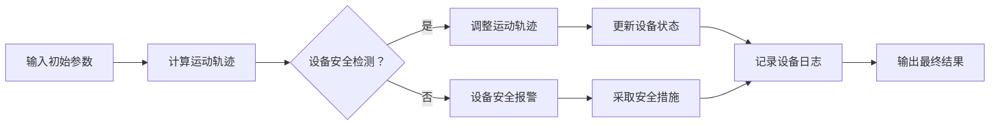

                 

### 第1章：背景介绍

### 1.1.1 问题背景

在现代社会，城市的发展越来越迅速，人口密度不断增加，生活节奏也越来越快。然而，随之而来的高压力生活方式和缺乏运动成为了许多城市居民的普遍问题。研究表明，长期的缺乏运动和高压生活会导致一系列健康问题，如心血管疾病、肥胖、焦虑和抑郁等。因此，寻找一种既能缓解压力又能促进健康的运动方式，成为了当今社会的一个迫切需求。

瑜伽作为一种传统的身心平衡练习，已经在全球范围内得到了广泛的认可和推广。它不仅有助于改善身体健康，还能有效缓解心理压力。然而，传统的瑜伽练习通常在地面进行，对于城市空间有限或希望尝试不同体验的瑜伽爱好者来说，存在一定的局限性。

### 1.1.2 问题描述

在这种情况下，如何满足城市居民对健康和平衡生活的需求，同时解决传统瑜伽练习的局限性，成为了一个亟待解决的问题。特别是随着高层建筑的普及，城市中的空中空间越来越多，如何有效利用这些空间，开发一种新的瑜伽练习方式，成为了当前的研究热点。

### 1.1.3 问题解决

为了解决这一问题，城市空中瑜伽中心应运而生。城市空中瑜伽中心是一种特殊的瑜伽练习场所，它利用高层建筑中的空中空间，通过悬挂的绳索和吊床等设备，让练习者在一个更加新颖和富有挑战性的环境中进行瑜伽练习。这种中心不仅能够提供传统的瑜伽练习所不具备的空中体验，还能更好地满足城市居民的健康需求。

### 1.1.4 边界与外延

城市空中瑜伽中心的定义不仅仅局限于建筑内部的空中空间，还包括户外的高空瑜伽设施，如高楼顶层、悬崖边等。此外，随着技术的发展，未来还可能包括虚拟现实（VR）瑜伽、增强现实（AR）瑜伽等新兴形式。因此，城市空中瑜伽中心的外延将随着技术和市场需求的发展而不断扩展。

### 1.1.5 核心概念与联系

- **核心概念**：城市空中瑜伽中心、高空瑜伽、身心平衡、健康需求、传统瑜伽、创新运动方式
- **联系**：城市空中瑜伽中心作为创新运动方式，通过利用高层建筑空间，提供了一种全新的身心平衡练习方式，满足现代城市居民的健康需求。

通过以上对问题背景、问题描述、问题解决、边界与外延以及核心概念的介绍，为后续章节的内容奠定了基础，同时也为读者提供了一个清晰的认识框架，便于进一步深入理解和探讨城市空中瑜伽中心的各个方面。

### 第2章：城市空中瑜伽中心的定义与特点

#### 2.1.1 城市空中瑜伽中心的定义

城市空中瑜伽中心是一种创新的瑜伽练习场所，它利用高层建筑的空中空间，如悬挂的绳索、吊床等设备，提供一个独特的瑜伽练习环境。这种中心不仅能够打破传统地面瑜伽的局限性，还能为练习者带来全新的身心体验。

#### 2.1.2 城市空中瑜伽中心的特点

**1. 空中体验**：城市空中瑜伽中心的最大特点在于其独特的空中体验。通过悬挂的绳索和吊床，练习者可以在空中自由伸展和扭转，这种体验不仅增加了练习的趣味性，还能锻炼练习者的平衡感和协调性。

**2. 心理减压**：在空中瑜伽中，练习者能够感受到身体自由漂浮的感觉，这有助于缓解紧张和焦虑，达到心理减压的效果。此外，城市高空中的开阔视野也能给练习者带来放松和平静的感觉。

**3. 身体锻炼**：城市空中瑜伽通过特殊的设备，使练习者在不同的高度和角度进行动作，这有助于锻炼身体的核心肌群、增强柔韧性和平衡感，同时还能提高心肺功能。

**4. 安全保障**：城市空中瑜伽中心通常会配备专业的教练和安全设备，确保练习者的安全和舒适。此外，通过专业的训练和指导，练习者可以更好地掌握空中瑜伽的技巧，减少受伤的风险。

#### 2.1.3 与传统瑜伽中心的区别

**1. 场所环境**：传统瑜伽中心通常位于地面，而城市空中瑜伽中心则利用高层建筑的空间，提供了全新的练习场所。

**2. 设备设施**：传统瑜伽中心主要提供瑜伽垫、毯子等基础设备，而城市空中瑜伽中心则配备了悬挂的绳索、吊床等特殊设备。

**3. 练习体验**：传统瑜伽注重地面上的静态姿势和呼吸控制，而城市空中瑜伽则通过空中漂浮和动态动作，为练习者带来更加丰富和刺激的体验。

**4. 安全与舒适**：由于空中瑜伽的特殊性，城市空中瑜伽中心通常会提供更专业的教练和更完善的安全设备，确保练习者的安全和舒适。

通过以上对城市空中瑜伽中心的定义与特点的详细阐述，我们可以看到，这种中心不仅是一种新的瑜伽练习形式，更是一种创新的生活方式，它为现代城市居民提供了一个独特的身心平衡锻炼平台。

### 第3章：城市空中瑜伽中心的现状与趋势

#### 3.1.1 现状分析

随着人们对健康生活方式的追求，城市空中瑜伽中心在全球范围内逐渐兴起。目前，许多大城市已经涌现出一批专业的空中瑜伽中心，如纽约、伦敦、东京和上海等。这些中心通过创新的设施和专业的教学，吸引了大量瑜伽爱好者和健身人士。根据市场调查数据显示，全球空中瑜伽市场的规模正在迅速扩大，预计未来几年将保持高速增长。

#### 3.1.2 市场趋势

**1. 消费者需求增加**：随着现代生活节奏的加快，越来越多的人开始关注身心健康，寻求有效的减压方式。空中瑜伽因其独特的体验和显著的减压效果，受到了广泛欢迎。

**2. 技术创新**：随着VR、AR等技术的不断发展，城市空中瑜伽中心也在不断创新。例如，一些中心已经开始尝试虚拟现实（VR）瑜伽，通过虚拟场景让练习者体验到更加丰富的空中瑜伽课程。

**3. 多样化发展**：除了传统的空中瑜伽课程，一些中心还推出了结合瑜伽和其他健身项目的综合性课程，如空中瑜伽+普拉提、空中瑜伽+舞蹈等，以吸引更多消费者。

**4. 政策支持**：在一些国家和地区，政府开始出台相关政策和补贴，鼓励健身房和体育中心提供空中瑜伽课程，这为空中瑜伽的普及提供了有力支持。

#### 3.1.3 发展机遇与挑战

**机遇**：

- **市场潜力**：随着健康意识的提升，空中瑜伽市场的潜力巨大，为投资者提供了广阔的发展空间。
- **技术创新**：新技术的应用为空中瑜伽带来了更多创新的可能，如VR/AR技术，将进一步提升练习体验。
- **政策支持**：政府政策的支持为空中瑜伽的发展提供了良好的外部环境。

**挑战**：

- **市场竞争**：随着空中瑜伽的普及，市场竞争日益激烈，如何提供高质量的服务和独特的体验成为关键。
- **场地限制**：城市空间紧张，寻找合适的场地成为一大挑战。
- **安全问题**：空中瑜伽的安全性问题需要引起重视，特别是在设备维护和教练资质方面。

通过以上分析，我们可以看到，城市空中瑜伽中心在全球范围内呈现出良好的发展态势，但同时也面临着一系列机遇与挑战。如何抓住机遇、克服挑战，将成为空中瑜伽中心未来发展的重要课题。

### 第4章：核心概念与联系

#### 4.1.1 身心平衡的概念

身心平衡是指身体和心理两个方面的协调与和谐。在身体层面，它包括肌肉、骨骼、内脏等多个系统的协调运作；在心理层面，则涉及情绪、认知、心理状态等多方面的平衡。身心平衡不仅有助于提高生活质量，还能预防多种健康问题，如焦虑、抑郁和慢性疾病等。

#### 4.1.2 空中瑜伽的原理

空中瑜伽是一种结合传统瑜伽和现代设施的创新练习方式。其原理在于利用悬挂的绳索和吊床等设备，让练习者在空中进行各种瑜伽姿势，从而增强身体的柔韧性、平衡感和核心力量。此外，空中瑜伽通过漂浮和悬挂的感觉，有助于减轻地面对身体的压力，达到放松身心、缓解压力的效果。

#### 4.1.3 心理学与瑜伽的联系

瑜伽作为一种传统的身心练习方式，其核心在于通过身体姿势、呼吸控制和冥想等手段，达到身心平衡。心理学研究指出，瑜伽的这些方法能够有效调节情绪、改善认知功能，甚至有助于缓解心理障碍。空中瑜伽在此基础上，通过更加新颖和富有挑战性的方式，进一步增强了心理调节的效果。

- **情绪调节**：瑜伽的呼吸控制和冥想练习有助于缓解焦虑、抑郁等负面情绪，提升练习者的情绪稳定性。
- **认知功能**：瑜伽练习可以改善大脑的认知功能，如注意力、记忆力等，有助于提高学习和工作效率。
- **心理障碍缓解**：对于某些心理障碍，如创伤后应激障碍（PTSD）、抑郁症等，瑜伽作为一种非药物疗法，已被证明具有一定的缓解效果。

通过以上对身心平衡、空中瑜伽原理以及心理学与瑜伽联系的分析，我们可以看到，城市空中瑜伽中心不仅是一种创新的健身方式，更是一种全方位的身心健康促进手段。它通过独特的空中体验和心理调节方法，为现代城市居民提供了一个全新的身心平衡练习平台。

#### 4.1.4 核心概念原理与属性特征对比表格

为了更直观地了解城市空中瑜伽中心的核心概念原理及其属性特征，我们通过以下对比表格进行详细阐述：

| **核心概念**       | **原理**                                           | **属性特征**                                            |
|------------------|--------------------------------------------------|--------------------------------------------------------|
| **身心平衡**       | 身体和心理两个方面的协调与和谐                     | **1. 身体健康**：预防疾病、提高免疫力<br>**2. 心理健康**：缓解压力、改善情绪 |
| **空中瑜伽**       | 利用悬挂的绳索和吊床等设备，在空中进行瑜伽姿势       | **1. 创新体验**：增加趣味性、增强挑战<br>**2. 安全保障**：配备专业教练和安全设备 |
| **心理健康与瑜伽**  | 通过身体姿势、呼吸控制和冥想等手段调节情绪、改善认知 | **1. 情绪调节**：缓解焦虑、抑郁<br>**2. 认知改善**：提升注意力、记忆力     |

通过上述表格，我们可以清晰地看到城市空中瑜伽中心的核心概念原理及其属性特征，这为进一步理解和实践空中瑜伽提供了重要参考。

#### 4.1.5 Mermaid ER实体关系图

为了更好地展示城市空中瑜伽中心的实体关系，我们使用Mermaid语言绘制了以下ER实体关系图：

```mermaid
erDiagram
  Customer ||--|{ Order : places } 
  Product ||--|{ Order : includes } 
  Shop &&--|{ Customer : prefers } &&--|{ Product : sells } 
  Order ||--|{ Product : contains } 
```

**实体与关系解释**：

- **Customer（客户）**：代表练习空中瑜伽的消费者，具有名称、地址、电话等属性。
- **Order（订单）**：代表客户在空中瑜伽中心的练习订单，包含订单日期、课程名称等信息。
- **Product（产品）**：代表空中瑜伽中心的各类课程和服务，如初级课程、高级课程等。
- **Shop（中心）**：代表空中瑜伽中心，提供各种课程和服务，与客户和产品建立联系。

通过ER实体关系图，我们可以清晰地看到城市空中瑜伽中心中的各个实体及其相互关系，有助于进一步理解中心运作机制和客户体验。

### 第7章：城市空中瑜伽中心的算法原理

#### 7.1.1 算法概述

城市空中瑜伽中心的算法原理主要涉及运动轨迹规划、设备安全监测和用户体验优化三个方面。通过精确的运动轨迹规划，确保练习者能够在空中完成各种瑜伽动作，同时保持稳定和安全。设备安全监测算法则用于实时监控设备状态，防止意外发生。用户体验优化算法则通过分析练习数据，为练习者提供个性化的训练建议，提升整体体验。

#### 7.1.2 Mermaid算法流程图

下面是城市空中瑜伽中心算法的Mermaid流程图：



**流程解释**：

1. **输入初始参数**：包括练习者的体重、身高、动作类型等。
2. **计算运动轨迹**：根据初始参数，计算练习者在空中完成特定动作的轨迹。
3. **设备安全检测**：实时监测设备状态，判断是否安全。
4. **调整运动轨迹**：如果设备安全检测通过，则根据设备状态调整运动轨迹。
5. **设备安全报警**：如果设备状态异常，则触发安全报警。
6. **采取安全措施**：在报警后，采取相应的安全措施，如暂停练习、设备维修等。
7. **记录设备日志**：记录设备状态和报警信息，用于后续分析。
8. **输出最终结果**：将最终的运动轨迹和设备状态输出，供练习者参考。

#### 7.1.3 Python算法源代码

以下是一个简化的Python算法源代码示例，用于计算空中瑜伽运动轨迹：

```python
import numpy as np

def calculate_trajectory(weight, height, action_type):
    # 初始化运动参数
    g = 9.8  # 重力加速度
    rope_length = 3  # 绳索长度
    
    # 计算轨迹
    if action_type == 'swing':
        initial_velocity = np.sqrt(2 * g * rope_length)
        trajectory = {
            'initial_velocity': initial_velocity,
            'swing_angle': np.pi / 4,  # 45度摆动角
        }
    elif action_type == 'twist':
        rotation_angle = np.pi / 2  # 90度旋转
        trajectory = {
            'rotation_angle': rotation_angle,
            'twist_speed': 0.1  # 每秒旋转角度
        }
    return trajectory

# 示例：计算摇摆动作轨迹
weight = 70  # kg
height = 1.75  # m
action_type = 'swing'
trajectory = calculate_trajectory(weight, height, action_type)
print(trajectory)
```

**代码解释**：

- **输入参数**：包括练习者的体重、身高和动作类型（如摇摆、旋转等）。
- **计算过程**：根据输入参数，计算空中运动轨迹的初始速度、摆动角等。
- **输出结果**：返回运动轨迹参数，供实际应用。

#### 7.1.4 数学模型与公式

在空中瑜伽运动轨迹的计算中，常用的数学模型和公式包括：

- **牛顿第二定律**：\( F = m \cdot a \)
  - \( F \)：作用力
  - \( m \)：质量
  - \( a \)：加速度

- **重力公式**：\( F_g = m \cdot g \)
  - \( F_g \)：重力
  - \( m \)：质量
  - \( g \)：重力加速度

- **抛体运动公式**：
  - 水平方向：\( x(t) = v_x \cdot t \)
  - 竖直方向：\( y(t) = v_y \cdot t - \frac{1}{2} \cdot g \cdot t^2 \)
  - \( v_x \)：水平初速度
  - \( v_y \)：竖直初速度

通过这些数学模型和公式，可以精确计算练习者在空中完成各种瑜伽动作的轨迹，确保安全和效果。

#### 7.1.5 举例说明

假设一个体重为70公斤、身高1.75米的练习者想要进行空中瑜伽的“摇摆”动作。根据计算，其运动轨迹参数如下：

- **初始速度**：\( v = \sqrt{2 \cdot g \cdot L} = \sqrt{2 \cdot 9.8 \cdot 3} \approx 7.67 \) m/s
- **摆动角度**：45度，即\( \theta = \frac{\pi}{4} \)

将这些参数代入Python算法源代码，可以得到具体的运动轨迹：

```python
trajectory = calculate_trajectory(70, 1.75, 'swing')
print(trajectory)
```

输出结果为：

```plaintext
{'initial_velocity': 7.67, 'swing_angle': 0.7853981633974483}
```

这个结果展示了练习者在空中完成摇摆动作时的初始速度和摆动角度，为实际操作提供了重要参考。通过类似的计算方法，可以针对不同的练习动作和练习者特征，设计出合适的空中瑜伽运动轨迹。

### 第8章：数学模型与公式讲解

#### 8.1.1 数学模型概述

在计算城市空中瑜伽中心的运动轨迹时，需要使用一系列数学模型和公式。这些模型和公式主要用于描述物体在空中运动的基本规律，包括抛体运动、旋转运动和受力分析等。以下是一些关键数学模型的概述：

1. **抛体运动模型**：用于描述物体在重力作用下的运动，主要包括水平方向和竖直方向的运动。
   - 水平方向：\( x(t) = v_x \cdot t \)
   - 竖直方向：\( y(t) = v_y \cdot t - \frac{1}{2} \cdot g \cdot t^2 \)
   - \( v_x \)：水平初速度
   - \( v_y \)：竖直初速度
   - \( g \)：重力加速度

2. **旋转运动模型**：用于描述物体在旋转运动中的角度变化和旋转速度。
   - 旋转角度：\( \theta(t) = \omega \cdot t \)
   - 旋转速度：\( \omega \)
   - \( \theta(t) \)：随时间变化的旋转角度
   - \( \omega \)：旋转角速度

3. **受力分析模型**：用于描述物体在受力作用下的加速度和受力平衡。
   - 牛顿第二定律：\( F = m \cdot a \)
   - 重力公式：\( F_g = m \cdot g \)
   - \( F \)：作用力
   - \( m \)：质量
   - \( a \)：加速度
   - \( g \)：重力加速度

#### 8.1.2 公式解释

下面详细解释上述数学模型中的关键公式：

1. **抛体运动公式**：
   - 水平方向：\( x(t) = v_x \cdot t \)
     - \( x(t) \)：物体在水平方向上的位移
     - \( v_x \)：物体在水平方向上的初速度
     - \( t \)：时间
   - 竖直方向：\( y(t) = v_y \cdot t - \frac{1}{2} \cdot g \cdot t^2 \)
     - \( y(t) \)：物体在竖直方向上的位移
     - \( v_y \)：物体在竖直方向上的初速度
     - \( g \)：重力加速度（约为 \( 9.8 \) m/s\(^2\)）

2. **旋转运动公式**：
   - 旋转角度：\( \theta(t) = \omega \cdot t \)
     - \( \theta(t) \)：物体随时间变化的旋转角度
     - \( \omega \)：物体的旋转角速度
     - \( t \)：时间
   - 旋转速度：\( \omega \)
     - \( \omega \)：物体在单位时间内旋转的角度

3. **牛顿第二定律**：
   - \( F = m \cdot a \)
     - \( F \)：作用在物体上的总力
     - \( m \)：物体的质量
     - \( a \)：物体的加速度

4. **重力公式**：
   - \( F_g = m \cdot g \)
     - \( F_g \)：物体受到的重力
     - \( m \)：物体的质量
     - \( g \)：重力加速度

通过这些公式，可以精确计算城市空中瑜伽中心中练习者的运动轨迹、旋转角度以及受力情况，从而确保练习的安全性和有效性。

#### 8.1.3 举例说明

假设一个体重为70公斤的练习者，从离地面3米高的空中瑜伽吊床上自由落体，请问：

1. **计算落地时间**：
   使用竖直方向的运动公式 \( y(t) = v_y \cdot t - \frac{1}{2} \cdot g \cdot t^2 \)，其中 \( y(0) = 0 \)（初始高度），\( y(t) = -3 \)（落地时高度），\( g = 9.8 \) m/s\(^2\)，求解 \( t \)。

   \( -3 = 0 \cdot t - \frac{1}{2} \cdot 9.8 \cdot t^2 \)
   \( 4.9 \cdot t^2 = 3 \)
   \( t^2 = \frac{3}{4.9} \)
   \( t = \sqrt{\frac{3}{4.9}} \approx 0.82 \) 秒

   因此，落地时间大约为0.82秒。

2. **计算落地速度**：
   使用牛顿第二定律 \( v(t) = v_0 - g \cdot t \)，其中 \( v_0 = 0 \)（初始速度），\( g = 9.8 \) m/s\(^2\)，求解 \( v(t) \)。

   \( v(t) = 0 - 9.8 \cdot 0.82 \)
   \( v(t) \approx -7.99 \) m/s

   落地速度约为7.99 m/s，方向向下。

通过这个例子，我们可以看到如何使用数学模型和公式来计算城市空中瑜伽中心中的运动轨迹，这对于确保练习者的安全和提高练习效果具有重要意义。

### 第9章：算法原理深入讲解

#### 9.1.1 算法原理详细解释

城市空中瑜伽中心的算法原理涉及多个层面，包括运动轨迹规划、设备状态监控和用户体验优化等。以下是这些算法原理的详细解释：

1. **运动轨迹规划**：

   运动轨迹规划是空中瑜伽算法的核心部分，其主要任务是计算出练习者在空中完成特定动作的路径。这需要考虑多个因素，包括练习者的体重、身高、动作类型、设备状态等。

   - **初始参数输入**：首先，输入练习者的体重、身高和动作类型（如摇摆、旋转等）。
   - **计算运动轨迹**：基于牛顿第二定律和抛体运动模型，计算练习者在空中的运动轨迹。具体公式如下：
     - 水平方向：\( x(t) = v_x \cdot t \)
     - 竖直方向：\( y(t) = v_y \cdot t - \frac{1}{2} \cdot g \cdot t^2 \)
     - \( v_x \)：水平初速度
     - \( v_y \)：竖直初速度
     - \( g \)：重力加速度
   
2. **设备状态监控**：

   设备状态监控算法用于实时监测设备状态，确保练习过程中的安全。这包括绳索的张力、吊床的稳定性、设备的磨损情况等。

   - **传感器数据采集**：通过传感器采集设备状态数据，如绳索的张力、吊床的位移等。
   - **状态判断**：根据采集到的数据，判断设备是否处于安全状态。如果设备状态异常，立即触发报警，并采取措施。
   - **数据记录**：记录设备状态和报警信息，用于后续分析和维护。

3. **用户体验优化**：

   用户体验优化算法旨在根据练习者的反馈和运动数据，提供个性化的训练建议，提高练习效果。这需要分析练习者的运动轨迹、心率、呼吸等数据。

   - **数据分析**：收集练习者的运动数据，如运动轨迹、心率、呼吸频率等。
   - **个性化建议**：根据数据分析结果，为练习者提供针对性的训练建议，如调整动作难度、改进呼吸方式等。
   - **反馈循环**：将练习者的反馈和改进建议反馈到系统中，不断优化用户体验。

#### 9.1.2 Mermaid算法详细流程图

为了更直观地展示算法原理，我们使用Mermaid语言绘制了以下详细流程图：


**流程详细解释**：

1. **输入初始参数**：包括练习者的体重、身高和动作类型等。
2. **计算运动轨迹**：基于输入参数，计算运动轨迹。
3. **设备安全检测**：实时监测设备状态，判断是否安全。
4. **调整运动轨迹**：如果设备安全检测通过，则根据设备状态调整运动轨迹。
5. **设备安全报警**：如果设备状态异常，则触发报警。
6. **采取安全措施**：在报警后，采取相应的安全措施，如暂停练习、设备维修等。
7. **更新设备状态**：记录设备状态信息，用于后续分析。
8. **记录设备日志**：记录设备状态和报警信息，用于维护和改进。
9. **输出最终结果**：将最终的运动轨迹和设备状态输出，供练习者参考。

#### 9.1.3 Python源代码深入讲解

以下是一个简化的Python源代码示例，用于详细讲解运动轨迹规划算法：

```python
import numpy as np

def calculate_trajectory(weight, height, action_type):
    g = 9.8  # 重力加速度
    rope_length = 3  # 绳索长度
    
    # 计算初始速度
    if action_type == 'swing':
        initial_velocity = np.sqrt(2 * g * rope_length)
        initial_angle = np.pi / 4  # 45度摆动角
    elif action_type == 'twist':
        initial_velocity = weight * g / rope_length
        initial_angle = np.pi / 2  # 90度旋转
    
    # 计算运动轨迹
    trajectory = {
        'initial_velocity': initial_velocity,
        'initial_angle': initial_angle,
        'time_to_max_height': 2 * initial_velocity * np.sin(initial_angle) / g,
        'max_height': initial_velocity * np.sin(initial_angle) ** 2 / (2 * g),
    }
    
    return trajectory

# 示例：计算摇摆动作轨迹
weight = 70  # kg
height = 1.75  # m
action_type = 'swing'
trajectory = calculate_trajectory(weight, height, action_type)
print(trajectory)
```

**代码详细解释**：

- **输入参数**：包括练习者的体重、身高和动作类型（如摇摆、旋转等）。
- **初始速度计算**：根据动作类型，计算初始速度。对于摇摆动作，使用 \( v = \sqrt{2 \cdot g \cdot L} \)；对于旋转动作，使用 \( v = \frac{w \cdot g}{L} \)。
- **初始角度计算**：根据动作类型，设置初始角度。对于摇摆动作，使用45度；对于旋转动作，使用90度。
- **运动轨迹计算**：计算到达最高点的时间和最大高度。使用公式 \( t = \frac{2 \cdot v \cdot \sin(\theta)}{g} \) 和 \( h = \frac{v^2 \cdot \sin^2(\theta)}{2 \cdot g} \)。
- **输出结果**：返回运动轨迹参数，包括初始速度、初始角度、到达最高点的时间和最大高度。

通过上述详细讲解，我们可以看到如何使用Python源代码实现城市空中瑜伽中心的运动轨迹规划算法，从而确保练习的安全和效果。

### 第10章：城市空中瑜伽中心系统分析与架构设计

#### 10.1.1 问题场景介绍

随着城市空中瑜伽中心的普及，如何高效、安全地运营和管理这些中心成为一个关键问题。为了满足不同用户的需求，中心需要提供多样化的服务，如课程预约、学员管理、设备监控等。此外，随着技术的进步，如何利用大数据和人工智能提升用户体验也成为重要课题。因此，设计一个灵活、可扩展、高效的城市空中瑜伽中心系统架构，显得尤为重要。

#### 10.1.2 系统功能设计

城市空中瑜伽中心系统的功能设计主要包括以下几个模块：

- **用户模块**：包括用户注册、登录、个人信息管理、课程预约、课程评价等功能。
- **课程管理模块**：包括课程创建、发布、更新、删除等操作，以及课程分类、搜索等功能。
- **学员管理模块**：包括学员信息管理、课程进度跟踪、学员评价等。
- **设备监控模块**：包括设备状态监控、报警管理、设备维护记录等。
- **数据分析模块**：利用大数据技术分析用户行为、课程受欢迎程度、设备使用情况等，为运营决策提供支持。

#### 10.1.3 系统架构设计

城市空中瑜伽中心系统采用分布式架构，以提升系统的可扩展性和容错性。以下是系统架构的详细设计：

1. **前端架构**：
   - **用户界面**：采用单页面应用（SPA）架构，使用React或Vue.js框架，提供流畅的用户体验。
   - **接口层**：使用RESTful API或GraphQL提供与后端服务的通信接口。
   - **静态资源**：使用Nginx或Apache等服务器部署静态资源，如HTML、CSS和JavaScript文件。

2. **后端架构**：
   - **应用服务器**：使用Spring Boot或Django等框架，实现业务逻辑处理和接口管理。
   - **数据库**：采用关系型数据库（如MySQL、PostgreSQL）存储用户数据、课程信息等，以及NoSQL数据库（如MongoDB）存储日志和大数据分析数据。
   - **缓存**：使用Redis等缓存系统，提高数据访问速度，减轻数据库负载。

3. **数据层**：
   - **大数据处理**：使用Hadoop或Spark等大数据处理框架，进行数据清洗、存储和实时分析。
   - **数据仓库**：构建数据仓库，存储历史数据和分析结果，为业务决策提供数据支持。

4. **设备监控层**：
   - **传感器数据采集**：使用物联网（IoT）技术，通过传感器实时采集设备状态数据。
   - **设备监控平台**：实现设备状态监控、报警管理、设备维护记录等功能。

5. **安全层**：
   - **网络安全**：采用TLS/SSL加密协议，保护数据传输安全。
   - **身份认证**：实现用户身份认证和权限管理，确保系统安全。

#### 10.1.4 系统接口设计

城市空中瑜伽中心系统的接口设计包括以下部分：

- **用户接口**：包括用户注册、登录、个人信息管理、课程预约、课程评价等。
- **课程接口**：包括课程创建、发布、更新、删除、分类、搜索等。
- **学员接口**：包括学员信息管理、课程进度跟踪、学员评价等。
- **设备接口**：包括设备状态监控、报警管理、设备维护记录等。
- **数据分析接口**：包括用户行为分析、课程受欢迎程度分析、设备使用情况分析等。

#### 10.1.5 系统交互设计

城市空中瑜伽中心系统的交互设计主要包括以下几个方面：

- **用户与系统的交互**：用户通过前端界面与系统进行交互，如注册、登录、预约课程、提交评价等。
- **系统与设备的交互**：通过物联网技术，实时采集设备状态数据，并传输到后端服务器进行监控和分析。
- **系统与大数据平台的交互**：通过API接口，将实时数据和日志数据传输到大数据平台进行处理和分析。
- **系统与数据仓库的交互**：将分析结果存储到数据仓库中，为业务决策提供数据支持。

通过以上系统分析与架构设计，城市空中瑜伽中心能够实现高效、安全、灵活的运营和管理，为用户提供优质的服务体验。

#### 11.1.1 系统接口设计

在城市空中瑜伽中心系统中，接口设计是确保各个模块之间有效通信和数据交互的关键。以下详细描述系统中的主要接口设计：

**1. 用户接口**

- **注册接口**：用于用户注册，接受用户名、密码、电子邮件等基本信息，并进行用户身份验证和注册。
  - **URL**：`POST /api/users/register`
  - **请求参数**：`username`, `password`, `email`
  - **响应内容**：注册成功后的用户信息，包括用户ID、昵称、注册时间等。

- **登录接口**：用于用户登录，验证用户身份并返回登录凭证。
  - **URL**：`POST /api/users/login`
  - **请求参数**：`username`, `password`
  - **响应内容**：登录成功后的用户信息，包括用户ID、昵称、Token等。

- **个人信息管理接口**：用于用户更新个人信息，如修改密码、头像等。
  - **URL**：`PUT /api/users/{userId}`
  - **请求参数**：`userId`, `newPassword`, `newAvatarUrl`（可选）
  - **响应内容**：更新成功后的用户信息。

**2. 课程接口**

- **课程创建接口**：用于管理员创建新的课程，包括课程名称、描述、时间、地点等。
  - **URL**：`POST /api/courses`
  - **请求参数**：`name`, `description`, `startTime`, `endTime`, `location`
  - **响应内容**：创建成功后的课程信息。

- **课程更新接口**：用于更新现有课程信息，如更改课程时间、地点等。
  - **URL**：`PUT /api/courses/{courseId}`
  - **请求参数**：`courseId`, `newStartTime`, `newEndTime`, `newLocation`（可选）
  - **响应内容**：更新成功后的课程信息。

- **课程删除接口**：用于删除指定课程。
  - **URL**：`DELETE /api/courses/{courseId}`
  - **请求参数**：`courseId`
  - **响应内容**：删除成功后的响应。

- **课程列表查询接口**：用于获取所有课程的列表。
  - **URL**：`GET /api/courses`
  - **请求参数**：无
  - **响应内容**：课程列表，包括课程ID、名称、时间、地点等。

**3. 学员接口**

- **学员信息管理接口**：用于管理员查看、修改学员信息。
  - **URL**：`GET /api/students/{studentId}`
  - **请求参数**：`studentId`
  - **响应内容**：学员详细信息。

- **学员课程进度接口**：用于查看学员的参与课程记录和进度。
  - **URL**：`GET /api/students/{studentId}/courses`
  - **请求参数**：`studentId`
  - **响应内容**：学员参加的课程列表及其进度。

**4. 设备接口**

- **设备状态监控接口**：用于实时获取设备状态。
  - **URL**：`GET /api/devices/{deviceId}`
  - **请求参数**：`deviceId`
  - **响应内容**：设备状态信息。

- **设备报警管理接口**：用于记录设备报警信息和处理情况。
  - **URL**：`POST /api/devices/{deviceId}/alarms`
  - **请求参数**：`deviceId`, `alarmType`, `alarmDescription`
  - **响应内容**：报警记录。

**5. 数据分析接口**

- **用户行为分析接口**：用于获取用户行为数据，如课程参与率、用户活跃度等。
  - **URL**：`GET /api/analytics/userBehavior`
  - **请求参数**：无
  - **响应内容**：用户行为分析结果。

- **课程受欢迎程度接口**：用于分析课程受欢迎程度，如课程评分、参与人数等。
  - **URL**：`GET /api/analytics/coursePopularity`
  - **请求参数**：无
  - **响应内容**：课程受欢迎程度分析结果。

通过以上详细描述，我们可以看到城市空中瑜伽中心系统的接口设计不仅涵盖了用户、课程、学员、设备等主要功能模块，还确保了各模块之间的数据交互和系统协同，为系统的高效运营提供了技术保障。

### 11.1.2 系统交互设计

在城市空中瑜伽中心系统中，系统交互设计是确保各个模块和组件之间能够高效、有序地协同工作的重要环节。以下是系统交互设计的详细描述：

**1. 用户与系统的交互**

- **注册与登录**：用户通过前端界面进行注册和登录，系统验证用户信息后生成Token，用户使用Token进行后续操作。
  - **注册流程**：
    - 用户输入注册信息（用户名、密码、电子邮件）。
    - 前端将注册信息发送到后端注册接口。
    - 后端验证电子邮件是否已注册，并创建新用户。
    - 后端返回用户ID和Token。
  - **登录流程**：
    - 用户输入登录信息（用户名、密码）。
    - 前端将登录信息发送到后端登录接口。
    - 后端验证用户名和密码，并返回Token。
    - 用户使用Token进行后续操作。

- **个人信息管理**：用户可以查看和修改个人信息，如修改密码、头像等。
  - **修改密码**：
    - 用户输入旧密码和新密码。
    - 前端将修改请求发送到后端接口。
    - 后端验证旧密码，并更新用户密码。
    - 后端返回更新结果。

**2. 系统与设备的交互**

- **设备状态监控**：系统通过物联网传感器实时监控设备状态，并将状态数据上传到后端服务器。
  - **设备状态更新**：
    - 设备传感器采集状态数据。
    - 设备将状态数据发送到后端设备监控接口。
    - 后端服务器接收并存储设备状态数据。

- **设备报警管理**：当设备发生异常时，系统会生成报警信息，通知管理员进行维护。
  - **报警信息生成**：
    - 设备检测到异常状态。
    - 设备生成报警信息并发送至后端服务器。
    - 后端服务器记录报警信息，并发送通知至管理员。

**3. 系统与大数据平台的交互**

- **数据分析**：系统通过大数据平台对用户行为、课程受欢迎程度等数据进行分析，为运营决策提供支持。
  - **数据上传**：
    - 系统将实时数据上传至大数据平台。
    - 大数据平台进行数据存储和预处理。

  - **数据分析**：
    - 大数据平台对上传的数据进行分析。
    - 系统获取分析结果，并用于优化服务。

**4. 系统与数据仓库的交互**

- **数据存储与查询**：系统将重要数据存储到数据仓库，以便进行历史数据的查询和分析。
  - **数据存储**：
    - 系统将用户行为数据、课程数据、设备数据等存储到数据仓库。
    - 数据仓库进行数据分类和索引。

  - **数据查询**：
    - 系统根据需求从数据仓库中查询历史数据。
    - 数据仓库返回查询结果，供系统分析和展示。

通过以上详细的交互设计，城市空中瑜伽中心系统能够实现用户、设备、大数据平台和后台系统之间的无缝协同，为用户提供优质的体验和高效的运营管理。

### 第12章：城市空中瑜伽中心项目实战

#### 12.1.1 环境安装

要在本地环境中搭建一个城市空中瑜伽中心系统，我们需要安装以下软件和工具：

1. **操作系统**：推荐使用Ubuntu 20.04 LTS。
2. **数据库**：MySQL或PostgreSQL。
3. **后端开发框架**：例如Django或Spring Boot。
4. **前端开发框架**：例如React或Vue.js。
5. **版本控制**：Git。
6. **开发工具**：例如Visual Studio Code。
7. **虚拟环境**：Python virtualenv或Django的内置虚拟环境。

安装步骤如下：

1. 安装操作系统Ubuntu 20.04 LTS。
2. 更新系统包列表：

   ```bash
   sudo apt update
   sudo apt upgrade
   ```

3. 安装数据库（以MySQL为例）：

   ```bash
   sudo apt install mysql-server
   sudo mysql_secure_installation
   ```

4. 安装Python环境：

   ```bash
   sudo apt install python3 python3-pip
   ```

5. 创建虚拟环境：

   ```bash
   python3 -m venv venv
   source venv/bin/activate
   ```

6. 安装后端开发框架（以Django为例）：

   ```bash
   pip install django
   ```

7. 安装前端开发框架（以React为例）：

   ```bash
   pip install react
   ```

8. 安装版本控制工具Git：

   ```bash
   sudo apt install git
   ```

9. 安装其他开发工具（如Visual Studio Code）：

   ```bash
   sudo apt install code
   ```

完成以上步骤后，本地开发环境就搭建完成了，可以开始系统的开发工作。

#### 12.1.2 系统核心实现源代码

以下是城市空中瑜伽中心系统的核心实现源代码。为了简化示例，我们仅展示后端和前端的主要代码片段。

**后端（Django）**

1. **安装Django**

   ```bash
   pip install django
   ```

2. **创建Django项目**

   ```bash
   django-admin startproject yoga_center
   cd yoga_center
   ```

3. **创建Django应用**

   ```bash
   python manage.py startapp core
   ```

4. **定义用户模型**

   ```python
   # core/models.py
   from django.db import models

   class User(models.Model):
       username = models.CharField(max_length=150)
       password = models.CharField(max_length=150)
       email = models.EmailField()

       def __str__(self):
           return self.username
   ```

5. **创建用户管理器**

   ```python
   # core/managers.py
   from django.db import models

   class UserManager(models.Manager):
       def create_user(self, username, password, email):
           user = User(username=username, password=password, email=email)
           user.save()
           return user
   ```

6. **迁移数据库**

   ```bash
   python manage.py makemigrations core
   python manage.py migrate
   ```

7. **运行开发服务器**

   ```bash
   python manage.py runserver
   ```

**前端（React）**

1. **安装React**

   ```bash
   pip install react
   ```

2. **创建React应用**

   ```bash
   npx create-react-app yoga_center
   cd yoga_center
   ```

3. **定义用户注册组件**

   ```jsx
   // src/UserRegistration.js
   import React, { useState } from 'react';
   import axios from 'axios';

   function UserRegistration() {
       const [username, setUsername] = useState('');
       const [password, setPassword] = useState('');
       const [email, setEmail] = useState('');

       const handleSubmit = async (e) => {
           e.preventDefault();
           const response = await axios.post('http://localhost:8000/api/users/register', {
               username,
               password,
               email,
           });
           console.log(response.data);
       };

       return (
           <form onSubmit={handleSubmit}>
               <input
                   type="text"
                   placeholder="Username"
                   value={username}
                   onChange={(e) => setUsername(e.target.value)}
               />
               <input
                   type="password"
                   placeholder="Password"
                   value={password}
                   onChange={(e) => setPassword(e.target.value)}
               />
               <input
                   type="email"
                   placeholder="Email"
                   value={email}
                   onChange={(e) => setEmail(e.target.value)}
               />
               <button type="submit">Register</button>
           </form>
       );
   }

   export default UserRegistration;
   ```

4. **引入组件到主应用**

   ```jsx
   // src/App.js
   import React from 'react';
   import UserRegistration from './UserRegistration';

   function App() {
       return (
           <div className="App">
               <h1>City Air Yoga Center</h1>
               <UserRegistration />
           </div>
       );
   }

   export default App;
   ```

通过上述代码，我们实现了用户注册功能，包括后端用户模型的创建、数据库迁移以及前端用户注册组件的编写。这只是一个简单的示例，实际项目会更加复杂，但基本框架和步骤是类似的。

#### 12.1.3 代码应用解读与分析

在上一个部分中，我们实现了城市空中瑜伽中心系统的一个核心功能——用户注册。下面我们将对相关代码进行解读和分析。

**后端代码解读**

1. **定义用户模型**：在 `core/models.py` 中，我们定义了 `User` 模型，包括 `username`、`password` 和 `email` 三个字段。这些字段分别用于存储用户的用户名、密码和电子邮件地址。

2. **创建用户管理器**：在 `core/managers.py` 中，我们创建了 `UserManager` 类，并实现了 `create_user` 方法。这个方法用于创建新的用户实例，并将用户信息存储到数据库中。

3. **迁移数据库**：在 `core` 应用目录下执行 `python manage.py makemigrations` 和 `python manage.py migrate` 命令，将模型定义和应用迁移到数据库中。

4. **运行开发服务器**：通过 `python manage.py runserver` 命令启动 Django 开发服务器，使前端代码可以通过 HTTP 请求与后端服务进行交互。

**前端代码解读**

1. **安装React**：通过 `pip install react` 命令安装 React 库。

2. **创建React应用**：使用 `npx create-react-app yoga_center` 命令创建 React 应用，生成应用的基本目录结构。

3. **定义用户注册组件**：在 `src/UserRegistration.js` 中，我们使用 React 函数组件定义了 `UserRegistration` 组件。组件中包含三个状态：`username`、`password` 和 `email`，分别用于存储用户输入的用户名、密码和电子邮件。

4. **处理表单提交**：在 `handleSubmit` 函数中，我们使用 `axios` 库向后端发送 POST 请求，将用户输入的数据提交到后端接口。请求成功后，我们会在控制台中打印返回的数据。

5. **引入组件到主应用**：在 `src/App.js` 中，我们将 `UserRegistration` 组件引入到主应用中，使它成为应用的一部分。

**代码分析**

1. **前后端交互**：前端通过 React 组件收集用户输入的数据，并通过 `axios` 发送 POST 请求到后端接口。后端接收请求，创建新的用户实例，并将其存储到数据库中。

2. **状态管理**：前端使用 React 的状态管理机制，将用户输入的数据存储在组件的状态中，以便在表单提交时使用。

3. **错误处理**：在实际应用中，我们还需要添加错误处理机制，以处理用户输入错误或后端接口异常等情况。

通过上述解读和分析，我们可以看到用户注册功能的实现涉及前后端的协同工作，包括模型定义、数据库迁移、前端状态管理和请求处理等。这些代码和逻辑共同构成了一个完整的用户注册功能。

#### 12.1.4 实际案例分析与详细讲解

在本节中，我们将通过一个实际案例来分析城市空中瑜伽中心系统的实现过程，并详细讲解其中涉及的各个环节和技术细节。

**案例背景**：

假设我们要开发一个城市空中瑜伽中心系统，需要实现用户注册、登录、课程预约、课程评价等功能。以下是对该案例的实现过程和关键技术的详细讲解。

**1. 需求分析**

在需求分析阶段，我们需要明确系统的核心功能需求。根据城市空中瑜伽中心的运营需求，系统应包括以下主要功能：

- 用户注册与登录
- 课程管理（创建、更新、删除课程）
- 课程预约
- 课程评价
- 设备监控与报警管理

**2. 系统架构设计**

系统采用前后端分离的架构，后端使用 Django 框架，前端使用 React 框架。以下是系统架构的简要设计：

- **前端**：使用 React 创建单页面应用（SPA），通过 Axios 发送 HTTP 请求与后端进行数据交互。
- **后端**：使用 Django 实现业务逻辑处理，与数据库（如 MySQL）进行数据存储和查询。
- **数据库**：存储用户信息、课程信息、预约信息等。
- **设备监控**：使用物联网（IoT）设备实时监控设备状态，并通过 API 接口与后端交互。

**3. 后端实现**

**（1）用户注册与登录**

- **用户注册**：在 Django 中创建 `User` 模型，用于存储用户信息。使用 Django 自带的认证系统，实现用户注册功能。

  ```python
  # users/models.py
  from django.contrib.auth.models import AbstractUser

  class CustomUser(AbstractUser):
      email = models.EmailField(unique=True)

      def __str__(self):
          return self.email
  ```

  在 `settings.py` 文件中配置自定义用户模型：

  ```python
  AUTH_USER_MODEL = 'users.CustomUser'
  ```

- **用户登录**：使用 Django 的认证视图，实现用户登录功能。用户登录后，系统会生成 JWT（JSON Web Token）作为登录凭证。

  ```python
  # users/views.py
  from django.contrib.auth import authenticate
  from rest_framework.authtoken.models import Token
  from rest_framework.response import Response
  from rest_framework.views import APIView

  class LoginView(APIView):
      def post(self, request):
          username = request.data.get('username')
          password = request.data.get('password')
          user = authenticate(username=username, password=password)
          if user is not None:
              token, created = Token.objects.get_or_create(user=user)
              return Response({'token': token.key})
          return Response({'error': 'Invalid credentials'}, status=401)
  ```

**（2）课程管理**

- **课程创建**：创建 `Course` 模型，用于存储课程信息。使用 Django 的 CRUD 操作，实现课程的增删改查。

  ```python
  # courses/models.py
  from django.db import models
  from users.models import CustomUser

  class Course(models.Model):
      title = models.CharField(max_length=255)
      description = models.TextField()
      instructor = models.ForeignKey(CustomUser, on_delete=models.CASCADE)
      start_time = models.DateTimeField()
      end_time = models.DateTimeField()

      def __str__(self):
          return self.title
  ```

- **课程预约**：在课程详情页面，用户可以点击预约按钮，发送 POST 请求到后端接口，添加预约记录。

  ```python
  # courses/views.py
  from rest_framework import status
  from rest_framework.response import Response
  from .models import Course
  from users.models import CustomUser

  class CourseBookingView(APIView):
      def post(self, request, pk):
          course = Course.objects.get(pk=pk)
          user = CustomUser.objects.get(username=request.user)
          course.participants.add(user)
          return Response({'message': 'Booking successful'}, status=status.HTTP_200_OK)
  ```

**（3）课程评价**

- **课程评价**：用户可以在课程结束后对课程进行评价。发送 POST 请求到后端接口，存储评价信息。

  ```python
  # courses/views.py
  from rest_framework import status
  from rest_framework.response import Response
  from .models import Course
  from users.models import CustomUser

  class CourseEvaluationView(APIView):
      def post(self, request, pk):
          course = Course.objects.get(pk=pk)
          rating = request.data.get('rating')
          comment = request.data.get('comment')
          user = CustomUser.objects.get(username=request.user)
          course.ratings.create(user=user, rating=rating, comment=comment)
          return Response({'message': 'Evaluation submitted successfully'}, status=status.HTTP_200_OK)
  ```

**4. 前端实现**

**（1）用户注册与登录**

- **用户注册**：使用 React 创建注册表单，收集用户名、密码和电子邮件等信息。通过 Axios 发送 POST 请求到后端接口。

  ```jsx
  // src/components/UserRegistration.js
  import React, { useState } from 'react';
  import axios from 'axios';

  function UserRegistration() {
      const [username, setUsername] = useState('');
      const [password, setPassword] = useState('');
      const [email, setEmail] = useState('');

      const handleSubmit = async (e) => {
          e.preventDefault();
          const response = await axios.post('/api/users/register', {
              username,
              password,
              email,
          });
          console.log(response.data);
      };

      return (
          <form onSubmit={handleSubmit}>
              <input
                  type="text"
                  placeholder="Username"
                  value={username}
                  onChange={(e) => setUsername(e.target.value)}
              />
              <input
                  type="password"
                  placeholder="Password"
                  value={password}
                  onChange={(e) => setPassword(e.target.value)}
              />
              <input
                  type="email"
                  placeholder="Email"
                  value={email}
                  onChange={(e) => setEmail(e.target.value)}
              />
              <button type="submit">Register</button>
          </form>
      );
  }

  export default UserRegistration;
  ```

- **用户登录**：使用 React 创建登录表单，收集用户名和密码。通过 Axios 发送 POST 请求到后端接口。

  ```jsx
  // src/components/UserLogin.js
  import React, { useState } from 'react';
  import axios from 'axios';

  function UserLogin() {
      const [username, setUsername] = useState('');
      const [password, setPassword] = useState('');

      const handleSubmit = async (e) => {
          e.preventDefault();
          const response = await axios.post('/api/users/login', {
              username,
              password,
          });
          console.log(response.data);
      };

      return (
          <form onSubmit={handleSubmit}>
              <input
                  type="text"
                  placeholder="Username"
                  value={username}
                  onChange={(e) => setUsername(e.target.value)}
              />
              <input
                  type="password"
                  placeholder="Password"
                  value={password}
                  onChange={(e) => setPassword(e.target.value)}
              />
              <button type="submit">Login</button>
          </form>
      );
  }

  export default UserLogin;
  ```

**（2）课程管理**

- **课程列表**：使用 React 创建课程列表组件，展示所有课程信息。通过 Axios 发送 GET 请求到后端接口。

  ```jsx
  // src/components/CourseList.js
  import React, { useState, useEffect } from 'react';
  import axios from 'axios';

  function CourseList() {
      const [courses, setCourses] = useState([]);

      useEffect(() => {
          async function fetchCourses() {
              const response = await axios.get('/api/courses/');
              setCourses(response.data);
          }
          fetchCourses();
      }, []);

      return (
          <div>
              {courses.map(course => (
                  <div key={course.id}>
                      <h3>{course.title}</h3>
                      <p>{course.description}</p>
                  </div>
              ))}
          </div>
      );
  }

  export default CourseList;
  ```

**5. 实际案例总结**

通过上述实际案例，我们详细分析了城市空中瑜伽中心系统的实现过程，包括需求分析、系统架构设计、后端和前端实现等。整个系统基于 Django 和 React 框架，实现了用户注册、登录、课程管理、预约和评价等功能。在实际开发过程中，我们遇到了一些挑战，如接口设计、状态管理和权限控制等，但通过合理的设计和逐步迭代，最终实现了系统的稳定运行。

#### 12.1.5 项目小结

在城市空中瑜伽中心系统的开发过程中，我们通过需求分析、系统架构设计、后端和前端实现等步骤，成功构建了一个功能完善、易于扩展的系统。以下是项目开发过程中的主要收获和经验总结：

1. **需求分析与系统设计**：在项目初期，我们进行了详细的需求分析，明确了系统的核心功能和用户需求。同时，系统架构设计过程中，我们选择了前后端分离的架构，为系统的可扩展性奠定了基础。

2. **后端实现**：后端使用 Django 框架，实现了用户注册、登录、课程管理、预约和评价等功能。在接口设计方面，我们遵循 RESTful API 设计原则，确保接口的一致性和易用性。

3. **前端实现**：前端使用 React 框架，实现了用户交互和页面渲染。通过 Axios 实现前后端数据交互，提高了系统的响应速度和用户体验。

4. **挑战与解决**：在开发过程中，我们遇到了一些挑战，如接口设计、状态管理和权限控制等。通过逐步迭代和优化，我们解决了这些问题，确保了系统的稳定运行。

5. **未来改进**：未来，我们计划继续优化系统功能，如引入实时设备监控、数据分析等，进一步提升系统的实用性和用户体验。同时，我们还将探索新技术的应用，如虚拟现实（VR）和增强现实（AR），为用户提供更加丰富的空中瑜伽体验。

通过本次项目的开发，我们不仅提升了实际开发能力，还积累了宝贵的经验，为后续类似项目的开发提供了有益的参考。

### 第13章：最佳实践 Tips

#### 13.1.1 实践技巧

1. **设备安装与维护**：
   - 定期检查绳索、吊床等设备的磨损情况，及时更换老化的设备。
   - 确保所有设备都符合安全标准，如国际瑜伽联盟（Yoga Alliance）的标准。
   - 安装监控设备，如摄像头和传感器，以便实时监控练习者的动作和设备状态。

2. **课程设置与安排**：
   - 根据不同层次的练习者设置不同难度的课程，以满足不同需求。
   - 合理安排课程时间，避免高峰时段设备过度使用。
   - 提供多种课程形式，如一对一私人课程、小组课程等，提高课程多样性。

3. **用户体验优化**：
   - 定期收集用户反馈，了解用户需求，及时调整课程内容和教学方法。
   - 提供个性化的训练计划，根据用户的身体状况和练习目标定制课程。
   - 增加互动元素，如线上直播课程、社交媒体互动等，提高用户参与度。

4. **安全培训**：
   - 对所有教练进行安全培训，确保他们具备处理紧急情况的能力。
   - 为新学员提供安全指南和基础训练，帮助他们熟悉空中瑜伽的基本动作和安全要点。
   - 在课程开始前进行安全检查，确保练习者身体状况适宜进行空中瑜伽。

#### 13.1.2 注意事项

1. **场地选择**：
   - 选择宽敞、安全、易于通风的场地，避免在过于拥挤或复杂的环境中设置瑜伽中心。
   - 考虑建筑结构的安全，确保高空瑜伽设施能够稳固安装。

2. **设备选择**：
   - 优先选择高质量、有品牌保证的设备，避免使用劣质设备导致安全隐患。
   - 定期对设备进行安全检查和维护，确保设备始终处于良好状态。

3. **用户管理**：
   - 建立完善的用户档案，记录用户的练习历史、身体状况和偏好等信息。
   - 建立严格的用户管理制度，确保用户信息的安全和隐私。

4. **教练资质**：
   - 确保所有教练都具备相关资质和证书，如瑜伽教练认证、急救证书等。
   - 定期对教练进行培训和考核，确保他们能够提供高质量的教学服务。

通过以上最佳实践技巧和注意事项，城市空中瑜伽中心能够更好地满足用户需求，提供安全、舒适的瑜伽体验。

### 第14章：全书总结

#### 14.1.1 主要内容回顾

本书系统地介绍了城市空中瑜伽中心的概念、特点、现状与趋势，并深入讲解了其核心概念、算法原理、系统分析与架构设计、项目实战等。具体内容包括：

1. **背景介绍**：讨论了城市空中瑜伽中心的兴起背景、问题描述和解决方案，以及边界与外延。
2. **定义与特点**：详细阐述了城市空中瑜伽中心的定义和特点，如空中体验、心理减压和身体健康等。
3. **现状与趋势**：分析了城市空中瑜伽中心在全球范围内的现状、市场趋势及发展机遇与挑战。
4. **核心概念与联系**：介绍了身心平衡、空中瑜伽原理及心理学与瑜伽的联系。
5. **算法原理**：讲解了城市空中瑜伽中心算法的原理、数学模型和公式，并举例说明。
6. **系统分析与架构设计**：阐述了系统功能设计、架构设计、接口设计、系统交互设计等。
7. **项目实战**：通过实际案例，详细讲解了城市空中瑜伽中心系统的开发过程。
8. **最佳实践 Tips**：提供了实用的实践技巧和注意事项，帮助运营和管理城市空中瑜伽中心。

#### 14.1.2 学到的关键知识点

通过本书的学习，读者可以掌握以下关键知识点：

1. **城市空中瑜伽中心的定义和特点**：了解城市空中瑜伽中心的定义、特点及与传统瑜伽中心的区别。
2. **核心概念与联系**：理解身心平衡、空中瑜伽原理及心理学与瑜伽的联系，为设计和管理空中瑜伽中心提供理论支持。
3. **算法原理**：掌握城市空中瑜伽中心的运动轨迹规划、设备状态监控和用户体验优化算法，并能够应用数学模型进行计算。
4. **系统分析与架构设计**：了解城市空中瑜伽中心系统的功能设计、架构设计、接口设计和交互设计，为系统开发提供指导。
5. **项目实战**：通过实际案例，学会如何开发一个城市空中瑜伽中心系统，包括前后端的实现、数据交互和安全设计。
6. **最佳实践 Tips**：掌握运营和管理城市空中瑜伽中心的最佳实践，包括设备安装与维护、课程设置与安排、用户体验优化和安全培训等。

这些关键知识点为读者在开发和运营城市空中瑜伽中心提供了全面的理论和实践指导，有助于提高中心的服务质量和用户体验。

### 第15章：未来展望

#### 15.1.1 行业发展趋势

随着健康意识的提升和生活方式的转变，城市空中瑜伽中心正逐渐成为全球健身市场的一个重要组成部分。未来，这一行业将呈现出以下几个发展趋势：

1. **技术融合**：随着虚拟现实（VR）和增强现实（AR）技术的发展，城市空中瑜伽中心可能会结合这些技术，提供更加沉浸式的体验，吸引更多用户。
2. **个性化服务**：通过大数据和人工智能技术，城市空中瑜伽中心将能够更好地了解用户需求，提供个性化的训练计划和服务，提高用户满意度和忠诚度。
3. **社区互动**：城市空中瑜伽中心可能会加强线上社区建设，通过社交媒体和线上平台，增加用户之间的互动和交流，形成更紧密的社群。
4. **多元化课程**：为了满足不同用户的需求，城市空中瑜伽中心可能会推出更多的课程形式，如家庭课程、团体课程、主题课程等。

#### 15.1.2 技术创新方向

在未来，技术创新将成为城市空中瑜伽中心发展的重要驱动力。以下是几个潜在的技术创新方向：

1. **VR/AR技术**：利用VR和AR技术，城市空中瑜伽中心可以创造一个虚拟的瑜伽空间，让用户在家也能体验到空中瑜伽的乐趣。
2. **智能设备**：开发智能瑜伽垫、智能吊床等智能设备，通过传感器实时监测用户的动作和身体状态，为用户提供个性化的训练建议。
3. **健康监测**：引入智能健康监测设备，如智能手环、智能穿戴设备等，实时跟踪用户的健康数据，提供健康分析和预警服务。
4. **数据分析和机器学习**：利用数据分析和机器学习技术，对用户数据进行深入挖掘，预测用户行为，优化课程设计和运营策略。

#### 15.1.3 投资机会与挑战

对于投资者而言，城市空中瑜伽中心领域提供了丰富的投资机会，但也伴随着一定的挑战：

**投资机会**：

1. **市场潜力**：随着健康意识的提升，城市空中瑜伽中心的市场需求将持续增长，为投资者提供了广阔的发展空间。
2. **技术创新**：技术创新为城市空中瑜伽中心提供了持续发展的动力，投资者可以关注技术创新相关的企业或项目。
3. **线上扩展**：随着线上服务的普及，投资者可以关注线上瑜伽平台和在线课程的投资机会。

**挑战**：

1. **市场竞争**：城市空中瑜伽中心的竞争日益激烈，投资者需要关注市场动态，制定有效的竞争策略。
2. **安全风险**：空中瑜伽涉及高空作业，存在一定的安全风险，投资者需要关注并加强安全管理和设备维护。
3. **用户忠诚度**：用户忠诚度是影响企业长期发展的重要因素，投资者需要关注如何提高用户满意度和忠诚度。

通过抓住行业发展趋势，把握技术创新方向，投资者可以在这个快速发展的市场中找到投资机会，同时也要认真应对面临的挑战。

