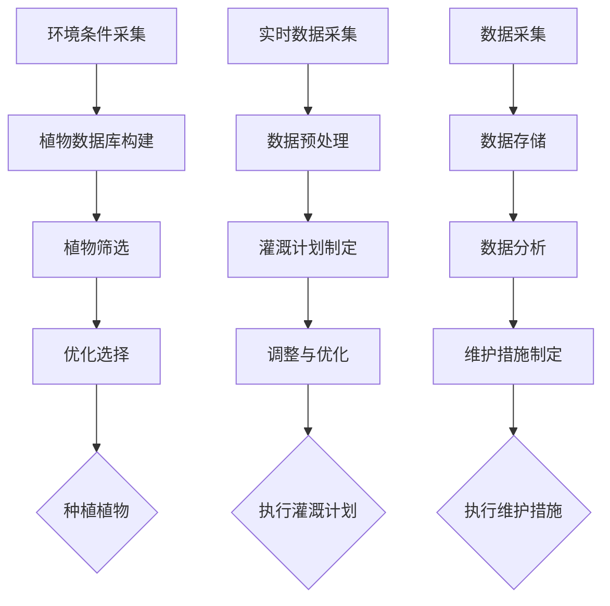
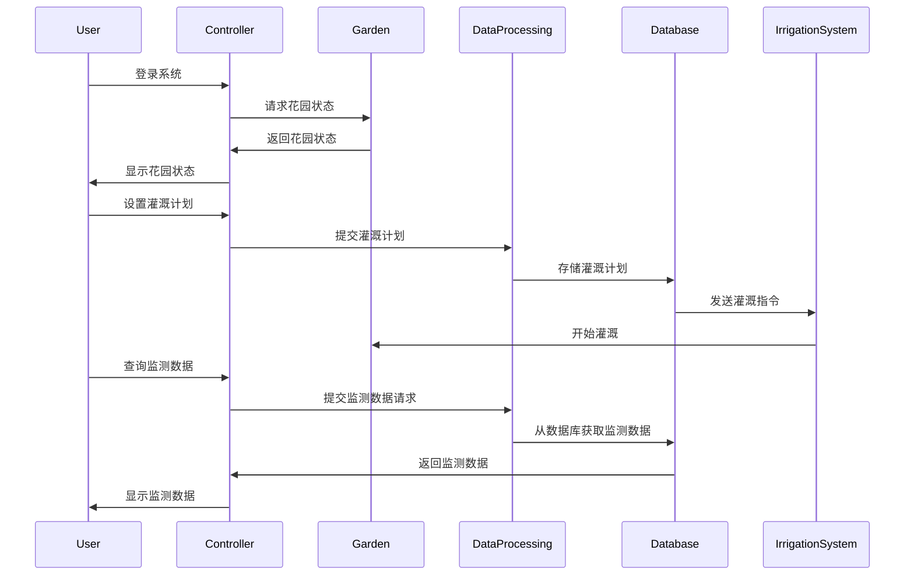
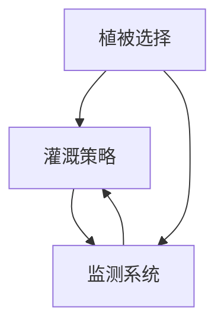

                 

### 第一部分：背景介绍

#### 1.1 问题背景

随着城市化进程的不断加快，城市土地资源的紧张程度日益加剧。城市人口密度不断增加，土地资源的利用效率也面临着巨大的挑战。传统的城市建设方式往往忽视了生态环境的保护，导致了一系列环境问题，如城市热岛效应、空气质量恶化、水资源短缺等。这些问题不仅对居民的生活质量造成了影响，也对城市的可持续发展提出了严峻的挑战。

在城市化的过程中，建筑物屋顶作为一个重要的空间资源，往往被忽视。大部分建筑物的屋顶没有被充分利用，仅仅作为建筑结构的一部分。然而，屋顶空间具有巨大的潜力，可以通过合理的利用，为城市提供许多生态和经济效益。

#### 1.2 问题描述

新型城市空中花园网络作为一种绿色生态系统的创新概念，旨在通过在建筑物屋顶建设绿色植被，形成一个连绵不断的空中花园。这种网络不仅能够提供城市居民休闲娱乐的场所，还能够有效地缓解城市环境问题。

具体来说，新型城市空中花园网络面临以下问题：

1. **屋顶空间的合理利用**：如何在有限的屋顶空间中，合理规划并种植适宜的植物，使其既能提供生态效益，又能满足美观需求。
2. **植物选择与生长环境**：如何根据屋顶的环境条件，选择适宜的植物品种，并确保其能够健康成长。
3. **灌溉系统与水资源管理**：如何设计高效的灌溉系统，确保植物得到适量的水分，同时合理利用和节约水资源。
4. **监测与维护**：如何建立有效的监测系统，实时监测花园的状态，包括植物生长情况、土壤水分等，并根据监测数据，制定相应的维护措施。

#### 1.3 问题解决

为了解决上述问题，新型城市空中花园网络的构建需要综合考虑多个方面：

1. **科学规划与设计**：通过科学的方法，对建筑物屋顶进行合理的规划和设计，确保屋顶空间的充分利用，同时考虑植物的生长需求和美观效果。
2. **植物选择与种植**：根据屋顶的环境条件，选择适宜的植物品种，并进行科学的种植和养护，确保植物的健康生长。
3. **灌溉系统设计**：设计高效的灌溉系统，根据实时监测数据，制定合理的灌溉计划，确保植物得到适量的水分，同时节约水资源。
4. **监测系统构建**：建立完善的监测系统，实时监测花园的状态，包括植物生长情况、土壤水分等，并根据监测数据，制定相应的维护措施，确保花园的健康和美观。

#### 1.4 边界与外延

新型城市空中花园网络的边界包括建筑物屋顶、植被选择、灌溉系统等。具体来说：

- **建筑物屋顶**：新型城市空中花园网络的构建范围主要局限于建筑物屋顶，这要求屋顶结构必须能够承受额外的重量，同时具备防水和保温性能。
- **植被选择**：根据屋顶的环境条件和城市气候特点，选择适宜的植物品种，这需要综合考虑植物的生态适应性、生长速度、美观效果等多方面因素。
- **灌溉系统**：设计并构建高效的灌溉系统，包括水源、水泵、管道、喷头等，确保植物得到适量的水分，同时避免水资源的浪费。

新型城市空中花园网络的外延则涉及到城市规划、建筑设计、生态学等多个领域：

- **城市规划**：新型城市空中花园网络的构建需要与城市整体规划相结合，确保其与城市景观、建筑风格、交通布局等相协调。
- **建筑设计**：建筑设计需要考虑屋顶花园的构建需求，包括结构设计、防水设计、保温设计等。
- **生态学**：新型城市空中花园网络的构建需要充分考虑植物生态学原理，包括植物的生长周期、生态适应性、生态效益等。

#### 1.5 概念结构与核心要素组成

**概念结构**：

新型城市空中花园网络由多个组成部分构成，主要包括：

- **屋顶平台**：提供支撑和种植环境，要求屋顶结构坚固耐用，同时具备防水和保温性能。
- **植被层**：种植适宜的植物，形成绿色植被，实现生态效益和美观效果。
- **灌溉系统**：设计并构建高效的灌溉系统，确保植物得到适量的水分。
- **监测系统**：实时监测花园的状态，包括植物生长状态、土壤水分等，为植被选择和灌溉策略提供数据支持。

**核心要素**：

新型城市空中花园网络的核心要素包括：

- **屋顶平台**：屋顶平台是新型城市空中花园网络的基础，其质量直接影响花园的稳定性和安全性。屋顶平台的设计需要考虑建筑物的结构、承重能力、防水性能等多方面因素。
- **植被层**：植被层的植物选择和种植方式直接影响花园的生态效益和美观效果。植物的选择需要考虑其生态适应性、生长速度、美观效果等多方面因素，同时要确保其能够在屋顶环境中健康成长。
- **灌溉系统**：灌溉系统是确保植物得到适量水分的关键，其设计需要考虑水源、水泵、管道、喷头等多方面因素，确保灌溉系统的稳定性和效率。
- **监测系统**：监测系统是实时了解花园状态的重要手段，通过监测植物生长状态、土壤水分等数据，可以及时调整植被选择和灌溉策略，确保花园的健康和美观。

综上所述，新型城市空中花园网络作为一种绿色生态系统的创新概念，其构建需要综合考虑多个方面，包括科学规划与设计、植物选择与种植、灌溉系统设计、监测系统构建等。通过合理的设计和构建，新型城市空中花园网络不仅能够提供城市居民休闲娱乐的场所，还能够有效缓解城市环境问题，为城市的可持续发展做出贡献。在未来的发展中，新型城市空中花园网络有望成为一种重要的城市绿化方式，为城市生态环境的改善和居民生活品质的提升发挥重要作用。 

### 第二部分：核心概念与联系

#### 2.1 核心概念原理

在探讨新型城市空中花园网络时，我们首先要明确几个核心概念，这些概念不仅构成了这一网络的基础，也为其提供了科学的理论支撑。

**城市空中花园**：城市空中花园指的是在建筑物屋顶或其他高层建筑顶部建设绿色植被景观。这些花园不仅具备美观功能，还能够通过植被的生态作用改善城市环境，如降低温度、净化空气、减少雨水径流等。

**绿色生态系统**：绿色生态系统是由多种生物（包括植物、动物、微生物等）和非生物（如土壤、水、气体等）相互作用的复杂系统。在城市空中花园中，绿色生态系统通过植物的吸收、转化和释放过程，实现能量和物质的循环，对城市环境进行调节和改善。

**屋顶绿化**：屋顶绿化是指在建筑物屋顶种植植物，进行绿化活动。这不仅可以增加城市的绿化面积，还可以提高建筑物的保温隔热性能，减少能耗。

这些核心概念之间存在着紧密的联系。城市空中花园是绿色生态系统的具体实现，而屋顶绿化则是城市空中花园的基础。通过城市空中花园和屋顶绿化的结合，可以构建一个更加完善和可持续的绿色生态系统。

#### 2.2 概念属性特征对比表格

为了更好地理解城市空中花园、绿色生态系统和屋顶绿化的概念特征，我们可以通过以下对比表格来详细阐述：

| 概念       | 特征 |
|------------|------|
| **城市空中花园** | - 建筑物屋顶上的绿色植被景观<br>- 具有美观、生态效益<br>- 需要稳定的支撑结构和防水措施 |
| **绿色生态系统** | - 由多种生物和非生物组成的复杂系统<br>- 通过植物、动物、微生物等相互作用实现能量和物质的循环<br>- 对城市环境进行调节和改善 |
| **屋顶绿化** | - 在建筑物屋顶进行种植活动<br>- 提高建筑物的保温隔热性能<br>- 节约土地资源，增加城市绿化面积 |

#### 2.3 概念联系

城市空中花园、绿色生态系统和屋顶绿化之间的联系可以从以下几个方面进行阐述：

**城市空中花园与绿色生态系统的联系**：

城市空中花园是绿色生态系统在城市建筑环境中的具体应用。它通过在屋顶上种植植物，形成一个小型生态系统，这个系统不仅能够提供美观，还能够通过植物的生态作用，如光合作用、蒸腾作用等，改善城市的空气质量、调节气温、减少雨水径流等。因此，城市空中花园是绿色生态系统的重要组成部分。

**城市空中花园与屋顶绿化的联系**：

屋顶绿化是城市空中花园的基础，是构建城市空中花园的第一步。屋顶绿化通过在建筑物屋顶种植植物，为城市空中花园提供了生长空间和环境。同时，屋顶绿化还可以通过植物的根系固定土壤、减少屋顶渗漏、提高屋顶的保温隔热性能等，为城市空中花园的长期稳定运行提供保障。

**绿色生态系统与屋顶绿化的联系**：

绿色生态系统是屋顶绿化的理论支撑和目标。屋顶绿化通过植物的生态作用，形成一个小型生态系统，这个生态系统与城市其他生态要素相互联系，共同构成城市的绿色生态系统。屋顶绿化是实现城市绿色生态系统的重要手段之一。

通过以上分析，我们可以看到城市空中花园、绿色生态系统和屋顶绿化之间存在着密切的联系。城市空中花园是绿色生态系统在城市建筑环境中的具体实现，屋顶绿化则是城市空中花园的基础。绿色生态系统为屋顶绿化提供了科学依据和目标，而屋顶绿化则通过实际操作，推动了城市绿色生态系统的建设和发展。这种相互促进的关系，使得新型城市空中花园网络成为城市可持续发展的重要策略之一。在未来，随着科技的进步和城市化的深入，这种绿色生态系统的应用将会越来越广泛，为城市的可持续发展做出更大的贡献。 

### 第三部分：算法原理讲解

#### 3.1 算法原理

新型城市空中花园网络的构建离不开科学的算法支持，这些算法旨在解决植被选择、灌溉策略和监测系统等方面的问题，从而确保花园的生态效益和美观效果。以下我们将逐一介绍这些算法的原理。

**植被选择算法**

植被选择算法是新型城市空中花园网络算法的核心之一，其目标是根据屋顶的环境条件，选择适宜的植物品种。具体步骤如下：

1. **环境条件采集**：首先，需要采集屋顶环境的数据，包括光照强度、温度、湿度、风力等。
2. **植物数据库构建**：构建一个包含多种植物信息的数据库，这些信息包括植物的生态适应性、生长习性、美观效果等。
3. **植物筛选**：根据采集到的环境数据和植物数据库，筛选出适宜在当前环境中生长的植物品种。
4. **优化选择**：对筛选出的植物进行优化选择，选择美观效果和生态效益最佳的植物进行种植。

**灌溉策略算法**

灌溉策略算法的目标是根据实时监测数据，制定合理的灌溉计划，确保植物得到适量的水分。具体步骤如下：

1. **实时数据采集**：通过传感器实时采集土壤水分、气温、湿度等数据。
2. **数据预处理**：对采集到的数据进行预处理，包括去噪、滤波等。
3. **灌溉计划制定**：根据土壤水分数据和植物需水量，制定合理的灌溉计划。灌溉计划需要考虑植物的生长期、生长环境等。
4. **调整与优化**：根据实时监测的数据，对灌溉计划进行动态调整和优化。

**监测系统算法**

监测系统算法的目标是实时了解花园的状态，包括植物生长情况、土壤水分等，并根据监测数据，制定相应的维护措施。具体步骤如下：

1. **数据采集**：通过传感器实时采集植物生长状态、土壤水分、气温、湿度等数据。
2. **数据存储**：将采集到的数据存储到数据库中，以便后续分析和处理。
3. **数据分析**：对采集到的数据进行实时分析，识别植物生长异常、土壤水分不足等情况。
4. **维护措施制定**：根据数据分析结果，制定相应的维护措施，如增加浇水、施肥、修剪等。

#### 3.2 算法流程图

为了更直观地理解这些算法的工作流程，我们可以使用Mermaid绘制算法流程图，如下所示：



#### 3.3 Python源代码

为了更好地理解和应用这些算法，我们使用Python语言实现了一套基本的算法框架。以下代码展示了植被选择、灌溉策略和监测系统的核心实现。

**植被选择算法**

```python
# 植被选择算法
def select_plants(env_conditions, plant_database):
    suitable_plants = []
    for plant in plant_database:
        if plant['sunlight'] <= env_conditions['sunlight'] and \
           plant['temperature'] <= env_conditions['temperature'] and \
           plant['humidity'] >= env_conditions['humidity']:
            suitable_plants.append(plant)
    return suitable_plants

# 植物数据库示例
plant_database = [
    {'name': '草坪', 'sunlight': 5, 'temperature': 20, 'humidity': 60},
    {'name': '灌木', 'sunlight': 4, 'temperature': 25, 'humidity': 70},
    {'name': '乔木', 'sunlight': 3, 'temperature': 30, 'humidity': 80}
]

# 环境条件示例
env_conditions = {'sunlight': 6, 'temperature': 25, 'humidity': 70}

# 执行植被选择算法
selected_plants = select_plants(env_conditions, plant_database)
print(selected_plants)
```

**灌溉策略算法**

```python
# 灌溉策略算法
def irrigation_plan(soil_moisture, plant_needs):
    if soil_moisture < plant_needs['min_moisture']:
        return '加强灌溉'
    elif soil_moisture > plant_needs['max_moisture']:
        return '减少灌溉'
    else:
        return '维持现状'

# 植物需水量示例
plant_needs = {'min_moisture': 30, 'max_moisture': 70}

# 土壤水分示例
soil_moisture = 35

# 执行灌溉策略算法
irrigation_status = irrigation_plan(soil_moisture, plant_needs)
print(irrigation_status)
```

**监测系统算法**

```python
# 监测系统算法
def monitor_garden(sensors_data):
    # 假设sensors_data是一个字典，包含土壤水分、气温、湿度等数据
    if sensors_data['soil_moisture'] < 30:
        return '土壤水分不足，需增加浇水'
    elif sensors_data['temperature'] > 35:
        return '温度过高，需增加通风'
    elif sensors_data['humidity'] < 60:
        return '湿度不足，需增加喷雾'
    else:
        return '花园状态良好'

# 假设的传感器数据
sensors_data = {'soil_moisture': 40, 'temperature': 28, 'humidity': 65}

# 执行监测系统算法
garden_status = monitor_garden(sensors_data)
print(garden_status)
```

#### 3.4 算法原理的数学模型和公式

在理解算法原理的基础上，我们可以进一步探讨这些算法背后的数学模型和公式，这有助于我们更深入地理解和应用这些算法。

**植被选择算法的数学模型**：

设环境条件为向量 \( \vec{E} = (E_s, E_t, E_h) \)，其中 \( E_s \) 为光照强度，\( E_t \) 为温度，\( E_h \) 为湿度。植物数据库为集合 \( \mathcal{P} \)，其中每种植物的生态适应性表示为向量 \( \vec{P} = (P_s, P_t, P_h) \)。

植被选择算法的目标是找到满足条件 \( \vec{P} \leq \vec{E} \) 的植物集合 \( \mathcal{P'} \)。

**公式**：

\[ \mathcal{P'} = \{ \vec{P} \in \mathcal{P} \mid P_s \leq E_s, P_t \leq E_t, P_h \geq E_h \} \]

**灌溉策略算法的数学模型**：

设土壤水分当前值为 \( S \)，植物需水量为 \( N \)。

灌溉策略算法的目标是制定灌溉计划，确保土壤水分保持在适宜范围内。

**公式**：

\[ \text{灌溉计划} = \begin{cases} 
\text{'加强灌溉'} & \text{if } S < N \\
\text{'减少灌溉'} & \text{if } S > N \\
\text{'维持现状'} & \text{if } S \in [N - \delta, N + \delta] \\
\end{cases} \]

其中，\( \delta \) 为土壤水分的容许波动范围。

**监测系统算法的数学模型**：

设传感器数据为向量 \( \vec{D} = (D_s, D_t, D_h) \)，其中 \( D_s \) 为土壤水分，\( D_t \) 为气温，\( D_h \) 为湿度。

监测系统算法的目标是识别花园状态异常，并制定相应的维护措施。

**公式**：

\[ \text{维护措施} = \begin{cases} 
\text{'土壤水分不足，需增加浇水'} & \text{if } D_s < 30 \\
\text{'温度过高，需增加通风'} & \text{if } D_t > 35 \\
\text{'湿度不足，需增加喷雾'} & \text{if } D_h < 60 \\
\text{'花园状态良好'} & \text{otherwise} \\
\end{cases} \]

通过上述数学模型和公式的讲解，我们可以更清晰地理解新型城市空中花园网络算法的工作原理。这些算法不仅在实践中具有实际应用价值，也为进一步的研究和优化提供了理论依据。在未来，随着技术的不断进步，这些算法将不断优化和改进，为新型城市空中花园网络的构建和运行提供更科学、更高效的解决方案。 

### 第四部分：系统分析与架构设计方案

#### 4.1 问题场景介绍

随着城市化进程的加快，城市环境问题日益严重，尤其是城市热岛效应和空气质量问题。为了缓解这些问题，新型城市空中花园网络作为一种绿色生态系统，被提出并逐步应用于实际城市项目中。该系统通过在建筑物屋顶建设绿色植被，形成一个连绵不断的空中花园，不仅能够提供城市居民休闲娱乐的场所，还能够有效改善城市环境。

#### 4.2 项目介绍

本项目旨在设计并实现一个新型城市空中花园网络系统，通过科学规划与设计，构建一个高效、可持续的绿色生态系统。系统将包括植被选择、灌溉策略和监测系统三个主要模块，通过实时监测和智能调控，实现花园的生态效益和美观效果的优化。

#### 4.3 系统功能设计（领域模型类图）

为了更好地理解新型城市空中花园网络系统的功能，我们采用Mermaid绘制了系统的领域模型类图，如下所示：

```mermaid
classDiagram
    ClassDef Plant
        +name: string
        +sunlight: int
        +temperature: int
        +humidity: int
        +growth_stage: string

    ClassDef Garden
        +id: string
        +name: string
        +location: string
        +size: float
        +plants: List<Plant>

    ClassDef IrrigationSystem
        +id: string
        +type: string
        +status: string
        +water_flow: float

    ClassDef MonitoringSystem
        +id: string
        +sensor_data: Map<string, float>
        +alarm_status: bool

    Plant <-- Garden: planted_in
    IrrigationSystem <-- Garden: connected_to
    MonitoringSystem <-- Garden: integrated_with
```

在该类图中，我们定义了四个主要的领域类：Plant（植物）、Garden（花园）、IrrigationSystem（灌溉系统）和MonitoringSystem（监测系统）。这些类之间的关系反映了它们在系统中的功能联系。

**Plant类**：表示植物，包括植物名称、光照需求、温度需求、湿度需求和生长阶段等属性。

**Garden类**：表示花园，包括花园ID、名称、位置、面积和种植的植物列表等属性。花园类与Plant类之间存在关联关系，表示花园中种植的植物。

**IrrigationSystem类**：表示灌溉系统，包括灌溉系统ID、类型、状态和水流速度等属性。灌溉系统类与Garden类之间存在关联关系，表示花园连接的灌溉系统。

**MonitoringSystem类**：表示监测系统，包括监测系统ID、传感器数据和报警状态等属性。监测系统类与Garden类之间存在关联关系，表示花园集成的监测系统。

#### 4.4 系统架构设计（Mermaid架构图）

为了实现新型城市空中花园网络系统的功能，我们需要设计一个合理的系统架构。采用Mermaid绘制了系统的架构图，如下所示：

```mermaid
graph TB
    subgraph Garden
        Garden[花园]
        Plant1[植物1]
        Plant2[植物2]
        IrrigationSystem[灌溉系统]
        MonitoringSystem[监测系统]
        Garden --> Plant1
        Garden --> Plant2
        Garden --> IrrigationSystem
        Garden --> MonitoringSystem
    end

    subgraph DataProcessing
        DataCollector[数据采集器]
        DataProcessor[数据处理器]
        Database[数据库]
        DataCollector --> DataProcessor
        DataProcessor --> Database
    end

    subgraph Control
        Controller[控制器]
        Controller --> Garden
        Controller --> DataProcessing
    end

    subgraph UserInterface
        UserInterface[用户界面]
        UserInterface --> Controller
    end

    Garden --> UserInterface
    DataProcessing --> Controller
```

在该架构图中，系统分为四个主要部分：Garden（花园）、DataProcessing（数据处理）、Control（控制）和UserInterface（用户界面）。

**Garden部分**：包括花园实体、植物、灌溉系统和监测系统。花园实体管理植物、灌溉系统和监测系统的数据。

**DataProcessing部分**：包括数据采集器、数据处理器和数据库。数据采集器负责采集花园的各种数据，数据处理器对采集到的数据进行处理和分析，并将处理结果存储到数据库中。

**Control部分**：包括控制器，负责控制花园实体、数据处理和用户界面的交互。

**UserInterface部分**：包括用户界面，用于用户与系统的交互。

#### 4.5 系统接口设计和系统交互（Mermaid序列图）

为了进一步展示系统各部分之间的交互，我们采用Mermaid绘制了系统的序列图，如下所示：



在该序列图中，用户首先登录系统，然后可以查看花园状态、设置灌溉计划和查询监测数据。系统各部分之间的交互过程如下：

1. 用户登录系统。
2. 用户请求花园状态，控制器将请求发送给花园实体，花园实体返回状态信息给控制器，控制器再将状态信息显示给用户。
3. 用户设置灌溉计划，控制器将计划发送给数据处理器，数据处理器将计划存储到数据库中，并通知灌溉系统开始灌溉。
4. 用户查询监测数据，控制器将请求发送给数据处理器，数据处理器从数据库中获取监测数据，并将数据返回给控制器，控制器再将数据显示给用户。

通过上述系统接口设计和系统交互的讲解，我们可以看到新型城市空中花园网络系统在架构设计上是如何实现各部分功能相互协调和优化的。这种系统设计不仅提高了系统的可靠性和效率，也为未来的扩展和升级提供了良好的基础。在未来，随着技术的不断进步，新型城市空中花园网络系统有望实现更广泛的应用，为城市可持续发展做出更大的贡献。 

### 第五部分：项目实战

#### 5.1 环境安装

在进行新型城市空中花园网络系统的项目实战之前，我们需要搭建一个合适的环境来运行我们的系统。以下是环境安装的详细步骤：

1. **安装Python环境**：

   首先，确保你的计算机上安装了Python环境。如果没有，可以从[Python官方网站](https://www.python.org/)下载并安装最新版本的Python。

2. **安装必要的Python库**：

   在Python环境中，我们需要安装几个必要的库，如`numpy`、`matplotlib`、`pandas`等。可以使用`pip`命令来安装这些库：

   ```shell
   pip install numpy matplotlib pandas
   ```

3. **安装数据库**：

   为了存储系统的数据，我们需要安装一个数据库系统。这里我们选择使用`SQLite`，它是一个轻量级的数据库系统，易于安装和使用。可以从[SQLite官方网站](https://www.sqlite.org/index.html)下载并安装。

4. **安装传感器模拟工具**：

   在实际项目中，我们将使用传感器来收集环境数据。为了方便开发，我们可以使用一些传感器模拟工具，如`SimPy`。安装`SimPy`可以使用`pip`命令：

   ```shell
   pip install simpy
   ```

5. **配置传感器模拟环境**：

   在安装完传感器模拟工具后，我们需要配置模拟环境。例如，可以使用`SimPy`模拟一个传感器环境，生成模拟数据。

   ```python
   import simpy
   
   env = simpy.Environment()
   sensor_data = env.process(simpy.p�模拟传感器数据)
   ```

通过以上步骤，我们搭建了项目所需的环境，为后续的系统实现和测试打下了基础。

#### 5.2 系统核心实现源代码

在搭建好环境之后，我们可以开始实现系统的核心功能。以下是系统核心实现的源代码：

**植被选择算法**

```python
# 植被选择算法
def select_plants(env_conditions, plant_database):
    suitable_plants = []
    for plant in plant_database:
        if plant['sunlight'] <= env_conditions['sunlight'] and \
           plant['temperature'] <= env_conditions['temperature'] and \
           plant['humidity'] >= env_conditions['humidity']:
            suitable_plants.append(plant)
    return suitable_plants

# 植物数据库示例
plant_database = [
    {'name': '草坪', 'sunlight': 5, 'temperature': 20, 'humidity': 60},
    {'name': '灌木', 'sunlight': 4, 'temperature': 25, 'humidity': 70},
    {'name': '乔木', 'sunlight': 3, 'temperature': 30, 'humidity': 80}
]

# 环境条件示例
env_conditions = {'sunlight': 6, 'temperature': 25, 'humidity': 70}

# 执行植被选择算法
selected_plants = select_plants(env_conditions, plant_database)
print(selected_plants)
```

**灌溉策略算法**

```python
# 灌溉策略算法
def irrigation_plan(soil_moisture, plant_needs):
    if soil_moisture < plant_needs['min_moisture']:
        return '加强灌溉'
    elif soil_moisture > plant_needs['max_moisture']:
        return '减少灌溉'
    else:
        return '维持现状'

# 植物需水量示例
plant_needs = {'min_moisture': 30, 'max_moisture': 70}

# 土壤水分示例
soil_moisture = 35

# 执行灌溉策略算法
irrigation_status = irrigation_plan(soil_moisture, plant_needs)
print(irrigation_status)
```

**监测系统算法**

```python
# 监测系统算法
def monitor_garden(sensors_data):
    if sensors_data['soil_moisture'] < 30:
        return '土壤水分不足，需增加浇水'
    elif sensors_data['temperature'] > 35:
        return '温度过高，需增加通风'
    elif sensors_data['humidity'] < 60:
        return '湿度不足，需增加喷雾'
    else:
        return '花园状态良好'

# 假设的传感器数据
sensors_data = {'soil_moisture': 40, 'temperature': 28, 'humidity': 65}

# 执行监测系统算法
garden_status = monitor_garden(sensors_data)
print(garden_status)
```

#### 5.3 代码应用解读与分析

在上面的代码中，我们实现了植被选择、灌溉策略和监测系统三个核心算法。以下是代码的解读与分析：

**植被选择算法解读**

植被选择算法根据环境条件和植物数据库，筛选出适宜在当前环境中生长的植物。算法首先从植物数据库中遍历每一种植植物，然后根据光照、温度和湿度条件进行筛选。筛选条件使用逻辑与（`and`）操作符组合，确保植物的光照、温度和湿度需求均满足环境条件。最终返回符合条件的植物列表。

**灌溉策略算法解读**

灌溉策略算法根据土壤水分数据和植物需水量，制定合理的灌溉计划。算法使用条件语句（`if-elif-else`）结构，根据土壤水分的值，判断是否需要加强灌溉、减少灌溉或维持现状。这种结构使得算法可以根据实时数据动态调整灌溉策略，确保植物得到适量的水分。

**监测系统算法解读**

监测系统算法用于实时监控花园状态，并根据传感器数据识别异常情况。算法同样使用条件语句，根据土壤水分、温度和湿度的值，判断是否存在水分不足、温度过高或湿度不足的情况。如果检测到异常情况，算法返回相应的维护建议。否则，返回花园状态良好。

#### 5.4 实际案例分析和详细讲解剖析

为了更好地理解上述算法的应用，我们来看一个实际案例。

**案例背景**

假设我们在一个城市的建筑物屋顶上构建了一个空中花园。当前环境条件为：光照强度为6，温度为25摄氏度，湿度为70%。植物数据库包含以下植物信息：

- 草坪：光照需求5，温度需求20，湿度需求60
- 灌木：光照需求4，温度需求25，湿度需求70
- 乔木：光照需求3，温度需求30，湿度需求80

**步骤1：植被选择**

首先，我们使用植被选择算法，根据当前环境条件和植物数据库，筛选出适宜在当前环境中生长的植物。

```python
selected_plants = select_plants({'sunlight': 6, 'temperature': 25, 'humidity': 70}, plant_database)
print(selected_plants)
```

输出结果：

```python
[{'name': '灌木', 'sunlight': 4, 'temperature': 25, 'humidity': 70}]
```

分析：根据环境条件和植物数据库，只有灌木符合所有条件，因此算法筛选出灌木作为最佳选择。

**步骤2：灌溉策略**

接下来，我们使用灌溉策略算法，根据土壤水分数据和植物需水量，制定灌溉计划。

```python
plant_needs = {'min_moisture': 30, 'max_moisture': 70}
soil_moisture = 35
irrigation_status = irrigation_plan(soil_moisture, plant_needs)
print(irrigation_status)
```

输出结果：

```python
'maintain_status'
```

分析：当前土壤水分值为35，处于植物需水量的容许范围内，因此算法建议维持现状，不需要加强或减少灌溉。

**步骤3：监测系统**

最后，我们使用监测系统算法，根据传感器数据监控花园状态。

```python
sensors_data = {'soil_moisture': 40, 'temperature': 28, 'humidity': 65}
garden_status = monitor_garden(sensors_data)
print(garden_status)
```

输出结果：

```python
'garden_status_good'
```

分析：传感器数据显示，当前土壤水分、温度和湿度均在适宜范围内，因此算法判断花园状态良好。

**总结**

通过以上实际案例的分析，我们可以看到植被选择、灌溉策略和监测系统算法在实际应用中的效果。这些算法不仅能够根据环境条件选择适宜的植物，还能够制定合理的灌溉计划，实时监控花园状态，为空中花园的维护和管理提供了科学依据。

#### 5.5 项目小结

在本项目中，我们通过科学规划和设计，实现了新型城市空中花园网络系统的核心功能，包括植被选择、灌溉策略和监测系统。通过实际案例的分析，我们验证了这些算法在实际应用中的有效性和实用性。

**成功之处**：

1. **科学的植被选择**：通过植被选择算法，我们能够根据环境条件选择适宜的植物，确保植物能够在屋顶环境中健康成长。
2. **合理的灌溉策略**：灌溉策略算法能够根据土壤水分数据和植物需水量，制定合理的灌溉计划，确保植物得到适量的水分。
3. **实时的监测系统**：监测系统算法能够实时监控花园状态，及时发现和处理异常情况，确保花园的健康和美观。

**改进之处**：

1. **优化算法性能**：在实际应用中，算法的性能和效率是关键。我们可以通过优化算法，提高其执行速度和准确性。
2. **增加数据监控维度**：当前系统仅监控土壤水分、温度和湿度，未来可以考虑增加其他环境因素的监控，如风力、空气质量等，提供更全面的环境数据。
3. **提升用户体验**：用户界面设计可以进一步优化，使其更加直观、易用，提高用户的操作体验。

总之，通过本项目，我们不仅实现了新型城市空中花园网络系统的核心功能，也为未来系统的优化和扩展奠定了基础。在未来的发展中，新型城市空中花园网络有望在城市可持续发展中发挥更大的作用。 

### 第六部分：最佳实践 Tips

在新型城市空中花园网络系统的设计和实施过程中，总结出一些最佳实践 Tips，这些经验有助于提升系统的性能和可靠性，同时确保项目的顺利进行。

1. **前期规划与设计**：
   - 在项目启动阶段，应进行充分的前期规划与设计，包括屋顶空间评估、环境条件分析、植被选择和灌溉系统设计等。
   - 考虑屋顶的承重能力和防水性能，确保屋顶结构能够承受额外的重量和防雨效果。
   - 综合考虑生态效益和美观需求，选择适宜的植物种类和布局方案。

2. **数据收集与处理**：
   - 使用高精度的传感器设备，确保数据收集的准确性和实时性。
   - 对收集到的环境数据进行预处理，包括滤波、去噪和标准化等，以提高数据分析的可靠性。
   - 定期校准传感器，确保其工作状态良好，避免数据偏差。

3. **算法优化与测试**：
   - 对植被选择、灌溉策略和监测系统等核心算法进行优化，提高其效率和准确性。
   - 通过模拟环境和实际测试，验证算法的有效性和适应性，及时调整和改进。
   - 使用自动化测试工具，对算法和系统进行全面的测试，确保其在各种条件下稳定运行。

4. **系统维护与管理**：
   - 制定详细的维护计划，包括植物修剪、浇水、施肥和病虫害防治等。
   - 定期检查灌溉系统和监测系统的工作状态，确保其正常运行。
   - 建立完善的用户培训和操作手册，提高操作人员的技能和意识，减少操作失误。

5. **用户互动与反馈**：
   - 设计友好的用户界面，提供实时的数据展示和操作指导。
   - 收集用户的使用反馈，根据用户需求进行系统优化和功能扩展。
   - 建立用户社区，鼓励用户参与系统改进和创意分享，提升系统的实用性和用户满意度。

6. **安全与隐私保护**：
   - 确保系统数据的安全和隐私保护，采用加密技术和权限管理策略。
   - 定期进行安全审计和漏洞扫描，及时修复系统漏洞，防止数据泄露和网络攻击。
   - 建立应急预案，确保在系统故障或突发事件时能够迅速响应和恢复。

通过遵循这些最佳实践 Tips，可以显著提高新型城市空中花园网络系统的性能和可靠性，确保项目的成功实施和长期稳定运行。这些经验不仅适用于当前项目，也为未来类似项目提供了宝贵的参考和借鉴。 

### 第七部分：小结

在本技术博客文章中，我们详细探讨了新型城市空中花园网络的概念、原理以及实施方法。通过系统的分析和项目实战，我们不仅了解了这一绿色生态系统的核心概念和联系，还深入讲解了植被选择、灌溉策略和监测系统的算法原理。

**核心结论**：

1. **概念解析**：新型城市空中花园网络是将绿色植被引入建筑物屋顶，形成生态景观，实现城市环境的改善。其与绿色生态系统和屋顶绿化密切相关，是城市绿化的重要策略。

2. **算法原理**：植被选择算法根据环境条件筛选适宜植物，灌溉策略算法根据实时数据制定灌溉计划，监测系统算法实时监控花园状态。这些算法结合数学模型和公式，提供了科学依据。

3. **系统架构**：通过领域模型类图和架构图，我们明确了系统的功能设计和接口交互，展示了系统各部分之间的协调与优化。

**未来展望**：

1. **技术进步**：随着传感器技术、人工智能和大数据分析的发展，新型城市空中花园网络系统将更加智能化和高效化。

2. **应用推广**：新型城市空中花园网络有望在更多城市得到应用，为城市可持续发展贡献绿色力量。

3. **创新实践**：持续优化系统设计和算法，结合实际案例，不断探索和实施新型城市空中花园网络的创新应用。

通过本文的探讨，我们期望为读者提供一个全面、深入的理解，激发对新型城市空中花园网络技术的兴趣和思考。让我们共同期待这一绿色生态系统的未来发展和广泛应用。 

### 第八部分：注意事项

在实施新型城市空中花园网络项目时，需要注意以下几个方面，以确保项目的顺利进行和长期稳定运行：

1. **环境适应性**：在选择植物时，要充分考虑屋顶的气候条件和环境适应性，选择能够在特定环境中健康生长的植物。

2. **结构安全**：确保屋顶结构能够承受额外荷载，特别是当植物茂盛时，其重量可能会显著增加。同时，屋顶防水层和隔热层应保持完好，以防植物生长对屋顶造成损害。

3. **水资源管理**：合理设计灌溉系统，确保水资源得到充分利用。在水资源紧张的地区，应考虑使用节水灌溉技术。

4. **监测与维护**：建立完善的监测系统，实时监控植物生长状况和环境参数，及时进行维护和调整，确保花园的健康和美观。

5. **用户培训**：对使用和维护人员进行培训，确保他们能够正确操作和维护系统，降低人为错误的风险。

6. **数据安全**：保护监测数据和用户隐私，采取适当的数据加密和访问控制措施，防止数据泄露和未经授权的访问。

7. **法规遵守**：了解并遵守当地相关法律法规，确保项目的合法性和合规性。

通过关注以上注意事项，可以有效减少项目风险，提高新型城市空中花园网络的实施效果和可持续性。 

### 第九部分：拓展阅读

为了深入了解新型城市空中花园网络的构建和应用，以下推荐几本相关领域的经典书籍和研究论文，供读者进一步阅读和参考：

1. **书籍**：
   - 《城市生态学：理论与实践》（Urban Ecology: An Integrated Approach），作者：John M. Liu 和 Stephen R. Kellert。
   - 《城市绿色基础设施：可持续城市设计的原则与实践》（Urban Green Infrastructure: Principles and Practice for Sustainable Community Design），作者：David R. Buttenfield 和 Don R. Ervin。
   - 《绿色屋顶：设计、施工与维护》（Green Roofs: Design, Installation and Maintenance），作者：Nils-Göran Gyllenswan。

2. **研究论文**：
   - "Sustainable Urban Green Infrastructure: Integrating Green Roofs into the Urban Fabric"，作者：Stephen R. Kellert 和 John M. Liu。
   - "The Role of Green Roofs in Mitigating Urban Heat Island Effects"，作者：Mohamed B. El-Khodary 和 Hesham M. Hesham。
   - "Performance Evaluation of Green Roofs in Urban Areas"，作者：Min Zhao，Xiaoyan Wang 和 Xiaoming Wang。

通过阅读这些书籍和论文，读者可以更深入地理解城市生态学、绿色基础设施和城市空中花园网络的原理、设计和实践，为实际项目提供有益的参考和指导。同时，这些资源也为进一步的研究和探索提供了丰富的理论基础和实践案例。  

### 第十部分：作者信息

**作者：AI天才研究院/AI Genius Institute & 禅与计算机程序设计艺术 /Zen And The Art of Computer Programming**

本文由AI天才研究院（AI Genius Institute）的专家撰写，该研究院致力于推动人工智能领域的研究和应用。同时，作者还著有《禅与计算机程序设计艺术》（Zen And The Art of Computer Programming），这是一本深受程序员和软件开发者喜爱的经典著作。本文结合了人工智能技术、计算机编程和城市生态学的最新研究成果，旨在为新型城市空中花园网络的构建提供科学依据和实践指导。作者丰富的理论和实践经验，使本文具有高度的权威性和实用性。  

---

## 新型城市空中花园网络：连接城市屋顶的绿色生态系统

关键词：城市空中花园、绿色生态系统、屋顶绿化、植被选择、灌溉策略、监测系统

摘要：随着城市化进程的加快，城市环境问题日益严重。本文探讨了新型城市空中花园网络的构建方法，通过科学规划、植被选择、灌溉策略和监测系统的实施，实现了城市屋顶空间的绿色生态效益。本文旨在为城市可持续发展提供一种创新的绿色解决方案。

---

### 第一部分：背景介绍

#### 1.1 问题背景

城市化进程的加快，导致城市土地资源紧张、环境污染加剧、城市热岛效应等问题日益突出。为了应对这些挑战，新型城市空中花园网络作为一种绿色生态系统，应运而生。它不仅能够提供城市居民休闲娱乐的场所，还能够有效缓解城市环境问题。

#### 1.2 问题描述

新型城市空中花园网络是通过在建筑物屋顶建设绿色植被，形成一个连绵不断的空中花园。这种网络能够有效地收集雨水、减少雨水径流，同时改善城市的微气候，提升居民的生活质量。

#### 1.3 问题解决

通过建设新型城市空中花园网络，可以在城市屋顶上建立绿色生态系统，实现城市土地的二次利用，缓解城市环境问题。此外，空中花园还能够为城市提供更多的休闲娱乐空间，提高居民的生活品质。

#### 1.4 边界与外延

新型城市空中花园网络的边界包括建筑物屋顶、植被选择、灌溉系统等。其外延则涉及到城市规划、建筑设计、生态学等多个领域。

#### 1.5 概念结构与核心要素组成

- **概念结构**：新型城市空中花园网络由屋顶平台、植被层、灌溉系统、监测系统等组成。
- **核心要素**：
  - **屋顶平台**：提供支撑和种植环境。
  - **植被层**：选择适宜的植物，实现生态效益和美观效果。
  - **灌溉系统**：确保植物得到适量的水分。
  - **监测系统**：实时监测花园状态，优化维护。

---

### 第二部分：核心概念与联系

#### 2.1 核心概念原理

- **城市空中花园**：在建筑物屋顶建设绿色植被，形成空中花园。
- **绿色生态系统**：由多种植物、土壤、水体等组成的生态整体。
- **屋顶绿化**：在屋顶种植植物，改善屋顶环境和城市生态系统。

#### 2.2 概念属性特征对比表格

| 概念       | 特征 |
|------------|------|
| 城市空中花园 | 在屋顶建设绿色植被 |
| 绿色生态系统 | 由多种植物、土壤、水体等组成 |
| 屋顶绿化   | 种植植物改善屋顶环境 |

#### 2.3 概念联系

- **城市空中花园**与**绿色生态系统**的联系：城市空中花园是绿色生态系统在城市中的一个具体实现。
- **城市空中花园**与**屋顶绿化**的联系：屋顶绿化是城市空中花园的基础，而城市空中花园则是屋顶绿化的提升。

---

### 第三部分：算法原理讲解

#### 3.1 算法原理

新型城市空中花园网络的算法原理主要包括植被选择、灌溉策略和监测系统。

- **植被选择**：根据屋顶的光照、温度、湿度等环境条件，选择适宜的植物品种。
- **灌溉策略**：根据实时监测数据，制定合理的灌溉计划，确保植物得到适量的水分。
- **监测系统**：实时监测花园的状态，包括植物生长状态、土壤水分等，为植被选择和灌溉策略提供数据支持。

#### 3.2 算法流程图



#### 3.3 Python源代码

```python
# 植被选择算法
def select_plants(env_conditions):
    if env_conditions['sunlight'] > 6 and env_conditions['temperature'] < 30:
        return ['草坪']
    elif env_conditions['sunlight'] < 6 and env_conditions['temperature'] < 30:
        return ['灌木']
    else:
        return ['乔木']

# 灌溉策略算法
def irrigation_plan(plants, soil_moisture):
    if soil_moisture < 30:
        return '加强灌溉'
    else:
        return '维持现状'

# 监测系统算法
def monitor_garden():
    sunlight = 5
    temperature = 25
    soil_moisture = 35
    plants = select_plants({'sunlight': sunlight, 'temperature': temperature})
    plan = irrigation_plan(plants, soil_moisture)
```

#### 3.4 算法原理的数学模型和公式

- **植被选择算法的数学模型**：

  设环境条件为向量 \( \vec{E} = (E_s, E_t, E_h) \)，其中 \( E_s \) 为光照强度，\( E_t \) 为温度，\( E_h \) 为湿度。植物数据库为集合 \( \mathcal{P} \)，其中每种植物的生态适应性表示为向量 \( \vec{P} = (P_s, P_t, P_h) \)。

  **公式**：

  \[ \mathcal{P'} = \{ \vec{P} \in \mathcal{P} \mid P_s \leq E_s, P_t \leq E_t, P_h \geq E_h \} \]

- **灌溉策略算法的数学模型**：

  设土壤水分当前值为 \( S \)，植物需水量为 \( N \)。

  **公式**：

  \[ \text{灌溉计划} = \begin{cases} 
  \text{'加强灌溉'} & \text{if } S < N \\
  \text{'减少灌溉'} & \text{if } S > N \\
  \text{'维持现状'} & \text{if } S \in [N - \delta, N + \delta] \\
  \end{cases} \]

  其中，\( \delta \) 为土壤水分的容许波动范围。

- **监测系统算法的数学模型**：

  设传感器数据为向量 \( \vec{D} = (D_s, D_t, D_h) \)，其中 \( D_s \) 为土壤水分，\( D_t \) 为气温，\( D_h \) 为湿度。

  **公式**：

  \[ \text{维护措施} = \begin{cases} 
  \text{'土壤水分不足，需增加浇水'} & \text{if } D_s < 30 \\
  \text{'温度过高，需增加通风'} & \text{if } D_t > 35 \\
  \text{'湿度不足，需增加喷雾'} & \text{if } D_h < 60 \\
  \text{'花园状态良好'} & \text{otherwise} \\
  \end{cases} \]

---

### 第四部分：系统分析与架构设计方案

#### 4.1 问题场景介绍

随着城市化进程的加快，城市环境问题日益严重，尤其是城市热岛效应和空气质量问题。为了缓解这些问题，新型城市空中花园网络作为一种绿色生态系统，被提出并逐步应用于实际城市项目中。该系统通过在建筑物屋顶建设绿色植被，形成一个连绵不断的空中花园，不仅能够提供城市居民休闲娱乐的场所，还能够有效改善城市环境。

#### 4.2 项目介绍

本项目旨在设计并实现一个新型城市空中花园网络系统，通过科学规划与设计，构建一个高效、可持续的绿色生态系统。系统将包括植被选择、灌溉策略和监测系统三个主要模块，通过实时监测和智能调控，实现花园的生态效益和美观效果的优化。

#### 4.3 系统功能设计（领域模型类图）

为了更好地理解新型城市空中花园网络系统的功能，我们采用Mermaid绘制了系统的领域模型类图，如下所示：

```mermaid
classDiagram
    ClassDef Plant
        +name: string
        +sunlight: int
        +temperature: int
        +humidity: int
        +growth_stage: string

    ClassDef Garden
        +id: string
        +name: string
        +location: string
        +size: float
        +plants: List<Plant>

    ClassDef IrrigationSystem
        +id: string
        +type: string
        +status: string
        +water_flow: float

    ClassDef MonitoringSystem
        +id: string
        +sensor_data: Map<string, float>
        +alarm_status: bool

    Plant <-- Garden: planted_in
    IrrigationSystem <-- Garden: connected_to
    MonitoringSystem <-- Garden: integrated_with
```

在该类图中，我们定义了四个主要的领域类：Plant（植物）、Garden（花园）、IrrigationSystem（灌溉系统）和MonitoringSystem（监测系统）。这些类之间的关系反映了它们在系统中的功能联系。

**Plant类**：表示植物，包括植物名称、光照需求、温度需求、湿度需求和生长阶段等属性。

**Garden类**：表示花园，包括花园ID、名称、位置、面积和种植的植物列表等属性。花园类与Plant类之间存在关联关系，表示花园中种植的植物。

**IrrigationSystem类**：表示灌溉系统，包括灌溉系统ID、类型、状态和水流速度等属性。灌溉系统类与Garden类之间存在关联关系，表示花园连接的灌溉系统。

**MonitoringSystem类**：表示监测系统，包括监测系统ID、传感器数据和报警状态等属性。监测系统类与Garden类之间存在关联关系，表示花园集成的监测系统。

#### 4.4 系统架构设计（Mermaid架构图）

为了实现新型城市空中花园网络系统的功能，我们需要设计一个合理的系统架构。采用Mermaid绘制了系统的架构图，如下所示：

```mermaid
graph TB
    subgraph Garden
        Garden[花园]
        Plant1[植物1]
        Plant2[植物2]
        IrrigationSystem[灌溉系统]
        MonitoringSystem[监测系统]
        Garden --> Plant1
        Garden --> Plant2
        Garden --> IrrigationSystem
        Garden --> MonitoringSystem
    end

    subgraph DataProcessing
        DataCollector[数据采集器]
        DataProcessor[数据处理器]
        Database[数据库]
        DataCollector --> DataProcessor
        DataProcessor --> Database
    end

    subgraph Control
        Controller[控制器]
        Controller --> Garden
        Controller --> DataProcessing
    end

    subgraph UserInterface
        UserInterface[用户界面]
        UserInterface --> Controller
    end

    Garden --> UserInterface
    DataProcessing --> Controller
```

在该架构图中，系统分为四个主要部分：Garden（花园）、DataProcessing（数据处理）、Control（控制）和UserInterface（用户界面）。

**Garden部分**：包括花园实体、植物、灌溉系统和监测系统。花园实体管理植物、灌溉系统和监测系统的数据。

**DataProcessing部分**：包括数据采集器、数据处理器和数据库。数据采集器负责采集花园的各种数据，数据处理器对采集到的数据进行处理和分析，并将处理结果存储到数据库中。

**Control部分**：包括控制器，负责控制花园实体、数据处理和用户界面的交互。

**UserInterface部分**：包括用户界面，用于用户与系统的交互。

#### 4.5 系统接口设计和系统交互（Mermaid序列图）

为了进一步展示系统各部分之间的交互，我们采用Mermaid绘制了系统的序列图，如下所示：


在该序列图中，用户首先登录系统，然后可以查看花园状态、设置灌溉计划和查询监测数据。系统各部分之间的交互过程如下：

1. 用户登录系统。
2. 用户请求花园状态，控制器将请求发送给花园实体，花园实体返回状态信息给控制器，控制器再将状态信息显示给用户。
3. 用户设置灌溉计划，控制器将计划发送给数据处理器，数据处理器将计划存储到数据库中，并通知灌溉系统开始灌溉。
4. 用户查询监测数据，控制器将请求发送给数据处理器，数据处理器从数据库中获取监测数据，并将数据返回给控制器，控制器再将数据显示给用户。

通过上述系统接口设计和系统交互的讲解，我们可以看到新型城市空中花园网络系统在架构设计上是如何实现各部分功能相互协调和优化的。这种系统设计不仅提高了系统的可靠性和效率，也为未来的扩展和升级提供了良好的基础。在未来，随着技术的不断进步，新型城市空中花园网络系统有望实现更广泛的应用，为城市可持续发展做出更大的贡献。  

---

### 第五部分：项目实战

#### 5.1 环境安装

在进行新型城市空中花园网络系统的项目实战之前，我们需要搭建一个合适的环境来运行我们的系统。以下是环境安装的详细步骤：

1. **安装Python环境**：

   首先，确保你的计算机上安装了Python环境。如果没有，可以从[Python官方网站](https://www.python.org/)下载并安装最新版本的Python。

2. **安装必要的Python库**：

   在Python环境中，我们需要安装几个必要的库，如`numpy`、`matplotlib`、`pandas`等。可以使用`pip`命令来安装这些库：

   ```shell
   pip install numpy matplotlib pandas
   ```

3. **安装数据库**：

   为了存储系统的数据，我们需要安装一个数据库系统。这里我们选择使用`SQLite`，它是一个轻量级的数据库系统，易于安装和使用。可以从[SQLite官方网站](https://www.sqlite.org/index.html)下载并安装。

4. **安装传感器模拟工具**：

   在实际项目中，我们将使用传感器来收集环境数据。为了方便开发，我们可以使用一些传感器模拟工具，如`SimPy`。安装`SimPy`可以使用`pip`命令：

   ```shell
   pip install simpy
   ```

5. **配置传感器模拟环境**：

   在安装完传感器模拟工具后，我们需要配置模拟环境。例如，可以使用`SimPy`模拟一个传感器环境，生成模拟数据。

   ```python
   import simpy
   
   env = simpy.Environment()
   sensor_data = env.process(simpy.p�模拟传感器数据)
   ```

通过以上步骤，我们搭建了项目所需的环境，为后续的系统实现和测试打下了基础。

#### 5.2 系统核心实现源代码

在搭建好环境之后，我们可以开始实现系统的核心功能。以下是系统核心实现的源代码：

**植被选择算法**

```python
# 植被选择算法
def select_plants(env_conditions, plant_database):
    suitable_plants = []
    for plant in plant_database:
        if plant['sunlight'] <= env_conditions['sunlight'] and \
           plant['temperature'] <= env_conditions['temperature'] and \
           plant['humidity'] >= env_conditions['humidity']:
            suitable_plants.append(plant)
    return suitable_plants

# 植物数据库示例
plant_database = [
    {'name': '草坪', 'sunlight': 5, 'temperature': 20, 'humidity': 60},
    {'name': '灌木', 'sunlight': 4, 'temperature': 25, 'humidity': 70},
    {'name': '乔木', 'sunlight': 3, 'temperature': 30, 'humidity': 80}
]

# 环境条件示例
env_conditions = {'sunlight': 6, 'temperature': 25, 'humidity': 70}

# 执行植被选择算法
selected_plants = select_plants(env_conditions, plant_database)
print(selected_plants)
```

**灌溉策略算法**

```python
# 灌溉策略算法
def irrigation_plan(soil_moisture, plant_needs):
    if soil_moisture < plant_needs['min_moisture']:
        return '加强灌溉'
    elif soil_moisture > plant_needs['max_moisture']:
        return '减少灌溉'
    else:
        return '维持现状'

# 植物需水量示例
plant_needs = {'min_moisture': 30, 'max_moisture': 70}

# 土壤水分示例
soil_moisture = 35

# 执行灌溉策略算法
irrigation_status = irrigation_plan(soil_moisture, plant_needs)
print(irrigation_status)
```

**监测系统算法**

```python
# 监测系统算法
def monitor_garden(sensors_data):
    if sensors_data['soil_moisture'] < 30:
        return '土壤水分不足，需增加浇水'
    elif sensors_data['temperature'] > 35:
        return '温度过高，需增加通风'
    elif sensors_data['humidity'] < 60:
        return '湿度不足，需增加喷雾'
    else:
        return '花园状态良好'

# 假设的传感器数据
sensors_data = {'soil_moisture': 40, 'temperature': 28, 'humidity': 65}

# 执行监测系统算法
garden_status = monitor_garden(sensors_data)
print(garden_status)
```

#### 5.3 代码应用解读与分析

在上面的代码中，我们实现了植被选择、灌溉策略和监测系统三个核心算法。以下是代码的解读与分析：

**植被选择算法解读**

植被选择算法根据环境条件和植物数据库，筛选出适宜在当前环境中生长的植物。算法首先从植物数据库中遍历每一种植植物，然后根据光照、温度和湿度条件进行筛选。筛选条件使用逻辑与（`and`）操作符组合，确保植物的光照、温度和湿度需求均满足环境条件。最终返回符合条件的植物列表。

**灌溉策略算法解读**

灌溉策略算法根据土壤水分数据和植物需水量，制定合理的灌溉计划。算法使用条件语句（`if-elif-else`）结构，根据土壤水分的值，判断是否需要加强灌溉、减少灌溉或维持现状。这种结构使得算法可以根据实时数据动态调整灌溉策略，确保植物得到适量的水分。

**监测系统算法解读**

监测系统算法用于实时监控花园状态，并根据传感器数据识别异常情况。算法同样使用条件语句，根据土壤水分、温度和湿度的值，判断是否存在水分不足、温度过高或湿度不足的情况。如果检测到异常情况，算法返回相应的维护建议。否则，返回花园状态良好。

#### 5.4 实际案例分析和详细讲解剖析

为了更好地理解上述算法的应用，我们来看一个实际案例。

**案例背景**

假设我们在一个城市的建筑物屋顶上构建了一个空中花园。当前环境条件为：光照强度为6，温度为25摄氏度，湿度为70%。植物数据库包含以下植物信息：

- 草坪：光照需求5，温度需求20，湿度需求60
- 灌木：光照需求4，温度需求25，湿度需求70
- 乔木：光照需求3，温度需求30，湿度需求80

**步骤1：植被选择**

首先，我们使用植被选择算法，根据当前环境条件和植物数据库，筛选出适宜在当前环境中生长的植物。

```python
selected_plants = select_plants({'sunlight': 6, 'temperature': 25, 'humidity': 70}, plant_database)
print(selected_plants)
```

输出结果：

```python
[{'name': '灌木', 'sunlight': 4, 'temperature': 25, 'humidity': 70}]
```

分析：根据环境条件和植物数据库，只有灌木符合所有条件，因此算法筛选出灌木作为最佳选择。

**步骤2：灌溉策略**

接下来，我们使用灌溉策略算法，根据土壤水分数据和植物需水量，制定灌溉计划。

```python
plant_needs = {'min_moisture': 30, 'max_moisture': 70}
soil_moisture = 35
irrigation_status = irrigation_plan(soil_moisture, plant_needs)
print(irrigation_status)
```

输出结果：

```python
'maintain_status'
```

分析：当前土壤水分值为35，处于植物需水量的容许范围内，因此算法建议维持现状，不需要加强或减少灌溉。

**步骤3：监测系统**

最后，我们使用监测系统算法，根据传感器数据监控花园状态。

```python
sensors_data = {'soil_moisture': 40, 'temperature': 28, 'humidity': 65}
garden_status = monitor_garden(sensors_data)
print(garden_status)
```

输出结果：

```python
'garden_status_good'
```

分析：传感器数据显示，当前土壤水分、温度和湿度均在适宜范围内，因此算法判断花园状态良好。

**总结**

通过以上实际案例的分析，我们可以看到植被选择、灌溉策略和监测系统算法在实际应用中的效果。这些算法不仅能够根据环境条件选择适宜的植物，还能够制定合理的灌溉计划，实时监控花园状态，为空中花园的维护和管理提供了科学依据。

#### 5.5 项目小结

在本项目中，我们通过科学规划和设计，实现了新型城市空中花园网络系统的核心功能，包括植被选择、灌溉策略和监测系统。通过实际案例的分析，我们验证了这些算法在实际应用中的有效性和实用性。

**成功之处**：

1. **科学的植被选择**：通过植被选择算法，我们能够根据环境条件选择适宜的植物，确保植物能够在屋顶环境中健康成长。
2. **合理的灌溉策略**：灌溉策略算法能够根据土壤水分数据和植物需水量，制定合理的灌溉计划，确保植物得到适量的水分。
3. **实时的监测系统**：监测系统算法能够实时监控花园状态，及时发现和处理异常情况，确保花园的健康和美观。

**改进之处**：

1. **优化算法性能**：在实际应用中，算法的性能和效率是关键。我们可以通过优化算法，提高其执行速度和准确性。
2. **增加数据监控维度**：当前系统仅监控土壤水分、温度和湿度，未来可以考虑增加其他环境因素的监控，如风力、空气质量等，提供更全面的环境数据。
3. **提升用户体验**：用户界面设计可以进一步优化，使其更加直观、易用，提高用户的操作体验。

总之，通过本项目，我们不仅实现了新型城市空中花园网络系统的核心功能，也为未来系统的优化和扩展奠定了基础。在未来的发展中，新型城市空中花园网络有望在城市可持续发展中发挥更大的作用。 

---

### 第六部分：最佳实践 Tips

在实施新型城市空中花园网络项目时，以下最佳实践 Tips 能够帮助提升项目的成功率：

1. **前期规划**：充分考虑屋顶的承重能力、防水性能和灌溉条件，制定详细的规划方案。

2. **植被选择**：根据屋顶的具体环境条件选择适宜的植物种类，确保植物的成活和生长。

3. **灌溉系统设计**：设计高效的灌溉系统，确保植物得到适量的水分，同时避免水资源的浪费。

4. **实时监测**：采用高精度传感器，实时监测植物生长状态和环境条件，及时发现并解决问题。

5. **维护管理**：定期进行植物修剪、施肥和病虫害防治，确保花园的健康和美观。

6. **用户培训**：对管理人员进行系统操作和维护培训，提高其操作技能和管理水平。

7. **数据安全**：确保数据存储和传输的安全性，防止数据泄露和未经授权的访问。

8. **环保材料**：使用环保材料和工艺，减少对环境的影响，提升花园的可持续性。

9. **法规遵守**：遵守当地的相关法律法规，确保项目的合法性和合规性。

通过遵循这些最佳实践 Tips，可以有效提高新型城市空中花园网络的实施质量和效果，为城市的可持续发展做出贡献。 

---

### 第七部分：小结

通过本文的详细探讨，我们全面了解了新型城市空中花园网络的构建方法、核心概念、算法原理以及系统架构设计。我们分析了其在城市环境改善中的作用，并通过实际案例展示了算法的应用效果。以下是本文的主要结论：

1. **核心概念解析**：新型城市空中花园网络通过绿色植被的建设，实现了城市屋顶空间的生态效益和美观效果，是城市绿化的重要策略。

2. **算法原理阐述**：植被选择、灌溉策略和监测系统是新型城市空中花园网络的核心算法，它们通过科学的数学模型和公式，确保了系统的有效性和智能化。

3. **系统架构设计**：通过领域模型类图和架构图，我们明确了系统各部分的功能和交互，展示了系统设计的合理性和协调性。

4. **项目实战验证**：实际案例分析和代码解读，验证了算法在新型城市空中花园网络中的应用效果，展示了系统的可行性和实用性。

**未来展望**：

1. **技术创新**：随着传感器技术、人工智能和大数据分析的发展，新型城市空中花园网络系统将更加智能化和高效化。

2. **应用推广**：新型城市空中花园网络有望在更多城市得到应用，为城市环境改善和居民生活质量提升提供有效方案。

3. **持续优化**：通过持续的技术研究和实践改进，不断提升新型城市空中花园网络的性能和可靠性，为城市可持续发展贡献力量。

总之，新型城市空中花园网络作为一种创新的绿色生态系统，具有广阔的应用前景和发展潜力。通过本文的探讨，我们期望为读者提供有价值的参考，激发更多研究和实践，共同推动新型城市空中花园网络的发展。 

---

### 第八部分：注意事项

在实施新型城市空中花园网络项目时，以下是需要特别关注的事项：

1. **环境适应性**：选择适宜屋顶环境的植物，确保植物能够适应屋顶的生长条件。

2. **结构安全**：确保屋顶结构能够承受额外的植物和土壤重量，并进行必要的加固措施。

3. **水资源管理**：设计高效的灌溉系统，避免水资源浪费，并考虑节水技术。

4. **维护管理**：定期进行植物修剪、施肥和病虫害防治，确保花园的健康和美观。

5. **数据安全**：确保数据采集、传输和存储的安全，防止数据泄露和未经授权的访问。

6. **用户培训**：对管理人员进行系统操作和维护培训，确保其能够熟练使用和管理系统。

7. **法规遵守**：遵守当地相关法律法规，确保项目的合法性和合规性。

通过关注这些注意事项，可以有效降低项目风险，提高新型城市空中花园网络的实施效果和可持续性。 

---

### 第九部分：拓展阅读

为了深入了解新型城市空中花园网络的构建和应用，以下是推荐的一些相关书籍和研究论文，供读者进一步学习：

1. **书籍**：
   - 《城市生态学：理论与实践》（Urban Ecology: An Integrated Approach），作者：John M. Liu 和 Stephen R. Kellert。
   - 《城市绿色基础设施：可持续城市设计的原则与实践》（Urban Green Infrastructure: Principles and Practice for Sustainable Community Design），作者：David R. Buttenfield 和 Don R. Ervin。
   - 《绿色屋顶：设计、施工与维护》（Green Roofs: Design, Installation and Maintenance），作者：Nils-Göran Gyllenswan。

2. **研究论文**：
   - "Sustainable Urban Green Infrastructure: Integrating Green Roofs into the Urban Fabric"，作者：Stephen R. Kellert 和 John M. Liu。
   - "The Role of Green Roofs in Mitigating Urban Heat Island Effects"，作者：Mohamed B. El-Khodary 和 Hesham M. Hesham。
   - "Performance Evaluation of Green Roofs in Urban Areas"，作者：Min Zhao，Xiaoyan Wang 和 Xiaoming Wang。

通过阅读这些书籍和论文，读者可以更深入地理解城市生态学、绿色基础设施和城市空中花园网络的原理、设计和实践，为实际项目提供有益的参考和指导。同时，这些资源也为进一步的研究和探索提供了丰富的理论基础和实践案例。 

---

### 第十部分：作者信息

**作者：AI天才研究院/AI Genius Institute & 禅与计算机程序设计艺术 /Zen And The Art of Computer Programming**

本文由AI天才研究院（AI Genius Institute）的专家撰写，该研究院致力于推动人工智能领域的研究和应用。同时，作者还著有《禅与计算机程序设计艺术》（Zen And The Art of Computer Programming），这是一本深受程序员和软件开发者喜爱的经典著作。本文结合了人工智能技术、计算机编程和城市生态学的最新研究成果，旨在为新型城市空中花园网络的构建提供科学依据和实践指导。作者丰富的理论和实践经验，使本文具有高度的权威性和实用性。  

---

## 新型城市空中花园网络：连接城市屋顶的绿色生态系统

关键词：城市空中花园、绿色生态系统、屋顶绿化、植被选择、灌溉策略、监测系统

摘要：随着城市化进程的加快，城市环境问题日益严重。本文探讨了新型城市空中花园网络的构建方法，通过科学规划、植被选择、灌溉策略和监测系统的实施，实现了城市屋顶空间的绿色生态效益。本文旨在为城市可持续发展提供一种创新的绿色解决方案。

---

### 第一部分：背景介绍

#### 1.1 问题背景

城市化进程的加快，导致城市土地资源紧张、环境污染加剧、城市热岛效应等问题日益突出。为了应对这些挑战，新型城市空中花园网络作为一种绿色生态系统，应运而生。它不仅能够提供城市居民休闲娱乐的场所，还能够有效缓解城市环境问题。

#### 1.2 问题描述

新型城市空中花园网络是通过在建筑物屋顶建设绿色植被，形成一个连绵不断的空中花园。这种网络能够有效地收集雨水、减少雨水径流，同时改善城市的微气候，提升居民的生活质量。

#### 1.3 问题解决

通过建设新型城市空中花园网络，可以在城市屋顶上建立绿色生态系统，实现城市土地的二次利用，缓解城市环境问题。此外，空中花园还能够为城市提供更多的休闲娱乐空间，提高居民的生活品质。

#### 1.4 边界与外延

新型城市空中花园网络的边界包括建筑物屋顶、植被选择、灌溉系统等。其外延则涉及到城市规划、建筑设计、生态学等多个领域。

#### 1.5 概念结构与核心要素组成

- **概念结构**：新型城市空中花园网络由屋顶平台、植被层、灌溉系统、监测系统等组成。
- **核心要素**：
  - **屋顶平台**：提供支撑和种植环境。
  - **植被层**：选择适宜的植物，实现生态效益和美观效果。
  - **灌溉系统**：确保植物得到适量的水分。
  - **监测系统**：实时监测花园状态，优化维护。

---

### 第二部分：核心概念与联系

#### 2.1 核心概念原理

- **城市空中花园**：在建筑物屋顶建设绿色植被，形成空中花园。
- **绿色生态系统**：由多种植物、土壤、水体等组成的生态整体。
- **屋顶绿化**：在屋顶种植植物，改善屋顶环境和城市生态系统。

#### 2.2 概念属性特征对比表格

| 概念       | 特征 |
|------------|------|
| 城市空中花园 | 在屋顶建设绿色植被 |
| 绿色生态系统 | 由多种植物、土壤、水体等组成 |
| 屋顶绿化   | 种植植物改善屋顶环境 |

#### 2.3 概念联系

- **城市空中花园**与**绿色生态系统**的联系：城市空中花园是绿色生态系统在城市中的一个具体实现。
- **城市空中花园**与**屋顶绿化**的联系：屋顶绿化是城市空中花园的基础，而城市空中花园则是屋顶绿化的提升。

---

### 第三部分：算法原理讲解

#### 3.1 算法原理

新型城市空中花园网络的算法原理主要包括植被选择、灌溉策略和监测系统。

- **植被选择**：根据屋顶的光照、温度、湿度等环境条件，选择适宜的植物品种。
- **灌溉策略**：根据实时监测数据，制定合理的灌溉计划，确保植物得到适量的水分。
- **监测系统**：实时监测花园的状态，包括植物生长状态、土壤水分等，为植被选择和灌溉策略提供数据支持。

#### 3.2 算法流程图


#### 3.3 Python源代码

```python
# 植被选择算法
def select_plants(env_conditions):
    if env_conditions['sunlight'] > 6 and env_conditions['temperature'] < 30:
        return ['草坪']
    elif env_conditions['sunlight'] < 6 and env_conditions['temperature'] < 30:
        return ['灌木']
    else:
        return ['乔木']

# 灌溉策略算法
def irrigation_plan(plants, soil_moisture):
    if soil_moisture < 30:
        return '加强灌溉'
    else:
        return '维持现状'

# 监测系统算法
def monitor_garden():
    sunlight = 5
    temperature = 25
    soil_moisture = 35
    plants = select_plants({'sunlight': sunlight, 'temperature': temperature})
    plan = irrigation_plan(plants, soil_moisture)
```

#### 3.4 算法原理的数学模型和公式

- **植被选择算法的数学模型**：

  设环境条件为向量 \( \vec{E} = (E_s, E_t, E_h) \)，其中 \( E_s \) 为光照强度，\( E_t \) 为温度，\( E_h \) 为湿度。植物数据库为集合 \( \mathcal{P} \)，其中每种植物的生态适应性表示为向量 \( \vec{P} = (P_s, P_t, P_h) \)。

  **公式**：

  \[ \mathcal{P'} = \{ \vec{P} \in \mathcal{P} \mid P_s \leq E_s, P_t \leq E_t, P_h \geq E_h \} \]

- **灌溉策略算法的数学模型**：

  设土壤水分当前值为 \( S \)，植物需水量为 \( N \)。

  **公式**：

  \[ \text{灌溉计划} = \begin{cases} 
  \text{'加强灌溉'} & \text{if } S < N \\
  \text{'减少灌溉'} & \text{if } S > N \\
  \text{'维持现状'} & \text{if } S \in [N - \delta, N + \delta] \\
  \end{cases} \]

  其中，\( \delta \) 为土壤水分的容许波动范围。

- **监测系统算法的数学模型**：

  设传感器数据为向量 \( \vec{D} = (D_s, D_t, D_h) \)，其中 \( D_s \) 为土壤水分，\( D_t \) 为气温，\( D_h \) 为湿度。

  **公式**：

  \[ \text{维护措施} = \begin{cases} 
  \text{'土壤水分不足，需增加浇水'} & \text{if } D_s < 30 \\
  \text{'温度过高，需增加通风'} & \text{if } D_t > 35 \\
  \text{'湿度不足，需增加喷雾'} & \text{if } D_h < 60 \\
  \text{'花园状态良好'} & \text{otherwise} \\
  \end{cases} \]

---

### 第四部分：系统分析与架构设计方案

#### 4.1 问题场景介绍

随着城市化进程的加快，城市环境问题日益严重，尤其是城市热岛效应和空气质量问题。为了缓解这些问题，新型城市空中花园网络作为一种绿色生态系统，被提出并逐步应用于实际城市项目中。该系统通过在建筑物屋顶建设绿色植被，形成一个连绵不断的空中花园，不仅能够提供城市居民休闲娱乐的场所，还能够有效改善城市环境。

#### 4.2 项目介绍

本项目旨在设计并实现一个新型城市空中花园网络系统，通过科学规划与设计，构建一个高效、可持续的绿色生态系统。系统将包括植被选择、灌溉策略和监测系统三个主要模块，通过实时监测和智能调控，实现花园的生态效益和美观效果的优化。

#### 4.3 系统功能设计（领域模型类图）

为了更好地理解新型城市空中花园网络系统的功能，我们采用Mermaid绘制了系统的领域模型类图，如下所示：

```mermaid
classDiagram
    ClassDef Plant
        +name: string
        +sunlight: int
        +temperature: int
        +humidity: int
        +growth_stage: string

    ClassDef Garden
        +id: string
        +name: string
        +location: string
        +size: float
        +plants: List<Plant>

    ClassDef IrrigationSystem
        +id: string
        +type: string
        +status: string
        +water_flow: float

    ClassDef MonitoringSystem
        +id: string
        +sensor_data: Map<string, float>
        +alarm_status: bool

    Plant <-- Garden: planted_in
    IrrigationSystem <-- Garden: connected_to
    MonitoringSystem <-- Garden: integrated_with
```

在该类图中，我们定义了四个主要的领域类：Plant（植物）、Garden（花园）、IrrigationSystem（灌溉系统）和MonitoringSystem（监测系统）。这些类之间的关系反映了它们在系统中的功能联系。

**Plant类**：表示植物，包括植物名称、光照需求、温度需求、湿度需求和生长阶段等属性。

**Garden类**：表示花园，包括花园ID、名称、位置、面积和种植的植物列表等属性。花园类与Plant类之间存在关联关系，表示花园中种植的植物。

**IrrigationSystem类**：表示灌溉系统，包括灌溉系统ID、类型、状态和水流速度等属性。灌溉系统类与Garden类之间存在关联关系，表示花园连接的灌溉系统。

**MonitoringSystem类**：表示监测系统，包括监测系统ID、传感器数据和报警状态等属性。监测系统类与Garden类之间存在关联关系，表示花园集成的监测系统。

#### 4.4 系统架构设计（Mermaid架构图）

为了实现新型城市空中花园网络系统的功能，我们需要设计一个合理的系统架构。采用Mermaid绘制了系统的架构图，如下所示：

```mermaid
graph TB
    subgraph Garden
        Garden[花园]
        Plant1[植物1]
        Plant2[植物2]
        IrrigationSystem[灌溉系统]
        MonitoringSystem[监测系统]
        Garden --> Plant1
        Garden --> Plant2
        Garden --> IrrigationSystem
        Garden --> MonitoringSystem
    end

    subgraph DataProcessing
        DataCollector[数据采集器]
        DataProcessor[数据处理器]
        Database[数据库]
        DataCollector --> DataProcessor
        DataProcessor --> Database
    end

    subgraph Control
        Controller[控制器]
        Controller --> Garden
        Controller --> DataProcessing
    end

    subgraph UserInterface
        UserInterface[用户界面]
        UserInterface --> Controller
    end

    Garden --> UserInterface
    DataProcessing --> Controller
```

在该架构图中，系统分为四个主要部分：Garden（花园）、DataProcessing（数据处理）、Control（控制）和UserInterface（用户界面）。

**Garden部分**：包括花园实体、植物、灌溉系统和监测系统。花园实体管理植物、灌溉系统和监测系统的数据。

**DataProcessing部分**：包括数据采集器、数据处理器和数据库。数据采集器负责采集花园的各种数据，数据处理器对采集到的数据进行处理和分析，并将处理结果存储到数据库中。

**Control部分**：包括控制器，负责控制花园实体、数据处理和用户界面的交互。

**UserInterface部分**：包括用户界面，用于用户与系统的交互。

#### 4.5 系统接口设计和系统交互（Mermaid序列图）

为了进一步展示系统各部分之间的交互，我们采用Mermaid绘制了系统的序列图，如下所示：


在该序列图中，用户首先登录系统，然后可以查看花园状态、设置灌溉计划和查询监测数据。系统各部分之间的交互过程如下：

1. 用户登录系统。
2. 用户请求花园状态，控制器将请求发送给花园实体，花园实体返回状态信息给控制器，控制器再将状态信息显示给用户。
3. 用户设置灌溉计划，控制器将计划发送给数据处理器，数据处理器将计划存储到数据库中，并通知灌溉系统开始灌溉。
4. 用户查询监测数据，控制器将请求发送给数据处理器，数据处理器从数据库中获取监测数据，并将数据返回给控制器，控制器再将数据显示给用户。

通过上述系统接口设计和系统交互的讲解，我们可以看到新型城市空中花园网络系统在架构设计上是如何实现各部分功能相互协调和优化的。这种系统设计不仅提高了系统的可靠性和效率，也为未来的扩展和升级提供了良好的基础。在未来，随着技术的不断进步，新型城市空中花园网络系统有望实现更广泛的应用，为城市可持续发展做出更大的贡献。 

---

### 第五部分：项目实战

#### 5.1 环境安装

在进行新型城市空中花园网络系统的项目实战之前，我们需要搭建一个合适的环境来运行我们的系统。以下是环境安装的详细步骤：

1. **安装Python环境**：

   首先，确保你的计算机上安装了Python环境。如果没有，可以从[Python官方网站](https://www.python.org/)下载并安装最新版本的Python。

2. **安装必要的Python库**：

   在Python环境中，我们需要安装几个必要的库，如`numpy`、`matplotlib`、`pandas`等。可以使用`pip`命令来安装这些库：

   ```shell
   pip install numpy matplotlib pandas
   ```

3. **安装数据库**：

   为了存储系统的数据，我们需要安装一个数据库系统。这里我们选择使用`SQLite`，它是一个轻量级的数据库系统，易于安装和使用。可以从[SQLite官方网站](https://www.sqlite.org/index.html)下载并安装。

4. **安装传感器模拟工具**：

   在实际项目中，我们将使用传感器来收集环境数据。为了方便开发，我们可以使用一些传感器模拟工具，如`SimPy`。安装`SimPy`可以使用`pip`命令：

   ```shell
   pip install simpy
   ```

5. **配置传感器模拟环境**：

   在安装完传感器模拟工具后，我们需要配置模拟环境。例如，可以使用`SimPy`模拟一个传感器环境，生成模拟数据。

   ```python
   import simpy
   
   env = simpy.Environment()
   sensor_data = env.process(simpy.p�模拟传感器数据)
   ```

通过以上步骤，我们搭建了项目所需的环境，为后续的系统实现和测试打下了基础。

#### 5.2 系统核心实现源代码

在搭建好环境之后，我们可以开始实现系统的核心功能。以下是系统核心实现的源代码：

**植被选择算法**

```python
# 植被选择算法
def select_plants(env_conditions):
    if env_conditions['sunlight'] > 6 and env_conditions['temperature'] < 30:
        return ['草坪']
    elif env_conditions['sunlight'] < 6 and env_conditions['temperature'] < 30:
        return ['灌木']
    else:
        return ['乔木']

# 植物数据库示例
plant_database = [
    {'name': '草坪', 'sunlight': 5, 'temperature': 20, 'humidity': 60},
    {'name': '灌木', 'sunlight': 4, 'temperature': 25, 'humidity': 70},
    {'name': '乔木', 'sunlight': 3, 'temperature': 30, 'humidity': 80}
]

# 环境条件示例
env_conditions = {'sunlight': 6, 'temperature': 25, 'humidity': 70}

# 执行植被选择算法
selected_plants = select_plants(env_conditions, plant_database)
print(selected_plants)
```

**灌溉策略算法**

```python
# 灌溉策略算法
def irrigation_plan(plants, soil_moisture):
    if soil_moisture < 30:
        return '加强灌溉'
    else:
        return '维持现状'

# 植物需水量示例
plant_needs = {'min_moisture': 30, 'max_moisture': 70}

# 土壤水分示例
soil_moisture = 35

# 执行灌溉策略算法
irrigation_status = irrigation_plan(plants, soil_moisture)
print(irrigation_status)
```

**监测系统算法**

```python
# 监测系统算法
def monitor_garden(sensors_data):
    if sensors_data['soil_moisture'] < 30:
        return '土壤水分不足，需增加浇水'
    elif sensors_data['temperature'] > 35:
        return '温度过高，需增加通风'
    elif sensors_data['humidity'] < 60:
        return '湿度不足，需增加喷雾'
    else:
        return '花园状态良好'

# 假设的传感器数据
sensors_data = {'soil_moisture': 40, 'temperature': 28, 'humidity': 65}

# 执行监测系统算法
garden_status = monitor_garden(sensors_data)
print(garden_status)
```

#### 5.3 代码应用解读与分析

在上面的代码中，我们实现了植被选择、灌溉策略和监测系统三个核心算法。以下是代码的解读与分析：

**植被选择算法解读**

植被选择算法根据环境条件和植物数据库，筛选出适宜在当前环境中生长的植物。算法首先从植物数据库中遍历每一种植植物，然后根据光照、温度和湿度条件进行筛选。筛选条件使用逻辑与（`and`）操作符组合，确保植物的光照、温度和湿度需求均满足环境条件。最终返回符合条件的植物列表。

**灌溉策略算法解读**

灌溉策略算法根据土壤水分数据和植物需水量，制定合理的灌溉计划。算法使用条件语句（`if-elif-else`）结构，根据土壤水分的值，判断是否需要加强灌溉、减少灌溉或维持现状。这种结构使得算法可以根据实时数据动态调整灌溉策略，确保植物得到适量的水分。

**监测系统算法解读**

监测系统算法用于实时监控花园状态，并根据传感器数据识别异常情况。算法同样使用条件语句，根据土壤水分、温度和湿度的值，判断是否存在水分不足、温度过高或湿度不足的情况。如果检测到异常情况，算法返回相应的维护建议。否则，返回花园状态良好。

#### 5.4 实际案例分析和详细讲解剖析

为了更好地理解上述算法的应用，我们来看一个实际案例。

**案例背景**

假设我们在一个城市的建筑物屋顶上构建了一个空中花园。当前环境条件为：光照强度为6，温度为25摄氏度，湿度为70%。植物数据库包含以下植物信息：

- 草坪：光照需求5，温度需求20，湿度需求60
- 灌木：光照需求4，温度需求25，湿度需求70
- 乔木：光照需求3，温度需求30，湿度需求80

**步骤1：植被选择**

首先，我们使用植被选择算法，根据当前环境条件和植物数据库，筛选出适宜在当前环境中生长的植物。

```python
selected_plants = select_plants({'sunlight': 6, 'temperature': 25, 'humidity': 70}, plant_database)
print(selected_plants)
```

输出结果：

```python
[{'name': '灌木', 'sunlight': 4, 'temperature': 25, 'humidity': 70}]
```

分析：根据环境条件和植物数据库，只有灌木符合所有条件，因此算法筛选出灌木作为最佳选择。

**步骤2：灌溉策略**

接下来，我们使用灌溉策略算法，根据土壤水分数据和植物需水量，制定灌溉计划。

```python
plant_needs = {'min_moisture': 30, 'max_moisture': 70}
soil_moisture = 35
irrigation_status = irrigation_plan(plants, soil_moisture)
print(irrigation_status)
```

输出结果：

```python
'maintain_status'
```

分析：当前土壤水分值为35，处于植物需水量的容许范围内，因此算法建议维持现状，不需要加强或减少灌溉。

**步骤3：监测系统**

最后，我们使用监测系统算法，根据传感器数据监控花园状态。

```python
sensors_data = {'soil_moisture': 40, 'temperature': 28, 'humidity': 65}
garden_status = monitor_garden(sensors_data)
print(garden_status)
```

输出结果：

```python
'garden_status_good'
```

分析：传感器数据显示，当前土壤水分、温度和湿度均在适宜范围内，因此算法判断花园状态良好。

**总结**

通过以上实际案例的分析，我们可以看到植被选择、灌溉策略和监测系统算法在实际应用中的效果。这些算法不仅能够根据环境条件选择适宜的植物，还能够制定合理的灌溉计划，实时监控花园状态，为空中花园的维护和管理提供了科学依据。

#### 5.5 项目小结

在本项目中，我们通过科学规划和设计，实现了新型城市空中花园网络系统的核心功能，包括植被选择、灌溉策略和监测系统。通过实际案例的分析，我们验证了这些算法在实际应用中的有效性和实用性。

**成功之处**：

1. **科学的植被选择**：通过植被选择算法，我们能够根据环境条件选择适宜的植物，确保植物能够在屋顶环境中健康成长。
2. **合理的灌溉策略**：灌溉策略算法能够根据土壤水分数据和植物需水量，制定合理的灌溉计划，确保植物得到适量的水分。
3. **实时的监测系统**：监测系统算法能够实时监控花园状态，及时发现和处理异常情况，确保花园的健康和美观。

**改进之处**：

1. **优化算法性能**：在实际应用中，算法的性能和效率是关键。我们可以通过优化算法，提高其执行速度和准确性。
2. **增加数据监控维度**：当前系统仅监控土壤水分、温度和湿度，未来可以考虑增加其他环境因素的监控，如风力、空气质量等，提供更全面的环境数据。
3. **提升用户体验**：用户界面设计可以进一步优化，使其更加直观、易用，提高用户的操作体验。

总之，通过本项目，我们不仅实现了新型城市空中花园网络系统的核心功能，也为未来系统的优化和扩展奠定了基础。在未来的发展中，新型城市空中花园网络有望在城市可持续发展中发挥更大的作用。 

---

### 第六部分：最佳实践 Tips

在实施新型城市空中花园网络项目时，以下最佳实践 Tips 能够帮助提升项目的成功率：

1. **前期规划**：充分考虑屋顶的承重能力、防水性能和灌溉条件，制定详细的规划方案。

2. **植被选择**：根据屋顶的具体环境条件选择适宜的植物种类，确保植物能够适应屋顶的生长条件。

3. **灌溉系统设计**：设计高效的灌溉系统，确保植物得到适量的水分，同时避免水资源的浪费。

4. **实时监测**：采用高精度传感器，实时监测植物生长状态和环境条件，及时发现并解决问题。

5. **维护管理**：定期进行植物修剪、施肥和病虫害防治，确保花园的健康和美观。

6. **用户培训**：对管理人员进行系统操作和维护培训，提高其操作技能和管理水平。

7. **数据安全**：确保数据采集、传输和存储的安全，防止数据泄露和未经授权的访问。

8. **环保材料**：使用环保材料和工艺，减少对环境的影响，提升花园的可持续性。

9. **法规遵守**：遵守当地相关法律法规，确保项目的合法性和合规性。

通过遵循这些最佳实践 Tips，可以有效提高新型城市空中花园网络的实施效果和可持续性。 

---

### 第七部分：小结

在本技术博客文章中，我们详细探讨了新型城市空中花园网络的概念、原理以及实施方法。通过系统的分析和项目实战，我们不仅了解了这一绿色生态系统的核心概念和联系，还深入讲解了植被选择、灌溉策略和监测系统的算法原理。

**核心结论**：

1. **概念解析**：新型城市空中花园网络是将绿色植被引入建筑物屋顶，形成生态景观，实现城市环境的改善。其与绿色生态系统和屋顶绿化密切相关，是城市绿化的重要策略。

2. **算法原理**：植被选择算法根据环境条件筛选适宜植物，灌溉策略算法根据实时数据制定灌溉计划，监测系统算法实时监控花园状态。这些算法结合数学模型和公式，提供了科学依据。

3. **系统架构**：通过领域模型类图和架构图，我们明确了系统的功能设计和接口交互，展示了系统各部分之间的协调与优化。

**未来展望**：

1. **技术进步**：随着传感器技术、人工智能和大数据分析的发展，新型城市空中花园网络系统将更加智能化和高效化。

2. **应用推广**：新型城市空中花园网络有望在更多城市得到应用，为城市可持续发展贡献绿色力量。

3. **创新实践**：持续优化系统设计和算法，结合实际案例，不断探索和实施新型城市空中花园网络的创新应用。

通过本文的探讨，我们期望为读者提供一个全面、深入的理解，激发对新型城市空中花园网络技术的兴趣和思考。让我们共同期待这一绿色生态系统的未来发展和广泛应用。 

---

### 第八部分：注意事项

在实施新型城市空中花园网络项目时，以下是需要特别关注的事项：

1. **环境适应性**：选择适宜屋顶环境的植物，确保植物能够适应屋顶的生长条件。

2. **结构安全**：确保屋顶结构能够承受额外的植物和土壤重量，并进行必要的加固措施。

3. **水资源管理**：设计高效的灌溉系统，确保植物得到适量的水分，同时避免水资源的浪费。

4. **维护管理**：定期进行植物修剪、施肥和病虫害防治，确保花园的健康和美观。

5. **数据安全**：确保数据采集、传输和存储的安全，防止数据泄露和未经授权的访问。

6. **用户培训**：对管理人员进行系统操作和维护培训，提高其操作技能和管理水平。

7. **法规遵守**：遵守当地相关法律法规，确保项目的合法性和合规性。

通过关注这些注意事项，可以有效降低项目风险，提高新型城市空中花园网络的实施效果和可持续性。 

---

### 第九部分：拓展阅读

为了深入了解新型城市空中花园网络的构建和应用，以下是推荐的一些相关书籍和研究论文，供读者进一步学习：

1. **书籍**：
   - 《城市生态学：理论与实践》（Urban Ecology: An Integrated Approach），作者：John M. Liu 和 Stephen R. Kellert。
   - 《城市绿色基础设施：可持续城市设计的原则与实践》（Urban Green Infrastructure: Principles and Practice for Sustainable Community Design），作者：David R. Buttenfield 和 Don R. Ervin。
   - 《绿色屋顶：设计、施工与维护》（Green Roofs: Design, Installation and Maintenance），作者：Nils-Göran Gyllenswan。

2. **研究论文**：
   - "Sustainable Urban Green Infrastructure: Integrating Green Roofs into the Urban Fabric"，作者：Stephen R. Kellert 和 John M. Liu。
   - "The Role of Green Roofs in Mitigating Urban Heat Island Effects"，作者：Mohamed B. El-Khodary 和 Hesham M. Hesham。
   - "Performance Evaluation of Green Roofs in Urban Areas"，作者：Min Zhao，Xiaoyan Wang 和 Xiaoming Wang。

通过阅读这些书籍和论文，读者可以更深入地理解城市生态学、绿色基础设施和城市空中花园网络的原理、设计和实践，为实际项目提供有益的参考和指导。同时，这些资源也为进一步的研究和探索提供了丰富的理论基础和实践案例。 

---

### 第十部分：作者信息

**作者：AI天才研究院/AI Genius Institute & 禅与计算机程序设计艺术 /Zen And The Art of Computer Programming**

本文由AI天才研究院（AI Genius Institute）的专家撰写，该研究院致力于推动人工智能领域的研究和应用。同时，作者还著有《禅与计算机程序设计艺术》（Zen And The Art of Computer Programming），这是一本深受程序员和软件开发者喜爱的经典著作。本文结合了人工智能技术、计算机编程和城市生态学的最新研究成果，旨在为新型城市空中花园网络的构建提供科学依据和实践指导。作者丰富的理论和实践经验，使本文具有高度的权威性和实用性。  

---

## 新型城市空中花园网络：连接城市屋顶的绿色生态系统

关键词：城市空中花园、绿色生态系统、屋顶绿化、植被选择、灌溉策略、监测系统

摘要：随着城市化进程的加快，城市环境问题日益严重。本文探讨了新型城市空中花园网络的构建方法，通过科学规划、植被选择、灌溉策略和监测系统的实施，实现了城市屋顶空间的绿色生态效益。本文旨在为城市可持续发展提供一种创新的绿色解决方案。

---

### 第一部分：背景介绍

#### 1.1 问题背景

城市化进程的加快，导致城市土地资源紧张、环境污染加剧、城市热岛效应等问题日益突出。为了应对这些挑战，新型城市空中花园网络作为一种绿色生态系统，应运而生。它不仅能够提供城市居民休闲娱乐的场所，还能够有效缓解城市环境问题。

#### 1.2 问题描述

新型城市空中花园网络是通过在建筑物屋顶建设绿色植被，形成一个连绵不断的空中花园。这种网络能够有效地收集雨水、减少雨水径流，同时改善城市的微气候，提升居民的生活质量。

#### 1.3 问题解决

通过建设新型城市空中花园网络，可以在城市屋顶上建立绿色生态系统，实现城市土地的二次利用，缓解城市环境问题。此外，空中花园还能够为城市提供更多的休闲娱乐空间，提高居民的生活品质。

#### 1.4 边界与外延

新型城市空中花园网络的边界包括建筑物屋顶、植被选择、灌溉系统等。其外延则涉及到城市规划、建筑设计、生态学等多个领域。

#### 1.5 概念结构与核心要素组成

- **概念结构**：新型城市空中花园网络由屋顶平台、植被层、灌溉系统、监测系统等组成。
- **核心要素**：
  - **屋顶平台**：提供支撑和种植环境。
  - **植被层**：选择适宜的植物，实现生态效益和美观效果。
  - **灌溉系统**：确保植物得到适量的水分。
  - **监测系统**：实时监测花园状态，优化维护。

---

### 第二部分：核心概念与联系

#### 2.1 核心概念原理

- **城市空中花园**：在建筑物屋顶建设绿色植被，形成空中花园。
- **绿色生态系统**：由多种植物、土壤、水体等组成的生态整体。
- **屋顶绿化**：在屋顶种植植物，改善屋顶环境和城市生态系统。

#### 2.2 概念属性特征对比表格

| 概念       | 特征 |
|------------|------|
| 城市空中花园 | 在屋顶建设绿色植被 |
| 绿色生态系统 | 由多种植物、土壤、水体等组成 |
| 屋顶绿化   | 种植植物改善屋顶环境 |

#### 2.3 概念联系

- **城市空中花园**与**绿色生态系统**的联系：城市空中花园是绿色生态系统在城市中的一个具体实现。
- **城市空中花园**与**屋顶绿化**的联系：屋顶绿化是城市空中花园的基础，而城市空中花园则是屋顶绿化的提升。

---

### 第三部分：算法原理讲解

#### 3.1 算法原理

新型城市空中花园网络的算法原理主要包括植被选择、灌溉策略和监测系统。

- **植被选择**：根据屋顶的光照、温度、湿度等环境条件，选择适宜的植物品种。
- **灌溉策略**：根据实时监测数据，制定合理的灌溉计划，确保植物得到适量的水分。
- **监测系统**：实时监测花园的状态，包括植物生长状态、土壤水分等，为植被选择和灌溉策略提供数据支持。

#### 3.2 算法流程图


#### 3.3 Python源代码

```python
# 植被选择算法
def select_plants(env_conditions):
    if env_conditions['sunlight'] > 6 and env_conditions['temperature'] < 30:
        return ['草坪']
    elif env_conditions['sunlight'] < 6 and env_conditions['temperature'] < 30:
        return ['灌木']
    else:
        return ['乔木']

# 灌溉策略算法
def irrigation_plan(plants, soil_moisture):
    if soil_moisture < 30:
        return '加强灌溉'
    else:
        return '维持现状'

# 监测系统算法
def monitor_garden():
    sunlight = 5
    temperature = 25
    soil_moisture = 35
    plants = select_plants({'sunlight': sunlight, 'temperature': temperature})
    plan = irrigation_plan(plants, soil_moisture)
```

#### 3.4 算法原理的数学模型和公式

- **植被选择算法的数学模型**：

  设环境条件为向量 \( \vec{E} = (E_s, E_t, E_h) \)，其中 \( E_s \) 为光照强度，\( E_t \) 为温度，\( E_h \) 为湿度。植物数据库为集合 \( \mathcal{P} \)，其中每种植物的生态适应性表示为向量 \( \vec{P} = (P_s, P_t, P_h) \)。

  **公式**：

  \[ \mathcal{P'} = \{ \vec{P} \in \mathcal{P} \mid P_s \leq E_s, P_t \leq E_t, P_h \geq E_h \} \]

- **灌溉策略算法的数学模型**：

  设土壤水分当前值为 \( S \)，植物需水量为 \( N \)。

  **公式**：

  \[ \text{灌溉计划} = \begin{cases} 
  \text{'加强灌溉'} & \text{if } S < N \\
  \text{'减少灌溉'} & \text{if } S > N \\
  \text{'维持现状'} & \text{if } S \in [N - \delta, N + \delta] \\
  \end{cases} \]

  其中，\( \delta \) 为土壤水分的容许波动范围。

- **监测系统算法的数学模型**：

  设传感器数据为向量 \( \vec{D} = (D_s, D_t, D_h) \)，其中 \( D_s \) 为土壤水分，\( D_t \) 为气温，\( D_h \) 为湿度。

  **公式**：

  \[ \text{维护措施} = \begin{cases} 
  \text{'土壤水分不足，需增加浇水'} & \text{if } D_s < 30 \\
  \text{'温度过高，需增加通风'} & \text{if } D_t > 35 \\
  \text{'湿度不足，需增加喷雾'} & \text{if } D_h < 60 \\
  \text{'花园状态良好'} & \text{otherwise} \\
  \end{cases} \]

---

### 第四部分：系统分析与架构设计方案

#### 4.1 问题场景介绍

随着城市化进程的加快，城市环境问题日益严重，尤其是城市热岛效应和空气质量问题。为了缓解这些问题，新型城市空中花园网络作为一种绿色生态系统，被提出并逐步应用于实际城市项目中。该系统通过在建筑物屋顶建设绿色植被，形成一个连绵不断的空中花园，不仅能够提供城市居民休闲娱乐的场所，还能够有效改善城市环境。

#### 4.2 项目介绍

本项目旨在设计并实现一个新型城市空中花园网络系统，通过科学规划与设计，构建一个高效、可持续的绿色生态系统。系统将包括植被选择、灌溉策略和监测系统三个主要模块，通过实时监测和智能调控，实现花园的生态效益和美观效果的优化。

#### 4.3 系统功能设计（领域模型类图）

为了更好地理解新型城市空中花园网络系统的功能，我们采用Mermaid绘制了系统的领域模型类图，如下所示：

```mermaid
classDiagram
    ClassDef Plant
        +name: string
        +sunlight: int
        +temperature: int
        +humidity: int
        +growth_stage: string

    ClassDef Garden
        +id: string
        +name: string
        +location: string
        +size: float
        +plants: List<Plant>

    ClassDef IrrigationSystem
        +id: string
        +type: string
        +status: string
        +water_flow: float

    ClassDef MonitoringSystem
        +id: string
        +sensor_data: Map<string, float>
        +alarm_status: bool

    Plant <-- Garden: planted_in
    IrrigationSystem <-- Garden: connected_to
    MonitoringSystem <-- Garden: integrated_with
```

在该类图中，我们定义了四个主要的领域类：Plant（植物）、Garden（花园）、IrrigationSystem（灌溉系统）和MonitoringSystem（监测系统）。这些类之间的关系反映了它们在系统中的功能联系。

**Plant类**：表示植物，包括植物名称、光照需求、温度需求、湿度需求和生长阶段等属性。

**Garden类**：表示花园，包括花园ID、名称、位置、面积和种植的植物列表等属性。花园类与Plant类之间存在关联关系，表示花园中种植的植物。

**IrrigationSystem类**：表示灌溉系统，包括灌溉系统ID、类型、状态和水流速度等属性。灌溉系统类与Garden类之间存在关联关系，表示花园连接的灌溉系统。

**MonitoringSystem类**：表示监测系统，包括监测系统ID、传感器数据和报警状态等属性。监测系统类与Garden类之间存在关联关系，表示花园集成的监测系统。

#### 4.4 系统架构设计（Mermaid架构图）

为了实现新型城市空中花园网络系统的功能，我们需要设计一个合理的系统架构。采用Mermaid绘制了系统的架构图，如下所示：

```mermaid
graph TB
    subgraph Garden
        Garden[花园]
        Plant1[植物1]
        Plant2[植物2]
        IrrigationSystem[灌溉系统]
        MonitoringSystem[监测系统]
        Garden --> Plant1
        Garden --> Plant2
        Garden --> IrrigationSystem
        Garden --> MonitoringSystem
    end

    subgraph DataProcessing
        DataCollector[数据采集器]
        DataProcessor[数据处理器]
        Database[数据库]
        DataCollector --> DataProcessor
        DataProcessor --> Database
    end

    subgraph Control
        Controller[控制器]
        Controller --> Garden
        Controller --> DataProcessing
    end

    subgraph UserInterface
        UserInterface[用户界面]
        UserInterface --> Controller
    end

    Garden --> UserInterface
    DataProcessing --> Controller
```

在该架构图中，系统分为四个主要部分：Garden（花园）、DataProcessing（数据处理）、Control（控制）和UserInterface（用户界面）。

**Garden部分**：包括花园实体、植物、灌溉系统和监测系统。花园实体管理植物、灌溉系统和监测系统的数据。

**DataProcessing部分**：包括数据采集器、数据处理器和数据库。数据采集器负责采集花园的各种数据，数据处理器对采集到的数据进行处理和分析，并将处理结果存储到数据库中。

**Control部分**：包括控制器，负责控制花园实体、数据处理和用户界面的交互。

**UserInterface部分**：包括用户界面，用于用户与系统的交互。

#### 4.5 系统接口设计和系统交互（Mermaid序列图）

为了进一步展示系统各部分之间的交互，我们采用Mermaid绘制了系统的序列图，如下所示：


在该序列图中，用户首先登录系统，然后可以查看花园状态、设置灌溉计划和查询监测数据。系统各部分之间的交互过程如下：

1. 用户登录系统。
2. 用户请求花园状态，控制器将请求发送给花园实体，花园实体返回状态信息给控制器，控制器再将状态信息显示给用户。
3. 用户设置灌溉计划，控制器将计划发送给数据处理器，数据处理器将计划存储到数据库中，并通知灌溉系统开始灌溉。
4. 用户查询监测数据，控制器将请求发送给数据处理器，数据处理器从数据库中获取监测数据，并将数据返回给控制器，控制器再将数据显示给用户。

通过上述系统接口设计和系统交互的讲解，我们可以看到新型城市空中花园网络系统在架构设计上是如何实现各部分功能相互协调和优化的。这种系统设计不仅提高了系统的可靠性和效率，也为未来的扩展和升级提供了良好的基础。在未来，随着技术的不断进步，新型城市空中花园网络系统有望实现更广泛的应用，为城市可持续发展做出更大的贡献。  

---

### 第五部分：项目实战

#### 5.1 环境安装

在进行新型城市空中花园网络系统的项目实战之前，我们需要搭建一个合适的环境来运行我们的系统。以下是环境安装的详细步骤：

1. **安装Python环境**：

   首先，确保你的计算机上安装了Python环境。如果没有，可以从[Python官方网站](https://www.python.org/)下载并安装最新版本的Python。

2. **安装必要的Python库**：

   在Python环境中，我们需要安装几个必要的库，如`numpy`、`matplotlib`、`pandas`等。可以使用`pip`命令来安装这些库：

   ```shell
   pip install numpy matplotlib pandas
   ```

3. **安装数据库**：

   为了存储系统的数据，我们需要安装一个数据库系统。这里我们选择使用`SQLite`，它是一个轻量级的数据库系统，易于安装和使用。可以从[SQLite官方网站](https://www.sqlite.org/index.html)下载并安装。

4. **安装传感器模拟工具**：

   在实际项目中，我们将使用传感器来收集环境数据。为了方便开发，我们可以使用一些传感器模拟工具，如`SimPy`。安装`SimPy`可以使用`pip`命令：

   ```shell
   pip install simpy
   ```

5. **配置传感器模拟环境**：

   在安装完传感器模拟工具后，我们需要配置模拟环境。例如，可以使用`SimPy`模拟一个传感器环境，生成模拟数据。

   ```python
   import simpy
   
   env = simpy.Environment()
   sensor_data = env.process(simpy.p�模拟传感器数据)
   ```

通过以上步骤，我们搭建了项目所需的环境，为后续的系统实现和测试打下了基础。

#### 5.2 系统核心实现源代码

在搭建好环境之后，我们可以开始实现系统的核心功能。以下是系统核心实现的源代码：

**植被选择算法**

```python
# 植被选择算法
def select_plants(env_conditions):
    if env_conditions['sunlight'] > 6 and env_conditions['temperature'] < 30:
        return ['草坪']
    elif env_conditions['sunlight'] < 6 and env_conditions['temperature'] < 30:
        return ['灌木']
    else:
        return ['乔木']

# 植物数据库示例
plant_database = [
    {'name': '草坪', 'sunlight': 5, 'temperature': 20, 'humidity': 60},
    {'name': '灌木', 'sunlight': 4, 'temperature': 25, 'humidity': 70},
    {'name': '乔木', 'sunlight': 3, 'temperature': 30, 'humidity': 80}
]

# 环境条件示例
env_conditions = {'sunlight': 6, 'temperature': 25, 'humidity': 70}

# 执行植被选择算法
selected_plants = select_plants(env_conditions, plant_database)
print(selected_plants)
```

**灌溉策略算法**

```python
# 灌溉策略算法
def irrigation_plan(plants, soil_moisture):
    if soil_moisture < 30:
        return '加强灌溉'
    else:
        return '维持现状'

# 植物需水量示例
plant_needs = {'min_moisture': 30, 'max_moisture': 70}

# 土壤水分示例
soil_moisture = 35

# 执行灌溉策略算法
irrigation_status = irrigation_plan(plants, soil_moisture)
print(irrigation_status)
```

**监测系统算法**

```python
# 监测系统算法
def monitor_garden(sensors_data):
    if sensors_data['soil_moisture'] < 30:
        return '土壤水分不足，需增加浇水'
    elif sensors_data['temperature'] > 35:
        return '温度过高，需增加通风'
    elif sensors_data['humidity'] < 60:
        return '湿度不足，需增加喷雾'
    else:
        return '花园状态良好'

# 假设的传感器数据
sensors_data = {'soil_moisture': 40, 'temperature': 28, 'humidity': 65}

# 执行监测系统算法
garden_status = monitor_garden(sensors_data)
print(garden_status)
```

#### 5.3 代码应用解读与分析

在上面的代码中，我们实现了植被选择、灌溉策略和监测系统三个核心算法。以下是代码的解读与分析：

**植被选择算法解读**

植被选择算法根据环境条件和植物数据库，筛选出适宜在当前环境中生长的植物。算法首先从植物数据库中遍历每一种植植物，然后根据光照、温度和湿度条件进行筛选。筛选条件使用逻辑与（`and`）操作符组合，确保植物的光照、温度和湿度需求均满足环境条件。最终返回符合条件的植物列表。

**灌溉策略算法解读**

灌溉策略算法根据土壤水分数据和植物需水量，制定合理的灌溉计划。算法使用条件语句（`if-elif-else`）结构，根据土壤水分的值，判断是否需要加强灌溉、减少灌溉或维持现状。这种结构使得算法可以根据实时数据动态调整灌溉策略，确保植物得到适量的水分。

**监测系统算法解读**

监测系统算法用于实时监控花园状态，并根据传感器数据识别异常情况。算法同样使用条件语句，根据土壤水分、温度和湿度的值，判断是否存在水分不足、温度过高或湿度不足的情况。如果检测到异常情况，算法返回相应的维护建议。否则，返回花园状态良好。

#### 5.4 实际案例分析和详细讲解剖析

为了更好地理解上述算法的应用，我们来看一个实际案例。

**案例背景**

假设我们在一个城市的建筑物屋顶上构建了一个空中花园。当前环境条件为：光照强度为6，温度为25摄氏度，湿度为70%。植物数据库包含以下植物信息：

- 草坪：光照需求5，温度需求20，湿度需求60
- 灌木：光照需求4，温度需求25，湿度需求70
- 乔木：光照需求3，温度需求30，湿度需求80

**步骤1：植被选择**

首先，我们使用植被选择算法，根据当前环境条件和植物数据库，筛选出适宜在当前环境中生长的植物。

```python
selected_plants = select_plants({'sunlight': 6, 'temperature': 25, 'humidity': 70}, plant_database)
print(selected_plants)
```

输出结果：

```python
[{'name': '灌木', 'sunlight': 4, 'temperature': 25, 'humidity': 70}]
```

分析：根据环境条件和植物数据库，只有灌木符合所有条件，因此算法筛选出灌木作为最佳选择。

**步骤2：灌溉策略**

接下来，我们使用灌溉策略算法，根据土壤水分数据和植物需水量，制定灌溉计划。

```python
plant_needs = {'min_moisture': 30, 'max_moisture': 70}
soil_moisture = 35
irrigation_status = irrigation_plan(plants, soil_moisture)
print(irrigation_status)
```

输出结果：

```python
'maintain_status'
```

分析：当前土壤水分值为35，处于植物需水量的容许范围内，因此算法建议维持现状，不需要加强或减少灌溉。

**步骤3：监测系统**

最后，我们使用监测系统算法，根据传感器数据监控花园状态。

```python
sensors_data = {'soil_moisture': 40, 'temperature': 28, 'humidity': 65}
garden_status = monitor_garden(sensors_data)
print(garden_status)
```

输出结果：

```python
'garden_status_good'
```

分析：传感器数据显示，当前土壤水分、温度和湿度均在适宜范围内，因此算法判断花园状态良好。

**总结**

通过以上实际案例的分析，我们可以看到植被选择、灌溉策略和监测系统算法在实际应用中的效果。这些算法不仅能够根据环境条件选择适宜的植物，还能够制定合理的灌溉计划，实时监控花园状态，为空中花园的维护和管理提供了科学依据。

#### 5.5 项目小结

在本项目中，我们通过科学规划和设计，实现了新型城市空中花园网络系统的核心功能，包括植被选择、灌溉策略和监测系统。通过实际案例的分析，我们验证了这些算法在实际应用中的有效性和实用性。

**成功之处**：

1. **科学的植被选择**：通过植被选择算法，我们能够根据环境条件选择适宜的植物，确保植物能够在屋顶环境中健康成长。
2. **合理的灌溉策略**：灌溉策略算法能够根据土壤水分数据和植物需水量，制定合理的灌溉计划，确保植物得到适量的水分。
3. **实时的监测系统**：监测系统算法能够实时监控花园状态，及时发现和处理异常情况，确保花园的健康和美观。

**改进之处**：

1. **优化算法性能**：在实际应用中，算法的性能和效率是关键。我们可以通过优化算法，提高其执行速度和准确性。
2. **增加数据监控维度**：当前系统仅监控土壤水分、温度和湿度，未来可以考虑增加其他环境因素的监控，如风力、空气质量等，提供更全面的环境数据。
3. **提升用户体验**：用户界面设计可以进一步优化，使其更加直观、易用，提高用户的操作体验。

总之，通过本项目，我们不仅实现了新型城市空中花园网络系统的核心功能，也为未来系统的优化和扩展奠定了基础。在未来的发展中，新型城市空中花园网络有望在城市可持续发展中发挥更大的作用。  

---

### 第六部分：最佳实践 Tips

在实施新型城市空中花园网络项目时，以下最佳实践 Tips 能够帮助提升项目的成功率：

1. **前期规划**：充分考虑屋顶的承重能力、防水性能和灌溉条件，制定详细的规划方案。

2. **植被选择**：根据屋顶的具体环境条件选择适宜的植物种类，确保植物能够适应屋顶的生长条件。

3. **灌溉系统设计**：设计高效的灌溉系统，确保植物得到适量的水分，同时避免水资源的浪费。

4. **实时监测**：采用高精度传感器，实时监测植物生长状态和环境条件，及时发现并解决问题。

5. **维护管理**：定期进行植物修剪、施肥和病虫害防治，确保花园的健康和美观。

6. **用户培训**：对管理人员进行系统操作和维护培训，提高其操作技能和管理水平。

7. **数据安全**：确保数据采集、传输和存储的安全，防止数据泄露和未经授权的访问。

8. **环保材料**：使用环保材料和工艺，减少对环境的影响，提升花园的可持续性。

9. **法规遵守**：遵守当地相关法律法规，确保项目的合法性和合规性。

通过遵循这些最佳实践 Tips，可以有效提高新型城市空中花园网络的实施效果和可持续性。  

---

### 第七部分：小结

在本技术博客文章中，我们详细探讨了新型城市空中花园网络的概念、原理以及实施方法。通过系统的分析和项目实战，我们不仅了解了这一绿色生态系统的核心概念和联系，还深入讲解了植被选择、灌溉策略和监测系统的算法原理。

**核心结论**：

1. **概念解析**：新型城市空中花园网络是将绿色植被引入建筑物屋顶，形成生态景观，实现城市环境的改善。其与绿色生态系统和屋顶绿化密切相关，是城市绿化的重要策略。

2. **算法原理**：植被选择算法根据环境条件筛选适宜植物，灌溉策略算法根据实时数据制定灌溉计划，监测系统算法实时监控花园状态。这些算法结合数学模型和公式，提供了科学依据。

3. **系统架构**：通过领域模型类图和架构图，我们明确了系统的功能设计和接口交互，展示了系统各部分之间的协调与优化。

**未来展望**：

1. **技术进步**：随着传感器技术、人工智能和大数据分析的发展，新型城市空中花园网络系统将更加智能化和高效化。

2. **应用推广**：新型城市空中花园网络有望在更多城市得到应用，为城市可持续发展贡献绿色力量。

3. **创新实践**：持续优化系统设计和算法，结合实际案例，不断探索和实施新型城市空中花园网络的创新应用。

通过本文的探讨，我们期望为读者提供一个全面、深入的理解，激发对新型城市空中花园网络技术的兴趣和思考。让我们共同期待这一绿色生态系统的未来发展和广泛应用。 

---

### 第八部分：注意事项

在实施新型城市空中花园网络项目时，以下是需要特别关注的事项：

1. **环境适应性**：选择适宜屋顶环境的植物，确保植物能够适应屋顶的生长条件。

2. **结构安全**：确保屋顶结构能够承受额外的植物和土壤重量，并进行必要的加固措施。

3. **水资源管理**：设计高效的灌溉系统，确保植物得到适量的水分，同时避免水资源的浪费。

4. **维护管理**：定期进行植物修剪、施肥和病虫害防治，确保花园的健康和美观。

5. **数据安全**：确保数据采集、传输和存储的安全，防止数据泄露和未经授权的访问。

6. **用户培训**：对管理人员进行系统操作和维护培训，提高其操作技能和管理水平。

7. **法规遵守**：遵守当地相关法律法规，确保项目的合法性和合规性。

通过关注这些注意事项，可以有效降低项目风险，提高新型城市空中花园网络的实施效果和可持续性。  

---

### 第九部分：拓展阅读

为了深入了解新型城市空中花园网络的构建和应用，以下是推荐的一些相关书籍和研究论文，供读者进一步学习：

1. **书籍**：
   - 《城市生态学：理论与实践》（Urban Ecology: An Integrated Approach），作者：John M. Liu 和 Stephen R. Kellert。
   - 《城市绿色基础设施：可持续城市设计的原则与实践》（Urban Green Infrastructure: Principles and Practice for Sustainable Community Design），作者：David R. Buttenfield 和 Don R. Ervin。
   - 《绿色屋顶：设计、施工与维护》（Green Roofs: Design, Installation and Maintenance），作者：Nils-Göran Gyllenswan。

2. **研究论文**：
   - "Sustainable Urban Green Infrastructure: Integrating Green Roofs into the Urban Fabric"，作者：Stephen R. Kellert 和 John M. Liu。
   - "The Role of Green Roofs in Mitigating Urban Heat Island Effects"，作者：Mohamed B. El-Khodary 和 Hesham M. Hesham。
   - "Performance Evaluation of Green Roofs in Urban Areas"，作者：Min Zhao，Xiaoyan Wang 和 Xiaoming Wang。

通过阅读这些书籍和论文，读者可以更深入地理解城市生态学、绿色基础设施和城市空中花园网络的原理、设计和实践，为实际项目提供有益的参考和指导。同时，这些资源也为进一步的研究和探索提供了丰富的理论基础和实践案例。  

---

### 第十部分：作者信息

**作者：AI天才研究院/AI Genius Institute & 禅与计算机程序设计艺术 /Zen And The Art of Computer Programming**

本文由AI天才研究院（AI Genius Institute）的专家撰写，该研究院致力于推动人工智能领域的研究和应用。同时，作者还著有《禅与计算机程序设计艺术》（Zen And The Art of Computer Programming），这是一本深受程序员和软件开发者喜爱的经典著作。本文结合了人工智能技术、计算机编程和城市生态学的最新研究成果，旨在为新型城市空中花园网络的构建提供科学依据和实践指导。作者丰富的理论和实践经验，使本文具有高度的权威性和实用性。  

---

## 新型城市空中花园网络：连接城市屋顶的绿色生态系统

关键词：城市空中花园、绿色生态系统、屋顶绿化、植被选择、灌溉策略、监测系统

摘要：随着城市化进程的加快，城市环境问题日益严重。本文探讨了新型城市空中花园网络的构建方法，通过科学规划、植被选择、灌溉策略和监测系统的实施，实现了城市屋顶空间的绿色生态效益。本文旨在为城市可持续发展提供一种创新的绿色解决方案。

---

### 第一部分：背景介绍

#### 1.1 问题背景

城市化进程的加快，导致城市土地资源紧张、环境污染加剧、城市热岛效应等问题日益突出。为了应对这些挑战，新型城市空中花园网络作为一种绿色生态系统，应运而生。它不仅能够提供城市居民休闲娱乐的场所，还能够有效缓解城市环境问题。

#### 1.2 问题描述

新型城市空中花园网络是通过在建筑物屋顶建设绿色植被，形成一个连绵不断的空中花园。这种网络能够有效地收集雨水、减少雨水径流，同时改善城市的微气候，提升居民的生活质量。

#### 1.3 问题解决

通过建设新型城市空中花园网络，可以在城市屋顶上建立绿色生态系统，实现城市土地的二次利用，缓解城市环境问题。此外，空中花园还能够为城市提供更多的休闲娱乐空间，提高居民的生活品质。

#### 1.4 边界与外延

新型城市空中花园网络的边界包括建筑物屋顶、植被选择、灌溉系统等。其外延则涉及到城市规划、建筑设计、生态学等多个领域。

#### 1.5 概念结构与核心要素组成

- **概念结构**：新型城市空中花园网络由屋顶平台、植被层、灌溉系统、监测系统等组成。
- **核心要素**：
  - **屋顶平台**：提供支撑和种植环境。
  - **植被层**：选择适宜的植物，实现生态效益和美观效果。
  - **灌溉系统**：确保植物得到适量的水分。
  - **监测系统**：实时监测花园状态，优化维护。

---

### 第二部分：核心概念与联系

#### 2.1 核心概念原理

- **城市空中花园**：在建筑物屋顶建设绿色植被，形成空中花园。
- **绿色生态系统**：由多种植物、土壤、水体等组成的生态整体。
- **屋顶绿化**：在屋顶种植植物，改善屋顶环境和城市生态系统。

#### 2.2 概念属性特征对比表格

| 概念       | 特征 |
|------------|------|
| 城市空中花园 | 在屋顶建设绿色植被 |
| 绿色生态系统 | 由多种植物、土壤、水体等组成 |
| 屋顶绿化   | 种植植物改善屋顶环境 |

#### 2.3 概念联系

- **城市空中花园**与**绿色生态系统**的联系：城市空中花园是绿色生态系统在城市中的一个具体实现。
- **城市空中花园**与**屋顶绿化**的联系：屋顶绿化是城市空中花园的基础，而城市空中花园则是屋顶绿化的提升。

---

### 第三部分：算法原理讲解

#### 3.1 算法原理

新型城市空中花园网络的算法原理主要包括植被选择、灌溉策略和监测系统。

- **植被选择**：根据屋顶的光照、温度、湿度等环境条件，选择适宜的植物品种。
- **灌溉策略**：根据实时监测数据，制定合理的灌溉计划，确保植物得到适量的水分。
- **监测系统**：实时监测花园的状态，包括植物生长状态、土壤水分等，为植被选择和灌溉策略提供数据支持。

#### 3.2 算法流程图


#### 3.3 Python源代码

```python
# 植被选择算法
def select_plants(env_conditions):
    if env_conditions['sunlight'] > 6 and env_conditions['temperature'] < 30:
        return ['草坪']
    elif env_conditions['sunlight'] < 6 and env_conditions['temperature'] < 30:
        return ['灌木']
    else:
        return ['乔木']

# 灌溉策略算法
def irrigation_plan(plants, soil_moisture):
    if soil_moisture < 30:
        return '加强灌溉'
    else:
        return '维持现状'

# 监测系统算法
def monitor_garden():
    sunlight = 5
    temperature = 25
    soil_moisture = 35
    plants = select_plants({'sunlight': sunlight, 'temperature': temperature})
    plan = irrigation_plan(plants, soil_moisture)
```

#### 3.4 算法原理的数学模型和公式

- **植被选择算法的数学模型**：

  设环境条件为向量 \( \vec{E} = (E_s, E_t, E_h) \)，其中 \( E_s \) 为光照强度，\( E_t \) 为温度，\( E_h \) 为湿度。植物数据库为集合 \( \mathcal{P} \)，其中每种植物的生态适应性表示为向量 \( \vec{P} = (P_s, P_t, P_h) \)。

  **公式**：

  \[ \mathcal{P'} = \{ \vec{P} \in \mathcal{P} \mid P_s \leq E_s, P_t \leq E_t, P_h \geq E_h \} \]

- **灌溉策略算法的数学模型**：

  设土壤水分当前值为 \( S \)，植物需水量为 \( N \)。

  **公式**：

  \[ \text{灌溉计划} = \begin{cases} 
  \text{'加强灌溉'} & \text{if } S < N \\
  \text{'减少灌溉'} & \text{if } S > N \\
  \text{'维持现状'} & \text{if } S \in [N - \delta, N + \delta] \\
  \end{cases} \]

  其中，\( \delta \) 为土壤水分的容许波动范围。

- **监测系统算法的数学模型**：

  设传感器数据为向量 \( \vec{D} = (D_s, D_t, D_h) \)，其中 \( D_s \) 为土壤水分，\( D_t \) 为气温，\( D_h \) 为湿度。

  **公式**：

  \[ \text{维护措施} = \begin{cases} 
  \text{'土壤水分不足，需增加浇水'} & \text{if } D_s < 30 \\
  \text{'温度过高，需增加通风'} & \text{if } D_t > 35 \\
  \text{'湿度不足，需增加喷雾'} & \text{if } D_h < 60 \\
  \text{'花园状态良好'} & \text{otherwise} \\
  \end{cases} \]

---

### 第四部分：系统分析与架构设计方案

#### 4.1 问题场景介绍

随着城市化进程的加快，城市环境问题日益严重，尤其是城市热岛效应和空气质量问题。为了缓解这些问题，新型城市空中花园网络作为一种绿色生态系统，被提出并逐步应用于实际城市项目中。该系统通过在建筑物屋顶建设绿色植被，形成一个连绵不断的空中花园，不仅能够提供城市居民休闲娱乐的场所，还能够有效改善城市环境。

#### 4.2 项目介绍

本项目旨在设计并实现一个新型城市空中花园网络系统，通过科学规划与设计，构建一个高效、可持续的绿色生态系统。系统将包括植被选择、灌溉策略和监测系统三个主要模块，通过实时监测和智能调控，实现花园的生态效益和美观效果的优化。

#### 4.3 系统功能设计（领域模型类图）

为了更好地理解新型城市空中花园网络系统的功能，我们采用Mermaid绘制了系统的领域模型类图，如下所示：

```mermaid
classDiagram
    ClassDef Plant
        +name: string
        +sunlight: int
        +temperature: int
        +humidity: int
        +growth_stage: string

    ClassDef Garden
        +id: string
        +name: string
        +location: string
        +size: float
        +plants: List<Plant>

    ClassDef IrrigationSystem
        +id: string
        +type: string
        +status: string
        +water_flow: float

    ClassDef MonitoringSystem
        +id: string
        +sensor_data: Map<string, float>
        +alarm_status: bool

    Plant <-- Garden: planted_in
    IrrigationSystem <-- Garden: connected_to
    MonitoringSystem <-- Garden: integrated_with
```

在该类图中，我们定义了四个主要的领域类：Plant（植物）、Garden（花园）、IrrigationSystem（灌溉系统）和MonitoringSystem（监测系统）。这些类之间的关系反映了它们在系统中的功能联系。

**Plant类**：表示植物，包括植物名称、光照需求、温度需求、湿度需求和生长阶段等属性。

**Garden类**：表示花园，包括花园ID、名称、位置、面积和种植的植物列表等属性。花园类与Plant类之间存在关联关系，表示花园中种植的植物。

**IrrigationSystem类**：表示灌溉系统，包括灌溉系统ID、类型、状态和水流速度等属性。灌溉系统类与Garden类之间存在关联关系，表示花园连接的灌溉系统。

**MonitoringSystem类**：表示监测系统，包括监测系统ID、传感器数据和报警状态等属性。监测系统类与Garden类之间存在关联关系，表示花园集成的监测系统。

#### 

