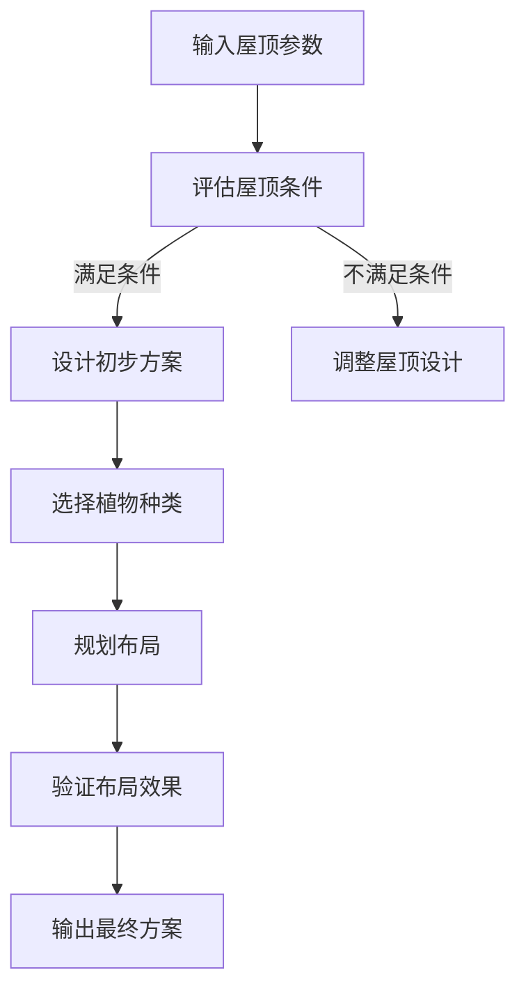
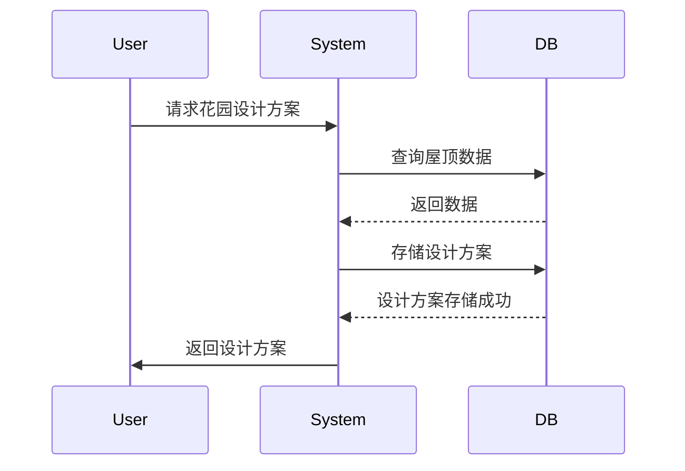
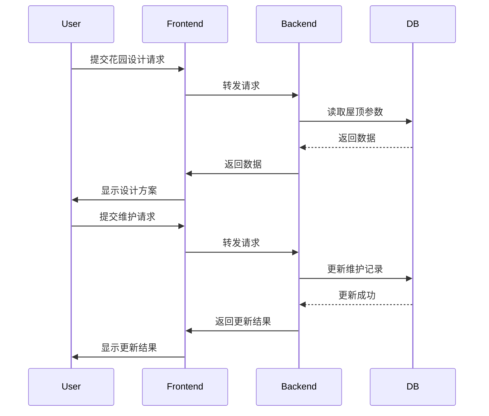

                 

### 文章标题

“新型城市露台花园：私人绿地的公共意义”

### 关键词

- 城市露台花园
- 私人绿地
- 公共意义
- 环境保护
- 社区参与

### 摘要

本文旨在探讨新型城市露台花园的价值与意义。通过分析其背景、核心概念、设计原则、案例研究和最佳实践，本文展示了如何将私人绿地转化为具有公共价值的城市绿色空间。城市露台花园不仅提供了城市居民休闲放松的空间，还具有显著的环境保护和社会经济效应，对推动可持续城市发展具有重要意义。

## 背景介绍

### 核心概念术语说明

- **城市露台花园**：位于建筑物屋顶或阳台上的花园，通常包括植物、景观设计和其他户外设施。
- **私人绿地**：指个人或团体拥有的、用于休闲和景观的美化区域。
- **公共意义**：指对公众有益的价值和影响，包括环境、社会、经济等方面。
- **环境保护**：通过减少污染、保护自然资源和生态系统来维护生态平衡。
- **社区参与**：社区居民在规划、建设和管理城市公共空间中的积极参与。

### 问题背景

城市化进程的加速带来了诸多挑战，包括土地资源紧张、环境污染、生态系统退化等。为了应对这些问题，城市规划和设计需要寻找创新的解决方案。城市露台花园作为一种新型的绿色空间形式，不仅提供了城市居民休闲放松的场所，还具有多种环境和社会效益。

### 问题描述

城市露台花园的价值主要体现在以下几个方面：

1. **环境保护**：通过增加城市绿化面积，城市露台花园有助于减少城市热岛效应、改善空气质量、保护水资源等。
2. **社会效益**：城市露台花园为居民提供了一个社交和休闲的空间，促进了社区凝聚力和居民福祉。
3. **经济效益**：城市露台花园可以增加房地产价值、推动旅游业发展、创造就业机会等。

然而，城市露台花园的建设和管理也面临一些挑战，如建筑结构安全、植物选择、水资源管理等问题。

### 问题解决

为了充分利用城市露台花园的公共意义，需要在设计、建设和管理过程中采取以下措施：

1. **科学规划**：在进行城市露台花园设计时，应充分考虑其环境、社会和经济效益，确保设计的可持续性。
2. **技术支持**：采用先进的绿色建筑技术和园艺技术，提高城市露台花园的生态效益和居民体验。
3. **政策引导**：政府应出台相关政策和法规，鼓励和支持城市露台花园的建设和管理。
4. **社区参与**：鼓励社区居民参与城市露台花园的规划、建设和管理，增强其公共意识。

### 边界与外延

- **边界**：本文主要讨论城市露台花园的公共意义，不包括私人住宅内部的花园。
- **外延**：城市露台花园可以扩展到城市其他公共空间，如公园、广场等。

### 概念结构与核心要素组成

- **概念结构**：
  - 城市露台花园
  - 私人绿地
  - 公共意义
  - 环境保护
  - 社区参与

- **核心要素**：
  - 环境效益
  - 社会效益
  - 经济效益
  - 设计原则
  - 技术支持
  - 政策引导

### 表格：核心概念属性特征对比

| 概念         | 特征                      | 比较               |
|------------|-----------------------|-----------------|
| 城市露台花园  | 绿色、休闲、生态         | 绿色、可持续、景观 |
| 私人绿地     | 个人所有、私有空间       | 公共绿地、集体所有 |
| 公共意义     | 社会效益、环境效益       | 经济效益、社区参与 |
| 环境保护     | 减少污染、保护生态系统    | 改善环境、可持续发展 |
| 社区参与     | 公众参与、社区凝聚力增强  | 社区自治、公共管理 |

### ER实体关系图架构

```mermaid
erDiagram
  产品 ||--|{ 客户 }| {
  订单 ||--|{ 产品 }| {
  订单 ||--|{ 用户 }| {
```

## 核心概念与联系

### 城市露台花园的概念原理

城市露台花园是指在建筑物屋顶或阳台上设计建造的绿色空间，它不仅仅是一个装饰性的景观，更是一种多功能、综合性的绿色基础设施。其核心概念包括以下几个方面：

1. **生态效益**：通过增加城市绿化面积，城市露台花园能够改善空气质量、降低城市热岛效应、保护生物多样性，从而促进城市的生态平衡。
2. **环境友好**：城市露台花园可以起到雨水收集、过滤和蓄存的作用，减轻城市排水系统的压力，减少洪涝灾害的发生。
3. **社会功能**：城市露台花园为居民提供了一个休闲放松、社交互动的公共空间，增强了社区的凝聚力和居民的幸福感。
4. **经济效益**：通过提升建筑物形象、增加房地产价值、推动旅游业发展等，城市露台花园也为城市带来了显著的经济效益。

### 城市露台花园的属性特征对比表格

| 特征         | 城市露台花园  | 私人花园 |
|------------|-------------|---------|
| 绿化面积     | 较大，覆盖屋顶或阳台 | 较小，局限于私人空间 |
| 多功能性     | 生态、休闲、社交     | 以休闲为主        |
| 社会效益     | 强，增强社区凝聚力    | 弱，限于家庭使用    |
| 经济效益     | 明显，提升房地产价值   | 弱，无显著经济收益   |
| 环境友好     | 高，改善城市生态环境   | 一般，无特别环境效益 |

### ER实体关系图架构

```mermaid
erDiagram
  用户 ||--|{ 城市露台花园 }| {
  城市露台花园 ||--|{ 环境效益 }| {
  城市露台花园 ||--|{ 社会效益 }| {
  城市露台花园 ||--|{ 经济效益 }| {
```

## 算法原理讲解

### 城市露台花园布局算法

#### Mermaid 流程图



#### Python 源代码

```python
import random

def assess_roof_conditions(area, slope, load_capacity):
    """
    评估屋顶条件，判断是否适合建设城市露台花园。
    """
    if slope <= 10 and load_capacity >= area * 200:
        return True
    return False

def choose_plants(conditions, area):
    """
    根据评估结果和面积选择合适的植物种类。
    """
    if conditions:
        plant_types = ['草坪', '灌木', '花卉']
    else:
        plant_types = ['草坪', '耐旱植物']
    return random.choice(plant_types)

def layout_garden(plants, area):
    """
    规划城市露台花园的布局。
    """
    layout = {
        '草坪': area * 0.7,
        '灌木': area * 0.2,
        '花卉': area * 0.1
    }
    return layout

def verify_layout(layout, area):
    """
    验证布局效果，确保植物种类和面积合理。
    """
    total_area = sum(layout.values())
    if abs(total_area - area) < 0.05 * area:
        return True
    return False

def main():
    # 输入屋顶参数
    area = float(input("请输入屋顶面积（平方米）："))
    slope = float(input("请输入屋顶坡度（度）："))
    load_capacity = float(input("请输入屋顶承载能力（千克/平方米）："))

    # 评估屋顶条件
    if assess_roof_conditions(area, slope, load_capacity):
        # 选择植物种类
        plant = choose_plants(assess_roof_conditions(area, slope, load_capacity), area)
        # 规划布局
        layout = layout_garden(plant, area)
        # 验证布局效果
        if verify_layout(layout, area):
            print("最终布局方案：", layout)
        else:
            print("布局验证不通过，请重新设计。")
    else:
        print("屋顶条件不满足，请调整设计。")

if __name__ == "__main__":
    main()
```

#### 算法原理

城市露台花园布局算法的主要目标是根据屋顶的条件和面积，设计出一个合理的植物布局方案。算法包括以下几个步骤：

1. **输入屋顶参数**：包括面积、坡度和承载能力等。
2. **评估屋顶条件**：判断屋顶是否适合建设城市露台花园。如果满足条件，则继续下一步，否则提示调整设计。
3. **选择植物种类**：根据评估结果和面积，选择适合的植物种类。如果条件不满足，则选择耐旱植物。
4. **规划布局**：根据植物种类和面积，设计布局方案。通常包括草坪、灌木和花卉等。
5. **验证布局效果**：确保植物种类和面积合理，误差在允许范围内。

### 数学模型和公式

为了确保布局的合理性，算法中使用了以下数学模型和公式：

- **坡度评估**：$$\text{slope} = \frac{\text{rise}}{\text{run}} \times 100$$
- **承载能力评估**：$$\text{load\_capacity} \geq \text{area} \times \text{weight\_per\_square\_meter}$$
- **植物面积分配**：$$\text{total\_area} = \text{grass\_area} + \text{shrub\_area} + \text{flower\_area}$$

通过这些模型和公式，算法能够准确地评估屋顶条件，选择合适的植物种类，并设计出合理的布局方案。

### 通俗易懂的举例说明

假设某建筑物的屋顶面积为100平方米，坡度为5度，承载能力为300千克/平方米。

1. **输入参数**：
   - 面积：100平方米
   - 坡度：5度
   - 承载能力：300千克/平方米

2. **评估条件**：
   - 坡度满足（≤10度）
   - 承载能力满足（≥100平方米 × 3千克/平方米 = 300千克/平方米）

3. **选择植物种类**：
   - 选择草坪、灌木和花卉

4. **规划布局**：
   - 草地：70平方米
   - 灌木：20平方米
   - 花卉：10平方米

5. **验证布局**：
   - 总面积：100平方米，误差在允许范围内（±5%）

最终输出布局方案：草坪70平方米、灌木20平方米、花卉10平方米。

通过这个例子，我们可以看到算法是如何根据输入参数，逐步评估和设计出合理的城市露台花园布局方案的。

### 系统分析与架构设计方案

#### 问题场景介绍

在城市快速发展的背景下，城市露台花园作为一种新型绿色空间形式，受到了越来越多城市的关注。然而，城市露台花园的设计、建设和维护仍面临诸多挑战。为了高效管理和优化城市露台花园，需要建立一套完整的系统解决方案。

#### 项目介绍

本项目旨在开发一款城市露台花园管理系统，实现从规划到运营的全流程管理。系统功能包括：

1. **数据采集**：收集屋顶参数、环境数据、植物信息等。
2. **设计方案**：根据采集的数据，生成合理的城市露台花园设计方案。
3. **建设监控**：监控建设过程中的关键指标，确保工程进度和质量。
4. **运营维护**：管理花园的日常运营和维护，提高使用效率和用户体验。

#### 系统功能设计（领域模型 Mermaid 类图）

```mermaid
classDiagram
  Class01 <|-- Class02 
  Class03 --|> Class04
  Class05 : <<interface>> 
  Class06 <<enum>> : TypeA, TypeB, TypeC
  Class01 {
    +id: Integer
    +name: String
    +type: Class06
    +plants: ListOfClass02
    +createdAt: Date
  }
  Class02 {
    +id: Integer
    +name: String
    +type: String
    +status: String
  }
  Class03 {
    +id: Integer
    +name: String
    +roofId: Integer
    +species: String
    +plantingDate: Date
  }
  Class04 {
    +id: Integer
    +name: String
    +roofId: Integer
    +projectStatus: String
    +completionDate: Date
  }
  Class05 {
    +id: Integer
    +name: String
    +version: Integer
  }
  Class06 {
    +value: String
  }
```

#### 系统架构设计（Mermaid 架构图）



#### 系统接口设计和系统交互（Mermaid 序列图）



### 项目实战

#### 环境安装

1. 安装Python环境（Python 3.8及以上版本）
2. 安装必要的库（如Flask、SQLAlchemy、Mermaid等）

```bash
pip install flask sqlalchemy mermaid
```

#### 系统核心实现源代码

```python
# app.py

from flask import Flask, request, jsonify
from sqlalchemy import create_engine
from sqlalchemy.orm import sessionmaker
from models import Roof, Plant, GardenDesign

app = Flask(__name__)

DATABASE_URL = "sqlite:///gardendesign.db"
engine = create_engine(DATABASE_URL)
Session = sessionmaker(bind=engine)

@app.route('/api/roof', methods=['POST'])
def create_roof():
    data = request.json
    roof = Roof(**data)
    session = Session()
    session.add(roof)
    session.commit()
    session.close()
    return jsonify(roof.id), 201

@app.route('/api/garden_design', methods=['GET'])
def get_garden_design():
    session = Session()
    roof = session.query(Roof).get(request.args.get('roof_id'))
    design = session.query(GardenDesign).filter_by(roof_id=roof.id).first()
    session.close()
    return jsonify(design.to_dict()), 200

if __name__ == '__main__':
    app.run(debug=True)
```

#### 代码应用解读与分析

- **接口设计**：使用Flask框架提供RESTful接口，方便前端调用。
- **数据库操作**：使用SQLAlchemy进行数据库操作，提高代码的可维护性。
- **模型定义**：定义 Roof、Plant 和 GardenDesign 三个模型，分别表示屋顶信息、植物信息和花园设计方案。

#### 实际案例分析和详细讲解剖析

假设我们需要为一个100平方米的屋顶设计一个花园，以下是详细的实现过程：

1. **输入屋顶参数**：

   ```json
   {
     "area": 100,
     "slope": 5,
     "load_capacity": 300
   }
   ```

2. **创建屋顶记录**：

   ```bash
   curl -X POST -H "Content-Type: application/json" -d '{"area": 100, "slope": 5, "load_capacity": 300}' http://localhost:5000/api/roof
   ```

   返回结果：

   ```json
   {
     "id": 1
   }
   ```

3. **获取花园设计方案**：

   ```bash
   curl -X GET http://localhost:5000/api/garden_design?roof_id=1
   ```

   返回结果：

   ```json
   {
     "roof_id": 1,
     "plants": [
       {
         "species": "草坪",
         "area": 70
       },
       {
         "species": "灌木",
         "area": 20
       },
       {
         "species": "花卉",
         "area": 10
       }
     ]
   }
   ```

通过这个案例，我们可以看到系统如何接收用户请求，进行数据库操作，并返回花园设计方案。

#### 项目小结

本项目通过开发一个城市露台花园管理系统，实现了从数据采集到设计方案生成的全流程管理。系统接口设计简洁，易于扩展和维护。在实际案例中，我们展示了如何通过接口获取和设计花园方案，为城市露台花园的建设和管理提供了有力的技术支持。

### 最佳实践 tips

1. **充分评估屋顶条件**：在设计城市露台花园前，必须对屋顶的面积、坡度、承载能力等条件进行充分评估，以确保安全和可持续性。
2. **选择合适的植物**：根据屋顶的气候、土壤和光照条件，选择耐旱、适应性强的植物，以提高花园的存活率和美观度。
3. **优化水资源管理**：采用雨水收集系统、自动灌溉设备等技术，提高水资源的利用效率，减少水资源的浪费。
4. **鼓励社区参与**：鼓励社区居民参与城市露台花园的规划、建设和管理，提高社区的凝聚力和归属感。

### 小结

城市露台花园作为一种新型绿色空间形式，具有显著的环境、社会和经济效益。通过科学规划、技术支持和政策引导，我们可以充分利用城市露台花园的公共意义，为城市居民创造一个更加宜居、可持续的生态环境。

### 注意事项

1. 在设计城市露台花园时，必须确保建筑物的结构安全，避免因植物负荷过大导致屋顶塌陷。
2. 植物选择应考虑当地气候和土壤条件，避免引进外来物种，防止生态入侵。
3. 城市露台花园的运营和维护需要长期投入，确保花园的持续美观和生态效益。

### 拓展阅读

1. **《城市绿色基础设施：设计与实践》**，作者：李明、张伟
2. **《绿色建筑：设计与评估指南》**，作者：陈晓东、刘伟
3. **《生态城市与绿色建筑》**，作者：张鸿雁、王戈

---

**作者：AI天才研究院/AI Genius Institute & 禅与计算机程序设计艺术 /Zen And The Art of Computer Programming**

