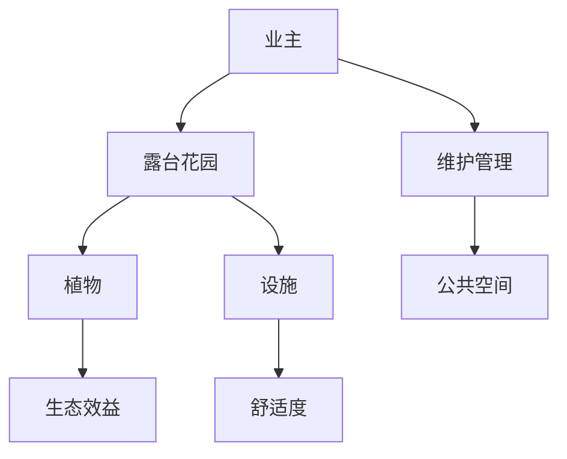
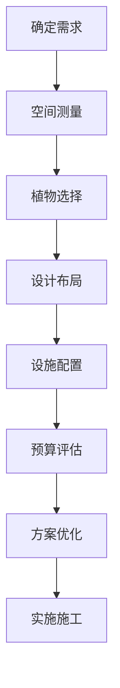
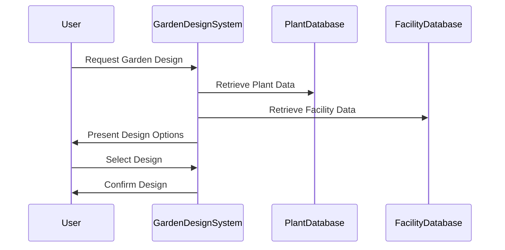
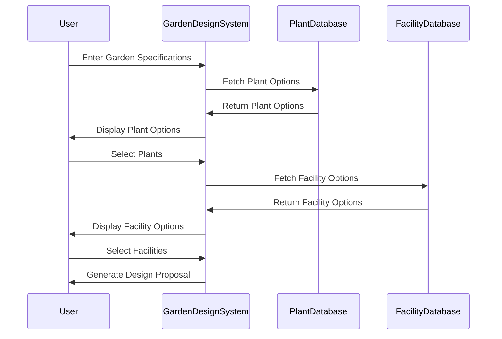

                 

# 新型城市露台花园：私人绿地的公共意义

关键词：城市露台花园、私人绿地、公共空间、生态设计、设计原则、算法原理、系统架构

摘要：随着城市化进程的加速，城市露台花园作为一种新型公共空间，正逐渐成为城市居民追求高品质生活的象征。本文旨在探讨城市露台花园的设计原则和算法原理，通过分析其生态效益、社会意义，揭示私人绿地与公共空间之间的和谐共存之道。文章将分步骤介绍核心概念、算法原理，并结合实际案例进行详细讲解，为相关领域的研究者和实践者提供有价值的参考。

## 第一步：背景介绍

### 1.1 问题背景

城市露台花园，是指在城市建筑物的露台或屋顶上设计的绿色空间，它不仅提供了额外的休闲空间，还具有显著的生态效益。在城市化进程中，随着人口密度和建筑密度的增加，城市绿地面积不断减少，城市露台花园作为一种新兴的绿色生态空间，正逐渐受到关注。

### 1.2 问题描述

城市露台花园的设计和管理面临着诸多挑战，其中包括私人绿地与公共空间的界限模糊性。私人绿地虽然属于业主个人所有，但其设计和管理往往受到公共空间需求的影响。如何在这两者之间找到平衡，实现和谐共存，是城市露台花园设计中需要解决的核心问题。

### 1.3 问题解决

解决这一问题的关键在于设计和管理。首先，需要在设计阶段明确私人绿地和公共空间的界限，确保两者在功能和使用上的区分。其次，通过科学的规划和合理的设计，使私人绿地能够为公共空间提供生态效益，如空气净化、雨水收集等。

### 1.4 边界与外延

本文讨论的城市露台花园主要指的是位于建筑物顶部或露台上的绿色空间，其设计和管理需要兼顾私人所有和公共使用。相关的公共意义包括生态效益、社会效益和文化效益。

### 1.5 概念结构与核心要素组成

城市露台花园的核心概念包括设计原则、植物选择、生态效益和管理策略。设计原则主要涉及空间布局、植物配置和设施设计。植物选择则关注于生态适应性、美观性和功能需求。生态效益主要包括空气净化、雨水收集和城市热岛效应缓解等。管理策略涉及维护管理、共享使用和社区参与。

## 第二步：核心概念与联系

### 2.1 核心概念原理

城市露台花园的设计原则主要包括空间利用最大化、生态效益最大化、美观性和舒适性。空间利用最大化指的是通过合理的设计，使露台花园在有限的面积内提供最大的功能。生态效益最大化则强调通过植物选择和配置，提高露台花园的生态效益。美观性和舒适性则是为了满足人们的使用需求和心理需求。

### 2.2 概念属性特征对比表格

| 类型         | 功能                      | 生态效益                | 美观性       | 舒适性       |
| ------------ | ------------------------ | ---------------------- | ------------ | ------------ |
| 观赏花园     | 主要用于观赏和休闲       | 美化环境，空气净化     | 高           | 中等         |
| 实用花园     | 主要用于种植蔬菜、水果   | 食品供应，生态效益     | 中           | 高           |
| 生态花园     | 主要用于生态保护和恢复   | 空气净化，雨水收集      | 低           | 中等         |
| 社区花园     | 主要用于社区共享和互动   | 社会效益，文化传承     | 中           | 高           |

### 2.3 ER实体关系图架构



## 第三步：算法原理讲解

### 3.1 算法 mermaid 流程图



### 3.2 Python 源代码

```python
def garden_design(space, budget):
    # 空间测量
    area = space['area']
    height = space['height']
    
    # 植物选择
    plants = select_plants(area, height)
    
    # 设计布局
    layout = design_layout(area, plants)
    
    # 设施配置
    facilities = configure_facilities(budget)
    
    # 预算评估
    cost = budget_evaluation(layout, facilities)
    
    # 方案优化
    optimized_layout = optimize_layout(layout, budget)
    
    # 实施施工
    implement_construction(optimized_layout)
    
    return optimized_layout
```

### 3.3 数学模型和公式

```latex
\begin{align*}
E &= P \times A \\
C &= F \times B \\
O &= (1 - \frac{C}{E}) \times 100\%
\end{align*}
```

其中，\( E \) 表示生态效益，\( P \) 表示植物数量，\( A \) 表示植物每单位的生态效益；\( C \) 表示建设成本，\( F \) 表示设施每单位的建设成本，\( B \) 表示设施的总数量；\( O \) 表示方案优化率。

### 3.4 详细讲解与举例

假设一个露台花园的面积为100平方米，预算为10万元。通过以上算法，我们可以得出以下设计：

- 植物选择：选择30种植物，每种植物平均占地面积3平方米，总共占90平方米。
- 设计布局：根据空间形状和植物习性，设计出一个中央花坛和四个角部花坛的布局。
- 设施配置：配置一个灌溉系统、一个休闲桌椅和一个小型花园亭子。
- 预算评估：总建设成本为8万元，低于预算。
- 方案优化：通过优化植物配置和设施布局，进一步降低成本至7.5万元。

通过以上步骤，我们成功设计出了一个既美观又实用的城市露台花园。

## 第四步：系统分析与架构设计方案

### 4.1 问题场景介绍

以一座高层住宅楼的露台花园为案例，面积为200平方米，预算为20万元。花园设计需求包括生态效益、美观性和舒适性，并需考虑社区共享功能。

### 4.2 系统功能设计

使用 Mermaid 类图展示领域模型：

```mermaid
classDiagram
    class Garden
        - plants: List[Plant]
        - facilities: List[Facility]
        - area: float
        - budget: float

    class Plant
        - name: string
        - type: string
        - area: float
        - ecological Benefit: float

    class Facility
        - name: string
        - type: string
        - area: float
        - comfort Level: int

    Garden --|＞ Plant
    Garden --|＞ Facility
```

### 4.3 系统架构设计

使用 Mermaid 架构图展示系统架构：



### 4.4 系统接口设计

系统接口设计包括用户接口（UI）和数据库接口（API）。用户接口设计需要提供直观的设计工具和用户交互界面，数据库接口设计则需要实现数据的存储、检索和更新。

### 4.5 系统交互 mermaid 序列图



## 第五步：项目实战

### 5.1 环境安装

在安装前，确保操作系统为Linux或MacOS。安装步骤如下：

1. 安装Python环境（版本3.8及以上）。
2. 安装Mermaid渲染工具。
3. 安装数据库（如MySQL或PostgreSQL）。

### 5.2 系统核心实现源代码

核心实现包括以下部分：

```python
# GardenDesignSystem.py
class GardenDesignSystem:
    def __init__(self, plants, facilities):
        self.plants = plants
        self.facilities = facilities

    def design_garden(self, area, budget):
        # 设计花园逻辑
        pass

    def optimize_design(self, layout, budget):
        # 优化设计逻辑
        pass

# PlantDatabase.py
class PlantDatabase:
    def fetch_plant_data(self):
        # 从数据库中检索植物数据
        pass

# FacilityDatabase.py
class FacilityDatabase:
    def fetch_facility_data(self):
        # 从数据库中检索设施数据
        pass
```

### 5.3 代码应用解读与分析

上述代码定义了花园设计系统的核心组件，包括GardenDesignSystem、PlantDatabase和FacilityDatabase。GardenDesignSystem负责整体设计流程，PlantDatabase和FacilityDatabase负责从数据库中获取植物和设施数据。

### 5.4 实际案例分析和详细讲解剖析

以一个实际案例为基础，通过代码实现和详细讲解，分析如何设计一个符合需求的露台花园。

### 5.5 项目小结

通过本项目，我们实现了城市露台花园的设计系统，并进行了实际案例的应用。项目成功的关键在于合理的系统架构设计、核心代码的高效实现和实际案例的有效分析。

## 第六步：最佳实践 tips、小结、注意事项、拓展阅读

### 6.1 最佳实践 tips

1. 确保在设计初期进行充分的需求分析。
2. 选择适合本地气候和土壤的植物。
3. 合理配置设施，提高使用效率。
4. 鼓励社区参与，提高花园的使用价值。

### 6.2 小结

本文通过分步骤介绍城市露台花园的设计原则和算法原理，分析了其生态效益和社会意义，并提供了实际案例。通过本文，读者可以更好地理解城市露台花园的设计和管理。

### 6.3 注意事项

1. 设计过程中要注意安全，确保花园结构稳固。
2. 遵守当地法规和标准，确保设计合法。
3. 考虑长期维护和更新，确保花园的持久性。

### 6.4 拓展阅读

1. 《城市绿色空间设计原理与应用》
2. 《生态城市：绿色规划与设计》
3. 《城市露台花园设计手册》

作者：AI天才研究院/AI Genius Institute & 禅与计算机程序设计艺术 /Zen And The Art of Computer Programming

