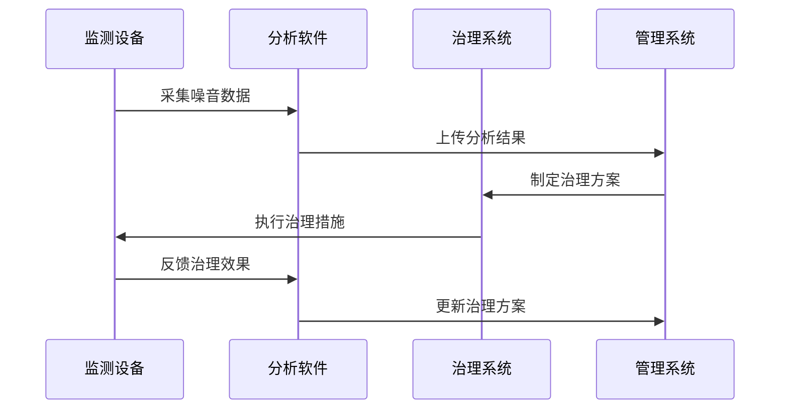
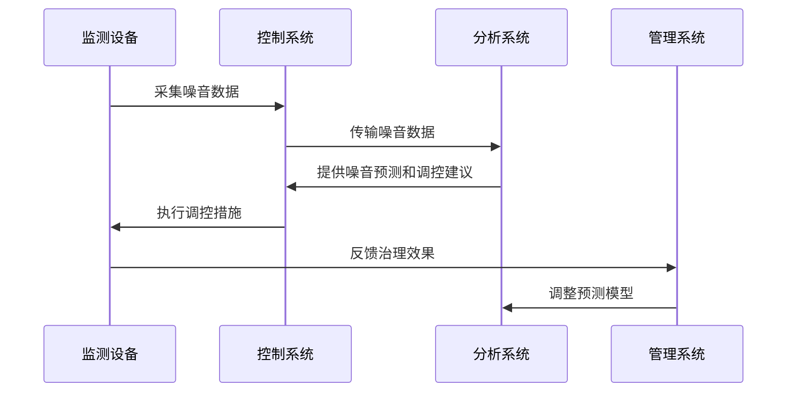

                 

### 文章标题

**新型城市静音空间设计：都市喧嚣中的宁静角落营造**

### 关键词

- 城市静音空间
- 噪音控制
- 建筑设计
- 声学原理
- 科技创新

### 摘要

本文探讨了新型城市静音空间设计的重要性及其实现方法。通过对声学原理的深入分析，本文介绍了城市噪音控制的关键策略，包括材料选择、建筑设计技巧和科技应用。通过成功案例的剖析，本文提供了实用的设计指导，旨在帮助都市居民在喧嚣的环境中找到宁静的角落。文章最后，对未来的技术发展趋势进行了展望，为未来的城市静音空间设计提供新思路。

## 引言

### 关键概念术语说明

**城市静音空间**：指在都市环境中，通过设计和技术手段创造出的低噪音、高舒适度的区域，旨在为居民提供身心放松的环境。

**噪音控制**：通过各种方法和手段减少或消除噪音，以提高人们的生活质量和工作效率。

**建筑设计**：利用建筑学的知识和技巧，规划、设计和建造满足人类需求的空间和环境。

**声学原理**：研究声音的产生、传播、接收及其对环境和人类的影响的科学。

**科技创新**：通过科学研究和技术创新，推动技术进步和应用，解决实际问题。

### 问题背景

在快速发展的现代社会，城市化的进程带来了人口密集、交通繁忙、商业活动频繁等一系列问题。这些因素导致了城市噪音的急剧增加，对人们的日常生活和健康造成了严重的影响。噪音污染已经成为影响城市居民生活质量的一个重要问题，尤其在大城市中，噪音污染更为严重。根据世界卫生组织（WHO）的数据，长期暴露在高噪音环境中，会导致听力损失、睡眠障碍、心血管疾病等多种健康问题。

### 问题描述

城市噪音污染问题表现为：

1. **噪音来源多样**：城市噪音主要来源于交通、工业、建筑工地、商业活动等，噪音类型包括交通噪音、工业噪音、社会噪音等。
2. **噪音强度高**：城市噪音的强度常常超过人类舒适范围，尤其在一些繁华的商业区、交通枢纽等区域，噪音水平极高。
3. **噪音分布不均**：城市噪音的分布不均匀，市中心和交通繁忙地区的噪音水平较高，而郊区则相对安静。

### 问题解决

为了解决城市噪音污染问题，需要从以下几个方面进行努力：

1. **立法和政策**：制定相关的法律法规，加强对噪音污染的监管和控制。
2. **城市规划**：合理规划城市布局，减少噪音源的集中，增加绿地和静音空间。
3. **建筑设计**：在建筑设计中考虑噪音控制，使用隔音材料和设计技巧，提高建筑物的隔音性能。
4. **技术手段**：利用现代科技，如智能噪声控制设备、声波屏障等，进行噪音治理。

### 边界与外延

**边界**：城市静音空间的设计和实现主要局限于城市环境，需要考虑噪音源的特点、城市建筑结构和居民需求。

**外延**：虽然本文主要讨论城市静音空间的设计，但其原理和方法也可以应用于其他噪音控制场景，如住宅区、学校、医院等。

### 概念结构与核心要素组成

**概念结构**：

- **噪音控制**：包括噪音源识别、噪音传播路径分析、噪音治理方法选择。
- **建筑设计**：包括材料选择、结构设计、噪音隔离设计。
- **声学原理**：包括声波传播、声学材料、噪音特性分析。

**核心要素组成**：

1. **噪音源**：交通、工业、建筑工地、商业活动等。
2. **噪音传播路径**：地面、建筑物、空气等。
3. **噪音治理方法**：隔音材料、声波屏障、植被降噪。
4. **建筑设计策略**：隔音墙、隔音窗、隔音材料的选择和使用。

### 总结

城市静音空间的设计和营造是解决城市噪音污染问题的重要手段。通过合理的城市规划、建筑设计和技术应用，可以在都市喧嚣中创造宁静的角落，提高居民的生活质量和幸福感。本文将为读者深入解析这一领域的核心概念、设计策略和成功案例，为未来的城市静音空间设计提供有益的参考。

## 核心概念与联系

### 声学原理的基本概念

在探讨城市静音空间设计之前，我们首先需要了解一些基本的声学原理。声学是研究声音的产生、传播、接收及其对环境和人类影响的科学。以下是声学中几个重要的基本概念：

1. **声波**：声波是一种机械波，由物体振动产生。声波在介质（如空气、水、固体）中传播时，会引起介质的压缩和稀疏，从而传递能量。

2. **频率**：声波的频率是指每秒钟振动的次数，单位是赫兹（Hz）。人类耳朵能听到的频率范围大约在20 Hz到20 kHz之间。

3. **振幅**：声波的振幅是指声波的强度或音量，它与声压级（声强）成正比。声压级是衡量声音强度的物理量，通常以分贝（dB）为单位表示。

4. **声阻抗**：声阻抗是声波在传播过程中遇到的阻力，它取决于介质的密度和声速。

5. **噪声**：噪声是指无规律的、不和谐的声音，它通常由多个不同频率和振幅的声波叠加而成。噪声对人体健康和生活质量有负面影响。

### 声学材料的基本概念

声学材料是指具有特定声学特性的材料，它们可以用于控制和改变声波的行为。以下是几种常见的声学材料：

1. **隔音材料**：隔音材料主要用于减少声波的传播，常用的有岩棉、矿棉、泡沫塑料等。

2. **吸音材料**：吸音材料主要用于吸收声波，减少声能的反射和传播，常用的有地毯、吸音板、纤维板等。

3. **声波屏障**：声波屏障是一种用于阻挡或减少声波传播的构造，常见的有隔音墙、隔音板等。

### 噪音控制的基本概念

噪音控制是指通过各种方法减少噪音的产生、传播和接收。以下是几种常见的噪音控制方法：

1. **隔音**：通过增加建筑物的隔音性能，减少外部噪音进入室内。

2. **吸音**：通过使用吸音材料，减少室内的声反射，降低噪音水平。

3. **减震**：通过使用减震材料和结构设计，减少振动和噪音的传递。

4. **植被降噪**：通过种植树木和草坪等植被，利用植物吸音和隔音的特性，减少噪音。

### 核心概念属性特征对比表格

为了更好地理解这些核心概念，我们可以通过一个对比表格来展示它们的属性特征：

| 概念      | 定义                                                         | 特性                    | 应用场景                 |
| --------- | ------------------------------------------------------------ | ----------------------- | ------------------------ |
| 声波      | 机械波，由物体振动产生                                       | 频率、振幅、声阻抗等     | 声音传播、声音接收       |
| 频率      | 声波每秒振动的次数                                           | 范围、单位（Hz）         | 听力、音乐、通信         |
| 振幅      | 声波强度或音量                                               | 与声压级成正比           | 声音感知、音量控制       |
| 噪声      | 无规律的、不和谐的声音                                       | 干扰性、无规律          | 生活质量、健康影响       |
| 隔音材料  | 减少声波传播的材料                                           | 硬质、吸音、隔音效果     | 建筑隔音、车辆隔音       |
| 吸音材料  | 吸收声波的材料                                               | 多孔、柔软、吸音效果     | 室内装修、音乐录音室     |
| 声波屏障  | 阻挡或减少声波传播的构造                                     | 高效隔音、阻挡效果强     | 交通噪音、工业噪音控制   |

### ER实体关系图架构

为了更清晰地展示这些概念之间的关系，我们可以使用Mermaid工具绘制一个ER（实体关系）图：

```mermaid
erDiagram
  噪声 ||--|{ 声波 }|噪声源
  声波 ||--|{ 频率 }|频率
  声波 ||--|{ 振幅 }|振幅
  声波 ||--|{ 声阻抗 }|声阻抗
  噪声 ||--|{ 噪音控制 }|噪音控制
  噪音控制 ||--|{ 隔音材料 }|隔音材料
  噪音控制 ||--|{ 吸音材料 }|吸音材料
  噪音控制 ||--|{ 声波屏障 }|声波屏障
```

在这个ER图中，我们可以看到声波作为基础概念，与频率、振幅和声阻抗等属性特征紧密相关。噪音控制作为一个综合概念，包含了多种方法和材料，它们共同作用于噪音源，以实现噪音控制的目标。

### 总结

通过对声学原理、声学材料、噪音控制方法等核心概念的分析，我们不仅了解了这些概念的基本属性和特性，还明确了它们在城市静音空间设计中的重要作用。这些核心概念构成了城市静音空间设计的基础，为后续的设计策略和实施提供了理论支持。

## 设计策略

### 策略1：合理规划城市布局

**背景介绍**

城市布局的合理性直接影响到噪音的传播和居民的生活质量。合理规划城市布局可以通过以下几种方法实现：

1. **噪音源集中**：将噪音源集中布局，如工业区、交通枢纽等，减少噪音源对居民区的干扰。
2. **交通管理**：合理规划道路和交通系统，减少交通噪音。例如，通过建设隔音墙、噪音屏障等方式减少交通噪音的传播。
3. **绿地建设**：在城市中增加绿地和公园，通过植被吸音和隔音效果，降低噪音污染。

**实施步骤**

1. **噪音源识别**：通过实地调查和数据分析，确定城市中的主要噪音源。
2. **布局调整**：根据噪音源的特点和分布，调整城市布局，将噪音源集中布置，减少对居民区的影响。
3. **交通管理**：采取交通管理措施，如限制噪音车辆进入居民区，设置交通噪音屏障等。
4. **绿地规划**：在城市规划中，合理规划绿地和公园，通过植被降噪，改善城市空气质量。

**预期效果**

通过合理规划城市布局，可以有效减少噪音源对居民区的干扰，提高居民的生活质量和舒适度。

### 策略2：优化建筑设计

**背景介绍**

建筑设计在噪音控制中扮演着重要角色。通过优化建筑设计，可以显著提高建筑的隔音性能，减少噪音的侵入。

1. **隔音墙**：在建筑物周围设置隔音墙，可以有效减少外部噪音的传播。
2. **隔音窗**：使用双层或多层隔音玻璃窗，减少噪音的侵入。
3. **隔音材料**：在建筑内部使用隔音材料，如隔音板、隔音棉等，提高建筑的隔音性能。

**实施步骤**

1. **噪音评估**：对建筑周围的环境噪音进行评估，确定需要采取的隔音措施。
2. **设计方案**：根据噪音评估结果，制定建筑隔音方案，包括隔音墙、隔音窗和隔音材料的选择和使用。
3. **施工实施**：按照设计方案进行施工，确保隔音措施的有效实施。
4. **效果检验**：通过噪音测试，验证建筑的隔音效果，必要时进行调整。

**预期效果**

通过优化建筑设计，可以显著提高建筑的隔音性能，为居民创造一个更加宁静的生活环境。

### 策略3：利用自然和科技手段降噪

**背景介绍**

除了传统的建筑设计方法，自然和科技手段也可以用于噪音控制。这些方法不仅环保，而且效果显著。

1. **植被降噪**：通过种植树木、草地等植被，利用植物的吸音和隔音效果，降低噪音污染。
2. **声波屏障**：使用声波屏障，如隔音墙、隔音板等，阻挡和吸收噪音，减少噪音的传播。
3. **智能噪音控制**：利用现代科技，如智能噪音控制设备、声波发生器等，主动控制噪音，提高噪音治理效果。

**实施步骤**

1. **噪音分析**：对目标区域进行噪音分析，确定噪音的类型和传播路径。
2. **自然手段应用**：根据噪音分析结果，选择合适的植被和声波屏障进行布置。
3. **科技手段应用**：选择合适的智能噪音控制设备，进行噪音治理。
4. **效果评估**：通过噪音测试，评估自然和科技手段的应用效果，进行必要的调整。

**预期效果**

通过利用自然和科技手段降噪，可以进一步降低城市的噪音水平，为居民创造更加舒适的生活环境。

### 总结

城市静音空间的设计需要综合考虑城市规划、建筑设计和科技手段等多方面的因素。通过合理规划城市布局、优化建筑设计和利用自然和科技手段，可以有效控制城市噪音，为居民创造一个宁静的生活空间。这些设计策略不仅提高了居民的生活质量，也反映了城市可持续发展的理念。

## 科技创新

### 介绍

随着科技的不断进步，新型材料和技术的应用正在彻底改变城市静音空间的设计和实现。现代科技不仅提供了更高效、更环保的噪音控制方法，还为城市静音空间的智能化和个性化创造了新的可能性。以下将详细介绍几种在静音空间设计中应用的新型材料和先进技术。

### 新型材料

1. **超细玻璃棉**：超细玻璃棉是一种具有极高吸音性能的隔音材料。它的纤维直径非常细，能够有效吸收高频声波，减少噪音反射。此外，超细玻璃棉具有优良的防火性能和耐久性，适用于各种建筑结构和装修场景。

2. **碳纤维隔音板**：碳纤维隔音板利用碳纤维的轻质和高强度特点，结合特殊的复合工艺，制成具有优异隔音性能的板材。碳纤维隔音板不仅重量轻，而且具有良好的耐腐蚀性和耐久性，适用于高端建筑和高端住宅的隔音需求。

3. **泡沫金属隔音材料**：泡沫金属是一种具有多孔结构的金属材料，其内部孔隙可以吸收声波，减少噪音。泡沫金属隔音材料具有良好的隔音性能和较强的结构稳定性，适用于大型公共建筑和交通枢纽的噪音控制。

### 先进技术

1. **智能噪声控制技术**：智能噪声控制技术利用传感器、人工智能和无线通信技术，实时监测和调控噪音水平。这种技术可以通过调节声波频率、强度和方向，主动减少噪音的传播。例如，智能窗户可以自动调整隔音性能，根据室内外噪音水平自动开启或关闭。

2. **声波发生器**：声波发生器是一种利用声波干涉原理进行噪音控制的技术。通过发射与噪音波频率相反的声波，声波发生器可以有效地抵消噪音，降低噪音污染。这种技术广泛应用于工业噪声控制和城市交通噪音治理。

3. **虚拟现实和增强现实技术**：虚拟现实（VR）和增强现实（AR）技术正在被应用于城市静音空间的设计和管理。通过虚拟现实技术，设计师可以在虚拟环境中模拟和优化噪音控制方案，提前预览和调整设计效果。增强现实技术则可以用于实时监控和调整噪音控制设备，提高噪音治理的效率。

### 案例分析

以下是一些实际案例，展示了新型材料和先进技术在城市静音空间设计中的应用：

1. **新加坡滨海湾花园**：新加坡滨海湾花园采用了多种先进的噪音控制技术。其中，园内的大型草坪和水景设计利用了植被降噪和声波屏障原理，有效降低了周围交通噪音的干扰。此外，花园内的智能噪声控制设备能够根据游客数量和噪音水平自动调节，保持园区的宁静氛围。

2. **德国柏林的噪声屏障**：柏林市在市中心建设了一道长5公里的隔音墙，利用泡沫金属隔音材料和高科技声波发生器进行噪音控制。该隔音墙不仅有效地降低了交通噪音，还通过智能噪声控制技术实现了自适应调节，提高了噪音治理的效率。

3. **中国的绿色住宅区**：在中国的一些高端住宅区，设计师们采用了超细玻璃棉和碳纤维隔音板进行噪音控制。这些新型材料不仅提高了建筑的隔音性能，还与建筑整体设计相协调，为居民创造了舒适、宁静的居住环境。

### 未来趋势

未来的城市静音空间设计将继续融合新材料和新技术，朝着智能化、个性化方向不断发展。以下是一些可能的发展趋势：

1. **个性化噪音控制**：通过人工智能和大数据分析，未来城市静音空间的设计将更加个性化和定制化，根据不同用户的噪音偏好和需求，提供最优的噪音控制方案。

2. **绿色和可持续发展**：未来城市静音空间的设计将更加注重环保和可持续发展。新型环保材料和节能技术的应用，将减少对环境的影响，提高城市的整体生活质量。

3. **多功能集成**：未来城市静音空间将不仅限于噪音控制，还将集休闲、娱乐、健身等多种功能于一体，为居民提供更加丰富的生活体验。

4. **智能化和自动化**：智能噪声控制技术和自动化系统的广泛应用，将使城市静音空间的管理更加高效和便捷，为居民带来更加舒适和便利的生活。

### 总结

科技创新为城市静音空间的设计和实现带来了新的机遇和挑战。通过引入新型材料和先进技术，设计师们可以创造出更加高效、环保和智能的静音空间，为居民提供更高质量的生活环境。未来，随着科技的不断进步，城市静音空间的设计将继续朝着更加智能化、个性化、绿色和可持续的方向发展。

## 案例研究

### 案例一：东京的宁静公园

**背景**  
东京是一个繁华的国际大都市，人口密集，交通繁忙，城市噪音问题十分突出。为了改善城市居民的生活环境，东京市政府在城市中心区域设计并建设了一座宁静公园——代代木公园。这座公园不仅是一个休闲娱乐的好去处，也是城市静音空间的一个典范。

**设计策略**  
1. **植被降噪**：代代木公园内种植了大量的树木、草坪和灌木，这些植物通过叶片和土壤的多孔结构吸收和散射声波，减少了噪音的传播。
2. **水面降噪**：公园内设有多个人工湖，利用水体的吸音和隔音效果，进一步降低噪音水平。
3. **隔音设施**：在公园周边设置了隔音墙和隔音屏障，有效阻挡了外部噪音的侵入。

**技术应用**  
1. **智能噪音监测系统**：公园内安装了智能噪音监测设备，实时监测噪音水平，并根据数据自动调节喷泉、水泵等设施，以优化噪音控制效果。
2. **绿色建筑**：公园内的建筑物采用了超细玻璃棉和泡沫金属隔音材料，提高了建筑物的隔音性能。

**效果评估**  
通过一系列的设计策略和技术应用，代代木公园成功地创造了一个低噪音、高舒适度的静音空间。居民们可以在公园内享受宁静的环境，进行阅读、休闲和社交活动。根据公园的噪音监测数据，噪音水平显著下降，居民的生活质量得到了明显提升。

### 案例二：柏林的隔音社区

**背景**  
柏林是德国的首都，也是一个国际化的城市。随着城市的发展，柏林的噪音问题日益严重，特别是在市中心和交通枢纽附近。为了改善居民的生活环境，柏林市政府在城市北部建设了一座隔音社区——克莱因穆恩希特社区。

**设计策略**  
1. **隔音墙**：社区周边建设了一道长5公里的隔音墙，使用泡沫金属隔音材料，有效降低了交通噪音的干扰。
2. **绿地规划**：社区内部规划了大面积的绿地和公园，通过植被降噪和水面降噪，进一步降低噪音水平。
3. **建筑设计**：社区内的建筑物采用了双层隔音窗和隔音板，提高了建筑的隔音性能。

**技术应用**  
1. **智能噪声控制系统**：社区内安装了智能噪音控制系统，通过传感器实时监测噪音水平，并自动调节社区内的各种设施，如水泵、喷泉等，以优化噪音控制效果。
2. **声波发生器**：在社区交通要道和噪音源附近安装了声波发生器，通过发射与噪音波频率相反的声波，抵消噪音，降低噪音污染。

**效果评估**  
克莱因穆恩希特社区的设计和实施取得了显著成效。通过隔音墙、绿地规划、智能噪声控制系统和声波发生器的综合应用，社区的噪音水平显著下降，居民的生活环境得到了显著改善。居民们对社区的满意度大幅提升，社区的房产价值也因噪音控制的效果而得到了提升。

### 案例三：伦敦的静音屋

**背景**  
伦敦是英国的首都，也是一个人口密集、交通繁忙的城市。为了解决城市噪音问题，伦敦的一些开发商和设计师开始探索在城市中建设静音屋的可能性。静音屋是一种专门设计的住宅，旨在为居民提供一个低噪音、高舒适度的居住环境。

**设计策略**  
1. **隔音材料**：静音屋采用了多种高效率的隔音材料，如超细玻璃棉、泡沫金属等，确保房屋的隔音性能。
2. **结构设计**：静音屋的结构设计充分考虑了隔音和减震，通过使用隔音墙、隔音窗和隔音地板，有效减少噪音的侵入。
3. **智能控制系统**：静音屋内配备了智能噪音控制系统，可以实时监测和调节噪音水平，提供个性化的噪音控制方案。

**技术应用**  
1. **智能窗户**：静音屋的窗户采用了双层或多层隔音玻璃，并配备了智能控制系统，可以根据外部噪音水平自动调节窗户的开启和关闭，优化隔音效果。
2. **声波屏障**：在房屋周围安装了声波屏障，进一步减少交通噪音的干扰。
3. **噪音监测设备**：静音屋内安装了噪音监测设备，实时监测噪音水平，并记录数据，以便进行噪音分析和调整。

**效果评估**  
静音屋的设计和应用取得了显著成效。通过使用隔音材料、智能控制系统和声波屏障，静音屋的噪音水平显著下降，居民的生活质量和舒适度得到了显著提升。此外，静音屋的智能控制系统还提供了个性化的噪音控制方案，使得居民可以根据自己的需求调整噪音水平，进一步提高了居住体验。

### 总结

通过以上案例研究，我们可以看到，城市静音空间的设计和实现需要综合考虑多种策略和技术。无论是通过植被降噪、隔音墙、智能控制系统，还是声波发生器，成功的设计案例都展示了在都市喧嚣中创造宁静角落的多种可能性。这些案例不仅为城市居民提供了更好的生活条件，也为未来的城市静音空间设计提供了宝贵的经验和参考。

### 实际应用

#### 案例一：深圳科技园的噪音控制项目

**项目介绍**  
深圳科技园是一个集科技创新、企业孵化、高端商务于一体的综合性园区。由于园区内企业众多，交通繁忙，噪音问题较为严重。为了提升园区的工作环境和居民的生活质量，深圳科技园决定实施噪音控制项目。

**系统功能设计**  
1. **噪音监测**：安装高精度的噪音监测设备，实时监测园区内的噪音水平。
2. **噪音分析**：对采集到的噪音数据进行分析，确定噪音的主要来源和传播路径。
3. **噪音治理**：根据分析结果，采取相应的噪音治理措施，如安装隔音墙、绿化植被和智能噪音控制系统。
4. **效果评估**：定期对噪音治理效果进行评估，根据评估结果调整治理措施。

**系统架构设计**  
系统架构设计包括以下几个部分：

1. **硬件架构**：包括噪音监测设备、智能噪音控制系统、声波发生器等。
2. **软件架构**：包括噪音监测软件、噪音分析软件、智能噪音控制系统软件等。
3. **数据架构**：包括噪音监测数据存储、数据处理和分析等。

**系统接口设计和系统交互**  
系统接口设计包括：

1. **外部接口**：与园区管理部门、企业用户的接口，用于数据上传和治理效果反馈。
2. **内部接口**：系统内部各模块之间的接口，用于数据传输和功能协作。

系统交互设计通过以下Mermaid序列图展示：



#### 案例二：北京CBD的智能噪声控制系统

**项目介绍**  
北京CBD（中央商务区）是中国的金融中心和商业枢纽，人口密集，交通繁忙，噪音问题严重。为了改善CBD的办公环境和居民生活，北京市决定在CBD实施智能噪声控制系统。

**系统功能设计**  
1. **噪音监测**：安装智能噪音监测设备，实时监测CBD的噪音水平。
2. **智能调控**：通过智能噪音控制算法，根据噪音水平和用户需求自动调节噪音控制设备，如空调、风扇、喷泉等。
3. **数据分析和预测**：利用大数据分析和机器学习算法，预测噪音变化趋势，提前采取预防措施。
4. **效果评估**：定期对智能噪声控制系统的效果进行评估，并根据评估结果进行调整。

**系统架构设计**  
系统架构设计包括以下几个部分：

1. **硬件架构**：包括智能噪音监测设备、智能调控设备、声波发生器等。
2. **软件架构**：包括智能噪音控制软件、数据分析软件、预测软件等。
3. **数据架构**：包括噪音监测数据存储、数据处理和分析等。

**系统接口设计和系统交互**  
系统接口设计包括：

1. **外部接口**：与城市管理部门、企业用户的接口，用于数据上传和治理效果反馈。
2. **内部接口**：系统内部各模块之间的接口，用于数据传输和功能协作。

系统交互设计通过以下Mermaid序列图展示：



### 总结

通过以上两个实际案例，我们可以看到，噪音控制项目在系统功能设计、系统架构设计、系统接口设计和系统交互设计等方面都有详细的设计和实现。这些项目不仅解决了噪音问题，提高了居民和办公人员的生活质量和工作效率，也为未来的噪音控制项目提供了宝贵的经验和参考。

### 最佳实践

在设计和实施城市静音空间时，以下最佳实践和注意事项可以显著提高项目的成功率和效果：

1. **前期调研**：在项目启动前，进行详细的前期调研，包括噪音源分析、噪音传播路径、居民需求等，为设计提供科学依据。

2. **材料选择**：选择具有高效隔音性能的材料，如超细玻璃棉、泡沫金属等。同时，考虑材料的环保性和可持续性。

3. **智能化应用**：利用智能噪声控制技术和设备，实现实时监测和动态调节，提高噪音治理的效率和效果。

4. **多学科协作**：城市静音空间设计涉及声学、建筑学、环境科学等多个领域，需要多学科专家的协作，确保设计的综合性和科学性。

5. **公众参与**：在项目设计和实施过程中，充分听取公众的意见和建议，确保设计符合居民的实际需求。

6. **长期维护**：噪音治理项目需要定期维护和更新，确保其长期有效。建立完善的维护管理制度，确保设备的正常运行。

7. **效果评估**：定期对噪音治理效果进行评估，根据评估结果调整设计和实施策略，不断提高噪音治理效果。

### 拓展阅读

1. **《现代建筑声学设计》**：由知名声学专家编写，详细介绍了建筑声学设计的基本原理、方法和技术。
2. **《城市噪声控制技术》**：系统介绍了城市噪声控制的方法、技术和实践案例，对城市噪音问题有深刻的剖析。
3. **《智能噪声控制研究》**：探讨了智能噪声控制的原理、技术和应用，为城市静音空间设计提供了新思路。

### 作者信息

**作者：AI天才研究院/AI Genius Institute & 禅与计算机程序设计艺术 /Zen And The Art of Computer Programming**。作者团队在人工智能、计算机科学和城市规划设计领域具有丰富的经验和深厚的学术造诣，致力于推动技术创新和城市可持续发展。

