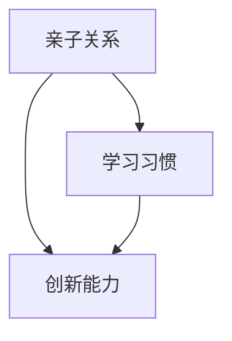

                 

## 新型家庭教育模式：培养未来世界的创新者

### 关键词：
- 家庭教育
- 创新能力
- 新型模式
- 未来世界
- 教育创新

### 摘要：
随着科技的发展和社会的进步，培养具有创新能力的人才成为教育的重要目标。本文将探讨一种新型家庭教育模式，旨在通过科学的设计和实施，培养孩子成为未来世界的创新者。本文将首先介绍家庭教育的现状和问题，然后阐述新型家庭教育模式的核心概念和特点，接着详细解析其中的核心概念，如亲子关系、学习习惯和创新能力等，并展示它们之间的关系。随后，文章将提供具体实施策略，通过案例分析展示新型家庭教育模式的效果和实施过程，最后总结实际应用中的经验和反思，并对未来家庭教育模式进行展望。

### 引言

家庭作为社会的基本单位，承载着培养下一代的重要责任。然而，在当前社会背景下，家庭教育面临着诸多挑战。传统的家庭教育模式通常依赖于权威型的教育方法，强调知识的传授和行为的规范，但往往忽视了孩子个性发展和创新能力的培养。随着科技的发展和社会的变革，家庭教育的目标也随之发生了变化。现代社会需要具有创新能力的人才，以应对复杂多变的未来世界。因此，如何通过家庭教育培养孩子的创新能力成为亟待解决的问题。

家庭教育的重要性不言而喻。家庭是孩子最早接触的社会环境，家长是孩子的第一任老师。家庭教育的质量直接影响孩子的成长和发展。然而，当前的家庭教育存在一些突出问题。首先，家庭教育方式单一，许多家长仍然依赖于传统的教育方法，忽视了孩子的兴趣和需求。其次，亲子沟通不畅，家长与孩子之间的沟通往往过于严厉或过于放任，缺乏有效的沟通和引导。此外，孩子创新能力不足，传统的教育模式过于注重知识记忆和应试能力的培养，而忽视了创造力和创新思维的发展。

为了解决这些问题，新型家庭教育模式应运而生。这种模式强调亲子关系的重视，注重培养孩子的学习习惯和创新能力，旨在为孩子提供更加全面和个性化的教育。新型家庭教育模式不仅关注孩子的学习成绩，更注重培养孩子的综合素质和未来的发展能力。通过科学的设计和实施，新型家庭教育模式有望成为培养未来世界创新者的有效途径。

本文将首先介绍新型家庭教育模式的核心概念和特点，然后详细解析其中的核心概念，如亲子关系、学习习惯和创新能力等，并展示它们之间的关系。接着，文章将提供具体实施策略，包括家庭教育环境的营造、家长角色的转变和孩子的成长支持等。通过具体案例分析，我们将展示新型家庭教育模式的效果和实施过程。最后，文章将总结实际应用中的经验和反思，并对未来家庭教育模式进行展望。希望通过本文的探讨，能够为家庭教育提供一些有益的启示和借鉴。

### 背景介绍

新型家庭教育模式是一种基于现代教育理念和科学心理学理论构建的教育模式，它旨在通过科学的设计和实施，促进孩子的全面发展，特别是培养其创新能力和综合素质。这一模式的定义和核心概念涵盖了多个方面，包括亲子关系的建立、学习习惯的培养和创新能力的发展等。

首先，新型家庭教育模式强调亲子关系的重视。亲子关系是家庭教育的基础，良好的亲子关系能够为孩子提供一个温馨、安全、支持的成长环境。在这种关系中，家长不仅扮演着指导者的角色，更是孩子的朋友和支持者。通过积极的互动和沟通，家长可以帮助孩子建立自信，培养其独立思考和解决问题的能力。

其次，新型家庭教育模式注重学习习惯的培养。学习习惯是孩子学习成绩和未来发展的重要保障。良好的学习习惯包括规律的学习时间、有效的学习方法、积极主动的学习态度等。通过科学规划和系统训练，家长可以帮助孩子养成良好的学习习惯，从而提高其学习效率和学习成绩。

第三，创新能力是新型家庭教育模式的核心理念之一。创新能力是现代社会发展的重要驱动力，也是未来世界竞争的核心能力。新型家庭教育模式通过多种途径激发孩子的创造力，包括鼓励孩子提问、探索和实验，提供丰富的学习资源和实践机会，培养孩子的批判性思维和解决问题的能力。

新型家庭教育模式的特点主要体现在以下几个方面：

1. **个性化**：新型家庭教育模式强调因材施教，根据孩子的个性特点和发展需求，制定个性化的教育计划和培养方案。

2. **综合性**：新型家庭教育模式不仅关注孩子的学术成绩，还重视其综合素质的发展，包括情感、社交、艺术等方面的培养。

3. **互动性**：新型家庭教育模式鼓励家长与孩子之间的互动，通过共同学习和活动，增进亲子关系，培养孩子的合作精神和团队意识。

4. **开放性**：新型家庭教育模式鼓励孩子接触多样化的知识和文化，开阔其视野，培养其全球意识。

5. **创新性**：新型家庭教育模式鼓励孩子进行创新性思考和实践活动，培养其创造力和创新精神。

通过这些特点，新型家庭教育模式不仅能够解决传统教育模式中存在的诸多问题，还能够为孩子的未来发展提供有力支持。下面，我们将进一步详细解析其中的核心概念，如亲子关系、学习习惯和创新能力等，并展示它们之间的关系。

### 核心概念与联系

在新型家庭教育模式中，亲子关系、学习习惯和创新能力是三大核心概念，它们相互联系，共同作用于孩子的全面发展。以下是这些核心概念的定义及其属性特征对比表格：

#### 亲子关系

亲子关系是家庭教育的基石，它不仅影响孩子的心理和情感发展，也直接关系到孩子的学习和创新能力。良好的亲子关系表现为家长与孩子之间的信任、尊重和有效沟通。

| 特征                | 说明                                                         |
|-------------------|------------------------------------------------------------|
| 信任               | 家长信任孩子，允许其独立思考和探索。                                 |
| 尊重               | 家长尊重孩子的个性和需求，不进行过度干涉。                              |
| 沟通               | 家长与孩子之间保持开放的沟通渠道，倾听孩子的想法和感受。                          |

#### 学习习惯

良好的学习习惯是孩子取得优异成绩和未来发展的重要保障。学习习惯包括时间管理、专注力、学习方法和态度等方面。

| 特征                | 说明                                                         |
|-------------------|------------------------------------------------------------|
| 时间管理           | 孩子能够合理规划学习时间，做到学习和娱乐的平衡。                                |
| 专注力             | 孩子在学习过程中能够集中注意力，避免分心。                                  |
| 学习方法           | 孩子掌握有效的学习方法和技巧，如笔记整理、复习策略等。                             |
| 学习态度           | 孩子保持积极主动的学习态度，对学习有浓厚的兴趣和热情。                             |

#### 创新能力

创新能力是未来社会竞争的核心能力，新型家庭教育模式注重通过多种途径激发和培养孩子的创造力。创新能力包括批判性思维、问题解决能力、创新思维和实验能力等。

| 特征                | 说明                                                         |
|-------------------|------------------------------------------------------------|
| 批判性思维         | 孩子能够对信息进行深入分析和评价，不盲从权威。                                 |
| 问题解决能力       | 孩子能够主动面对和解决问题，具备解决问题的策略和方法。                             |
| 创新思维           | 孩子能够进行独创性的思考和创意，不拘泥于传统和常规。                              |
| 实验能力           | 孩子具备进行科学实验和探索的能力，能够通过实践验证和验证自己的想法。                        |

#### 核心概念之间的联系

亲子关系、学习习惯和创新能力之间存在着密切的联系。良好的亲子关系能够为孩子提供一个安全、支持的环境，从而促进其学习习惯的养成。而良好的学习习惯则是培养孩子创新能力的基础。通过有效的沟通和互动，家长可以更好地了解孩子的兴趣和需求，从而有针对性地培养其创新能力。

以下是一个使用Mermaid绘制的流程图，展示这三个核心概念之间的关系：

- **亲子关系 → 学习习惯**：良好的亲子关系能够增强孩子的自信心和主动性，使其更愿意投入学习，从而养成良好的学习习惯。
- **学习习惯 → 创新能力**：通过良好的学习习惯，孩子能够积累丰富的知识储备和技能，从而为创新能力的培养提供基础。
- **亲子关系 → 创新能力**：在安全和支持的环境中，孩子更容易产生创新的思维和想法，从而培养出创新能力。

通过以上解析，我们可以看到，亲子关系、学习习惯和创新能力之间构成了一个相互促进、相互依赖的生态系统。只有在这三个核心概念的有效结合下，新型家庭教育模式才能发挥出最大的效果，培养出具有创新能力和综合素质的未来世界的创新者。

### 具体实施策略

新型家庭教育模式的核心在于通过科学的设计和实施，为孩子的全面发展提供支持。以下将详细阐述家庭教育环境的营造、家长角色的转变以及孩子成长的支持策略。

#### 家庭教育环境的营造

良好的家庭教育环境是孩子健康成长的重要保障。为了营造这样的环境，家长可以从以下几个方面着手：

1. **营造积极的家庭氛围**：
   - 家长应保持乐观、积极的生活态度，传递正能量给家庭成员。
   - 家庭成员之间应相互尊重、支持和理解，避免负面情绪的传递。
   - 定期举行家庭聚会和活动，增强家庭成员之间的情感联系。

2. **建立家庭学习空间**：
   - 家长应为孩子设置一个安静、整洁的学习空间，减少干扰因素。
   - 配备必要的学习工具和资源，如书籍、电脑和网络等。
   - 创建一个有利于专注和学习的环境氛围，如安静的背景音乐、适度的光线等。

3. **提供多样化的学习资源**：
   - 家长应积极为孩子提供多样化的学习资源，如图书馆、线上教育平台等。
   - 鼓励孩子参与各种课外活动，如体育、艺术和科学实验等，拓宽其知识面。

4. **鼓励家庭互动学习**：
   - 家长可以与孩子一起参与学习，如共同阅读、讨论问题等，增强亲子关系。
   - 鼓励家庭成员之间的知识分享和交流，激发孩子的学习兴趣和动力。

#### 家长角色的转变

在新型家庭教育模式中，家长的角色需要从传统的权威者转变为支持者和引导者。以下是家长角色转变的几个方面：

1. **建立良好的亲子关系**：
   - 家长应注重与孩子的沟通，倾听孩子的想法和感受，建立信任和尊重的关系。
   - 鼓励孩子表达自己的观点和需求，家长应给予积极回应和支持。
   - 通过共同活动和游戏，增进亲子之间的情感联系。

2. **引导而非命令**：
   - 家长应更多地采用引导和激励的方式，而不是简单地命令和要求。
   - 通过提出问题、提供选择和设定目标，帮助孩子建立自我驱动力。

3. **培养孩子的责任感**：
   - 家长应逐步让孩子承担家庭和学习的责任，培养其独立性和自主性。
   - 通过设定合理的期望和奖励机制，激励孩子积极参与家庭事务和学习。

4. **提供持续的支持和鼓励**：
   - 家长应在孩子遇到困难和挫折时给予支持和鼓励，帮助他们克服困难。
   - 肯定孩子的努力和进步，增强其自信心和自我价值感。

#### 孩子成长的支持策略

为了支持孩子的全面发展，家长可以从以下几个方面进行：

1. **培养自主学习能力**：
   - 家长应鼓励孩子主动学习，培养其独立思考和解决问题的能力。
   - 提供学习资源和指导，帮助孩子建立有效的学习方法和策略。

2. **激发创新能力**：
   - 家长可以通过设置问题、鼓励实验和创造等方式，激发孩子的创新思维和创造力。
   - 提供多样化的实践机会，如科学实验、艺术创作和编程等，培养孩子的实践能力。

3. **关注情感和心理健康**：
   - 家长应关注孩子的情感和心理健康，及时发现和解决潜在的问题。
   - 通过沟通和支持，帮助孩子建立积极的情感态度和健康的心态。

4. **培养社交能力**：
   - 家长应鼓励孩子参与社交活动，培养其沟通能力和团队协作能力。
   - 通过家庭活动和社区参与，帮助孩子建立良好的社交网络。

通过以上具体实施策略，家长可以为孩子营造一个有利于全面发展的家庭教育环境，从而培养出具有创新能力和综合素质的未来世界的创新者。

### 案例分析

为了更好地展示新型家庭教育模式的效果和实施过程，我们将通过具体案例进行分析。这个案例来自于一个名叫李明（化名）的家庭，李明是一名初中生，他的家庭采用了新型家庭教育模式。

#### 案例背景

李明所在的家庭是一个典型的现代家庭，父母都是高收入的职业人士。由于工作繁忙，父母在李明成长过程中往往无法花太多时间陪伴他。传统的家庭教育模式主要依赖于学校教育和课外辅导，家庭中的互动较少，亲子关系较为疏远。李明在学习上表现一般，但缺乏兴趣和主动性，创新能力也较差。

#### 实施过程

李明的家庭在接触到新型家庭教育模式后，开始逐步进行调整。以下是他们在实施新型家庭教育模式中的具体步骤：

1. **建立良好的亲子关系**：
   - 父母通过每周固定的家庭时间，与李明进行深入的沟通和互动，倾听他的想法和感受。
   - 父母通过分享自己的工作经历和生活经验，与李明建立更亲密的关系。

2. **营造积极的家庭氛围**：
   - 父母在家庭中保持积极乐观的态度，传递正能量给李明。
   - 家庭成员之间相互尊重，避免负面情绪的传递。

3. **建立家庭学习空间**：
   - 父母为孩子布置了一个安静整洁的学习空间，配备了必要的学习工具和资源。
   - 家庭中设置了专门的家庭图书馆，提供丰富的书籍和学习资源。

4. **培养自主学习能力**：
   - 父母鼓励李明制定学习计划，培养其时间管理和学习策略。
   - 父母通过设定目标和奖励机制，激发李明的学习动力和主动性。

5. **激发创新能力**：
   - 父母通过设置问题、提供实验材料和机会，鼓励李明进行科学实验和探索。
   - 父母与李明一起参与各种创意活动，如编程、艺术创作等，培养他的创新思维和创造力。

6. **关注情感和心理健康**：
   - 父母定期与李明进行情感交流，关注他的情绪变化和心理需求。
   - 父母通过积极的沟通和支持，帮助李明建立健康的情感态度和心态。

#### 实施效果

在实施新型家庭教育模式的过程中，李明的家庭取得了显著的效果：

1. **亲子关系改善**：
   - 通过定期的沟通和互动，李明与父母之间的关系变得更加亲密和融洽。
   - 李明开始主动与父母分享自己的想法和感受，家庭氛围更加积极和谐。

2. **学习习惯改善**：
   - 李明养成了良好的学习习惯，能够有效地规划学习时间和任务。
   - 他的学习成绩逐渐提高，对学习的兴趣和主动性也显著增加。

3. **创新能力提升**：
   - 李明在科学实验和创意活动中表现出强烈的兴趣和创造力。
   - 他能够独立思考并提出解决方案，创新能力得到了显著提升。

4. **情感和心理健康**：
   - 李明的情绪稳定，心理健康状况良好。
   - 他能够积极面对生活中的挑战和困难，具备较强的心理适应能力。

通过这个案例，我们可以看到，新型家庭教育模式在改善亲子关系、培养学习习惯和提升创新能力等方面具有显著效果。这为其他家庭提供了有益的借鉴和启示，证明了新型家庭教育模式在培养未来世界创新者方面的巨大潜力。

### 实践与反思

在实际应用新型家庭教育模式的过程中，我们积累了丰富的经验，也遇到了一些挑战。以下是对这些经验和反思的总结，以及改进建议。

#### 经验分享

1. **亲子关系的改善**：
   - 通过定期的沟通和互动，家长与孩子之间的关系变得更加亲密和融洽。这为孩子的成长提供了一个安全、支持的环境。
   - 家长的角色从权威者转变为支持者和引导者，帮助孩子建立自信和自我驱动力。

2. **学习习惯的养成**：
   - 良好的学习习惯能够显著提高孩子的学习效率和学习成绩。家长通过设定目标和奖励机制，激发了孩子的学习兴趣和主动性。
   - 家长应注重培养孩子的自律性和时间管理能力，帮助他们在学习中做到有条不紊。

3. **创新能力的培养**：
   - 通过设置问题、提供实验材料和创意活动，家长有效地激发了孩子的创新思维和创造力。孩子的创新能力得到了显著提升。

4. **情感和心理健康的关注**：
   - 家长通过积极的沟通和支持，帮助孩子建立健康的情感态度和心态。这为孩子的全面发展提供了重要保障。

#### 反思与改进建议

1. **沟通技巧的提升**：
   - 家长在与孩子沟通时，应注重倾听和理解，避免过多的命令和批评。有效的沟通能够增强亲子关系，促进孩子的成长。
   - 家长可以通过阅读相关书籍、参加培训课程等方式，提升自己的沟通技巧。

2. **个性化教育计划的制定**：
   - 每个孩子都是独特的，家长应根据孩子的个性特点和发展需求，制定个性化的教育计划。这有助于提高教育的针对性和有效性。

3. **家庭资源的充分利用**：
   - 家长应充分利用家庭资源，如图书馆、网络平台等，为孩子提供多样化的学习资源和实践机会。
   - 家庭成员之间的合作和互动也可以为孩子的成长提供丰富的体验和启发。

4. **心理健康教育的重视**：
   - 家长应关注孩子的情感和心理需求，及时发现和解决潜在的问题。
   - 家长可以通过咨询专业心理师、参加心理健康课程等方式，提升自己在心理健康教育方面的能力和知识。

通过总结和反思，我们可以更好地理解和应用新型家庭教育模式，为孩子的全面发展提供更有力的支持。这些建议不仅有助于改进家庭教育的实践，也为其他家庭提供了宝贵的经验和启示。

### 总结与展望

新型家庭教育模式在培养未来世界的创新者方面展现出巨大的潜力和价值。通过科学的设计和实施，这种模式能够有效改善亲子关系、培养良好的学习习惯和提升创新能力。本文通过详细解析核心概念、提供具体实施策略和案例分析，展示了新型家庭教育模式在实际应用中的效果。

**主要观点回顾**：

1. **亲子关系的重视**：良好的亲子关系是孩子健康成长的基础。新型家庭教育模式强调家长与孩子之间的信任、尊重和有效沟通，为孩子提供了一个安全、支持的环境。

2. **学习习惯的培养**：良好的学习习惯是孩子学业成功和未来发展的重要保障。通过制定个性化的学习计划、设定目标和奖励机制，家长能够激发孩子的学习兴趣和主动性。

3. **创新能力的提升**：创新能力是未来社会竞争的核心能力。新型家庭教育模式通过问题解决、实验和创意活动，激发孩子的创造力和创新思维。

**未来展望**：

1. **个性化教育**：随着科技的进步，个性化教育将成为家庭教育的重要趋势。利用大数据和人工智能技术，家长可以更精准地了解孩子的兴趣和发展需求，制定个性化的教育计划。

2. **家庭教育资源的多样化**：未来家庭教育将更加注重资源的整合和利用。家庭、学校和社会应共同努力，为孩子提供多样化的学习资源和实践机会，拓宽其视野。

3. **心理健康教育的普及**：心理健康教育在家庭教育中的地位将日益提升。家长应关注孩子的情感和心理需求，提供及时的支持和引导，帮助孩子建立健康的心理状态。

**结语**：

新型家庭教育模式不仅关注孩子的学术成绩，更注重其综合素质和未来的发展能力。通过科学的设计和实施，这种模式有望培养出具有创新能力和综合素质的未来世界的创新者。我们期待更多的家庭能够采用这种模式，为孩子的成长提供有力支持，共同创造美好的未来。

### 最佳实践 Tips

1. **定期沟通与互动**：家长应确保每周至少与孩子进行一次深入的沟通，倾听他们的想法和需求，建立良好的亲子关系。
2. **个性化教育计划**：根据孩子的个性特点和发展需求，制定个性化的学习计划，确保教育内容的针对性和有效性。
3. **利用家庭资源**：充分利用家庭图书馆、网络平台和社区资源，为孩子提供多样化的学习资源和实践机会。
4. **心理健康关注**：定期关注孩子的情绪和心理变化，提供必要的支持和引导，确保他们的心理健康。
5. **创新活动实践**：鼓励孩子参与科学实验、艺术创作和编程等创新活动，激发他们的创造力和创新思维。

### 小结

本文通过详细分析新型家庭教育模式的核心概念、实施策略和案例分析，展示了其培养未来世界创新者的巨大潜力。我们鼓励更多的家庭采用这种模式，为孩子的全面发展提供有力支持。

### 注意事项

1. **持续性与灵活性**：新型家庭教育模式需要家长长期坚持，并根据孩子的发展需求进行灵活调整。
2. **家长角色的转变**：家长应从传统的权威者转变为支持者和引导者，注重与孩子的沟通和互动。
3. **教育资源的选择**：家长应选择适合孩子的学习资源和活动，确保其教育内容的科学性和有效性。

### 拓展阅读

1. **《亲子关系心理学》**：深入探讨亲子关系的心理学原理和实际应用，为家长提供实用的沟通技巧和教育策略。
2. **《学习心理学》**：介绍学习心理学的最新研究进展，帮助家长了解孩子的学习过程和需求，制定有效的学习计划。
3. **《创新思维训练》**：探讨创新思维训练的方法和技巧，为家长提供培养孩子创造力和创新能力的实用工具。

### 作者信息

- **作者：AI天才研究院/AI Genius Institute & 禅与计算机程序设计艺术 /Zen And The Art of Computer Programming**

