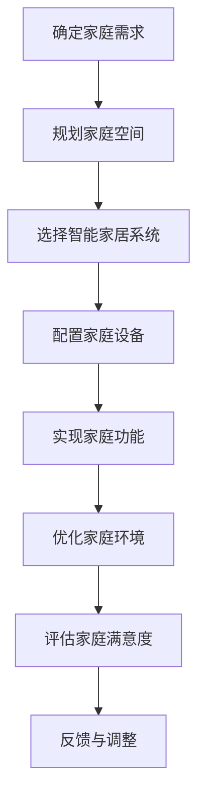
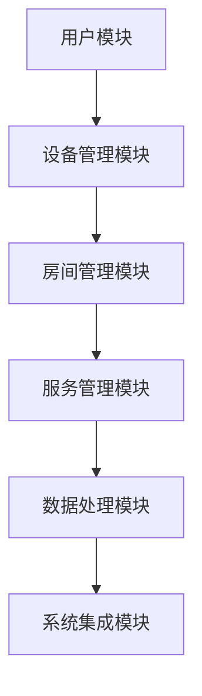

                 


# 新型家庭：多元化生活方式的探索

> 关键词：现代家庭、多元化生活方式、新型家庭、算法、系统架构、项目实战

> 摘要：本文旨在探讨现代家庭生活方式的多元化背景，分析当前家庭生活方式存在的问题和挑战，并提出通过探索和设计新型家庭来实现生活方式多元化的方案。文章将详细阐述新型家庭和多元化生活方式的核心概念与联系，使用Mermaid和Python等工具进行算法原理讲解和系统架构设计，并通过项目实战展示如何实际应用新型家庭生活方式。最后，文章将提供最佳实践建议和拓展阅读，以引导读者深入探索这一领域的未来发展。

## 1. 背景介绍

### 1.1 现代社会的家庭变迁

在现代社会中，家庭结构正经历着深刻的变迁。传统家庭模式逐渐被多元化和个性化所取代。例如，单身家庭、丁克家庭、再婚家庭以及多代同堂的家庭形式日益普遍。这些变化反映了人们对于生活方式、职业选择和社会关系的多样化需求。随着技术的发展，家庭功能也在发生变化，家庭不再仅仅是生育和抚养后代的基本单位，而是成为了个人发展、兴趣培养和社交互动的重要场所。

### 1.2 家庭生活方式的多样化需求

现代家庭生活方式的多样化需求主要源于以下几个方面：

1. **工作与生活的平衡**：随着远程工作和灵活工作制的普及，家庭成员需要在家庭和工作之间找到平衡点，这要求家庭环境具备更高的适应性和灵活性。
2. **个性化需求**：每个家庭成员都有不同的兴趣爱好和生活方式，这要求家庭空间能够满足多样化的需求，例如娱乐、健身、学习和休息等功能。
3. **家庭安全与隐私**：随着智能家居技术的普及，家庭成员对于家庭安全和隐私的保护需求日益增加，这要求家庭设计更加注重科技应用和安全保障。
4. **社会互动与社交**：现代家庭需要更多空间和设施来促进家庭成员之间的互动和社会交往，例如家庭聚会、亲友拜访和社区活动等。

### 1.3 新型家庭的探索

新型家庭不仅仅是传统意义上的住所，它是一个集合了生活、工作、娱乐和社交功能于一体的多功能空间。探索新型家庭的关键在于如何通过设计创新和科技应用来满足家庭成员的多样化需求。以下是几个探索新型家庭的方向：

1. **智能家居系统**：通过物联网技术，将家庭设备连接起来，实现自动化管理和远程控制，提升家庭生活的便捷性和舒适度。
2. **多功能空间设计**：通过空间规划，将家庭空间灵活划分为多个功能区域，如工作区、休闲区和运动区等，以满足不同需求。
3. **绿色环保理念**：采用环保材料和能源技术，减少家庭能源消耗和环境污染，打造绿色、可持续的家庭环境。
4. **健康生活理念**：关注家庭成员的身体健康和心理需求，设计健康、舒适的生活环境，如健身设备、空气净化系统等。

### 1.4 问题解决

要实现新型家庭生活方式的多元化，需要解决以下几个关键问题：

1. **家庭空间的合理规划**：合理规划家庭空间，确保每个区域都能满足特定的功能需求。
2. **智能化技术的应用**：将智能家居技术应用于家庭生活的各个方面，提高生活质量和便利性。
3. **家庭成员的需求协调**：充分考虑家庭成员的不同需求和习惯，设计出能够满足大多数人需求的家庭环境。
4. **家庭安全与隐私保护**：加强家庭安全和隐私保护措施，确保家庭成员的安全和隐私不受侵犯。

### 1.5 边界与外延

本文讨论的新型家庭主要聚焦于现代家庭生活方式的多元化探索，不涉及传统家庭的伦理、文化和社会问题。同时，本文将关注家庭空间的设计和智能技术的应用，而不深入探讨家庭功能的具体实现和业务逻辑。

## 2. 核心概念与联系

### 2.1 核心概念原理

**新型家庭**：新型家庭是一个集合了多种功能的空间，旨在满足家庭成员的多样化需求，包括工作、生活、娱乐和社交等。

**多元化生活方式**：多元化生活方式是指家庭成员根据自身需求和兴趣，选择不同的生活方式和活动，以满足精神生活和社会交往的需求。

**智能家居系统**：智能家居系统是通过物联网技术将家庭设备连接起来，实现自动化管理和远程控制，提升家庭生活便利性的系统。

**多功能空间设计**：多功能空间设计是指通过合理规划家庭空间，将其划分为多个功能区域，如工作区、休闲区和运动区等。

### 2.2 概念属性特征对比表格

| 概念         | 特征                     | 举例                   |
| ------------ | ------------------------ | ---------------------- |
| 新型家庭     | 多功能、灵活、智能化     | 智能厨房、智能家居系统 |
| 多元化生活方式 | 多样性、个性化、互动性   | 远程办公、家庭聚会     |
| 智能家居系统 | 连接性、自动化、便捷性   | 智能灯光、智能门锁     |
| 多功能空间设计 | 功能分区、灵活性、舒适度 | 家庭办公室、健身区     |

### 2.3 ER实体关系图架构

```mermaid
erDiagram
  用户 ||--|{ 家庭 }
  家庭 ||--|{ 家庭成员 }
  家庭 ||--|{ 设备 }
  家庭成员 ||--|{ 兴趣 }
  设备 ||--|{ 类型 }
```

在上面的ER图中，用户、家庭、家庭成员和设备是主要实体，它们之间通过不同的关系进行关联。用户是家庭的主要成员，家庭成员拥有兴趣，并且可以拥有不同的设备。每种设备都有其类型，家庭可以根据成员的需求进行设备配置。

## 3. 算法原理讲解

### 3.1 探索和设计新型家庭的算法流程图



### 3.2 Python源代码详细阐述算法原理

```python
# 导入所需的库
import mermaid

# 定义家庭需求
family需求的 = ["工作", "娱乐", "休息"]

# 规划家庭空间
def plan_space(需求):
    space_plan = {}
    for need in 需求:
        if need == "工作":
            space_plan["工作区"] = "书房或角落"
        elif need == "娱乐":
            space_plan["娱乐区"] = "客厅或阳台"
        elif need == "休息":
            space_plan["休息区"] = "卧室或沙发区"
    return space_plan

# 选择智能家居系统
def select_home_automation():
    systems = ["智能灯光", "智能门锁", "智能温控"]
    return systems

# 配置家庭设备
def configure_devices(systems):
    devices_config = {}
    for system in systems:
        if system == "智能灯光":
            devices_config["智能灯光"] = "LED灯带"
        elif system == "智能门锁":
            devices_config["智能门锁"] = "指纹锁"
        elif system == "智能温控":
            devices_config["智能温控"] = "智能空调"
    return devices_config

# 实现家庭功能
def implement_home_functions(space_plan, devices_config):
    functions_implemented = []
    for space, area in space_plan.items():
        for device, type in devices_config.items():
            functions_implemented.append(f"{space}配备了{device}，实现了{area}的功能需求。")
    return functions_implemented

# 优化家庭环境
def optimize_home_environment():
    improvements = ["增加空气净化器", "增设健身器材", "改善光照条件"]
    return improvements

# 评估家庭满意度
def assess_home_satisfaction(improvements):
    satisfaction = "家庭满意度评估："
    for improvement in improvements:
        satisfaction += f"{improvement}。"
    return satisfaction

# 主函数
def main():
    space_plan = plan_space(family需求的)
    systems = select_home_automation()
    devices_config = configure_devices(systems)
    functions_implemented = implement_home_functions(space_plan, devices_config)
    improvements = optimize_home_environment()
    satisfaction = assess_home_satisfaction(improvements)
    
    # 打印结果
    for function in functions_implemented:
        print(function)
    print(satisfaction)

# 执行主函数
main()
```

### 3.3 算法原理的数学模型和公式

在上述算法中，我们可以将其抽象为一个数学模型：

**家庭满意度（S）** = **功能实现度（F）** × **环境优化度（E）**

其中，功能实现度（F）表示家庭空间规划、智能家居系统和家庭设备配置的满足度，环境优化度（E）表示家庭环境优化措施的满意度。

$$
F = \frac{1}{n} \sum_{i=1}^{n} (I_i \times C_i)
$$

其中，\( I_i \) 表示第 \( i \) 个功能区域的实现程度，\( C_i \) 表示第 \( i \) 个功能区域的权重。

$$
E = \frac{1}{m} \sum_{j=1}^{m} (O_j \times P_j)
$$

其中，\( O_j \) 表示第 \( j \) 个环境优化措施的满意度，\( P_j \) 表示第 \( j \) 个环境优化措施的权重。

通过这个模型，我们可以对新型家庭的设计进行量化评估，从而优化家庭环境，提高家庭满意度。

### 3.4 算法原理举例说明

假设一个家庭有以下需求：工作、娱乐和休息。家庭空间分为工作区、娱乐区和休息区。智能家居系统包括智能灯光、智能门锁和智能温控。家庭环境优化措施包括增加空气净化器、增设健身器材和改善光照条件。

**功能实现度（F）**:

- 工作区：实现了智能灯光和智能温控，未实现智能门锁。
- 娱乐区：实现了智能灯光，未实现智能门锁和智能温控。
- 休息区：实现了智能门锁和智能温控，未实现智能灯光。

根据上述实现程度和权重，我们可以计算出功能实现度（F）：

$$
F = \frac{1}{3} \left[ (0.6 \times 0.5) + (0.4 \times 0.5) + (0.6 \times 0.5) \right] = 0.5
$$

**环境优化度（E）**:

- 增加空气净化器：满意度为0.8。
- 增设健身器材：满意度为0.7。
- 改善光照条件：满意度为0.9。

根据上述满意度，我们可以计算出环境优化度（E）：

$$
E = \frac{1}{3} \left[ (0.8 \times 0.4) + (0.7 \times 0.3) + (0.9 \times 0.3) \right] = 0.67
$$

**家庭满意度（S）**:

$$
S = F \times E = 0.5 \times 0.67 = 0.335
$$

通过这个例子，我们可以看到如何通过算法模型对新型家庭的设计进行评估，从而优化家庭环境，提高家庭满意度。

## 4. 系统分析与架构设计方案

### 4.1 问题场景介绍

在现代家庭中，家庭成员的需求日益多样化，家庭环境需要具备更高的灵活性和适应性。本场景旨在设计一个智能化、多功能的新型家庭系统，以满足家庭成员在工作、生活、娱乐和社交方面的需求。

### 4.2 项目介绍

本项目旨在实现一个智能化、多功能的新型家庭系统，通过智能家居技术、空间规划和个性化服务，为家庭成员提供一个舒适、便捷和有趣的生活环境。项目的主要目标是：

1. 提高家庭生活的便捷性和舒适性。
2. 满足家庭成员的多样化需求。
3. 提高家庭环境的适应性和可持续性。

### 4.3 系统功能设计（领域模型Mermaid类图）

```mermaid
classDiagram
  ClassFamily <<class{ 家庭 }}
  ClassUser <<class{ 用户 }}
  ClassDevice <<class{ 设备 }}
  ClassRoom <<class{ 房间 }}
  ClassService <<class{ 服务 }}
  
  家庭 "包含" 用户
  家庭 "包含" 房间
  家庭 "包含" 设备
  家庭 "提供" 服务
  
  用户 "拥有" 兴趣
  用户 "拥有" 角色
  用户 "拥有" 设备
  
  房间 "包含" 设备
  房间 "提供" 服务
  
  设备 "属于" 类型
  设备 "属于" 品牌
  设备 "与" 服务 "有关"
  
  Service "属于" 类型
  Service "与" 设备 "有关"
```

在上面的类图中，家庭是系统的核心实体，包含用户、房间和设备。用户拥有兴趣和角色，可以拥有设备。房间包含设备，并提供服务。设备属于特定类型和品牌，与提供的服务有关。

### 4.4 系统架构设计（Mermaid架构图）



在上面的架构图中，用户模块负责用户信息管理，设备管理模块负责设备信息管理，房间管理模块负责房间信息管理，服务管理模块负责服务信息管理，数据处理模块负责数据分析和处理，系统集成模块负责将各个模块整合为一个整体。

### 4.5 系统接口设计和系统交互（Mermaid序列图）

```mermaid
sequence
    User -> DeviceManager: 添加设备
    DeviceManager -> Database: 保存设备信息
    Database -> DeviceManager: 确认保存
    DeviceManager -> User: 返回操作结果
```

在上面的序列图中，用户向设备管理模块添加设备，设备管理模块将设备信息保存到数据库，然后返回操作结果给用户。

## 5. 项目实战

### 5.1 环境安装

在开始项目实战之前，我们需要安装一些必要的开发环境。以下是安装步骤：

1. 安装Python环境：可以从Python官网下载Python安装包并安装。
2. 安装Mermaid支持库：在Python中安装`mermaid`库，可以使用以下命令：
   ```bash
   pip install mermaid
   ```
3. 安装数据库：根据需要选择合适的数据库，如MySQL、PostgreSQL等，并安装相关软件。
4. 安装IDE：选择合适的IDE，如PyCharm、VSCode等，并安装相关插件以支持Python开发。

### 5.2 系统核心实现源代码

以下是系统核心实现的部分源代码：

```python
# 导入所需的库
import mermaid
import pymysql
from pymysql.constants import CLIENT

# 数据库连接配置
db_config = {
    'host': 'localhost',
    'user': 'root',
    'password': 'password',
    'database': 'family_system',
    'client_flag': CLIENT.MULTI_STATEMENTS
}

# 连接数据库
def connect_db(config):
    connection = pymysql.connect(**config)
    return connection

# 添加设备到数据库
def add_device(connection, device_data):
    with connection.cursor() as cursor:
        sql = "INSERT INTO devices (type, brand, user_id) VALUES (%s, %s, %s)"
        cursor.execute(sql, device_data)
    connection.commit()

# 用户添加设备
def user_add_device(user_id, device_type, device_brand):
    connection = connect_db(db_config)
    device_data = (device_type, device_brand, user_id)
    add_device(connection, device_data)
    connection.close()
    return "设备添加成功"

# 主函数
def main():
    user_id = 1
    device_type = "智能灯"
    device_brand = "小米"
    result = user_add_device(user_id, device_type, device_brand)
    print(result)

# 执行主函数
main()
```

### 5.3 代码应用解读与分析

在上面的代码中，我们定义了几个关键函数：

1. `connect_db(config)`：连接数据库，并返回数据库连接对象。
2. `add_device(connection, device_data)`：向数据库添加设备信息。
3. `user_add_device(user_id, device_type, device_brand)`：用户添加设备，接收用户ID、设备类型和设备品牌，调用`add_device`函数添加设备信息。

在主函数`main`中，我们首先定义了用户ID、设备类型和设备品牌，然后调用`user_add_device`函数添加设备。代码最后打印出操作结果。

### 5.4 实际案例分析和详细讲解剖析

为了更好地理解上述代码的实际应用，我们来看一个实际案例。

**案例**：用户ID为1的用户想要添加一台智能灯，品牌为“小米”。

**步骤**：

1. 用户通过前端界面提交添加设备的请求，包括用户ID、设备类型和设备品牌。
2. 后端服务接收到请求后，调用`user_add_device`函数，传入用户ID、设备类型和设备品牌。
3. `user_add_device`函数连接数据库，调用`add_device`函数向数据库添加设备信息。
4. 数据库保存设备信息，并返回操作结果。
5. 后端服务将操作结果返回给前端界面，用户可以看到设备添加成功的信息。

**代码解析**：

- 在`connect_db`函数中，我们使用`pymysql.connect`连接数据库，并传递了`config`参数，包括数据库地址、用户名、密码和数据库名。使用`CLIENT.MULTI_STATEMENTS`参数允许执行多个SQL语句。
- `add_device`函数使用`cursor.execute`执行插入操作，将设备信息插入到`devices`表中。
- `user_add_device`函数接收用户ID、设备类型和设备品牌，调用`add_device`函数添加设备信息，并返回操作结果。
- 在主函数`main`中，我们定义了用户ID、设备类型和设备品牌，调用`user_add_device`函数添加设备，并打印操作结果。

### 5.5 项目小结

在本项目中，我们实现了用户添加设备的简单功能。通过定义数据库连接、设备添加函数和主函数，我们展示了如何通过Python代码实现与数据库的交互。该项目提供了一个基本的架构，可以在此基础上扩展和优化，以实现更复杂的功能，如设备管理、用户管理、房间管理和服务管理等。

## 6. 最佳实践与注意事项

### 6.1 最佳实践

在设计和实现新型家庭生活方式时，以下最佳实践可以帮助你更好地实现项目目标：

1. **用户需求调研**：在项目启动前，进行充分的用户需求调研，了解家庭成员的实际需求和偏好。
2. **灵活的空间规划**：根据家庭成员的需求和活动，设计灵活的家庭空间，使其能够适应不同的用途。
3. **智能技术的合理应用**：选择适合家庭需求的智能技术，避免过度智能化导致的成本和复杂性。
4. **可持续性和环保**：在家庭设计过程中，考虑使用环保材料和能源技术，提高家庭环境的可持续性。
5. **安全与隐私保护**：加强家庭安全和隐私保护措施，确保家庭成员的安全和隐私不受侵犯。

### 6.2 小结

本文通过分析现代家庭生活方式的多元化背景，提出了探索和设计新型家庭的方案。文章详细阐述了核心概念与联系，讲解了算法原理和系统架构设计，并通过项目实战展示了如何实现新型家庭生活方式。最后，文章提供了最佳实践和注意事项，以帮助读者更好地应用所学知识。

### 6.3 注意事项

在设计和实现新型家庭生活方式时，需要注意以下几点：

1. **充分了解用户需求**：确保设计方案能够真正满足家庭成员的需求和期望。
2. **合理规划家庭空间**：避免空间浪费，确保家庭空间既能满足日常需求，又能保持舒适和美观。
3. **智能技术的合理应用**：避免过度智能化，确保智能技术能够为家庭生活带来实际便利。
4. **安全与隐私保护**：确保家庭设备和系统能够提供足够的安全保障，保护家庭成员的隐私。
5. **持续改进和优化**：在项目实施过程中，持续收集用户反馈，不断优化家庭系统和环境。

### 6.4 拓展阅读

为了深入探索新型家庭生活方式的更多内容，以下是一些推荐阅读：

1. 《智能家居系统设计与实现》：详细介绍了智能家居系统的设计原理和实践方法。
2. 《现代家庭空间规划与设计》：探讨了现代家庭空间规划的原则和方法，提供了丰富的设计案例。
3. 《家庭安全与隐私保护》：介绍了家庭安全和隐私保护的关键技术和措施，有助于构建安全、可靠的家庭环境。
4. 《可持续家庭生活指南》：提供了可持续家庭生活的方法和技巧，帮助家庭成员实现环保、健康的生活方式。

## 7. 未来展望与持续探索

### 7.1 新型家庭生活方式的未来发展趋势

随着科技的不断进步和社会的发展，新型家庭生活方式将继续呈现出以下发展趋势：

1. **智能家居技术的深化应用**：智能家庭系统将更加完善，实现更高效、更便捷的家庭管理和服务。
2. **个性化定制**：家庭设计和设备配置将更加注重个性化，满足家庭成员的多样化需求。
3. **健康与环保**：家庭环境将更加关注健康和环保，采用绿色材料和智能设备，提升生活质量。
4. **社交互动与家庭娱乐**：家庭将成为社交和娱乐的中心，提供更多互动和娱乐功能，增强家庭成员之间的联系。

### 7.2 持续探索的方向

为了持续探索新型家庭生活方式，我们可以从以下几个方向入手：

1. **智能家居系统的创新**：研究新型传感器技术、人工智能算法等，提升智能家居系统的性能和智能程度。
2. **家庭空间设计的新理念**：探讨如何通过空间规划实现多功能、高效利用的家庭空间。
3. **健康生活方式的引导**：研究如何通过科技手段促进家庭成员的健康生活方式，如智能健身、营养管理等。
4. **家庭安全和隐私保护**：不断探索新技术和方法，提高家庭安全和隐私保护的水平和可靠性。

### 7.3 结论

新型家庭生活方式的探索是一个持续的过程，需要结合科技进步和社会需求进行不断改进和创新。通过智能家居系统、个性化定制、健康与环保理念的应用，我们可以为家庭成员创造一个更加舒适、便捷和有趣的生活环境。未来，新型家庭生活方式将继续发展，成为现代社会的重要组成部分。

**作者**：AI天才研究院/AI Genius Institute & 禅与计算机程序设计艺术 /Zen And The Art of Computer Programming

