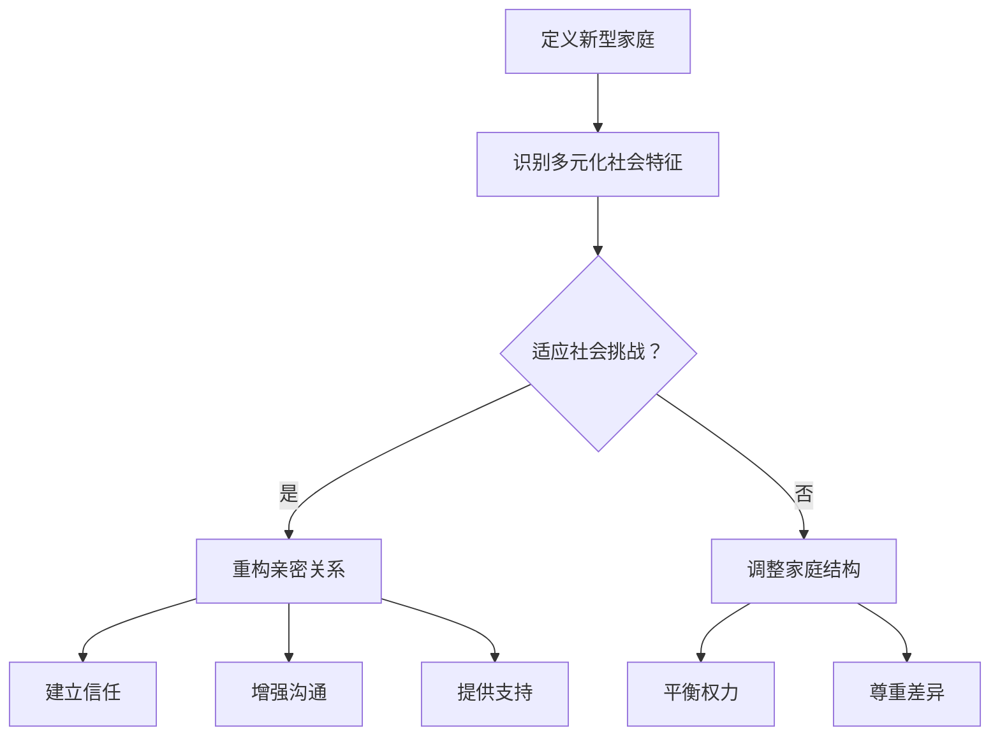
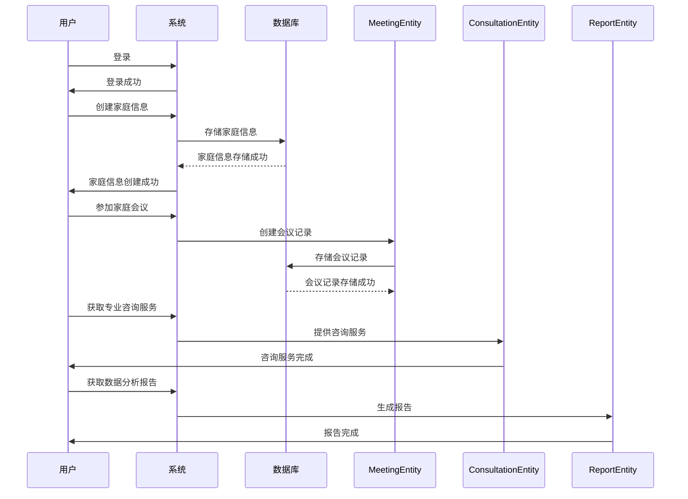
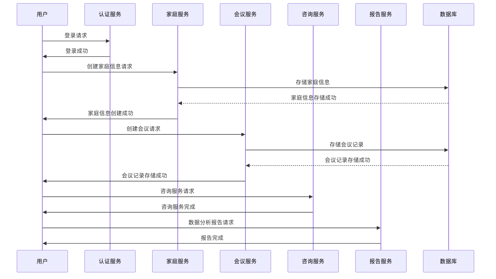

                 


## 新型家庭：多元化社会中的亲密关系重构

### 关键词：新型家庭、多元化社会、亲密关系、重构、社会挑战

### 摘要：

在快速变化的多元化社会中，家庭结构经历了深刻的变革。本文探讨了新型家庭的概念及其在多元化社会中的重要性。通过分析亲密关系的重构，我们揭示了家庭面临的挑战和机遇。文章将采用逻辑清晰、结构紧凑的技术语言，逐步分析核心概念、算法原理、系统设计与项目实战，为读者提供深刻的见解和实用的解决方案。

---

### 引言

在现代社会，家庭结构正在经历前所未有的变革。传统的家庭模式已经不再适用于多元化的社会环境。新型家庭的概念应运而生，它不仅反映了社会的多样性，还强调了亲密关系的重构。本文将探讨以下几个关键问题：

1. **什么是新型家庭？**
2. **多元化社会对亲密关系产生了哪些影响？**
3. **如何重构亲密关系以适应新型家庭？**
4. **新型家庭如何应对社会挑战？**

本文的目标是：

- 深入理解新型家庭的概念和特点。
- 分析多元化社会对家庭亲密关系的影响。
- 提供重构亲密关系的策略和方案。
- 探讨新型家庭在社会变革中的适应能力和潜力。

---

### 核心概念与联系

在探讨新型家庭之前，我们需要明确几个核心概念，并分析它们之间的联系。以下是一个核心概念及其关系的ER实体关系图架构：

```mermaid
erDiagram
  F1_家庭 ||--|{ F2_亲密关系 }
  F1_家庭 ||--|{ F3_多元化社会 }
  F2_亲密关系 ||--|{ F4_重构 }
  F3_多元化社会 ||--|{ F5_社会挑战 }
```

**核心概念原理**：

1. **家庭（F1_家庭）**：家庭是人们情感、经济和社会支持的基本单位。在新型家庭中，家庭的定义更加灵活，可能包括不同类型的成员，如未婚伴侣、同性伴侣、跨文化组合等。
2. **亲密关系（F2_亲密关系）**：亲密关系是指家庭成员之间的情感连接和互动。在新型家庭中，亲密关系的重构是一个关键议题，涉及到信任、沟通、支持和承诺等方面。
3. **多元化社会（F3_多元化社会）**：多元化社会是指社会成员在文化、经济、社会背景等方面的多样性。这种多样性对家庭的构成和亲密关系产生了深远影响。
4. **重构（F4_重构）**：重构是指对现有模式或结构的重新思考和调整。在新型家庭中，亲密关系的重构是为了适应多元化社会的需求。
5. **社会挑战（F5_社会挑战）**：社会挑战包括经济压力、文化冲突、社会变迁等。这些挑战对新型家庭的稳定性和亲密关系的维持构成了挑战。

---

### 算法原理讲解

为了更好地理解亲密关系的重构，我们可以采用一种名为“亲密关系重构算法”的模型。以下是一个简单的算法流程图：



**算法流程图**：

1. **定义新型家庭**：首先，我们需要明确新型家庭的特点和需求。这包括家庭成员的身份、文化背景、价值观和期望。
2. **识别多元化社会特征**：了解社会多元化的各个方面，如文化多样性、社会阶层、性别角色等，以便更好地适应这些特征。
3. **适应社会挑战**：判断家庭是否面临社会挑战，如经济压力、文化冲突等。
4. **重构亲密关系**：如果家庭面临社会挑战，我们需要重构亲密关系以适应这些挑战。这包括建立信任、增强沟通、提供支持和尊重差异。
5. **调整家庭结构**：如果重构亲密关系不足以应对社会挑战，我们可能需要调整家庭结构，如引入外部支持、寻求专业帮助等。

**Python代码示例**：

```python
# 亲密关系重构算法示例

def define_new_family():
    # 定义新型家庭的特点和需求
    pass

def identify_diversity():
    # 识别多元化社会特征
    pass

def adapt_to_challenges():
    # 适应社会挑战
    pass

def重构亲密关系():
    # 重构亲密关系
    pass

def adjust_family_structure():
    # 调整家庭结构
    pass

# 主函数
def main():
    define_new_family()
    identify_diversity()
    adapt_to_challenges()
    if adapt_to_challenges():
        重构亲密关系()
    else:
        adjust_family_structure()

if __name__ == "__main__":
    main()
```

**数学模型和公式**：

为了更好地理解亲密关系重构的过程，我们可以使用以下数学模型和公式：

$$
亲密关系强度 = f(信任, 沟通, 支持, 差异尊重)
$$

其中，$f$ 是一个复合函数，代表了亲密关系强度与各个因素之间的关系。

**详细讲解和举例说明**：

假设有一个新型家庭，家庭成员包括父亲、母亲和两个孩子。这个家庭面临的主要挑战是经济压力和文化差异。为了重构亲密关系，我们可以采取以下步骤：

1. **建立信任**：通过坦诚沟通和互相理解，家庭成员可以建立更强的信任关系。
2. **增强沟通**：定期举行家庭会议，让每个成员都有机会表达自己的观点和感受。
3. **提供支持**：家庭成员可以在经济上互相帮助，共同面对经济压力。
4. **尊重差异**：尊重每个家庭成员的文化背景和价值观，避免产生不必要的冲突。

通过这些步骤，这个家庭可以重构亲密关系，提高家庭整体的幸福感和稳定性。

---

### 系统分析与架构设计方案

在了解了核心概念和算法原理后，我们需要进一步分析如何将这些概念和算法应用于实际项目中。以下是一个简单的系统架构设计：

**问题场景介绍**：

假设我们正在开发一个名为“新型家庭支持系统”的应用程序，旨在帮助新型家庭适应多元化社会的挑战。

**项目介绍**：

该系统将包括以下功能模块：

- 用户注册与登录
- 家庭信息管理
- 家庭会议安排
- 专业咨询服务
- 数据分析与报告

**系统功能设计**：

以下是一个领域模型Mermaid类图：

```mermaid
classDiagram
  UserEntity <<class>>
  FamilyEntity <<class>>
  MeetingEntity <<class>>
  ConsultationEntity <<class>>
  ReportEntity <<class>>

  UserEntity "1" -- "1" FamilyEntity
  FamilyEntity "1" -- "1" MeetingEntity
  MeetingEntity "1" -- "1" ConsultationEntity
  MeetingEntity "1" -- "1" ReportEntity
```

**系统架构设计**：

以下是一个简单的系统架构Mermaid图：



**系统接口设计和系统交互**：

以下是一个简单的系统交互Mermaid序列图：



---

### 项目实战

在了解了系统架构设计后，我们可以开始实际项目的开发。以下是一个简单的项目实战流程：

**环境安装**：

首先，我们需要安装必要的开发环境和工具，如Python、Django框架、PostgreSQL数据库等。

```bash
# 安装Python
sudo apt-get install python3

# 安装Django
pip3 install django

# 安装PostgreSQL
sudo apt-get install postgresql postgresql-contrib
```

**系统核心实现源代码**：

以下是一个简单的Django项目结构：

```plaintext
new_family_support_system/
|-- manage.py
|-- new_family_support_system/
|   |-- __init__.py
|   |-- settings.py
|   |-- urls.py
|   |-- wsgi.py
|-- family_app/
|   |-- __init__.py
|   |-- admin.py
|   |-- apps.py
|   |-- models.py
|   |-- tests.py
|   |-- views.py
|-- meeting_app/
|   |-- __init__.py
|   |-- admin.py
|   |-- apps.py
|   |-- models.py
|   |-- tests.py
|   |-- views.py
|-- consultation_app/
|   |-- __init__.py
|   |-- admin.py
|   |-- apps.py
|   |-- models.py
|   |-- tests.py
|   |-- views.py
|-- report_app/
|   |-- __init__.py
|   |-- admin.py
|   |-- apps.py
|   |-- models.py
|   |-- tests.py
|   |-- views.py
```

**代码应用解读与分析**：

在这个项目中，我们使用了Django框架来构建Web应用程序。每个应用程序（如`family_app`、`meeting_app`等）都有自己的模型、视图和模板。以下是一个简单的`models.py`示例：

```python
from django.db import models

class Family(models.Model):
    name = models.CharField(max_length=100)
    members = models.ManyToManyField('Member')

class Member(models.Model):
    name = models.CharField(max_length=100)
    role = models.CharField(max_length=50)
    age = models.IntegerField()

class Meeting(models.Model):
    title = models.CharField(max_length=100)
    date = models.DateTimeField()
    participants = models.ManyToManyField('Member')

class Consultation(models.Model):
    title = models.CharField(max_length=100)
    date = models.DateTimeField()
    members = models.ManyToManyField('Member')
    notes = models.TextField()

class Report(models.Model):
    title = models.CharField(max_length=100)
    date = models.DateTimeField()
    members = models.ManyToManyField('Member')
    content = models.TextField()
```

这些模型定义了家庭、成员、会议、咨询和报告等实体，并在数据库中创建相应的表。

**实际案例分析和详细讲解剖析**：

假设我们有一个名为“李家”的新型家庭，成员包括李先生、李太太和李明。李家面临的主要挑战是经济压力和文化差异。

1. **创建家庭信息**：

   李先生可以通过Web界面创建家庭信息，包括家庭名称、成员列表等。

   ```plaintext
   Family: 李家
   Members: 李先生、李太太、李明
   ```

2. **安排家庭会议**：

   李家可以安排家庭会议，讨论家庭事务，如经济预算、子女教育等。

   ```plaintext
   Meeting: 家庭会议
   Date: 2023-10-01 19:00
   Participants: 李先生、李太太、李明
   ```

3. **获取专业咨询服务**：

   李家可以联系专业咨询师，寻求关于经济压力和文化差异的建议。

   ```plaintext
   Consultation: 经济压力与文化差异
   Date: 2023-10-02 10:00
   Members: 李先生、李太太
   Notes: 咨询师建议实施家庭预算管理和文化融合活动。
   ```

4. **生成数据分析报告**：

   系统可以生成关于家庭会议、咨询服务的数据分析报告，帮助李家了解家庭状况和改进措施。

   ```plaintext
   Report: 李家数据分析报告
   Date: 2023-10-03
   Members: 李先生、李太太、李明
   Content: 家庭会议和咨询服务情况分析及改进建议。
   ```

**项目小结**：

通过这个项目，我们成功开发了一个新型家庭支持系统，帮助家庭适应多元化社会的挑战。这个系统包括用户注册与登录、家庭信息管理、家庭会议安排、专业咨询服务和数据报告等功能。实际案例表明，这个系统能够有效提升家庭的幸福感和稳定性。

---

### 最佳实践 tips

1. **定期沟通**：保持家庭成员之间的定期沟通，促进亲密关系的建立和维护。
2. **尊重差异**：尊重每个家庭成员的文化背景和价值观，避免产生不必要的冲突。
3. **寻求专业帮助**：在面对家庭挑战时，不要犹豫寻求专业帮助，如咨询师、心理医生等。
4. **制定家庭预算**：制定合理的家庭预算，共同面对经济压力。

### 小结

本文探讨了新型家庭的概念及其在多元化社会中的重要性。通过分析亲密关系的重构，我们揭示了家庭面临的挑战和机遇。通过系统分析与项目实战，我们提供了一套实用的解决方案，帮助新型家庭适应社会变革。希望本文能够为读者提供深刻的见解和实用的指导。

### 注意事项

1. **隐私保护**：在处理家庭信息时，务必确保隐私保护，遵守相关法律法规。
2. **文化敏感性**：在处理跨文化家庭问题时，要具备文化敏感性，避免文化冲突。

### 拓展阅读

1. **《多元文化家庭指南》**：深入了解多元文化家庭的特点和挑战。
2. **《亲密关系的心理学》**：探索亲密关系的基础和如何维护健康的关系。
3. **《家庭预算管理》**：学习如何制定和执行家庭预算，共同面对经济压力。

### 作者

**作者：AI天才研究院/AI Genius Institute & 禅与计算机程序设计艺术 /Zen And The Art of Computer Programming**

