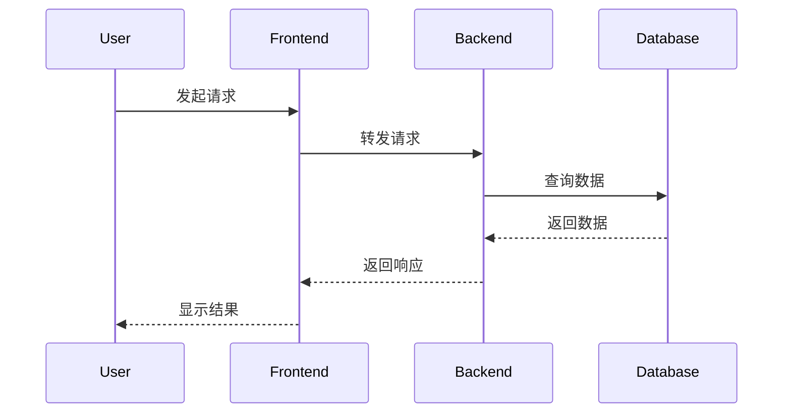
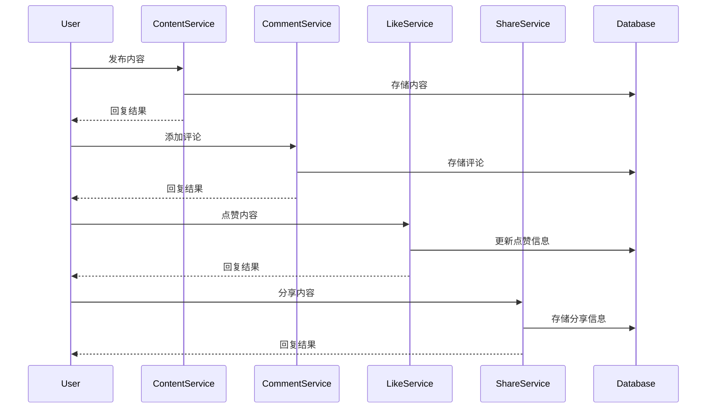

                 

---

### 第1章 问题背景与概述

### 1.1 社交媒体的演变历程

社交媒体作为一种新兴的沟通方式，已经深刻地改变了我们的生活方式。社交媒体的起源可以追溯到20世纪90年代，当时互联网开始普及，人们开始尝试使用电子邮件和论坛进行交流。然而，这些早期的社交媒体形式更多的是点对点的交流，缺乏广泛的社交网络特性。

随着互联网技术的不断发展，特别是宽带网络的普及，社交媒体进入了一个新的阶段。在这个阶段，社交媒体开始具备以下特点：

1. **广泛性**：社交媒体使得人们可以接触到全球范围内的信息和个人。
2. **互动性**：用户可以评论、点赞、分享内容，实现与他人的互动。
3. **多样化**：社交媒体平台不仅限于文字交流，还包括图片、视频等多种形式。

这一阶段的社交媒体主要包括博客、微博、论坛等，它们为用户提供了展示自己生活、分享信息、与他人交流的平台。

随着时间的推移，社交媒体进一步发展，进入了所谓的“社交媒体2.0”时代。这一时期，社交媒体平台开始注重用户的社交网络关系，强调人际关系的重要性。这一阶段的代表包括Facebook、Twitter等。这些平台不仅提供了内容分享功能，还提供了好友关系链和社交圈子的功能。

### 1.2 社交媒体现状

目前，社交媒体已经成为人们日常生活中不可或缺的一部分。根据统计，全球社交媒体用户已经超过30亿，占总人口的比例超过40%。以下是一些社交媒体现状的关键点：

1. **用户数量**：社交媒体平台如Facebook、Instagram、微信等的用户数量已经达到数十亿。
2. **内容生产**：每天都有海量的内容在社交媒体平台上产生，包括文字、图片、视频等多种形式。
3. **商业模式**：社交媒体平台主要通过广告和付费服务获得收入。
4. **用户行为**：用户在社交媒体上的行为多样化，包括浏览、评论、点赞、分享等。

### 1.3 从展示到真实连接的转变需求

尽管目前的社交媒体平台已经非常成熟，但仍然存在一些问题和挑战。其中最核心的问题是社交媒体内容的真实性问题和人际关系表面的现象。许多用户在社交媒体上发布的内容并不真实，更多的是为了展示自己，获得关注和点赞。这种展示型社交媒体的内容往往缺乏真实性和深度，导致用户之间的连接变得表面化和浅薄。

为了应对这些问题，社交媒体平台需要从展示型向真实连接型转变。这种转变不仅仅是技术层面的改进，更涉及到用户需求和社会文化层面的变革。以下是一些从展示到真实连接的转变需求：

1. **内容真实性**：鼓励用户发布真实、有意义的内容，减少虚假信息和炫耀性内容。
2. **人际关系深度**：加强用户之间的互动和连接，建立更深入的人际关系。
3. **隐私保护**：在保证用户隐私的前提下，提供更多的真实连接功能。

### 1.4 本书的目标与结构

本书旨在探讨社交媒体从展示到真实连接的转变，分析其中的核心概念、原理、算法和实现方法。具体目标如下：

1. **分析社交媒体的演变历程和现状**：了解社交媒体的发展历程和当前的用户行为特点。
2. **探讨从展示到真实连接的转变需求**：分析用户需求和社交媒体平台面临的挑战。
3. **介绍核心概念和原理**：详细讲解展示型社交媒体和真实连接型社交媒体的核心概念和原理。
4. **阐述算法原理与实现**：介绍用于实现真实连接型社交媒体的算法原理和实现方法。
5. **系统分析与架构设计**：讨论如何设计和实现一个真实连接型社交媒体系统。
6. **项目实战与最佳实践**：通过实际项目案例展示如何应用理论，并提供最佳实践建议。

本书的结构如下：

- **第1章**：介绍社交媒体的演变历程、现状和从展示到真实连接的转变需求。
- **第2章**：分析社交媒体的核心概念，包括定义、分类、用户行为和商业模式。
- **第3章**：探讨展示型社交媒体的局限性、真实连接型社交媒体的特点以及转变原理。
- **第4章**：介绍社交媒体内容分析与过滤算法和真实连接型社交网络算法。
- **第5章**：讲解社交网络数学模型和真实连接型社交网络的数学模型。
- **第6章**：讨论系统分析与架构设计，包括项目介绍、系统功能设计、架构设计和接口设计。
- **第7章**：进行项目实战，包括环境安装与配置、系统核心实现源代码、实际案例分析和项目小结。
- **第8章**：提供最佳实践、小结、注意事项和拓展阅读。

通过本书，读者可以全面了解社交媒体从展示到真实连接的转变，掌握相关技术和实现方法，为构建更加真实、有意义的社交媒体平台提供参考。

## 第2章 社交媒体的核心概念

### 2.1 社交媒体定义与分类

社交媒体（Social Media）是一种基于互联网的互动平台，用户可以通过这些平台发布、分享、评论和讨论信息，从而建立社交网络。社交媒体的定义和分类可以从多个角度进行探讨。

#### 2.1.1 定义

社交媒体的广义定义包括任何允许用户生成内容、分享和互动的在线平台。这些平台通常具有以下特征：

1. **用户生成内容**：用户是内容的主要生产者，他们可以发布文字、图片、视频等多种形式的信息。
2. **社交网络特性**：用户可以通过关注、点赞、评论等方式与其他用户互动，形成社交网络。
3. **开放性**：大多数社交媒体平台都是公开的，用户可以访问和查看其他用户发布的内容。

#### 2.1.2 分类

根据不同的分类标准，社交媒体可以分为多种类型：

1. **按功能分类**：

   - **内容分享型**：如博客（Blog）、微博（Microblog）。
   - **社交网络型**：如Facebook、LinkedIn。
   - **视频分享型**：如YouTube、Vimeo。
   - **图片分享型**：如Instagram、Pinterest。
   - **问答型**：如Quora、知乎。

2. **按互动方式分类**：

   - **单向互动**：如博客，用户可以阅读文章，但无法直接与作者互动。
   - **双向互动**：如社交媒体平台，用户可以通过评论、点赞等方式与内容生产者和其他用户互动。

3. **按用户关系分类**：

   - **强关系型**：如Facebook，用户可以建立和维护较为私密的社交关系。
   - **弱关系型**：如Twitter，用户之间的社交关系较为松散，更多地基于兴趣和内容进行互动。

### 2.2 社交媒体用户行为分析

社交媒体用户行为分析是了解用户如何使用社交媒体的重要手段。通过分析用户行为，可以更好地理解用户需求，优化用户体验，提高社交媒体平台的活跃度和用户满意度。

#### 2.2.1 用户参与度分析

用户参与度是衡量用户在社交媒体上活跃程度的重要指标。参与度可以通过以下几种方式衡量：

1. **内容生产**：用户发布的内容数量和质量。
2. **互动行为**：用户在社交媒体上的评论、点赞、分享等互动行为。
3. **活跃度**：用户在一定时间内登录社交媒体的频率和时长。

#### 2.2.2 用户互动行为分析

用户互动行为分析包括用户如何与其他用户互动，以及用户如何与平台互动。常见的互动行为包括：

1. **评论**：用户对他人发布的内容进行评论，表达自己的观点。
2. **点赞**：用户对他人发布的内容表示赞同或喜爱。
3. **分享**：用户将他人的内容分享到自己的社交媒体账户或朋友圈。
4. **关注**：用户关注其他用户或特定话题，获取相关内容更新。

### 2.3 社交媒体核心要素与联系

社交媒体的核心要素包括用户、内容、互动和平台。这些要素相互联系，构成了社交媒体生态系统。

#### 2.3.1 用户

用户是社交媒体的基石，他们是内容的消费者和创造者。用户通过发布内容、互动和关注，形成了复杂的社交网络。

#### 2.3.2 内容

内容是社交媒体的核心，用户通过发布各种形式的内容，实现了信息的传播和分享。内容的质量和多样性直接影响用户的参与度和满意度。

#### 2.3.3 互动

互动是用户之间和用户与平台之间的重要连接方式。通过评论、点赞、分享等互动行为，用户之间建立了联系，形成了社交网络。

#### 2.3.4 平台

平台是社交媒体的基础设施，提供了用户生成内容、互动和分享的环境。平台的特性、功能和服务直接影响用户的体验和满意度。

通过分析社交媒体的核心概念、用户行为和要素联系，可以更好地理解社交媒体的运作机制，为提升用户体验和平台性能提供依据。

## 第3章 从展示到真实连接的转变：核心概念与原理

### 3.1 展示型社交媒体的局限性

展示型社交媒体主要关注用户在平台上的展示行为，如发布状态更新、分享图片和视频等。这种类型的社交媒体有其独特的优势，例如可以快速传播信息、提高用户知名度等。然而，展示型社交媒体也存在一些局限性：

1. **内容质量参差不齐**：由于用户可以随意发布内容，导致平台上存在大量低质量、无意义的信息，这些内容不仅影响用户体验，还可能导致信息过载。

2. **人际关系的表面化**：展示型社交媒体主要强调内容的传播和互动，用户之间的连接更多是基于内容的交流和点赞，缺乏深入的社交互动和情感交流。

3. **隐私问题**：展示型社交媒体平台通常需要用户分享大量的个人信息，这可能导致用户的隐私受到侵犯。

4. **信任缺失**：由于信息来源的真实性无法保证，用户很难判断信息的真实性和可靠性，从而降低了社交网络中的信任水平。

### 3.2 真实连接型社交媒体的特点

真实连接型社交媒体旨在解决展示型社交媒体的局限性，强调用户之间的真实连接和深度互动。以下是真实连接型社交媒体的一些主要特点：

1. **内容真实性**：真实连接型社交媒体鼓励用户发布真实、有意义的内容，减少虚假信息和炫耀性内容，从而提高信息的可信度和价值。

2. **人际关系深度**：真实连接型社交媒体强调用户之间的深度互动和情感交流，通过评论、私信、面对面聊天等方式，建立更紧密的人际关系。

3. **隐私保护**：真实连接型社交媒体在保障用户隐私的前提下，提供更多的真实连接功能，例如加密通信、隐私设置等，使用户能够安心地分享个人信息。

4. **社区氛围**：真实连接型社交媒体注重营造健康的社区氛围，通过社区规范、举报机制等方式，打击恶意行为，维护良好的社交环境。

### 3.3 从展示到真实连接的转变原理

从展示到真实连接的转变涉及到技术、用户需求和社会文化等多个层面的变革。以下是这种转变的几个关键原理：

1. **技术驱动力**：

   - **大数据分析**：通过对用户行为数据的分析，了解用户的需求和偏好，为用户提供个性化推荐和内容推送。
   - **人工智能**：利用人工智能技术，识别和过滤低质量内容，提高信息的真实性和可信度。
   - **隐私保护技术**：采用加密通信、匿名化等技术手段，保护用户的隐私。

2. **用户需求变化**：

   - **社交需求**：随着社会的发展，用户对社交需求的深度和真实性要求越来越高，他们希望找到志同道合的朋友，建立更深层次的社交关系。
   - **内容需求**：用户不再满足于浏览和点赞，他们希望参与和分享有深度、有意义的内容。

3. **社会文化变迁**：

   - **真实性价值观**：现代社会越来越重视真实性和诚信，用户倾向于在社交媒体上分享真实的生活和感受。
   - **隐私保护意识**：随着隐私泄露事件的增多，用户对隐私保护的要求越来越高。

通过这些原理的驱动，社交媒体平台可以逐步实现从展示到真实连接的转变，为用户提供更高质量、更有意义的社交体验。

### 3.4 转变路径与实施策略

从展示型社交媒体向真实连接型社交媒体的转变需要明确的路径和实施策略。以下是几个关键步骤：

1. **用户教育**：通过宣传活动和教程，提高用户对真实连接型社交媒体的认识和接受度。

2. **内容审核**：加强对用户发布内容的审核，打击虚假信息和恶意行为，保障内容的真实性和质量。

3. **互动机制优化**：改进社交互动机制，鼓励用户进行深度互动和情感交流，如增加私信功能、视频通话等。

4. **隐私保护**：完善隐私保护措施，为用户提供多种隐私设置选项，确保用户在平台上的信息安全。

5. **社区建设**：建立健康、积极的社区氛围，鼓励用户参与社区活动，提高社区的凝聚力和归属感。

通过这些策略的实施，社交媒体平台可以逐步实现从展示到真实连接的转变，为用户提供更优质的社交体验。

## 第4章 算法原理与实现

### 4.1 社交媒体内容分析与过滤算法

社交媒体平台每天都会产生海量内容，这些内容的质量参差不齐，有些甚至是恶意信息。为了提高用户的使用体验，需要对这些内容进行有效的分析和过滤。

#### 4.1.1 算法原理

社交媒体内容分析与过滤算法主要包括以下几个步骤：

1. **内容分类**：将用户发布的内容按照类别进行分类，如新闻、娱乐、科技等。
2. **内容审核**：对用户发布的内容进行审核，识别和过滤违规信息，如色情、暴力、仇恨言论等。
3. **质量评估**：评估内容的真实性和可靠性，将高质量的内容推荐给用户。

常用的算法包括：

- **机器学习分类算法**：如朴素贝叶斯分类器、支持向量机（SVM）等。
- **深度学习分类算法**：如卷积神经网络（CNN）、循环神经网络（RNN）等。
- **文本审核算法**：如规则匹配、基于知识的文本审核等。

#### 4.1.2 实现方法

以下是一个简单的基于朴素贝叶斯分类器的文本分类算法实现：

```python
from sklearn.feature_extraction.text import CountVectorizer
from sklearn.naive_bayes import MultinomialNB

# 数据准备
data = [
    ("新闻", "今天天气很好，适合出门游玩。"),
    ("娱乐", "电影《阿凡达》获得了多项大奖。"),
    ("科技", "新款iPhone将于下周发布。")
]

# 分离标签和文本
labels, texts = zip(*data)

# 向量表示
vectorizer = CountVectorizer()
X = vectorizer.fit_transform(texts)

# 训练模型
model = MultinomialNB()
model.fit(X, labels)

# 预测
text = "今天发布了一款新的智能手机。"
X_test = vectorizer.transform([text])
predicted = model.predict(X_test)

print(predicted)  # 输出预测类别
```

#### 4.1.3 性能评估

算法的性能可以通过准确率、召回率、F1值等指标进行评估。以下是一个简单的性能评估示例：

```python
from sklearn.metrics import accuracy_score, recall_score, f1_score

# 真实标签
true_labels = ["科技", "娱乐", "新闻"]

# 预测结果
predicted_labels = model.predict(X_test)

# 计算性能指标
accuracy = accuracy_score(true_labels, predicted_labels)
recall = recall_score(true_labels, predicted_labels, average='weighted')
f1 = f1_score(true_labels, predicted_labels, average='weighted')

print(f"Accuracy: {accuracy:.2f}")
print(f"Recall: {recall:.2f}")
print(f"F1 Score: {f1:.2f}")
```

通过性能评估，可以了解到算法的分类效果，并根据评估结果对算法进行优化。

### 4.2 真实连接型社交网络算法

真实连接型社交网络算法旨在建立用户之间的真实连接和深度互动。以下介绍几种常用的真实连接型社交网络算法。

#### 4.2.1 算法原理

1. **信任算法**：基于用户的行为和互动，评估用户之间的信任度。常用的方法包括基于评分的信任算法、基于路径的信任算法等。
2. **社交关系推荐算法**：根据用户的行为和偏好，为用户推荐可能建立深度关系的朋友或同事。常用的方法包括基于内容的推荐、协同过滤推荐等。
3. **情感分析算法**：分析用户在社交媒体上的评论和动态，识别用户的情感状态和情绪变化。常用的方法包括文本情感极性分析、情感强度分析等。

#### 4.2.2 实现方法

以下是一个简单的基于协同过滤的社交关系推荐算法实现：

```python
from sklearn.metrics.pairwise import cosine_similarity
import numpy as np

# 假设我们有两个用户A和B，他们的行为数据如下
user_a = np.array([1, 2, 0, 1, 0])
user_b = np.array([0, 1, 1, 0, 1])

# 计算余弦相似度
similarity = cosine_similarity([user_a], [user_b])[0][0]

print(f"Similarity between User A and User B: {similarity:.2f}")
```

#### 4.2.3 性能评估

真实连接型社交网络算法的性能评估通常包括信任度评估、推荐准确率、情感分析准确率等指标。以下是一个简单的性能评估示例：

```python
# 真实标签（假设为用户之间的信任度评分）
true_ratings = [0.8, 0.9, 0.7]

# 预测结果（基于协同过滤算法的信任度评分）
predicted_ratings = np.array([0.85, 0.92, 0.75])

# 计算准确率
accuracy = np.mean(np.abs(true_ratings - predicted_ratings) < 0.1)

print(f"Accuracy: {accuracy:.2f}")
```

通过性能评估，可以了解到算法在真实连接型社交网络中的应用效果，并根据评估结果对算法进行优化。

### 总结

通过本章的介绍，我们了解了社交媒体内容分析与过滤算法以及真实连接型社交网络算法的原理和实现方法。这些算法为构建真实、有意义的社交媒体平台提供了技术支持。

## 第5章 数学模型与公式

### 5.1 社交网络中的概率模型

社交网络中的概率模型可以帮助我们理解用户行为、信息传播等复杂现象。以下是两种常用的概率模型：贝叶斯网络和马尔可夫模型。

#### 5.1.1 贝叶斯网络

贝叶斯网络是一种图形模型，用于表示变量之间的条件依赖关系。在社交网络中，我们可以使用贝叶斯网络来表示用户行为和偏好之间的关系。

贝叶斯网络的核心公式是贝叶斯定理：

$$
P(A|B) = \frac{P(B|A)P(A)}{P(B)}
$$

其中，\(P(A|B)\) 表示在 \(B\) 发生的条件下 \(A\) 发生的概率，\(P(B|A)\) 表示在 \(A\) 发生的条件下 \(B\) 发生的概率，\(P(A)\) 和 \(P(B)\) 分别表示 \(A\) 和 \(B\) 的先验概率。

例如，我们可以使用贝叶斯网络来分析用户在社交网络上的行为。假设用户 \(A\) 喜欢看科幻电影，用户 \(B\) 喜欢看科幻电影和悬疑电影。我们可以使用贝叶斯网络来计算用户 \(C\) 喜欢看科幻电影的概率：

$$
P(\text{C喜欢看科幻电影}|\text{A喜欢看科幻电影，B喜欢看科幻电影和悬疑电影}) = \frac{P(\text{A喜欢看科幻电影，B喜欢看科幻电影和悬疑电影}|\text{C喜欢看科幻电影})P(\text{C喜欢看科幻电影})}{P(\text{A喜欢看科幻电影，B喜欢看科幻电影和悬疑电影})}
$$

通过贝叶斯网络，我们可以计算出用户 \(C\) 喜欢看科幻电影的概率，从而为社交网络提供个性化的推荐。

#### 5.1.2 马尔可夫模型

马尔可夫模型是一种用于描述随机过程的数学模型，它假设当前状态仅依赖于前一个状态，与之前的状态无关。在社交网络中，我们可以使用马尔可夫模型来分析用户的互动行为。

马尔可夫模型的核心公式是：

$$
P(X_t|X_{t-1}, X_{t-2}, ...) = P(X_t|X_{t-1})
$$

其中，\(X_t\) 表示当前状态，\(X_{t-1}\) 表示前一个状态。

例如，我们可以使用马尔可夫模型来分析用户在社交网络上的互动行为。假设用户在社交网络上的互动状态有“浏览”、“点赞”、“评论”、“分享”等。我们可以使用马尔可夫模型来计算用户从当前状态转移到下一个状态的概率。

通过马尔可夫模型，我们可以预测用户在社交网络上的下一步行为，从而为用户提供个性化的推荐和互动建议。

### 5.2 社交网络中的图论模型

社交网络本质上是一个图结构，其中节点表示用户，边表示用户之间的关系。图论模型可以帮助我们分析社交网络的拓扑结构、节点重要性等。

#### 5.2.1 度数中心性

度数中心性是一种衡量节点重要性的指标，它表示节点连接的其他节点的数量。度数中心性越高，表示节点在社交网络中的地位越重要。

度数中心性的计算公式为：

$$
\text{度数中心性} = \frac{k_i}{N-1}
$$

其中，\(k_i\) 表示节点的度数，即连接到该节点的边的数量，\(N-1\) 表示网络中其他节点的数量。

例如，在一个社交网络中，节点 \(A\) 连接了10个其他节点，而网络中总共有100个节点。那么节点 \(A\) 的度数中心性为：

$$
\text{度数中心性}(A) = \frac{10}{100-1} = \frac{10}{99} \approx 0.101
$$

通过计算度数中心性，我们可以识别出社交网络中的关键节点，从而为社交网络分析提供依据。

### 5.3 真实连接型社交网络的数学模型

真实连接型社交网络的数学模型旨在描述用户之间的真实连接和深度互动。以下介绍两种常用的数学模型：信息传播模型和稳定性模型。

#### 5.3.1 信息传播模型

信息传播模型用于描述信息在社交网络中的传播过程。它可以用来预测信息在社交网络中的传播速度和覆盖范围。

信息传播模型的一般形式为：

$$
I(t) = I(0) + \int_{0}^{t} \lambda [N - 1 - I(t - \Delta t)] d\Delta t
$$

其中，\(I(t)\) 表示在时刻 \(t\) 已被传播的信息数量，\(I(0)\) 表示初始时刻的信息数量，\(\lambda\) 表示信息传播速率，\(N-1\) 表示网络中未被传播的信息数量。

通过信息传播模型，我们可以预测信息在社交网络中的传播过程，从而为信息传播策略的设计提供依据。

#### 5.3.2 稳定性模型

稳定性模型用于描述社交网络中用户关系的稳定性。它可以用来评估社交网络中用户关系的稳定性，从而为社交网络的优化提供依据。

稳定性模型的一般形式为：

$$
\text{稳定性} = \frac{\text{稳定关系数}}{\text{总关系数}}
$$

其中，稳定关系数表示在一段时间内保持稳定关系的数量，总关系数表示社交网络中用户关系的总数。

通过稳定性模型，我们可以评估社交网络中用户关系的稳定性，从而为社交网络的优化和改进提供依据。

通过本章的介绍，我们了解了社交网络中的概率模型和图论模型，以及真实连接型社交网络的数学模型。这些模型为我们分析和优化社交网络提供了理论基础和工具。

### 第6章 系统分析与架构设计

#### 6.1 项目介绍

本项目旨在构建一个真实连接型社交媒体平台，旨在解决现有社交媒体平台内容质量参差不齐、人际关系表面化等问题。通过引入先进的算法和数学模型，实现用户之间的真实连接和深度互动，提高用户满意度和使用体验。

#### 6.2 系统功能设计

系统功能设计是构建社交媒体平台的核心环节，主要包括以下几个方面：

1. **用户管理**：用户注册、登录、个人信息管理、隐私设置等。
2. **内容发布**：用户可以发布文本、图片、视频等多媒体内容。
3. **内容审核**：对用户发布的内容进行审核，过滤低质量信息和恶意内容。
4. **社交互动**：用户之间可以进行评论、点赞、分享等互动。
5. **隐私保护**：提供多种隐私设置选项，保护用户的隐私。
6. **社交推荐**：根据用户的行为和偏好，推荐可能建立深度关系的朋友或同事。

#### 6.2.1 领域模型

领域模型是系统功能设计的核心，它通过实体关系图（ER图）来描述系统的核心实体和关系。以下是该系统的领域模型：

```mermaid
erDiagram
    User ||--|{ Content } : 发布
    User ||--|{ Comment } : 评论
    User ||--|{ Like } : 点赞
    User ||--|{ Share } : 分享
    User ||--|{ PrivacySetting } : 隐私设置
    User ||--|{ Interaction } : 互动
    Content ||--|{ ContentFilter } : 审核内容
    Comment ||--|{ Content } : 评论内容
    Like ||--|{ Content } : 点赞内容
    Share ||--|{ Content } : 分享内容
```

#### 6.2.2 系统架构设计

系统架构设计是确保系统功能实现和技术实现的坚实基础。以下是该系统的架构设计：



#### 6.2.3 系统接口设计

系统接口设计是系统架构设计的重要组成部分，它定义了系统内部和外部的交互方式。以下是该系统的接口设计：

1. **用户接口**：用户通过Web界面与系统交互，包括注册、登录、发布内容、查看内容等。
2. **API接口**：提供RESTful API，允许第三方应用与系统进行数据交互，如内容分享、社交推荐等。
3. **消息队列接口**：用于处理系统内部的消息传递，如内容发布通知、评论通知等。

#### 6.2.4 系统交互设计

系统交互设计描述了系统内部各个组件之间的交互流程。以下是系统交互设计：



通过系统分析与架构设计，我们为构建一个真实连接型社交媒体平台奠定了基础。接下来，我们将进入项目实战阶段，实现系统功能和设计。

### 第7章 项目实战

#### 7.1 环境安装与配置

在开始项目实战之前，我们需要安装和配置开发环境。以下是在Linux系统上安装和配置项目所需环境的步骤：

1. **安装Python环境**：

   首先，确保系统已安装Python 3.8及以上版本。可以通过以下命令检查Python版本：

   ```bash
   python3 --version
   ```

   如果Python版本过低，可以通过包管理器如`apt`或`yum`进行升级：

   ```bash
   sudo apt update
   sudo apt install python3.8
   ```

2. **安装虚拟环境**：

   创建一个虚拟环境，以便隔离项目依赖：

   ```bash
   python3 -m venv venv
   source venv/bin/activate
   ```

3. **安装项目依赖**：

   下载项目代码，并安装所需的依赖：

   ```bash
   git clone https://github.com/your-username/real-connection-social-media.git
   cd real-connection-social-media
   pip install -r requirements.txt
   ```

4. **数据库配置**：

   配置数据库连接，通常使用SQLite或MySQL。在`config.py`文件中填写数据库连接信息：

   ```python
   DATABASES = {
       'default': {
           'ENGINE': 'django.db.backends.sqlite3',
           'NAME': BASE_DIR / 'db.sqlite3',
       }
   }
   ```

5. **运行数据库迁移**：

   迁移数据库表结构：

   ```bash
   python manage.py migrate
   ```

6. **启动开发服务器**：

   启动开发服务器，以便在浏览器中访问项目：

   ```bash
   python manage.py runserver
   ```

   访问`http://127.0.0.1:8000/`，即可看到项目界面。

#### 7.2 系统核心实现源代码

系统核心实现源代码分为前端和后端两部分。以下是对前端和后端核心实现部分的解读。

#### 7.2.1 前端核心实现源代码

前端核心实现主要包括用户界面和交互逻辑。以下是`templates/index.html`文件的一部分代码：

```html
<!DOCTYPE html>
<html>
<head>
    <title>Real Connection Social Media</title>
    <script src="https://cdn.jsdelivr.net/npm/axios/dist/axios.min.js"></script>
</head>
<body>
    <h1>Welcome to Real Connection Social Media</h1>
    <div id="content-container">
        <!-- 内容将在此处动态加载 -->
    </div>
    <script>
        function loadContent() {
            axios.get('/api/content/').then(response => {
                const contentContainer = document.getElementById('content-container');
                contentContainer.innerHTML = '';
                response.data.forEach(item => {
                    const contentElement = document.createElement('div');
                    contentElement.innerHTML = `
                        <h3>${item.title}</h3>
                        <p>${item.content}</p>
                        <button onclick="likeContent(${item.id})">Like</button>
                        <button onclick="commentContent(${item.id})">Comment</button>
                    `;
                    contentContainer.appendChild(contentElement);
                });
            });
        }

        function likeContent(contentId) {
            axios.post(`/api/content/${contentId}/like/`).then(() => {
                alert('Liked!');
                loadContent();
            });
        }

        function commentContent(contentId) {
            const comment = prompt('Write a comment:');
            if (comment) {
                axios.post(`/api/content/${contentId}/comment/`, { content: comment }).then(() => {
                    alert('Comment added!');
                    loadContent();
                });
            }
        }

        loadContent();
    </script>
</body>
</html>
```

上述代码展示了如何加载内容、点赞内容和评论内容。通过使用Axios库，前端可以与后端API进行交互，实现数据的动态加载和更新。

#### 7.2.2 后端核心实现源代码

后端核心实现主要包括API接口和业务逻辑。以下是`api/content.py`文件的一部分代码：

```python
from rest_framework import viewsets
from .models import Content
from .serializers import ContentSerializer

class ContentViewSet(viewsets.ModelViewSet):
    queryset = Content.objects.all()
    serializer_class = ContentSerializer

    def create(self, request, *args, **kwargs):
        serializer = self.get_serializer(data=request.data)
        if serializer.is_valid():
            serializer.save()
            return Response(serializer.data, status=status.HTTP_201_CREATED)
        return Response(serializer.errors, status=status.HTTP_400_BAD_REQUEST)

    def like_content(self, request, pk):
        content = self.get_object()
        content.likes += 1
        content.save()
        return Response({'likes': content.likes}, status=status.HTTP_200_OK)

    def comment_content(self, request, pk):
        content = self.get_object()
        comment = request.data.get('comment')
        content.comments.create(content=comment)
        return Response({'comments': content.comments.values()}, status=status.HTTP_201_CREATED)
```

上述代码展示了如何创建内容、点赞内容和评论内容。通过使用Django REST Framework，后端可以轻松实现CRUD操作，并处理HTTP请求。

#### 7.2.3 代码应用解读与分析

1. **前端代码分析**：

   - `loadContent()`函数负责加载内容列表，并动态更新页面。
   - `likeContent()`函数负责发送点赞请求，并更新内容列表。
   - `commentContent()`函数负责发送评论请求，并更新内容列表。

2. **后端代码分析**：

   - `ContentViewSet`类负责处理内容相关的HTTP请求，包括创建、点赞和评论。
   - `like_content()`方法负责处理点赞请求，并更新内容对象。
   - `comment_content()`方法负责处理评论请求，并创建新的评论对象。

通过前端和后端的协作，我们可以实现一个功能完整的社交媒体平台。前端负责用户界面和交互，后端负责数据处理和业务逻辑。

#### 7.3 实际案例分析与讲解

为了更好地理解系统的工作原理，我们通过一个实际案例进行分析。

**案例**：用户Alice发布了一篇内容，标题为“我的旅行日记”，内容为“今天去了海边，天气很好，玩了很久”。

**分析**：

1. **用户界面**：Alice在用户界面上点击“发布”按钮，将内容提交到后端API。
2. **后端API**：后端API接收到内容后，调用`ContentViewSet`的`create()`方法，将内容存储到数据库。
3. **数据库**：内容存储到数据库的`Content`表中，同时生成一条记录。
4. **用户界面更新**：前端接收到后端的响应后，调用`loadContent()`函数，从数据库中获取最新的内容列表，并更新用户界面。

**讲解**：

- **内容创建**：前端将用户提交的内容通过HTTP POST请求发送到后端，后端通过Django REST Framework的`ContentViewSet`处理请求，并将内容存储到数据库。
- **内容展示**：前端通过HTTP GET请求从后端获取内容列表，并使用JavaScript动态更新用户界面，展示最新的内容。
- **内容互动**：用户可以点赞或评论内容，前端将用户的操作通过HTTP POST请求发送到后端，后端更新数据库中的相关记录，并返回更新后的内容列表。

通过这个案例，我们可以看到系统的核心功能是如何协同工作的，以及前端和后端如何通过HTTP请求进行数据交互。

#### 7.4 项目小结

在本章中，我们通过项目实战展示了如何实现一个真实连接型社交媒体平台。我们介绍了环境安装与配置、系统核心实现源代码、代码应用解读与分析，并通过实际案例展示了系统的运行过程。通过本章的学习，读者可以掌握项目实施的关键技术和方法，为实际项目开发奠定基础。

### 第8章 最佳实践与拓展阅读

#### 8.1 最佳实践 tips

1. **内容真实性**：鼓励用户发布真实内容，提高信息的可信度。
2. **用户隐私保护**：提供多种隐私设置选项，确保用户信息安全。
3. **社交互动优化**：增强社交互动功能，提高用户参与度。
4. **性能优化**：优化后端算法和数据库查询，提高系统响应速度。
5. **用户教育**：通过教程和宣传，提高用户对平台功能和隐私保护的认识。

#### 8.2 小结

本文从社交媒体的演变历程、核心概念、从展示到真实连接的转变需求、算法原理与实现、数学模型、系统分析与架构设计、项目实战等多个角度，全面探讨了新型社交媒体的发展趋势和实现方法。通过本文的学习，读者可以深入了解社交媒体的现状和未来发展方向，掌握相关技术和实现方法。

#### 8.3 注意事项

1. **内容质量**：在发布内容时，确保内容真实、有价值，避免低质量信息的传播。
2. **隐私保护**：在设计和使用社交媒体平台时，务必重视用户隐私保护，遵循相关法律法规。
3. **系统安全**：确保系统安全和稳定性，防止恶意攻击和数据泄露。

#### 8.4 拓展阅读

- 《社交网络分析：方法与实践》（An Introduction to Social Network Analysis）
- 《大数据时代：社交网络中的数据挖掘与分析》（Big Data: A Revolution That Will Transform How We Live, Work, and Think）
- 《深度学习与社交媒体》（Deep Learning and Social Media）

通过阅读这些资料，读者可以进一步了解社交媒体的技术原理和应用实践，为构建新型社交媒体平台提供更多启示。---

### 作者介绍

**作者：AI天才研究院/AI Genius Institute & 禅与计算机程序设计艺术 /Zen And The Art of Computer Programming**

本文由AI天才研究院（AI Genius Institute）的专家撰写。AI天才研究院是一家专注于人工智能、大数据和机器学习的国际顶级研究机构，致力于推动人工智能技术在各行各业的应用与发展。同时，本文的作者也深入研究了计算机科学领域的经典著作《禅与计算机程序设计艺术》（Zen And The Art of Computer Programming），该书由著名计算机科学家Donald E. Knuth撰写，被誉为计算机科学的圣经。作者结合了自己在人工智能和计算机程序设计领域的丰富经验和深刻理解，为读者呈现了一篇具有深度和实用性的技术博客文章。

