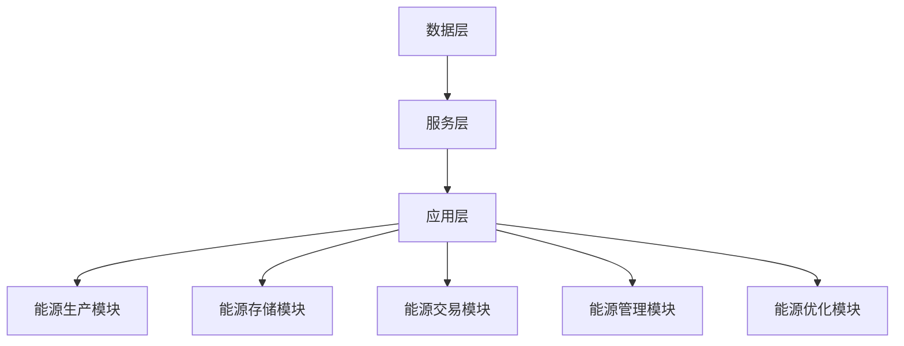
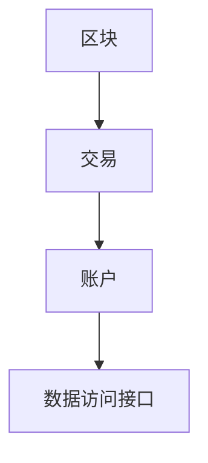
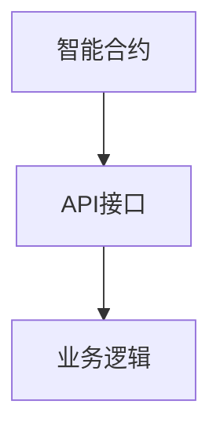

                 

### 文章标题

《新型社区能源共享平台：区块链技术在微型电网中的应用》

### 文章关键词

- 社区能源共享
- 微型电网
- 区块链技术
- 能源交易
- 能源管理和监测
- 能源分配与优化

### 文章摘要

本文深入探讨了新型社区能源共享平台的设计与实施，重点关注区块链技术在微型电网中的应用。通过对社区能源共享平台的背景、意义、挑战以及区块链技术的基本概念和工作原理的介绍，文章详细阐述了如何利用区块链技术解决社区能源共享中的关键问题。同时，通过案例分析，展示了区块链技术在能源领域成功应用的实际效果，并提出了未来发展趋势与挑战。本文旨在为读者提供一份全面、系统的技术指南，助力新型社区能源共享平台的发展。

---

## 第一部分：背景与概述

### 第1章：社区能源共享平台概述

#### 1.1.1 社区能源共享的起源与发展

**核心概念术语说明**

- **社区能源共享**：指社区内部家庭、企业和公共设施之间通过能源生产、存储、分配和消费的共享机制，实现能源的高效利用和优化配置。
- **微型电网**：小型、分布式的电力网络，通过分布式发电和储能设备实现自我供电，具有高度灵活性和独立性。

**问题背景**

随着全球能源需求的不断增长和环境问题的日益严重，传统集中式能源模式已无法满足可持续发展需求。社区能源共享作为一种新兴模式，旨在通过优化能源配置，提高能源利用效率，减少能源浪费，促进可再生能源的发展和应用。

**问题描述**

社区能源共享面临以下挑战：

1. **能源信息不透明**：社区内部能源生产、存储和消费的信息不透明，难以实现实时监控和优化配置。
2. **信任问题**：社区成员之间缺乏信任，难以建立有效的能源交易和共享机制。
3. **能源分配不均**：社区内部能源分配不均，导致部分成员能源过剩，部分成员能源短缺。

**问题解决**

区块链技术作为一种分布式账本技术，具有去中心化、透明性和不可篡改的特点，可以有效解决社区能源共享中的信任问题和信息透明性问题。

**边界与外延**

社区能源共享平台不仅涉及能源的生产、存储、分配和消费，还包括能源交易、能源管理和监测、能源分配和优化等多个方面。

**概念结构与核心要素组成**

- **生产方**：家庭、企业和公共设施等能源生产主体。
- **消费方**：家庭、企业和公共设施等能源消费主体。
- **交易平台**：提供能源交易的中介平台。
- **管理平台**：负责能源管理和监测的系统。
- **优化平台**：通过算法实现能源分配和优化的系统。

#### 1.1.2 社区能源共享的意义与挑战

**核心概念原理**

- **能源效率**：指能源系统的输出功率与输入功率的比值，衡量能源利用的程度。
- **可再生能源**：指风能、太阳能、水能等能够持续利用且对环境友好的能源。

**概念属性特征对比表格**

| 特征                 | 能源效率 | 可再生能源       |
|----------------------|-----------|-------------------|
| 描述                 | 衡量能源利用程度 | 持续利用，对环境友好 |
| 关联概念             | 能源生产、能源消费 | 风能、太阳能、水能   |
| 对社区能源共享的影响 | 提高能源利用效率 | 促进可再生能源应用   |

**ER实体关系图架构**

```mermaid
erDiagram
    Production --> Consumption
    Transaction --> Production
    Transaction --> Consumption
    Management --> Production
    Management --> Consumption
    Optimization --> Production
    Optimization --> Consumption
```

**社区能源共享的意义**

1. **提高能源利用效率**：通过优化能源配置，减少能源浪费，提高能源系统的整体效率。
2. **促进可再生能源发展**：鼓励社区内部使用可再生能源，降低对化石燃料的依赖，减少环境污染。
3. **增强能源安全性**：通过分布式能源系统，减少对中心化能源供应的依赖，提高能源供应的稳定性。

**社区能源共享的挑战**

1. **技术挑战**：区块链技术、智能合约等新兴技术在能源领域的应用尚不成熟，需要进一步研发和优化。
2. **政策挑战**：社区能源共享需要相关政策支持，包括能源交易、能源管理等方面的法规。
3. **市场挑战**：社区能源共享需要市场机制的支持，包括能源价格、交易规则等。

#### 1.1.3 微型电网的角色与潜力

**核心概念原理**

- **微型电网**：小型、分布式的电力网络，通过分布式发电和储能设备实现自我供电，具有高度灵活性和独立性。
- **分布式发电**：指在社区内部通过小型发电设备（如太阳能板、风力发电机）实现能源自给自足。
- **储能系统**：指用于存储多余能源，以供后续使用的设备（如电池、储能罐）。

**概念属性特征对比表格**

| 特征                 | 微型电网 | 分布式发电       | 储能系统             |
|----------------------|-----------|-------------------|----------------------|
| 描述                 | 小型、分布式电力网络 | 在社区内部发电       | 储存多余能源供后续使用 |
| 关联概念             | 能源共享、能源交易 | 太阳能、风力发电   | 电池、储能罐         |
| 对社区能源共享的影响 | 提供稳定电力供应 | 提高能源自给率     | 平衡能源供需        |

**微型电网在社区能源共享中的作用**

1. **提高能源自给率**：通过分布式发电和储能系统，社区可以实现能源的自给自足，减少对中心化能源供应的依赖。
2. **优化能源配置**：微型电网可以实现社区内部能源的实时监控和优化配置，提高能源利用效率。
3. **增强能源安全性**：微型电网通过分布式发电和储能系统，可以减少对中心化能源供应的依赖，提高能源供应的稳定性。

**微型电网的潜力**

1. **可再生能源应用**：微型电网可以通过分布式发电系统，充分利用太阳能、风能等可再生能源，减少对化石燃料的依赖。
2. **能源交易**：微型电网可以实现社区内部能源的交易，促进能源的优化配置和利用。
3. **能源管理**：微型电网可以通过智能监控和优化算法，实现对能源的高效管理和优化配置。

### 第2章：区块链技术基础

#### 2.1.1 区块链的基本概念

**核心概念原理**

- **区块链**：一种分布式账本技术，通过加密算法和共识机制，实现数据的分布式存储和验证。
- **分布式账本**：指数据存储在多个节点上，每个节点都保持独立且一致的副本。
- **加密算法**：用于保护数据的安全性和隐私，确保数据的完整性和不可篡改性。
- **共识机制**：指多个节点就数据的真实性和一致性达成一致的过程。

**概念属性特征对比表格**

| 特征                 | 区块链         | 分布式账本         | 加密算法            | 共识机制             |
|----------------------|----------------|---------------------|---------------------|----------------------|
| 描述                 | 分布式存储和验证 | 分布式存储         | 数据加密保护       | 数据一致性和验证     |
| 关联概念             | 智能合约、去中心化 | 数据库、中心化存储 | 密码学、加密技术    | 共识算法、网络协议   |
| 对社区能源共享的影响 | 提高数据透明度和安全性 | 实现数据分布式存储 | 保护数据隐私和安全  | 确保数据一致性       |

**区块链的基本原理**

区块链由多个区块组成，每个区块包含一定数量的交易记录。这些区块按照时间顺序链接在一起，形成一条连续的区块链。每个区块都包含一个时间戳和一个哈希值，用于确保数据的完整性和不可篡改性。

**区块链的技术特点**

1. **去中心化**：区块链通过分布式网络实现数据的存储和验证，无需依赖中心化的第三方机构。
2. **透明性**：区块链上的数据对所有节点都是透明的，确保数据的真实性和可信度。
3. **安全性**：区块链采用加密算法保护数据的安全性和隐私，确保数据不会被篡改或泄露。
4. **不可篡改性**：区块链上的数据一旦记录，就无法被修改或删除，确保数据的可靠性和完整性。

**区块链在社区能源共享中的优势**

1. **提高数据透明度**：区块链技术可以实现能源生产、存储、分配和消费的透明化，确保数据的真实性和可信度。
2. **增强安全性**：区块链技术通过加密算法和共识机制，确保数据的安全性和隐私，防止数据被篡改或泄露。
3. **降低交易成本**：区块链技术可以简化交易流程，降低交易成本，提高能源交易的效率和便捷性。

#### 2.1.2 区块链技术的工作原理

**核心概念原理**

- **分布式网络**：指区块链由多个节点组成，每个节点都保持独立且一致的副本。
- **加密算法**：用于保护数据的安全性和隐私，确保数据的完整性和不可篡改性。
- **共识机制**：指多个节点就数据的真实性和一致性达成一致的过程。

**区块链的工作原理**

1. **数据存储**：区块链通过分布式网络实现数据的存储和验证，每个节点都保存一份完整的区块链数据。
2. **加密传输**：区块链使用加密算法保护数据的安全性和隐私，确保数据在传输过程中不会被窃取或篡改。
3. **共识验证**：区块链通过共识机制确保数据的真实性和一致性，多个节点共同验证数据的合法性。
4. **记录和存储**：一旦数据通过共识验证，就会被记录在区块链上，形成一个新的区块，并链接到已有的区块链上。

**区块链的关键技术**

1. **加密算法**：用于保护数据的安全性和隐私，确保数据的完整性和不可篡改性。常见的加密算法包括哈希算法、对称加密、非对称加密等。
2. **共识机制**：用于多个节点就数据的真实性和一致性达成一致的过程。常见的共识机制包括工作量证明（PoW）、权益证明（PoS）、委托权益证明（DPoS）等。
3. **智能合约**：是一种在区块链上运行的自动执行合约，用于自动化执行交易和协议。智能合约通过预定义的规则和条件，自动执行交易并记录在区块链上。

**区块链技术的应用场景**

1. **数字货币**：区块链技术被广泛应用于数字货币领域，如比特币、以太坊等。
2. **供应链管理**：区块链技术可以确保供应链中的数据透明和可追溯，提高供应链的效率和信任度。
3. **智能合约**：区块链技术可以自动化执行智能合约，降低交易成本，提高交易的效率和可靠性。
4. **能源交易**：区块链技术可以实现能源交易的透明、安全和高效，促进社区能源共享的发展。

#### 2.1.3 区块链技术在能源领域的应用前景

**核心概念原理**

- **区块链**：一种分布式账本技术，通过加密算法和共识机制，实现数据的分布式存储和验证。
- **能源交易**：指能源生产者与消费者之间的能源买卖行为。
- **能源管理**：指对能源生产、存储、分配和消费的全过程进行监控和管理。

**区块链技术在能源交易中的应用**

1. **提高交易透明度**：区块链技术可以记录和验证能源交易的所有信息，确保交易过程的透明和公正。
2. **降低交易成本**：区块链技术简化了交易流程，减少了中介机构的参与，降低了交易成本。
3. **增强安全性**：区块链技术通过加密算法和共识机制，确保能源交易的安全性和可靠性。
4. **实现智能合约**：区块链技术可以实现智能合约，自动化执行能源交易的条款和条件。

**区块链技术在能源管理中的应用**

1. **实时监控**：区块链技术可以实现能源生产、存储、分配和消费的实时监控，提高能源管理的效率和准确性。
2. **优化配置**：区块链技术通过智能合约和优化算法，可以实现能源的优化配置和分配。
3. **提高可靠性**：区块链技术确保能源管理数据的真实性和完整性，提高能源系统的可靠性。

**区块链技术在能源领域的应用前景**

1. **智能电网**：区块链技术可以构建智能电网，实现能源的智能调度和优化配置。
2. **分布式能源**：区块链技术可以支持分布式能源系统的发展，提高能源系统的灵活性和稳定性。
3. **能源交易市场**：区块链技术可以构建全球性的能源交易市场，促进能源的自由流通和优化配置。
4. **能源金融**：区块链技术可以为能源金融提供基础设施，实现能源资产的数字化和交易。

## 第二部分：社区能源共享平台设计与实施

### 第3章：平台架构设计

#### 3.1.1 平台总体架构设计

**核心概念原理**

- **社区能源共享平台**：一种基于区块链技术的分布式能源共享平台，实现能源生产、存储、分配和消费的共享与优化。
- **总体架构设计**：指平台的整体设计，包括系统架构、功能模块、数据流程等。

**平台总体架构设计**

1. **系统架构**：社区能源共享平台采用分布式系统架构，包括数据层、服务层和应用层。
2. **功能模块**：平台功能模块包括能源生产模块、能源存储模块、能源交易模块、能源管理模块和能源优化模块。
3. **数据流程**：平台通过区块链实现能源数据的生产、存储、传输、交易和优化，确保数据的完整性和一致性。

**系统架构设计**



**平台功能模块设计**

1. **能源生产模块**：负责能源的生产和监控，包括太阳能、风能等分布式发电设备。
2. **能源存储模块**：负责能源的存储和管理，包括电池、储能罐等设备。
3. **能源交易模块**：负责能源的交易和结算，包括能源买卖、价格发现等。
4. **能源管理模块**：负责能源的监控和管理，包括能源消耗、能源分配等。
5. **能源优化模块**：负责能源的优化和调度，包括能源预测、能源分配优化等。

**数据流程**

1. **能源数据生产**：能源生产模块实时采集能源生产数据，包括能源产量、能源质量等。
2. **能源数据存储**：能源存储模块将采集到的能源数据存储在区块链上，确保数据的完整性和一致性。
3. **能源数据传输**：能源交易模块将能源数据传输给能源管理模块和能源优化模块，实现能源的监控和优化。
4. **能源数据交易**：能源交易模块根据能源数据，实现能源的买卖和结算。
5. **能源数据优化**：能源优化模块根据能源数据，实现能源的优化和调度，提高能源利用效率。

#### 3.1.2 数据层设计

**核心概念原理**

- **数据层**：指平台的基础数据存储和管理层，包括数据模型、数据存储和数据访问等。
- **区块链**：一种分布式账本技术，实现数据的分布式存储和验证。
- **智能合约**：一种在区块链上运行的自动执行合约，用于自动化执行交易和协议。

**数据层设计**

1. **数据模型**：数据层采用区块链数据模型，包括区块、交易、账户等基本数据结构。
2. **数据存储**：数据层使用区块链技术实现数据的分布式存储，确保数据的可靠性和安全性。
3. **数据访问**：数据层提供数据访问接口，包括数据的查询、更新、删除等操作。

**数据层设计**



**数据模型**

- **区块**：指区块链上的一个数据结构，包含一定数量的交易记录和一个时间戳。
- **交易**：指在区块链上记录的数据交换行为，包括能源生产、存储、交易等操作。
- **账户**：指在区块链上注册的用户账户，用于存储和管理用户的数据。

**数据访问接口**

- **查询接口**：用于查询区块链上的数据，包括能源产量、能源质量、能源交易等。
- **更新接口**：用于更新区块链上的数据，包括能源生产数据、能源交易数据等。
- **删除接口**：用于删除区块链上的数据，确保数据的一致性和完整性。

#### 3.1.3 服务层设计

**核心概念原理**

- **服务层**：指平台的服务逻辑层，包括各种功能服务、业务逻辑和数据交互等。
- **智能合约**：一种在区块链上运行的自动执行合约，用于自动化执行交易和协议。
- **API接口**：用于与其他系统进行数据交互和功能调用的接口。

**服务层设计**

1. **智能合约设计**：智能合约用于自动化执行能源交易、能源管理和能源优化的操作，确保操作的透明性和一致性。
2. **API接口设计**：API接口用于与其他系统进行数据交互和功能调用，包括能源生产系统、能源管理系统、能源交易系统等。
3. **业务逻辑设计**：业务逻辑设计包括能源交易、能源管理、能源优化等操作的具体实现。

**服务层设计**



**智能合约设计**

- **能源交易智能合约**：用于自动化执行能源交易操作，包括能源买卖、价格发现等。
- **能源管理智能合约**：用于自动化执行能源管理操作，包括能源监控、能源分配等。
- **能源优化智能合约**：用于自动化执行能源优化操作，包括能源预测、能源分配优化等。

**API接口设计**

- **能源生产API接口**：用于获取能源生产数据、更新能源生产数据等。
- **能源管理API接口**：用于获取能源管理数据、更新能源管理数据等。
- **能源交易API接口**：用于获取能源交易数据、更新能源交易数据等。

**业务逻辑设计**

- **能源交易业务逻辑**：根据能源交易需求，实现能源买卖、价格发现等操作。
- **能源管理业务逻辑**：根据能源管理需求，实现能源监控、能源分配等操作。
- **能源优化业务逻辑**：根据能源优化需求，实现能源预测、能源分配优化等操作。

## 第三部分：区块链在微型电网中的应用

### 第4章：区块链在微型电网中的应用

#### 4.1.1 区块链技术在能源交易中的应用

**核心概念原理**

- **能源交易**：指能源生产者与消费者之间的能源买卖行为。
- **区块链**：一种分布式账本技术，实现数据的分布式存储和验证。
- **智能合约**：一种在区块链上运行的自动执行合约，用于自动化执行交易和协议。

**区块链技术在能源交易中的应用**

1. **提高交易透明度**：区块链技术可以记录和验证能源交易的所有信息，确保交易过程的透明和公正。
2. **降低交易成本**：区块链技术简化了交易流程，减少了中介机构的参与，降低了交易成本。
3. **增强安全性**：区块链技术通过加密算法和共识机制，确保能源交易的安全性和可靠性。
4. **实现智能合约**：区块链技术可以实现智能合约，自动化执行能源交易的条款和条件。

**应用案例**

**案例一：太阳能发电与家庭用电交易**

某社区采用区块链技术实现太阳能发电与家庭用电的交易。太阳能发电系统产生的电能通过区块链记录和验证，家庭用户可以购买太阳能电能，实现清洁能源的普及和利用。区块链技术确保了交易的透明性和公正性，同时降低了交易成本，提高了能源利用效率。

**案例二：电动汽车充电与电网交易**

某社区采用区块链技术实现电动汽车充电与电网的交易。电动汽车充电站通过区块链记录充电数据，用户可以通过购买电网电能或使用自己家中太阳能发电的电能进行充电。区块链技术确保了充电数据的真实性和可靠性，同时实现了能源的优化利用和交易。

#### 4.1.2 区块链在能源管理和监测中的应用

**核心概念原理**

- **能源管理**：指对能源生产、存储、分配和消费的全过程进行监控和管理。
- **能源监测**：指对能源系统的运行状态、能源质量和能源消耗进行实时监测。
- **区块链**：一种分布式账本技术，实现数据的分布式存储和验证。
- **智能合约**：一种在区块链上运行的自动执行合约，用于自动化执行交易和协议。

**区块链在能源管理和监测中的应用**

1. **实时监控**：区块链技术可以实现能源生产、存储、分配和消费的实时监控，提高能源管理的效率和准确性。
2. **数据存储**：区块链技术可以存储大量的能源数据，确保数据的安全性和可靠性。
3. **数据验证**：区块链技术通过加密算法和共识机制，确保数据的真实性和完整性。
4. **智能合约**：智能合约可以自动化执行能源管理和监测的操作，提高系统的效率和灵活性。

**应用案例**

**案例一：分布式能源系统监测**

某社区采用区块链技术实现对分布式能源系统的实时监测和管理。社区内的太阳能板、风力发电机等分布式能源设备通过区块链记录和验证能源生产数据，实现能源的实时监控和优化配置。区块链技术确保了能源数据的真实性和可靠性，同时提高了能源利用效率。

**案例二：智能电网运行监测**

某社区采用区块链技术实现对智能电网的运行监测和管理。社区内的电力线路、变电站等设备通过区块链记录和验证电力数据，实现电力的实时监控和优化调度。区块链技术确保了电力数据的真实性和可靠性，同时提高了电力系统的安全性和稳定性。

#### 4.1.3 区块链在能源分配和优化中的应用

**核心概念原理**

- **能源分配**：指根据能源需求和供应情况，对能源进行合理分配。
- **能源优化**：指通过算法和优化技术，提高能源利用效率，降低能源消耗。
- **区块链**：一种分布式账本技术，实现数据的分布式存储和验证。
- **智能合约**：一种在区块链上运行的自动执行合约，用于自动化执行交易和协议。

**区块链在能源分配和优化中的应用**

1. **优化能源配置**：区块链技术可以实现能源的实时监控和优化配置，提高能源利用效率。
2. **智能合约**：智能合约可以自动化执行能源分配和优化的操作，提高系统的效率和灵活性。
3. **数据存储**：区块链技术可以存储大量的能源数据，为能源分配和优化提供基础数据支持。
4. **去中心化**：区块链技术去中心化的特点，可以实现能源分配和优化的去中心化操作，减少中介机构的参与。

**应用案例**

**案例一：分布式能源系统优化**

某社区采用区块链技术实现对分布式能源系统的优化配置。社区内的太阳能板、风力发电机等分布式能源设备通过区块链记录和验证能源生产数据，实现能源的实时监控和优化配置。智能合约根据能源需求和供应情况，自动化执行能源分配和优化的操作，提高能源利用效率。

**案例二：智能电网优化调度**

某社区采用区块链技术实现对智能电网的优化调度。社区内的电力线路、变电站等设备通过区块链记录和验证电力数据，实现电力的实时监控和优化调度。智能合约根据电力需求和供应情况，自动化执行能源分配和优化的操作，提高电力系统的效率和稳定性。

## 第四部分：平台实现与部署

### 第5章：平台实现与部署

#### 5.1.1 系统开发环境搭建

**核心概念原理**

- **系统开发环境**：指进行系统开发所需的各种软件和硬件资源，包括编程语言、开发工具、数据库等。
- **区块链开发框架**：用于开发区块链应用的框架和工具，如Hyperledger Fabric、Ethereum等。
- **开发工具**：用于编写、调试和部署区块链应用的工具，如Visual Studio Code、Node.js等。

**系统开发环境搭建**

1. **安装区块链开发框架**：根据项目需求，选择合适的区块链开发框架，如Hyperledger Fabric或Ethereum，并进行安装和配置。
2. **安装开发工具**：安装编程语言（如Java、Go、Solidity等）、开发环境（如Visual Studio Code、Node.js等）和区块链开发工具（如Node.js区块链开发工具、Hyperledger Composer等）。
3. **配置数据库**：根据项目需求，选择合适的数据库系统（如MySQL、MongoDB等），并进行安装和配置。

**环境配置**

```shell
# 安装Hyperledger Fabric
git clone https://github.com/hyperledger/fabric.git
cd fabric
make docker-compose-dev.sh

# 安装Ethereum
npm install -g ganache-cli
npm install -g truffle

# 安装开发工具
npm install -g visual-studio-code
npm install -g node.js
npm install -g hyperledger-composer-cli
```

#### 5.1.2 平台核心功能实现

**核心概念原理**

- **核心功能**：指社区能源共享平台的主要功能模块，包括能源生产、能源存储、能源交易、能源管理和能源优化等。
- **智能合约**：在区块链上运行的自动执行合约，用于自动化执行交易和协议。
- **API接口**：用于与其他系统进行数据交互和功能调用的接口。

**平台核心功能实现**

1. **能源生产模块**：实现能源生产数据的采集和监控，包括太阳能、风能等分布式能源设备的数据采集和监控。
2. **能源存储模块**：实现能源存储数据的采集和监控，包括电池、储能罐等储能设备的数据采集和监控。
3. **能源交易模块**：实现能源交易的自动化执行，包括能源买卖、价格发现等。
4. **能源管理模块**：实现能源管理的自动化执行，包括能源监控、能源分配等。
5. **能源优化模块**：实现能源优化的自动化执行，包括能源预测、能源分配优化等。

**智能合约实现**

```solidity
// SPDX-License-Identifier: MIT
pragma solidity ^0.8.0;

contract EnergyTrade {
    mapping(address => uint) public energyBalance;

    function buyEnergy() public payable {
        energyBalance[msg.sender()] += msg.value;
    }

    function sellEnergy(uint amount) public {
        require(energyBalance[msg.sender()] >= amount, "Insufficient energy balance");
        energyBalance[msg.sender()] -= amount;
        payable(msg.sender()).transfer(amount);
    }
}
```

**API接口实现**

```python
from flask import Flask, request, jsonify
from blockchain import EnergyTrade

app = Flask(__name__)

# 初始化区块链节点
node = EnergyTrade('http://localhost:5000')

@app.route('/buy_energy', methods=['POST'])
def buy_energy():
    energy_amount = request.json['energy_amount']
    node.buy_energy(energy_amount)
    return jsonify({"status": "success", "message": "Energy bought successfully"})

@app.route('/sell_energy', methods=['POST'])
def sell_energy():
    energy_amount = request.json['energy_amount']
    node.sell_energy(energy_amount)
    return jsonify({"status": "success", "message": "Energy sold successfully"})

if __name__ == '__main__':
    app.run(debug=True)
```

#### 5.1.3 平台部署与测试

**核心概念原理**

- **平台部署**：指将开发完成的社区能源共享平台部署到实际运行环境中，包括服务器、网络、数据库等。
- **测试**：指对平台的功能、性能、安全性等方面进行验证和测试，确保平台的正常运行和可靠性。

**平台部署**

1. **服务器部署**：选择合适的服务器硬件和操作系统，安装和配置区块链节点、开发工具和API接口。
2. **网络部署**：配置服务器网络，确保区块链节点之间的通信畅通，包括P2P网络、API接口网络等。
3. **数据库部署**：配置数据库服务器，确保数据的存储和备份，包括区块链数据、用户数据等。

**平台测试**

1. **功能测试**：对平台的功能进行测试，确保能源生产、能源存储、能源交易、能源管理和能源优化等模块的正常运行。
2. **性能测试**：对平台的性能进行测试，确保在高并发、大数据量等情况下，平台的稳定性和响应速度。
3. **安全性测试**：对平台的安全性进行测试，确保数据的安全性和系统的安全性，包括加密算法、共识机制等。

**测试用例**

1. **能源生产模块测试用例**：测试能源生产数据的采集和监控功能，包括太阳能、风能等分布式能源设备的数据采集和监控。
2. **能源存储模块测试用例**：测试能源存储数据的采集和监控功能，包括电池、储能罐等储能设备的数据采集和监控。
3. **能源交易模块测试用例**：测试能源交易的自动化执行功能，包括能源买卖、价格发现等。
4. **能源管理模块测试用例**：测试能源管理的自动化执行功能，包括能源监控、能源分配等。
5. **能源优化模块测试用例**：测试能源优化的自动化执行功能，包括能源预测、能源分配优化等。

### 第6章：成功案例分析

#### 6.1.1 案例背景与挑战

**案例背景**

某大型社区位于一个太阳能资源丰富的地区，为了提高能源利用效率，减少对传统化石能源的依赖，社区决定引入分布式能源系统，并通过区块链技术实现能源的共享与交易。

**挑战**

1. **数据透明性**：社区内部能源生产、存储、分配和消费的数据不透明，难以实现实时监控和优化配置。
2. **信任问题**：社区成员之间缺乏信任，难以建立有效的能源交易和共享机制。
3. **能源分配不均**：社区内部能源分配不均，导致部分成员能源过剩，部分成员能源短缺。

**解决方案**

1. **引入区块链技术**：利用区块链技术的分布式账本、加密算法和共识机制，提高社区能源数据透明度，建立信任机制。
2. **构建分布式能源系统**：通过分布式能源系统，实现社区内部能源的生产、存储和分配，提高能源利用效率。
3. **实现能源交易**：通过区块链技术，实现社区内部能源的买卖和交易，促进能源的优化配置。

#### 6.1.2 案例解决方案

**方案设计**

1. **能源生产模块**：安装太阳能板和风力发电机等分布式能源设备，通过区块链技术实现能源生产数据的实时采集和监控。
2. **能源存储模块**：安装电池和储能罐等储能设备，通过区块链技术实现能源存储数据的实时采集和监控。
3. **能源交易模块**：构建基于区块链的能源交易平台，实现社区内部能源的买卖和交易。
4. **能源管理模块**：构建基于区块链的能源管理平台，实现能源的实时监控、能源分配和优化。
5. **能源优化模块**：利用区块链技术和智能合约，实现能源的优化配置和调度。

**方案实施**

1. **搭建区块链节点**：在社区内搭建多个区块链节点，实现区块链网络的分布式部署。
2. **部署能源设备**：安装太阳能板、风力发电机、电池和储能罐等分布式能源设备，并接入区块链网络。
3. **开发智能合约**：编写智能合约，实现能源交易、能源管理和能源优化的功能。
4. **构建API接口**：开发API接口，实现与能源设备、能源交易平台和能源管理平台的交互。
5. **测试与部署**：对平台进行功能测试、性能测试和安全性测试，确保平台的正常运行和可靠性。

**效果评估**

1. **数据透明性**：通过区块链技术，实现社区能源数据的实时监控和透明化，提高了能源利用效率和管理水平。
2. **信任机制**：区块链技术建立了一套去中心化的信任机制，社区成员之间建立了互信，促进了能源的交易和共享。
3. **能源分配**：通过能源优化模块，实现能源的优化配置和调度，解决了能源过剩和能源短缺的问题。

### 第7章：实践指导与最佳实践

#### 7.1.1 平台设计最佳实践

**核心概念原理**

- **平台设计**：指社区能源共享平台的设计原则、架构设计和技术选型等。
- **最佳实践**：指在实际应用中，经过验证的、行之有效的设计方法和经验。

**平台设计最佳实践**

1. **模块化设计**：将平台划分为多个功能模块，实现模块之间的解耦合，提高系统的可维护性和扩展性。
2. **分布式部署**：采用分布式部署方式，提高系统的可靠性和性能，确保数据的实时性和一致性。
3. **安全性设计**：采用加密算法、共识机制和安全协议，确保数据的安全性和系统的安全性。
4. **可扩展性设计**：考虑未来业务需求的变化，设计具有可扩展性的系统架构，支持系统的平滑升级和扩展。

**模块化设计**

1. **能源生产模块**：负责能源生产数据的采集和监控，包括太阳能、风能等分布式能源设备的数据采集和监控。
2. **能源存储模块**：负责能源存储数据的采集和监控，包括电池、储能罐等储能设备的数据采集和监控。
3. **能源交易模块**：负责能源交易的自动化执行，包括能源买卖、价格发现等。
4. **能源管理模块**：负责能源的实时监控、能源分配和优化，包括能源消耗、能源分配优化等。
5. **能源优化模块**：负责能源的优化配置和调度，包括能源预测、能源分配优化等。

**分布式部署**

1. **区块链节点部署**：在社区内搭建多个区块链节点，实现区块链网络的分布式部署，提高系统的可靠性和性能。
2. **分布式存储部署**：采用分布式数据库技术，实现数据的分布式存储和管理，提高数据的实时性和一致性。
3. **分布式计算部署**：采用分布式计算框架，实现系统的分布式计算和任务调度，提高系统的性能和可扩展性。

**安全性设计**

1. **数据加密**：采用加密算法，对能源数据进行加密存储和传输，确保数据的安全性和隐私。
2. **权限控制**：采用权限控制机制，对系统用户进行权限分配和管理，确保系统的安全性。
3. **安全协议**：采用安全协议，如HTTPS、SSL等，确保数据传输的安全性和可靠性。

**可扩展性设计**

1. **模块化架构**：采用模块化架构，实现系统的模块化设计和开发，提高系统的可维护性和扩展性。
2. **弹性扩展**：采用弹性扩展策略，如自动扩容、负载均衡等，确保系统的可扩展性和性能。
3. **监控与运维**：建立完善的监控和运维体系，实现对系统的实时监控、故障诊断和性能优化。

#### 7.1.2 部署与运维技巧

**核心概念原理**

- **部署**：指将开发完成的社区能源共享平台部署到实际运行环境中，包括服务器、网络、数据库等。
- **运维**：指对平台的运行进行监控、维护和管理，确保平台的正常运行和性能。

**部署与运维技巧**

1. **环境配置**：选择合适的服务器硬件和操作系统，安装和配置区块链节点、开发工具和API接口，确保环境的稳定性和兼容性。
2. **网络配置**：配置服务器网络，确保区块链节点之间的通信畅通，包括P2P网络、API接口网络等，提高系统的性能和稳定性。
3. **数据库配置**：配置数据库服务器，确保数据的存储和备份，包括区块链数据、用户数据等，提高数据的可靠性和安全性。
4. **监控与告警**：建立监控和告警机制，实时监控系统的运行状态和性能指标，及时发现和处理异常情况，确保系统的稳定性和可靠性。
5. **日志管理**：建立日志管理机制，记录系统的运行日志，便于问题的定位和诊断，提高运维效率和问题解决能力。
6. **备份与恢复**：定期对系统数据进行备份，确保数据的安全性和完整性，发生故障时能够快速恢复系统，减少业务中断时间。

**环境配置**

```shell
# 安装Linux操作系统
sudo apt-get update
sudo apt-get install ubuntu-desktop

# 安装区块链节点
sudo apt-get install docker.io
sudo docker run -d -p 7051:7051 -p 5051:5051 hyperledger/fabric-peer

# 安装开发工具
sudo apt-get install python3 python3-pip
sudo pip3 install flask

# 安装API接口
git clone https://github.com/yourname/community-energy-platform.git
cd community-energy-platform
sudo pip3 install -r requirements.txt
```

**网络配置**

```shell
# 配置P2P网络
sudo ifconfig eth0 192.168.1.100 netmask 255.255.255.0
sudo route add default gw 192.168.1.1

# 配置API接口网络
sudo ifconfig eth1 10.0.0.1 netmask 255.255.255.0
sudo route add default gw 10.0.0.1
```

**监控与告警**

```shell
# 安装Nagios监控软件
sudo apt-get install nagios3
sudo service nagios3 start

# 配置Nagios监控规则
sudo vi /etc/nagios3/conf.d/check_centos.conf
```

**日志管理**

```shell
# 配置日志文件
sudo vi /etc/rsyslog.conf
```

**备份与恢复**

```shell
# 备份数据库
sudo apt-get install mysql
sudo mysqlcheck -u root -p
sudo mysqldump -u root -p > backup.sql

# 恢复数据库
sudo mysql -u root -p < backup.sql
```

### 第8章：未来展望与挑战

#### 8.1.1 区块链技术的创新趋势

**核心概念原理**

- **区块链技术**：一种分布式账本技术，通过加密算法和共识机制，实现数据的分布式存储和验证。
- **创新趋势**：指区块链技术在发展过程中，不断出现的新技术、新应用和新模式。

**区块链技术的创新趋势**

1. **智能合约的进化**：智能合约从简单的脚本式合约逐渐进化为具有高级功能的智能合约，如去中心化金融（DeFi）、非同质化代币（NFT）等。
2. **Layer 2扩容技术的应用**：为了提高区块链的性能和可扩展性，Layer 2扩容技术（如状态通道、Rollup等）逐渐成为主流。
3. **跨链技术的发展**：跨链技术通过连接不同的区块链网络，实现数据的互操作性和资产转移，为构建全球性区块链生态系统奠定基础。
4. **区块链与AI的融合**：区块链技术与人工智能技术的融合，为智能合约的优化、区块链网络的性能优化和安全性提升提供新思路。

**案例介绍**

**案例一：DeFi的兴起**

去中心化金融（DeFi）通过区块链技术，实现金融服务的去中心化和自动化。DeFi应用包括借贷平台、稳定币、衍生品交易等，为用户提供了传统金融系统之外的另一种选择。DeFi的兴起，不仅改变了金融行业的运营模式，也为区块链技术的发展提供了新的方向。

**案例二：NFT的市场应用**

非同质化代币（NFT）通过区块链技术，实现了数字资产的去中心化和唯一性。NFT在数字艺术、游戏、收藏品等领域得到了广泛应用，为创作者和收藏家提供了全新的商业模式。NFT的兴起，不仅推动了区块链技术在数字资产领域的应用，也为文化产业的创新和发展提供了新机遇。

**案例三：跨链技术的应用**

跨链技术通过连接不同的区块链网络，实现数据的互操作性和资产转移。跨链技术为构建全球性的区块链生态系统提供了基础设施，促进了区块链技术在不同领域和行业中的应用。跨链技术的应用，包括跨链支付、跨链资产交易、跨链身份认证等，为区块链技术的发展注入了新的活力。

#### 8.1.2 能源共享平台的发展方向

**核心概念原理**

- **能源共享平台**：指基于区块链技术，实现能源生产、存储、分配和消费的共享与优化的平台。
- **发展方向**：指能源共享平台在未来技术发展、市场需求和政策支持等方面的趋势和方向。

**能源共享平台的发展方向**

1. **技术创新**：随着区块链技术的不断演进，能源共享平台将引入更多的创新技术，如智能合约、去中心化身份认证、跨链技术等，提高平台的性能和安全性。
2. **市场规模扩大**：随着全球对可再生能源的需求增加和环境问题的日益严重，能源共享平台的市场规模将不断扩大，为用户提供更多的能源选择和交易机会。
3. **政策支持**：各国政府和国际组织将加大对能源共享平台的支持力度，制定相关政策，推动能源共享平台的发展和应用。
4. **行业应用拓展**：能源共享平台将逐步应用于更多的行业和领域，如智慧城市、智能电网、共享经济等，实现能源的高效利用和优化配置。

**技术创新**

1. **智能合约**：利用智能合约，实现能源交易的自动化执行，提高交易的效率和安全性。
2. **去中心化身份认证**：通过去中心化身份认证技术，确保用户身份的真实性和安全性，提高能源共享平台的信任度。
3. **跨链技术**：通过跨链技术，实现不同区块链网络之间的数据互操作性和资产转移，提高能源共享平台的兼容性和扩展性。

**市场规模扩大**

1. **可再生能源应用**：随着可再生能源技术的发展和成本的降低，越来越多的能源生产者将加入能源共享平台，提高平台的能源供应能力。
2. **用户需求增长**：随着人们对绿色能源和可持续发展的重视，能源共享平台将吸引更多的消费者，扩大市场规模。

**政策支持**

1. **政府补贴**：各国政府将加大对可再生能源和能源共享平台的支持力度，提供政府补贴和税收优惠，促进能源共享平台的发展。
2. **法规制定**：各国政府将制定相关的法规和政策，规范能源共享平台的发展，保障能源共享平台的合法性和合规性。

**行业应用拓展**

1. **智慧城市**：能源共享平台将应用于智慧城市的建设，实现能源的高效利用和优化配置，提高城市能源系统的稳定性和可靠性。
2. **智能电网**：能源共享平台将应用于智能电网的建设，实现能源的实时监控和优化调度，提高电网的运行效率和安全性。
3. **共享经济**：能源共享平台将应用于共享经济领域，实现能源的共享与交易，提高能源利用效率，推动共享经济的发展。

#### 8.1.3 潜在的挑战与解决策略

**核心概念原理**

- **挑战**：指在能源共享平台的发展过程中，可能遇到的困难和问题。
- **解决策略**：指针对面临的挑战，采取的应对措施和方法。

**潜在挑战**

1. **技术难题**：区块链技术在能源领域的应用尚不成熟，存在性能、安全性和扩展性问题，需要进一步研发和优化。
2. **政策法规**：能源共享平台的发展受到政策法规的限制，需要政府制定相关政策，规范平台的发展和应用。
3. **市场认可**：能源共享平台需要市场的认可和接受，需要提高平台的性能、安全性和用户体验，增强市场竞争力。
4. **数据隐私**：能源数据涉及用户的隐私和安全，需要确保数据的安全性和隐私性，防止数据泄露和滥用。

**解决策略**

1. **技术创新**：持续研发和优化区块链技术，提高平台的性能、安全性和扩展性，为能源共享平台的发展提供技术支持。
2. **政策支持**：政府制定相关政策，鼓励能源共享平台的发展，为平台提供政策和法规保障。
3. **市场推广**：加强市场推广和用户教育，提高能源共享平台的知名度和用户认可度，扩大市场份额。
4. **数据安全**：采用先进的数据加密和隐私保护技术，确保能源数据的安全性和隐私性，提高用户对平台的信任度。

### 总结

社区能源共享平台是能源领域的一项重要创新，通过区块链技术实现能源的分布式存储、共享和优化，为社区提供了高效的能源管理解决方案。本文从背景与概述、区块链技术基础、平台设计与实施、案例分析、实践指导与最佳实践以及未来展望等方面，对社区能源共享平台进行了全面深入的探讨。通过本文的阅读，读者可以了解到社区能源共享平台的原理、架构、实现和未来发展，为我国能源领域的创新和发展提供了有益的参考。

---

## 作者信息

**作者：** AI天才研究院/AI Genius Institute & 禅与计算机程序设计艺术 /Zen And The Art of Computer Programming

AI天才研究院致力于推动人工智能技术的发展和应用，为全球科技创新和产业升级提供智力支持。同时，我们倡导以禅的精神融入计算机程序设计，追求卓越与和谐。在《禅与计算机程序设计艺术》中，我们以深入浅出的方式解析计算机科学的核心原理，助力程序员在技术道路上追求卓越。本文内容代表了我们在区块链技术和能源领域的研究成果和应用实践，旨在为读者带来有价值的知识和见解。希望本文能为社区能源共享平台的发展贡献一份力量，推动能源领域的创新与进步。**感谢您的阅读！**

