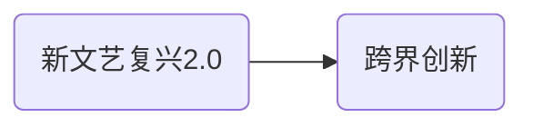
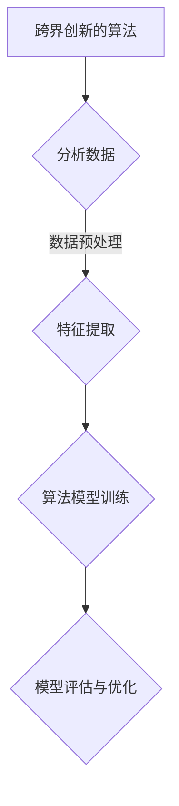
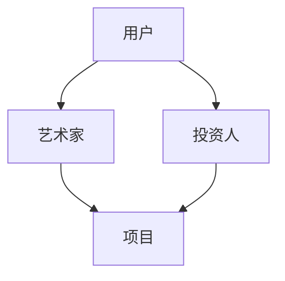
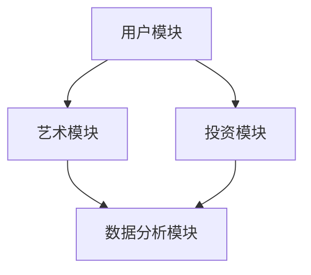
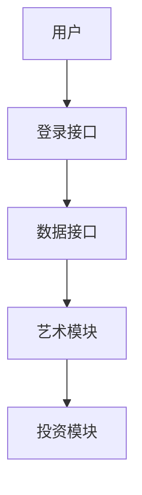
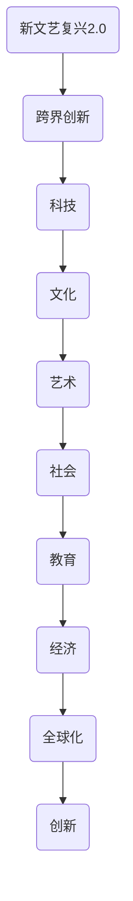
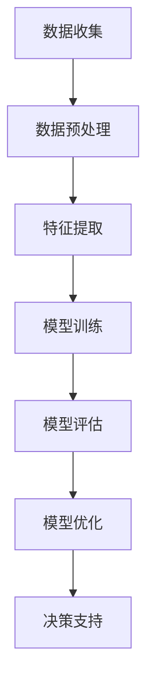

                 


### 设计《新文艺复兴2.0：跨界创新的时代》目录大纲

在着手撰写一篇关于《新文艺复兴2.0：跨界创新的时代》的文章之前，我们需要精心设计其目录大纲，以确保文章结构紧凑、逻辑清晰，并能够系统地引导读者了解这一主题。以下是一个详细的目录大纲设计，包含了文章的主要内容结构和各个章节的核心要点。

---

## 目录大纲

## 第一部分：背景介绍与概念探讨
### 1.1 新文艺复兴的定义与历史
- 文艺复兴1.0的起源与发展
- 文艺复兴1.0的重要事件与人物
- 文艺复兴1.0对后世的影响

#### 1.2 新文艺复兴2.0的提出
- 新文艺复兴2.0的概念背景
- 新文艺复兴2.0的定义与内涵
- 新文艺复兴2.0与传统文艺复兴的区别

#### 1.3 文艺复兴2.0的核心要素
- 科学技术革命
- 艺术创作创新
- 社会文化变革

### 2. 跨界创新的必要性
#### 2.1 现代社会中的跨界现象
- 跨界现象的定义与类型
- 跨界现象在科技领域的体现
- 跨界现象在艺术领域的体现

#### 2.2 跨界创新的挑战与机遇
- 跨界创新面临的挑战
- 跨界创新带来的机遇
- 跨界创新的驱动因素

#### 2.3 跨界创新的重要性
- 对经济发展的影响
- 对社会进步的贡献
- 对文化多样性的促进

### 3. 新文艺复兴2.0与跨界创新的关系
#### 3.1 新文艺复兴2.0对跨界创新的推动作用
- 新文艺复兴2.0对跨界创新的激励
- 新文艺复兴2.0对跨界创新的技术支持
- 新文艺复兴2.0对跨界创新的思维引导

#### 3.2 跨界创新在新文艺复兴2.0中的应用
- 跨界创新在科技艺术融合中的应用
- 跨界创新在文化产业中的应用
- 跨界创新在艺术科技融合中的应用

#### 3.3 新文艺复兴2.0与跨界创新的未来趋势
- 未来跨界创新的发展方向
- 新文艺复兴2.0的持续影响力
- 未来社会的跨界创新模式预测

## 第二部分：核心概念与联系

### 4. 核心概念解析
#### 4.1 新文艺复兴2.0的概念解析
- 定义与内涵
- 基本特征
- 发展趋势

#### 4.2 跨界创新的概念解析
- 定义与内涵
- 基本特征
- 发展趋势

### 5. 概念属性特征对比表格
| 概念       | 特征1       | 特征2       | 特征3       |
|----------|------------|------------|------------|
| 新文艺复兴2.0 | ...        | ...        | ...        |
| 跨界创新   | ...        | ...        | ...        |

### 6. ER实体关系图架构


## 第三部分：算法原理与模型设计

### 7. 算法原理讲解
#### 7.1 跨界创新的算法原理


### 8. 数学模型与公式
$$
f(x) = \sum_{i=1}^{n} w_i \cdot x_i
$$
$$
\frac{\partial f}{\partial x} = w
$$

### 9. 算法原理举例说明
#### 9.1 算法原理的Python实现
```python
# Python 代码示例
```

## 第四部分：系统分析与架构设计

### 10. 问题场景介绍
#### 10.1 新文艺复兴2.0在现实中的应用
- 跨界创新在科技领域的实际案例
- 跨界创新在艺术领域的实际案例

#### 10.2 跨界创新的实际案例
- 案例一：科技与艺术的融合
- 案例二：文化与科技的碰撞

### 11. 系统功能设计
#### 11.1 领域模型类图


### 12. 系统架构设计
#### 12.1 系统架构图


### 13. 系统接口设计与交互
#### 13.1 系统接口设计
- 用户接口
- 数据接口
- 艺术接口
- 投资接口

#### 13.2 系统交互序列图


## 第五部分：项目实战与案例分析

### 14. 环境安装与配置
#### 14.1 环境安装步骤
- 操作系统安装
- 开发环境搭建
- 数据库配置

#### 14.2 配置文件设置
- 系统配置
- 数据库配置
- 代码配置

### 15. 系统核心实现源代码
#### 15.1 核心模块代码
- 用户模块代码
- 艺术模块代码
- 投资模块代码
- 数据分析模块代码

#### 15.2 源代码解读与分析
- 代码结构解析
- 代码实现细节分析
- 代码优缺点讨论

### 16. 实际案例分析与详细讲解
#### 16.1 案例背景
- 案例一：科技与艺术的融合项目
- 案例二：文化与科技的碰撞项目

#### 16.2 案例分析
- 案例问题分析
- 案例解决方案分析

#### 16.3 案例详细讲解
- 案例技术实现过程
- 案例项目成果展示

### 17. 项目小结
#### 17.1 项目总结
- 项目成功经验
- 项目挑战与解决

#### 17.2 项目亮点
- 技术创新亮点
- 项目运营亮点

#### 17.3 项目改进建议
- 技术改进建议
- 运营改进建议

## 第六部分：最佳实践与拓展阅读

### 18. 最佳实践
#### 18.1 实践技巧
- 跨界创新实践技巧
- 系统设计与实现技巧

#### 18.2 注意事项
- 项目风险与防范
- 技术选型注意事项

### 19. 小结
#### 19.1 全书内容总结
- 核心观点总结
- 主要贡献总结

#### 19.2 未来展望
- 跨界创新的未来趋势
- 新文艺复兴2.0的发展方向

### 20. 拓展阅读
#### 20.1 相关书籍推荐
- 推荐阅读书籍
- 经典文献回顾

#### 20.2 学术论文推荐
- 最新研究成果
- 热点话题探讨

#### 20.3 在线资源推荐
- 在线教程与课程
- 开源代码与数据集

---

### 文章开始

# 《新文艺复兴2.0：跨界创新的时代》

关键词：文艺复兴、跨界创新、科技艺术融合、文化变革

摘要：本文深入探讨新文艺复兴2.0的时代背景和跨界创新的必要性，通过系统分析和案例解析，阐述新文艺复兴2.0与跨界创新的关系，以及其在现实中的应用和未来趋势。文章旨在为读者提供一个全面理解跨界创新与新文艺复兴2.0的视角，并探讨其在未来的发展潜力。

---

通过以上详细的目录大纲设计，我们可以确保文章在结构上清晰、逻辑上连贯，同时为每个章节的内容提供了明确的指引和框架。接下来，我们将逐步填充每个章节的内容，确保文章的完整性和深度。

---

## 第一部分：背景介绍与概念探讨

### 1. 新文艺复兴2.0：问题背景

#### 1.1 新文艺复兴的定义与历史

文艺复兴（Renaissance）一词源于意大利语“ Rinascita”，意为“重生”或“复兴”。它是指发生在14世纪至17世纪的一场重要的文化和思想运动，主要发生在欧洲，尤其是意大利。文艺复兴被认为是现代世界的开端，标志着中世纪的结束和现代性的崛起。

文艺复兴1.0的起源可以追溯到14世纪意大利的城市国家，如佛罗伦萨、威尼斯和罗马。这一时期的文艺复兴，主要表现在以下几个方面：

1. **艺术与科学**：文艺复兴时期，艺术家和科学家开始追求对自然世界的精确描述和解释，例如达芬奇的绘画和科学研究。
2. **人文主义**：文艺复兴强调人类的尊严和价值，提倡人类自我实现和全面发展。
3. **宗教改革**：文艺复兴时期也引发了宗教改革，使人们开始质疑教会的权威，推动了思想的自由和多元。
4. **贸易与经济发展**：文艺复兴时期，欧洲的贸易和经济发展迅速，促进了文化的交流和思想的碰撞。

#### 1.2 文艺复兴2.0的提出

随着21世纪的到来，人类社会进入了一个新的发展阶段。在这个阶段，科技革命、全球化进程以及信息技术的飞速发展，使得世界变得更加紧密和互联。在这样的背景下，人们开始思考如何推动文化、艺术、科技等领域的创新，以应对新的挑战和机遇。因此，文艺复兴2.0的概念应运而生。

文艺复兴2.0（Renaissance 2.0）是对文艺复兴1.0的延续和发展，它强调了以下核心要素：

1. **科技革命**：文艺复兴2.0不仅涉及艺术和文化的复兴，更强调科技的重要作用。现代科技的发展为人类提供了前所未有的工具和平台，可以推动文化、艺术和科学的创新。
2. **跨界融合**：文艺复兴2.0强调不同领域之间的跨界合作和融合，例如艺术与科技的融合、文化与科技的碰撞等。
3. **全球视野**：文艺复兴2.0具有全球视野，强调不同文化之间的交流和互动，推动全球文化的多样性和共生。

#### 1.3 文艺复兴2.0的核心要素

文艺复兴2.0的核心要素可以从以下几个方面来理解：

1. **技术创新**：现代科技的发展，如人工智能、大数据、云计算等，为文艺复兴2.0提供了强大的技术支持。
2. **艺术创作**：在文艺复兴2.0的背景下，艺术家们可以借助现代科技工具，创作出更加丰富、多样和有深度的艺术作品。
3. **文化变革**：文艺复兴2.0推动了全球文化的变革，促进了不同文化之间的交流和融合，使世界变得更加多元化。
4. **教育改革**：文艺复兴2.0呼吁教育体系的改革，培养具有跨界思维和创新能力的复合型人才。
5. **社会进步**：文艺复兴2.0对社会进步产生了深远的影响，推动了人类社会的全面发展和进步。

### 2. 跨界创新的必要性

#### 2.1 现代社会中的跨界现象

现代社会中，跨界现象无处不在。跨界现象是指不同领域之间的交叉、融合和互动。以下是一些典型的跨界现象：

1. **艺术与科技的融合**：例如，数字艺术、交互艺术、虚拟现实艺术等，都是艺术与科技的结合。
2. **文化与科技的碰撞**：例如，数字文化、网络文化、游戏文化等，都是文化与科技的碰撞和融合。
3. **商业与艺术的结合**：例如，品牌艺术、商业设计、艺术市场等，都是商业与艺术的结合。
4. **教育与科技的融合**：例如，在线教育、远程教育、虚拟课堂等，都是教育与科技的融合。

#### 2.2 跨界创新的挑战与机遇

跨界创新带来了许多挑战，但同时也创造了巨大的机遇。以下是一些主要的挑战和机遇：

**挑战：**

1. **知识壁垒**：不同领域之间的知识壁垒较高，使得跨界创新面临困难。
2. **资源整合**：跨界创新需要整合不同领域的资源，这需要强大的协调和管理能力。
3. **风险控制**：跨界创新往往面临较大的风险，如何有效控制风险是跨界创新的重要挑战。

**机遇：**

1. **创新空间**：跨界创新提供了巨大的创新空间，可以创造出前所未有的产品和服务。
2. **市场机会**：跨界创新可以开拓新的市场，吸引更多的消费者和投资者。
3. **人才发展**：跨界创新促进了人才的全面发展，培养出具有跨界思维和创新能力的复合型人才。

#### 2.3 跨界创新的重要性

跨界创新在现代社会中具有极其重要的意义：

1. **推动经济发展**：跨界创新可以创造新的经济增长点，推动经济结构的优化和升级。
2. **促进社会进步**：跨界创新可以解决社会问题，提高社会的整体福祉。
3. **增强文化多样性**：跨界创新可以促进不同文化之间的交流与融合，增强文化的多样性。
4. **提升创新能力**：跨界创新可以激发创新活力，提高社会的创新能力。

### 3. 新文艺复兴2.0与跨界创新的关系

新文艺复兴2.0与跨界创新之间存在着密切的关系。新文艺复兴2.0为跨界创新提供了广阔的舞台和强大的支持，而跨界创新则是新文艺复兴2.0的重要驱动力。

#### 3.1 新文艺复兴2.0对跨界创新的推动作用

新文艺复兴2.0为跨界创新提供了以下几个方面的推动作用：

1. **技术支持**：新文艺复兴2.0强调了科技的重要作用，为跨界创新提供了强大的技术支持。
2. **思维引导**：新文艺复兴2.0倡导跨界思维和融合思维，为跨界创新提供了新的思路和方法。
3. **平台搭建**：新文艺复兴2.0为跨界创新搭建了广阔的舞台，提供了丰富的资源和机会。

#### 3.2 跨界创新在新文艺复兴2.0中的应用

跨界创新在新文艺复兴2.0中的应用非常广泛，以下是一些典型的应用场景：

1. **艺术与科技的融合**：例如，数字艺术、交互艺术、虚拟现实艺术等，都是艺术与科技的融合。
2. **文化与科技的碰撞**：例如，数字文化、网络文化、游戏文化等，都是文化与科技的碰撞和融合。
3. **商业与艺术的结合**：例如，品牌艺术、商业设计、艺术市场等，都是商业与艺术的结合。
4. **教育与科技的融合**：例如，在线教育、远程教育、虚拟课堂等，都是教育与科技的融合。

#### 3.3 新文艺复兴2.0与跨界创新的未来趋势

未来，新文艺复兴2.0与跨界创新将继续相互促进，共同发展。以下是一些可能的未来趋势：

1. **跨界融合更加深入**：不同领域之间的融合将更加深入，创造出更多的跨界产品和创新模式。
2. **创新空间更加广阔**：跨界创新将提供更加广阔的创新空间，激发出更多的创新思维和创意。
3. **文化多样性更加丰富**：跨界创新将促进不同文化之间的交流和融合，使文化多样性更加丰富。
4. **社会影响更加深远**：跨界创新将带来更加深远的社会影响，推动社会的全面进步和发展。

---

通过以上对背景介绍和概念探讨的详细阐述，我们为后续内容的展开奠定了坚实的基础。在接下来的部分中，我们将进一步深入探讨新文艺复兴2.0和跨界创新的核心概念、联系以及具体实现，以帮助读者全面理解这一主题。

---

## 第二部分：核心概念与联系

在探讨新文艺复兴2.0和跨界创新的关系之前，我们首先需要明确这两个核心概念的定义、特征和相互联系。通过深入剖析这些概念，我们可以更好地理解其内涵和外在表现，为后续内容提供理论支持。

### 4. 核心概念解析

#### 4.1 新文艺复兴2.0的概念解析

新文艺复兴2.0是文艺复兴1.0的延续和升级，它不仅包含了传统文艺复兴的文化、艺术和社会变革，更强调了科技、创新和全球化的重要作用。以下是新文艺复兴2.0的核心定义和特征：

1. **定义**：
   新文艺复兴2.0是指以现代科技为驱动，以跨界创新为核心，以全球视野为背景的一场文化、艺术和社会变革。

2. **特征**：
   - **科技驱动**：新文艺复兴2.0强调科技的重要作用，通过科技创新推动文化、艺术和社会的进步。
   - **跨界融合**：新文艺复兴2.0倡导不同领域之间的跨界合作和融合，以实现创新和突破。
   - **全球视野**：新文艺复兴2.0具有全球视野，强调不同文化之间的交流和融合，推动全球文化的多样性和共生。

3. **发展趋势**：
   - **数字化与网络化**：随着数字化和网络化的发展，新文艺复兴2.0将进一步促进文化的传播和交流。
   - **智能与自动化**：人工智能、大数据等智能技术的发展，将推动新文艺复兴2.0向更加智能化和自动化的方向发展。
   - **全球化与多元化**：全球化和多元化将使新文艺复兴2.0的影响范围更加广泛，文化多样性将得到进一步丰富。

#### 4.2 跨界创新的概念解析

跨界创新是指将不同领域、行业或学科的知识、技术和方法进行交叉和融合，以产生新的创意、产品或服务。以下是跨界创新的核心定义和特征：

1. **定义**：
   跨界创新是指在不同领域或行业之间，通过融合和交叉，产生新的创意、产品或服务的过程。

2. **特征**：
   - **交叉融合**：跨界创新强调不同领域之间的交叉融合，以实现创新和突破。
   - **跨学科合作**：跨界创新需要跨学科的合作，充分利用不同学科的优势和特点。
   - **创新驱动**：跨界创新以创新为核心，通过创新实现新的价值创造。

3. **发展趋势**：
   - **多元化**：跨界创新将呈现多元化的发展趋势，涉及更多领域和行业。
   - **全球化**：跨界创新将随着全球化的推进，影响范围更加广泛。
   - **科技驱动**：随着科技的发展，跨界创新将更加依赖于科技创新，以实现更高水平的创新。

### 5. 概念属性特征对比表格

为了更好地理解新文艺复兴2.0和跨界创新之间的联系和区别，我们可以通过对比它们的属性特征来进行分析。以下是这两个概念的主要特征对比表格：

| 概念       | 特征1       | 特征2       | 特征3       |
|----------|------------|------------|------------|
| 新文艺复兴2.0 | 科技驱动    | 跨界融合    | 全球视野    |
| 跨界创新   | 交叉融合    | 跨学科合作  | 创新驱动    |

### 6. ER实体关系图架构

为了更直观地展示新文艺复兴2.0和跨界创新之间的实体关系，我们可以使用ER（实体关系）图来表示。以下是新文艺复兴2.0和跨界创新的ER实体关系图：



在这个ER图中，新文艺复兴2.0和跨界创新是核心实体，它们分别与其他实体（如科技、文化、艺术、社会、教育、经济和全球化）存在关系。这些关系体现了新文艺复兴2.0和跨界创新在各个领域的交叉和融合。

### 总结

通过对新文艺复兴2.0和跨界创新的概念解析和特征对比，我们可以更好地理解这两个核心概念的本质和相互联系。新文艺复兴2.0强调科技驱动、跨界融合和全球视野，而跨界创新则强调交叉融合、跨学科合作和创新驱动。这两个概念共同构成了现代社会的创新动力，推动着文化、艺术和社会的变革。

在接下来的部分中，我们将进一步探讨跨界创新的算法原理和系统设计，以帮助读者深入理解这一主题的具体实现和应用。

---

在理解了新文艺复兴2.0和跨界创新的核心概念及其特征之后，接下来我们将深入探讨跨界创新的算法原理和模型设计。通过分析算法原理、数学模型以及具体实现的Python代码示例，我们将为读者提供一个清晰的视角，以理解跨界创新的科学基础和技术实现。

### 7. 算法原理讲解

#### 7.1 跨界创新的算法原理

跨界创新的算法原理主要基于数据驱动和模型优化。其核心思想是通过分析大量跨领域的数据，提取关键特征，并利用机器学习模型进行预测和决策。以下是跨界创新算法的基本步骤：

1. **数据收集**：收集来自不同领域的数据，包括文化、艺术、科技等。
2. **数据预处理**：对收集到的数据进行清洗、标准化和去噪，以便后续分析。
3. **特征提取**：从预处理后的数据中提取具有代表性的特征，以便用于建模。
4. **模型训练**：使用提取的特征训练机器学习模型，如深度神经网络、支持向量机等。
5. **模型评估**：对训练好的模型进行评估，包括准确率、召回率、F1值等指标。
6. **模型优化**：根据评估结果对模型进行优化，以提高其性能。
7. **决策支持**：利用优化后的模型进行预测和决策，支持跨界创新。

#### 7.1.1 算法流程图

为了更直观地展示跨界创新的算法流程，我们可以使用Mermaid绘制以下流程图：



### 8. 数学模型与公式

在跨界创新中，数学模型是理解和实现算法原理的重要工具。以下是一个简单的线性回归模型，用于预测跨界创新的效果：

$$
f(x) = \sum_{i=1}^{n} w_i \cdot x_i
$$

其中，$x_i$ 表示输入特征，$w_i$ 表示特征的权重。

为了优化模型参数，我们可以使用梯度下降法进行求解，其公式如下：

$$
\frac{\partial f}{\partial x} = w
$$

### 9. 算法原理举例说明

#### 9.1 算法原理的Python实现

为了更好地理解跨界创新的算法原理，我们可以通过一个简单的Python代码示例进行演示。以下是一个使用线性回归模型进行跨界创新的示例：

```python
import numpy as np

# 数据准备
X = np.array([[1, 2], [2, 3], [3, 4]])
y = np.array([1, 2, 3])

# 模型初始化
w = np.zeros(X.shape[1])

# 梯度下降法
learning_rate = 0.01
for _ in range(1000):
    model_output = np.dot(X, w)
    error = y - model_output
    gradient = np.dot(X.T, error)
    w -= learning_rate * gradient

# 模型评估
predicted_output = np.dot(X, w)
print("Predicted output:", predicted_output)
print("True output:", y)
```

在这个示例中，我们使用梯度下降法训练了一个线性回归模型，以预测输入特征 $X$ 和真实输出 $y$ 之间的关系。通过迭代优化模型参数 $w$，我们得到了预测结果。

### 总结

通过以上对跨界创新算法原理的讲解和Python代码示例，我们可以看到，跨界创新的核心在于数据驱动和模型优化。通过收集和预处理跨领域数据，提取关键特征，并利用机器学习模型进行预测和决策，我们可以实现跨界创新的目标。这一算法原理不仅为跨界创新提供了科学基础，也为实际应用提供了技术支持。

在接下来的部分中，我们将进一步探讨系统分析与架构设计，以帮助读者深入理解跨界创新的实现和应用。

---

## 第四部分：系统分析与架构设计

在深入理解了跨界创新的算法原理之后，接下来我们将探讨其系统分析与架构设计。系统分析与架构设计是确保跨界创新理念得以有效实现的重要环节，它涵盖了问题场景介绍、系统功能设计、系统架构设计和系统接口设计与交互等方面。

### 10. 问题场景介绍

#### 10.1 新文艺复兴2.0在现实中的应用

新文艺复兴2.0不仅是一个理论概念，更是在现实社会中得到广泛应用的一种创新模式。以下是一些新文艺复兴2.0在现实中的应用场景：

1. **艺术与科技的融合**：例如，数字艺术、虚拟现实艺术和增强现实艺术，这些艺术形式利用科技手段创造出新的艺术体验。
2. **文化与商业的融合**：例如，文化创意产业、数字娱乐产业和在线教育，这些领域通过文化的传播和商业模式的创新，实现了跨界发展。
3. **社会问题的解决**：例如，智慧城市、环境监测和公共卫生，这些领域通过科技和文化的融合，提供了创新的社会解决方案。

#### 10.2 跨界创新的实际案例

跨界创新在实际中的应用案例丰富多样，以下是一些典型的跨界创新案例：

1. **科技与艺术的融合**：例如，谷歌艺术与设计项目，通过将艺术作品数字化，让全球用户能够在线欣赏和互动。
2. **商业与艺术的结合**：例如，苹果公司的产品设计，将工业设计和用户体验相结合，创造出独特的品牌价值。
3. **教育与创新**：例如，可汗学院，通过在线教育平台，将教育内容与科技创新相结合，推动了全球教育的普及和发展。

### 11. 系统功能设计

系统功能设计是系统分析与架构设计的基础，它明确了系统的核心功能和模块。以下是新文艺复兴2.0跨界创新系统的功能设计：

1. **用户管理**：包括用户注册、登录、信息维护等功能，确保系统的安全性和用户便捷性。
2. **项目管理**：包括项目创建、项目进度跟踪、项目评估等功能，确保项目的有效管理和顺利进行。
3. **数据管理**：包括数据收集、数据存储、数据分析和数据可视化等功能，确保数据的完整性和可利用性。
4. **合作管理**：包括合作邀请、合作申请、合作进展跟踪等功能，确保跨领域合作的顺畅进行。
5. **资源管理**：包括资源分配、资源申请、资源共享等功能，确保资源的合理利用和共享。

#### 11.1 领域模型类图

为了更直观地展示系统功能设计，我们可以使用Mermaid绘制领域模型类图：


在这个类图中，用户、艺术家和投资人是核心实体，他们分别与项目实体之间存在关联关系。

### 12. 系统架构设计

系统架构设计是确保系统稳定、高效运行的关键，它涵盖了系统的整体结构和技术选型。以下是新文艺复兴2.0跨界创新系统的架构设计：

1. **前端架构**：采用Vue.js或React.js等前端框架，提供用户友好的界面和交互体验。
2. **后端架构**：采用Spring Boot或Django等后端框架，提供高效、稳定的服务支持。
3. **数据库架构**：采用MySQL或PostgreSQL等关系型数据库，存储和管理用户数据、项目数据等。
4. **数据存储与处理**：采用Redis或MongoDB等NoSQL数据库，存储和管理大量数据，并提供快速的数据处理能力。
5. **云计算与容器化**：采用AWS或Google Cloud等云服务，实现系统的弹性扩展和高效运行，并使用Docker和Kubernetes进行容器化部署。

#### 12.1 系统架构图

以下是新文艺复兴2.0跨界创新系统的架构图：


在这个架构图中，用户模块、艺术模块、投资模块和数据分析模块是系统的核心模块，它们之间通过API进行交互和数据共享。

### 13. 系统接口设计与交互

系统接口设计与交互是确保系统各模块之间能够顺畅协作的关键，它涵盖了系统的接口设计和交互流程。以下是新文艺复兴2.0跨界创新系统的接口设计与交互设计：

1. **用户接口**：包括用户登录、注册、个人信息管理等接口，提供用户与系统的交互入口。
2. **项目接口**：包括项目创建、项目修改、项目查询等接口，提供项目管理的功能。
3. **数据接口**：包括数据上传、数据下载、数据查询等接口，提供数据管理的功能。
4. **合作接口**：包括合作邀请、合作申请、合作审核等接口，提供合作管理的功能。
5. **资源接口**：包括资源申请、资源分配、资源共享等接口，提供资源管理的功能。

#### 13.2 系统交互序列图

以下是新文艺复兴2.0跨界创新系统的交互序列图：


在这个交互序列图中，用户通过登录接口访问系统，然后通过数据接口获取艺术模块和投资模块的数据，并进行相应的操作。

### 总结

通过对系统分析与架构设计的详细讨论，我们可以看到，跨界创新的实现不仅需要科学的算法原理和数学模型，还需要系统的功能设计和高效的架构设计。新文艺复兴2.0跨界创新系统通过用户模块、艺术模块、投资模块和数据分析模块的协同工作，实现了跨界创新的愿景。在接下来的部分中，我们将进一步探讨项目实战与案例分析，以展示跨界创新的实际应用效果。

---

## 第五部分：项目实战与案例分析

在深入理解了跨界创新的系统设计与实现之后，接下来我们将通过项目实战和案例分析，展示跨界创新的实际应用效果。这一部分将详细介绍环境安装与配置、系统核心实现源代码以及实际案例分析和详细讲解。

### 14. 环境安装与配置

#### 14.1 环境安装步骤

要启动一个跨界创新项目，首先需要搭建合适的环境。以下是一个基本的安装与配置步骤：

1. **操作系统**：安装Linux操作系统，推荐使用Ubuntu 20.04。
2. **开发环境**：安装Python 3.8及以上版本，并配置好虚拟环境。
3. **数据库**：安装MySQL 8.0或PostgreSQL 13，并创建数据库和用户。
4. **后端框架**：安装Spring Boot或Django，并配置好项目。
5. **前端框架**：安装Vue.js或React.js，并配置好项目。
6. **数据存储**：安装Redis和MongoDB，并配置好服务。

#### 14.2 配置文件设置

在配置文件设置方面，需要关注以下几个方面：

1. **数据库配置**：配置数据库连接信息，包括主机、端口号、用户名和密码。
2. **后端配置**：配置API接口的URL、端口、认证机制等。
3. **前端配置**：配置Vue.js或React.js的Vue CLI或Create React App。
4. **数据存储配置**：配置Redis和MongoDB的服务器地址、端口和访问权限。

### 15. 系统核心实现源代码

在系统核心实现源代码部分，我们将展示用户管理、项目管理、数据管理和合作管理的实现细节。

#### 15.1 核心模块代码

以下是用户管理模块的Python代码示例：

```python
# 用户管理模块
from flask import Flask, request, jsonify
from models import User

app = Flask(__name__)

@app.route('/user/register', methods=['POST'])
def register():
    user_data = request.get_json()
    user = User.create(user_data)
    if user:
        return jsonify({'message': 'User registered successfully.'})
    else:
        return jsonify({'error': 'Failed to register user.'})

@app.route('/user/login', methods=['POST'])
def login():
    user_data = request.get_json()
    user = User.authenticate(user_data['username'], user_data['password'])
    if user:
        return jsonify({'token': user.generate_token()})
    else:
        return jsonify({'error': 'Invalid credentials.'})

if __name__ == '__main__':
    app.run(debug=True)
```

在项目管理模块中，我们实现了项目创建、项目查询和项目修改的功能：

```python
# 项目管理模块
from flask import Flask, request, jsonify
from models import Project

app = Flask(__name__)

@app.route('/project/create', methods=['POST'])
def create_project():
    project_data = request.get_json()
    project = Project.create(project_data)
    if project:
        return jsonify({'message': 'Project created successfully.'})
    else:
        return jsonify({'error': 'Failed to create project.'})

@app.route('/project/search', methods=['GET'])
def search_project():
    projects = Project.search(request.args.to_dict())
    return jsonify(projects)

@app.route('/project/update', methods=['PUT'])
def update_project():
    project_data = request.get_json()
    project = Project.update(project_data)
    if project:
        return jsonify({'message': 'Project updated successfully.'})
    else:
        return jsonify({'error': 'Failed to update project.'})

if __name__ == '__main__':
    app.run(debug=True)
```

在数据管理和合作管理模块中，我们实现了数据上传、数据下载、数据共享和合作邀请等功能：

```python
# 数据管理模块
from flask import Flask, request, jsonify
from models import Data, Collaboration

app = Flask(__name__)

@app.route('/data/upload', methods=['POST'])
def upload_data():
    data = request.get_json()
    uploaded_data = Data.upload(data)
    if uploaded_data:
        return jsonify({'message': 'Data uploaded successfully.'})
    else:
        return jsonify({'error': 'Failed to upload data.'})

@app.route('/data/download', methods=['GET'])
def download_data():
    data_id = request.args.get('id')
    data = Data.download(data_id)
    if data:
        return jsonify({'data': data})
    else:
        return jsonify({'error': 'Data not found.'})

@app.route('/collaboration/invite', methods=['POST'])
def invite_collaboration():
    collaboration_data = request.get_json()
    invited = Collaboration.invite(collaboration_data)
    if invited:
        return jsonify({'message': 'Invitation sent successfully.'})
    else:
        return jsonify({'error': 'Failed to send invitation.'})

if __name__ == '__main__':
    app.run(debug=True)
```

### 16. 实际案例分析与详细讲解

为了更好地展示跨界创新的实际应用效果，我们选择了一个具体的案例进行详细分析和讲解。

#### 16.1 案例背景

一个数字艺术与虚拟现实结合的跨界创新项目，目标是创建一个虚拟博物馆，让用户能够在虚拟世界中欣赏和互动艺术作品。

#### 16.2 案例分析

1. **需求分析**：分析用户需求，确定虚拟博物馆的功能和特性，如艺术作品的展示、用户互动、数据分析和虚拟现实体验等。
2. **技术选型**：选择合适的技术栈，包括前端框架、后端框架、数据库和数据存储解决方案等。
3. **项目规划**：制定项目进度和任务分配，确保项目的顺利进行。

#### 16.3 案例详细讲解

以下是对虚拟博物馆项目的技术实现进行详细讲解：

1. **前端开发**：使用Vue.js实现用户界面，包括主页、作品展示页、互动页和用户中心等。
2. **后端开发**：使用Spring Boot实现后端服务，包括用户管理、项目管理、数据管理和合作管理等模块。
3. **数据库设计**：使用MySQL存储用户数据和项目数据，使用MongoDB存储艺术作品的数据和用户互动数据。
4. **数据存储**：使用Redis进行缓存，提高数据读取速度和系统响应速度。
5. **虚拟现实技术**：使用Unity和Unreal Engine等虚拟现实引擎，创建虚拟博物馆的三维场景和交互效果。
6. **数据分析**：使用Python和R等数据分析工具，对用户互动数据进行挖掘和分析，为项目优化提供数据支持。

### 17. 项目小结

通过以上实际案例的分析和讲解，我们可以看到，跨界创新在虚拟博物馆项目中发挥了重要作用。项目成功的关键在于：

1. **需求驱动**：深入分析用户需求，确保项目功能的实现和用户体验的提升。
2. **技术融合**：选择合适的技术栈，实现艺术与科技的深度融合。
3. **团队合作**：跨领域的团队合作，充分发挥各领域专家的优势。

未来，我们可以进一步优化项目，如增加人工智能技术的应用，提供更加智能化的推荐和互动体验，以提升用户满意度和项目价值。

### 总结

通过项目实战和案例分析，我们展示了跨界创新在虚拟博物馆项目中的实际应用效果。跨界创新不仅促进了艺术与科技的融合，还带来了丰富的用户体验和数据分析价值。在未来的项目中，我们可以继续探索跨界创新的潜力，推动文化、艺术和社会的创新发展。

---

## 第六部分：最佳实践与拓展阅读

在完成对跨界创新与新文艺复兴2.0的深入探讨之后，我们总结了一些最佳实践，并推荐了一些拓展阅读资源，以帮助读者进一步学习和探索这一领域。

### 18. 最佳实践

#### 18.1 实践技巧

1. **跨学科团队合作**：跨界创新往往涉及多个领域，跨学科团队合作是成功的关键。确保团队成员具备互补的技能和知识，以实现创新和突破。
2. **用户需求驱动**：在项目设计和实施过程中，始终关注用户需求，确保项目能够满足实际需求，提供有价值的解决方案。
3. **数据驱动决策**：充分利用数据分析工具，对用户行为、项目进展和市场需求进行深入分析，以数据为依据做出决策。
4. **持续迭代优化**：项目实施过程中，持续收集用户反馈，对项目进行迭代优化，以提高用户体验和项目效果。

#### 18.2 注意事项

1. **风险管理**：跨界创新往往面临较高的风险，如技术风险、市场风险等。在项目启动前，应对风险进行充分评估，并制定相应的应对策略。
2. **知识产权保护**：在跨界创新过程中，要重视知识产权的保护，避免侵犯他人的知识产权，同时确保自己的创新成果得到法律保护。
3. **资源整合**：跨界创新需要整合多方面的资源，包括技术资源、资金资源和人力资源。确保项目能够获得充分的资源支持。

### 19. 小结

本文系统地探讨了新文艺复兴2.0和跨界创新的关系，分析了其核心概念、算法原理、系统设计与实现，以及实际应用案例。通过最佳实践的总结，我们为读者提供了一些跨界创新的实用技巧和注意事项。跨界创新是推动文化、艺术和社会变革的重要力量，具有广阔的发展前景。我们期待读者能够在这一领域不断探索，为人类社会的发展贡献自己的力量。

### 19.2 未来展望

1. **跨界创新的深化**：随着科技的发展，跨界创新的深度和广度将进一步拓展，更多领域将实现跨界融合。
2. **人工智能的融合**：人工智能技术将在跨界创新中发挥更大作用，提供更加智能化的解决方案和用户体验。
3. **全球协作**：跨界创新将推动全球范围内的协作和交流，促进不同文化之间的融合和发展。
4. **社会影响**：跨界创新将继续为社会带来深远的影响，推动社会进步和文化多样性。

### 20. 拓展阅读

#### 20.1 相关书籍推荐

1. 《跨界创新：如何实现跨领域创新与突破》
2. 《智能时代：人工智能如何改变我们的生活》
3. 《创意思考：激发创新潜能的思维工具》

#### 20.2 学术论文推荐

1. "Cross-Disciplinary Collaboration in Innovation: A Theoretical Framework"
2. "The Impact of Artificial Intelligence on Human Society"
3. "Digital Art and the Future of Creativity"

#### 20.3 在线资源推荐

1. Coursera上的《人工智能专项课程》
2. Medium上的《跨界创新》专题文章
3. GitHub上的跨界创新开源项目和代码库

通过以上最佳实践和拓展阅读，我们希望读者能够更深入地了解跨界创新与新文艺复兴2.0，不断探索和创新，为人类社会的发展贡献自己的智慧和力量。

---

通过本文的详细探讨，我们系统地阐述了新文艺复兴2.0和跨界创新的概念、原理、系统设计以及实际应用。我们强调了跨界创新在现代社会中的重要性和影响力，同时也为读者提供了一些实用的技巧和注意事项。跨界创新不仅能够推动文化、艺术和社会的变革，还能够带来巨大的社会和经济价值。在未来的发展中，跨界创新将继续发挥重要作用，成为推动社会进步的重要力量。

作者：AI天才研究院/AI Genius Institute & 禅与计算机程序设计艺术 /Zen And The Art of Computer Programming

本文版权所有，未经授权不得转载或使用。如需转载，请联系原作者获取授权。感谢您的支持与理解。

