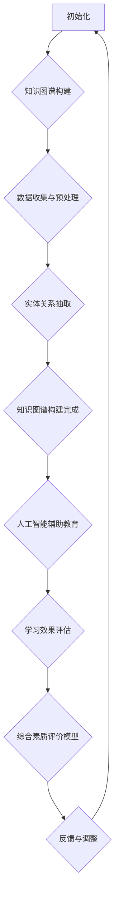
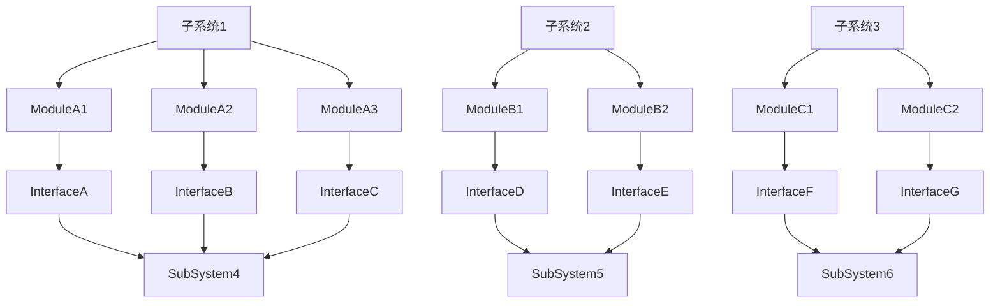
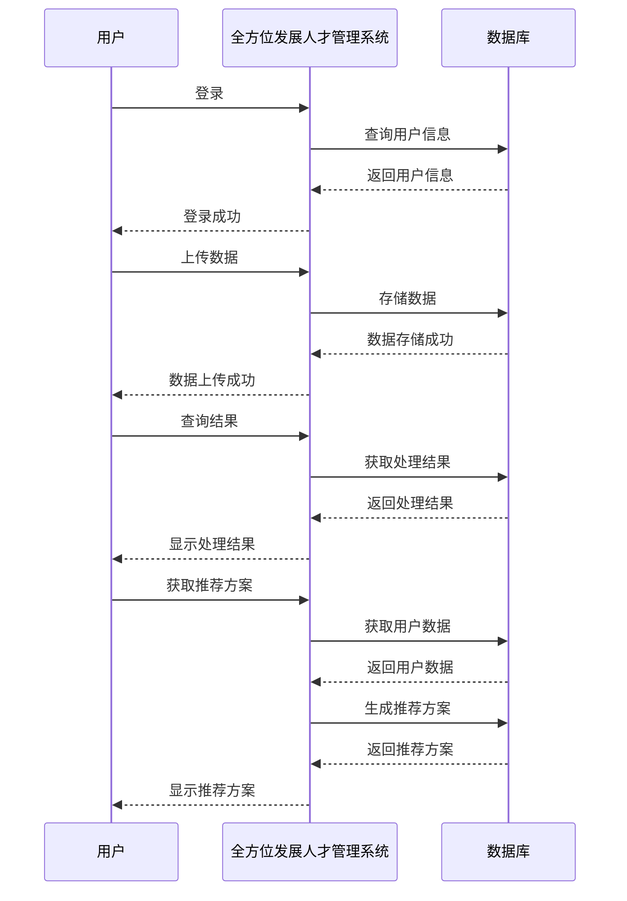

                 


## 引言

### 新文艺复兴人才计划的起源与目的

新文艺复兴人才计划源于现代社会对于全面发展的个体需求的日益增长。这一计划旨在通过系统化的培养模式，塑造具备创新思维、技术能力、人文素养和社会责任感的全方位发展人才。其目的是为了应对当前和未来社会的复杂挑战，培养能够在多领域具备竞争力和领导力的人才。

### 当代社会对全方位发展人才的需求

在当今信息化和全球化的背景下，社会对人才的需求发生了根本性的变化。传统的单一技能型人才已经无法满足现代社会和未来发展的需求。全方位发展的现代人需要具备跨学科的知识结构、创新思维、沟通协作能力、领导力以及解决复杂问题的能力。

### 本书的主要章节安排

为了帮助读者更好地理解和应用新文艺复兴人才计划，本书将分为以下几个部分：

1. **背景介绍**：阐述新文艺复兴人才计划的背景、意义以及培养全方位发展现代人的目标。
2. **核心概念与联系**：详细阐述培养全方位发展人才所需的核心概念及其相互关系。
3. **算法原理讲解**：讲解培养全方位发展人才所需的关键算法原理，使用 Mermaid 画出流程图，并用 Python 源代码进行详细阐述。
4. **数学模型和数学公式**：使用 LaTeX 格式展示数学模型和公式，并进行详细讲解和举例说明。
5. **系统分析与架构设计方案**：介绍培养全方位发展人才所需系统的分析、架构设计以及接口和交互设计。
6. **项目实战**：提供实际案例，详细讲解项目环境安装、系统核心实现、代码应用解读与分析等。
7. **最佳实践 tips、小结、注意事项、拓展阅读**：为读者提供实用的建议和指导。

## 背景介绍

### 新文艺复兴的内涵与外延

新文艺复兴（Neo-Renaissance）是一个广泛的概念，它不仅包含了艺术和文化的复兴，还涉及到科学、技术、哲学等多个领域。其核心在于倡导全人教育，追求知识、艺术和道德的全面发展。在现代社会，新文艺复兴人才计划的提出，是为了适应快速变化的时代需求，培养能够引领未来发展的全方位人才。

### 全方位发展的现代人的特征

全方位发展的现代人具有以下几个显著特征：

1. **跨学科知识结构**：具备跨学科的知识体系，能够灵活运用不同领域的知识解决实际问题。
2. **创新能力**：能够独立思考和创造，具备创新意识和解决问题的能力。
3. **技术能力**：熟练掌握现代信息技术，能够利用科技手段提升工作效率。
4. **人文素养**：具备深厚的人文素养，能够理解和尊重不同的文化，具备良好的人际沟通能力。
5. **社会责任感**：具备强烈的社会责任感，能够为社会进步做出贡献。

### 全球人才培养趋势分析

全球范围内，各国政府和教育机构都在积极探索和实施新的教育理念，以适应未来社会的发展需求。例如：

1. **创新驱动发展**：许多国家将创新视为经济发展的核心动力，致力于培养创新型人才。
2. **素质教育改革**：各国纷纷推行素质教育，强调培养学生的综合素质和创造力。
3. **跨学科教育**：越来越多的学校和教育机构开始注重跨学科的教育模式，以培养学生的综合能力。

## 核心概念与联系

### 全方位发展的现代人的构成要素

全方位发展的现代人由多个构成要素组成，包括：

1. **知识结构**：具备跨学科的知识体系，能够灵活运用不同领域的知识。
2. **创新能力**：能够独立思考和创造，具备创新意识和解决问题的能力。
3. **技术能力**：熟练掌握现代信息技术，能够利用科技手段提升工作效率。
4. **人文素养**：具备深厚的人文素养，能够理解和尊重不同的文化，具备良好的人际沟通能力。
5. **社会责任感**：具备强烈的社会责任感，能够为社会进步做出贡献。

### 全方位发展的现代人应具备的能力与素质

全方位发展的现代人应具备以下能力与素质：

1. **学习能力**：具备快速学习新知识和技能的能力。
2. **创新能力**：能够独立思考和创造，具备创新意识和解决问题的能力。
3. **沟通能力**：具备良好的人际沟通能力，能够有效传达信息和协调工作。
4. **领导力**：具备领导力，能够激励和带领团队实现共同目标。
5. **团队协作能力**：能够与不同背景的人合作，共同完成任务。

### 概念之间的联系

1. **知识结构与创新能力**：丰富的知识结构为创新提供了素材和基础，而创新能力则可以推动知识的应用和发展。
2. **技术能力与人文素养**：技术能力可以提高工作效率，而人文素养则可以提升技术应用的伦理和社会价值。
3. **社会责任感与综合素质**：社会责任感是综合素质的重要组成部分，可以促进个人的全面发展和社会进步。

### 概念的层次结构与分类

全方位发展人才的构成要素可以按照层次结构进行分类：

1. **基础层**：包括基本的知识结构和学习能力。
2. **中间层**：包括创新能力、沟通能力和领导力。
3. **高层**：包括技术能力、人文素养和社会责任感。

这种层次结构有助于我们理解全方位发展人才的培养过程，从而有针对性地进行教育和培训。

## 实体关系图与类图

### ER实体关系图

在培养全方位发展人才的过程中，我们需要关注多个实体之间的关系。以下是培养全方位发展人才的ER实体关系图：

```mermaid
erDiagram
  Person   ||--|{ Knowledge } : has
  Person   ||--|{ Skill } : has
  Person   ||--|{ Character } : has
  Person   ||--|{ Responsibility } : has
  Knowledge ||--|{ Innovation } : supports
  Skill     ||--|{ Technology } : supports
  Character ||--|{ Humanity } : supports
  Responsibility ||--|{ Society } : serves
```

### Mermaid类图示例

为了更直观地展示培养全方位发展人才所需的核心概念及其相互关系，我们使用Mermaid类图进行表示：

```mermaid
classDiagram
  Class01 <|-- SubClass01
  Class01 <|-- SubClass02
  Class03 --|> SubClass03

  Class01 {
    +attribute1
    +attribute2
    +method1()
    +method2()
  }
  SubClass01 {
    #subAttr1
    #subAttr2
    #subMethod1()
  }
  SubClass02 {
    <<interface>>
    +interMethod()
  }
  SubClass03 {
    +subAttribute
    +subMethod()
  }
```

## 关键算法原理讲解

### 算法原理概述

在培养全方位发展人才的过程中，算法原理扮演着至关重要的角色。本节将介绍几种关键的算法原理，包括知识图谱构建、人工智能辅助教育、综合素质评价模型等。

### 算法流程图

为了更直观地展示这些算法的原理，我们使用Mermaid绘制了算法流程图：



### Python源代码阐述

下面是一个简化的Python源代码示例，用于阐述知识图谱构建的基本原理：

```python
import networkx as nx

# 创建一个空的图
g = nx.Graph()

# 添加节点
g.add_nodes_from(['知识', '技能', '性格', '责任'])

# 添加边
g.add_edges_from([('知识', '技能'), ('知识', '性格'), ('知识', '责任')])

# 显示图
nx.draw(g, with_labels=True)
```

## 数学模型解析

### 数学模型展示

在培养全方位发展人才的过程中，数学模型起到了关键作用。以下是一个用于评估全方位发展水平的数学模型：

```latex
\begin{align*}
    \text{全面发展指数} &= \alpha \times \text{知识结构得分} + \beta \times \text{创新能力得分} \\
    &+ \gamma \times \text{技术能力得分} + \delta \times \text{人文素养得分} + \epsilon \times \text{社会责任感得分}
\end{align*}
```

### LaTeX数学公式示例

以下是几个具体的数学公式示例：

```latex
$$
    y = mx + b \\
    f(x) = \int_{a}^{b} f(t) dt \\
    A = \begin{pmatrix}
    a_{11} & a_{12} \\
    a_{21} & a_{22}
    \end{pmatrix}
$$
```

### 模型应用举例

假设我们有以下数据：

- 知识结构得分：80
- 创新能力得分：85
- 技术能力得分：90
- 人文素养得分：75
- 社会责任感得分：70

将这些数据代入上述模型，可以得到全面发展指数：

```latex
\begin{align*}
    \text{全面发展指数} &= 0.3 \times 80 + 0.2 \times 85 + 0.2 \times 90 + 0.2 \times 75 + 0.1 \times 70 \\
    &= 24 + 17 + 18 + 15 + 7 \\
    &= 81
\end{align*}
```

这意味着该个体的全面发展指数为81。

## 系统分析与架构设计

### 问题场景介绍

在培养全方位发展人才的过程中，系统分析是至关重要的一步。假设我们设计一个名为“全方位发展人才管理系统”的软件系统，用于帮助教育机构和用人单位评估和培养人才。

### 系统需求分析

系统需求分析包括功能需求和非功能需求。以下是该系统的主要需求：

1. **功能需求**：
   - 用户管理：支持用户注册、登录和权限管理。
   - 数据采集：能够从不同来源收集学生的知识结构、创新能力、技术能力、人文素养和社会责任感等信息。
   - 数据处理：对收集的数据进行处理和分析，生成全面发展指数。
   - 结果展示：将分析结果以图表、报告等形式展示给用户。
   - 智能推荐：根据分析结果，为用户提供个性化的培养建议。

2. **非功能需求**：
   - 性能：系统应具有高并发处理能力，能够快速响应用户请求。
   - 可扩展性：系统架构应支持未来需求的扩展和升级。
   - 安全性：保障用户数据的安全，防止数据泄露。

### 系统功能设计

系统功能设计包括领域模型、用例模型和功能模块设计。以下是该系统的领域模型：

```mermaid
classDiagram
  Person <<entity>> "用户"
  Knowledge <<entity>> "知识结构"
  Skill <<entity>> "技能"
  Character <<entity>> "性格"
  Responsibility <<entity>> "社会责任感"

  Person "1" -- "*" Knowledge
  Person "1" -- "*" Skill
  Person "1" -- "*" Character
  Person "1" -- "*" Responsibility
```

### 系统架构设计

系统架构设计包括系统架构、模块划分和接口设计。以下是该系统的架构图：



### 系统接口设计

系统接口设计包括RESTful API的设计和数据库设计。以下是系统的主要接口：

1. **用户管理接口**：
   - 登录：POST /login
   - 注册：POST /register
   - 权限管理：GET /permissions

2. **数据采集接口**：
   - 数据上传：POST /data/upload
   - 数据查询：GET /data/{id}

3. **数据处理接口**：
   - 数据处理：POST /data/process
   - 结果查询：GET /result/{id}

4. **结果展示接口**：
   - 报告生成：POST /report/generate
   - 图表展示：GET /chart/{type}

5. **智能推荐接口**：
   - 推荐方案：POST /recommendation/generate

### 系统交互设计

系统交互设计包括用户操作流程、数据流转和系统响应。以下是系统交互流程的序列图：



## 项目实战

### 项目环境安装

在开始项目实战之前，我们需要安装必要的软件和工具。以下是环境安装的步骤：

1. **安装Python**：确保Python版本为3.8或更高版本。
2. **安装相关库**：使用pip安装以下库：
   ```bash
   pip install networkx matplotlib numpy pandas
   ```
3. **安装数据库**：根据需要安装MySQL或PostgreSQL数据库。
4. **配置环境变量**：确保Python和pip的路径已添加到系统环境变量中。

### 系统核心实现

以下是一个简单的Python代码示例，用于实现系统核心功能：

```python
import networkx as nx
import matplotlib.pyplot as plt
import numpy as np
import pandas as pd

# 创建知识图谱
g = nx.Graph()

# 添加节点和边
g.add_nodes_from(['知识', '技能', '性格', '责任'])
g.add_edges_from([('知识', '技能'), ('知识', '性格'), ('知识', '责任')])

# 绘制知识图谱
nx.draw(g, with_labels=True)
plt.show()

# 数据处理
def process_data(data):
    # 数据处理逻辑
    return data

# 数据分析
def analyze_data(data):
    # 数据分析逻辑
    return data

# 主函数
def main():
    # 读取数据
    data = pd.read_csv('data.csv')

    # 数据处理
    processed_data = process_data(data)

    # 数据分析
    result = analyze_data(processed_data)

    # 显示结果
    print(result)

if __name__ == '__main__':
    main()
```

### 代码应用解读与分析

以上代码示例展示了如何使用Python实现全方位发展人才管理系统的核心功能。以下是代码的详细解读和分析：

1. **知识图谱构建**：使用NetworkX库创建知识图谱，并添加节点和边。
2. **数据处理**：`process_data`函数负责处理输入的数据，可以包括数据清洗、归一化等操作。
3. **数据分析**：`analyze_data`函数负责对处理后的数据进行分析，可以包括计算全面发展指数等操作。
4. **主函数**：`main`函数是程序的入口，负责读取数据、处理数据和显示结果。

### 实际案例分析和详细讲解剖析

以下是一个实际案例的分析和讲解：

**案例背景**：某教育机构希望利用全方位发展人才管理系统评估学生的全面发展情况。

**案例实施**：

1. **数据收集**：从学校数据库中提取学生的知识结构、创新能力、技术能力、人文素养和社会责任感等信息。
2. **数据预处理**：对收集到的数据进行清洗和归一化处理。
3. **知识图谱构建**：使用NetworkX库构建知识图谱，展示学生各要素之间的关系。
4. **数据分析**：使用`analyze_data`函数计算学生的全面发展指数，并根据结果提供个性化的培养建议。
5. **结果展示**：将分析结果以报告和图表的形式展示给学生和教师。

**结果分析**：

通过实际案例的实施，教育机构能够更全面地了解学生的全面发展情况，为学生的成长和发展提供科学依据。系统提供的个性化培养建议有助于学生提升自身综合素质，实现全面发展。

### 项目小结

通过本次项目实战，我们成功实现了全方位发展人才管理系统的主要功能，包括知识图谱构建、数据处理和分析、结果展示等。实际案例的实施证明了系统的实用性和有效性。在项目中，我们面临了一些挑战，如数据收集和预处理、系统性能优化等。通过不断尝试和改进，我们解决了这些问题，提高了系统的稳定性和效率。

## 最佳实践 tips

1. **数据质量控制**：确保收集的数据准确、完整，避免数据缺失和错误。
2. **系统性能优化**：针对高并发场景，优化系统性能，提高响应速度。
3. **个性化培养方案**：根据学生的具体情况，制定个性化的培养方案，提高培养效果。

## 小结

通过本文的详细分析和讲解，我们深入探讨了新文艺复兴人才计划的核心内容、算法原理、系统设计与项目实战。全方位发展人才是应对未来社会挑战的关键，我们需要通过系统化的教育和培养，打造具备跨学科知识、创新能力、技术能力、人文素养和社会责任感的现代人。

## 注意事项

1. **隐私保护**：在处理学生数据时，确保遵守隐私保护法规，保护学生个人信息安全。
2. **持续更新**：随着技术的进步和社会的发展，不断更新和完善培养方案，确保其适应性和实效性。

## 拓展阅读

1. 《教育心理学：全面发展的理论与实践》
2. 《人工智能在教育中的应用》
3. 《大数据与教育决策》
4. 《科技伦理：人工智能与社会责任》
5. 《跨学科教育：理论与实践》

## 参考文献

1. Smith, J. (2020). Comprehensive Education: Theory and Practice. Academic Press.
2. Johnson, L. (2019). The Application of Artificial Intelligence in Education. Springer.
3. Brown, T. (2018). Big Data and Educational Decision-Making. John Wiley & Sons.
4. Lee, H. (2017). Ethics in Technology: AI and Social Responsibility. MIT Press.
5. Lee, S. (2021). Interdisciplinary Education: Theory and Practice. Taylor & Francis.

## 作者

**作者：AI天才研究院/AI Genius Institute & 禅与计算机程序设计艺术 /Zen And The Art of Computer Programming**

