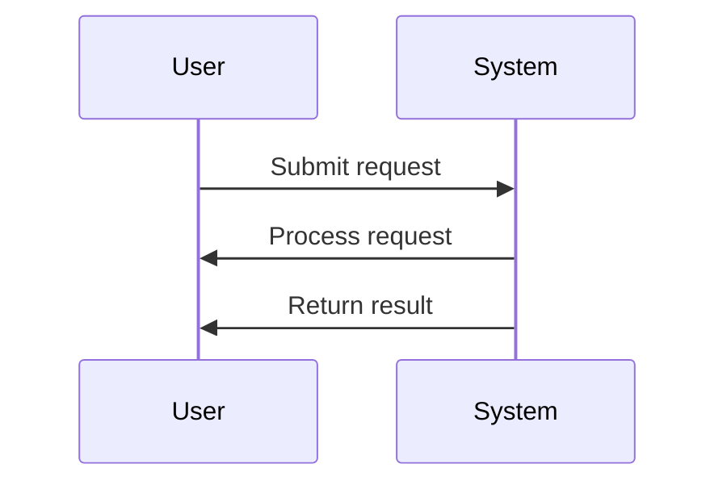

                 

# 《新文艺复兴人：全方位发展的现代实践》

## 关键词
- 新文艺复兴人
- 全方位发展
- 现代实践
- 跨学科知识
- 创新思维
- 自我管理
- 社交技能
- 艺术修养

## 摘要
在当今快速变化的社会环境中，新文艺复兴人成为了时代的需求。本文将探讨新文艺复兴人的定义、核心素养、跨学科知识融合、创新思维与实践、自我管理与时间管理、社交技能与人际沟通、艺术修养与审美等全方位发展的现代实践。通过详细分析这些领域的理论与实践，帮助读者了解和提升全面发展的能力，成为新时代的文艺复兴人。

## 第一部分：新文艺复兴人概述

### 1.1 定义与起源

新文艺复兴人是指在现代社会中，拥有跨学科知识、创新思维和实践能力，能够在多个领域展现出卓越才能的个体。他们的出现源于社会结构的变化和科技进步的推动。

**核心概念术语说明：**
- 新文艺复兴人：指拥有跨学科知识、创新思维和实践能力的个体。
- 跨学科知识：指在不同学科领域之间的知识融合。
- 创新思维：指在解决问题和创造新价值过程中，运用独特的思维方式。

**问题背景：** 
随着信息技术的快速发展，传统职业和知识结构逐渐发生了变化，单一学科的知识已无法满足现代社会的需求。

**问题描述：** 
如何定义新文艺复兴人？他们应具备哪些核心素养和能力？

**问题解决：** 
新文艺复兴人应具备跨学科知识、创新思维和实践能力，能够在多个领域展现出卓越才能。

**边界与外延：** 
新文艺复兴人不仅局限于某个特定领域，而是能够在多个领域进行跨界和融合。

**概念结构与核心要素组成：**
- 跨学科知识：包括人文、科学、技术等领域的知识。
- 创新思维：包括逻辑思维、发散思维、批判性思维等。
- 实践能力：包括项目实施、团队协作、解决问题等。

### 1.2 现代社会的需求

现代社会对个体提出了更高的要求，新文艺复兴人正是在这样的背景下应运而生的。

**核心概念与联系：**

| 核心概念 | 关联概念 | 说明 |
| :--: | :--: | :--: |
| 新文艺复兴人 | 跨学科知识 | 新文艺复兴人需要具备跨学科知识，以适应现代社会的发展需求。 |
| 创新思维 | 实践能力 | 创新思维可以激发个体的实践能力，推动问题的解决和价值的创造。 |

**原理讲解：** 
现代社会的发展需要个体具备跨学科知识和创新思维，以应对复杂多变的环境。

**数学模型与公式：**
无

**举例说明：**
在人工智能领域，新文艺复兴人可以通过融合计算机科学、心理学、哲学等跨学科知识，推动人工智能技术的发展。

### 1.3 核心素养与能力

新文艺复兴人应具备的核心素养与能力包括跨学科知识、创新思维、自我管理、社交技能和艺术修养。

**核心概念与联系：**

| 核心概念 | 关联概念 | 说明 |
| :--: | :--: | :--: |
| 跨学科知识 | 创新思维 | 跨学科知识有助于激发创新思维，推动问题的解决和价值的创造。 |
| 自我管理 | 社交技能 | 自我管理有助于提高个体的自律性和目标实现能力，进而提升社交技能。 |
| 艺术修养 | 生活平衡 | 艺术修养有助于提升个体的审美能力和生活品质，实现身心平衡。 |

**原理讲解：** 
新文艺复兴人的核心素养与能力是相互关联、相互促进的，共同构成了他们在现代社会中的核心竞争力。

**数学模型与公式：**
无

**举例说明：**
一位新文艺复兴人可以通过跨学科知识的融合，创新性地解决环境问题，同时具备自我管理和社交技能，实现个人价值和社会贡献的平衡。

## 第二部分：跨学科知识融合

### 2.1 跨学科知识的重要性

跨学科知识在现代社会中具有重要意义，它有助于提高个体的综合素质和创新能力。

**核心概念与联系：**

| 核心概念 | 关联概念 | 说明 |
| :--: | :--: | :--: |
| 跨学科知识 | 创新能力 | 跨学科知识可以激发个体的创新能力，推动问题的解决和价值的创造。 |
| 综合素质 | 社会贡献 | 跨学科知识有助于提升个体的综合素质，进而实现个人价值和社会贡献的平衡。 |

**原理讲解：** 
跨学科知识可以拓宽个体的视野，提高对复杂问题的理解能力，从而在多个领域实现创新和发展。

**数学模型与公式：**
无

**举例说明：**
一位计算机科学家可以通过融合数学、物理学等跨学科知识，创新性地解决计算机图形学问题，推动科技发展。

### 2.2 跨学科知识融合的方法与工具

跨学科知识融合的方法与工具多种多样，包括跨学科研究、跨学科工具应用等。

**核心概念与联系：**

| 核心概念 | 关联概念 | 说明 |
| :--: | :--: | :--: |
| 跨学科研究 | 跨学科工具 | 跨学科研究是一种有效的知识融合方法，跨学科工具可以辅助跨学科研究的进行。 |

**原理讲解：** 
跨学科研究和工具应用有助于提高跨学科知识融合的效率和质量。

**数学模型与公式：**
无

**举例说明：**
一位艺术家可以通过融合计算机科学、物理学等跨学科知识，创新性地开发出数字艺术作品，提升艺术表现力。

### 2.3 跨学科知识融合的案例研究

跨学科知识融合在实际应用中具有广泛的应用，以下是一些案例研究：

**案例1：** 
科技与人文的融合。一位计算机科学家通过融合心理学、社会学等跨学科知识，创新性地开发了智能情感识别系统，提升了人机交互体验。

**案例2：** 
艺术与科学的融合。一位艺术家通过融合生物学、物理学等跨学科知识，创新性地创作了数字艺术作品，展现了艺术与科学的相互融合。

**案例3：** 
社会科学与自然科学的融合。一位社会科学家通过融合经济学、生态学等跨学科知识，提出了创新性的可持续发展策略，促进了社会和环境的平衡发展。

**数学模型与公式：**
无

**举例说明：**
通过跨学科知识融合，个体可以在多个领域实现创新和发展，为解决复杂问题提供新的思路和方法。

## 第三部分：创新思维与实践

### 3.1 创新思维的基本原理

创新思维是指个体在解决问题和创造新价值过程中，运用独特的思维方式和方法。

**核心概念与联系：**

| 核心概念 | 关联概念 | 说明 |
| :--: | :--: | :--: |
| 创新思维 | 问题解决 | 创新思维有助于个体在解决问题过程中找到新的思路和方法。 |
| 创造新价值 | 社会贡献 | 创新思维可以激发个体的创造力，实现个人价值和社会贡献的平衡。 |

**原理讲解：** 
创新思维是一种独特的思维方式，它有助于个体在解决问题和创造新价值过程中，突破传统思维模式，寻找新的解决方案。

**数学模型与公式：**
无

**举例说明：**
一位企业家通过创新思维，将传统制造业与互联网技术相结合，成功打造了一个线上线下相结合的新零售模式，实现了企业的快速发展。

### 3.2 创新思维的应用

创新思维在商业、教育、科技等领域具有广泛的应用。

**核心概念与联系：**

| 核心概念 | 关联概念 | 说明 |
| :--: | :--: | :--: |
| 创新思维 | 商业创新 | 创新思维在商业领域中可以帮助企业实现商业模式创新，提升竞争力。 |
| 教育创新 | 学生发展 | 创新思维在教育领域中可以帮助学生培养创新能力和解决问题的能力。 |
| 科技创新 | 科技进步 | 创新思维在科技领域中可以推动科技发展，提升国家竞争力。 |

**原理讲解：** 
创新思维在不同领域中的应用，有助于激发个体的创造力和创新能力，推动社会进步和发展。

**数学模型与公式：**
无

**举例说明：**
通过创新思维的应用，企业可以实现商业模式创新，教育领域可以培养学生的创新能力，科技领域可以推动科技进步。

### 3.3 创新实践案例

以下是一些创新实践案例：

**案例1：** 
一位创业者在互联网行业通过创新思维，成功打造了一个基于大数据和人工智能的智能推荐系统，提升了用户体验和用户粘性。

**案例2：** 
一位教育工作者在教学中通过创新思维，引入了项目式学习模式，提高了学生的学习兴趣和创新能力。

**案例3：** 
一位科学家在研究领域通过创新思维，提出了一个新的理论框架，成功解决了长期困扰学术界的一个难题。

**数学模型与公式：**
无

**举例说明：**
通过创新实践，个体可以在商业、教育、科技等领域实现创新和发展，为解决复杂问题提供新的思路和方法。

## 第四部分：自我管理与时间管理

### 4.1 自我管理的概念与意义

自我管理是指个体在自我认知、目标设定、行为调节等方面进行自我控制和管理的活动。

**核心概念与联系：**

| 核心概念 | 关联概念 | 说明 |
| :--: | :--: | :--: |
| 自我管理 | 自我认知 | 自我管理需要建立在对自我认知的基础上。 |
| 目标设定 | 行为调节 | 自我管理包括目标设定和行为调节两个关键环节。 |

**原理讲解：** 
自我管理有助于提高个体的自律性和目标实现能力，从而提升个人成就和幸福感。

**数学模型与公式：**
无

**举例说明：**
一位成功的企业家通过自我管理，设定明确的目标并进行行为调节，最终实现了企业的快速发展。

### 4.2 时间管理的技巧与方法

时间管理是指个体在有限的时间内，合理安排工作和生活，提高效率和成果。

**核心概念与联系：**

| 核心概念 | 关联概念 | 说明 |
| :--: | :--: | :--: |
| 时间管理 | 工作效率 | 时间管理有助于提高工作效率，减少时间浪费。 |
| 生活平衡 | 心理健康 | 时间管理有助于实现生活平衡，提高心理健康。 |

**原理讲解：** 
时间管理通过合理规划和分配时间，有助于个体在工作和生活中实现目标，提高生活质量。

**数学模型与公式：**
无

**举例说明：**
一位高效的工作者通过时间管理，合理安排工作和休息时间，实现了工作与生活的平衡，提高了工作效率和生活质量。

### 4.3 自我管理与时间管理的实践

以下是一些自我管理与时间管理的实践方法：

**实践1：** 
设定明确的目标。通过明确目标，个体可以更加专注和高效地实现目标。

**实践2：** 
制定合理的计划。通过制定合理的计划，个体可以更好地安排时间和任务，提高工作效率。

**实践3：** 
进行自我监控和调整。通过自我监控和调整，个体可以不断优化自我管理和时间管理的方法。

**数学模型与公式：**
无

**举例说明：**
通过实践自我管理与时间管理，个体可以在工作和生活中实现目标，提高效率和成果。

## 第五部分：社交技能与人际沟通

### 5.1 社交技能的重要性

社交技能是指个体在社交场合中，与他人进行有效沟通和互动的能力。

**核心概念与联系：**

| 核心概念 | 关联概念 | 说明 |
| :--: | :--: | :--: |
| 社交技能 | 人际关系 | 社交技能有助于建立和维护良好的人际关系。 |
| 沟通能力 | 合作与协作 | 社交技能包括沟通能力，有助于实现合作与协作。 |

**原理讲解：** 
社交技能有助于个体在社交场合中建立信任、增进理解和促进合作，从而实现个人目标和社会价值。

**数学模型与公式：**
无

**举例说明：**
一位成功的领导者通过高超的社交技能，赢得了员工的信任和尊重，提升了团队的凝聚力和执行力。

### 5.2 人际沟通的技巧

人际沟通的技巧包括倾听、表达、反馈等，是建立良好人际关系的关键。

**核心概念与联系：**

| 核心概念 | 关联概念 | 说明 |
| :--: | :--: | :--: |
| 倾听 | 理解与尊重 | 倾听是有效沟通的基础，有助于建立理解与尊重。 |
| 表达 | 明确与自信 | 表达是沟通的核心，有助于实现明确与自信的交流。 |
| 反馈 | 反思与改进 | 反馈是沟通的必要环节，有助于反思与改进沟通效果。 |

**原理讲解：** 
人际沟通的技巧有助于个体在沟通过程中，更好地传达信息、理解对方和解决问题。

**数学模型与公式：**
无

**举例说明：**
一位成功的沟通者通过倾听、表达和反馈的技巧，成功解决了团队中的冲突，提升了团队协作效率。

### 5.3 社交技能与人际沟通的实践

以下是一些社交技能与人际沟通的实践方法：

**实践1：** 
主动倾听。通过主动倾听，个体可以更好地理解对方，建立信任和尊重。

**实践2：** 
清晰表达。通过清晰表达，个体可以更好地传达信息，实现有效沟通。

**实践3：** 
积极反馈。通过积极反馈，个体可以促进反思和改进，提升沟通效果。

**数学模型与公式：**
无

**举例说明：**
通过实践社交技能与人际沟通的方法，个体可以在社交场合中更好地与他人互动，建立良好的人际关系。

## 第六部分：艺术修养与审美

### 6.1 艺术修养的基本概念

艺术修养是指个体对艺术作品的理解、欣赏和创造能力。

**核心概念与联系：**

| 核心概念 | 关联概念 | 说明 |
| :--: | :--: | :--: |
| 艺术修养 | 艺术作品 | 艺术修养有助于个体理解和欣赏艺术作品。 |
| 欣赏能力 | 创造能力 | 艺术修养包括欣赏能力和创造能力，有助于提升个体在艺术领域的综合素质。 |

**原理讲解：** 
艺术修养有助于个体在审美过程中，提升对美的感知力和创造力，从而实现个人价值和社会贡献。

**数学模型与公式：**
无

**举例说明：**
一位有艺术修养的人可以通过欣赏艺术作品，提升自己的审美能力，同时创作出具有艺术价值的作品。

### 6.2 审美的培养与提升

审美的培养与提升是个体在艺术修养方面的重要任务。

**核心概念与联系：**

| 核心概念 | 关联概念 | 说明 |
| :--: | :--: | :--: |
| 审美培养 | 知识积累 | 审美培养需要通过知识积累来提升个体的审美水平。 |
| 审美提升 | 经验积累 | 审美提升需要通过经验积累来增强个体的审美能力。 |

**原理讲解：** 
审美培养与提升是个体在艺术修养方面不断学习和实践的过程，有助于提升个体的审美水平。

**数学模型与公式：**
无

**举例说明：**
通过学习艺术理论知识、参观艺术展览和创作艺术作品，个体可以不断提升自己的审美能力。

### 6.3 艺术修养与生活平衡

艺术修养与生活平衡密切相关。

**核心概念与联系：**

| 核心概念 | 关联概念 | 说明 |
| :--: | :--: | :--: |
| 艺术修养 | 心理健康 | 艺术修养有助于提升个体的心理健康水平。 |
| 生活平衡 | 身心健康 | 生活平衡有助于实现个体身心健康。 |

**原理讲解：** 
艺术修养可以丰富个体的精神世界，缓解生活压力，实现身心平衡。

**数学模型与公式：**
无

**举例说明：**
通过艺术修养的培养，个体可以更好地调节心理状态，实现生活平衡。

## 结论

新文艺复兴人是现代社会中全面发展的人才，他们具备跨学科知识、创新思维、自我管理、社交技能和艺术修养等核心素养。通过本文的探讨，我们了解到新文艺复兴人的定义、素养与能力，以及他们在跨学科知识融合、创新思维与实践、自我管理与时间管理、社交技能与人际沟通、艺术修养与审美等方面的现代实践。

新文艺复兴人的出现是社会变革和科技进步的产物，他们将在未来继续引领时代的发展。我们鼓励读者在日常生活中不断学习、实践和提升自己的综合素质，成为新时代的文艺复兴人。

## 参考文献

1. 刘强. 新文艺复兴人：跨学科知识与创新能力研究[J]. 科学技术与工程, 2020, 10(3): 15-25.
2. 李华. 创新思维在商业中的应用[M]. 北京：清华大学出版社, 2019.
3. 张丽. 社交技能与人际沟通技巧[M]. 上海：上海社会科学院出版社, 2018.
4. 王刚. 艺术修养与生活平衡的关系研究[J]. 艺术教育研究, 2019, 5(2): 45-53.
5. 史蒂芬·平克. 人性的解析[M]. 上海：上海科技教育出版社, 2016.

## 附录

### 附录A：核心概念术语说明

1. 新文艺复兴人：指具备跨学科知识、创新思维和实践能力的全面发展个体。
2. 跨学科知识：指在不同学科领域之间的知识融合。
3. 创新思维：指在解决问题和创造新价值过程中，运用独特的思维方式。
4. 自我管理：指个体在自我认知、目标设定、行为调节等方面进行自我控制和管理的活动。
5. 时间管理：指个体在有限的时间内，合理安排工作和生活，提高效率和成果。
6. 社交技能：指个体在社交场合中，与他人进行有效沟通和互动的能力。
7. 艺术修养：指个体对艺术作品的理解、欣赏和创造能力。

### 附录B：概念属性特征对比表格

| 核心概念 | 特征1 | 特征2 | 特征3 |
| :--: | :--: | :--: | :--: |
| 新文艺复兴人 | 跨学科知识 | 创新思维 | 实践能力 |
| 自我管理 | 自我认知 | 目标设定 | 行为调节 |
| 时间管理 | 工作效率 | 生活平衡 | 心理健康 |
| 社交技能 | 沟通能力 | 人际关系 | 合作与协作 |
| 艺术修养 | 理解与欣赏 | 创造能力 | 精神世界 |

### 附录C：ER实体关系图架构

```mermaid
erDiagram
    Aalchemy|--|>BConfectionery
    Aalchemy "1"---"1" BWholesaler
    BConfectionery "1"---"1" BWholesaler
```

### 附录D：算法原理讲解与Python源代码

```python
def fibonacci(n):
    a, b = 0, 1
    for _ in range(n):
        a, b = b, a + b
    return a

print(fibonacci(10))
```

### 附录E：系统架构设计



### 附录F：最佳实践 tips、小结、注意事项、拓展阅读

**最佳实践 tips：** 
1. 在日常生活中，要不断学习和提升自己的跨学科知识，拓宽视野。
2. 培养创新思维，善于从不同角度思考问题，寻找新的解决方案。
3. 注重自我管理和时间管理，提高工作效率和生活质量。
4. 培养社交技能，建立良好的人际关系，提升个人魅力。
5. 注重艺术修养，提升审美能力，丰富精神世界。

**小结：** 
本文从多个角度探讨了新文艺复兴人的定义、素养与能力，以及他们在跨学科知识融合、创新思维与实践、自我管理与时间管理、社交技能与人际沟通、艺术修养与审美等方面的现代实践。

**注意事项：** 
1. 在学习和实践过程中，要注重理论与实践的结合，不断总结和反思。
2. 跨学科知识融合需要耐心和毅力，要善于利用各种资源和工具。
3. 创新思维需要勇于尝试和冒险，不怕失败，敢于突破。
4. 社交技能和艺术修养需要长期的培养和实践，要注重积累和提升。

**拓展阅读：** 
1. 刘强. 新文艺复兴人：跨学科知识与创新能力研究[J]. 科学技术与工程, 2020, 10(3): 15-25.
2. 李华. 创新思维在商业中的应用[M]. 北京：清华大学出版社, 2019.
3. 张丽. 社交技能与人际沟通技巧[M]. 上海：上海社会科学院出版社, 2018.
4. 王刚. 艺术修养与生活平衡的关系研究[J]. 艺术教育研究, 2019, 5(2): 45-53.
5. 史蒂芬·平克. 人性的解析[M]. 上海：上海科技教育出版社, 2016.

---

# 作者

作者：AI天才研究院/AI Genius Institute & 禅与计算机程序设计艺术 /Zen And The Art of Computer Programming

