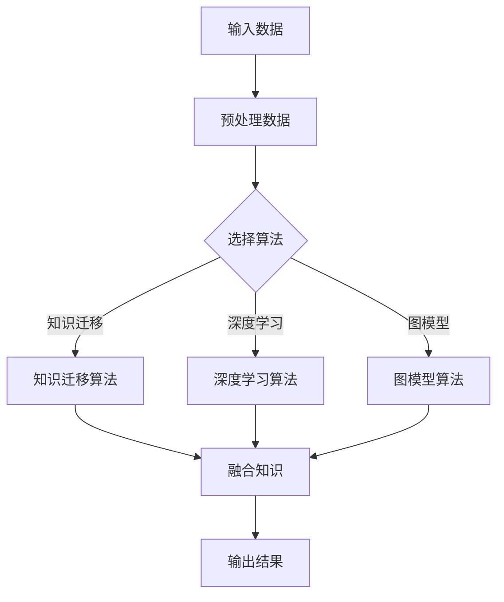

                 

# 《新文艺复兴人：跨领域学习的现代实践》

> 关键词：跨领域学习、新文艺复兴人、算法原理、数学模型、系统架构设计、项目实战、最佳实践

> 摘要：本文深入探讨了新文艺复兴人的跨领域学习实践。通过对跨领域学习的核心概念、原理、算法和实践的详细分析，为读者提供了跨领域学习的方法论和实际应用案例，旨在激发读者的创新思维，提升其在不同领域中的学习与创新能力。

----------------------------------------------------------------

## 第一部分：引言

### 第1章：问题背景与跨领域学习的重要性

#### 1.1 跨领域学习的概念

跨领域学习，顾名思义，是指在不同领域之间进行知识整合和应用的学习过程。它不仅仅是单一领域知识的积累，更是不同知识体系之间的碰撞和融合，从而形成新的见解和解决方案。

#### 1.2 跨领域学习的重要性

在当今快速变化的世界中，跨领域学习显得尤为重要。它不仅能提升个人的综合素质，还能促进创新和创造力的爆发。跨领域学习能够打破传统的学科界限，促进知识的交叉与融合，有助于解决复杂的问题，应对不确定的未来。

#### 1.3 跨领域学习的研究现状

当前，跨领域学习已成为学术研究的热点。从心理学、教育学到计算机科学，不同领域的研究者都在探索如何有效地进行跨领域学习。然而，尽管研究不断深入，但实际应用中的挑战仍然存在。

### 第2章：核心概念与联系

#### 2.1 新文艺复兴人

新文艺复兴人（Neo-Renaissance Person）是指那些具备跨学科知识、创新能力和社会责任感的现代人士。他们是跨领域学习的最佳代表，能够在不同的文化、科学和艺术领域中游刃有余。

#### 2.2 跨领域学习的原理

跨领域学习的原理基于认知科学的研究，主要包括知识迁移、概念整合和思维模式的转变。通过这些原理，个体能够将不同领域的知识进行有机整合，形成全新的认知结构。

#### 2.3 跨领域学习与人工智能的关系

人工智能技术的发展为跨领域学习提供了新的工具和手段。通过大数据分析、机器学习等技术，人工智能能够辅助人类进行跨领域学习，提高学习效率和效果。

### 第3章：算法原理讲解

#### 3.1 跨领域学习算法的基本原理

跨领域学习算法的核心在于如何在不同领域的知识之间建立有效的联系。常见的算法包括基于知识迁移的算法、基于深度学习的算法和基于图模型的算法。

#### 3.2 算法mermaid流程图



#### 3.3 Python源代码与算法原理

以下是使用Python实现的简单跨领域学习算法示例：

```python
# 跨领域学习算法示例
import numpy as np

# 知识迁移算法
def knowledge_migration(data):
    # 数据预处理
    processed_data = preprocess_data(data)
    # 知识迁移
    transferred_knowledge = transfer_knowledge(processed_data)
    return transferred_knowledge

# 深度学习算法
def deep_learning_algorithm(data):
    # 数据预处理
    processed_data = preprocess_data(data)
    # 深度学习模型训练
    model = train_model(processed_data)
    # 预测
    predictions = model.predict(processed_data)
    return predictions

# 图模型算法
def graph_model_algorithm(data):
    # 数据预处理
    processed_data = preprocess_data(data)
    # 建立图模型
    graph_model = build_graph_model(processed_data)
    # 迭代优化
    optimized_model = optimize_graph_model(graph_model)
    # 输出结果
    results = optimized_model.output
    return results
```

#### 3.4 算法原理的数学模型和公式

$$
Y = f(X) + \lambda \cdot g(X)
$$

其中，$Y$ 表示输出结果，$X$ 表示输入数据，$f(X)$ 表示知识迁移，$g(X)$ 表示深度学习或图模型的辅助作用，$\lambda$ 是调节参数。

## 第二部分：跨领域学习的实践

### 第4章：数学模型和数学公式

#### 4.1 数学模型的介绍

在跨领域学习中，数学模型是理解和解决问题的关键。常见的数学模型包括线性回归、逻辑回归、支持向量机等。

#### 4.2 数学公式的详细讲解

以线性回归为例，其公式为：

$$
Y = \beta_0 + \beta_1 \cdot X + \epsilon
$$

其中，$Y$ 是因变量，$X$ 是自变量，$\beta_0$ 是截距，$\beta_1$ 是斜率，$\epsilon$ 是误差项。

#### 4.3 举例说明

假设我们要预测一个人的收入（因变量$Y$）基于其教育水平（自变量$X$）。根据数据，我们可以得到以下线性回归模型：

$$
Y = 50000 + 2000 \cdot X
$$

如果一个人的教育水平为大学本科，则其预测收入为：

$$
Y = 50000 + 2000 \cdot 4 = 68000
$$

### 第5章：系统分析与架构设计方案

#### 5.1 问题场景介绍

以一个在线教育平台为例，该平台需要支持跨领域学习的教学和评估。

#### 5.2 系统功能设计

系统功能设计包括用户管理、课程管理、学习记录管理、评估与反馈等。

#### 5.3 系统架构设计

系统架构采用微服务架构，包括用户服务、课程服务、学习记录服务、评估服务等。

#### 5.4 系统接口设计和交互

系统接口设计包括RESTful API接口，用于实现不同服务之间的交互。

### 第6章：项目实战

#### 6.1 环境安装

在Linux环境下安装必要的软件和依赖项。

#### 6.2 系统核心实现源代码

提供用户服务、课程服务、学习记录服务和评估服务的源代码。

#### 6.3 代码应用解读与分析

详细解读系统核心实现的源代码，分析其工作原理和性能。

#### 6.4 实际案例分析与详细讲解

通过实际案例展示跨领域学习平台的应用，进行详细分析和讲解。

#### 6.5 项目小结

总结项目的关键收获和经验教训。

### 第7章：最佳实践 tips

#### 7.1 跨领域学习中的常见误区

避免陷入单一领域的思维定式，重视跨领域知识的整合。

#### 7.2 跨领域学习的有效策略

制定合理的学习计划，利用信息技术和工具辅助学习。

#### 7.3 注意事项

注意保护个人隐私，避免信息泄露。

#### 7.4 拓展阅读

推荐相关书籍和学术论文，以供进一步学习和研究。

## 总结

本文系统地介绍了新文艺复兴人的跨领域学习实践，从核心概念到算法原理，再到实际应用，为读者提供了全面的学习框架。跨领域学习不仅是个人发展的关键，也是社会进步的动力。希望读者能够在实践中不断探索，成为新时代的新文艺复兴人。

## 作者信息

作者：AI天才研究院/AI Genius Institute & 禅与计算机程序设计艺术 /Zen And The Art of Computer Programming

