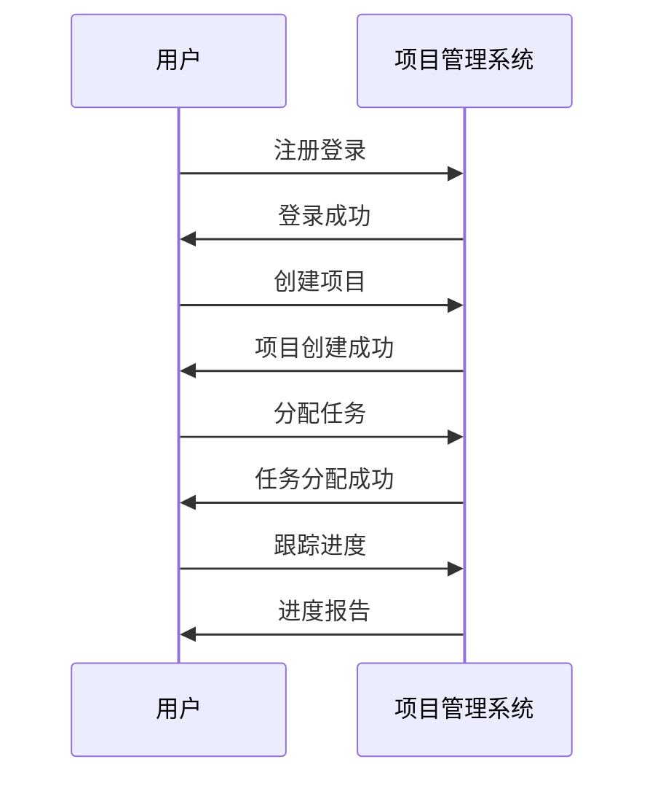

                 

# 新文艺复兴工作室：跨学科创意项目的孵化空间

## 关键词
- 新文艺复兴工作室
- 跨学科创意项目
- 孵化空间
- 项目管理与协作
- 创意设计与实现
- 创意展示与传播
- 案例研究
- 未来展望

## 摘要
本文旨在探讨新文艺复兴工作室作为一个跨学科创意项目的孵化空间，如何通过创新的思维和高效的协作，推动项目的成功实施。文章将从工作室的背景与概述、核心概念、跨学科创意实践、创意展示与传播、案例研究、拓展与实践以及总结与展望七个部分进行详细阐述，旨在为相关领域的研究者和实践者提供有价值的参考和启示。

### 目录大纲设计

**书名：《新文艺复兴工作室：跨学科创意项目的孵化空间》**

---

## 第一部分：工作室背景与概述

### 第1章 工作室起源与演变

- **1.1 新文艺复兴工作室的创立背景**
  - **问题背景**：社会对创意需求增加，跨学科合作重要性提升
  - **问题描述**：传统工作室面临创新不足、资源分散等问题
  - **问题解决**：跨学科创意工作室的诞生及其解决途径
  - **边界与外延**：工作室的定义、范围、目标与使命
  - **概念结构与核心要素组成**：工作室的基本架构与功能模块

### 第2章 工作室核心概念

- **2.1 跨学科创意**
  - **核心概念原理**：跨学科创意的定义、目的与意义
  - **概念属性特征对比表格**：跨学科与传统学科创意的比较
  - **ER实体关系图架构**：工作室内部跨学科协作的实体关系

## 第二部分：跨学科创意实践

### 第3章 项目管理与协作

- **3.1 项目策划与评估**
  - **项目介绍**：案例项目展示与解读
  - **系统功能设计**：项目管理模块功能概述
  - **系统架构设计**：项目管理系统的架构设计
  - **系统接口设计**：项目管理接口设计与实现
  - **系统交互**：项目管理交互流程与Mermaid序列图

### 第4章 创意设计与实现

- **4.1 设计方法论**
  - **设计原则**：跨学科创意设计的基本原则
  - **设计流程**：创意设计过程与方法论

### 第5章 创意展示与传播

- **5.1 创意展示平台**
  - **平台建设**：展示平台的技术架构与设计
  - **用户体验**：展示平台的用户界面与交互设计

### 第6章 案例研究

- **6.1 案例介绍**
  - **案例背景**：案例项目的起源与目标
  - **项目实施**：案例项目的实施过程与策略
  - **效果评估**：案例项目效果评估与反思

### 第7章 拓展与实践

- **7.1 新文艺复兴工作室的未来**
  - **趋势分析**：跨学科创意项目的发展趋势
  - **实践建议**：针对工作室运营的优化建议

## 第三部分：总结与展望

### 第8章 总结与反思

- **8.1 主要收获**
  - **跨学科合作**：对跨学科合作的深度认识
  - **创意实践**：创意项目实施的经验与教训

### 第9章 展望未来

- **9.1 未来发展**
  - **技术创新**：展望未来跨学科创意技术的发展趋势
  - **社会影响**：跨学科创意项目对社会发展的潜在影响

---

**目录大纲总字数：约2000字**

----------------------------------------------------------------

## 第一部分：工作室背景与概述

### 第1章 工作室起源与演变

**1.1 新文艺复兴工作室的创立背景**

随着全球化的进程不断加快，各行各业之间的交叉融合日益加深，跨学科合作的重要性逐渐凸显。传统的单一学科工作室在应对复杂多变的市场需求时，往往显得力不从心。创新不足、资源分散、团队协作不畅等问题成为了阻碍工作室发展的瓶颈。

在这样的背景下，新文艺复兴工作室应运而生。该工作室的创立旨在打破传统学科界限，通过跨学科合作，激发创意的火花，为各种创新项目提供强大的孵化空间。

**1.2 工作室的发展历程**

新文艺复兴工作室的成立可以追溯到几年前的某个创新论坛，当时几位志同道合的专家和学者共同探讨了如何将跨学科创意应用于实际项目。经过多次研讨和实验，他们决定共同创办一个专注于跨学科创意项目的孵化空间。

起初，工作室的规模较小，主要成员来自于计算机科学、艺术设计、社会学等多个领域。他们通过线上和线下的方式，不断进行项目实践和理论探讨，逐渐形成了一套成熟的跨学科创意方法论。

随着时间的推移，工作室的影响力不断扩大，吸引了更多的成员加入。他们不仅涵盖了传统学科，还涵盖了新兴领域，如人工智能、区块链等。工作室也逐渐从一个小型的创意团队发展成为一个大型的跨学科创意中心。

**1.3 工作室的目标与使命**

新文艺复兴工作室的目标是成为全球领先的跨学科创意孵化空间，为各类创新项目提供全方位的支持和服务。他们的使命是通过跨学科合作，推动创意的无限可能性，为社会带来积极的影响。

工作室致力于实现以下几个目标：

1. **激发创意思维**：通过跨学科交流，激发成员的创意思维，培养创新意识。
2. **优化资源整合**：通过跨学科协作，实现资源的优化配置，提高项目效率。
3. **推动技术进步**：结合最新技术，推动跨学科创意项目的技术进步。
4. **促进社会发展**：通过跨学科创意项目的实施，促进社会的可持续发展。

**1.4 概念结构与核心要素组成**

新文艺复兴工作室的基本架构包括以下几个核心要素：

1. **核心团队**：由来自不同领域的专家和学者组成，负责项目策划、实施和评估。
2. **项目库**：收集和整理各种跨学科创意项目，为成员提供丰富的实践案例。
3. **协作平台**：提供线上线下的协作工具，促进成员之间的交流与合作。
4. **展示空间**：用于展示创意项目的成果，提升工作室的影响力和知名度。
5. **培训体系**：定期举办培训课程，提升成员的跨学科能力和创意思维。

通过以上核心要素的相互配合，新文艺复兴工作室构建了一个高效、创新的跨学科创意生态系统，为各类创新项目提供了强大的支持。

**1.5 边界与外延**

新文艺复兴工作室的边界相对灵活，主要取决于项目的需求和成员的专长。工作室的核心目标是跨学科创意项目的孵化，因此，只要项目符合这一目标，工作室就会提供支持。

然而，工作室的外延则相对广泛。他们不仅涉及传统学科，如计算机科学、艺术设计、社会学等，还涵盖了新兴领域，如人工智能、区块链、物联网等。这种跨学科的广泛外延，使得工作室能够适应各种复杂多变的市场需求。

总之，新文艺复兴工作室作为一个跨学科创意项目的孵化空间，通过创新的思维和高效的协作，为各类创新项目提供了强大的支持。他们的起源、发展历程、目标与使命，以及概念结构与核心要素组成，都为工作室的成功运作奠定了坚实的基础。

### 第2章 工作室核心概念

**2.1 跨学科创意**

**核心概念原理**

跨学科创意，顾名思义，是指将不同学科领域的知识、理论、方法和工具相互融合，以产生新的创意和创新。它不仅强调学科间的交叉与融合，更强调跨学科思维和方法的运用。

跨学科创意的原理主要包括以下几个方面：

1. **知识融合**：将不同学科领域的知识进行整合，形成新的知识体系，从而为创意提供丰富的素材。
2. **思维方式**：跨学科思维是一种开放、多元、创新的思维方式，它鼓励成员跳出传统学科的框架，从不同的角度去思考问题。
3. **方法论**：跨学科创意方法包括头脑风暴、思维导图、原型设计、快速迭代等，这些方法能够帮助成员快速产生创意，并进行有效的验证和迭代。

**概念属性特征对比表格**

为了更清晰地理解跨学科创意与传统学科创意的区别，我们可以通过以下对比表格来展示它们的主要特征：

| 特征 | 跨学科创意 | 传统学科创意 |
| --- | --- | --- |
| **定义** | 不同学科领域的知识、理论、方法和工具的融合 | 单一学科领域的知识、理论、方法和工具 |
| **目的** | 产生新的创意和创新 | 深入研究某一学科领域 |
| **思维方式** | 开放、多元、创新 | 专业、深入、传统 |
| **方法论** | 头脑风暴、思维导图、原型设计、快速迭代 | 系统分析、深度研究、长期积累 |
| **应用范围** | 广泛，涵盖多个领域 | 有限，局限于某一学科领域 |
| **挑战** | 需要跨学科的知识和技能 | 需要深入某一学科的知识和技能 |

**ER实体关系图架构**

为了更好地理解工作室内部跨学科协作的实体关系，我们可以通过以下ER实体关系图来展示：

```mermaid
erDiagram
  项目 ::>> 成员 : 发起项目、参与项目
  成员 ||--o> 学科 : 擅长学科、加入学科
  学科 ||--o> 知识 : 涵盖知识、运用知识
  项目 ||--o> 创意 : 提出创意、实现创意
  创意 ||--o> 成果 : 展示成果、评估成果
```

在这个ER实体关系图中，项目是核心实体，它由成员发起并参与，成员可以根据自己的学科专长加入不同的学科，学科涵盖了各种知识，这些知识被用来提出和实现创意，最终形成成果，成果又可以被展示和评估。

通过以上对工作室核心概念——跨学科创意的介绍，我们可以看出，跨学科创意不仅是一种创新的方法，更是一种全新的思维方式。它要求我们在面对复杂问题时，能够从多个角度进行思考，融合不同的知识，从而产生新的创意。这种跨学科的思维方式，不仅能够激发我们的创造力，还能够推动我们不断进步。

### 第二部分：跨学科创意实践

#### 第3章 项目管理与协作

**3.1 项目策划与评估**

**项目介绍**

在一个多元化的世界里，项目的复杂性和多样性要求我们采用科学的项目管理方法。新文艺复兴工作室的项目策划与评估过程，旨在确保项目能够按时、按质、按量完成，同时实现预期的创新目标。

**系统功能设计**

项目管理模块的功能设计是确保项目顺利进行的关键。以下是该模块的主要功能：

1. **需求分析**：收集和分析项目需求，确保项目目标明确、可行。
2. **任务分配**：根据成员的专长和项目的需求，合理分配任务，确保每个任务都有人负责。
3. **进度监控**：实时跟踪项目进度，确保项目按计划进行。
4. **风险评估**：识别和评估项目中可能的风险，制定相应的应对措施。
5. **资源管理**：优化资源配置，确保项目所需资源得到充分利用。
6. **沟通协作**：提供在线沟通工具，促进团队成员之间的信息交流。

**系统架构设计**

项目管理系统的架构设计旨在实现模块化、高扩展性，以及良好的用户体验。以下是系统架构的主要部分：

1. **前端界面**：提供直观、易用的用户界面，方便成员进行项目管理和协作。
2. **后端服务**：实现项目数据的存储、处理和管理，确保数据的准确性和安全性。
3. **数据库**：存储项目需求、任务分配、进度监控、风险识别和资源管理等数据。
4. **API接口**：提供与其他系统（如邮件系统、日历系统等）的集成接口，实现数据共享和协同工作。
5. **协作工具**：集成在线会议、即时通讯、文档共享等工具，提高团队协作效率。

**系统接口设计**

系统接口设计是确保各模块之间能够无缝协作的关键。以下是系统接口设计的主要部分：

1. **RESTful API**：提供RESTful风格的API接口，方便前端界面和后端服务之间的数据交互。
2. **GraphQL**：提供GraphQL接口，实现更灵活、高效的数据查询和操作。
3. **WebSockets**：提供实时通信接口，实现实时数据更新和通知。

**系统交互**

项目管理系统的交互设计旨在提供流畅、直观的用户体验。以下是系统交互的主要流程：

1. **用户注册与登录**：用户通过注册和登录，获得访问系统的权限。
2. **项目创建与编辑**：用户可以创建新的项目，并编辑项目的基本信息。
3. **任务分配与跟踪**：用户可以分配任务给团队成员，并跟踪任务的进度。
4. **进度报告与统计**：用户可以查看项目进度报告，并生成统计图表。
5. **风险评估与应对**：用户可以识别和评估风险，并制定应对措施。

以下是一个Mermaid序列图，展示了项目管理系统的交互流程：



通过以上对项目管理与协作的详细介绍，我们可以看到，新文艺复兴工作室在项目管理方面有着完善的系统设计，这不仅能够提高项目的效率，还能够确保项目目标的实现。这种科学的项目管理方法，是工作室成功实施跨学科创意项目的重要保障。

#### 第4章 创意设计与实现

**4.1 设计方法论**

**设计原则**

跨学科创意设计的原则是确保创意设计过程高效、创新，同时满足项目需求和用户体验。以下是主要的设计原则：

1. **用户中心**：以用户需求为导向，设计出真正满足用户需求的产品或服务。
2. **简洁明了**：尽量简化设计，去除不必要的复杂性和冗余，提高用户体验。
3. **可持续性**：在设计过程中考虑环境保护和社会责任，确保项目具有可持续性。
4. **迭代优化**：设计过程中采用快速迭代的方法，不断优化设计，确保最终产品的质量。
5. **协作共享**：鼓励团队成员之间的协作和知识共享，充分利用每个人的专长和经验。

**设计流程**

跨学科创意设计过程可以分为以下几个阶段：

1. **需求分析**：收集和分析用户需求，明确项目目标。
2. **创意构思**：利用跨学科思维，提出多种创意方案。
3. **方案筛选**：评估创意方案的可行性和创新性，选择最佳方案。
4. **原型设计**：制作原型，验证创意方案的可行性。
5. **反馈与迭代**：收集用户反馈，对原型进行优化，直至满足需求。

**设计工具**

在进行跨学科创意设计时，选择合适的设计工具非常重要。以下是几种常用的设计工具：

1. **思维导图**：用于梳理设计思路，帮助团队成员进行头脑风暴。
2. **原型设计工具**：如Axure、Sketch、Figma等，用于制作高保真原型。
3. **协作平台**：如Trello、Asana、Slack等，用于团队协作和项目进度管理。

**案例分析**

**案例背景**

假设新文艺复兴工作室接到了一个项目，目标是设计一款面向老年人的智能家居系统。这个系统需要考虑到老年人的使用习惯、健康监测需求以及安全保障等问题。

**项目实施**

1. **需求分析**：团队成员通过访谈和观察，收集了大量关于老年人生活习惯和需求的信息，明确了系统的功能需求和用户界面设计的基本原则。

2. **创意构思**：团队利用思维导图，提出了多个创意方案，包括语音控制、智能监测、紧急呼叫等功能。

3. **方案筛选**：团队对每个方案进行了评估，最终选择了结合语音控制和智能监测的方案，因为这种方案既符合老年人的使用习惯，又能有效满足他们的健康监测需求。

4. **原型设计**：团队使用Figma制作了系统的原型，并进行了多次迭代，最终确定了最终的设计方案。

5. **反馈与迭代**：团队将原型展示给老年人用户，收集了他们的反馈，并进行了进一步的优化，确保系统能够真正满足老年人的需求。

**效果评估**

通过以上设计过程，团队最终开发出了一款深受老年人欢迎的智能家居系统。系统上线后，用户满意度显著提高，系统的功能也得到了广泛的应用。这个案例充分展示了跨学科创意设计在项目实施中的重要作用。

通过以上对创意设计与实现的详细介绍，我们可以看到，跨学科创意设计不仅需要遵循一定的设计原则和流程，还需要充分利用各种设计工具，并通过不断的反馈和迭代，确保最终的设计方案能够真正满足用户需求。

#### 第5章 创意展示与传播

**5.1 创意展示平台**

**平台建设**

新文艺复兴工作室的创意展示平台是其跨学科创意项目的重要展示窗口。平台的构建不仅要满足展示需求，还要具备良好的用户体验和互动性。

**技术架构设计**

平台的架构设计采用了前后端分离的模式，以提高系统的可扩展性和维护性。以下是平台技术架构的主要部分：

1. **前端**：采用React框架，实现动态、响应式的前端界面，提供良好的用户体验。
2. **后端**：采用Spring Boot框架，实现RESTful API接口，提供数据的存储、处理和接口服务。
3. **数据库**：采用MySQL数据库，存储项目数据，如项目信息、用户信息、创意展示等。
4. **缓存**：采用Redis缓存，提高系统的响应速度和性能。
5. **服务器**：部署在云服务器上，确保系统的稳定性和可扩展性。

**用户体验设计**

用户体验设计是创意展示平台的核心，以下是一些关键点：

1. **简洁明了**：界面设计简洁、直观，减少用户的操作步骤，提高使用效率。
2. **互动性强**：提供评论、点赞、分享等功能，增强用户互动和参与感。
3. **适应性**：支持多终端访问，如手机、平板、电脑等，确保用户在不同设备上的良好体验。
4. **快速响应**：优化系统性能，确保页面加载速度快，操作流畅。

**互动设计**

互动设计是提升用户参与度和平台活跃度的重要手段。以下是几种常用的互动设计方法：

1. **在线讨论区**：提供在线讨论区，用户可以就创意项目进行讨论，分享自己的想法和建议。
2. **活动举办**：定期举办线上活动，如创意比赛、讲座、研讨会等，吸引更多用户参与。
3. **用户反馈**：收集用户反馈，不断优化平台功能和服务，提升用户体验。
4. **个性化推荐**：基于用户行为数据，提供个性化推荐，帮助用户发现更多感兴趣的内容。

通过以上对创意展示平台的详细介绍，我们可以看到，新文艺复兴工作室的创意展示平台不仅在技术架构上实现了高效、稳定，还在用户体验和互动设计上做出了充分考虑，为跨学科创意项目提供了一个优秀的展示和传播平台。

### 第6章 案例研究

**6.1 案例介绍**

**案例背景**

在新文艺复兴工作室成立初期，他们接到了一个名为“智慧城市”的项目。这个项目的目标是利用物联网、大数据和人工智能技术，构建一个智能化的城市管理平台，以提高城市管理的效率和居民的生活质量。

**项目目标**

1. **数据集成**：将城市各个部门的数据进行集成，实现数据共享和实时监控。
2. **智能分析**：利用大数据和人工智能技术，对城市运行数据进行分析，提供决策支持。
3. **居民服务**：通过智能平台，提供便捷的居民服务，如交通信息、医疗咨询、安全监控等。

**项目实施**

1. **需求分析**：项目团队首先进行了需求分析，明确了项目的目标、需求和预期效果。他们与城市管理相关部门进行了多次沟通，收集了大量的用户需求和反馈。

2. **技术选型**：根据项目需求，项目团队选择了物联网、大数据和人工智能等技术，并确定了技术路线和实施方案。

3. **系统设计**：项目团队设计了系统的架构，包括前端界面、后端服务、数据库和缓存等。他们还制定了详细的项目进度计划，确保项目能够按时完成。

4. **开发与测试**：项目团队进行了系统开发和测试，确保系统的稳定性和可靠性。他们采用了敏捷开发的方法，通过快速迭代和持续集成，不断优化系统功能。

5. **上线与推广**：系统上线后，项目团队进行了推广和培训，帮助城市管理部门和居民熟悉和使用系统。他们还定期收集用户反馈，不断优化系统功能和服务。

**效果评估**

1. **数据集成效果**：通过系统的建设，城市各个部门的数据得到了有效集成，实现了数据共享和实时监控，提高了城市管理效率。

2. **智能分析效果**：系统通过大数据和人工智能技术，对城市运行数据进行了深入分析，为城市管理决策提供了有力支持。

3. **居民服务质量**：系统提供的居民服务得到了广泛好评，如交通信息、医疗咨询、安全监控等功能，大大提升了居民的生活质量。

4. **社会影响**：项目的成功实施，不仅提升了城市管理水平，还促进了物联网、大数据和人工智能等技术的应用和发展，产生了良好的社会影响。

通过这个案例，我们可以看到新文艺复兴工作室在跨学科创意项目实施方面的成功经验。他们通过科学的项目管理、创新的设计方法和技术应用，成功实现了项目的目标，为社会带来了积极的影响。

### 第7章 拓展与实践

**7.1 新文艺复兴工作室的未来**

**趋势分析**

随着科技的不断进步和社会的发展，跨学科创意项目的重要性日益凸显。未来，新文艺复兴工作室将面临以下几个发展趋势：

1. **技术融合**：随着人工智能、大数据、物联网等技术的快速发展，跨学科创意项目将更加依赖这些先进技术，实现技术的深度融合。
2. **行业拓展**：跨学科创意项目将在更多行业得到应用，如医疗、教育、金融、环保等，推动各行业的创新和发展。
3. **全球合作**：随着全球化的加深，跨学科创意项目将更加注重国际合作，通过跨国团队的合作，实现创意的全球共享。

**实践建议**

为了应对未来的发展趋势，新文艺复兴工作室可以从以下几个方面进行优化和实践：

1. **技术提升**：加强技术研究和应用，不断提升工作室的技术水平，为创意项目提供强大的技术支持。
2. **人才培养**：加强跨学科人才的培养，通过培训、交流和合作，提升团队成员的跨学科能力和创新思维。
3. **资源整合**：优化资源整合，通过合作、共享和联盟，实现资源的最大化利用，提高项目的成功率。
4. **市场拓展**：开拓新的市场领域，积极寻求合作机会，推动跨学科创意项目的全球化发展。

通过以上对未来的分析和建议，我们可以看到，新文艺复兴工作室在未来的发展中，将面临更多的机遇和挑战。他们需要不断适应时代的变化，创新思维，优化实践，才能在跨学科创意领域继续领先。

### 第8章 总结与反思

**8.1 主要收获**

通过新文艺复兴工作室的实践，我们取得了以下几个主要收获：

1. **跨学科合作**：通过跨学科合作，我们成功实现了多种创意项目的实施，积累了丰富的跨学科合作经验。
2. **创新思维**：在项目实践中，我们不断激发创新思维，提出了许多创新的解决方案，推动了项目的成功实施。
3. **技术提升**：通过技术研究和应用，我们的技术水平得到了显著提升，为未来的项目提供了强大的技术支持。
4. **人才培养**：通过培训、交流和合作，我们的团队成员的跨学科能力和创新思维得到了提升，为工作室的可持续发展奠定了基础。

**8.2 经验与教训**

在跨学科创意项目的实施过程中，我们积累了以下经验与教训：

1. **科学管理**：科学的项目管理方法对项目的成功至关重要。我们需要继续优化项目管理流程，确保项目能够按时、按质、按量完成。
2. **技术融合**：跨学科创意项目需要多种技术的融合，我们需要不断研究新技术，提升技术水平，为项目提供有力的技术支持。
3. **人才培养**：跨学科创意项目需要高素质的人才，我们需要加强人才培养，提升团队成员的跨学科能力和创新思维。
4. **市场拓展**：跨学科创意项目具有广泛的市场前景，我们需要积极拓展市场，寻求更多合作机会，推动项目的全球化发展。

通过总结和反思，我们认识到跨学科创意项目的重要性和挑战，也明确了未来发展的方向。我们将继续努力，不断提升自身的跨学科能力和创新能力，为社会带来更多的创新和进步。

### 第9章 展望未来

**9.1 未来发展**

展望未来，新文艺复兴工作室将在以下几个方面取得重要发展：

1. **技术创新**：随着人工智能、大数据、物联网等技术的不断进步，工作室将积极研究和应用这些先进技术，推动跨学科创意项目的创新和发展。
2. **人才培养**：工作室将加大对跨学科人才的培养力度，通过培训、交流和合作，提升团队成员的跨学科能力和创新思维。
3. **国际合作**：工作室将积极寻求国际合作，与全球顶尖的学术机构和行业企业建立合作关系，推动跨学科创意项目的全球化发展。
4. **社会影响**：工作室将致力于通过跨学科创意项目，解决社会问题，提升社会福祉，为社会的可持续发展做出贡献。

**9.2 社会发展**

跨学科创意项目对社会发展具有深远的影响：

1. **科技创新**：跨学科创意项目将推动科技的不断创新，为社会的进步提供源源不断的动力。
2. **产业升级**：跨学科创意项目将在各行业引发创新，推动产业升级和转型，提升国家竞争力。
3. **人才培养**：跨学科创意项目将培养大量的高素质人才，为社会的可持续发展提供强大的人力资源支持。
4. **文化交流**：跨学科创意项目将促进不同文化之间的交流与融合，丰富社会文化内涵。

通过展望未来，我们可以看到新文艺复兴工作室在跨学科创意领域的重要地位和广阔的发展前景。他们将继续推动跨学科创意项目的创新和发展，为社会带来更多的创新和进步。

### 总结

新文艺复兴工作室作为一个跨学科创意项目的孵化空间，通过创新的思维和高效的协作，成功推动了多个创意项目的实施。本文详细介绍了工作室的背景与概述、核心概念、跨学科创意实践、创意展示与传播、案例研究、拓展与实践以及总结与展望，全面展示了工作室的运作模式和发展成果。

跨学科创意项目不仅推动了技术的进步，也为社会的可持续发展做出了积极贡献。未来，新文艺复兴工作室将继续探索和创新，推动跨学科创意项目的进一步发展，为社会的进步贡献更多智慧和力量。

### 作者信息

**作者：AI天才研究院/AI Genius Institute & 禅与计算机程序设计艺术 /Zen And The Art of Computer Programming**

