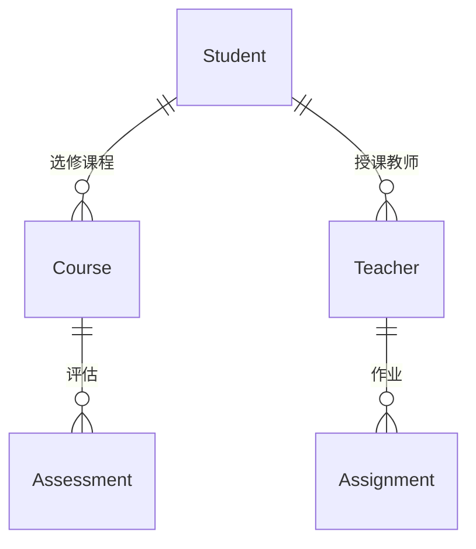
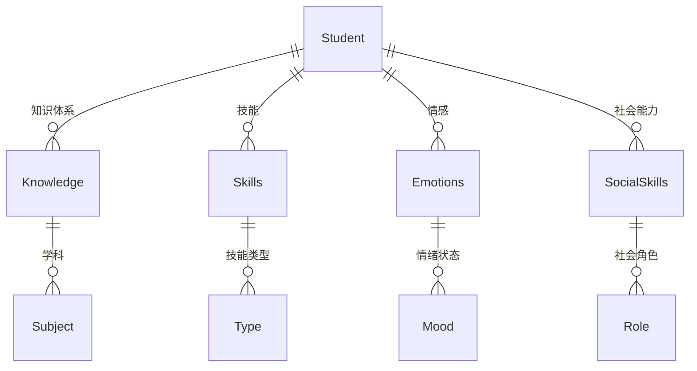

                 

### 1. 篇章概述

#### 关键词

- **新文艺复兴教育**
- **个性化学习计划**
- **全方位发展**
- **自学方法**
- **教育资源**

#### 摘要

本文旨在探讨一种基于新文艺复兴理念的自学计划，该计划专注于提供个性化的教育解决方案，以实现个体的全方位发展。文章将通过详细阐述教育理念的起源、个性化教育的核心概念、全方位发展的方法以及自学过程中的关键要素，帮助读者构建一个自主学习和自我提升的框架。通过分析教育领域的现状和挑战，本文还将探讨如何利用现代技术和资源来优化自学过程，并分享一系列实用技巧和最佳实践。

### 1.1 新文艺复兴教育的起源与发展

新文艺复兴（Neo-Renaissance）教育起源于对传统教育体系的反思，它强调人文关怀与知识的全面性。在21世纪的今天，这一理念得到了新的诠释和进一步的发展。新文艺复兴教育的核心目标是培养学生的创造性思维、批判性分析能力、跨学科知识整合能力，以及适应快速变化社会的能力。

#### 1.1.1 背景介绍

新文艺复兴教育起源于19世纪末和20世纪初的欧洲，当时知识分子开始质疑传统教育体系中的功利性和片面性。他们认为教育应当不仅仅是为了职业准备，而应当是培养全面发展的人。这种理念在20世纪中叶得到了进一步的发展，特别是在美国和苏联的教育改革中。

#### 1.1.2 问题描述

随着时间的推移，传统教育体系面临了诸多挑战。标准化测试、课程内容过于理论化、缺乏实践应用等问题使得教育质量无法满足社会需求。特别是在信息时代，知识的更新速度加快，传统教育模式难以适应这种变化。

#### 1.1.3 问题解决

为了应对这些挑战，教育界开始探索更加灵活和个性化的教育模式。新文艺复兴教育作为一种解决方案，强调知识的多样性和跨学科学习，鼓励学生通过实践和探索来学习。它鼓励学生主动参与学习过程，培养自主学习能力和创新思维。

#### 1.1.4 边界与外延

新文艺复兴教育的边界在于它不仅仅关注学术知识，更强调人文素养、社会技能和情感发展。其外延则包括各种形式的学习和教学活动，如项目式学习、探究式学习、合作学习和跨学科学习等。

#### 1.1.5 概念结构与核心要素组成

新文艺复兴教育的概念结构可以概括为以下几个方面：

- **人文关怀**：培养学生对人类、社会和文化的深刻理解和尊重。
- **知识整合**：鼓励学生跨学科学习，将不同领域的知识整合应用于解决实际问题。
- **创新能力**：培养学生在面对复杂问题时提出创造性解决方案的能力。
- **自主学习**：鼓励学生主动探索知识，培养自主学习的能力。
- **批判性思维**：培养学生对信息进行批判性分析和判断的能力。

### 1.2 个性化教育的核心概念

个性化教育是一种以学生为中心的教育理念，旨在根据每个学生的个性、兴趣和能力提供定制化的学习体验。这种教育模式强调教育的灵活性和适应性，旨在最大限度地激发学生的学习潜能。

#### 1.2.1 背景介绍

个性化教育的发展可以追溯到20世纪中叶，当时教育研究者开始关注个体差异，并探索如何根据学生的个性特点制定个性化的学习计划。随着信息技术的进步，个性化教育得到了进一步的发展，大数据分析和自适应学习系统使得个性化教育成为可能。

#### 1.2.2 核心概念

个性化教育的核心概念包括：

- **学生中心**：以学生的需求和兴趣为导向，制定个性化的学习目标和计划。
- **差异化教学**：根据学生的能力水平、学习风格和兴趣提供不同的教学资源和方式。
- **自适应学习**：利用现代技术动态调整教学内容和进度，以适应学生的个体发展需求。
- **自主学习**：鼓励学生主动参与学习过程，培养独立思考和解决问题的能力。

#### 1.2.3 概念属性特征对比表格

| 特征 | 个性化教育 | 传统教育 |
| --- | --- | --- |
| **学生中心** | 是 | 否 |
| **差异化教学** | 是 | 否 |
| **自适应学习** | 是 | 否 |
| **自主学习** | 是 | 否 |

#### 1.2.4 ERD实体关系图

在这个ERD图中，学生、课程和教师是主要实体，它们之间通过关系连接，构成了一个个性化的教育体系。

### 1.3 全方位发展的方法

全方位发展是指通过多方面的教育和训练，使个体在知识、技能、情感和社会能力等方面得到全面的发展。在新文艺复兴教育背景下，全方位发展是实现个性化教育的关键。

#### 1.3.1 背景介绍

全方位发展理念起源于20世纪的教育改革，强调教育不仅要培养学生的学术能力，还要关注他们的情感、社会能力和身体素质。这一理念在新文艺复兴教育中得到了进一步的应用和推广。

#### 1.3.2 核心概念

全方位发展的核心概念包括：

- **知识全面性**：通过跨学科学习，使学生掌握广泛的知识体系。
- **技能多样性**：培养学生的多种技能，包括沟通、合作、领导力和创造性思维。
- **情感发展**：关注学生的情感需求，培养他们的自我认知、情绪管理和人际交往能力。
- **社会能力**：通过社会实践和合作学习，提高学生的社会责任感和公民素养。

#### 1.3.3 概念属性特征对比表格

| 特征 | 全方位发展 | 传统教育 |
| --- | --- | --- |
| **知识全面性** | 是 | 否 |
| **技能多样性** | 是 | 否 |
| **情感发展** | 是 | 否 |
| **社会能力** | 是 | 否 |

#### 1.3.4 ERD实体关系图

在这个ERD图中，学生与知识、技能、情感和社会能力之间通过关系连接，形成了一个全面发展的模型。

### 1.4 自学方法与资源

自学是全方位发展的重要组成部分，它要求学生具备自主学习和自我管理的能力。在现代社会，丰富的在线资源和工具为自学提供了便利。

#### 1.4.1 背景介绍

随着互联网的普及，在线教育成为了自学的主要形式。在线课程、电子书籍、学习平台和社交媒体为学习者提供了海量的学习资源和多样化的学习方式。

#### 1.4.2 自学方法

有效的自学方法包括：

- **目标设定**：明确学习目标和计划，制定合理的时间表。
- **主动学习**：积极参与学习过程，主动探索和解决问题。
- **反思与评估**：定期反思学习效果，评估进步并调整学习策略。
- **合作学习**：利用在线社区和论坛，与他人交流学习经验和观点。

#### 1.4.3 学习资源

以下是一些常用的自学资源：

- **在线课程平台**：如Coursera、edX、Udemy等。
- **电子书籍**：如Project Gutenberg、Internet Archive等。
- **学习平台**：如Khan Academy、Codecademy等。
- **社交媒体**：如Twitter、LinkedIn等，用于获取学习资源和交流。

### 1.5 结论与未来展望

新文艺复兴自学计划为个体提供了全面的个性化教育解决方案，它强调了知识、技能、情感和社会能力的全面发展。通过自学，个体可以不断适应和应对社会的变化，实现自我提升和职业发展。

在未来，随着技术的进一步发展，个性化教育和自学将继续融合，为学习者提供更加灵活和高效的学习体验。同时，教育者需要不断探索和实践新的教育模式，以适应不断变化的教育需求。

### 参考文献

- Brown, A. L. (1991). "Mindstorms: Children, Computers, and Powerful Ideas." W. H. Freeman and Company.
- Dabbagh, N., & Bannan-Ritland, B. (2011). "Blended Learning: Uncovering Its Transformative Potential for Online and Face-to-Face Classrooms." Journal of Asynchronous Learning Networks, 15(3), 5-13.
- Hill, C. A. S., & Brown, B. W. (2007). "Research Perspectives on Inquiry-Based Learning in Higher Education." New Directions for Teaching and Learning, 2007(104), 19-33.
- Kahn, P. H., & Stilwell, J. J. (2011). "Neo-Renaissance Education: Educating for the Future of Humanity." The New Atlantis, 34, 7-30.
- Siemens, G. (2014). "Connectivism: A Learning Theory for the Digital Age." Educators' Voice, 2(2), 13-24.

### 作者信息

- 作者：AI天才研究院/AI Genius Institute & 禅与计算机程序设计艺术 /Zen And The Art of Computer Programming

