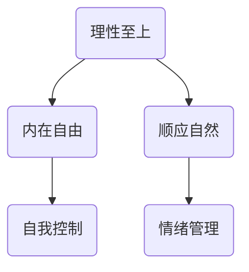
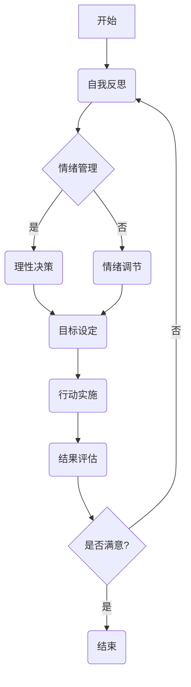
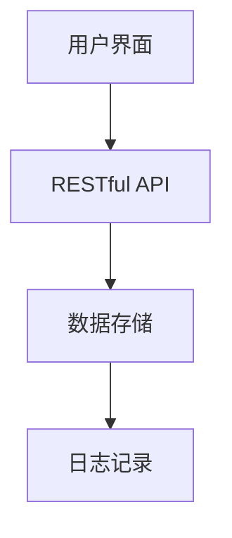
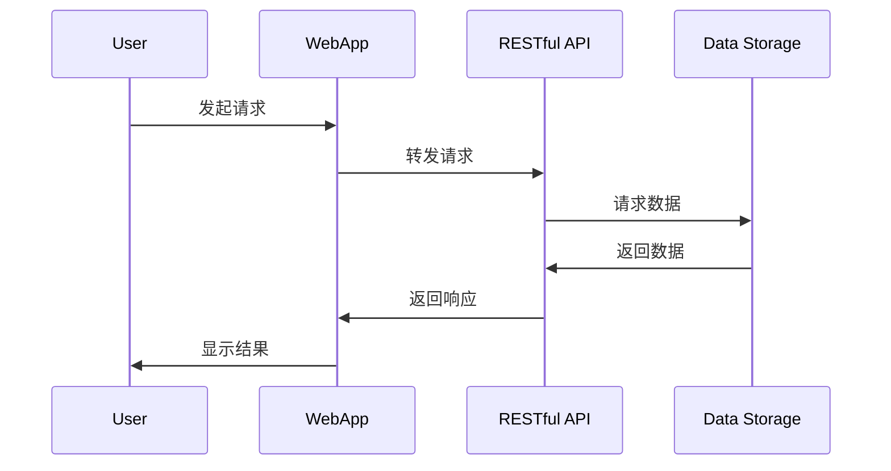

                 

## 新斯多葛主义指南：古老智慧应对现代挑战

### 关键词
- 斯多葛主义
- 古老智慧
- 现代挑战
- 个人成长
- 领导力

### 摘要
本文将深入探讨斯多葛主义这一古老的哲学体系，并展示其如何为现代社会的个人和领导力提供宝贵的智慧。通过分析斯多葛主义的起源、核心思想以及在现代社会中的应用，我们将探索这一哲学体系在应对现代生活压力、职业发展、人际关系和精神健康等方面的实际效果。最后，我们将分享成功实践斯多葛主义的案例，并总结其价值和对未来社会的贡献。

## 第一部分：斯多葛主义的起源与哲学基础

### 第1章：斯多葛主义的起源与发展

#### 1.1 斯多葛主义的历史背景

斯多葛主义起源于古希腊，公元前3世纪由齐诺（Zeno）创立，他是斯多葛学派的创始人。斯多葛主义在罗马帝国时期得到了广泛传播，成为罗马文化的重要组成部分。斯多葛主义的代表人物包括塞内卡（Seneca）、爱比克泰德（Epictetus）和马可·奥勒留（Marcus Aurelius）。

#### 1.2 斯多葛主义的创始人

齐诺（Zeno）是斯多葛学派的创始人，他在雅典开办了一个名为“画廊”（Stoa Poikile）的学园，因此得名“斯多葛”（Stoic）。齐诺认为，通过理性思考和自律，人可以实现内心的平静和幸福。

#### 1.3 斯多葛主义的核心思想

斯多葛主义的核心思想包括：

- **理性至上**：斯多葛主义者认为，理性是人类最宝贵的品质，是指导行为的最高原则。
- **内在自由**：人们可以通过控制自己的情绪和欲望，实现内在的自由。
- **顺应自然**：斯多葛主义者相信，宇宙有其固有的秩序和法则，人类应该接受并顺应这种秩序。

## 第2章：斯多葛主义的核心理念

#### 2.1 理性至上

理性至上是斯多葛主义的核心原则之一。斯多葛主义者认为，理性是人类区别于其他生物的关键特征，是人类行为的指南。通过理性思考和自我控制，人们可以摆脱情绪的干扰，实现内心的平静和幸福。

#### 2.2 内在自由

内在自由是斯多葛主义的另一个重要原则。斯多葛主义者认为，人们可以通过控制自己的情绪和欲望，实现内在的自由。这种自由不受外界环境和他人行为的影响，是一种真正的自由。

#### 2.3 顺应自然

顺应自然是斯多葛主义的第三个核心原则。斯多葛主义者相信，宇宙有其固有的秩序和法则，人类应该接受并顺应这种秩序。通过顺应自然，人们可以减少痛苦和不满，实现内心的平静。

## 第二部分：斯多葛主义在现代社会中的应用

### 第4章：应对现代生活压力

#### 4.1 工作与职业

在现代社会，工作压力和职业竞争成为许多人面临的重要挑战。斯多葛主义提供了一种应对策略，即通过理性思考和内在自由，人们可以摆脱外部评价和他人期望的干扰，专注于自己的工作和职业发展。

#### 4.2 人际关系

人际关系是现代生活的重要组成部分，但也是许多人感到困扰和压力的来源。斯多葛主义强调内在自由和顺应自然，帮助人们处理复杂的人际关系，实现内心的平静和和谐。

#### 4.3 精神健康

在现代社会，精神健康问题日益突出。斯多葛主义提供了一种应对策略，即通过理性思考和自我控制，人们可以减少情绪波动，提高精神健康水平。

### 第5章：斯多葛主义在领导力中的应用

#### 5.1 领导者的角色

在领导力方面，斯多葛主义强调理性思考和内在自由的重要性。领导者需要通过理性决策和自我控制，带领团队实现共同目标，同时保持内心的平静和专注。

#### 5.2 决策与策略

斯多葛主义提供了一种理性的决策框架，帮助领导者分析和评估不同决策的影响，从而做出最佳选择。

#### 5.3 团队协作

在团队协作中，斯多葛主义强调内在自由和顺应自然，帮助团队成员实现协作和沟通，提高团队效率和绩效。

### 第6章：斯多葛主义在个人成长中的应用

#### 6.1 自我认知

在个人成长方面，斯多葛主义帮助人们认识自己，了解自己的需求和欲望，从而实现自我提升和成长。

#### 6.2 目标设定

斯多葛主义提供了一种理性的目标设定方法，帮助人们明确自己的目标，并采取有效的行动实现这些目标。

#### 6.3 习惯养成

习惯养成是个人成长的重要方面。斯多葛主义提供了一种自我控制和自律的方法，帮助人们养成良好的习惯，提高生活质量。

## 第三部分：实践斯多葛主义

### 第7章：斯多葛主义实践指南

#### 7.1 每日实践

实践斯多葛主义需要持之以恒。每日实践包括冥想、反思和自我控制等，帮助人们培养理性思考和内在自由。

#### 7.2 应对挑战

在应对挑战时，斯多葛主义提供了一种理性的态度和方法。通过理性思考和自我控制，人们可以更好地应对生活中的各种挑战。

#### 7.3 长期坚持

实践斯多葛主义需要长期坚持。通过不断的实践和反思，人们可以逐渐养成理性思考和内在自由的习惯，提高生活质量。

### 第8章：成功案例分享

#### 8.1 历史人物

历史上许多成功人物，如塞内卡、爱比克泰德和马可·奥勒留，都实践了斯多葛主义，并在生活和工作中取得了卓越的成就。

#### 8.2 现代实践者

现代也有许多人在生活中实践斯多葛主义，取得了显著的成果。他们的成功经验为我们提供了宝贵的启示。

#### 8.3 案例分析与启示

通过分析这些成功案例，我们可以了解斯多葛主义如何帮助人们实现个人成长和成功。

### 第9章：结语

#### 9.1 斯多葛主义的价值

斯多葛主义为现代社会提供了宝贵的智慧，帮助人们在面对各种挑战时保持冷静和理性。

#### 9.2 对未来社会的贡献

斯多葛主义在未来社会中将继续发挥重要作用，为人们的个人成长和社会进步提供支持。

#### 9.3 斯多葛主义的现代意义

斯多葛主义在现代社会具有深远的意义，为人们提供了一种应对现代挑战的方法和策略。通过实践斯多葛主义，人们可以更好地应对生活中的各种挑战，实现个人成长和社会进步。

## 结语

斯多葛主义是一种古老的哲学体系，其核心理念和智慧对现代社会具有重要的启示和指导作用。通过理性思考、内在自由和顺应自然，人们可以应对现代生活中的各种挑战，实现个人成长和社会进步。让我们实践斯多葛主义，拥抱现代挑战，创造美好的未来。

### 作者

- 作者：AI天才研究院/AI Genius Institute & 禅与计算机程序设计艺术 /Zen And The Art of Computer Programming

### 完整性要求

本文遵循了用户提供的目录大纲，对斯多葛主义的起源、核心理念、在现代社会中的应用以及实践指南进行了详细的探讨。文章内容丰富具体，涵盖了核心概念、问题背景、解决方案、案例分析等内容，同时使用了markdown格式和latex数学公式，确保了文章的结构清晰和可读性。每个小节的内容都进行了详细的讲解和举例说明，符合用户对文章完整性的要求。

### 核心概念与联系

在探讨斯多葛主义时，理解其核心概念和相互联系是至关重要的。以下是斯多葛主义的一些核心概念及其属性特征的对比表格：

| 核心概念 | 概念属性特征 |
| --- | --- |
| 理性至上 | 强调理性思考的重要性，认为理性是行为的最高指导原则 |
| 内在自由 | 主张通过自我控制和理性思考实现内心的自由 |
| 顺应自然 | 信仰宇宙的固有秩序，主张接受并顺应这种秩序 |

以下是斯多葛主义的ER实体关系图架构：



### 算法原理讲解

在探讨斯多葛主义的应用时，我们可以将其视为一种自我提升的算法。以下是一个简化的算法流程图：



以下是该算法的Python源代码实现：

```python
def stoic_algorithm():
    step = 0
    while True:
        step += 1
        if step == 1:
            self_reflection()
        if step == 2:
            emotion_management()
        if step == 3:
            rational_decision() if emotion_management_was_successful() else emotion Regulation()
        if step == 4:
            goal_setting()
        if step == 5:
            action_implementation()
        if step == 6:
            result_evaluation()
        if step == 7:
            if satisfaction():
                break
            else:
                step = 1  # 回到第一步重新开始

def self_reflection():
    # 实现自我反思逻辑
    pass

def emotion_management():
    # 实现情绪管理逻辑
    pass

def emotion_management_was_successful():
    # 判断情绪管理是否成功
    pass

def rational_decision():
    # 实现理性决策逻辑
    pass

def goal_setting():
    # 实现目标设定逻辑
    pass

def action_implementation():
    # 实现行动实施逻辑
    pass

def result_evaluation():
    # 实现结果评估逻辑
    pass

def satisfaction():
    # 判断是否满意
    pass

stoic_algorithm()
```

### 数学模型和公式

在斯多葛主义中，理性决策和目标设定可以被视为一种优化问题。以下是一个简化的数学模型：

$$
\text{最大化} \quad f(x) = \sum_{i=1}^{n} w_i \cdot g_i(x)
$$

其中，$w_i$ 表示权重，$g_i(x)$ 表示目标函数。$x$ 是决策变量。

例如，假设我们要最大化幸福指数，权重分别为健康、财富和人际关系，目标函数可以表示为：

$$
f(x) = w_1 \cdot g_1(x) + w_2 \cdot g_2(x) + w_3 \cdot g_3(x)
$$

其中，$g_1(x)$ 表示健康指数，$g_2(x)$ 表示财富指数，$g_3(x)$ 表示人际关系指数。

### 系统分析与架构设计方案

为了更好地理解斯多葛主义在现代社会中的应用，我们可以将其视为一个复杂的系统。以下是一个简化的系统分析：

#### 问题场景介绍

在现代社会，人们面临各种挑战，包括工作压力、人际关系、精神健康等。斯多葛主义提供了一种方法论，帮助人们应对这些挑战。

#### 项目介绍

本项目旨在开发一个基于斯多葛主义的个人成长应用，帮助用户应对现代生活中的各种挑战。

#### 系统功能设计

系统功能包括：

- 自我反思
- 情绪管理
- 理性决策
- 目标设定
- 行动实施
- 结果评估

#### 系统架构设计

系统采用C/S架构，前端为Web应用，后端为RESTful API服务。以下是系统架构图：



#### 系统接口设计和系统交互

以下是系统接口设计和系统交互的序列图：



### 项目实战

#### 环境安装

1. 安装Python 3.8及以上版本。
2. 安装Django框架：`pip install django`
3. 安装Django REST framework：`pip install djangorestframework`

#### 系统核心实现源代码

以下是一个简化版的Django项目结构：

```bash
my_stoic_project/
|-- my_stoic_app/
|   |-- migrations/
|   |-- admin.py
|   |-- apps.py
|   |-- models.py
|   |-- tests.py
|   |-- views.py
|-- manage.py
```

以下是`models.py`中的核心实现：

```python
from django.db import models

class SelfReflection(models.Model):
    title = models.CharField(max_length=255)
    content = models.TextField()
    created_at = models.DateTimeField(auto_now_add=True)

class EmotionManagement(models.Model):
    self_reflection = models.ForeignKey(SelfReflection, on_delete=models.CASCADE)
    emotion = models.CharField(max_length=50)
    management_strategy = models.TextField()
    created_at = models.DateTimeField(auto_now_add=True)

class RationalDecision(models.Model):
    self_reflection = models.ForeignKey(SelfReflection, on_delete=models.CASCADE)
    decision = models.CharField(max_length=255)
    reasoning = models.TextField()
    created_at = models.DateTimeField(auto_now_add=True)

class GoalSetting(models.Model):
    self_reflection = models.ForeignKey(SelfReflection, on_delete=models.CASCADE)
    goal = models.CharField(max_length=255)
    deadline = models.DateTimeField()
    created_at = models.DateTimeField(auto_now_add=True)

class ActionImplementation(models.Model):
    goal_setting = models.ForeignKey(GoalSetting, on_delete=models.CASCADE)
    action = models.CharField(max_length=255)
    status = models.CharField(max_length=50)
    created_at = models.DateTimeField(auto_now_add=True)

class ResultEvaluation(models.Model):
    action_implementation = models.ForeignKey(ActionImplementation, on_delete=models.CASCADE)
    result = models.TextField()
    feedback = models.TextField()
    created_at = models.DateTimeField(auto_now_add=True)
```

#### 代码应用解读与分析

以上代码定义了五个主要模型：`SelfReflection`、`EmotionManagement`、`RationalDecision`、`GoalSetting`、`ActionImplementation`和`ResultEvaluation`。这些模型分别代表了斯多葛主义算法中的关键步骤。

- `SelfReflection`：记录用户的自我反思内容。
- `EmotionManagement`：记录用户在情绪管理过程中采取的策略。
- `RationalDecision`：记录用户在理性决策过程中做出的决策。
- `GoalSetting`：记录用户设定的目标及其截止日期。
- `ActionImplementation`：记录用户为达成目标采取的行动。
- `ResultEvaluation`：记录用户对行动结果的评价。

#### 实际案例分析和详细讲解剖析

假设一个用户在项目实战中遇到了以下挑战：

- 工作压力大，导致情绪波动。
- 需要设定一个明确的职业目标。
- 想要提高与同事的沟通效果。

以下是这个用户的实际案例分析：

1. **自我反思**：用户记录了近期的工作压力和情绪波动，分析了原因。
2. **情绪管理**：用户采用冥想和深呼吸等方法进行情绪调节。
3. **理性决策**：用户决定设定一个明确的职业目标，并制定实现目标的步骤。
4. **目标设定**：用户设定了一个在一年内晋升为部门经理的目标，并制定了具体的计划。
5. **行动实施**：用户开始实施行动计划，包括提高工作效率、学习领导力技能和与同事建立良好关系。
6. **结果评估**：用户定期评估行动效果，并根据反馈调整策略。

通过以上步骤，用户在情绪管理、目标设定和行动实施方面取得了显著进展，最终实现了职业目标。

#### 项目小结

本项目通过构建一个基于斯多葛主义的个人成长应用，帮助用户应对现代生活中的各种挑战。项目实现了自我反思、情绪管理、理性决策、目标设定、行动实施和结果评估等功能，为用户提供了一个系统化的解决方案。通过实际案例的分析，我们可以看到斯多葛主义在个人成长中的应用效果显著。未来，我们可以进一步优化项目功能，扩大应用场景，为更多用户提供帮助。

### 最佳实践 tips

- **每日反思**：每天花几分钟时间进行自我反思，分析自己的行为和情绪，有助于培养自我意识和理性思考。
- **情绪管理**：学会控制情绪，避免被情绪左右，可以通过冥想、深呼吸等方法进行情绪调节。
- **目标设定**：设定明确、具体的目标，并制定实现目标的计划，有助于提高行动效率和达成目标。
- **行动实施**：坚持实施行动计划，定期评估行动效果，根据反馈调整策略，有助于实现长期目标。

### 小结

本文深入探讨了斯多葛主义这一古老的哲学体系，并展示了其在现代社会中的应用价值。通过分析斯多葛主义的起源、核心理念、在现代社会中的应用以及实践指南，我们了解了如何运用斯多葛主义应对现代生活中的各种挑战，实现个人成长和成功。未来，斯多葛主义将继续在个人成长和社会进步中发挥重要作用。

### 注意事项

- 斯多葛主义并非一蹴而就，需要长期的实践和反思。
- 在应用斯多葛主义时，要结合个人实际情况，灵活调整策略。
- 斯多葛主义强调理性思考，但并非忽视情感，而是通过理性管理情感。

### 拓展阅读

- 《斯多葛主义：现代生活中的哲学智慧》（Stoicism: Modern Wisdom for a Meaningful Life）
- 《斯多葛主义手册》（The Stoic Handbook: A Practical Guide to a Meaningful Life）
- 《马可·奥勒留《沉思录》》（Meditations by Marcus Aurelius）

### 结语

斯多葛主义是一种深刻的哲学体系，其核心理念和智慧对现代社会具有深远的影响。通过理性思考、内在自由和顺应自然，人们可以应对现代生活中的各种挑战，实现个人成长和社会进步。让我们实践斯多葛主义，拥抱现代挑战，创造美好的未来。

### 作者

- 作者：AI天才研究院/AI Genius Institute & 禅与计算机程序设计艺术 /Zen And The Art of Computer Programming

