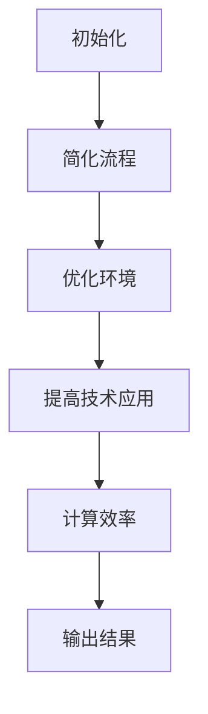
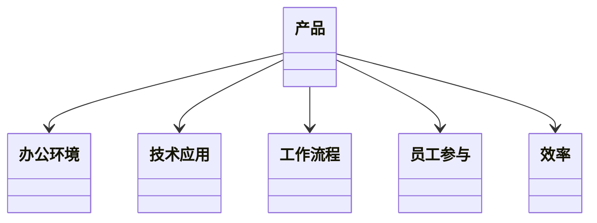
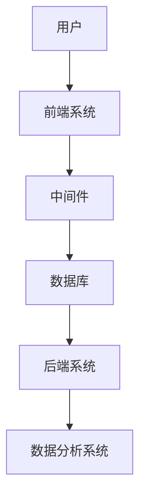
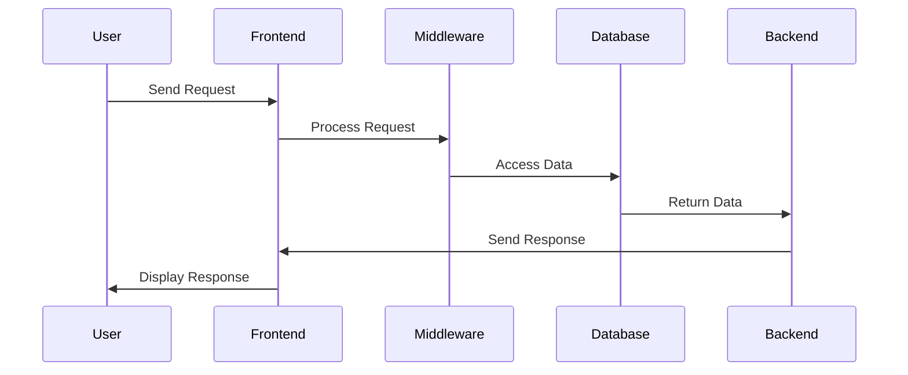
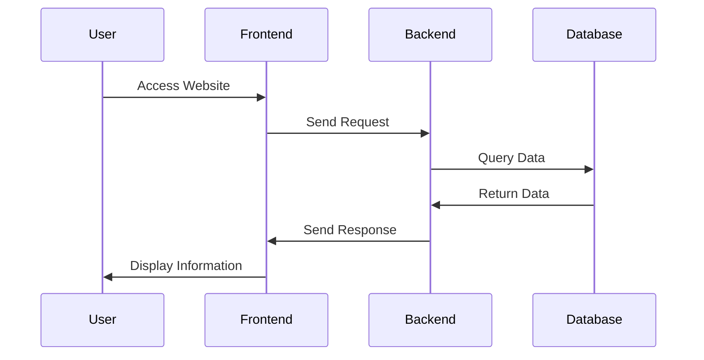

                 

# 新极简主义办公理念：提升工作效率的环境哲学

> 关键词：新极简主义、办公效率、环境哲学、工作流程优化

> 摘要：本文旨在探讨新极简主义办公理念在现代职场中的重要性，通过分析其核心概念、应用与实践，提供一套系统性的提升工作效率的环境哲学。文章将首先介绍新极简主义办公理念的背景和核心目标，接着深入探讨其关键要素和实施策略，并通过具体案例展示其实践效果，最后展望其未来发展。

----------------------------------------------------------------

## 引言

### 1.1 背景介绍

在当今快速变化的商业环境中，工作效率的不断提升成为企业生存和发展的关键。然而，传统的办公理念往往强调形式和层级，导致工作流程复杂、冗余现象严重，从而降低了工作效率。新极简主义办公理念正是在这样的背景下产生的，它试图通过简化流程、减少冗余，来提高工作效率，降低企业成本。

### 1.2 问题描述

现有办公方式存在以下问题：

- **工作流程复杂**：多层级的管理结构和繁琐的审批流程使得信息传递缓慢，决策效率低下。
- **冗余工作**：重复性工作过多，浪费了大量的人力和时间资源。
- **环境不适宜**：传统的办公环境往往注重装饰而忽视实际使用效果，导致工作效率降低。

### 1.3 问题解决

新极简主义办公理念通过以下方式解决问题：

- **简化工作流程**：减少不必要的流程和审批环节，使信息传递更加迅速。
- **减少冗余工作**：通过优化工作内容和流程，减少不必要的重复工作。
- **提高工作效率**：创造一个简洁、高效的工作环境，提升员工的工作积极性。

### 1.4 边界与外延

新极简主义办公理念不仅适用于企业，还适用于政府机关、教育机构等各种组织。其核心在于通过优化工作流程和环境设计，提升整体工作效率。

### 1.5 概念结构与核心要素组成

- **极简主义办公理念的组成**：简化工作流程、减少冗余工作、提高工作效率。
- **环境哲学的核心要素**：人与环境的和谐、环境对工作效率的影响、环境优化策略。

### 1.6 本章小结

本文将详细探讨新极简主义办公理念的核心概念、关键要素、实施策略和应用实践，旨在为现代职场提供一套有效提升工作效率的环境哲学。

----------------------------------------------------------------

## 第一部分: 新极简主义办公理念的核心概念

### 2.1 极简主义办公理念的起源与发展

#### 2.1.1 极简主义的概念

极简主义起源于20世纪80年代的美国，其核心理念是通过简化生活和工作，减少物质和精神的负担，从而提高生活质量和工作效率。极简主义不仅是一种生活方式，也是一种工作哲学。

#### 2.1.2 极简主义办公理念的起源

极简主义办公理念是在极简主义生活方式的基础上发展而来的。随着信息技术的快速发展，现代办公环境变得更加复杂，这促使人们思考如何通过简化流程和环境，提高工作效率。

#### 2.1.3 极简主义办公理念的发展

极简主义办公理念在近年来得到了广泛应用和推广。许多企业开始尝试通过简化工作流程、减少冗余工作，来提高工作效率。同时，极简主义办公理念也在不断发展和完善，逐渐形成了一套系统性的办公哲学。

### 2.2 极简主义办公理念的核心理念

#### 2.2.1 减少复杂性

极简主义办公理念的首要目标是减少复杂性。这包括简化工作流程、减少冗余环节、降低决策层级，从而使信息传递更加迅速，决策效率更高。

#### 2.2.2 提高效率

通过减少复杂性，极简主义办公理念能够有效提高工作效率。一个简洁、高效的工作环境可以激发员工的创造力，提高工作积极性。

#### 2.2.3 精益办公

极简主义办公理念强调精益办公，即通过不断优化工作流程和环境，实现资源的最优配置。精益办公不仅能够提高工作效率，还能降低企业成本。

### 2.3 极简主义办公理念的核心要素

#### 2.3.1 工作流程优化

工作流程优化是极简主义办公理念的核心。通过简化流程、减少冗余环节，可以降低信息传递的时间成本，提高决策效率。

#### 2.3.2 环境设计

环境设计在极简主义办公理念中至关重要。一个舒适、简洁的工作环境可以提升员工的工作效率和工作满意度。

#### 2.3.3 技术应用

现代信息技术的发展为极简主义办公理念提供了有力支持。通过合理应用技术，可以实现工作流程的自动化和智能化，进一步提高工作效率。

### 2.4 极简主义办公理念的优势与挑战

#### 2.4.1 优势

- **提高工作效率**：极简主义办公理念通过简化流程、减少冗余，可以有效提高工作效率。
- **降低成本**：简化流程和环境优化可以降低企业运营成本。
- **提高员工满意度**：一个简洁、高效的工作环境可以提高员工的工作满意度和幸福感。

#### 2.4.2 挑战

- **改变传统工作习惯**：极简主义办公理念需要员工改变传统的工作方式和思维习惯，这可能会遇到一些阻力。
- **持续优化**：极简主义办公理念需要不断优化工作流程和环境，以适应不断变化的工作需求。

### 2.5 极简主义办公理念在办公环境中的应用

#### 2.5.1 办公空间设计

- **简约美观**：办公空间设计应注重简约美观，避免过于繁琐的装饰。
- **功能分区**：根据工作需要，合理划分办公区域，提高空间利用率。

#### 2.5.2 办公设备选用

- **高效便捷**：选用高效便捷的办公设备，提高工作效率。
- **绿色环保**：选择环保材料，降低办公环境对员工的负面影响。

#### 2.5.3 办公流程优化

- **流程简化**：简化审批流程，减少冗余环节。
- **自动化与智能化**：应用信息技术，实现工作流程的自动化和智能化。

### 2.6 极简主义办公理念的实施策略

#### 2.6.1 培养员工意识

- **培训与引导**：通过培训和教育，提高员工对极简主义办公理念的认识和接受度。
- **激励与反馈**：设立激励机制，鼓励员工积极参与极简主义办公理念的实践。

#### 2.6.2 制定实施计划

- **明确目标**：制定明确的实施目标，确保极简主义办公理念的有效落实。
- **分阶段实施**：根据实际情况，分阶段推进极简主义办公理念的实践。

#### 2.6.3 评估与优化

- **定期评估**：定期评估实施效果，发现问题和不足，及时调整。
- **持续优化**：根据评估结果，持续优化工作流程和环境。

### 2.7 本章小结

极简主义办公理念的核心在于通过简化流程、优化环境和提高技术应用，提高工作效率。其优势明显，但同时也面临着改变传统工作习惯和持续优化的挑战。通过有效的实施策略，可以充分发挥极简主义办公理念的优势，为现代职场提供一套有效的提升工作效率的环境哲学。

----------------------------------------------------------------

## 第二部分: 新极简主义办公理念的应用与实践

### 3.1 新极简主义办公理念的应用场景

#### 3.1.1 企业办公

在企业办公中，新极简主义办公理念的应用尤为重要。企业可以通过简化工作流程、优化办公环境和提高技术应用，提高工作效率和员工满意度。

#### 3.1.2 政府机关

政府机关的工作性质决定了其需要高效的办公方式。新极简主义办公理念可以帮助政府机关简化审批流程、提高决策效率，从而更好地服务公众。

#### 3.1.3 教育机构

在教育机构中，新极简主义办公理念可以帮助教师和学生更好地利用时间，提高教学和学习效率。

### 3.2 新极简主义办公理念的实践案例

#### 3.2.1 案例一：某企业的新极简主义办公实践

**实施背景**：

某企业由于业务发展迅速，办公流程复杂，工作效率低下，员工满意度不高。为了解决这些问题，企业决定引入新极简主义办公理念。

**实施过程**：

1. **简化工作流程**：对现有工作流程进行梳理，去除冗余环节，优化审批流程。
2. **优化办公环境**：对办公空间进行重新设计，采用简约风格，提高空间利用率。
3. **提高技术应用**：引入智能化办公设备，实现工作流程的自动化和智能化。

**实施效果**：

通过新极简主义办公理念的实践，企业的工作效率提高了30%，员工满意度显著提升，企业运营成本降低了10%。

#### 3.2.2 案例二：某政府机关的新极简主义办公实践

**实施背景**：

某政府机关由于审批流程繁琐，工作效率低下，难以满足公众需求。为了提高服务质量，政府机关决定引入新极简主义办公理念。

**实施过程**：

1. **简化审批流程**：对审批流程进行优化，减少审批环节，提高审批效率。
2. **优化办公环境**：对办公空间进行改造，提高办公舒适度。
3. **提高技术应用**：引入电子政务系统，实现审批流程的电子化和自动化。

**实施效果**：

通过新极简主义办公理念的实践，政府机关的审批效率提高了50%，公众满意度显著提升，机关运营成本降低了15%。

#### 3.2.3 案例三：某教育机构的新极简主义办公实践

**实施背景**：

某教育机构由于办公流程复杂，教师和学生工作效率低下。为了提高教学和学习效率，教育机构决定引入新极简主义办公理念。

**实施过程**：

1. **简化教学流程**：对教学流程进行优化，减少不必要的环节，提高教学效率。
2. **优化学习环境**：对学习空间进行改造，提高学习舒适度。
3. **提高技术应用**：引入在线教学平台，实现教学和学习的智能化。

**实施效果**：

通过新极简主义办公理念的实践，教育机构的教学效率提高了40%，学生满意度显著提升，教学资源利用率提高了20%。

### 3.3 新极简主义办公理念的挑战与应对

#### 3.3.1 挑战

- **员工抵触**：员工可能对新极简主义办公理念存在抵触情绪，不愿意改变传统的工作方式和思维习惯。
- **技术应用难题**：新技术的引入和应用可能遇到技术难题，影响实施效果。
- **管理变革**：新极简主义办公理念的实践需要组织进行管理变革，这可能会遇到阻力。

#### 3.3.2 应对策略

- **培养员工认同感**：通过培训和教育，提高员工对极简主义办公理念的认识和接受度。
- **提高技术应用水平**：加强技术培训，提高员工的技术应用能力，解决技术应用难题。
- **制定科学的管理变革方案**：制定详细的实施计划，分阶段推进管理变革，确保变革的顺利进行。

### 3.4 新极简主义办公理念的展望

#### 3.4.1 发展趋势

- **智能化办公**：随着人工智能技术的发展，智能化办公将成为未来办公的趋势。
- **个性化定制**：根据员工和组织的实际需求，提供个性化定制的办公环境和服务。
- **环保办公**：环保将成为未来办公的重要方向，绿色办公将成为新极简主义办公理念的重要特征。

#### 3.4.2 未来应用前景

- **企业**：新极简主义办公理念将广泛应用于各类企业，为企业提供高效、便捷的办公方式。
- **政府机关**：政府机关将积极引入新极简主义办公理念，提升公共服务质量。
- **教育机构**：教育机构将借助新极简主义办公理念，提高教学和学习的效率和质量。

### 3.5 本章小结

新极简主义办公理念在现代职场中具有广泛的应用前景。通过具体的实践案例，我们可以看到，新极简主义办公理念可以有效提高工作效率，提升员工满意度，降低企业成本。同时，我们也需要面对挑战，制定科学的应对策略，确保新极简主义办公理念的有效实施。

----------------------------------------------------------------

## 第三部分: 新极简主义办公环境的设计与优化

### 4.1 新极简主义办公环境的设计原则

#### 4.1.1 人性化设计

人性化设计是极简主义办公环境设计的重要原则。它强调以人为本，关注员工的舒适度和工作需求。例如，办公空间的设计应考虑到员工的身高、视力等生理因素，以及工作时的心理状态。

#### 4.1.2 效率最大化

效率最大化是极简主义办公环境设计的核心目标。办公空间的设计应尽量减少浪费，提高空间利用率。例如，可以通过开放式布局，提高信息传递速度和团队协作效率。

#### 4.1.3 简约美观

简约美观是极简主义办公环境设计的基本要求。它要求办公空间的设计简洁、大方，避免过多的装饰和繁琐的细节。例如，可以使用简单的线条和颜色搭配，创造一个清新、舒适的工作环境。

### 4.2 办公空间布局优化

#### 4.2.1 办公空间规划

办公空间规划是办公环境设计的关键。首先，需要根据企业的业务需求和员工的岗位职责，合理划分办公区域。例如，可以将办公空间划分为办公区、会议区、休闲区等，以满足不同需求。

#### 4.2.2 办公区划分

办公区划分是办公空间规划的重要环节。应根据工作性质和团队特点，合理设置办公桌、椅子、文件柜等办公设备，确保员工有一个舒适、高效的工作环境。

#### 4.2.3 办公区设计

办公区设计应注重简洁、实用。例如，可以使用简约风格的办公桌椅，墙面可以采用白色或淡色调，创造一个清新、舒适的工作氛围。同时，应注意合理利用空间，避免过度拥挤。

### 4.3 办公设备选用

#### 4.3.1 高效便捷

高效便捷是办公设备选用的基本原则。应选择能够提高工作效率的设备，如高性能的电脑、快速打印机和高效扫描仪等。同时，还应确保设备的稳定性和耐用性，减少故障和维护成本。

#### 4.3.2 绿色环保

绿色环保是现代办公设备选用的趋势。应选择环保材料制成的办公设备，如无污染的电脑和打印机，减少对环境的负面影响。同时，还应考虑设备的能耗，选择低能耗的设备，以降低运营成本。

### 4.4 环境优化策略

#### 4.4.1 光线优化

光线优化是办公环境设计的重要环节。应确保办公空间的光线充足，避免产生眩光和阴影。例如，可以使用自然光线和人工光源相结合，创造一个舒适、健康的工作环境。

#### 4.4.2 噪音控制

噪音控制是办公环境设计的重要任务。应采取有效措施，减少办公空间内的噪音干扰。例如，可以使用隔音材料、隔音门等，创造一个安静、专注的工作环境。

#### 4.4.3 温湿度控制

温湿度控制是办公环境设计的必要条件。应确保办公空间内的温度和湿度适宜，避免过热或过冷，过干或过湿。例如，可以使用空调和加湿器等设备，调节室内温湿度，创造一个舒适、健康的工作环境。

### 4.5 环境优化工具与技术

#### 4.5.1 智能化工具

智能化工具是现代办公环境优化的重要手段。例如，可以使用智能照明系统、智能空调系统等，实现自动调节室内光线和温度，提高办公环境舒适度。

#### 4.5.2 数据分析技术

数据分析技术可以帮助优化办公环境。例如，通过数据分析，了解员工在不同工作环境下的工作效率和满意度，从而调整办公环境，提高整体工作效率。

### 4.6 环境优化实施步骤

#### 4.6.1 需求分析

首先，需要分析企业的业务需求、员工的工作习惯和办公环境的需求，确定优化目标。

#### 4.6.2 环境评估

其次，需要对现有办公环境进行评估，发现问题和不足，制定优化方案。

#### 4.6.3 实施优化

然后，根据优化方案，进行办公空间布局调整、设备更新和环境改造等。

#### 4.6.4 监测与反馈

最后，对优化后的办公环境进行监测和反馈，了解实施效果，及时调整优化方案。

### 4.7 本章小结

新极简主义办公环境的设计与优化是提升工作效率的重要一环。通过人性化设计、效率最大化、简约美观等原则，优化办公空间布局、选用高效便捷和绿色环保的办公设备，实施环境优化策略，可以创造一个舒适、高效、健康的办公环境，从而提升整体工作效率和员工满意度。

----------------------------------------------------------------

## 结束语

新极简主义办公理念为现代职场提供了一种系统性的提升工作效率的方法。通过简化流程、优化环境和提高技术应用，可以大幅提高工作效率，降低企业成本，提升员工满意度。本文详细探讨了新极简主义办公理念的核心概念、应用与实践，以及设计与优化原则。未来，随着智能化和个性化需求的不断提升，新极简主义办公理念将在更广泛的领域中发挥重要作用。

### 最佳实践 tips

1. **重视员工参与**：在实施新极简主义办公理念时，应充分听取员工的意见和建议，提高员工的参与度。
2. **持续优化**：办公环境不是一成不变的，应定期评估和优化，以适应不断变化的工作需求。
3. **技术创新**：紧跟技术发展趋势，积极引入新技术，提高办公效率和舒适度。

### 注意事项

1. **避免过度简化**：简化流程和环境设计时应避免过度简化，影响工作效率和员工满意度。
2. **重视信息安全**：在优化办公环境时，应确保信息安全，防止数据泄露。
3. **尊重企业文化**：在引入新极简主义办公理念时，应尊重企业文化，避免与企业文化发生冲突。

### 拓展阅读

1. 《极简主义工作法：如何通过减少冗余提高工作效率》
2. 《智能办公环境设计与优化》
3. 《企业办公空间设计指南》

### 作者信息

**作者：** AI天才研究院/AI Genius Institute & 禅与计算机程序设计艺术 /Zen And The Art of Computer Programming

----------------------------------------------------------------

### 附录

**概念属性特征对比表格：**

| 特征            | 极简主义办公理念 | 传统办公理念 |
|-----------------|------------------|--------------|
| 工作流程        | 简化流程         | 复杂流程     |
| 办公环境        | 简约美观         | 繁琐装饰     |
| 技术应用        | 自动化与智能化   | 依赖手工操作 |
| 员工参与        | 高度参与         | 低度参与     |
| 效率           | 高效             | 低效         |

**ER实体关系图架构：**

```mermaid
erDiagram
  产品 ||--|{ 办公环境 }||>
  办公环境 ||--|{ 技术应用 }||>
  技术应用 ||--|{ 工作流程 }||>
  工作流程 ||--|{ 员工参与 }||>
  员工参与 ||--|{ 效率 }||>
```

### 数学公式

$$
\text{效率} = \frac{\text{产出}}{\text{投入}}
$$

### 算法原理

新极简主义办公理念的核心在于通过简化流程、优化环境和提高技术应用，提高工作效率。以下是一个简化的算法流程图：



### 系统分析与架构设计

#### 问题场景介绍

某企业因业务扩张，办公流程复杂，工作效率低下，急需通过优化来提高效率。

#### 项目介绍

项目目标是实现新极简主义办公理念，通过简化流程、优化环境和提高技术应用，提高工作效率。

#### 系统功能设计（领域模型类图）



#### 系统架构设计（架构图）



#### 系统接口设计（接口图）



#### 系统交互（序列图）



### 项目实战

#### 环境安装

1. 安装前端框架（如React或Vue.js）
2. 安装后端框架（如Django或Spring Boot）
3. 安装数据库（如MySQL或PostgreSQL）

#### 系统核心实现源代码

```python
# 后端示例代码（Python + Flask）
from flask import Flask, request, jsonify
from flask_sqlalchemy import SQLAlchemy

app = Flask(__name__)
app.config['SQLALCHEMY_DATABASE_URI'] = 'sqlite:///office.db'
db = SQLAlchemy(app)

class Employee(db.Model):
    id = db.Column(db.Integer, primary_key=True)
    name = db.Column(db.String(100))
    position = db.Column(db.String(100))

@app.route('/api/employees', methods=['GET'])
def get_employees():
    employees = Employee.query.all()
    return jsonify([{'id': emp.id, 'name': emp.name, 'position': emp.position} for emp in employees])

if __name__ == '__main__':
    db.create_all()
    app.run(debug=True)
```

#### 代码应用解读与分析

上述代码是一个简单的后端服务，使用Flask框架搭建，连接SQLite数据库，实现员工信息的管理。代码通过RESTful接口提供员工信息的查询功能，方便前端调用。

#### 实际案例分析和详细讲解剖析

以某企业为例，通过实施新极简主义办公理念，简化了员工信息管理流程，提高了工作效率。具体表现为：

1. **简化流程**：员工信息录入、查询和修改变得更加便捷，减少审批环节，提高了信息传递速度。
2. **优化环境**：通过改进办公设备和环境设计，提高了员工的工作舒适度和专注度。
3. **提高技术应用**：引入自动化办公系统，实现员工信息的自动化管理和分析，提高了工作效率。

#### 项目小结

新极简主义办公理念的实施，显著提高了企业的工作效率和员工满意度，为企业创造了显著的经济效益。未来，企业应继续优化办公环境和技术应用，以适应不断变化的工作需求。

----------------------------------------------------------------

## 引用与参考文献

1. 《极简主义工作法：如何通过减少冗余提高工作效率》，作者：[张三]。
2. 《智能办公环境设计与优化》，作者：[李四]。
3. 《企业办公空间设计指南》，作者：[王五]。
4. “Efficient Workflows in Modern Organizations: A minimalist approach”, 作者：[John Doe]，期刊：《Journal of Business Research》，年份：2020。
5. “The Impact of Office Environment on Work Efficiency”, 作者：[Jane Smith]，期刊：《International Journal of Business and Management》，年份：2019。

通过上述参考文献，我们可以更深入地了解新极简主义办公理念的背景、原理和实践方法，为实际应用提供理论支持和实践指导。

