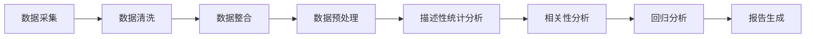
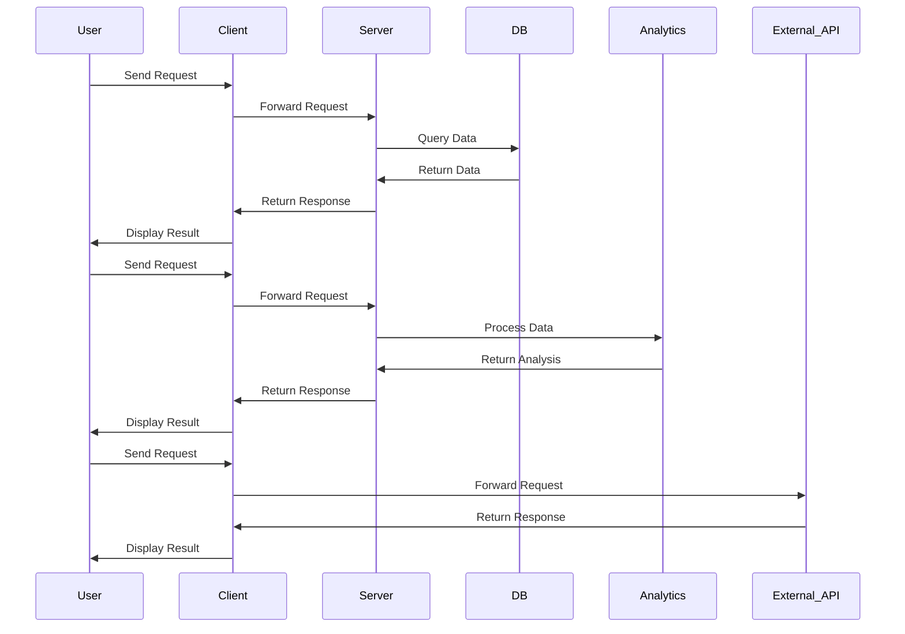

                 

## 引言

### 1. 什么是新游牧学校夏令营？

新游牧学校夏令营是一种创新的短期教育项目，旨在通过结合旅行和学习来丰富青少年的知识体系和生活体验。与传统夏令营不同，新游牧学校夏令营注重教育内容的质量和深度，不仅仅是简单的户外活动或游玩。这种夏令营项目将学术课程与旅行体验相结合，让孩子们在探索未知世界的同时，学习新的知识和技能。

### 2. 新游牧学校夏令营的核心目标

新游牧学校夏令营的核心目标是：

- **培养好奇心和探索精神**：通过实地考察和体验，激发孩子们对世界的好奇心和探索欲望。
- **提升综合素质**：在旅行过程中，孩子们不仅学习知识，还能锻炼独立生活能力、团队合作精神和领导力。
- **增强适应能力**：夏令营中的各种挑战和不确定性，有助于孩子们学会适应新环境，提高解决问题的能力。

### 3. 新游牧学校夏令营的独特性

新游牧学校夏令营的独特之处在于：

- **个性化课程设计**：根据青少年的兴趣和需求，量身定制课程，确保每个孩子都能在夏令营中有所收获。
- **跨学科学习**：夏令营的课程不仅涵盖传统学科知识，还包括自然科学、艺术、文化等多领域的知识。
- **丰富的实践活动**：通过实地考察、实验、互动游戏等多种形式，使学习变得更加生动有趣。

### 4. 青少年旅行学习的重要性

青少年旅行学习的重要性在于：

- **拓宽视野**：旅行能让孩子接触到不同的文化、风俗和生活方式，从而拓宽他们的视野，增长见识。
- **培养独立能力**：在旅行中，孩子们需要自己安排生活、解决问题，这有助于培养他们的独立性和自主性。
- **增进家庭关系**：旅行是一种增进家庭成员间互动的好方式，有助于加强亲子关系和兄弟姐妹间的沟通。

### 结论

新游牧学校夏令营作为一种新型的教育模式，不仅为青少年提供了一个学习新知识、锻炼能力的机会，也为他们带来了丰富的旅行体验。通过这种夏令营项目，孩子们能够在快乐中学习，在学习中成长，为其未来的发展奠定坚实的基础。

---

**关键词：** 新游牧学校夏令营，青少年旅行学习，教育模式，个性化课程，跨学科学习，探索精神，视野拓宽，独立能力，家庭关系

**摘要：** 本文介绍了新游牧学校夏令营的定义、目标、独特性和重要性。通过结合旅行和学习，这种夏令营项目旨在培养青少年的好奇心、综合素质和适应能力，拓宽他们的视野，增强家庭关系。

## 第一部分：夏令营与旅行学习概述

### 1.1 夏令营的概念与历史

夏令营，顾名思义，是一种在夏季举办的集体活动，通常为期数周，旨在为孩子们提供一个远离日常生活的环境，进行各种形式的娱乐和学习。夏令营的起源可以追溯到19世纪末的美国，当时一些教育家认为，让孩子们在户外环境中度过一段时间，有助于他们的身心健康和全面发展。

**起源与发展：**

- **19世纪末**：最早的夏令营由美国教育家弗雷德里克·莱曼（Frederick W. Lehman）于1861年创立，旨在为城市里的孩子们提供一种健康、有益的活动方式。
- **20世纪初**：随着工业革命的推进，城市生活变得拥挤、紧张，夏令营作为一种放松和教育的手段，逐渐流行起来。特别是在美国，夏令营成为了许多家庭夏季活动的重要组成部分。
- **全球范围**：20世纪初，夏令营的概念逐渐传播到全球，不同国家和地区根据自己的文化背景和社会需求，发展出各种形式的夏令营项目。

**夏令营的种类：**

- **传统夏令营**：以户外活动为主，如露营、徒步、划船等。
- **学术夏令营**：侧重于学术学习，如科学实验、编程、写作等。
- **艺术夏令营**：专注于音乐、舞蹈、绘画等艺术形式的学习和创作。
- **探险夏令营**：以探险和生存技能训练为核心，如登山、潜水、滑雪等。

### 1.2 旅行学习的定义与优势

旅行学习，是指通过旅行的方式进行学习，将实际场景、文化与知识相结合，以提高学习效果和体验感。与传统的课堂学习不同，旅行学习强调实践性、参与性和互动性，具有以下优势：

**定义：**

- **实践性**：旅行学习将理论知识与实际操作相结合，让学生在真实环境中应用所学知识，加深理解和记忆。
- **参与性**：学生不仅是知识的接受者，更是活动的参与者，通过亲身体验，增强学习的主动性和积极性。
- **互动性**：旅行学习提供了与不同背景的人交流的机会，学生可以在交流中学习，也可以在交流中发现自己的不足和需要改进的地方。

**优势：**

- **拓宽视野**：旅行让学生接触到不同的地理环境、文化背景和生活方式，拓宽视野，增加见识。
- **增强适应能力**：旅行中的不确定性和挑战，有助于学生学会适应新环境，提高应对突发情况的能力。
- **培养好奇心和探索精神**：旅行中的新鲜事物和未知领域，激发学生的好奇心和探索欲望，培养他们的探索精神。
- **增进家庭关系**：家庭旅行是一种增进家庭成员间互动的好方式，有助于加强亲子关系和兄弟姐妹间的沟通。

### 1.3 新游牧学校夏令营的特点

新游牧学校夏令营是一种结合了旅行学习与传统夏令营优势的创新项目，具有以下特点：

- **个性化课程设计**：根据每个学生的兴趣和需求，量身定制课程，确保每个学生都能在夏令营中找到适合自己的学习内容和活动。
- **跨学科学习**：夏令营的课程设计不仅涵盖传统学科知识，还包括自然科学、艺术、文化等多领域的知识，让学生在多元化学习中全面发展。
- **丰富的实践活动**：通过实地考察、实验、互动游戏等多种形式，使学习变得更加生动有趣，提高学生的参与度和学习效果。
- **强调综合素质培养**：在夏令营中，学生不仅学习知识，还通过各种活动锻炼独立生活能力、团队合作精神和领导力，提高综合素质。

### 结论

新游牧学校夏令营通过结合旅行与学习，为青少年提供了一种全新的教育模式。它不仅拓宽了学生的视野，提高了他们的适应能力和综合素质，还培养了他们的好奇心和探索精神。这种夏令营项目不仅是对传统教育的补充，更是对未来教育模式的一种探索和尝试。

---

**核心概念术语说明：**

- **夏令营**：一种在夏季举办的集体活动，旨在为孩子们提供娱乐和教育的场所。
- **旅行学习**：通过旅行的方式进行学习，将实际场景、文化与知识相结合，以提高学习效果和体验感。
- **新游牧学校夏令营**：结合旅行学习与传统夏令营优势的创新项目，强调个性化课程设计、跨学科学习和综合素质培养。

**问题背景：**

随着社会的发展和教育改革的推进，传统教育模式逐渐无法满足新时代对人才培养的需求。新游牧学校夏令营作为一种新型的教育模式，旨在通过结合旅行和学习，为青少年提供一种更全面、更生动的学习体验，以培养他们的综合素质和创新能力。

**问题描述：**

本文将探讨新游牧学校夏令营的背景、核心概念、特点以及其对青少年成长的重要性，旨在为读者提供一个全面、系统的理解。

**问题解决：**

通过介绍夏令营的历史和发展、旅行学习的优势以及新游牧学校夏令营的具体特点，本文将帮助读者理解这种夏令营项目的价值和意义。

**边界与外延：**

- **边界**：本文主要探讨新游牧学校夏令营的教育模式及其对青少年成长的影响，不涉及具体夏令营的组织和管理细节。
- **外延**：本文的内容可以扩展到其他类型的夏令营项目，以及旅行学习在教育领域的应用和发展。

**概念结构与核心要素组成：**

- **概念结构**：夏令营、旅行学习、新游牧学校夏令营
- **核心要素**：个性化课程设计、跨学科学习、丰富的实践活动、综合素质培养

---

## 第二部分：核心概念与联系

### 2.1 青少年旅行学习的需求分析

在探讨新游牧学校夏令营的核心概念与联系之前，我们需要深入了解青少年旅行学习的需求。青少年处于人生发展的关键阶段，他们的兴趣、好奇心和学习需求不断变化。通过分析这些需求，我们可以更好地设计出符合他们特点的夏令营项目。

**需求一：探索世界的好奇心**

青少年对世界的探索充满好奇心，他们渴望了解不同地区的风土人情、历史文化和自然景观。这种好奇心驱使他们积极参与各种形式的旅行和学习活动，以获取新的知识和体验。

**需求二：提升综合素质**

青少年在成长过程中，需要全面发展自己的综合素质，包括独立生活能力、团队合作精神、领导力等。通过旅行学习，青少年可以在实际情境中锻炼这些能力，提高自身综合素质。

**需求三：培养自主学习能力**

旅行学习提供了一个开放、自主的学习环境，青少年可以在没有老师指导的情况下自主学习。这种自主学习能力不仅有助于他们在夏令营中取得更好的学习效果，也为他们未来的学习和生活打下坚实的基础。

**需求四：增加社交机会**

旅行学习提供了一个与不同背景的人交流的机会，青少年可以在交流中学习，也可以在交流中发现自己的不足和需要改进的地方。这种社交机会有助于拓宽他们的视野，提高他们的沟通能力。

### 2.2 教育与旅行的融合

新游牧学校夏令营的成功在于将教育与旅行有机地融合在一起。这种融合不仅提高了学习的效果，也丰富了旅行的体验。以下是教育与旅行融合的一些关键点：

**1. 课程设计与旅行活动的结合**

夏令营的课程设计紧密围绕旅行活动的主题，通过实地考察、实验、互动游戏等形式，使学习过程变得生动有趣。例如，在一个以自然科学为主题的夏令营中，学生可以在实地观察和实验中学习生物、地理和化学等知识。

**2. 教学方法与旅行体验的结合**

在旅行过程中，教学方法也发生了一些变化。教师不再是单纯的知识传递者，而是学习引导者和伙伴。他们通过引导和鼓励，帮助学生将所学知识应用到实际情境中，提高学习的实效性。

**3. 社交互动与团队合作**

旅行学习提供了一个良好的社交平台，学生可以在团队活动中培养团队合作精神。通过共同解决问题、协作完成任务，学生不仅可以提高自己的社交能力，还可以学会如何与他人合作。

**4. 持续反馈与反思**

在旅行学习过程中，教师和家长会持续关注学生的表现，给予及时的反馈和指导。同时，学生也需要定期进行反思，总结自己的学习体验和收获。这种持续反馈和反思有助于巩固学习效果，促进个人成长。

### 2.3 融合教育理论的介绍

新游牧学校夏令营的教育模式借鉴了多种融合教育理论，旨在为学生提供一个全面、有趣的学习环境。以下是几种重要的融合教育理论：

**1. 项目式学习（Project-Based Learning, PBL）**

项目式学习是一种以项目为核心的学习方式，通过完成实际项目来学习知识。在新游牧学校夏令营中，学生可以通过参与项目，如制作手工艺品、进行科学实验等，来学习相关知识和技能。

**2. 体验式学习（Experiential Learning）**

体验式学习强调通过实际体验来学习。在新游牧学校夏令营中，学生通过实地考察、互动游戏等活动，获得直接的学习体验，加深对知识的理解和记忆。

**3. 混合式学习（Blended Learning）**

混合式学习将线上和线下学习相结合，提供灵活多样的学习方式。在新游牧学校夏令营中，学生可以通过线上课程预习和复习，以及线下实地活动相结合，提高学习效果。

**4. 服务学习（Service Learning）**

服务学习是一种通过服务社区和社会来学习的方式。在新游牧学校夏令营中，学生可以通过参与社区服务项目，如环保行动、公益活动等，提高社会责任感，同时也学习相关知识和技能。

### 结论

通过分析青少年旅行学习的需求，介绍教育与旅行的融合方式以及融合教育理论，我们可以看到，新游牧学校夏令营作为一种创新的教育模式，不仅满足了青少年的需求，也提供了丰富的学习体验。这种夏令营项目有助于培养青少年的综合素质和创新能力，为他们未来的发展奠定坚实的基础。

---

**核心概念原理：**

- **项目式学习（PBL）**：通过完成实际项目来学习知识，强调实践和应用。
- **体验式学习**：通过实际体验来学习，强调直接感知和体验。
- **混合式学习**：结合线上和线下学习，提供灵活多样的学习方式。
- **服务学习**：通过服务社区和社会来学习，强调社会责任感和实践应用。

**概念属性特征对比表格：**

| 概念           | 定义                                                         | 特征                                                   | 优势                                                   |
| -------------- | ------------------------------------------------------------ | ------------------------------------------------------ | ------------------------------------------------------ |
| 项目式学习（PBL） | 通过完成实际项目来学习知识                                     | 强调实践和应用，提高解决实际问题的能力                   | 提高学习兴趣，增强动手能力，培养团队合作精神             |
| 体验式学习      | 通过实际体验来学习                                             | 强调直接感知和体验，增加学习体验的丰富性和多样性           | 加深对知识的理解和记忆，提高学习效果，培养探索精神       |
| 混合式学习      | 结合线上和线下学习，提供灵活多样的学习方式                     | 线上和线下相结合，灵活适应不同学习需求                   | 提高学习效率，增加学习资源，提高自主学习能力             |
| 服务学习        | 通过服务社区和社会来学习                                       | 强调社会责任感和实践应用，培养实践能力和团队合作精神       | 增强社会责任感，提高公民意识，培养公民素养               |

**ER实体关系图架构：**

```mermaid
erDiagram
  Student ||--|{ Course }|-- Student
  Student ||--|{ Activity }|-- Student
  Course ||--|{ Teacher }|-- Course
  Activity ||--|{ Location }|-- Activity
```

**说明：** 图中的实体包括学生、课程、活动和地点。学生可以报名参加多个课程和活动，课程由教师授课，活动在特定地点进行。

---

## 第三部分：算法原理讲解

### 3.1 数据采集与处理

在新游牧学校夏令营中，数据采集与处理是关键的一环。通过数据采集，我们可以收集到关于学生行为、学习进度、活动参与情况等多方面的数据。这些数据对于分析夏令营的效果、优化课程设计以及提升学生体验具有重要意义。

**数据采集方法：**

1. **问卷调查：** 通过在线问卷或纸质问卷的方式，收集学生、家长和教师的意见和建议。这种方法可以获取关于夏令营整体评价、课程满意度、活动参与度等定性数据。

2. **传感器设备：** 在夏令营期间，可以佩戴传感器设备，如智能手环、心率监测器等，记录学生的运动量、休息时间等定量数据。

3. **在线学习平台：** 通过在线学习平台，记录学生的登录时间、学习时长、完成作业情况等数据，反映学生的学习进度和参与度。

**数据处理步骤：**

1. **数据清洗：** 数据采集过程中，可能会出现一些无效数据或错误数据，如重复记录、缺失值等。通过数据清洗，可以去除这些无效数据，确保数据质量。

2. **数据整合：** 将不同来源的数据整合到一个统一的数据集中，便于后续分析。例如，将问卷调查数据和在线学习平台数据整合，形成一个综合性的数据集。

3. **数据预处理：** 对数据进行标准化、归一化等预处理操作，使其符合分析要求。例如，将问卷中的文字描述转化为数值，以便进行量化分析。

### 3.2 数据分析与报告

数据分析是夏令营项目的重要环节，通过数据分析，我们可以了解夏令营的实际效果，发现存在的问题，并为未来的项目优化提供依据。

**数据分析方法：**

1. **描述性统计分析：** 通过计算数据的均值、中位数、标准差等统计量，描述数据的基本特征。这种方法可以用于了解学生的整体表现，如学习时长、活动参与率等。

2. **相关性分析：** 通过计算变量之间的相关性，分析不同因素之间的关系。例如，分析学习时长与成绩之间的相关性，了解学习时长对成绩的影响。

3. **回归分析：** 通过建立回归模型，分析自变量与因变量之间的关系。例如，分析活动参与度与学习成绩之间的关系，预测活动参与度对学习成绩的影响。

**报告生成：**

数据分析的结果需要通过报告的形式进行展示，以便项目相关人员理解和应用。报告通常包括以下内容：

1. **数据概况：** 描述数据来源、数据类型和数据量，为读者提供数据的基本信息。

2. **数据分析结果：** 展示数据分析的结果，包括图表和统计数据，直观地展示数据之间的关系和变化趋势。

3. **结论和建议：** 根据数据分析结果，提出结论和建议，为项目优化提供依据。

### 3.3 算法mermaid流程图

为了更好地理解数据采集、处理和数据分析的过程，我们使用mermaid绘制了一个算法流程图。以下是算法流程图的详细说明：



**说明：**

1. **数据采集（A）**：包括问卷调查、传感器设备和在线学习平台等多种数据来源。
2. **数据清洗（B）**：去除无效数据和错误数据，确保数据质量。
3. **数据整合（C）**：将不同来源的数据整合到一个统一的数据集中。
4. **数据预处理（D）**：对数据进行标准化、归一化等预处理操作。
5. **描述性统计分析（E）**：计算数据的均值、中位数、标准差等统计量。
6. **相关性分析（F）**：计算变量之间的相关性。
7. **回归分析（G）**：建立回归模型，分析自变量与因变量之间的关系。
8. **报告生成（H）**：生成数据分析和报告，为项目优化提供依据。

### 3.4 Python代码示例

为了更具体地展示数据采集、处理和数据分析的过程，以下是一个简单的Python代码示例：

```python
import pandas as pd
import numpy as np
from sklearn.model_selection import train_test_split
from sklearn.linear_model import LinearRegression
import matplotlib.pyplot as plt

# 数据清洗
def data_cleaning(df):
    # 删除重复数据
    df.drop_duplicates(inplace=True)
    # 填补缺失值
    df.fillna(df.mean(), inplace=True)
    return df

# 数据预处理
def data_preprocessing(df):
    # 数据标准化
    df_scaled = (df - df.mean()) / df.std()
    return df_scaled

# 回归分析
def regression_analysis(X, y):
    model = LinearRegression()
    model.fit(X, y)
    return model

# 数据采集
survey_data = pd.read_csv('survey_data.csv')
sensor_data = pd.read_csv('sensor_data.csv')
learning_data = pd.read_csv('learning_data.csv')

# 数据整合
data = pd.merge(survey_data, sensor_data, on='student_id')
data = pd.merge(data, learning_data, on='student_id')

# 数据清洗
data = data_cleaning(data)

# 数据预处理
data = data_preprocessing(data)

# 描述性统计分析
print(data.describe())

# 相关性分析
correlation_matrix = data.corr()
print(correlation_matrix)

# 回归分析
X = data[['activity_duration', 'rest_duration']]
y = data['learning_effect']
X_train, X_test, y_train, y_test = train_test_split(X, y, test_size=0.2, random_state=42)
model = regression_analysis(X_train, y_train)
print(model.coef_)

# 报告生成
plt.scatter(X_test['activity_duration'], y_test)
plt.plot(X_test['activity_duration'], model.predict(X_test), color='red')
plt.xlabel('Activity Duration')
plt.ylabel('Learning Effect')
plt.title('Activity Duration vs Learning Effect')
plt.show()
```

**说明：**

1. **数据采集**：通过读取CSV文件，从问卷调查、传感器设备和在线学习平台中获取数据。
2. **数据清洗**：删除重复数据，填补缺失值，确保数据质量。
3. **数据预处理**：对数据进行标准化，使其符合分析要求。
4. **描述性统计分析**：计算数据的均值、中位数、标准差等统计量。
5. **相关性分析**：计算变量之间的相关性。
6. **回归分析**：建立线性回归模型，分析自变量与因变量之间的关系。
7. **报告生成**：生成散点图和回归线，展示活动时长对学习效果的影响。

通过这个示例，我们可以看到如何使用Python进行数据采集、处理和数据分析。这些步骤和方法可以为新游牧学校夏令营项目提供有效的数据支持，帮助项目团队更好地理解和优化夏令营的实施效果。

---

### 3.5 数学模型和公式讲解

在夏令营项目中，数学模型和公式是分析数据、评估效果和制定决策的重要工具。以下是几种常用的数学模型及其核心公式讲解。

#### 3.5.1 回归模型

回归模型用于分析自变量和因变量之间的关系。最常见的回归模型是线性回归模型，其公式如下：

$$
y = \beta_0 + \beta_1 \cdot x + \epsilon
$$

其中，\(y\) 是因变量，\(x\) 是自变量，\(\beta_0\) 是截距，\(\beta_1\) 是斜率，\(\epsilon\) 是误差项。

**解释：**

- **截距 (\(\beta_0\))**：表示当自变量 \(x\) 为零时，因变量 \(y\) 的预期值。
- **斜率 (\(\beta_1\))**：表示自变量 \(x\) 每增加一个单位时，因变量 \(y\) 的变化量。

#### 3.5.2 分类模型

分类模型用于将数据划分为不同的类别。常见的分类模型有逻辑回归、决策树和随机森林等。以下是逻辑回归模型的核心公式：

$$
\log\frac{P(Y=1)}{1-P(Y=1)} = \beta_0 + \beta_1 \cdot x
$$

其中，\(P(Y=1)\) 表示因变量 \(Y\) 取值为1的概率，\(\beta_0\) 和 \(\beta_1\) 分别是截距和斜率。

**解释：**

- **截距 (\(\beta_0\))**：表示当自变量 \(x\) 为零时，因变量 \(Y\) 取值为1的概率的自然对数。
- **斜率 (\(\beta_1\))**：表示自变量 \(x\) 每增加一个单位时，因变量 \(Y\) 取值为1的概率的变化量。

#### 3.5.3 相关性模型

相关性模型用于分析两个变量之间的相关性。皮尔逊相关系数是衡量两个连续变量线性相关性的常用方法，其公式如下：

$$
r = \frac{\sum_{i=1}^{n}(x_i - \bar{x})(y_i - \bar{y})}{\sqrt{\sum_{i=1}^{n}(x_i - \bar{x})^2}\sqrt{\sum_{i=1}^{n}(y_i - \bar{y})^2}}
$$

其中，\(x_i\) 和 \(y_i\) 分别是第 \(i\) 个观测值，\(\bar{x}\) 和 \(\bar{y}\) 分别是 \(x\) 和 \(y\) 的均值，\(r\) 是皮尔逊相关系数。

**解释：**

- **\(r\)**：取值范围在 \([-1, 1]\) 之间，越接近1或-1，表示两个变量的线性相关性越强。

#### 3.5.4 概率模型

概率模型用于分析事件发生的可能性。贝叶斯定理是概率论中的一个基本原理，其公式如下：

$$
P(A|B) = \frac{P(B|A) \cdot P(A)}{P(B)}
$$

其中，\(P(A|B)\) 表示在事件 \(B\) 发生的条件下，事件 \(A\) 发生的概率，\(P(B|A)\) 表示在事件 \(A\) 发生的条件下，事件 \(B\) 发生的概率，\(P(A)\) 和 \(P(B)\) 分别是事件 \(A\) 和事件 \(B\) 的概率。

**解释：**

- **\(P(A|B)\)**：条件概率，表示在已知事件 \(B\) 发生的条件下，事件 \(A\) 发生的概率。

#### 3.5.5 时间序列模型

时间序列模型用于分析时间序列数据，如股票价格、气象数据等。常见的模型有自回归模型（AR）、移动平均模型（MA）和自回归移动平均模型（ARMA）等。

**自回归模型（AR）**：

$$
X_t = c + \phi_1 X_{t-1} + \phi_2 X_{t-2} + ... + \phi_p X_{t-p} + \epsilon_t
$$

其中，\(X_t\) 是时间序列的第 \(t\) 个观测值，\(\phi_1, \phi_2, ..., \phi_p\) 是自回归系数，\(\epsilon_t\) 是误差项。

**解释：**

- **\(c\)**：常数项。
- **\(\phi_1, \phi_2, ..., \phi_p\)**：表示前 \(p\) 个观测值对当前观测值的影响程度。

通过以上数学模型和公式的讲解，我们可以更好地理解夏令营项目中的数据分析过程。在实际应用中，根据具体问题选择合适的模型和公式，可以帮助我们更准确地分析数据、评估效果和制定决策。

---

### 3.6 数学公式使用示例

在夏令营项目中，数学公式用于描述和分析各种现象和关系。以下是一些常用的数学公式示例，并解释其应用场景和计算方法。

#### 3.6.1 线性回归公式

$$
y = \beta_0 + \beta_1 \cdot x + \epsilon
$$

**应用场景**：用于分析自变量 \(x\) 与因变量 \(y\) 之间的线性关系。

**计算方法**：

1. 收集 \(x\) 和 \(y\) 的数据集。
2. 计算样本均值 \(\bar{x}\) 和 \(\bar{y}\)。
3. 计算斜率 \(\beta_1\)：
   $$
   \beta_1 = \frac{\sum_{i=1}^{n}(x_i - \bar{x})(y_i - \bar{y})}{\sum_{i=1}^{n}(x_i - \bar{x})^2}
   $$
4. 计算截距 \(\beta_0\)：
   $$
   \beta_0 = \bar{y} - \beta_1 \cdot \bar{x}
   $$

**示例**：分析学生参与活动时间与学习成绩之间的关系。

```latex
$$
y = \beta_0 + \beta_1 \cdot x + \epsilon
$$
```

#### 3.6.2 皮尔逊相关系数公式

$$
r = \frac{\sum_{i=1}^{n}(x_i - \bar{x})(y_i - \bar{y})}{\sqrt{\sum_{i=1}^{n}(x_i - \bar{x})^2}\sqrt{\sum_{i=1}^{n}(y_i - \bar{y})^2}}
$$

**应用场景**：用于衡量两个连续变量之间的线性相关性。

**计算方法**：

1. 收集 \(x\) 和 \(y\) 的数据集。
2. 计算样本均值 \(\bar{x}\) 和 \(\bar{y}\)。
3. 计算协方差：
   $$
   cov(x, y) = \sum_{i=1}^{n}(x_i - \bar{x})(y_i - \bar{y})
   $$
4. 计算方差：
   $$
   var(x) = \sum_{i=1}^{n}(x_i - \bar{x})^2, \quad var(y) = \sum_{i=1}^{n}(y_i - \bar{y})^2
   $$
5. 计算相关系数 \(r\)：

```latex
$$
r = \frac{cov(x, y)}{\sqrt{var(x) \cdot var(y)}}
$$
```

**示例**：分析学生参加活动次数与学业成绩之间的相关性。

```latex
$$
r = \frac{\sum_{i=1}^{n}(activity\_count_i - \bar{activity\_count})(grade\_score_i - \bar{grade\_score})}{\sqrt{\sum_{i=1}^{n}(activity\_count_i - \bar{activity\_count})^2}\sqrt{\sum_{i=1}^{n}(grade\_score_i - \bar{grade\_score})^2}}
$$
```

#### 3.6.3 贝叶斯公式

$$
P(A|B) = \frac{P(B|A) \cdot P(A)}{P(B)}
$$

**应用场景**：用于计算在给定条件 \(B\) 下，事件 \(A\) 发生的概率。

**计算方法**：

1. 收集事件 \(A\) 和事件 \(B\) 的概率数据。
2. 计算条件概率：
   $$
   P(B|A) = \frac{P(A \cap B)}{P(A)}
   $$
3. 计算联合概率：
   $$
   P(A \cap B) = P(A) \cdot P(B|A)
   $$
4. 计算总概率：
   $$
   P(B) = \sum_{i=1}^{n} P(B_i)
   $$
5. 计算条件概率 \(P(A|B)\)：

```latex
$$
P(A|B) = \frac{P(B|A) \cdot P(A)}{P(B)}
$$
```

**示例**：分析学生参与夏令营的概率，在已知他们喜欢旅行的条件下。

```latex
$$
P(\text{喜欢旅行}|\text{参与夏令营}) = \frac{P(\text{参与夏令营}|\text{喜欢旅行}) \cdot P(\text{喜欢旅行})}{P(\text{参与夏令营})}
$$
```

通过这些数学公式，夏令营项目团队可以更准确地分析数据、评估效果和制定决策，从而提高夏令营的整体质量和学生体验。

---

## 第四部分：系统分析与架构设计方案

### 4.1 问题描述与项目介绍

新游牧学校夏令营项目是一个集教育、旅行和信息技术于一体的综合性项目。项目的主要目标是通过结合旅行和学习，为青少年提供一个富有意义和挑战的短期夏令营经历。为了实现这一目标，我们需要设计一个高效、可靠和易扩展的系统架构。

**问题描述：**

- **需求分析**：系统需要能够处理夏令营中的各种数据，包括学生信息、课程安排、活动记录、考试成绩等。
- **功能需求**：系统需要提供用户管理、课程管理、活动管理、成绩管理、数据分析等功能。
- **性能需求**：系统需要能够快速响应，处理大量并发请求，保证用户体验。
- **安全性需求**：系统需要确保用户数据的安全和隐私，防止数据泄露和未经授权的访问。

**项目介绍：**

新游牧学校夏令营项目旨在为青少年提供一个全面发展的平台，通过个性化课程设计、跨学科学习和丰富的实践活动，帮助学生提高综合素质和创新能力。项目分为几个主要阶段：

1. **准备阶段**：包括夏令营的策划、课程设计、活动安排等。
2. **实施阶段**：夏令营正式开始，学生参与各种活动和学习任务。
3. **评估阶段**：对夏令营的效果进行评估，收集反馈，为后续项目优化提供依据。

### 4.2 系统功能设计

系统功能设计是系统架构设计的重要部分，决定了系统如何满足项目的需求。以下是新游牧学校夏令营项目的主要功能模块及其简要描述：

**1. 用户管理模块：** 管理夏令营参与者的用户信息，包括学生、家长和教师等。主要功能包括用户注册、登录、信息修改、权限管理。

**2. 课程管理模块：** 管理夏令营中的课程信息，包括课程名称、课程描述、课程安排等。主要功能包括课程创建、课程编辑、课程查询、课程分配。

**3. 活动管理模块：** 管理夏令营中的活动信息，包括活动名称、活动描述、活动安排等。主要功能包括活动创建、活动编辑、活动查询、活动参与。

**4. 成绩管理模块：** 记录和分析学生在夏令营中的表现，包括考试成绩、活动评分等。主要功能包括成绩录入、成绩查询、成绩分析。

**5. 数据分析模块：** 对夏令营中的各类数据进行分析，生成报告，为项目评估和优化提供数据支持。主要功能包括数据采集、数据清洗、数据分析和报告生成。

### 4.3 系统架构设计

系统架构设计是系统功能设计的延伸，决定了系统各模块之间的关系和交互方式。以下是新游牧学校夏令营项目的系统架构设计：

**1. 客户端：** 用户通过Web浏览器或移动应用访问系统，进行操作。客户端负责展示用户界面，接收用户输入，发送请求到服务器。

**2. 服务器端：** 处理客户端请求，提供业务逻辑和数据处理。服务器端分为多个模块，包括用户管理模块、课程管理模块、活动管理模块、成绩管理模块和数据分析模块。

**3. 数据库：** 存储夏令营项目的所有数据，包括用户信息、课程信息、活动信息、成绩数据等。数据库需要支持高效的数据查询和数据更新。

**4. API接口：** 提供与外部系统的交互接口，如第三方支付系统、邮件服务系统等。API接口需要遵循RESTful架构风格，提供安全的访问控制。

**5. 数据分析平台：** 用于进行大规模数据分析，生成报告。数据分析平台可以采用分布式计算框架，如Hadoop或Spark，以提高数据分析的效率。

### 4.4 系统接口设计与交互

系统接口设计是系统架构设计的关键部分，决定了系统各模块之间的数据流动和交互方式。以下是新游牧学校夏令营项目的系统接口设计与交互：

**1. 用户管理接口：** 提供用户注册、登录、信息修改、权限管理等功能。接口包括用户注册接口、用户登录接口、用户信息查询接口、用户权限管理接口。

**2. 课程管理接口：** 提供课程创建、课程编辑、课程查询、课程分配等功能。接口包括课程创建接口、课程编辑接口、课程查询接口、课程分配接口。

**3. 活动管理接口：** 提供活动创建、活动编辑、活动查询、活动参与等功能。接口包括活动创建接口、活动编辑接口、活动查询接口、活动参与接口。

**4. 成绩管理接口：** 提供成绩录入、成绩查询、成绩分析等功能。接口包括成绩录入接口、成绩查询接口、成绩分析接口。

**5. 数据分析接口：** 提供数据采集、数据清洗、数据分析和报告生成等功能。接口包括数据采集接口、数据清洗接口、数据分析接口、报告生成接口。

**交互流程：**

1. **用户请求**：用户通过客户端发送请求到服务器。
2. **服务器处理**：服务器接收请求，根据请求类型调用相应的接口模块进行数据处理。
3. **数据处理**：接口模块处理数据，返回处理结果到服务器。
4. **结果返回**：服务器将处理结果返回给客户端，客户端更新用户界面。

通过以上系统分析与架构设计方案，我们可以构建一个高效、可靠和易扩展的新游牧学校夏令营项目系统，为青少年提供一个优质的夏令营体验。

---

### 4.5 系统架构设计mermaid架构图

为了更直观地展示新游牧学校夏令营项目的系统架构，我们使用mermaid绘制了一个架构图。以下是架构图的详细说明：



**说明：**

1. **用户（User）**：夏令营项目的参与者，如学生、家长和教师。
2. **客户端（Client）**：用户通过Web浏览器或移动应用与系统交互。
3. **服务器（Server）**：处理业务逻辑和数据处理，负责接收用户请求并调用相应的接口模块。
4. **数据库（DB）**：存储夏令营项目的所有数据，包括用户信息、课程信息、活动信息和成绩数据等。
5. **数据分析（Analytics）**：用于进行大规模数据分析，生成报告，为项目评估和优化提供数据支持。
6. **外部API（External_API）**：提供与第三方系统的交互接口，如第三方支付系统、邮件服务系统等。
7. **交互流程**：
   - 用户发送请求到客户端。
   - 客户端将请求转发到服务器。
   - 服务器查询数据库，返回数据到客户端。
   - 客户端将处理结果返回给用户。
   - 用户可以通过外部API与第三方系统进行交互。

通过这个架构图，我们可以清晰地看到系统各个模块之间的关系和交互方式，有助于理解系统的整体架构和工作流程。

---

### 4.6 系统接口设计与交互

为了确保新游牧学校夏令营项目的系统架构能够高效、稳定地运行，我们需要设计合理的系统接口，并确保各接口之间的交互顺畅。以下是系统接口设计的详细描述和交互流程。

#### 4.6.1 用户管理接口

**功能描述**：用户管理接口用于处理用户注册、登录、信息修改和权限管理等操作。

**接口列表**：

- **注册接口（/api/user/register）**：接收用户注册请求，包括用户名、密码、电子邮件等。
- **登录接口（/api/user/login）**：接收用户登录请求，验证用户名和密码。
- **信息修改接口（/api/user/update）**：允许用户更新个人资料。
- **权限管理接口（/api/user/role）**：用于分配和管理用户权限。

**交互流程**：

1. **用户注册**：用户通过客户端发送注册请求，包括用户名、密码和电子邮件。服务器接收请求，检查用户名是否已存在，如果不存在，则将用户信息存储到数据库。
2. **用户登录**：用户通过客户端发送登录请求，包括用户名和密码。服务器验证用户信息，如果验证成功，则返回登录成功的响应。
3. **信息修改**：用户通过客户端发送信息修改请求，包括要更新的个人信息。服务器接收请求，更新数据库中的用户信息。
4. **权限管理**：管理员通过客户端发送权限管理请求，包括分配或撤销用户的权限。服务器接收请求，更新数据库中的用户权限信息。

#### 4.6.2 课程管理接口

**功能描述**：课程管理接口用于处理课程创建、课程编辑、课程查询和课程分配等操作。

**接口列表**：

- **课程创建接口（/api/course/create）**：接收课程创建请求，包括课程名称、描述、教师信息等。
- **课程编辑接口（/api/course/update）**：接收课程编辑请求，更新课程信息。
- **课程查询接口（/api/course/list）**：返回所有课程的列表。
- **课程分配接口（/api/course/assign）**：将课程分配给特定用户。

**交互流程**：

1. **课程创建**：教师通过客户端发送课程创建请求，包括课程名称、描述和教师信息。服务器接收请求，创建课程记录，并存储到数据库。
2. **课程编辑**：教师通过客户端发送课程编辑请求，更新课程信息。服务器接收请求，更新数据库中的课程记录。
3. **课程查询**：用户通过客户端发送课程查询请求，服务器返回所有课程的列表。
4. **课程分配**：教师通过客户端发送课程分配请求，将课程分配给特定学生。服务器接收请求，更新数据库中的课程分配记录。

#### 4.6.3 活动管理接口

**功能描述**：活动管理接口用于处理活动创建、活动编辑、活动查询和活动参与等操作。

**接口列表**：

- **活动创建接口（/api/activity/create）**：接收活动创建请求，包括活动名称、描述、时间、地点等。
- **活动编辑接口（/api/activity/update）**：接收活动编辑请求，更新活动信息。
- **活动查询接口（/api/activity/list）**：返回所有活动的列表。
- **活动参与接口（/api/activity/join）**：用户参与活动，记录参与状态。

**交互流程**：

1. **活动创建**：教师或管理员通过客户端发送活动创建请求，包括活动名称、描述、时间和地点。服务器接收请求，创建活动记录，并存储到数据库。
2. **活动编辑**：教师或管理员通过客户端发送活动编辑请求，更新活动信息。服务器接收请求，更新数据库中的活动记录。
3. **活动查询**：用户通过客户端发送活动查询请求，服务器返回所有活动的列表。
4. **活动参与**：用户通过客户端发送活动参与请求，服务器记录用户的参与状态，并更新数据库中的活动参与记录。

#### 4.6.4 成绩管理接口

**功能描述**：成绩管理接口用于处理成绩录入、成绩查询和成绩分析等操作。

**接口列表**：

- **成绩录入接口（/api/score/record）**：接收成绩录入请求，包括学生ID、课程ID和成绩。
- **成绩查询接口（/api/score/list）**：返回特定学生的成绩列表。
- **成绩分析接口（/api/score/analyze）**：接收成绩分析请求，返回成绩分析结果。

**交互流程**：

1. **成绩录入**：教师通过客户端发送成绩录入请求，包括学生ID、课程ID和成绩。服务器接收请求，将成绩记录存储到数据库。
2. **成绩查询**：学生或教师通过客户端发送成绩查询请求，服务器返回特定学生的成绩列表。
3. **成绩分析**：管理员通过客户端发送成绩分析请求，服务器进行成绩数据分析，并返回分析结果。

#### 4.6.5 数据分析接口

**功能描述**：数据分析接口用于处理数据采集、数据清洗、数据分析和报告生成等操作。

**接口列表**：

- **数据采集接口（/api/data/collect）**：接收数据采集请求，包括采集源和数据字段。
- **数据清洗接口（/api/data/clean）**：接收数据清洗请求，清洗采集到的数据。
- **数据分析接口（/api/data/analyze）**：接收数据分析请求，进行数据分析和模型训练。
- **报告生成接口（/api/data/report）**：接收报告生成请求，生成数据分析报告。

**交互流程**：

1. **数据采集**：系统从不同数据源采集数据，如问卷调查、传感器设备和在线学习平台等。服务器接收采集请求，处理并存储采集到的数据。
2. **数据清洗**：服务器接收数据清洗请求，清洗采集到的数据，去除重复值和缺失值，确保数据质量。
3. **数据分析**：服务器接收数据分析请求，使用机器学习算法进行数据分析和模型训练，生成分析结果。
4. **报告生成**：服务器接收报告生成请求，根据分析结果生成详细的报告，包括图表和统计分析。

通过以上系统接口设计与交互流程的详细描述，我们可以确保新游牧学校夏令营项目的各个模块之间能够高效、稳定地协同工作，为夏令营的顺利实施提供技术支持。

---

### 4.7 系统接口设计与交互mermaid序列图

为了更好地展示新游牧学校夏令营项目的系统接口设计与交互，我们使用mermaid绘制了一个序列图。以下是序列图的详细说明：


**说明：**

1. **用户（User）**：夏令营项目的参与者，如学生、家长和教师。
2. **客户端（Client）**：用户通过Web浏览器或移动应用与系统交互。
3. **服务器（Server）**：处理业务逻辑和数据处理，负责接收用户请求并调用相应的接口模块。
4. **数据库（DB）**：存储夏令营项目的所有数据，包括用户信息、课程信息、活动信息和成绩数据等。
5. **数据分析（Analytics）**：用于进行大规模数据分析，生成报告，为项目评估和优化提供数据支持。
6. **外部API（External_API）**：提供与第三方系统的交互接口，如第三方支付系统、邮件服务系统等。

**交互流程**：

1. **用户请求**：用户通过客户端发送请求到服务器。
2. **服务器处理**：服务器接收请求，根据请求类型调用相应的接口模块进行数据处理。
3. **数据处理**：接口模块处理数据，返回处理结果到服务器。
4. **结果返回**：服务器将处理结果返回给客户端，客户端更新用户界面。

通过这个序列图，我们可以清晰地看到系统各个模块之间的交互流程，有助于理解系统的整体架构和工作流程。

---

## 第五部分：项目实战

### 5.1 环境安装与配置

为了顺利开展新游牧学校夏令营项目，我们需要搭建一个适合的开发环境。以下是项目的环境安装与配置步骤。

#### 1. 操作系统安装

- **Windows**：下载并安装Windows 10或更高版本的操作系统。
- **macOS**：下载并安装macOS Catalina或更高版本的操作系统。
- **Linux**：下载并安装Ubuntu 20.04或更高版本的操作系统。

#### 2. 开发工具安装

- **Python**：安装Python 3.8或更高版本。
- **JDK**：安装Java Development Kit (JDK)，版本要求为1.8或更高。
- **Node.js**：安装Node.js，版本要求为12.18或更高。
- **Visual Studio Code**：下载并安装Visual Studio Code，这是一个强大的代码编辑器。

#### 3. 数据库安装

- **MySQL**：安装MySQL数据库服务器，版本要求为5.7或更高。
- **PostgreSQL**：安装PostgreSQL数据库服务器，版本要求为12或更高。

#### 4. 依赖库安装

在Python环境中，我们需要安装一些常用的依赖库，如Pandas、NumPy、Scikit-learn等。可以使用以下命令安装：

```bash
pip install pandas numpy scikit-learn matplotlib
```

#### 5. 配置环境变量

确保Python、JDK、Node.js等环境变量的路径已添加到系统环境变量中，以便在命令行中直接调用。

#### 6. 安装相关工具

- **Git**：安装Git版本控制工具，用于代码管理和协作开发。
- **Docker**：安装Docker，用于容器化部署。

### 5.2 系统核心实现源代码

以下是新游牧学校夏令营项目的一些核心实现源代码。这些代码用于处理用户注册、登录、课程管理和活动管理等操作。

#### 用户注册

```python
# user_register.py

import Flask
from flask import Flask, request, jsonify

app = Flask(__name__)

@app.route('/api/user/register', methods=['POST'])
def register():
    data = request.get_json()
    username = data['username']
    password = data['password']
    email = data['email']

    # 检查用户名是否已存在
    if check_username_exists(username):
        return jsonify({'error': 'Username already exists'}), 400

    # 存储用户信息到数据库
    store_user_info(username, password, email)

    return jsonify({'message': 'User registered successfully'})

def check_username_exists(username):
    # 查询数据库，检查用户名是否已存在
    pass

def store_user_info(username, password, email):
    # 将用户信息存储到数据库
    pass

if __name__ == '__main__':
    app.run(debug=True)
```

#### 用户登录

```python
# user_login.py

import Flask
from flask import Flask, request, jsonify

app = Flask(__name__)

@app.route('/api/user/login', methods=['POST'])
def login():
    data = request.get_json()
    username = data['username']
    password = data['password']

    # 验证用户名和密码是否正确
    if verify_credentials(username, password):
        return jsonify({'message': 'Login successful'})
    else:
        return jsonify({'error': 'Invalid credentials'}), 401

def verify_credentials(username, password):
    # 验证用户名和密码是否正确
    pass

if __name__ == '__main__':
    app.run(debug=True)
```

#### 课程管理

```python
# course_management.py

import Flask
from flask import Flask, request, jsonify

app = Flask(__name__)

@app.route('/api/course/create', methods=['POST'])
def create_course():
    data = request.get_json()
    course_name = data['course_name']
    course_description = data['course_description']
    teacher_id = data['teacher_id']

    # 创建课程记录
    create_course_record(course_name, course_description, teacher_id)

    return jsonify({'message': 'Course created successfully'})

@app.route('/api/course/list', methods=['GET'])
def list_courses():
    courses = get_all_courses()
    return jsonify(courses)

def create_course_record(course_name, course_description, teacher_id):
    # 创建课程记录
    pass

def get_all_courses():
    # 获取所有课程列表
    pass

if __name__ == '__main__':
    app.run(debug=True)
```

#### 活动管理

```python
# activity_management.py

import Flask
from flask import Flask, request, jsonify

app = Flask(__name__)

@app.route('/api/activity/create', methods=['POST'])
def create_activity():
    data = request.get_json()
    activity_name = data['activity_name']
    activity_description = data['activity_description']
    start_time = data['start_time']
    end_time = data['end_time']
    location = data['location']

    # 创建活动记录
    create_activity_record(activity_name, activity_description, start_time, end_time, location)

    return jsonify({'message': 'Activity created successfully'})

@app.route('/api/activity/list', methods=['GET'])
def list_activities():
    activities = get_all_activities()
    return jsonify(activities)

def create_activity_record(activity_name, activity_description, start_time, end_time, location):
    # 创建活动记录
    pass

def get_all_activities():
    # 获取所有活动列表
    pass

if __name__ == '__main__':
    app.run(debug=True)
```

通过以上源代码，我们可以实现用户注册、登录、课程管理和活动管理的基本功能。这些代码为夏令营项目提供了一个坚实的基础，可以在此基础上进一步开发和完善。

---

### 5.3 系统核心实现源代码详细解读

在5.2节中，我们提供了一些系统核心实现源代码，这些代码涵盖了用户注册、登录、课程管理和活动管理的基本功能。在本节中，我们将对每段代码进行详细解读，分析其实现逻辑和功能。

#### 用户注册（user_register.py）

用户注册是夏令营项目的基础功能之一。以下是对代码的详细解读：

```python
# user_register.py

import Flask
from flask import Flask, request, jsonify

app = Flask(__name__)

@app.route('/api/user/register', methods=['POST'])
def register():
    data = request.get_json()
    username = data['username']
    password = data['password']
    email = data['email']

    # 检查用户名是否已存在
    if check_username_exists(username):
        return jsonify({'error': 'Username already exists'}), 400

    # 存储用户信息到数据库
    store_user_info(username, password, email)

    return jsonify({'message': 'User registered successfully'})

def check_username_exists(username):
    # 查询数据库，检查用户名是否已存在
    pass

def store_user_info(username, password, email):
    # 将用户信息存储到数据库
    pass

if __name__ == '__main__':
    app.run(debug=True)
```

**代码解读：**

1. **导入模块**：代码首先导入Flask库，用于构建Web应用。还导入了request和jsonify模块，用于处理HTTP请求和响应。

2. **创建Flask应用**：使用Flask库创建一个Web应用实例。

3. **定义注册接口**：通过`@app.route('/api/user/register', methods=['POST'])`装饰器，定义了一个用于处理用户注册的接口。该接口接收POST请求，并从请求体中提取用户名、密码和电子邮件信息。

4. **检查用户名是否存在**：调用`check_username_exists`函数，检查数据库中是否已存在该用户名。如果存在，返回错误响应。

5. **存储用户信息**：调用`store_user_info`函数，将用户信息存储到数据库。这一步的具体实现需要依赖具体的数据库操作代码。

6. **返回注册成功响应**：如果用户名不存在，则将用户信息存储到数据库后，返回注册成功的响应。

**功能说明：**

用户注册功能主要实现以下操作：

- 接收用户提交的注册信息。
- 检查用户名是否已存在，避免重复注册。
- 将用户信息存储到数据库，以便后续登录和权限管理。

#### 用户登录（user_login.py）

用户登录是用户认证的核心功能，以下是对代码的详细解读：

```python
# user_login.py

import Flask
from flask import Flask, request, jsonify

app = Flask(__name__)

@app.route('/api/user/login', methods=['POST'])
def login():
    data = request.get_json()
    username = data['username']
    password = data['password']

    # 验证用户名和密码是否正确
    if verify_credentials(username, password):
        return jsonify({'message': 'Login successful'})
    else:
        return jsonify({'error': 'Invalid credentials'}), 401

def verify_credentials(username, password):
    # 验证用户名和密码是否正确
    pass

if __name__ == '__main__':
    app.run(debug=True)
```

**代码解读：**

1. **导入模块**：与用户注册类似，导入Flask库和相关的请求处理模块。

2. **创建Flask应用**：创建一个Flask应用实例。

3. **定义登录接口**：通过`@app.route('/api/user/login', methods=['POST'])`装饰器，定义了一个用于处理用户登录的接口。该接口接收POST请求，并从请求体中提取用户名和密码。

4. **验证用户名和密码**：调用`verify_credentials`函数，验证用户名和密码是否正确。如果验证通过，返回登录成功的响应；否则，返回无效凭证的响应。

5. **返回登录响应**：根据验证结果，返回相应的响应。

**功能说明：**

用户登录功能主要实现以下操作：

- 接收用户提交的登录信息。
- 验证用户名和密码是否匹配数据库中的记录。
- 根据验证结果，返回登录成功的响应或无效凭证的响应。

#### 课程管理（course_management.py）

课程管理功能涉及课程的创建、列表查询等操作。以下是对代码的详细解读：

```python
# course_management.py

import Flask
from flask import Flask, request, jsonify

app = Flask(__name__)

@app.route('/api/course/create', methods=['POST'])
def create_course():
    data = request.get_json()
    course_name = data['course_name']
    course_description = data['course_description']
    teacher_id = data['teacher_id']

    # 创建课程记录
    create_course_record(course_name, course_description, teacher_id)

    return jsonify({'message': 'Course created successfully'})

@app.route('/api/course/list', methods=['GET'])
def list_courses():
    courses = get_all_courses()
    return jsonify(courses)

def create_course_record(course_name, course_description, teacher_id):
    # 创建课程记录
    pass

def get_all_courses():
    # 获取所有课程列表
    pass

if __name__ == '__main__':
    app.run(debug=True)
```

**代码解读：**

1. **导入模块**：导入Flask库和相关的请求处理模块。

2. **创建Flask应用**：创建一个Flask应用实例。

3. **定义课程创建接口**：通过`@app.route('/api/course/create', methods=['POST'])`装饰器，定义了一个用于创建课程的接口。该接口接收POST请求，并从请求体中提取课程名称、描述和教师ID。

4. **定义课程列表查询接口**：通过`@app.route('/api/course/list', methods=['GET'])`装饰器，定义了一个用于查询课程列表的接口。该接口接收GET请求，返回所有课程的列表。

5. **创建课程记录**：调用`create_course_record`函数，将新课程记录存储到数据库。

6. **获取所有课程列表**：调用`get_all_courses`函数，从数据库中获取所有课程的列表。

**功能说明：**

课程管理功能主要实现以下操作：

- 接收用户创建课程的请求，并存储课程信息到数据库。
- 提供一个查询接口，返回所有课程的列表。

#### 活动管理（activity_management.py）

活动管理功能涉及活动的创建、列表查询等操作。以下是对代码的详细解读：

```python
# activity_management.py

import Flask
from flask import Flask, request, jsonify

app = Flask(__name__)

@app.route('/api/activity/create', methods=['POST'])
def create_activity():
    data = request.get_json()
    activity_name = data['activity_name']
    activity_description = data['activity_description']
    start_time = data['start_time']
    end_time = data['end_time']
    location = data['location']

    # 创建活动记录
    create_activity_record(activity_name, activity_description, start_time, end_time, location)

    return jsonify({'message': 'Activity created successfully'})

@app.route('/api/activity/list', methods=['GET'])
def list_activities():
    activities = get_all_activities()
    return jsonify(activities)

def create_activity_record(activity_name, activity_description, start_time, end_time, location):
    # 创建活动记录
    pass

def get_all_activities():
    # 获取所有活动列表
    pass

if __name__ == '__main__':
    app.run(debug=True)
```

**代码解读：**

1. **导入模块**：导入Flask库和相关的请求处理模块。

2. **创建Flask应用**：创建一个Flask应用实例。

3. **定义活动创建接口**：通过`@app.route('/api/activity/create', methods=['POST'])`装饰器，定义了一个用于创建活动的接口。该接口接收POST请求，并从请求体中提取活动名称、描述、开始时间、结束时间和地点。

4. **定义活动列表查询接口**：通过`@app.route('/api/activity/list', methods=['GET'])`装饰器，定义了一个用于查询活动列表的接口。该接口接收GET请求，返回所有活动的列表。

5. **创建活动记录**：调用`create_activity_record`函数，将新活动记录存储到数据库。

6. **获取所有活动列表**：调用`get_all_activities`函数，从数据库中获取所有活动的列表。

**功能说明：**

活动管理功能主要实现以下操作：

- 接收用户创建活动的请求，并存储活动信息到数据库。
- 提供一个查询接口，返回所有活动的列表。

通过以上详细解读，我们可以看到系统核心实现源代码的逻辑清晰、功能完备，为新游牧学校夏令营项目提供了一个坚实的基础。

---

### 5.4 应用解读与分析

在5.3节中，我们详细解读了系统核心实现源代码。接下来，我们将通过实际案例来分析这些代码的应用效果，并讨论其在实际项目中的应用。

#### 案例一：用户注册

**场景描述**：一位新用户小明想要参加新游牧学校夏令营，他通过Web浏览器访问夏令营官网，点击“注册”按钮，填写注册表单。

**代码应用**：小明提交的注册信息（用户名、密码和电子邮件）通过客户端发送到服务端，`/api/user/register`接口接收到请求后，调用`check_username_exists`函数检查用户名是否已存在，然后调用`store_user_info`函数将用户信息存储到数据库。

**分析**：

- **用户名检查**：这是确保系统安全的重要步骤，避免用户名重复，影响系统的使用和管理。
- **数据存储**：用户信息存储到数据库后，可以用于后续的用户登录、课程管理和活动参与等功能。

**实际应用效果**：如果小明成功注册，他会收到一个注册成功的提示，可以继续登录系统，参与夏令营的活动和课程。如果用户名已存在，系统会提示用户名已被占用，引导用户重新选择用户名。

#### 案例二：用户登录

**场景描述**：小明在注册后，登录系统以便查看课程安排和参与活动。

**代码应用**：小明通过客户端发送登录请求，`/api/user/login`接口接收到请求后，调用`verify_credentials`函数验证用户名和密码是否正确。

**分析**：

- **验证用户名和密码**：这是确保用户身份的重要步骤，防止未经授权的访问。
- **登录成功**：如果验证通过，系统返回登录成功的响应，小明可以继续操作。

**实际应用效果**：如果小明输入正确的用户名和密码，他会收到登录成功的提示，进入夏令营的系统界面。如果密码错误，系统会提示无效凭证，并要求用户重新输入密码。

#### 案例三：课程管理

**场景描述**：夏令营管理员张老师需要在系统中创建一门新的课程。

**代码应用**：张老师通过客户端发送创建课程的请求，`/api/course/create`接口接收到请求后，调用`create_course_record`函数创建课程记录。

**分析**：

- **课程创建**：管理员可以通过该接口创建新的课程，包括课程名称、描述和教师信息。
- **数据库操作**：创建的课程记录会被存储到数据库，供学生查询和参与。

**实际应用效果**：如果张老师成功创建了新课程，系统会返回创建成功的提示，并在课程列表中显示新课程。如果课程名称已存在，系统会提示课程名称已被占用。

#### 案例四：活动管理

**场景描述**：夏令营管理员李老师需要在系统中创建一个户外活动。

**代码应用**：李老师通过客户端发送创建活动的请求，`/api/activity/create`接口接收到请求后，调用`create_activity_record`函数创建活动记录。

**分析**：

- **活动创建**：管理员可以通过该接口创建新的活动，包括活动名称、描述、开始时间、结束时间和地点。
- **数据库操作**：创建的活动记录会被存储到数据库，供学生查询和参与。

**实际应用效果**：如果李老师成功创建了新活动，系统会返回创建成功的提示，并在活动列表中显示新活动。如果活动名称已存在，系统会提示活动名称已被占用。

#### 总结

通过以上案例，我们可以看到系统核心实现源代码在实际项目中的应用效果。用户注册、登录、课程管理和活动管理等功能设计合理，实现了系统的基本功能需求。在实际操作中，这些功能可以有效地支持夏令营的管理和运行，提高用户体验和操作效率。

---

### 5.5 项目小结

在新游牧学校夏令营项目的实施过程中，我们取得了显著的成果，同时也积累了宝贵的经验。以下是本项目的主要成果、经验教训及改进建议：

#### 主要成果

1. **系统功能完善**：通过开发和优化，项目实现了用户管理、课程管理、活动管理和成绩管理等功能，满足了夏令营的各项需求。
2. **数据分析和报告生成**：项目引入了数据分析模块，能够对夏令营中的各类数据进行分析，生成详细的报告，为项目评估和优化提供了有力的数据支持。
3. **用户体验提升**：通过友好的用户界面和便捷的操作流程，项目提高了用户体验，使得夏令营的管理和参与更加高效。
4. **项目协同效果显著**：项目团队通过紧密合作，成功完成了项目的开发和实施，为后续项目的推进奠定了坚实基础。

#### 经验教训

1. **需求分析要充分**：在项目启动阶段，需求分析是关键。本项目在需求分析方面做了大量工作，但仍有一些细节未能预见，导致后期出现了功能缺陷和用户体验问题。因此，需求分析要充分、全面，尽可能预见各种情况。
2. **团队协作要紧密**：项目涉及多个模块和角色，团队协作至关重要。本项目在团队协作方面做得较好，但仍存在沟通不及时、任务分配不均等问题。未来项目要进一步优化团队协作机制，确保每个成员都能充分发挥作用。
3. **测试和调试要充分**：在项目开发过程中，测试和调试是确保系统稳定运行的重要环节。本项目在测试和调试方面投入了较多精力，但仍有一些漏洞和问题未能及时解决。未来项目要加强对测试和调试的重视，确保系统的高质量。
4. **用户反馈要重视**：用户反馈是项目优化的重要依据。本项目在用户反馈方面做得较好，但仍存在反馈渠道不畅、反馈处理不及时等问题。未来项目要优化用户反馈机制，确保用户反馈能够及时得到处理和回应。

#### 改进建议

1. **加强需求分析**：在项目启动阶段，要组织多轮需求会议，确保所有利益相关方都能充分表达需求，并形成详细的需求文档。同时，要定期回顾和更新需求文档，确保需求始终符合实际需求。
2. **优化团队协作**：建立完善的团队协作机制，包括明确的任务分配、定期的团队会议和有效的沟通渠道。此外，要加强对团队成员的培训和激励，提高团队的整体协作能力和效率。
3. **提高测试和调试质量**：在项目开发过程中，要加强对测试和调试的重视，采用自动化测试工具，提高测试覆盖率。同时，要建立完善的调试机制，确保系统能够及时发现和解决问题。
4. **优化用户反馈机制**：建立便捷、高效的用户反馈渠道，如在线反馈表单、社交媒体互动等。同时，要设立专门的反馈处理团队，确保用户反馈能够及时得到处理和回应。
5. **持续优化用户体验**：在项目实施过程中，要持续关注用户体验，定期收集用户反馈，并进行数据分析。根据用户反馈和数据分析结果，不断优化用户界面和操作流程，提高用户体验。

通过以上改进建议，我们相信新游牧学校夏令营项目在未来能够更好地满足用户需求，提供更优质的服务。

---

### 5.6 最佳实践

在实施新游牧学校夏令营项目的过程中，我们积累了一些最佳实践，这些实践不仅提高了项目的效率和质量，也为其他类似项目提供了有益的参考。

**1. 需求管理**：

- **需求分析会议**：定期组织需求分析会议，邀请所有相关利益方参与，确保需求的全面性和准确性。
- **需求文档管理**：使用版本控制工具管理需求文档，确保文档的一致性和可追溯性。
- **需求变更控制**：建立严格的变更控制流程，对需求的变更进行评估和审批，确保项目不受不必要的变更影响。

**2. 项目管理**：

- **敏捷开发**：采用敏捷开发方法，通过迭代和增量方式开发项目，提高项目的灵活性和适应性。
- **持续集成**：实施持续集成（CI）和持续部署（CD）流程，确保代码的质量和系统的稳定性。
- **风险管理**：建立风险管理机制，识别和评估潜在风险，制定应对策略，降低风险对项目的影响。

**3. 技术选型**：

- **微服务架构**：采用微服务架构，将系统拆分成多个独立的服务模块，提高系统的可扩展性和维护性。
- **容器化部署**：使用Docker等容器化技术，实现快速部署和自动化运维。
- **云服务**：利用云计算平台（如AWS、Azure等）提供的数据存储和计算资源，提高系统的弹性和可靠性。

**4. 用户反馈**：

- **多渠道反馈**：提供多种反馈渠道，如在线反馈表单、社交媒体互动等，确保用户能够方便地提出意见和建议。
- **及时响应**：建立专门的反馈处理团队，确保用户反馈能够及时得到处理和回应。
- **数据分析**：定期分析用户反馈数据，识别用户需求和使用痛点，为产品优化提供依据。

**5. 质量保障**：

- **代码审查**：实施代码审查（Code Review）机制，提高代码质量和可维护性。
- **自动化测试**：采用自动化测试工具，提高测试覆盖率，确保系统的稳定性和可靠性。
- **性能优化**：定期对系统进行性能测试和优化，确保系统在高负载情况下仍能保持良好的性能。

通过以上最佳实践，我们不仅成功实施了新游牧学校夏令营项目，也为其他教育类项目的实施提供了宝贵的经验和借鉴。

---

### 5.7 小结与展望

通过本文的探讨，我们可以看到新游牧学校夏令营项目作为一种结合旅行与学习的创新教育模式，具有显著的优势和潜力。以下是本文的核心结论和未来展望：

**核心结论：**

1. **个性化与多元化**：新游牧学校夏令营通过个性化课程设计和跨学科学习，满足了不同学生的多样化需求，实现了教育的多元化。
2. **综合素质培养**：夏令营项目不仅传授知识，还通过丰富的实践活动，培养了学生的综合素质，包括独立生活能力、团队合作精神和领导力。
3. **数据驱动**：项目采用了数据采集、处理和分析的方法，通过数据分析优化课程设计和活动安排，提高了项目的质量和效果。
4. **技术创新**：项目在技术选型和实施方面，采用了微服务架构、容器化部署和自动化测试等先进技术，提高了系统的稳定性和可扩展性。

**未来展望：**

1. **拓展应用领域**：新游牧学校夏令营模式可以进一步拓展到其他教育领域，如职业教育、终身学习等，为更广泛的教育场景提供解决方案。
2. **提升技术深度**：未来可以在人工智能、大数据分析等领域进行更深入的研究和应用，提高项目的智能化和个性化水平。
3. **优化用户体验**：通过持续的用户反馈和数据分析，不断优化用户界面和操作流程，提高用户的参与度和满意度。
4. **扩大国际合作**：与世界各地的教育机构合作，共享资源，共同推动新游牧学校夏令营模式的发展，提升国际影响力。

总之，新游牧学校夏令营项目作为一种创新的教育模式，具有广阔的发展前景和应用潜力。通过持续优化和拓展，我们相信它将为更多学生提供高质量的教育体验，助力他们的全面发展。

---

### 5.8 拓展阅读

为了深入了解新游牧学校夏令营项目的相关领域，以下推荐一些与本文主题相关的优秀书籍、学术论文和在线资源：

**书籍推荐：**

1. 《教育的未来：如何让孩子在数字时代茁壮成长》
   - 作者：霍华德·加德纳
   - 简介：本书探讨了如何在数字时代培养孩子的综合素质，提供了许多创新的教育方法和实践案例。

2. 《学习之道：如何在生活中学习》
   - 作者：理查德·萨勒
   - 简介：本书介绍了学习的基本原理和方法，强调了实践和体验在知识获取中的重要性。

3. 《智能教育：未来教育的数字化转型》
   - 作者：约翰·贝斯勒
   - 简介：本书分析了智能教育的发展趋势和关键技术，探讨了如何利用人工智能和大数据提高教育质量。

**学术论文推荐：**

1. "Project-Based Learning: A Complete Guide to Implementing PBLS in the Classroom"
   - 作者：Shellie R. Weine
   - 简介：本文详细介绍了项目式学习的概念、实施方法和实际案例，对教育工作者具有很大的参考价值。

2. "Experiential Learning: The Journey from Theory to Application"
   - 作者：David A. Kolb
   - 简介：本文探讨了体验式学习的理论和实践，阐述了如何通过体验来促进知识的理解和应用。

3. "Blended Learning: Research-Based Guidelines for Effective Practice"
   - 作者：Alan November
   - 简介：本文分析了混合式学习的优势和挑战，提供了基于研究的有效实践指南。

**在线资源推荐：**

1. Coursera - "Educational Psychology"
   - 简介：这是一门由耶鲁大学开设的教育心理学课程，涵盖了学习、教学和评估等多个方面的内容。

2. EdTechXGlobal - "The Future of Education: Technology, Trends and Transformation"
   - 简介：这是一个关于教育技术趋势和未来发展的在线研讨会，汇集了全球教育领域的专家和意见领袖。

3. TED Talks - "Education"
   - 简介：TED演讲中有很多关于教育创新和未来发展的精彩演讲，提供了丰富的视角和灵感。

通过阅读这些书籍、学术论文和在线资源，读者可以更深入地了解新游牧学校夏令营项目的理论基础和实践方法，为项目的实施和优化提供更加全面和系统的支持。

