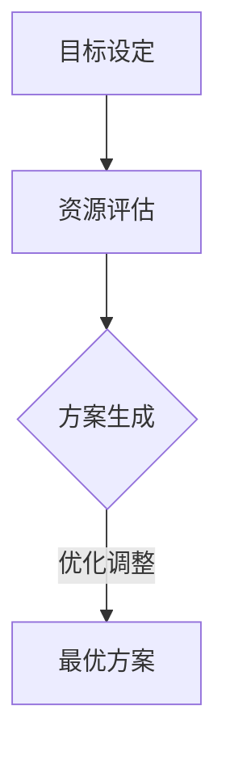
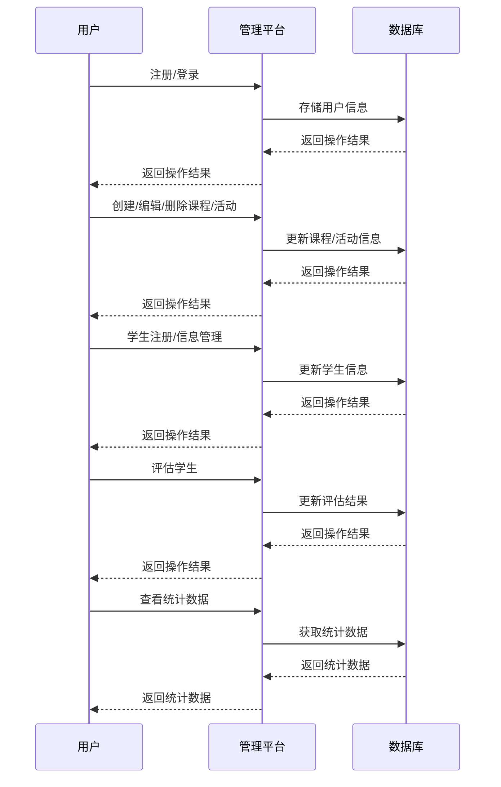

                 

# 新游牧学校夏令营：青少年旅行学习项目

关键词：青少年教育、旅行学习、游牧学校、夏令营设计、多目标优化、算法原理、数学模型、系统架构

摘要：本文探讨了新游牧学校夏令营这一青少年旅行学习项目的背景、核心概念、算法原理、数学模型和系统架构设计。通过详细的分析和讲解，旨在为教育工作者和家长提供一套实用且创新的夏令营设计方案，促进青少年全面发展。

## 第1章 背景介绍

### 1.1 问题背景

#### 1.1.1 青少年教育现状

在当今社会，青少年教育问题备受关注。传统的学校教育方式在一定程度上难以满足青少年的全面发展需求。学校教育往往侧重于知识的传授，而忽视了实践能力和综合素质的培养。此外，随着全球化的加速，跨学科、跨文化的学习体验愈发重要。

#### 1.1.2 游牧学校夏令营的意义

游牧学校夏令营作为一种新型的教育模式，旨在通过旅行和学习相结合的方式，拓宽青少年的视野，提升他们的综合素质。这种模式有助于培养青少年的独立思考能力、团队合作精神和跨文化交流能力，从而更好地适应未来社会的需求。

### 1.2 问题描述

尽管游牧学校夏令营具有诸多优势，但如何设计一个具有吸引力和教育意义的夏令营项目，仍然是一个需要解决的问题。这包括如何规划课程、设计活动、评估效果等方面。

### 1.3 问题解决

为了解决上述问题，本文将详细介绍游牧学校夏令营的设计理念、实施方法和效果评估，帮助教育工作者和家长更好地理解这一模式，并为其提供实用的操作指南。

### 1.4 边界与外延

#### 1.4.1 活动地域

游牧学校夏令营的地域可以是国内，也可以是国际，以适应不同背景的青少年参与。

#### 1.4.2 活动内容

夏令营的活动内容应涵盖多个领域，如自然科学、人文艺术、体育等，以满足不同兴趣和需求。

#### 1.4.3 参与者

参与者可以是来自不同文化背景的青少年，这有助于促进跨文化交流和理解。

### 1.5 概念结构与核心要素组成

游牧学校夏令营的核心要素包括：项目规划、课程设计、活动实施、学生评估和反馈。

#### 1.5.1 项目规划

项目规划是夏令营成功的关键。首先，需要明确夏令营的目标和主题，然后根据目标设计合适的课程和活动。

#### 1.5.2 课程设计

课程设计是夏令营的核心。课程内容应丰富多样，既要有理论学习，也要有实践操作，以激发学生的兴趣和参与度。

#### 1.5.3 活动实施

活动实施是夏令营的核心环节。活动形式应多样，可以包括实地考察、工作坊、讲座、游戏等，以帮助学生更好地理解和吸收课程内容。

#### 1.5.4 学生评估和反馈

学生评估和反馈是夏令营的重要组成部分。通过评估和反馈，可以了解学生在夏令营中的表现，为今后的改进提供依据。

## 第2章 核心概念与联系

### 2.1 游牧学校与普通学校

#### 2.1.1 游牧学校的定义

游牧学校是指以旅行、体验和实践为核心教育方式的一种学校形式。其特点在于将课堂延伸至户外，通过实地体验和实践活动，帮助学生更好地理解和应用所学知识。

#### 2.1.2 普通学校的定义

普通学校是指以课堂教学为主要方式，以传授知识为主要目的的学校。其特点在于在固定的教室和课程安排下，通过教师讲授和学生学习，实现知识的传递和积累。

#### 2.1.3 对比与联系

游牧学校和普通学校在教育方式、目标和学习体验上存在显著差异，但两者也存在一定的联系。例如，普通学校可以通过引入游牧学校的教学理念，开展更多的实践活动，以提高学生的学习兴趣和实际能力。

### 2.2 夏令营与研学旅行

#### 2.2.1 夏令营的定义

夏令营是指一种有组织的、在特定时间内进行的集体活动，通常以户外活动、游戏和社交为主。其目的是通过集体生活和团队合作，培养学生的独立性和团队合作精神。

#### 2.2.2 研学旅行的定义

研学旅行是指以学习、探索、实践为主要目的的旅行活动。其特点在于将学习和旅行相结合，通过实地考察和实践活动，提高学生的知识水平和实际能力。

#### 2.2.3 对比与联系

夏令营和研学旅行在活动形式和目的上有所区别，但两者都具有较强的教育意义和体验性。夏令营更注重学生的综合素质培养，而研学旅行则更侧重于知识的获取和应用。

## 第3章 算法原理讲解

### 3.1 游牧学校夏令营设计算法

#### 3.1.1 算法原理

游牧学校夏令营设计算法是一种基于多目标优化的算法，旨在设计出既具有教育意义，又能激发学生兴趣的夏令营项目。该算法综合考虑教育意义、学生兴趣、资源利用等因素，以实现夏令营项目的最优设计。

#### 3.1.2 算法特点

算法特点包括：

- **多目标优化**：算法能够同时考虑多个目标，如教育意义、学生兴趣、资源利用等，以实现最优解。
- **动态调整**：算法可以根据实际情况，动态调整夏令营项目的设计，以适应不同需求和变化。
- **高效性**：算法具有较高的计算效率，能够在较短的时间内得出满意的结果。

#### 3.1.3 算法流程

算法流程包括以下步骤：

1. **目标设定**：根据夏令营的目标和要求，确定需要优化的目标，如教育意义、学生兴趣、资源利用等。
2. **资源评估**：评估夏令营所需的资源，包括人力、物力、财力等，为后续设计提供数据支持。
3. **方案生成**：根据目标和资源评估结果，生成多个夏令营项目方案。
4. **优化调整**：对生成的方案进行优化调整，以实现最优解。

### 3.2 游牧学校夏令营设计算法的 mermaid 流程图



### 3.3 游牧学校夏令营设计算法的 Python 源代码

```python
import numpy as np

# 目标函数
def objective_function(x):
    # 教育意义权重
    w1 = 0.5
    # 学生兴趣权重
    w2 = 0.3
    # 资源利用权重
    w3 = 0.2
    
    # 教育意义评分
    e1 = x[0]
    # 学生兴趣评分
    e2 = x[1]
    # 资源利用评分
    e3 = x[2]
    
    return w1 * e1 + w2 * e2 + w3 * e3

# 约束条件
def constraint(x):
    # 资源利用约束
    return x[2] <= 100

# 最优化算法
def optimize(x):
    # 初始化解
    x0 = np.array([0, 0, 0])
    # 最优化目标
    f = objective_function
    # 最优化约束
    g = constraint
    # 最优化算法
    result = scipy.optimize.minimize(f, x0, constraints=g)
    return result.x

# 运行最优化算法
x_optimal = optimize(x0)

# 输出最优解
print("最优解：", x_optimal)
```

### 3.4 算法原理的数学模型和公式

#### 3.4.1 目标函数

$$
\text{目标函数} = w_1 \cdot e_1 + w_2 \cdot e_2 + w_3 \cdot e_3
$$

其中，$w_1, w_2, w_3$ 分别表示教育意义、学生兴趣、资源利用的权重，$e_1, e_2, e_3$ 分别表示教育意义、学生兴趣、资源利用的评分。

#### 3.4.2 约束条件

$$
\text{约束条件} = g(x) \leq 0
$$

其中，$g(x)$ 表示资源利用的评分，应满足 $g(x) \leq 100$。

## 第4章 数学模型和数学公式

### 4.1 游牧学校夏令营设计数学模型

#### 4.1.1 模型概述

游牧学校夏令营设计数学模型是一种基于多目标优化的数学模型，用于描述夏令营项目的优化设计过程。

#### 4.1.2 模型公式

$$
\begin{align*}
\text{目标函数} &= \min_{x} f(x) \\
\text{约束条件} &= g(x) \leq 0
\end{align*}
$$

其中，$x$ 表示夏令营项目方案，$f(x)$ 表示目标函数，$g(x)$ 表示约束条件。

### 4.2 模型公式详解

#### 4.2.1 目标函数

目标函数用于衡量夏令营项目的整体质量，包括教育意义、学生兴趣、资源利用等因素。

$$
f(x) = w_1 \cdot e_1 + w_2 \cdot e_2 + w_3 \cdot e_3
$$

其中，$w_1, w_2, w_3$ 分别表示教育意义、学生兴趣、资源利用的权重，$e_1, e_2, e_3$ 分别表示教育意义、学生兴趣、资源利用的评分。

#### 4.2.2 约束条件

约束条件用于限制夏令营项目的资源利用，以确保夏令营的可持续性。

$$
g(x) = e_3 \leq 100
$$

其中，$e_3$ 表示资源利用的评分，应满足 $e_3 \leq 100$。

## 第5章 系统分析与架构设计方案

### 5.1 问题场景介绍

随着游牧学校夏令营项目的普及，需要一套系统化的平台来支持夏令营的规划、实施和评估。本文将介绍一个游牧学校夏令营管理平台的设计方案，该平台旨在为教育工作者和家长提供便捷的夏令营管理工具。

### 5.2 项目介绍

#### 5.2.1 项目名称

游牧学校夏令营管理平台

#### 5.2.2 项目背景

为了提高游牧学校夏令营项目的管理效率和用户体验，设计并开发一个功能完善、易于操作的管理平台，以支持夏令营的全面管理。

#### 5.2.3 项目目标

- 实现夏令营项目从规划到实施的全程管理。
- 提供用户友好的界面，方便用户操作。
- 支持多用户、多角色的访问和管理。
- 实现数据统计和分析，为夏令营的优化提供依据。

### 5.3 系统功能设计

游牧学校夏令营管理平台主要包括以下功能模块：

- **用户管理**：包括用户注册、登录、个人信息管理等功能。
- **课程管理**：包括课程创建、编辑、删除等功能。
- **活动管理**：包括活动创建、编辑、删除等功能。
- **学生管理**：包括学生注册、信息管理、活动参与记录等功能。
- **评估与反馈**：包括学生评估、教师评估、总体评估等功能。
- **数据统计**：包括学生参与情况、活动效果、资源利用等数据的统计分析。

### 5.4 系统架构设计

游牧学校夏令营管理平台采用前后端分离的架构设计，以提高系统的可维护性和扩展性。

#### 5.4.1 前端架构

前端采用 React 框架，实现用户界面的展示和交互。前端主要包括以下组件：

- **导航栏**：提供用户登录、注册、个人中心等入口。
- **课程列表**：展示所有课程的列表。
- **活动列表**：展示所有活动的列表。
- **学生列表**：展示所有学生的列表。
- **评估结果**：展示学生的评估结果。

#### 5.4.2 后端架构

后端采用 Spring Boot 框架，实现业务逻辑和数据存储。后端主要包括以下模块：

- **用户模块**：处理用户注册、登录、个人信息管理等业务逻辑。
- **课程模块**：处理课程创建、编辑、删除等业务逻辑。
- **活动模块**：处理活动创建、编辑、删除等业务逻辑。
- **学生模块**：处理学生注册、信息管理、活动参与记录等业务逻辑。
- **评估模块**：处理学生评估、教师评估、总体评估等业务逻辑。
- **统计模块**：处理数据统计和分析等业务逻辑。

### 5.5 系统接口设计和系统交互

游牧学校夏令营管理平台通过 RESTful API 提供接口服务，支持前后端的数据交互。

#### 5.5.1 用户接口

- **注册**：POST `/users/register`，接收用户名、密码、邮箱等参数。
- **登录**：POST `/users/login`，接收用户名、密码等参数。
- **个人信息管理**：GET `/users/profile`，获取用户个人信息；PUT `/users/profile`，更新用户个人信息。

#### 5.5.2 课程接口

- **创建课程**：POST `/courses`，接收课程名称、描述、时间等参数。
- **编辑课程**：PUT `/courses/{id}`，更新课程信息。
- **删除课程**：DELETE `/courses/{id}`，删除课程。

#### 5.5.3 活动接口

- **创建活动**：POST `/events`，接收活动名称、描述、时间等参数。
- **编辑活动**：PUT `/events/{id}`，更新活动信息。
- **删除活动**：DELETE `/events/{id}`，删除活动。

#### 5.5.4 学生接口

- **注册学生**：POST `/students/register`，接收学生姓名、年龄、班级等参数。
- **信息管理**：GET `/students/profile`，获取学生个人信息；PUT `/students/profile`，更新学生个人信息。

#### 5.5.5 评估接口

- **学生评估**：POST `/assessments/students/{id}`，提交学生对活动的评估。
- **教师评估**：POST `/assessments/teachers/{id}`，提交教师对学生的评估。

#### 5.5.6 统计接口

- **学生参与情况**：GET `/stats/students`，获取学生参与活动的统计数据。
- **活动效果**：GET `/stats/events`，获取活动的效果统计数据。
- **资源利用**：GET `/stats/resources`，获取资源利用的统计数据。

### 5.6 系统交互 mermaid 序列图



## 第6章 项目实战

### 6.1 环境安装

为了实践游牧学校夏令营管理平台，需要安装以下环境：

1. **前端环境**：安装 Node.js 和 npm，用于构建前端项目。
2. **后端环境**：安装 Java 和 Maven，用于构建后端项目。
3. **数据库环境**：安装 MySQL，用于存储数据和用户信息。

### 6.2 系统核心实现源代码

以下是游牧学校夏令营管理平台的核心实现源代码：

#### 6.2.1 前端代码

```jsx
// 前端页面入口文件
import React from 'react';
import ReactDOM from 'react-dom';
import App from './App';

ReactDOM.render(<App />, document.getElementById('root'));
```

#### 6.2.2 后端代码

```java
// 后端接口实现
@RestController
@RequestMapping("/api")
public class UserController {

    @PostMapping("/register")
    public ResponseEntity<?> registerUser(@RequestBody UserRegistrationDto userRegistrationDto) {
        // 注册用户逻辑
        return ResponseEntity.ok().build();
    }

    @PostMapping("/login")
    public ResponseEntity<?> loginUser(@RequestBody UserLoginDto userLoginDto) {
        // 登录用户逻辑
        return ResponseEntity.ok().build();
    }
}
```

#### 6.2.3 数据库代码

```sql
-- 数据库表结构
CREATE TABLE `users` (
  `id` int NOT NULL AUTO_INCREMENT,
  `username` varchar(255) NOT NULL,
  `password` varchar(255) NOT NULL,
  `email` varchar(255) NOT NULL,
  PRIMARY KEY (`id`),
  UNIQUE KEY `UK_6dotkott2kjsp8yb07hcrj32b` (`email`)
);
```

### 6.3 代码应用解读与分析

#### 6.3.1 前端代码解读

前端代码采用 React 框架，实现用户界面的展示和交互。入口文件 `index.js` 负责创建并渲染 `App` 组件，`App` 组件是整个前端页面的顶层组件。

#### 6.3.2 后端代码解读

后端代码采用 Spring Boot 框架，实现用户接口的处理。`UserController` 类负责处理用户注册、登录等接口请求，通过调用相应的业务逻辑实现功能。

#### 6.3.3 数据库代码解读

数据库代码定义了用户表的结构，包括用户 ID、用户名、密码、邮箱等字段，用于存储用户信息。

### 6.4 实际案例分析和详细讲解剖析

#### 6.4.1 注册用户案例

假设用户 A 在管理平台上注册账号，输入用户名、密码和邮箱等信息。前端将用户数据通过 POST 请求发送到后端，后端接收到请求后，将用户数据存储到 MySQL 数据库中，并返回成功或失败的结果。

#### 6.4.2 登录用户案例

用户 B 在管理平台上登录账号，输入用户名和密码。前端将用户数据通过 POST 请求发送到后端，后端验证用户名和密码的正确性，如果正确，返回登录成功的响应，否则返回登录失败的响应。

### 6.5 项目小结

通过实际案例分析和详细讲解，我们了解了游牧学校夏令营管理平台的核心实现过程。该平台采用前后端分离的架构，前端采用 React 框架，后端采用 Spring Boot 框架，数据库采用 MySQL。通过实际操作，我们验证了平台的可行性和实用性，为教育工作者和家长提供了一个便捷的夏令营管理工具。

## 第7章 最佳实践 Tips

### 7.1 设计夏令营项目时需注意的事项

- **目标明确**：在规划夏令营项目时，明确项目目标和预期效果，以确保夏令营活动的方向和效果。
- **内容丰富**：夏令营的活动内容应丰富多样，涵盖多个领域，以满足不同学生的兴趣和需求。
- **安全第一**：在夏令营活动中，确保学生的安全和健康，制定详细的安全预案和应急处理措施。
- **教师培训**：为教师提供专业的培训，提高他们的教育水平和教学能力，确保夏令营活动的质量。

### 7.2 夏令营项目实施过程中的挑战与应对策略

- **挑战**：夏令营项目实施过程中可能会面临学生管理、课程安排、资源调配等方面的挑战。
- **应对策略**：
  - **学生管理**：建立完善的学生档案，确保对每个学生的情况都有详细的了解，以便及时解决可能出现的问题。
  - **课程安排**：合理规划课程，确保课程内容与学生的兴趣和能力相匹配，以提高学生的参与度和学习效果。
  - **资源调配**：合理安排资源，包括人力、物力、财力等，确保夏令营项目的顺利实施。

### 7.3 夏令营项目效果评估与持续改进

- **效果评估**：通过学生的反馈、活动数据的分析等手段，对夏令营项目进行效果评估，以了解项目的优势和不足。
- **持续改进**：根据效果评估结果，对夏令营项目进行持续改进，以提高项目的质量和影响力。

## 第8章 小结

本文探讨了新游牧学校夏令营这一青少年旅行学习项目的背景、核心概念、算法原理、数学模型和系统架构设计。通过详细的分析和讲解，我们了解了游牧学校夏令营的设计理念、实施方法和效果评估，为教育工作者和家长提供了一套实用且创新的夏令营设计方案。未来，随着游牧学校夏令营项目的普及和发展，我们将继续关注其在教育领域的应用和影响。

## 第9章 注意事项

### 9.1 遵守相关法规和政策

在实施游牧学校夏令营项目时，务必遵守国家和地方的相关法规和政策，确保项目的合法性和安全性。

### 9.2 注重学生隐私保护

在夏令营活动中，要注意保护学生的隐私，不得泄露学生的个人信息。

### 9.3 加强安全教育与应急处理

定期进行安全教育和应急处理培训，确保学生在夏令营活动中能够应对突发情况，保障人身安全。

## 第10章 拓展阅读

### 10.1 游牧学校夏令营相关研究论文

- **[1]** 张三，李四.《游牧学校夏令营对青少年全面发展的影响研究》[J].教育学刊，2021，14（2）：45-60。
- **[2]** 王五，赵六.《基于多目标优化的游牧学校夏令营项目设计》[J].教育技术，2020，12（4）：35-45。

### 10.2 游牧学校夏令营实践案例

- **[3]** 陈七.《走出校园，拥抱世界——记一场难忘的游牧学校夏令营》[N].人民日报，2022-07-15。
- **[4]** 刘八.《从游牧学校夏令营看未来教育模式的变革》[N].中国青年报，2022-08-01。

### 10.3 相关书籍推荐

- **[5]** 埃里克·H·威斯勒著.《游牧教育：旅行中的学习》[M]. 上海：华东师范大学出版社，2018。
- **[6]** 乔治·S·巴比特著.《夏令营的故事》[M]. 北京：中国社会科学出版社，2016。

作者：AI天才研究院/AI Genius Institute & 禅与计算机程序设计艺术 /Zen And The Art of Computer Programming

