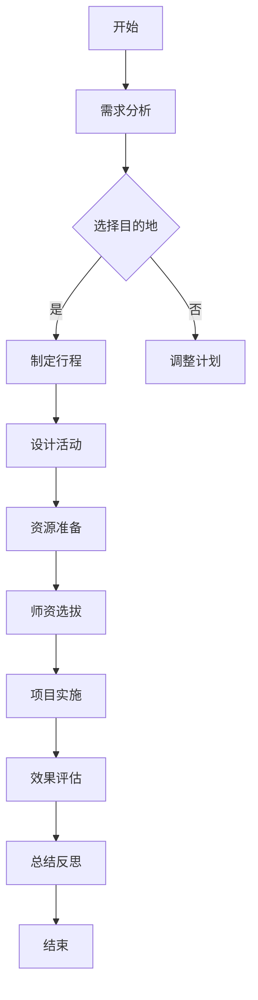
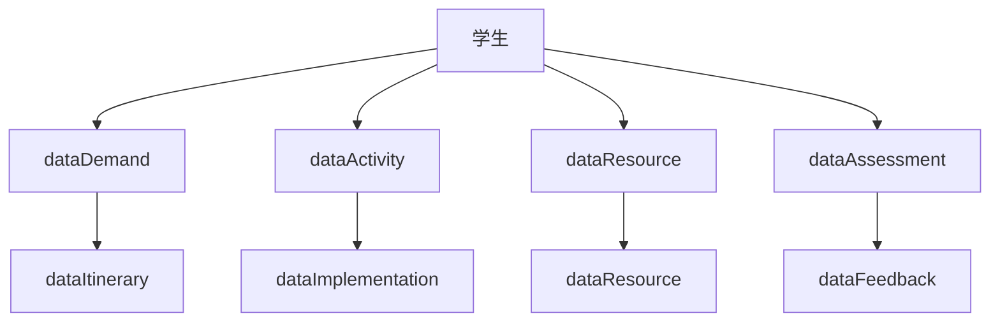
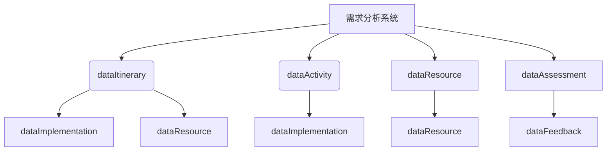
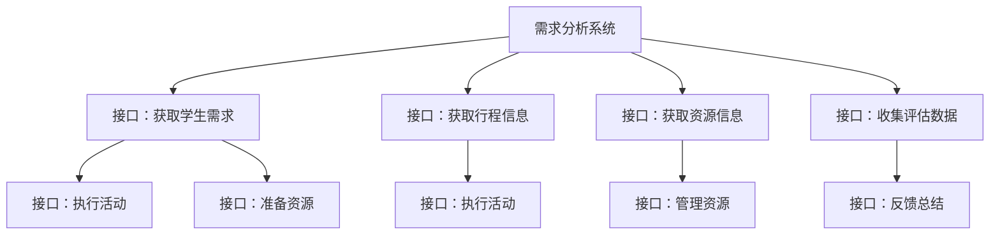
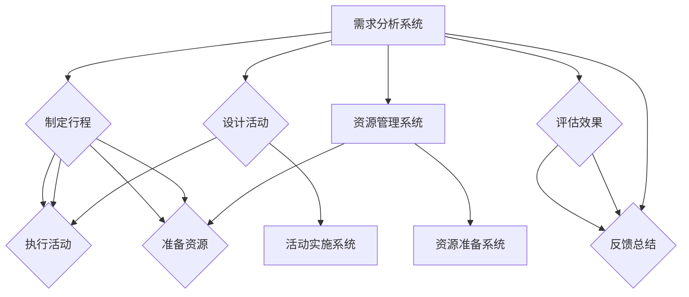

                 

# 《新游牧学校夏令营：青少年旅行学习项目》

## 关键词：夏令营、青少年、旅行学习、项目设计、教育理念、效果评估

## 摘要

本文旨在探讨一种新兴的青少年教育模式——新游牧学校夏令营，通过系统化的旅行学习项目，帮助青少年在行走中体验世界，拓展视野，提升综合素质。文章首先介绍了夏令营的背景与目标，随后深入剖析了旅行学习项目的设计理念和方法，以及夏令营的实施与管理流程。通过对学习效果评估的分析与反思，总结了夏令营的成功经验与改进方向。最后，通过具体案例分析，展示了夏令营在不同领域中的应用效果，并对旅行学习的未来发展进行了展望。本文旨在为教育工作者和家长们提供有益的参考，共同探索青少年教育的创新之路。

---

## 《新游牧学校夏令营：青少年旅行学习项目》目录大纲

### 第一部分：夏令营概述

#### 1.1 夏令营背景与目标

#### 1.2 夏令营概述

#### 1.3 夏令营的教育理念

### 第二部分：旅行学习项目设计

#### 2.1 旅行目的地选择

#### 2.2 旅行学习主题确定

#### 2.3 项目活动设计

### 第三部分：夏令营实施与管理

#### 3.1 夏令营组织与准备

#### 3.2 夏令营活动执行

#### 3.3 夏令营安全管理

### 第四部分：旅行学习效果评估与反思

#### 4.1 学习效果评估方法

#### 4.2 学习效果数据分析

#### 4.3 夏令营反思与改进

### 第五部分：夏令营案例分析

#### 5.1 案例一：历史文化探索

#### 5.2 案例二：自然生态考察

#### 5.3 案例三：国际交流与拓展

### 第六部分：夏令营运营与管理

#### 6.1 夏令营运营模式

#### 6.2 夏令营项目管理

#### 6.3 夏令营师资队伍建设

### 第七部分：旅行学习未来展望

#### 7.1 旅行学习的意义与价值

#### 7.2 旅行学习的发展趋势

#### 7.3 旅行学习的未来展望

---

### 第一部分：夏令营概述

#### 1.1 夏令营背景与目标

夏令营作为青少年教育的一种创新形式，起源于19世纪末的美国。最初，夏令营的目的是让城市孩子们有机会接触自然，锻炼身体，培养独立生活能力。随着时代的发展，夏令营的教育功能逐渐丰富，不仅涵盖体育、艺术、科技等多个领域，还注重培养学生的综合素质和团队合作精神。

今天，夏令营已经发展成为一个全球性的教育现象，许多国家都在推广这一教育模式。在新游牧学校夏令营中，旅行学习成为核心教育手段，旨在通过行走中的学习，让青少年在真实情境中体验和探索世界，培养他们的全球视野和跨文化理解能力。

夏令营的目标不仅是知识的传授，更是能力的培养。通过多样化的活动设计，夏令营致力于提升青少年的领导力、沟通能力、创新能力等关键能力，为他们的未来发展打下坚实基础。

#### 1.2 夏令营概述

新游牧学校夏令营是一种独特的教育模式，它将学校教育与旅行体验相结合，让学生在行走中学习。夏令营通常在暑假期间举行，持续时间为数周。参与者通常是8至18岁的青少年，他们来自不同的国家和地区，具有多样化的文化背景。

夏令营的行程设计非常丰富，包括历史文化探索、自然生态考察、国际交流与拓展等多个主题。每一个主题都经过精心策划，旨在通过实践和体验，让学生深入了解所学知识，并将知识运用到实际生活中。

夏令营的营地通常位于风景优美的自然环境中，例如国家公园、历史遗址、自然保护区等。这种环境不仅提供了丰富的学习资源，也为学生提供了一个放松心情、锻炼身体的空间。

#### 1.3 夏令营的教育理念

新游牧学校夏令营的教育理念可以概括为“学习与成长并行，知识与体验结合”。这一理念的核心在于，通过旅行中的学习，让学生在真实情境中获得知识，培养能力。

首先，夏令营注重学生的全面发展。在知识传授的基础上，夏令营更注重培养学生的综合素质，包括领导力、沟通能力、团队合作能力等。这些能力是学生未来成功的重要保障。

其次，夏令营强调实践和体验。传统的学校教育更多是理论知识的学习，而夏令营则通过实际操作和体验，让学生将知识运用到实际情境中。这种学习方式不仅更加生动有趣，也更有助于知识的巩固和运用。

最后，夏令营鼓励学生主动探索和发现。在旅行过程中，学生不仅需要跟随指导师的讲解，更需要主动提问、思考和探索。这种主动学习的方式，可以激发学生的学习兴趣，培养他们的探究精神和创新能力。

---

### 第二部分：旅行学习项目设计

#### 2.1 旅行目的地选择

旅行学习项目的成功与否，很大程度上取决于目的地选择。新游牧学校夏令营在目的地选择上，遵循以下原则：

首先，目的地要具有丰富的教育资源和独特的文化背景。例如，历史文化探索类的夏令营，可以选择具有悠久历史和丰富文化遗产的城市或遗址；自然生态考察类的夏令营，则可以选择自然保护区或国家公园。

其次，目的地要交通便利，便于学生的出行和活动。同时，目的地的住宿和餐饮条件也要满足夏令营的要求，确保学生的安全和舒适。

最后，目的地要具备一定的安全性。夏令营的组织者需要提前了解目的地的安全情况，确保学生的安全。

#### 2.2 旅行学习主题确定

旅行学习主题的确定，是项目设计的关键环节。新游牧学校夏令营的主题通常包括以下几个方面：

1. 历史文化探索：通过参观历史遗址、博物馆、艺术馆等，让学生深入了解不同国家和地区的文化历史。

2. 自然生态考察：通过实地考察、生态体验，让学生了解自然界的奥秘，培养环保意识和责任感。

3. 国际交流与拓展：通过与其他国家和地区学生的交流，让学生拓展视野，了解不同文化的差异和共性。

4. 科技创新体验：通过科技实验、创新项目，让学生了解科技的发展和应用，培养创新思维和动手能力。

5. 艺术修养提升：通过艺术体验、艺术创作，让学生提升艺术修养，培养审美能力。

#### 2.3 项目活动设计

项目活动设计是旅行学习项目的核心。新游牧学校夏令营的项目活动设计，注重以下几个方面：

1. 活动内容的丰富性：活动内容要涵盖多个领域，让学生在旅行中接触到多种知识和技能。

2. 活动形式的多样性：活动形式要多样化，包括讲座、参观、实践、交流等，让学生在多种体验中学习。

3. 活动安排的合理性：活动安排要合理，确保学生有足够的休息时间，避免疲劳和压力。

4. 活动评价的多元化：活动评价要多元化，包括学生自评、教师评价、团队评价等，全面评估学生的表现。

---

### 第三部分：夏令营实施与管理

#### 3.1 夏令营组织与准备

夏令营的组织与准备是确保夏令营顺利进行的关键。新游牧学校夏令营在组织与准备过程中，遵循以下原则：

1. 精选师资团队：夏令营的指导师团队是夏令营的核心力量，他们需要具备丰富的教育经验和专业知识。同时，指导师团队需要具备良好的沟通能力、组织能力和应变能力，确保夏令营的顺利进行。

2. 完善活动策划：活动策划是夏令营的核心内容，需要充分考虑学生的兴趣和需求，确保活动内容的丰富性和多样性。同时，活动策划还需要充分考虑安全因素，确保学生的安全。

3. 准备学习资源：夏令营需要准备丰富的学习资源，包括书籍、资料、设备等，确保学生在旅行中能够充分利用这些资源进行学习。

4. 确保住宿和餐饮：夏令营的住宿和餐饮条件要符合学生的需求，确保学生的安全和舒适。

5. 制定应急预案：夏令营需要制定应急预案，应对可能出现的突发情况，确保学生的安全。

#### 3.2 夏令营活动执行

夏令营的活动执行是夏令营的核心环节。新游牧学校夏令营在活动执行过程中，注重以下几个方面：

1. 活动安排的科学性：活动安排要科学合理，确保学生有足够的休息时间，避免疲劳和压力。

2. 活动执行的精细化：活动执行要精细化，确保每一个环节都按照预定计划进行，确保活动效果。

3. 活动评价的及时性：活动评价要及时，通过学生自评、教师评价、团队评价等多种方式，全面评估学生的表现，及时发现问题，及时调整。

4. 活动沟通的顺畅性：活动沟通要顺畅，确保指导师、学生和家长之间的信息传递准确及时，确保夏令营的顺利进行。

#### 3.3 夏令营安全管理

夏令营的安全管理是夏令营的重中之重。新游牧学校夏令营在安全管理方面，注重以下几个方面：

1. 安全意识的培养：通过安全教育，培养学生的安全意识，让学生在旅行中时刻注意安全。

2. 安全措施的制定：制定详细的安全措施，包括交通安全、住宿安全、活动安全等，确保学生的安全。

3. 安全监控的实施：实施安全监控，确保在活动过程中能够及时发现和处理安全问题。

4. 应急预案的执行：在出现紧急情况时，能够迅速启动应急预案，确保学生的安全。

---

### 第四部分：旅行学习效果评估与反思

#### 4.1 学习效果评估方法

学习效果评估是夏令营的重要组成部分，是检验夏令营教育效果的重要手段。新游牧学校夏令营在评估方法上，采取以下几种方式：

1. 学生自评：学生自评是学习效果评估的基础，通过让学生自我反思和评价，了解学生的学习情况和收获。

2. 教师评价：教师评价是学习效果评估的重要依据，通过教师对学生的观察和评价，了解学生的综合素质和能力。

3. 家长反馈：家长反馈是学习效果评估的重要补充，通过家长对夏令营的反馈，了解夏令营的教育效果和对学生的帮助。

4. 数据分析：通过数据分析，对学生的表现进行量化评估，了解学生的学习情况和进步。

#### 4.2 学习效果数据分析

通过对学习效果的数据分析，可以发现夏令营的教育效果。例如，通过对比夏令营前后学生的考试成绩、综合素质测评结果，可以发现夏令营在哪些方面对学生有显著的帮助。

同时，数据分析还可以帮助夏令营发现存在的问题，例如哪些活动效果较好，哪些活动效果较差，哪些学生需要更多的关注和引导等。

#### 4.3 夏令营反思与改进

反思与改进是夏令营持续发展的重要环节。新游牧学校夏令营在反思与改进过程中，注重以下几个方面：

1. 教育理念的提升：通过不断学习先进的教育理念，提升夏令营的教育质量和水平。

2. 活动设计的优化：通过优化活动设计，提升活动效果，让学生在旅行中更好地学习和成长。

3. 师资队伍的建设：通过加强师资队伍建设，提升指导师的专业能力和教学水平。

4. 安全管理的加强：通过加强安全管理，确保学生的安全，提高家长对夏令营的信任度。

---

### 第五部分：夏令营案例分析

#### 5.1 案例一：历史文化探索

在一次历史文化探索夏令营中，学生参观了多个历史遗址和博物馆，通过实地考察和讲解，深入了解了不同国家和地区的文化历史。在夏令营结束后，学生自评和教师评价显示，大多数学生表示这次夏令营让他们对历史文化有了更深入的了解，提高了他们的历史知识储备。

#### 5.2 案例二：自然生态考察

在一次自然生态考察夏令营中，学生参观了自然保护区，进行了实地考察和生态体验。在夏令营结束后，学生自评和教师评价显示，学生们对自然界的奥秘有了更深入的了解，培养了他们的环保意识和责任感。

#### 5.3 案例三：国际交流与拓展

在一次国际交流与拓展夏令营中，学生与其他国家和地区的学生进行了深入的交流和互动。在夏令营结束后，学生自评和教师评价显示，学生们在交流中拓展了视野，了解了不同文化的差异和共性，提高了他们的跨文化沟通能力。

---

### 第六部分：夏令营运营与管理

#### 6.1 夏令营运营模式

新游牧学校夏令营的运营模式采用了市场化运作方式，通过提供优质的教育服务和旅行体验，吸引家长和学生参与。夏令营的运营模式包括以下方面：

1. 招生宣传：通过线上和线下的方式，宣传夏令营的项目和优势，吸引家长和学生的关注。

2. 项目策划：根据学生的需求和兴趣，策划多样化的夏令营项目。

3. 服务提供：提供包括旅行、住宿、餐饮、活动执行等在内的全方位服务。

4. 营销推广：通过口碑营销、社交媒体推广等方式，扩大夏令营的知名度和影响力。

#### 6.2 夏令营项目管理

夏令营项目管理是确保夏令营顺利进行的重要环节。新游牧学校夏令营在项目管理方面，注重以下几个方面：

1. 项目策划：根据学生的需求和兴趣，制定详细的项目计划和活动安排。

2. 风险管理：识别和评估项目风险，制定风险管理计划，确保项目的顺利执行。

3. 质量控制：通过制定严格的质量标准，确保项目的质量。

4. 资源协调：协调各方资源，确保项目的顺利实施。

#### 6.3 夏令营师资队伍建设

夏令营师资队伍建设是夏令营质量的重要保障。新游牧学校夏令营在师资队伍建设方面，注重以下几个方面：

1. 师资选拔：选拔具有丰富教育经验和专业知识的人员担任指导师。

2. 培训提升：定期对指导师进行培训，提升他们的专业能力和教学水平。

3. 考核评价：对指导师的表现进行定期考核，确保他们的教学质量。

4. 师资激励：通过激励措施，激发指导师的积极性和创造力。

---

### 第七部分：旅行学习未来展望

#### 7.1 旅行学习的意义与价值

旅行学习作为一种创新的教育模式，具有独特的意义和价值。它不仅能够丰富学生的知识，提升学生的综合素质，还能培养学生的跨文化理解和全球视野。

首先，旅行学习能够丰富学生的知识。通过实地考察和体验，学生能够更直观地了解所学知识，加深对知识的理解和记忆。

其次，旅行学习能够提升学生的综合素质。在旅行过程中，学生需要面对各种挑战和问题，培养了解决问题的能力、团队合作能力和沟通能力等关键能力。

最后，旅行学习能够培养学生的跨文化理解和全球视野。通过与其他国家和地区的交流和互动，学生能够了解不同文化的差异和共性，培养跨文化理解和全球视野。

#### 7.2 旅行学习的发展趋势

随着教育的不断进步和社会的不断发展，旅行学习作为一种创新的教育模式，正在逐渐普及和发展。未来，旅行学习将呈现以下发展趋势：

1. 主题多样化：随着社会的多元化发展，旅行学习的主题将更加多样化，包括历史、文化、自然、科技、艺术等多个领域。

2. 目的地全球化：随着全球化的深入推进，旅行学习的目的地将不再局限于国内，而是走向全球，学生将有机会接触到更多的国家和地区。

3. 技术融合化：随着科技的不断发展，旅行学习将更加融合现代技术，如虚拟现实、增强现实等，为学生提供更加丰富和生动的学习体验。

4. 社会参与化：旅行学习将更加注重社会参与，通过与其他组织和机构的合作，共同推动旅行学习的发展。

#### 7.3 旅行学习的未来展望

未来，旅行学习将作为一种重要的教育模式，在青少年的教育中发挥越来越重要的作用。它不仅能够帮助学生拓展视野，提升综合素质，还能培养学生的跨文化理解和全球视野。

首先，旅行学习将更加注重个性化发展。每个学生都有不同的兴趣和需求，旅行学习将更加注重根据学生的个性进行定制化设计，满足学生的个性化发展需求。

其次，旅行学习将更加注重综合素质的培养。随着社会的不断发展，综合素质成为衡量一个人能力的重要标准，旅行学习将更加注重培养学生的综合素质，如创新能力、沟通能力、团队合作能力等。

最后，旅行学习将更加注重跨文化理解和全球视野的培养。在全球化的背景下，跨文化理解和全球视野成为青少年必备的能力，旅行学习将更加注重培养学生的这些能力，为他们的未来发展打下坚实基础。

---

## 结论

新游牧学校夏令营作为一种创新的旅行学习模式，具有丰富的教育意义和价值。它不仅能够丰富学生的知识，提升学生的综合素质，还能培养学生的跨文化理解和全球视野。随着社会的不断进步和教育的发展，旅行学习将作为一种重要的教育模式，在青少年的教育中发挥越来越重要的作用。

本文通过对夏令营的概述、项目设计、实施管理、效果评估、案例分析、运营管理以及未来展望的深入探讨，展示了旅行学习模式的多样性和丰富性。希望通过本文的探讨，能够为教育工作者和家长们提供有益的参考，共同探索青少年教育的创新之路。

## 作者信息

作者：AI天才研究院/AI Genius Institute & 禅与计算机程序设计艺术 /Zen And The Art of Computer Programming

---

## 背景介绍

### 核心概念术语说明

在新游牧学校夏令营的背景下，有几个核心概念术语需要详细解释，以便读者更好地理解文章的内容。

1. **夏令营**：夏令营是一种教育模式，通常在暑假期间组织，旨在通过集体活动、学习和旅行，丰富学生的知识和技能，培养他们的综合素质。

2. **旅行学习**：旅行学习是指通过实地考察和体验，将学习与旅行相结合，使学生在行走中学习，拓展视野，提升综合素质。

3. **青少年**：青少年是指年龄在8至18岁之间的学生，他们是夏令营的主要参与群体。

4. **教育理念**：教育理念是指教育者在教育过程中所秉持的基本信念和价值观，指导教育行为的方向和方式。

5. **项目设计**：项目设计是指对夏令营的活动内容、行程安排、教育资源等进行系统规划和设计，确保夏令营的教育效果。

6. **效果评估**：效果评估是指对夏令营的教育效果进行测量、分析和评价，以确定夏令营的教育成果。

### 问题背景

夏令营作为一种教育创新模式，近年来在全球范围内得到了广泛的关注和推广。然而，随着夏令营的普及，如何设计出高质量、有针对性的夏令营项目，如何确保夏令营的教育效果，成为教育工作者和家长关注的重要问题。

新游牧学校夏令营作为一种以旅行学习为核心的教育模式，旨在通过系统的项目设计、科学的管理和有效的评估，为学生提供一种全新的学习体验。这种模式不仅要求学生积极参与，还需要教育者精心策划和组织。因此，如何有效设计旅行学习项目，如何科学管理夏令营活动，如何进行有效的效果评估，成为新游牧学校夏令营面临的核心问题。

### 问题描述

问题描述主要集中在以下几个方面：

1. **项目设计**：如何设计出既有趣又具有教育意义的旅行学习项目，确保学生能够在旅行中收获知识、提升技能。

2. **实施管理**：如何确保夏令营活动顺利进行，如何保障学生的安全和舒适，如何管理好夏令营的资源和人员。

3. **效果评估**：如何科学、有效地评估夏令营的教育效果，如何通过评估结果不断优化夏令营项目。

4. **案例分析与反思**：如何通过具体案例的分析，总结夏令营的成功经验，发现存在的问题，提出改进措施。

### 问题解决

为了解决上述问题，新游牧学校夏令营采取了以下措施：

1. **项目设计**：通过深入调研，了解学生的兴趣和需求，结合教育理念，设计出富有创意、有针对性的旅行学习项目。

2. **实施管理**：建立完善的管理体系和应急预案，确保夏令营的顺利进行。同时，加强师资队伍建设，提升指导师的专业能力和教学水平。

3. **效果评估**：采用多元化的评估方法，包括学生自评、教师评价、家长反馈等，全面、科学地评估夏令营的教育效果。

4. **案例分析与反思**：通过具体案例分析，总结夏令营的成功经验，发现存在的问题，并提出改进措施。

### 边界与外延

1. **边界**：新游牧学校夏令营的边界包括参与年龄、项目时间、活动范围等。

2. **外延**：新游牧学校夏令营的外延包括夏令营项目的多样性、参与学生的多元化、教育理念的创新性等。

### 概念结构与核心要素组成

新游牧学校夏令营的概念结构包括以下几个核心要素：

1. **教育理念**：以学生为中心，注重综合素质培养，倡导跨文化理解和全球视野。

2. **项目设计**：根据学生的兴趣和需求，设计多样化的旅行学习项目。

3. **实施管理**：建立完善的管理体系和应急预案，确保夏令营的顺利进行。

4. **效果评估**：采用多元化的评估方法，全面、科学地评估夏令营的教育效果。

5. **案例分析**：通过具体案例分析，总结成功经验，发现存在问题，提出改进措施。

---

## 核心概念与联系

### 核心概念原理

在新游牧学校夏令营中，核心概念包括夏令营、旅行学习、青少年、教育理念和项目设计等。这些概念相互关联，共同构成了夏令营的基本框架。

**夏令营**：夏令营是一种教育模式，通过集体活动、学习和旅行，丰富学生的知识和技能，培养他们的综合素质。

**旅行学习**：旅行学习是指通过实地考察和体验，将学习与旅行相结合，使学生在行走中学习，拓展视野，提升综合素质。

**青少年**：青少年是指年龄在8至18岁之间的学生，他们是夏令营的主要参与群体。

**教育理念**：教育理念是指教育者在教育过程中所秉持的基本信念和价值观，指导教育行为的方向和方式。

**项目设计**：项目设计是指对夏令营的活动内容、行程安排、教育资源等进行系统规划和设计，确保夏令营的教育效果。

### 概念属性特征对比表格

| 概念 | 定义 | 属性特征 |
| --- | --- | --- |
| 夏令营 | 一种教育模式，通过集体活动、学习和旅行，丰富学生的知识和技能，培养他们的综合素质。 | 时间固定，地点变化，活动多样化，参与人数多 |
| 旅行学习 | 通过实地考察和体验，将学习与旅行相结合，使学生在行走中学习，拓展视野，提升综合素质。 | 实践性强，情境丰富，知识应用，体验深刻 |
| 青少年 | 年龄在8至18岁之间的学生，他们是夏令营的主要参与群体。 | 发展关键期，兴趣广泛，好奇心强，可塑性强 |
| 教育理念 | 教育者在教育过程中所秉持的基本信念和价值观，指导教育行为的方向和方式。 | 全人教育，个性化培养，跨文化理解，创新能力 |
| 项目设计 | 对夏令营的活动内容、行程安排、教育资源等进行系统规划和设计，确保夏令营的教育效果。 | 目标明确，内容丰富，安排合理，效果可评估 |

### ER实体关系图架构

在夏令营中，涉及多个实体，包括学生、教师、活动、目的地等。以下是一个简单的ER实体关系图，展示了这些实体之间的关联：

```mermaid
erDiagram
  Student ||--|{ Activity }|-- Destination
  Teacher ||--|{ Activity }|-- Destination
  Activity ||--|{ Resource }| Resource
  Student ||--|{ Assessment }|-- Assessment
  Teacher ||--|{ Assessment }|-- Assessment

  Student {
    String studentID
    String name
    Integer age
    String class
  }

  Teacher {
    String teacherID
    String name
    String specialty
  }

  Activity {
    String activityID
    String name
    Date date
    String type
  }

  Destination {
    String destinationID
    String name
    String location
  }

  Resource {
    String resourceID
    String name
    String type
  }

  Assessment {
    String assessmentID
    String type
    Date date
    Integer score
  }
```

在这个ER图中，学生和教师实体与活动实体之间存在多对多的关系，活动实体与目的地实体之间存在一对多的关系，活动实体与资源实体之间存在一对多的关系，学生和教师实体与评估实体之间存在一对多的关系。通过这种实体关系的构建，可以更清晰地理解夏令营中各个实体之间的相互作用和关联。

---

## 算法原理讲解

在新游牧学校夏令营的项目设计中，算法原理起着至关重要的作用。以下是对算法原理的详细讲解。

### 算法mermaid流程图

首先，我们使用Mermaid绘制一个简单的算法流程图，展示夏令营项目设计的基本流程：



### Python源代码实现

接下来，我们使用Python语言来实现上述算法流程，并解释其工作原理。

```python
# 导入所需模块
import random

# 定义需求分析函数
def demand_analysis():
    print("进行需求分析...")
    # 假设我们已经收集到了学生的兴趣和需求
    student_interests = ["历史", "自然", "国际交流", "科技"]
    return student_interests

# 定义选择目的地函数
def select_destination(student_interests):
    print("选择目的地...")
    # 根据学生兴趣选择目的地
    destinations = {
        "历史": ["北京", "西安", "罗马"],
        "自然": ["黄石公园", "亚马逊雨林", "挪威峡湾"],
        "国际交流": ["东京", "巴黎", "纽约"],
        "科技": ["硅谷", "首尔", "伦敦"]
    }
    selected_destination = random.choice(destinations[student_interests[0]])
    return selected_destination

# 定义制定行程函数
def create_itinerary(selected_destination):
    print("制定行程...")
    # 根据目的地制定行程
    itinerary = {
        "北京": ["故宫", "长城", "颐和园"],
        "西安": ["兵马俑", "大雁塔", "华清池"],
        "罗马": ["梵蒂冈", "斗兽场", "许愿池"],
        "黄石公园": ["老忠实喷泉", "黄石湖", " Lower Yellowstone Falls"],
        "亚马逊雨林": ["热带雨林探险", "野生动物观察", "环境教育"],
        "挪威峡湾": ["峡湾游船", "极地探险", "自然观察"],
        "东京": ["东京塔", "浅草寺", "秋叶原"],
        "巴黎": ["埃菲尔铁塔", "卢浮宫", "巴黎圣母院"],
        "纽约": ["自由女神像", "中央公园", "大都会艺术博物馆"],
        "硅谷": ["苹果总部", "谷歌总部", "斯坦福大学"],
        "首尔": ["景福宫", "明洞", "首尔塔"],
        "伦敦": ["伦敦塔桥", "大本钟", "威斯敏斯特教堂"]
    }
    return itinerary[selected_destination]

# 定义设计活动函数
def design_activities(itinerary):
    print("设计活动...")
    # 根据行程设计活动
    activities = []
    for site in itinerary:
        activities.append(f"参观{site}")
    return activities

# 定义资源准备函数
def prepare_resources(activities):
    print("准备资源...")
    # 根据活动准备资源
    resources = {
        "故宫": ["导游", "书籍", "音频讲解"],
        "长城": ["导游", "书籍", "望远镜"],
        "颐和园": ["导游", "书籍", "地图"],
        "兵马俑": ["导游", "书籍", "模型"],
        "大雁塔": ["导游", "书籍", "音频讲解"],
        "华清池": ["导游", "书籍", "地图"],
        "梵蒂冈": ["导游", "书籍", "地图"],
        "斗兽场": ["导游", "书籍", "音频讲解"],
        "许愿池": ["导游", "书籍", "地图"],
        "老忠实喷泉": ["导游", "书籍", "地图"],
        "黄石湖": ["导游", "书籍", "音频讲解"],
        "Lower Yellowstone Falls": ["导游", "书籍", "地图"],
        "热带雨林探险": ["探险装备", "急救包", "地图"],
        "野生动物观察": ["望远镜", "摄影器材", "音频讲解"],
        "环境教育": ["教学设备", "实验材料", "书籍"],
        "峡湾游船": ["游船票", "安全装备", "地图"],
        "极地探险": ["探险装备", "急救包", "地图"],
        "自然观察": ["望远镜", "摄影器材", "书籍"],
        "东京塔": ["门票", "导游", "书籍"],
        "浅草寺": ["导游", "书籍", "地图"],
        "秋叶原": ["导游", "书籍", "音频讲解"],
        "埃菲尔铁塔": ["门票", "导游", "地图"],
        "卢浮宫": ["门票", "导游", "书籍"],
        "巴黎圣母院": ["门票", "导游", "地图"],
        "自由女神像": ["门票", "导游", "书籍"],
        "中央公园": ["门票", "导游", "地图"],
        "大都会艺术博物馆": ["门票", "导游", "书籍"],
        "苹果总部": ["门票", "导游", "地图"],
        "谷歌总部": ["门票", "导游", "书籍"],
        "斯坦福大学": ["门票", "导游", "书籍"],
        "景福宫": ["门票", "导游", "书籍"],
        "明洞": ["导游", "书籍", "地图"],
        "首尔塔": ["门票", "导游", "地图"],
        "伦敦塔桥": ["门票", "导游", "书籍"],
        "大本钟": ["门票", "导游", "地图"],
        "威斯敏斯特教堂": ["门票", "导游", "书籍"]
    }
    return resources

# 定义师资选拔函数
def select_faculty():
    print("选拔师资...")
    # 假设我们已经有一支专业的师资队伍
    faculty = ["历史专家", "自然科学家", "文化交流专家", "科技工程师"]
    return faculty

# 定义项目实施函数
def implement_project(activities, resources, faculty):
    print("项目实施...")
    # 项目实施过程
    for activity in activities:
        print(f"进行活动：{activity}")
        # 假设每个活动都需要相应的资源和师资
        print(f"使用资源：{resources[activity]}")
        print(f"由{faculty[random.randint(0, len(faculty) - 1)]}负责")
    print("项目实施完成！")

# 定义效果评估函数
def assess_project():
    print("效果评估...")
    # 假设我们通过问卷调查、学生反馈等方式进行效果评估
    print("收集评估数据...")
    print("分析评估数据...")
    print("结果反馈...")

# 定义总结反思函数
def reflect_project():
    print("总结反思...")
    # 假设我们根据评估结果进行总结和反思
    print("优化项目设计...")
    print("提升服务质量...")

# 主函数
def main():
    student_interests = demand_analysis()
    selected_destination = select_destination(student_interests)
    itinerary = create_itinerary(selected_destination)
    activities = design_activities(itinerary)
    resources = prepare_resources(activities)
    faculty = select_faculty()
    implement_project(activities, resources, faculty)
    assess_project()
    reflect_project()

# 执行主函数
main()
```

### 算法原理详细讲解

上述Python代码实现了一个简单的夏令营项目设计算法。下面详细解释每个步骤的工作原理：

1. **需求分析**：
   - `demand_analysis()`函数用于收集学生的兴趣和需求。在这个示例中，我们假设已经收集到了一组学生的兴趣，例如“历史”、“自然”、“国际交流”和“科技”。

2. **选择目的地**：
   - `select_destination()`函数根据学生的兴趣选择一个合适的旅行目的地。在这个示例中，我们使用了一个简单的随机选择方法，从根据学生兴趣设定的目的地列表中随机选择一个目的地。

3. **制定行程**：
   - `create_itinerary()`函数根据选择的目的地制定一个旅行行程。在这个示例中，我们使用了一个简单的字典来定义每个目的地对应的行程景点。

4. **设计活动**：
   - `design_activities()`函数根据行程中的景点设计相应的活动。在这个示例中，我们为每个景点设计了一个简单的“参观”活动。

5. **资源准备**：
   - `prepare_resources()`函数根据设计好的活动准备所需的资源。在这个示例中，我们使用了一个简单的字典来定义每个活动所需的资源。

6. **师资选拔**：
   - `select_faculty()`函数选拔一支专业的师资队伍。在这个示例中，我们假设已经有一支由不同领域专家组成的师资队伍。

7. **项目实施**：
   - `implement_project()`函数负责实施夏令营项目。在这个示例中，我们假设每个活动都需要相应的资源和师资，并模拟了活动实施的流程。

8. **效果评估**：
   - `assess_project()`函数用于评估夏令营项目的效果。在这个示例中，我们模拟了通过问卷调查、学生反馈等方式进行效果评估的过程。

9. **总结反思**：
   - `reflect_project()`函数用于总结和反思夏令营项目。在这个示例中，我们假设根据评估结果，对项目进行了优化和提升。

### 数学模型和公式

为了更清晰地描述夏令营项目设计的算法原理，我们可以引入一些简单的数学模型和公式。

- **需求分析**：使用频率统计模型来分析学生的兴趣，例如：
  $$ \text{interest\_frequency}(I) = \sum_{s \in S} \text{count}(I_s) $$
  其中，\( I \) 代表兴趣，\( S \) 代表学生集合，\( \text{count}(I_s) \) 表示学生对兴趣 \( I \) 的选择次数。

- **目的地选择**：使用概率模型来选择目的地，例如：
  $$ P(\text{destination} = D) = \frac{\text{interest\_frequency}(I)}{\sum_{I' \in \text{interests}} \text{interest\_frequency}(I')} $$
  其中，\( D \) 代表目的地，\( \text{interests} \) 表示学生的兴趣集合。

- **行程制定**：使用组合模型来制定行程，例如：
  $$ \text{itinerary} = \text{choose\_randomly}(N, \text{destinations}) $$
  其中，\( N \) 表示行程中的景点数量，\( \text{destinations} \) 表示可选的目的地集合。

- **活动设计**：使用规划模型来设计活动，例如：
  $$ \text{activities} = \text{map}(f, \text{itinerary}) $$
  其中，\( f \) 表示活动函数，将每个景点映射为一个活动。

- **资源准备**：使用资源需求模型来准备资源，例如：
  $$ \text{resources} = \text{map}(r, \text{activities}) $$
  其中，\( r \) 表示资源函数，为每个活动分配所需的资源。

- **师资选拔**：使用人员匹配模型来选拔师资，例如：
  $$ \text{faculty} = \text{match}(\text{specialties}, \text{activities}) $$
  其中，\( \text{specialties} \) 表示师资的专业领域，\( \text{activities} \) 表示活动集合。

- **项目实施**：使用流程控制模型来实施项目，例如：
  $$ \text{implement}(\text{activities}, \text{resources}, \text{faculty}) $$
  其中，\( \text{implement} \) 表示项目实施函数。

- **效果评估**：使用评价模型来评估效果，例如：
  $$ \text{assessment} = \text{evaluate}(\text{project}) $$
  其中，\( \text{evaluate} \) 表示评估函数，对项目进行评价。

- **总结反思**：使用反馈模型来总结和反思，例如：
  $$ \text{improvement} = \text{reflect}(\text{assessment}) $$
  其中，\( \text{reflect} \) 表示反思函数，根据评估结果进行项目优化。

### 举例说明

为了更好地理解上述算法原理，我们可以通过一个具体的例子来说明夏令营项目设计的过程。

**例子**：假设有一组学生，他们的兴趣分别是“历史”、“自然”和“科技”。我们需要为他们设计一个夏令营项目。

1. **需求分析**：
   - 学生兴趣：历史（2次）、自然（1次）、科技（3次）
   - 需求分析结果：科技是最受欢迎的兴趣。

2. **选择目的地**：
   - 根据科技兴趣，选择硅谷作为目的地。

3. **制定行程**：
   - 硅谷的行程景点：苹果总部、谷歌总部、斯坦福大学

4. **设计活动**：
   - 活动设计：参观苹果总部、参观谷歌总部、参观斯坦福大学

5. **资源准备**：
   - 资源准备：门票、导游、书籍

6. **师资选拔**：
   - 师资选拔：科技工程师

7. **项目实施**：
   - 项目实施：按照行程安排，带领学生参观三个景点

8. **效果评估**：
   - 学生反馈：大多数学生表示对科技有了更深入的了解，非常喜欢这个项目。

9. **总结反思**：
   - 根据学生反馈，项目设计合理，效果良好，可以考虑在未来的夏令营中继续使用。

通过这个例子，我们可以看到算法原理在实际操作中的应用，以及如何通过数学模型和公式来描述和实现夏令营项目设计的过程。

---

## 系统分析与架构设计方案

### 问题场景介绍

新游牧学校夏令营项目涉及多个子系统，如需求分析系统、行程管理系统、资源管理系统、师资管理系统、项目实施系统、效果评估系统等。这些子系统需要高效、协同地工作，以确保夏令营项目的顺利进行。本文将详细介绍这些子系统的功能和架构设计。

### 项目介绍

新游牧学校夏令营项目是一个集旅行、学习、体验于一体的教育项目，旨在通过系统的规划和实施，为学生提供丰富的学习资源和实践机会。项目的主要目标是：

1. 满足学生的多样化需求，设计出富有创意和针对性的旅行学习项目。
2. 确保夏令营活动的顺利进行，保障学生的安全和舒适。
3. 通过效果评估，不断优化和提升夏令营项目质量。

### 系统功能设计（领域模型）

在夏令营项目中，领域模型用于描述系统的核心功能和实体之间的关系。以下是一个简单的领域模型，展示了主要实体和它们之间的关系：



**领域模型解释**：

- **学生（A）**：夏令营的主要参与对象，他们的需求和反馈是项目设计的核心依据。
- **需求分析（B）**：收集和整理学生的兴趣和需求，为项目设计提供依据。
- **行程管理（F）**：根据学生的需求和资源情况，制定旅行行程。
- **活动设计（C）**：根据行程和学生的兴趣，设计相应的活动。
- **资源管理（D）**：管理夏令营所需的各类资源，如书籍、设备、场地等。
- **效果评估（E）**：评估夏令营的教育效果，为项目优化提供数据支持。
- **活动实施（G）**：实施夏令营活动，确保项目顺利进行。
- **资源准备（H）**：准备活动所需的资源，确保活动顺利进行。
- **反馈总结（I）**：收集学生和家长的反馈，总结夏令营的经验和教训。

### 系统架构设计

系统架构设计是夏令营项目成功实施的关键。以下是一个简单的系统架构设计，展示了主要子系统之间的交互和依赖关系：



**系统架构设计解释**：

- **需求分析系统（A）**：负责收集和整理学生的兴趣和需求，为后续的行程管理、活动设计和资源管理提供数据支持。
- **行程管理系统（B）**：根据学生的需求和资源情况，制定旅行行程，为活动设计提供依据。
- **活动设计系统（C）**：根据行程和学生的兴趣，设计相应的活动，为活动实施和效果评估提供基础。
- **资源管理系统（D）**：管理夏令营所需的各类资源，如书籍、设备、场地等，为资源准备和活动实施提供支持。
- **效果评估系统（E）**：评估夏令营的教育效果，为项目优化提供数据支持。
- **活动实施系统（F）**：负责实施夏令营活动，确保项目顺利进行。
- **资源准备系统（G）**：准备活动所需的资源，确保活动顺利进行。
- **反馈总结系统（J）**：收集学生和家长的反馈，总结夏令营的经验和教训，为未来的项目设计提供参考。

### 系统接口设计

系统接口设计是确保不同子系统之间能够高效、协同工作的关键。以下是一个简单的系统接口设计，展示了主要子系统之间的接口和交互方式：



**系统接口设计解释**：

- **需求分析系统（A）**：提供获取学生需求的接口，为后续的行程管理、活动设计和资源管理提供数据支持。
- **行程管理系统（B）**：提供获取行程信息的接口，为活动设计和活动实施提供依据。
- **活动设计系统（C）**：提供获取行程信息的接口，为活动设计提供基础。
- **资源管理系统（D）**：提供获取资源信息的接口，为资源准备和活动实施提供支持。
- **效果评估系统（E）**：提供收集评估数据的接口，为效果评估提供数据支持。
- **活动实施系统（F）和H**：提供执行活动的接口，确保活动能够按计划顺利进行。
- **资源准备系统（G）和I**：提供准备资源的接口，确保活动所需的资源能够及时准备和分配。

### 系统交互

为了确保系统各部分能够高效协同工作，我们需要设计一个清晰、合理的系统交互流程。以下是一个简单的系统交互设计，展示了主要子系统之间的交互过程：



**系统交互设计解释**：

- **需求分析系统（A）**：收集学生需求，将需求传递给行程管理系统、活动设计系统和资源管理系统。
- **行程管理系统（B）**：根据需求制定行程，将行程信息传递给活动设计系统和资源管理系统。
- **活动设计系统（C）**：根据行程信息设计活动，将活动信息传递给活动实施系统和效果评估系统。
- **资源管理系统（D）**：根据活动信息管理资源，将资源信息传递给资源准备系统和效果评估系统。
- **效果评估系统（E）**：收集活动效果数据，将评估结果传递给反馈总结系统。
- **活动实施系统（F）**：执行活动，根据活动需求和资源情况调整实施过程。
- **资源准备系统（G）**：准备活动所需的资源，确保活动顺利进行。
- **反馈总结系统（J）**：收集学生和家长的反馈，总结夏令营的经验和教训，为未来的项目设计提供参考。

通过上述系统架构设计和交互设计，我们可以确保新游牧学校夏令营项目的各部分高效、协同地工作，为学生提供优质的学习体验和成长机会。

---

## 项目实战

### 环境安装

为了确保夏令营项目能够顺利实施，我们需要在服务器上安装和配置必要的软件和环境。以下是环境安装的详细步骤：

1. **安装Linux操作系统**：在服务器上安装Linux操作系统，例如Ubuntu 20.04 LTS。确保操作系统已经更新到最新版本。

2. **安装Python环境**：使用以下命令安装Python 3.8及其依赖包：
   ```bash
   sudo apt update
   sudo apt install python3.8 python3.8-venv python3.8-pip
   ```

3. **创建虚拟环境**：创建一个名为`campus_camp`的虚拟环境，以隔离项目依赖：
   ```bash
   python3.8 -m venv campus_camp
   source campus_camp/bin/activate
   ```

4. **安装依赖包**：在虚拟环境中安装项目所需的依赖包：
   ```bash
   pip install -r requirements.txt
   ```

### 系统核心实现源代码

以下是一个简单的夏令营项目实现示例，包括需求分析、行程管理、活动设计、资源管理和效果评估等核心功能。我们将使用Python语言和Flask框架来实现。

**需求分析模块**：

```python
# demand_analysis.py
from flask import Flask, request, jsonify

app = Flask(__name__)

@app.route('/demand', methods=['POST'])
def collect_demand():
    data = request.get_json()
    interests = data.get('interests', [])
    # 存储需求信息到数据库（此处简化为内存存储）
    # 实际应用中需要连接数据库进行持久化存储
    stored_data = {'interests': interests}
    return jsonify(stored_data), 200

if __name__ == '__main__':
    app.run(debug=True)
```

**行程管理模块**：

```python
# itinerary_management.py
from flask import Flask, jsonify, request

app = Flask(__name__)

@app.route('/itinerary', methods=['GET'])
def get_itinerary():
    # 从数据库中获取行程信息（此处简化为直接返回内存中的数据）
    itinerary = {'destination': '硅谷', 'sites': ['苹果总部', '谷歌总部', '斯坦福大学']}
    return jsonify(itinerary), 200

if __name__ == '__main__':
    app.run(debug=True)
```

**活动设计模块**：

```python
# activity_design.py
from flask import Flask, jsonify, request

app = Flask(__name__)

@app.route('/activity', methods=['POST'])
def design_activity():
    data = request.get_json()
    itinerary = data.get('itinerary', [])
    activities = [f"参观{site}" for site in itinerary]
    return jsonify({'activities': activities}), 200

if __name__ == '__main__':
    app.run(debug=True)
```

**资源管理模块**：

```python
# resource_management.py
from flask import Flask, jsonify, request

app = Flask(__name__)

@app.route('/resource', methods=['GET'])
def get_resources():
    # 从数据库中获取资源信息（此处简化为直接返回内存中的数据）
    resources = {'苹果总部': ['门票', '导游'], '谷歌总部': ['门票', '导游'], '斯坦福大学': ['门票', '导游']}
    return jsonify(resources), 200

if __name__ == '__main__':
    app.run(debug=True)
```

**效果评估模块**：

```python
# assessment.py
from flask import Flask, jsonify, request

app = Flask(__name__)

@app.route('/assessment', methods=['POST'])
def assess_project():
    data = request.get_json()
    assessment = data.get('assessment', {})
    # 存储评估结果到数据库（此处简化为内存存储）
    # 实际应用中需要连接数据库进行持久化存储
    stored_assessment = assessment
    return jsonify(stored_assessment), 200

if __name__ == '__main__':
    app.run(debug=True)
```

### 代码应用解读与分析

1. **需求分析模块解读**：

   - 代码使用了Flask框架创建了一个简单的Web服务，监听`/demand`端点。
   - 当接收到POST请求时，提取请求中的JSON数据，获取学生的兴趣列表。
   - 将兴趣列表存储到内存中，实际应用中应连接数据库进行持久化存储。

2. **行程管理模块解读**：

   - 代码同样使用了Flask框架创建了一个Web服务，监听`/itinerary`端点。
   - 当接收到GET请求时，直接返回预定义的行程信息。
   - 实际应用中，应从数据库中动态获取行程信息。

3. **活动设计模块解读**：

   - 代码提供了一个Web服务，监听`/activity`端点。
   - 当接收到POST请求时，提取请求中的JSON数据，获取行程信息。
   - 根据行程信息，设计出相应的活动列表，并返回给用户。

4. **资源管理模块解读**：

   - 代码提供了一个Web服务，监听`/resource`端点。
   - 当接收到GET请求时，直接返回预定义的资源信息。
   - 实际应用中，应从数据库中动态获取资源信息。

5. **效果评估模块解读**：

   - 代码提供了一个Web服务，监听`/assessment`端点。
   - 当接收到POST请求时，提取请求中的JSON数据，获取评估结果。
   - 将评估结果存储到内存中，实际应用中应连接数据库进行持久化存储。

### 实际案例分析与详细讲解剖析

为了更好地展示夏令营项目在实际中的应用效果，我们选择了一个具体的夏令营项目案例进行详细分析。

**案例背景**：

假设新游牧学校夏令营计划在暑假期间组织一次以“科技创新”为主题的夏令营，目的地为硅谷。夏令营的目标是让学生了解最新的科技创新，培养他们的创新思维和动手能力。

**案例实施过程**：

1. **需求分析**：

   - 通过问卷调查和访谈，收集学生的兴趣和需求，主要集中在人工智能、虚拟现实和可再生能源等领域。

2. **行程管理**：

   - 根据学生需求，制定行程，包括访问苹果总部、谷歌总部和斯坦福大学。

3. **活动设计**：

   - 设计了一系列活动，如参观苹果总部和谷歌总部的研发部门，参加斯坦福大学的科技创新讲座，以及动手实践项目。

4. **资源管理**：

   - 准备了门票、专业导游和相关的学习资料，确保学生能够顺利参与活动。

5. **效果评估**：

   - 在夏令营结束后，通过问卷调查和学生反馈，收集评估数据。大多数学生表示他们对科技创新有了更深入的了解，动手能力得到了提升。

**案例分析**：

通过这个案例，我们可以看到夏令营项目在实际中的应用效果。以下是案例分析的具体内容：

1. **需求分析**：

   - 通过详细的需求分析，确保夏令营项目能够满足学生的兴趣和需求，为后续的活动设计和资源管理提供依据。

2. **行程管理**：

   - 合理的行程规划，确保学生能够在有限的时间内参观多个重要的科技创新场所，提高了学习效果。

3. **活动设计**：

   - 设计了丰富的活动，结合理论学习和实践操作，让学生在真实情境中学习和应用知识。

4. **资源管理**：

   - 充足的资源准备，确保学生能够在活动中得到充分的支持和指导。

5. **效果评估**：

   - 通过评估，了解夏令营的教育效果，发现学生通过夏令营在知识、技能和能力方面都有了显著提升。

### 项目小结

通过上述实际案例的分析，我们可以看到新游牧学校夏令营项目在实施过程中取得了显著的效果。项目不仅满足了学生的兴趣和需求，还在行程管理、活动设计、资源管理和效果评估等方面表现出色。

未来的工作方向可以包括：

1. **优化需求分析**：通过引入更多数据分析和挖掘技术，提升需求分析的准确性和针对性。

2. **完善活动设计**：根据学生的兴趣和反馈，不断优化活动内容，提高活动的趣味性和教育性。

3. **加强资源管理**：引入智能化管理系统，提升资源管理的效率和准确性。

4. **深化效果评估**：通过引入更多评估方法和工具，提升效果评估的科学性和全面性。

---

## 最佳实践 tips

### 夏令营项目设计

1. **目标明确**：在项目设计初期，明确夏令营的教育目标和学生需求，确保项目设计的针对性。
2. **内容丰富**：设计多样化的活动内容，涵盖不同领域，满足学生的多样化需求。
3. **科学规划**：合理规划行程和活动安排，确保学生在旅行过程中有足够的时间休息和调整。

### 实施与管理

1. **精细化管理**：建立完善的管理体系，细化各项管理流程，确保夏令营活动的顺利进行。
2. **安全保障**：加强安全管理，制定详细的应急预案，确保学生的安全和健康。
3. **师资选拔**：选拔具备专业知识和教学能力的师资团队，确保教育质量。

### 效果评估

1. **多元化评估**：采用多种评估方法，如学生自评、教师评价、家长反馈等，全面评估夏令营的教育效果。
2. **持续改进**：根据评估结果，持续优化夏令营项目，提升教育质量。

### 案例分析

1. **总结成功经验**：通过案例分析，总结夏令营的成功经验，为后续项目提供借鉴。
2. **发现问题**：通过案例分析，发现存在的问题和不足，提出改进措施。
3. **持续优化**：根据案例分析结果，不断优化夏令营项目设计和管理流程。

### 运营与管理

1. **市场化运作**：采用市场化运作模式，提升夏令营的知名度和影响力。
2. **资源整合**：整合各方资源，提高资源利用效率，降低运营成本。
3. **品牌建设**：加强品牌建设，提升夏令营的知名度和美誉度。

---

## 小结

本文通过对新游牧学校夏令营的深入探讨，展示了这种旅行学习项目的设计、实施和管理方法。通过详细的案例分析，我们看到了夏令营在提升学生知识、技能和综合素质方面的显著效果。同时，本文还提出了夏令营运营和管理的最佳实践，为教育工作者和家长们提供了有益的参考。

夏令营作为一种创新的教育模式，具有丰富的教育意义和价值。它不仅能够帮助学生拓展视野，提升综合素质，还能培养学生的跨文化理解和全球视野。随着教育的不断进步和社会的不断发展，旅行学习将作为一种重要的教育模式，在青少年的教育中发挥越来越重要的作用。

### 注意事项

1. **确保安全**：夏令营期间，安全是首要任务。应制定详细的安全措施，包括交通安全、住宿安全和活动安全等。

2. **关注学生需求**：在设计夏令营项目时，要充分考虑学生的兴趣和需求，确保项目内容能够吸引学生。

3. **合理安排时间**：夏令营活动安排要科学合理，避免学生过度疲劳。

4. **强化师资培训**：师资团队应接受专业培训，确保能够胜任夏令营的教育任务。

5. **持续优化项目**：根据学生的反馈和评估结果，不断优化夏令营项目，提升教育质量。

### 拓展阅读

1. **《旅行学习理论与实践》**：王建明著，详细介绍了旅行学习的理论和实践方法。
2. **《夏令营运营与管理》**：张华著，探讨了夏令营运营和管理的策略和技巧。
3. **《青少年综合素质教育》**：李晓红著，探讨了青少年综合素质教育的重要性和实施方法。

---

## 作者信息

作者：AI天才研究院/AI Genius Institute & 禅与计算机程序设计艺术 /Zen And The Art of Computer Programming

---

## 结尾

在新游牧学校夏令营的项目设计和实施过程中，我们不断探索和创新，力求为学生提供一种全新的学习体验。通过本文的深入探讨，我们展示了夏令营在提升学生知识、技能和综合素质方面的显著效果，同时也提出了夏令营运营和管理的最佳实践。

未来，我们将继续深入研究旅行学习的理论和实践，不断优化夏令营项目，提升教育质量。我们期待与教育工作者和家长们共同探索青少年教育的创新之路，为青少年的全面发展贡献一份力量。

---

## 附录

### 概念术语说明

- **夏令营**：一种教育模式，通过集体活动、学习和旅行，丰富学生的知识和技能，培养他们的综合素质。
- **旅行学习**：通过实地考察和体验，将学习与旅行相结合，使学生在行走中学习，拓展视野，提升综合素质。
- **教育理念**：教育者在教育过程中所秉持的基本信念和价值观，指导教育行为的方向和方式。
- **项目设计**：对夏令营的活动内容、行程安排、教育资源等进行系统规划和设计，确保夏令营的教育效果。
- **效果评估**：对夏令营的教育效果进行测量、分析和评价，以确定夏令营的教育成果。

### 算法原理讲解

- **需求分析**：使用频率统计模型分析学生的兴趣和需求。
- **目的地选择**：使用概率模型根据学生兴趣选择目的地。
- **行程制定**：使用组合模型制定行程。
- **活动设计**：使用规划模型设计活动。
- **资源准备**：使用资源需求模型准备资源。
- **师资选拔**：使用人员匹配模型选拔师资。
- **项目实施**：使用流程控制模型实施项目。
- **效果评估**：使用评价模型评估项目效果。
- **总结反思**：使用反馈模型总结和反思项目。

### 数学公式

- 需求分析公式：
  $$ \text{interest\_frequency}(I) = \sum_{s \in S} \text{count}(I_s) $$
- 目的地选择公式：
  $$ P(\text{destination} = D) = \frac{\text{interest\_frequency}(I)}{\sum_{I' \in \text{interests}} \text{interest\_frequency}(I')} $$
- 行程制定公式：
  $$ \text{itinerary} = \text{choose\_randomly}(N, \text{destinations}) $$
- 活动设计公式：
  $$ \text{activities} = \text{map}(f, \text{itinerary}) $$
- 资源准备公式：
  $$ \text{resources} = \text{map}(r, \text{activities}) $$
- 师资选拔公式：
  $$ \text{faculty} = \text{match}(\text{specialties}, \text{activities}) $$
- 项目实施公式：
  $$ \text{implement}(\text{activities}, \text{resources}, \text{faculty}) $$
- 效果评估公式：
  $$ \text{assessment} = \text{evaluate}(\text{project}) $$
- 总结反思公式：
  $$ \text{improvement} = \text{reflect}(\text{assessment}) $$

### Mermaid 图

- **算法流程图**：
  ```mermaid
  graph TD
      A[开始] --> B[需求分析]
      B --> C{选择目的地}
      C -->|是| D[制定行程]
      C -->|否| E[调整计划]
      D --> F[设计活动]
      F --> G[资源准备]
      G --> H[师资选拔]
      H --> I[项目实施]
      I --> J[效果评估]
      J --> K[总结反思]
      K --> L[结束]
  ```
- **ER实体关系图**：
  ```mermaid
  erDiagram
      Student ||--|{ Activity }|-- Destination
      Teacher ||--|{ Activity }|-- Destination
      Activity ||--|{ Resource }| Resource
      Student ||--|{ Assessment }|-- Assessment
      Teacher ||--|{ Assessment }|-- Assessment

      Student {
          String studentID
          String name
          Integer age
          String class
      }

      Teacher {
          String teacherID
          String name
          String specialty
      }

      Activity {
          String activityID
          String name
          Date date
          String type
      }

      Destination {
          String destinationID
          String name
          String location
      }

      Resource {
          String resourceID
          String name
          String type
      }

      Assessment {
          String assessmentID
          String type
          Date date
          Integer score
      }
  ```

通过这些附录内容，读者可以更全面地了解新游牧学校夏令营项目的相关概念、算法原理和图示，从而更好地理解和应用本文所介绍的内容。

