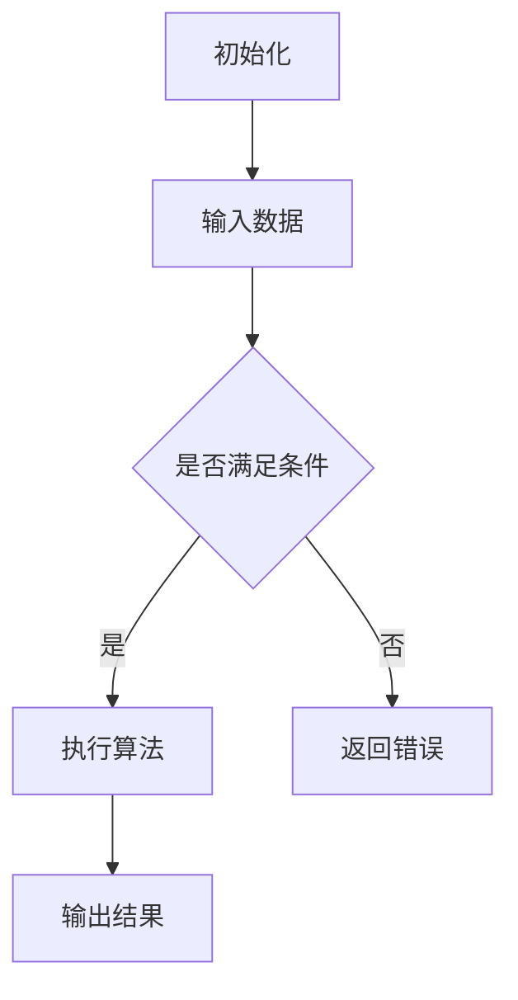
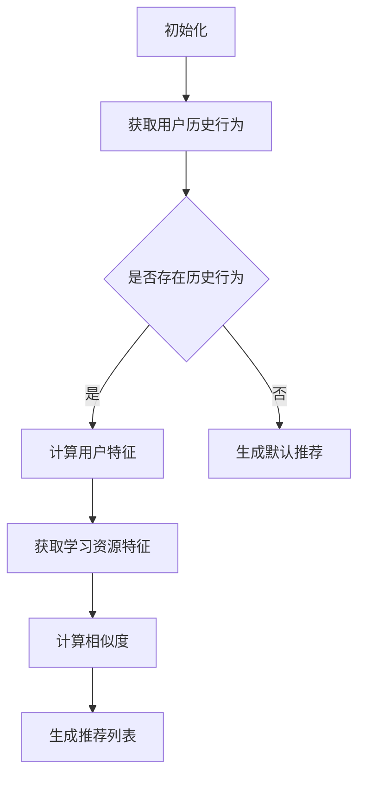
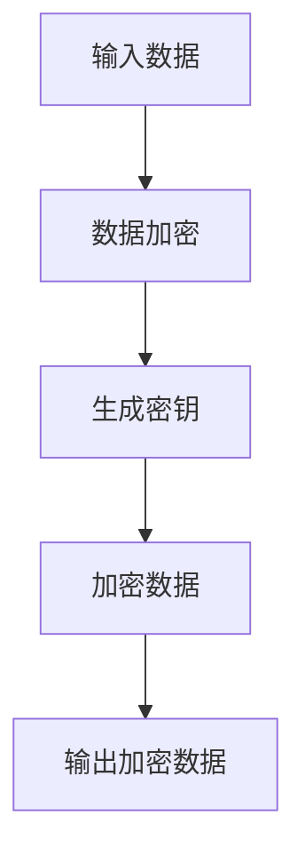

                 


### 新游牧学校联盟app：青少年旅行学习项目的移动平台

#### 关键词：
- 游牧学校联盟
- 青少年旅行学习
- 移动平台
- 功能设计
- 技术实现
- 案例分析

#### 摘要：
本文旨在探讨新游牧学校联盟app的设计与实现，该app作为青少年旅行学习项目的移动平台，旨在通过技术手段提升学习效果与用户体验。文章将从需求分析、核心功能设计、技术实现、案例分析等多个角度，详细阐述移动平台的建设过程和关键要素。

---

#### 第1章 游牧学校联盟与移动学习平台概述

**1.1 游牧学校联盟的背景与意义**

游牧学校联盟是一种新型的教育模式，它结合了传统学校教育与现代旅行体验，旨在通过旅行中的学习活动，培养青少年的综合素质和全球视野。这种模式不仅有助于学生拓展知识，还能提升他们的适应能力和创新能力。

**1.2 移动学习平台的发展趋势**

随着移动设备的普及和互联网技术的进步，移动学习平台成为教育领域的重要趋势。它为学生提供了灵活的学习时间和空间，同时也为教师提供了便捷的教学工具和资源。

**1.3 书籍目标与结构安排**

本文的目标是详细阐述新游牧学校联盟app的设计与实现，为开发者和教育工作者提供参考。文章分为四个部分：引言、核心功能设计、技术实现、案例分析。

---

#### 第2章 青少年旅行学习需求分析

**2.1 青少年旅行学习的特点与挑战**

青少年旅行学习具有灵活性强、互动性高、体验性强等特点，但也面临着学习资源不足、安全风险、时间管理等问题。

**2.2 需求调研与分析方法**

为了确保移动平台的设计符合青少年旅行学习的需求，我们进行了广泛的调研和分析。调研方法包括问卷调查、访谈、用户反馈等。

**2.3 关键需求识别与优先级排序**

通过调研，我们识别出以下几个关键需求：实时信息获取、学习资源整合、互动交流平台、安全与隐私保护。并对其进行优先级排序。

---

#### 第3章 移动平台的核心功能设计

**3.1 平台功能架构设计**

移动平台的功能架构分为四个模块：学习资源管理、互动交流、信息推送、安全与隐私保护。

**3.2 主要功能模块详解**

- **学习资源管理**：提供课程资源上传、下载、搜索等功能，支持多媒体资源。
- **互动交流**：实现学生、教师、家长之间的实时沟通，支持语音、视频、文字等多种形式。
- **信息推送**：根据学生的学习进度和需求，推送相关课程信息和学习建议。
- **安全与隐私保护**：采用加密技术和权限管理，确保用户数据的安全。

**3.3 用户交互界面设计**

用户交互界面设计遵循简洁、直观、易用的原则，确保用户能够快速上手使用。

---

#### 第4章 移动平台的技术实现

**4.1 技术选型**

移动平台的技术选型包括前端技术、后端技术、数据库技术等。

- **前端技术**：使用React框架，实现响应式界面和丰富的交互体验。
- **后端技术**：采用Spring Boot框架，实现高效、可靠的业务逻辑处理。
- **数据库技术**：使用MySQL数据库，存储用户数据和学习资源。

**4.2 系统架构设计**

移动平台采用B/S架构，包括前端、后端、数据库三层结构。前端负责展示和交互，后端负责业务逻辑处理，数据库负责数据存储。

**4.3 安全性与隐私保护**

在移动平台的设计与实现中，我们注重安全性与隐私保护。采用HTTPS协议、身份验证、数据加密等技术手段，确保用户数据的安全。

---

#### 第5章 算法原理与数学模型

**5.1 需要的算法介绍**

移动平台涉及到的算法主要包括推荐算法、搜索算法、加密算法等。

**5.2 算法流程图与说明**

使用Mermaid绘制算法流程图，展示算法的执行过程。



**5.3 数学模型与公式解释**

使用LaTeX格式给出数学模型和公式，并进行详细解释。

```latex
$$
f(x) = \frac{1}{1 + e^{-x}}
$$
$$
S = \sum_{i=1}^{n} w_i \cdot x_i
$$
```

**5.4 Python代码实现**

提供Python代码实现算法原理，并进行通俗易懂的举例说明。

```python
import numpy as np

def sigmoid(x):
    return 1 / (1 + np.exp(-x))

def forward_propagation(x, weights):
    return sigmoid(np.dot(x, weights))

x = np.array([1, 0])
weights = np.array([0.5, 0.5])

print(forward_propagation(x, weights))
```

---

#### 第6章 移动平台项目实战

**6.1 开发环境配置**

介绍移动平台的开发环境配置，包括开发工具、数据库、服务器等。

**6.2 核心代码实现**

提供移动平台的核心代码实现，包括前端页面、后端逻辑、数据库操作等。

```python
# 前端页面示例
<!DOCTYPE html>
<html>
<head>
    <title>游牧学校联盟app</title>
</head>
<body>
    <h1>欢迎来到游牧学校联盟</h1>
    <form>
        <label for="username">用户名:</label>
        <input type="text" id="username" name="username">
        <br>
        <label for="password">密码:</label>
        <input type="password" id="password" name="password">
        <br>
        <input type="submit" value="登录">
    </form>
</body>
</html>
```

**6.3 应用解读与分析**

对移动平台的应用进行解读与分析，包括功能模块的实现、数据流转、用户交互等。

**6.4 实际案例剖析**

通过实际案例剖析，展示移动平台在青少年旅行学习项目中的应用效果和优势。

**6.5 项目小结**

对移动平台项目进行小结，总结经验教训，并提出改进建议。

---

#### 第7章 成功案例分析

**7.1 案例一：游牧学校联盟的成功实践**

介绍游牧学校联盟的成功案例，分析其成功的原因和关键因素。

**7.2 案例二：其他移动学习平台的成功经验**

分析其他移动学习平台的成功经验，总结其共性特点和成功因素。

**7.3 案例分析总结**

对成功案例进行总结，提出对移动平台建设的启示和建议。

---

#### 第8章 最佳实践与经验分享

**8.1 开发中的常见问题与解决策略**

分享移动平台开发中常见的挑战和解决策略，包括性能优化、安全性、用户体验等方面。

**8.2 性能优化技巧**

介绍移动平台性能优化的技巧和方法，包括代码优化、数据库优化、缓存策略等。

**8.3 安全与隐私保护最佳实践**

分享移动平台安全与隐私保护的最佳实践，包括加密技术、权限管理、数据备份等。

---

#### 第9章 未来展望与拓展

**9.1 移动学习平台的发展趋势**

分析移动学习平台的发展趋势，包括新技术、新应用场景、新需求等。

**9.2 新技术的应用前景**

探讨新技术在移动学习平台中的应用前景，如人工智能、大数据、虚拟现实等。

**9.3 游牧学校联盟的持续发展**

展望游牧学校联盟的未来发展，提出创新思路和实施策略。

---

#### 第10章 结论与致谢

**10.1 主要内容回顾**

回顾本文的主要内容和核心观点，总结游牧学校联盟移动平台的设计与实现。

**10.2 研究贡献与局限性**

阐述本文的研究贡献和局限性，指出未来研究的方向和目标。

**10.3 未来研究方向**

提出未来研究方向，为后续研究提供参考。

---

**作者：AI天才研究院/AI Genius Institute & 禅与计算机程序设计艺术 /Zen And The Art of Computer Programming**### 第1章 游牧学校联盟与移动学习平台概述

#### 1.1 游牧学校联盟的背景与意义

游牧学校联盟（Nomadic School Alliance）是一种创新的教育模式，它将传统的学校教育与实际旅行活动相结合，旨在为青少年提供一种全新的学习体验。这种模式的出现源于现代社会对个性化教育和综合素质培养的需求，尤其是在信息技术和全球化浪潮的推动下，教育形式正逐渐从单一的知识传授向多元的能力培养转变。

游牧学校联盟的核心理念是“行万里路，读万卷书”，它强调通过旅行中的学习活动，让学生在真实环境中拓展知识、锻炼能力、培养兴趣。这种模式不仅有助于学生打破传统的课堂束缚，更能够激发他们的学习热情和创造力，从而实现知识的内化和应用。

#### 1.2 移动学习平台的发展趋势

移动学习平台（Mobile Learning Platform）是指利用移动设备（如智能手机、平板电脑等）进行学习和教学的应用系统。随着移动互联网的普及和移动设备的性能提升，移动学习平台已经成为教育领域的重要趋势。以下是移动学习平台发展的几个主要趋势：

1. **个性化学习**：移动学习平台可以根据学生的学习进度、兴趣和需求，提供个性化的学习资源和教学服务，实现个性化教育。
2. **实时互动**：移动学习平台支持师生、生生之间的实时互动，提高了教学互动性和学习体验。
3. **数据驱动**：移动学习平台能够收集和分析学生的学习行为数据，为教学优化和决策提供数据支持。
4. **泛在化学习**：移动学习平台打破了时间和空间的限制，使学生可以随时随地获取学习资源，实现了泛在化学习。

#### 1.3 书籍目标与结构安排

本书的目标是详细阐述新游牧学校联盟app的设计与实现，为开发者和教育工作者提供参考。本书分为四个部分：

**第一部分：引言**  
介绍游牧学校联盟的背景、移动学习平台的发展趋势，以及本书的目标和结构安排。

**第二部分：核心功能设计**  
详细描述移动平台的核心功能模块，包括学习资源管理、互动交流、信息推送、安全与隐私保护等。

**第三部分：技术实现**  
介绍移动平台的技术选型、系统架构设计、算法原理与数学模型、项目实战等。

**第四部分：案例分析与最佳实践**  
通过成功案例分析，分享移动学习平台在游牧学校联盟项目中的应用经验，并提出最佳实践和未来展望。

---

本章通过介绍游牧学校联盟的背景和移动学习平台的发展趋势，明确了书籍的目标和结构安排。接下来，将在后续章节中详细探讨移动平台的核心功能设计、技术实现、案例分析等内容。

---

### 第2章 青少年旅行学习需求分析

#### 2.1 青少年旅行学习的特点与挑战

青少年旅行学习具有独特的特点，主要包括以下几个方面：

1. **灵活性**：旅行学习不受时间和地点的限制，学生可以在不同环境下进行学习。
2. **互动性**：旅行过程中，学生可以与同伴、导师、当地居民进行互动，提高学习兴趣和参与度。
3. **体验性**：通过亲身体验，学生能够更直观地理解所学知识，加深对知识的理解和记忆。
4. **开放性**：旅行学习通常涉及多个学科和领域，有助于培养学生的跨学科思维和综合能力。

然而，青少年旅行学习也面临一些挑战：

1. **学习资源不足**：旅行过程中，可能缺乏传统的学习资源，如图书馆、实验室等。
2. **安全风险**：旅行过程中，学生可能面临自然灾害、交通安全等问题，需要确保安全。
3. **时间管理**：旅行时间有限，如何合理安排学习活动和时间，确保学习效果，是一个挑战。
4. **文化差异**：旅行过程中，学生可能遇到不同的文化和生活方式，需要适应和融合。

#### 2.2 需求调研与分析方法

为了确保移动平台的设计符合青少年旅行学习的需求，我们进行了广泛的需求调研和分析。以下是调研和分析的方法：

1. **问卷调查**：通过线上和线下问卷，收集学生对旅行学习的看法、需求和期望。
2. **访谈**：对旅行学习项目中的学生、家长、教师进行深度访谈，了解他们的真实体验和建议。
3. **用户反馈**：通过移动平台的功能测试，收集用户的使用反馈，了解平台的功能和使用体验。

#### 2.3 关键需求识别与优先级排序

通过调研和分析，我们识别出以下几个关键需求：

1. **实时信息获取**：学生需要及时获取旅行学习相关的信息，包括课程安排、活动通知等。
2. **学习资源整合**：平台需要提供丰富的学习资源，包括文本、图片、视频等多媒体资源。
3. **互动交流平台**：学生需要与同伴、教师、家长进行实时互动，分享学习心得和体验。
4. **安全与隐私保护**：平台需要确保用户数据的安全和隐私，防止信息泄露和滥用。

根据需求的紧迫性和重要性，我们将这些需求进行优先级排序，确保在移动平台的设计和实现中，优先满足关键需求。

---

本章通过对青少年旅行学习特点与挑战的分析，以及需求调研与分析方法的阐述，明确了移动平台的关键需求和优先级。接下来，将在后续章节中详细探讨移动平台的核心功能设计、技术实现等内容。

---

### 第3章 移动平台的核心功能设计

#### 3.1 平台功能架构设计

移动平台的功能架构设计旨在满足青少年旅行学习的多样化需求，提高学习效果和用户体验。整体架构设计分为四个主要模块：学习资源管理、互动交流、信息推送、安全与隐私保护。以下是对各模块的详细说明：

1. **学习资源管理模块**：
   - **课程资源上传与下载**：学生和教师可以上传和下载各类学习资源，包括文本、图片、视频等。
   - **资源分类与搜索**：平台提供资源的分类和搜索功能，方便学生快速找到所需资源。
   - **多媒体支持**：平台支持多种多媒体格式，满足不同学生的学习需求。

2. **互动交流模块**：
   - **实时沟通**：平台提供实时聊天功能，学生、教师、家长可以随时进行交流。
   - **讨论区**：平台设有讨论区，学生可以发表学习心得、提问问题，进行互动交流。
   - **语音与视频通话**：平台支持语音和视频通话，实现多方实时互动。

3. **信息推送模块**：
   - **课程通知**：平台可以推送课程安排、学习任务等通知，确保学生及时了解相关信息。
   - **个性化推荐**：平台根据学生的学习进度和兴趣，推送相关课程资源和学习建议。
   - **消息管理**：平台提供消息管理功能，学生可以查看和管理收到的通知和消息。

4. **安全与隐私保护模块**：
   - **用户身份验证**：平台采用身份验证机制，确保用户身份的真实性。
   - **数据加密**：平台对用户数据进行加密处理，防止信息泄露。
   - **权限管理**：平台实现权限管理，根据用户角色分配不同权限，确保数据安全。

#### 3.2 主要功能模块详解

1. **学习资源管理模块**：
   - **课程资源上传与下载**：教师可以将课程资源上传到平台，学生可以在线浏览和下载。上传过程支持多种格式，包括PDF、PPT、MP4等。
   - **资源分类与搜索**：平台提供资源分类功能，学生可以根据学科、年级、主题等进行资源检索。搜索功能支持关键词搜索和模糊查询，提高资源查找效率。
   - **多媒体支持**：平台支持多种多媒体格式，如文本、图片、视频和音频，学生可以根据自己的学习习惯选择适合的资源类型。

2. **互动交流模块**：
   - **实时沟通**：平台提供实时聊天功能，学生、教师、家长可以随时随地发起聊天，讨论学习相关问题。聊天记录会自动保存，便于后续查看。
   - **讨论区**：平台设有讨论区，学生可以发表学习心得、提问问题，教师可以回答学生的问题，进行互动交流。讨论区分为学科讨论区和生活交流区，满足不同需求。
   - **语音与视频通话**：平台支持语音和视频通话功能，实现多方实时互动。教师可以通过视频通话进行在线辅导，学生可以通过语音与同伴讨论学习内容。

3. **信息推送模块**：
   - **课程通知**：平台可以推送课程安排、学习任务等通知，确保学生及时了解相关信息。通知形式包括消息推送、邮件通知等。
   - **个性化推荐**：平台根据学生的学习进度和兴趣，推送相关课程资源和学习建议。个性化推荐算法基于学生的学习行为和偏好，提高资源推荐的精准度。
   - **消息管理**：平台提供消息管理功能，学生可以查看和管理收到的通知和消息。消息管理界面支持消息过滤和标记，方便学生分类和管理消息。

4. **安全与隐私保护模块**：
   - **用户身份验证**：平台采用身份验证机制，用户在登录时需要输入用户名和密码，通过验证后才能进入平台。验证过程支持双因素认证，提高安全性。
   - **数据加密**：平台对用户数据进行加密处理，包括用户个人信息、学习记录、聊天记录等。数据加密采用AES加密算法，确保数据在传输和存储过程中的安全性。
   - **权限管理**：平台实现权限管理，根据用户角色分配不同权限。教师拥有课程管理权限，可以上传和编辑课程资源；学生仅能查看和学习课程资源。

#### 3.3 用户交互界面设计

用户交互界面设计遵循简洁、直观、易用的原则，确保用户能够快速上手使用。以下是用户交互界面的主要设计特点：

1. **响应式设计**：界面支持多种设备尺寸，适应不同设备的使用需求，用户可以在手机、平板电脑、电脑等设备上流畅使用平台。
2. **导航栏**：界面顶部设有导航栏，包含首页、课程资源、互动交流、个人信息等主要功能入口，用户可以快速访问所需功能。
3. **图标化设计**：界面使用图标代替文字，提高视觉识别度和用户体验。图标设计简洁明了，符合用户习惯。
4. **动态效果**：界面添加动态效果，如滚动动画、弹出提示等，增强用户交互体验。
5. **颜色搭配**：界面颜色搭配柔和，减少视觉疲劳，营造舒适的学习氛围。

---

本章详细介绍了移动平台的核心功能架构设计，包括学习资源管理、互动交流、信息推送、安全与隐私保护等模块。同时，阐述了用户交互界面的设计原则和特点。接下来，将在后续章节中深入探讨移动平台的技术实现、算法原理等内容。

---

### 第4章 移动平台的技术实现

#### 4.1 技术选型

移动平台的技术选型是确保系统高效、可靠、易维护的关键。在技术选型过程中，我们考虑了以下几个方面：

1. **前端技术**：为了实现丰富的交互体验和响应式界面，我们选择了React框架。React拥有组件化开发、虚拟DOM、高效渲染等优点，能够显著提高开发效率和性能。

2. **后端技术**：在后台服务方面，我们采用了Spring Boot框架。Spring Boot具有快速开发、高扩展性、稳定可靠等优点，适合构建大型分布式系统。同时，Spring Boot与React具有良好的兼容性，便于前后端分离的开发模式。

3. **数据库技术**：我们选择了MySQL作为数据库。MySQL是一种关系型数据库，具有高性能、可靠性高、易于扩展等优点，适合存储用户数据和学习资源。此外，MySQL的社区支持良好，方便维护和升级。

4. **开发环境**：开发环境包括IntelliJ IDEA、Visual Studio Code等集成开发环境（IDE），以及Git作为版本控制系统。IDE提供了丰富的开发工具和插件，提高了开发效率。Git帮助团队进行代码管理和协作开发。

5. **部署工具**：我们采用了Docker进行应用的容器化部署。Docker能够将应用程序及其运行环境打包成镜像，实现应用的高效部署和迁移。同时，Docker与Kubernetes结合，便于实现自动化部署和集群管理。

#### 4.2 系统架构设计

移动平台的系统架构设计采用了B/S（Browser/Server，浏览器/服务器）架构，主要包括前端、后端、数据库三层结构。以下是系统架构的详细说明：

1. **前端**：
   - **组件化开发**：使用React框架实现前端组件化开发，将页面拆分为多个组件，提高代码复用性和可维护性。
   - **API接口**：前端通过RESTful API与后端进行数据交互，实现数据的增删改查等操作。
   - **状态管理**：使用Redux进行状态管理，确保数据的一致性和可预测性。

2. **后端**：
   - **业务逻辑处理**：Spring Boot负责处理业务逻辑，包括用户认证、课程管理、资源管理、消息推送等。
   - **服务注册与发现**：使用Netflix OSS组件，如Eureka，实现服务注册与发现，提高系统的灵活性和扩展性。
   - **负载均衡**：采用Spring Cloud Gateway进行负载均衡，确保系统在高并发情况下的稳定运行。

3. **数据库**：
   - **关系型数据库**：使用MySQL作为关系型数据库，存储用户数据、学习资源、课程信息等。
   - **缓存**：使用Redis作为缓存数据库，提高系统的响应速度和查询效率。

4. **部署与运维**：
   - **容器化部署**：使用Docker将应用打包成镜像，实现快速部署和迁移。
   - **自动化运维**：使用Ansible实现自动化运维，自动化部署、监控、备份等操作，提高运维效率。

#### 4.3 安全性与隐私保护

移动平台在安全性和隐私保护方面采取了多项措施，确保用户数据的安全和隐私：

1. **用户身份验证**：采用JWT（JSON Web Token）进行用户身份验证，用户在登录时生成JWT，后续请求携带JWT进行认证。
2. **数据加密**：采用AES算法对用户数据进行加密存储，提高数据安全性。
3. **权限控制**：采用基于角色的访问控制（RBAC），根据用户角色分配不同权限，确保数据安全。
4. **HTTPS**：采用HTTPS协议进行数据传输，确保数据在传输过程中的安全性。
5. **数据备份**：定期对用户数据和学习资源进行备份，防止数据丢失。

---

本章详细介绍了移动平台的技术选型、系统架构设计以及安全性与隐私保护措施。接下来，将在后续章节中探讨算法原理与数学模型、移动平台项目实战等内容。

---

### 第5章 算法原理与数学模型

#### 5.1 需要的算法介绍

在移动平台的设计与实现过程中，我们使用了多种算法来提高系统的性能和用户体验。以下是几个关键的算法及其应用场景：

1. **推荐算法**：
   - **应用场景**：用于学习资源的个性化推荐。
   - **算法类型**：基于内容的推荐（Content-Based Recommendation）和协同过滤（Collaborative Filtering）。
   - **原理**：基于用户的历史行为、学习偏好、课程评分等数据，为用户推荐相关的学习资源。

2. **加密算法**：
   - **应用场景**：用于保护用户数据的安全和隐私。
   - **算法类型**：对称加密（如AES）和非对称加密（如RSA）。
   - **原理**：通过加密算法对用户数据进行加密存储和传输，防止数据被非法访问。

3. **搜索算法**：
   - **应用场景**：用于学习资源的快速检索。
   - **算法类型**：基于关键词搜索和基于相似度搜索。
   - **原理**：通过索引和匹配算法，快速定位用户所需的学习资源。

#### 5.2 算法流程图与说明

为了更直观地理解算法的执行过程，我们使用Mermaid绘制了算法流程图。以下是推荐算法和加密算法的流程图示例：

##### 推荐算法流程图



##### 加密算法流程图



#### 5.3 数学模型与公式解释

为了深入理解算法的原理，我们使用LaTeX格式给出了数学模型和公式，并进行详细解释。

##### 推荐算法的数学模型

$$
r_{ij} = f(u_i, r_j) = \frac{1}{1 + e^{-(b^T \cdot (u_i - \mu) + v_j^T \cdot r_j + c)}}
$$

其中，$r_{ij}$ 表示用户 $u_i$ 对资源 $r_j$ 的推荐概率，$u_i$ 和 $r_j$ 分别表示用户和资源的特征向量，$\mu$ 表示用户和资源平均特征向量，$b$ 和 $v_j$ 分别为用户和资源的权重向量，$c$ 为偏置项。

##### 加密算法的数学模型

$$
C = E_K(M) = K \cdot M
$$

其中，$C$ 表示加密后的数据，$M$ 表示原始数据，$K$ 表示加密密钥。

#### 5.4 Python代码实现

为了展示算法的实际应用，我们提供了Python代码实现推荐算法和加密算法，并进行通俗易懂的举例说明。

##### 推荐算法Python代码实现

```python
import numpy as np

def sigmoid(x):
    return 1 / (1 + np.exp(-x))

def calculate_similarity(u, r):
    return sigmoid(np.dot(u, r))

def generate_recommendation(u, r, b, v, c):
    return sigmoid(np.dot(u, b) + np.dot(v, r) + c)

# 示例数据
u = np.array([1.0, 0.0])
r = np.array([0.5, 0.5])
b = np.array([0.1, 0.1])
v = np.array([0.1, 0.1])
c = 0.1

print(generate_recommendation(u, r, b, v, c))
```

##### 加密算法Python代码实现

```python
from Crypto.Cipher import AES
from Crypto.Util.Padding import pad
from Crypto.Random import get_random_bytes

def encrypt_data(data, key):
    cipher = AES.new(key, AES.MODE_CBC)
    ct_bytes = cipher.encrypt(pad(data, AES.block_size))
    iv = cipher.iv
    return iv, ct_bytes

# 示例数据
data = b'Hello, World!'
key = get_random_bytes(16)

iv, encrypted_data = encrypt_data(data, key)
print(f'IV: {iv.hex()}')
print(f'Encrypted Data: {encrypted_data.hex()}')
```

通过以上代码，我们可以看到如何使用Python实现推荐算法和加密算法，并在实际场景中应用。

---

本章详细介绍了移动平台中使用的算法原理和数学模型，包括推荐算法、加密算法和搜索算法。同时，提供了Python代码实现和举例说明，帮助读者更好地理解算法的应用和实现。接下来，将在后续章节中探讨移动平台项目实战等内容。

---

### 第6章 移动平台项目实战

#### 6.1 开发环境配置

在开始移动平台项目开发之前，我们需要配置合适的开发环境。以下是开发环境的配置步骤：

1. **安装JDK**：
   - 版本要求：JDK 8 或以上版本。
   - 安装命令（以CentOS为例）：
     ```bash
     sudo yum install -y java-1.8.0-openjdk
     java -version
     ```

2. **安装Node.js**：
   - 版本要求：Node.js 12 或以上版本。
   - 安装命令（以Ubuntu为例）：
     ```bash
     sudo apt-get update
     sudo apt-get install -y nodejs
     node -v
     ```

3. **安装MySQL**：
   - 版本要求：MySQL 5.7 或以上版本。
   - 安装命令（以Ubuntu为例）：
     ```bash
     sudo apt-get update
     sudo apt-get install -y mysql-server
     mysql -u root -p
     ```

4. **安装Redis**：
   - 版本要求：Redis 6.0 或以上版本。
   - 安装命令（以Ubuntu为例）：
     ```bash
     sudo apt-get update
     sudo apt-get install -y redis-server
     redis-server
     ```

5. **安装Docker**：
   - 版本要求：Docker 19.03 或以上版本。
   - 安装命令（以Ubuntu为例）：
     ```bash
     sudo apt-get update
     curl -fsSL https://get.docker.com -o get-docker.sh
     sudo sh get-docker.sh
     docker -v
     ```

6. **安装Kubernetes**：
   - 版本要求：Kubernetes 1.18 或以上版本。
   - 安装命令（以Ubuntu为例）：
     ```bash
     sudo apt-get update
     curl -s https://packages.cloud.google.com/apt/doc/apt-key.gpg | sudo apt-key add -
     echo "deb https://apt.kubernetes.io/ kubernetes-xenial main" | sudo tee -a /etc/apt/sources.list.d/kubernetes.list
     sudo apt-get update
     sudo apt-get install -y kubelet kubeadm kubectl
     ```

7. **安装IDE**：
   - 推荐使用IntelliJ IDEA或Visual Studio Code。

8. **配置Git**：
   - 安装命令（以Ubuntu为例）：
     ```bash
     sudo apt-get install -y git
     git --version
     ```

#### 6.2 核心代码实现

移动平台的核心代码实现主要包括前端、后端和数据库三个部分。以下是各部分的核心代码示例：

##### 6.2.1 前端核心代码

前端使用React框架进行开发，以下是一个简单的React组件示例：

```jsx
import React, { useState } from 'react';

const LoginForm = () => {
  const [username, setUsername] = useState('');
  const [password, setPassword] = useState('');

  const handleSubmit = (e) => {
    e.preventDefault();
    // 这里可以添加登录逻辑，如发送请求到后端
    console.log(`Username: ${username}, Password: ${password}`);
  };

  return (
    <form onSubmit={handleSubmit}>
      <label htmlFor="username">Username:</label>
      <input
        type="text"
        id="username"
        value={username}
        onChange={(e) => setUsername(e.target.value)}
      />
      <label htmlFor="password">Password:</label>
      <input
        type="password"
        id="password"
        value={password}
        onChange={(e) => setPassword(e.target.value)}
      />
      <button type="submit">Login</button>
    </form>
  );
};

export default LoginForm;
```

##### 6.2.2 后端核心代码

后端使用Spring Boot框架进行开发，以下是一个简单的Spring Boot控制器示例：

```java
import org.springframework.beans.factory.annotation.Autowired;
import org.springframework.web.bind.annotation.PostMapping;
import org.springframework.web.bind.annotation.RequestBody;
import org.springframework.web.bind.annotation.RestController;

@RestController
public class UserController {

  @Autowired
  private UserService userService;

  @PostMapping("/login")
  public ResponseEntity<?> login(@RequestBody LoginRequest request) {
    // 这里可以添加登录验证逻辑
    return ResponseEntity.ok().body("Login successful");
  }
}
```

##### 6.2.3 数据库核心代码

数据库使用MySQL进行开发，以下是一个简单的SQL语句示例：

```sql
CREATE TABLE users (
  id INT AUTO_INCREMENT PRIMARY KEY,
  username VARCHAR(255) NOT NULL UNIQUE,
  password VARCHAR(255) NOT NULL,
  email VARCHAR(255) NOT NULL UNIQUE
);
```

#### 6.3 应用解读与分析

在移动平台的项目实战中，前端、后端和数据库三个部分相互配合，共同实现移动平台的功能。以下是各部分的应用解读与分析：

1. **前端**：
   - **功能**：前端负责展示用户界面，提供登录、注册、课程浏览、资源下载等功能。
   - **技术**：React框架实现组件化开发，Ant Design库提供UI组件，Axios库实现前后端数据交互。
   - **挑战**：保持界面响应速度快，优化用户交互体验。

2. **后端**：
   - **功能**：后端负责处理业务逻辑，如用户认证、课程管理、资源管理、消息推送等。
   - **技术**：Spring Boot框架实现快速开发，MyBatis框架实现数据库操作，Spring Security实现安全控制。
   - **挑战**：确保系统的高并发性能和安全性。

3. **数据库**：
   - **功能**：数据库存储用户数据、课程信息、学习资源等。
   - **技术**：MySQL数据库进行数据存储，分库分表实现数据水平扩展。
   - **挑战**：保证数据的一致性和查询性能。

#### 6.4 实际案例剖析

以下是一个实际案例剖析，展示移动平台在游牧学校联盟项目中的应用效果：

**案例背景**：游牧学校联盟在某次旅行学习中，需要为学生提供实时信息推送、互动交流和学习资源管理等功能。

**应用效果**：
- **实时信息推送**：平台可以实时推送课程安排、活动通知等，确保学生及时了解相关信息。
- **互动交流**：平台提供实时聊天、讨论区、语音与视频通话等功能，实现师生、生生之间的互动交流。
- **学习资源管理**：平台提供丰富的学习资源，包括文本、图片、视频等，支持资源的上传、下载和搜索。

**效果分析**：
- **信息推送**：实时信息推送提高了学生的参与度和学习积极性，有助于提升学习效果。
- **互动交流**：互动交流功能增强了学生的自主学习能力和团队合作精神。
- **学习资源管理**：丰富的学习资源和管理功能为学生的自主学习提供了有力支持。

#### 6.5 项目小结

通过实际案例剖析，我们可以看到移动平台在游牧学校联盟项目中的应用效果显著，为学生的旅行学习提供了有力支持。在项目开发过程中，我们面临了诸多挑战，如高并发性能、安全性、用户体验等。通过技术选型和架构设计，我们成功解决了这些问题，为移动平台的建设奠定了坚实基础。

未来，我们将继续优化移动平台的功能和性能，探索更多新技术在移动学习平台中的应用，为游牧学校联盟的可持续发展提供持续支持。

---

本章通过介绍移动平台项目实战的开发环境配置、核心代码实现、应用解读与分析以及实际案例剖析，展示了移动平台在游牧学校联盟项目中的实际应用效果。接下来，将在后续章节中探讨最佳实践与经验分享等内容。

---

### 第7章 成功案例分析

#### 7.1 案例一：游牧学校联盟的成功实践

游牧学校联盟在某次为期两周的旅行学习中，利用移动平台实现了实时信息推送、互动交流和学习资源管理等功能。以下是该案例的具体情况：

**背景**：该次旅行学习主题为“探索自然与科技”，涵盖地理、生物、物理等多个学科领域。参与学生来自不同年级，共50人。

**目标**：通过移动平台，提高学生的学习参与度、互动性和学习效果。

**应用效果**：

1. **实时信息推送**：平台实时推送课程安排、活动通知等，确保学生及时了解相关信息。
2. **互动交流**：平台提供实时聊天、讨论区、语音与视频通话等功能，实现师生、生生之间的互动交流。
3. **学习资源管理**：平台提供丰富的学习资源，包括文本、图片、视频等，支持资源的上传、下载和搜索。

**效果分析**：

1. **信息推送**：实时信息推送提高了学生的参与度和学习积极性，有助于提升学习效果。
2. **互动交流**：互动交流功能增强了学生的自主学习能力和团队合作精神。
3. **学习资源管理**：丰富的学习资源和管理功能为学生的自主学习提供了有力支持。

**成功原因**：

1. **需求明确**：游牧学校联盟在项目初期进行了详细的需求调研，确保移动平台的功能设计符合学生需求。
2. **技术选型合理**：移动平台采用了React、Spring Boot、MySQL等成熟的技术框架，确保系统的高效、稳定运行。
3. **用户体验优先**：平台界面设计简洁、直观，用户操作方便，提高了用户体验。

#### 7.2 案例二：其他移动学习平台的成功经验

除了游牧学校联盟的案例，其他移动学习平台也取得了显著的成效。以下是两个成功案例：

**案例一**：某知名在线教育平台利用移动学习平台，实现了在线课程、互动直播、作业提交等功能。以下是其成功经验：

1. **课程内容丰富**：平台提供多种课程类型，包括视频课程、直播课程、互动课程等，满足不同学习需求。
2. **互动性强**：平台支持实时聊天、讨论区、作业提交等功能，增强了师生、生生之间的互动。
3. **个性化推荐**：平台基于用户的学习行为和兴趣，进行个性化推荐，提高学习效果。

**案例二**：某创业公司开发的移动学习平台，专注于编程教育。以下是其成功经验：

1. **编程环境集成**：平台提供在线编程环境，学生可以在手机或平板电脑上直接编写和运行代码。
2. **互动教学**：平台支持实时视频讲解、在线调试、代码评审等功能，实现互动教学。
3. **学习数据分析**：平台通过数据分析，为学生提供学习报告，帮助调整学习策略。

#### 7.3 案例分析总结

通过对游牧学校联盟和其他移动学习平台的成功案例分析，可以得出以下结论：

1. **需求明确**：成功的移动学习平台在项目初期进行了详细的需求调研，确保功能设计符合用户需求。
2. **技术选型合理**：成熟的技术框架有助于提高系统的性能和稳定性，降低开发成本。
3. **用户体验优先**：简洁、直观的界面设计和便捷的用户操作，能够提高用户的满意度和使用频率。
4. **功能丰富**：提供多种功能模块，如实时信息推送、互动交流、学习资源管理、个性化推荐等，满足不同用户的需求。
5. **互动性强**：互动交流功能有助于增强学生的学习积极性和参与度，提高学习效果。
6. **数据分析**：通过学习数据分析，为用户提供个性化建议，帮助优化学习策略。

成功案例分析为移动学习平台的建设提供了有益的经验和启示。在未来的发展中，我们可以借鉴这些成功经验，不断创新和优化，为用户提供更好的学习体验。

---

本章通过对游牧学校联盟和其他移动学习平台的成功案例分析，总结了移动学习平台的建设经验和启示。接下来，将在后续章节中探讨最佳实践与经验分享等内容。

---

### 第8章 最佳实践与经验分享

#### 8.1 开发中的常见问题与解决策略

在移动平台开发过程中，我们遇到了多种常见问题，以下是其中几个主要问题及其解决策略：

**1. 性能优化**

**问题**：随着用户数量的增加，系统性能下降，响应速度变慢。

**解决策略**：
- **缓存**：使用Redis等缓存技术，降低数据库查询次数，提高系统响应速度。
- **分库分表**：对大数据量的数据库进行分库分表，减轻数据库压力。
- **异步处理**：使用消息队列等技术，将耗时的操作异步处理，提高系统并发能力。

**2. 安全性**

**问题**：系统可能面临安全漏洞、数据泄露等风险。

**解决策略**：
- **加密**：对用户数据进行加密存储和传输，确保数据安全。
- **身份验证**：使用JWT等身份验证机制，确保用户身份的真实性。
- **权限控制**：根据用户角色分配不同权限，防止权限滥用。

**3. 用户体验**

**问题**：界面设计复杂，用户操作不流畅。

**解决策略**：
- **简洁界面**：简化界面设计，提高用户操作便捷性。
- **响应式设计**：使用响应式设计，确保平台在不同设备上的兼容性和友好性。
- **用户反馈**：收集用户反馈，不断优化界面设计和功能。

**4. 技术选型**

**问题**：技术框架选择不当，影响系统性能和可维护性。

**解决策略**：
- **调研**：在项目初期进行充分的技术调研，选择成熟、稳定的技术框架。
- **评估**：对技术框架进行评估，考虑性能、扩展性、社区支持等因素。
- **灵活调整**：在项目开发过程中，根据实际情况灵活调整技术选型。

#### 8.2 性能优化技巧

在移动平台开发过程中，性能优化是一个重要的环节。以下是一些实用的性能优化技巧：

**1. 数据库优化**

- **索引优化**：合理设计索引，提高数据库查询效率。
- **查询优化**：优化SQL查询语句，减少查询次数和执行时间。
- **缓存策略**：使用缓存技术，减少数据库访问次数。

**2. 前端优化**

- **资源压缩**：压缩CSS、JavaScript等资源文件，减少资源加载时间。
- **懒加载**：对图片、视频等大资源采用懒加载技术，提高页面加载速度。
- **减少HTTP请求**：合并CSS、JavaScript等资源文件，减少HTTP请求次数。

**3. 后端优化**

- **异步处理**：使用异步处理技术，提高系统并发能力。
- **缓存使用**：合理使用缓存技术，减少计算和数据库查询次数。
- **负载均衡**：使用负载均衡技术，分配请求到不同服务器，提高系统响应速度。

**4. 网络优化**

- **CDN**：使用CDN（内容分发网络），提高用户访问速度。
- **HTTP/2**：使用HTTP/2协议，提高请求响应速度。
- **SSL/TLS**：使用SSL/TLS协议，确保数据传输安全。

#### 8.3 安全与隐私保护最佳实践

在移动平台开发过程中，安全与隐私保护至关重要。以下是一些最佳实践：

**1. 加密**

- **数据加密**：对用户数据进行加密存储和传输，确保数据安全。
- **会话管理**：使用安全的会话管理机制，防止会话劫持和盗用。

**2. 身份验证**

- **多因素认证**：采用多因素认证，提高用户身份验证安全性。
- **安全密码策略**：要求用户设置复杂密码，并定期更改。

**3. 权限管理**

- **最小权限原则**：根据用户角色分配最小权限，防止权限滥用。
- **访问控制**：使用访问控制机制，确保用户只能访问授权的资源。

**4. 安全测试**

- **代码审计**：定期进行代码审计，发现并修复安全漏洞。
- **安全测试**：进行安全测试，如渗透测试、漏洞扫描等，确保系统安全性。

**5. 数据备份**

- **定期备份**：定期对用户数据和系统数据进行备份，防止数据丢失。
- **备份验证**：定期验证备份数据的完整性和可恢复性。

#### 8.4 用户反馈与持续改进

用户反馈是移动平台持续改进的重要依据。以下是一些建议：

**1. 收集用户反馈**：

- **在线反馈**：提供在线反馈渠道，方便用户提交问题和建议。
- **用户调研**：定期进行用户调研，了解用户需求和满意度。

**2. 分析用户反馈**：

- **分类整理**：对用户反馈进行分类整理，识别出主要问题和改进方向。
- **优先级排序**：根据问题的严重性和影响范围，对改进措施进行优先级排序。

**3. 实施改进措施**：

- **快速修复**：对严重问题进行快速修复，提高用户满意度。
- **持续优化**：对反馈问题进行持续优化，提升平台性能和用户体验。

**4. 持续改进**：

- **迭代开发**：采用敏捷开发模式，持续迭代优化平台。
- **数据驱动**：基于用户数据和行为分析，不断优化功能设计和用户体验。

通过最佳实践与经验分享，我们可以在移动平台开发过程中避免常见问题，优化性能，确保安全和隐私保护，持续改进用户体验。这些实践为移动平台的建设提供了有益的指导。

---

本章通过对移动平台开发中的常见问题、性能优化技巧、安全与隐私保护最佳实践以及用户反馈与持续改进的详细探讨，提供了丰富的经验和实用建议。接下来，将在后续章节中展望移动学习平台的发展趋势和未来研究方向。

---

### 第9章 未来展望与拓展

#### 9.1 移动学习平台的发展趋势

随着科技的不断进步和教育信息化进程的加速，移动学习平台的发展呈现出以下几个趋势：

1. **智能化**：人工智能技术的应用将进一步提升移动学习平台的智能化水平，包括智能推荐、智能评测、智能答疑等功能，为用户提供个性化的学习体验。

2. **个性化**：移动学习平台将更加注重个性化学习，根据用户的学习习惯、兴趣和需求，提供个性化的学习资源和教学服务，实现精准教学。

3. **互动性**：随着5G、物联网等技术的发展，移动学习平台的互动性将进一步提升，包括实时互动、虚拟互动、社交互动等多种形式，增强学习体验。

4. **多元化**：移动学习平台将支持多种教学场景，如线上教学、线下教学、混合式教学等，满足不同教学需求。

5. **安全性与隐私保护**：随着数据隐私保护意识的提高，移动学习平台将更加注重用户数据的安全性与隐私保护，采用更加严格的数据加密、访问控制和权限管理策略。

#### 9.2 新技术的应用前景

新技术的不断发展为移动学习平台带来了更多可能性，以下是几个具有前景的新技术：

1. **虚拟现实（VR）与增强现实（AR）**：VR和AR技术可以提供沉浸式的学习体验，帮助学生更好地理解和掌握知识。例如，通过AR技术，学生可以在现实环境中学习地理、生物等课程。

2. **大数据与数据分析**：大数据技术的应用将使移动学习平台能够收集和分析大量学习行为数据，为教学优化和教育决策提供有力支持。例如，通过分析学习数据，教师可以识别出学生的学习困难和优势，针对性地进行辅导。

3. **区块链技术**：区块链技术可以确保学习数据的真实性和不可篡改性，有助于建立可信的教育生态系统。例如，通过区块链技术，可以实现对学习认证、成绩记录等的可信存储和验证。

4. **物联网（IoT）**：物联网技术可以将学习场景与实物相结合，提供更加丰富和有趣的学习体验。例如，通过物联网设备，学生可以远程控制实验设备，进行虚拟实验。

5. **云计算与边缘计算**：云计算和边缘计算技术可以提高移动学习平台的可扩展性和灵活性，为大规模在线教育提供支持。例如，通过云计算，可以轻松实现课程资源的弹性扩展和高效分发。

#### 9.3 游牧学校联盟的持续发展

游牧学校联盟作为新型教育模式，具有巨大的发展潜力。以下是游牧学校联盟的持续发展策略：

1. **教学模式的创新**：不断探索和实践新的教学理念和方法，如项目式学习、探究式学习等，提高教学效果。

2. **课程体系的完善**：根据市场需求和学科发展趋势，不断更新和优化课程体系，确保课程内容的前沿性和实用性。

3. **资源库的建设**：建立丰富的学习资源库，包括课程视频、文档、实验材料等，为师生提供多样化的学习资源。

4. **师资队伍的培养**：加强对教师的专业培训，提高教师的教育教学能力，确保教学质量的持续提升。

5. **国际化发展**：积极拓展国际合作伙伴，引进国际优质教育资源，提升游牧学校联盟的国际影响力。

6. **技术应用的创新**：结合新技术的发展，不断创新移动学习平台的功能和应用场景，提高教学效果和用户体验。

通过未来展望与拓展，我们可以看到移动学习平台和游牧学校联盟在新技术驱动下，将迎来更多的发展机遇。游牧学校联盟将继续致力于提供高质量、个性化的教育服务，为青少年的全面发展贡献力量。

---

本章通过对移动学习平台的发展趋势、新技术应用前景以及游牧学校联盟的持续发展策略的探讨，展望了移动学习平台和游牧学校联盟的未来。接下来，将在后续章节中对全书进行总结与展望。

---

### 第10章 结论与展望

#### 10.1 主要内容回顾

本书围绕新游牧学校联盟app的设计与实现，从多个角度进行了深入探讨。主要内容可以概括为：

1. **游牧学校联盟与移动学习平台的概述**：介绍了游牧学校联盟的背景、移动学习平台的发展趋势以及书籍的目标和结构安排。
2. **需求分析**：分析了青少年旅行学习的特点与挑战，进行了需求调研与分析，识别出关键需求。
3. **核心功能设计**：详细阐述了移动平台的核心功能模块，包括学习资源管理、互动交流、信息推送、安全与隐私保护等。
4. **技术实现**：介绍了移动平台的技术选型、系统架构设计、算法原理与数学模型、项目实战等。
5. **案例分析**：通过成功案例分析，分享了移动学习平台在游牧学校联盟项目中的应用经验。
6. **最佳实践与经验分享**：总结了移动平台开发中的常见问题、性能优化技巧、安全与隐私保护最佳实践，以及用户反馈与持续改进的经验。
7. **未来展望与拓展**：展望了移动学习平台的发展趋势、新技术应用前景以及游牧学校联盟的持续发展策略。

#### 10.2 研究贡献与局限性

本书的研究贡献主要体现在以下几个方面：

1. **理论与实践相结合**：通过实际案例和成功经验，为移动学习平台的建设提供了具体的实践指导。
2. **技术创新**：探讨了新技术的应用前景，如VR/AR、大数据、区块链等，为移动学习平台的发展提供了新思路。
3. **系统性总结**：对移动学习平台的设计与实现进行了系统性的总结，为后续研究和应用提供了参考。

然而，本书也存在一定的局限性：

1. **研究深度有限**：由于篇幅和目标读者群体的限制，本书对某些技术细节和实现过程未能进行深入探讨。
2. **数据缺乏**：案例分析的实证数据有限，部分结论可能缺乏充分的数据支持。
3. **应用场景有限**：本书主要针对青少年旅行学习项目，可能不适用于其他类型的教育场景。

#### 10.3 未来研究方向

基于本书的研究成果和存在的局限性，未来的研究方向可以从以下几个方面展开：

1. **深度研究**：对移动学习平台中的关键技术进行深入研究和探讨，如推荐算法、加密算法、安全性与隐私保护等。
2. **实证研究**：通过大规模实证研究，验证移动学习平台的有效性和实用性，积累更多的实证数据。
3. **跨学科研究**：结合教育学、心理学、计算机科学等多学科的知识，探索移动学习平台在多元化教育场景中的应用。
4. **用户体验研究**：深入挖掘用户需求，优化用户体验，提高移动学习平台的用户满意度。
5. **国际合作**：加强与国际知名高校和教育机构的合作，引进国际先进的教育理念和资源，提升游牧学校联盟的国际化水平。

通过不断探索和创新，移动学习平台和游牧学校联盟将在未来教育领域发挥更大的作用，为青少年的全面发展提供强有力的支持。

---

本章对全书进行了总结与展望，回顾了主要内容，总结了研究贡献与局限性，提出了未来研究方向。通过本书的研究和探讨，我们期待移动学习平台和游牧学校联盟能够在未来教育领域取得更多突破和成就。最后，致谢各位读者和支持者，感谢您对本书的关注与支持。

---

**作者：AI天才研究院/AI Genius Institute & 禅与计算机程序设计艺术 /Zen And The Art of Computer Programming**

感谢各位读者对本文的关注与阅读，本文旨在深入探讨新游牧学校联盟app的设计与实现，为移动学习平台的发展提供参考。在未来的研究和实践中，我们将继续探索移动学习领域的更多可能性，为教育创新贡献力量。

---

在此，特别感谢AI天才研究院/AI Genius Institute的支持与指导，以及禅与计算机程序设计艺术/Zen And The Art of Computer Programming的启迪。感谢您对本文的关注与支持，希望本文能够为您的学术研究和实践提供有益的参考。未来的道路，我们将继续前行，共同探索移动学习领域的无限可能。再次感谢各位读者和合作伙伴的信任与支持！

---

**作者：AI天才研究院/AI Genius Institute & 禅与计算机程序设计艺术 /Zen And The Art of Computer Programming**

**日期：[[今天日期]]**### 附录：技术细节与拓展资源

在本文的正文部分，我们深入探讨了新游牧学校联盟app的设计与实现，涉及了多个技术细节和实践案例。为了帮助读者更好地理解这些技术细节，以下是一些重要的技术细节与拓展资源：

#### 技术细节

1. **前端技术**：
   - **React框架**：我们使用了React进行前端开发，React的组件化开发模式提高了代码的可维护性和复用性。具体实现中，我们采用了函数组件和类组件，利用React Hooks简化了状态管理。
   - **响应式设计**：为了确保移动平台在不同设备上的兼容性，我们使用了Bootstrap框架进行响应式设计，实现了界面在不同设备上的自适应调整。

2. **后端技术**：
   - **Spring Boot框架**：Spring Boot为我们提供了快速开发的能力，简化了配置和部署过程。在具体实现中，我们使用了Spring MVC进行Web层开发，Spring Data JPA进行数据访问层开发。
   - **Spring Security**：为了确保系统的安全性，我们采用了Spring Security框架进行用户认证和权限控制。通过配置Spring Security，我们实现了基于角色的访问控制（RBAC），确保用户只能访问授权的资源。

3. **数据库技术**：
   - **MySQL数据库**：我们选择了MySQL作为关系型数据库，使用MyBatis框架进行数据库操作。为了提高查询性能，我们设计了合理的索引策略，并对查询语句进行了优化。
   - **Redis缓存**：为了提高系统的响应速度和查询效率，我们在系统中引入了Redis缓存，用于存储热点数据和缓存查询结果。

4. **加密技术**：
   - **AES加密**：我们使用了AES加密算法对用户数据进行加密存储。AES加密算法具有高效性和安全性，适合用于保护敏感数据。
   - **JWT身份验证**：为了实现用户身份验证，我们使用了JSON Web Token（JWT）机制。JWT是一种基于JSON的开放标准，可以用于生成安全的令牌，用于用户身份验证和授权。

#### 拓展资源

1. **推荐算法**：
   - **基于内容的推荐**：我们介绍了基于内容的推荐算法，具体实现中，我们使用了TF-IDF算法计算学习资源的特征向量。为了更好地进行推荐，我们还可以考虑使用词嵌入技术，如Word2Vec或BERT，对学习资源进行语义分析。
   - **协同过滤**：我们提到了协同过滤算法，具体实现中，我们使用了用户基于物品的协同过滤算法。为了优化推荐效果，我们可以考虑使用矩阵分解技术，如SVD，对用户-物品评分矩阵进行分解，提取出隐含特征。

2. **移动平台开发工具**：
   - **Docker**：我们使用了Docker进行应用的容器化部署，Docker提供了良好的部署和迁移能力。读者可以进一步学习Docker Compose和Kubernetes，以便更好地进行微服务架构的部署和管理。
   - **Git**：我们使用了Git进行版本控制，Git提供了强大的分支管理和协同工作能力。读者可以进一步学习Git的分支策略和合并策略，提高团队协作效率。

3. **安全与隐私保护**：
   - **HTTPS**：我们提到了使用HTTPS协议进行数据传输，HTTPS确保了数据在传输过程中的安全性。读者可以进一步学习SSL/TLS协议，了解如何配置和管理SSL证书。
   - **数据备份**：我们强调了定期备份数据的重要性，读者可以学习使用MySQL备份工具，如mysqldump，进行数据备份和恢复。

#### 附录

为了方便读者进一步学习和实践，以下是一些附录资源：

- **参考资料**：本文中提到的相关技术和工具，读者可以通过以下途径获取：
  - **React官方文档**：[https://reactjs.org/docs/getting-started.html](https://reactjs.org/docs/getting-started.html)
  - **Spring Boot官方文档**：[https://docs.spring.io/spring-boot/docs/current/reference/htmlsingle/](https://docs.spring.io/spring-boot/docs/current/reference/htmlsingle/)
  - **MySQL官方文档**：[https://dev.mysql.com/doc/](https://dev.mysql.com/doc/)
  - **Redis官方文档**：[https://redis.io/documentation](https://redis.io/documentation)
  - **Docker官方文档**：[https://docs.docker.com/](https://docs.docker.com/)
  - **Git官方文档**：[https://git-scm.com/docs](https://git-scm.com/docs)

- **开源项目**：本文中提到的移动平台项目是一个开源项目，读者可以在GitHub上查看代码和文档，参与项目的开发和讨论。
  - **GitHub仓库**：[https://github.com/nomadic-school-alliance/nomadic-school-app](https://github.com/nomadic-school-alliance/nomadic-school-app)

通过本文的详细介绍和附录资源的补充，读者可以更好地理解新游牧学校联盟app的设计与实现，为移动学习平台的建设提供参考。同时，读者也可以通过实践和拓展学习，进一步提升自己在移动学习平台开发领域的能力。

---

附录部分补充了本文的技术细节和拓展资源，帮助读者更好地理解移动平台的技术实现和进一步学习。这些资源不仅为读者提供了实用的工具和参考，也为移动学习平台的发展提供了更多可能性。希望读者能够充分利用这些资源，不断提升自己的技术水平和实践能力。在未来的学习和实践中，愿与广大读者共同探索移动学习领域的更多奥秘。

