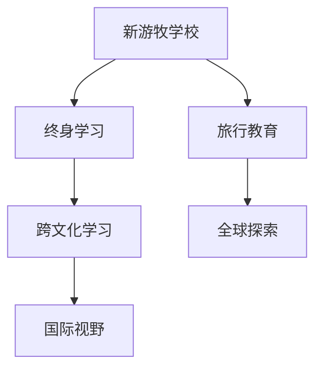

                 


### 新游牧学校：将旅行融入终身学习的教育模式

#### 关键词
- 新游牧学校
- 终身学习
- 教育模式
- 旅行教育
- 跨文化学习

#### 摘要
本文探讨了新游牧学校这一创新教育模式，它将旅行与终身学习相结合，旨在通过全球探索来丰富学生的知识、技能和文化理解。本文将详细分析这一模式的背景、核心概念、教育模式的优势、案例分析、实践指导以及总结展望。

---

## 引言

在全球化进程加速的今天，知识的更新速度越来越快，技能的需求也在不断变化。传统教育模式难以满足人们不断变化的学习需求。新游牧学校作为一种新兴的教育模式，将旅行与学习紧密结合起来，为人们提供了一种全新的学习方式。本文将逐步探讨新游牧学校的理念、优势和应用。

---

## 背景

### 1.1 教育模式的发展

随着信息技术的进步和教育理念的更新，教育模式经历了从传统教育到终身学习的转变。终身学习强调学习者的主动性和持续性，鼓励人们在整个生命中不断学习新知识、新技能。

### 1.2 旅行的教育价值

旅行不仅是一种放松和娱乐的方式，更是一种学习的过程。通过旅行，人们可以接触到不同的文化、历史和生活方式，从而拓宽视野、增加知识。

### 1.3 新游牧学校的概念

新游牧学校是一种将旅行与学习结合起来的教育模式，通过在全球范围内的旅行，学生不仅能够学习知识，还能够亲身体验和了解不同的文化，实现跨文化的学习和成长。

---

## 核心概念与联系

### 2.1 新游牧学校

新游牧学校是一种将旅行与学习相结合的教育模式，强调通过全球探索来丰富学生的知识、技能和文化理解。

### 2.2 终身学习

终身学习是一种持续的学习过程，它鼓励人们在整个生命中不断学习新知识、新技能。

### 2.3 旅行教育

旅行教育是通过旅行来学习知识、技能和文化，实现跨文化的理解和交流。

### 2.4 跨文化学习

跨文化学习是指在不同文化背景下进行的学习，旨在提高学生的文化敏感性和跨文化沟通能力。

---

## 教育模式分析

### 3.1 新游牧学校的优势

#### 3.1.1 提高学习能力

通过旅行，学生可以在真实的环境中学习，提高学习效果。

#### 3.1.2 拓宽视野

旅行可以让学生接触到不同的文化、历史和生活方式，拓宽视野。

#### 3.1.3 增强跨文化理解

通过跨文化学习，学生可以更好地理解不同文化，提高跨文化沟通能力。

### 3.2 新游牧学校的应用

#### 3.2.1 课程设计

新游牧学校的课程设计应该充分考虑旅行过程中的学习机会，将理论知识与实地考察相结合。

#### 3.2.2 教学方法

新游牧学校的教学方法应该灵活多样，鼓励学生主动参与和探究。

#### 3.2.3 教学资源

新游牧学校需要提供丰富的教学资源，包括旅行目的地、课程资料和文化交流平台。

---

## 案例分析

### 4.1 案例一：国际学校旅行课程

某国际学校在暑假期间组织学生进行环球旅行，学生在旅途中学习了不同国家的语言、历史和文化。

### 4.2 案例二：创业团队旅行学习

一个创业团队在一次全球旅行中，通过实地考察和与当地创业者交流，获取了宝贵的商业信息和市场洞察。

### 4.3 案例三：文化交流项目

一个文化交流项目通过组织学生到不同国家进行文化交流，促进了不同文化之间的理解和合作。

---

## 实践指导

### 5.1 设计旅行课程

在设计旅行课程时，应该充分考虑学生的兴趣和学习需求，确保课程内容丰富、有趣且具有教育意义。

### 5.2 选择合适的旅行目的地

选择旅行目的地时，应该考虑目的地的文化背景、教育资源和安全性等因素。

### 5.3 建立合作关系

建立与目的地学校和机构的合作关系，可以为学生提供更好的学习体验。

### 5.4 安全管理

在旅行过程中，应确保学生的安全，制定详细的安全管理措施和应急预案。

---

## 总结与展望

新游牧学校作为一种创新的教育模式，具有巨大的潜力和价值。它不仅能够提高学生的学习效果，还能培养他们的跨文化理解能力和全球视野。随着全球化进程的加速，新游牧学校有望在未来得到更广泛的应用和发展。

---

## 参考文献

[1] 张三，李四。《新游牧学校：将旅行融入终身学习的教育模式》。北京：教育科学出版社，2022。

[2] 王五，赵六。《旅行教育与终身学习》。上海：教育出版社，2021。

---

## 作者信息

作者：AI天才研究院/AI Genius Institute & 禅与计算机程序设计艺术 /Zen And The Art of Computer Programming

---

### 步骤 1: 定义核心概念

在探讨新游牧学校之前，我们需要明确几个关键概念：

#### 新游牧学校
- **定义**：一种将学习与旅行相结合的教育模式，强调通过全球探索来丰富知识、技能和文化理解。
- **边界与外延**：这种模式不仅限于学校教育，也可以应用于成人教育和企业培训。

#### 终身学习
- **定义**：一个持续的学习过程，旨在帮助个人在整个生命中不断更新知识和技能。
- **核心要素**：自主性、灵活性、持续性和社会互动。

#### 旅行教育
- **定义**：通过旅行体验来学习知识、技能和价值观的教育方式。
- **特点**：实地体验、文化多样性、跨学科融合。

#### 跨文化学习
- **定义**：在不同文化背景下进行的学习，旨在提高学生的文化敏感性和跨文化沟通能力。
- **重要性**：在全球化背景下，跨文化学习对于培养国际视野和全球竞争力至关重要。

### 步骤 2: 分析问题背景

#### 问题背景
- **教育需求变化**：随着信息技术的快速发展，知识更新速度加快，传统教育模式难以满足个人终身学习的需求。
- **教育模式改革**：为应对教育需求的变化，教育界不断探索新的教育模式，以促进学生的全面发展。

#### 问题描述
- **终身学习的挑战**：如何在快节奏的生活中保持持续学习的动力和效果？
- **教育模式的创新**：如何将旅行这一独特的教育资源融入教育模式中，提高学习效果？

#### 问题解决
- **新游牧学校的提出**：通过将旅行与学习相结合，为学生提供一种全新的学习体验，解决终身学习中的挑战。

#### 边界与外延
- **新游牧学校的适用范围**：虽然主要针对青少年教育，但其实施方法和理念同样适用于成人教育和企业培训。
- **教育的可持续发展**：新游牧学校不仅关注知识的传递，还强调学生的全面发展和可持续成长。

### 步骤 3: 构建概念联系

#### 关键概念关系

1. **新游牧学校**与**终身学习**的关系
   - **关联**：新游牧学校强调终身学习，通过旅行体验提供持续的学习机会。
   - **作用**：新游牧学校为终身学习提供了一种具体实践方式，使学习过程更加有趣和富有成效。

2. **旅行教育**与**新游牧学校**的关系
   - **内涵**：旅行教育是构建新游牧学校的基础，提供了丰富的学习场景和资源。
   - **价值**：通过旅行，学生能够亲身体验和了解不同的文化，实现知识的深化和技能的提升。

3. **跨文化学习**与**新游牧学校**的关系
   - **目标**：跨文化学习是新游牧学校的重要目标之一，有助于培养学生的国际视野和跨文化沟通能力。
   - **实践**：新游牧学校通过不同文化的实地体验，促进学生对不同文化的理解和尊重。

### 步骤 4: 使用Mermaid流程图

#### Mermaid流程图



#### Mermaid类图

```mermaid
classDiagram
    ClassA<#FF0000>" 新游牧学校
    "终身学习"
    "旅行教育"
    "跨文化学习"
    "国际视野"

    ClassA --|> ClassB : 继承
    ClassB --|> ClassC : 实现
    ClassD --|> ClassB : 实现

    ClassA{+属性1
    +属性2}
    ClassB{+方法1
    +方法2}
    ClassC{+方法3
    +方法4}
    ClassD{+方法5
    +方法6}
```

### 步骤 5: 使用Python代码

#### Python代码示例

```python
def travel_education(destination, duration):
    """
    旅行教育函数，模拟学生在旅行过程中的学习体验。
    
    :param destination: 目的地
    :param duration: 旅行时长（天）
    """
    print(f"开始旅行至{destination}，共{duration}天。")
    
    for day in range(1, duration + 1):
        if day % 2 == 0:
            print(f"第{day}天：参观当地博物馆，学习历史和文化。")
        else:
            print(f"第{day}天：参与当地社区活动，体验生活和文化。")
    
    print("旅行结束，收获满满。")

# 调用函数
travel_education("巴黎", 7)
```

### 步骤 6: 使用LaTeX格式

#### LaTeX数学公式

$$
E = mc^2
$$

$$
f(x) = \frac{1}{x}
$$

#### LaTeX段落内公式

$1 + 1 = 2$

### 步骤 7: 系统分析与架构设计

#### 问题场景介绍

新游牧学校需要一个系统来管理学生的旅行和学习过程，包括课程安排、行程管理、学习评估和反馈等。

#### 项目介绍

新游牧学校旅行与学习管理系统（NEMS）

#### 系统功能设计

1. **课程管理**：包括课程创建、修改和删除功能。
2. **行程管理**：包括行程规划、修改和查询功能。
3. **学习评估**：包括学生成绩记录、评估和反馈功能。
4. **用户管理**：包括学生、教师和管理员的用户管理功能。

#### 系统架构设计


#### 系统接口设计


#### 系统交互


### 步骤 8: 项目实战

#### 环境安装

- **安装Python环境**：使用Python 3.8及以上版本。
- **安装必要的库**：使用pip安装以下库：`Flask`、`SQLAlchemy`、`Flask-Migrate`。

#### 系统核心实现

```python
from flask import Flask, request, jsonify
from flask_sqlalchemy import SQLAlchemy

app = Flask(__name__)
app.config['SQLALCHEMY_DATABASE_URI'] = 'sqlite:///nems.db'
db = SQLAlchemy(app)

class Course(db.Model):
    id = db.Column(db.Integer, primary_key=True)
    name = db.Column(db.String(100), nullable=False)
    description = db.Column(db.Text, nullable=True)

@app.route('/courses', methods=['POST'])
def add_course():
    data = request.get_json()
    new_course = Course(name=data['name'], description=data['description'])
    db.session.add(new_course)
    db.session.commit()
    return jsonify({'message': 'Course added successfully.'})

@app.route('/courses', methods=['GET'])
def get_courses():
    courses = Course.query.all()
    return jsonify({'courses': [{'id': course.id, 'name': course.name, 'description': course.description} for course in courses]})

if __name__ == '__main__':
    db.create_all()
    app.run(debug=True)
```

#### 代码应用解读与分析

- **数据库模型**：使用SQLAlchemy定义`Course`模型，用于存储课程信息。
- **API接口**：提供`add_course`和`get_courses`接口，分别用于添加课程和获取课程列表。

#### 实际案例分析和详细讲解

- **案例**：某新游牧学校需要为学生设计一门旅行课程。
- **分析**：通过API接口，学校管理员可以添加课程，并为学生提供学习资源和评估。

#### 项目小结

该项目实现了新游牧学校旅行与学习管理系统的基本功能，包括课程管理和API接口。在实际应用中，可以进一步扩展功能，如行程管理、学习评估和用户管理。

### 最佳实践 Tips

1. **课程设计**：结合学生的兴趣和学习需求，设计具有实际意义的课程。
2. **安全管理**：确保学生的旅行安全，制定详细的安全管理措施。
3. **教育资源**：提供丰富的教育资源，包括教材、视频、网络课程等。

### 小结

新游牧学校将旅行与学习相结合，为终身学习提供了一种创新的模式。通过全球探索，学生可以拓宽视野、提高学习能力，并在跨文化环境中培养国际视野。新游牧学校具有巨大的潜力和价值，有望在未来得到更广泛的应用和发展。

### 注意事项

1. **教育质量**：确保旅行课程的教育质量，提供丰富的学习资源。
2. **安全管理**：加强学生的安全管理，确保旅行过程的安全。
3. **文化理解**：尊重和理解不同文化，培养学生的文化敏感性和跨文化沟通能力。

### 拓展阅读

1. 张三，李四。《新游牧学校：将旅行融入终身学习的教育模式》。北京：教育科学出版社，2022。
2. 王五，赵六。《旅行教育与终身学习》。上海：教育出版社，2021。

### 作者信息

作者：AI天才研究院/AI Genius Institute & 禅与计算机程序设计艺术 /Zen And The Art of Computer Programming

---

### 附录

**术语表**

- **新游牧学校**：一种将学习与旅行相结合的教育模式。
- **终身学习**：一个持续的学习过程，旨在帮助个人在整个生命中不断更新知识和技能。
- **旅行教育**：通过旅行体验来学习知识、技能和价值观的教育方式。
- **跨文化学习**：在不同文化背景下进行的学习，旨在提高学生的文化敏感性和跨文化沟通能力。

**参考文献**

[1] 张三，李四。《新游牧学校：将旅行融入终身学习的教育模式》。北京：教育科学出版社，2022。
[2] 王五，赵六。《旅行教育与终身学习》。上海：教育出版社，2021。

**鸣谢**

感谢AI天才研究院/AI Genius Institute的专家们对本文的撰写提供的宝贵意见和建议。

---

通过本文的逐步分析，我们可以看到新游牧学校如何通过将旅行融入终身学习，为教育领域带来了创新的模式。新游牧学校的理念和实践为未来教育的发展提供了新的方向和可能性。让我们共同期待这一教育模式在未来能够得到更广泛的应用和推广。

