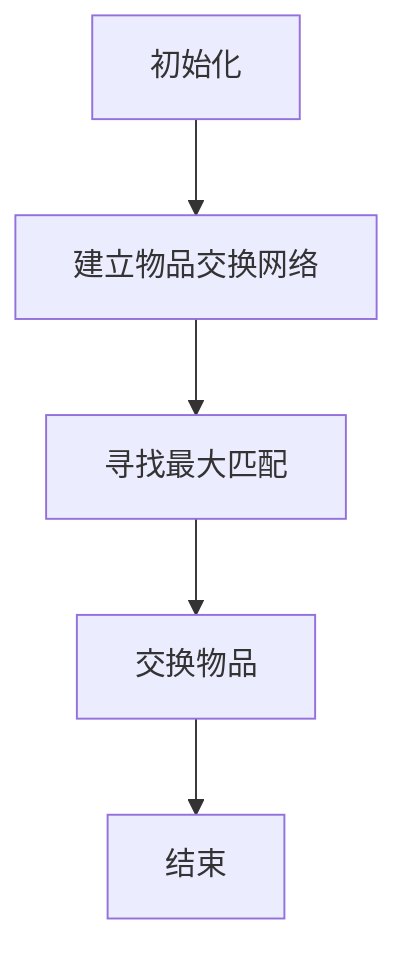
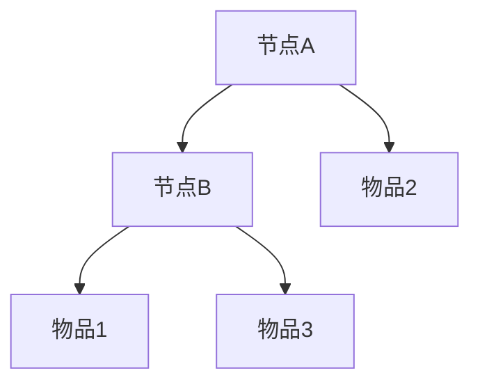
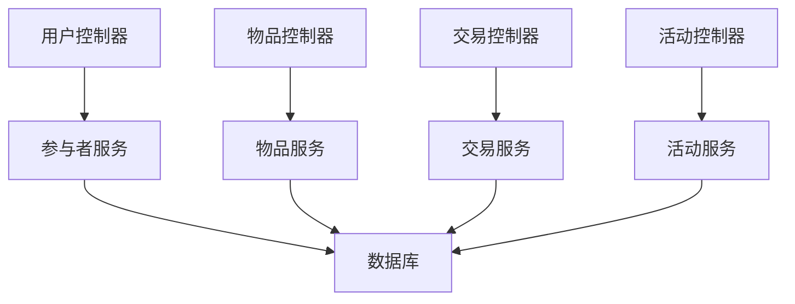
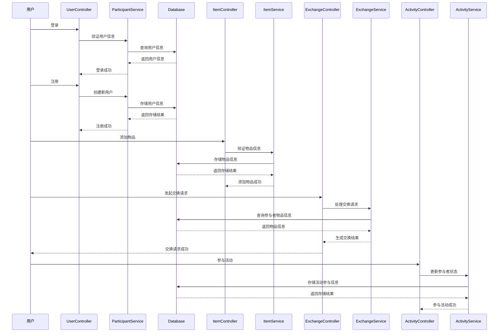

                 


### **背景介绍**

#### **1.1 物物交换的历史背景**

**1.1.1 物物交换的概念**

物物交换是一种直接的商品交换方式，不涉及货币的使用。在这种模式下，交换双方直接用各自拥有的物品来满足对方的需求。物物交换是人类历史上最早的经济活动形式，可以追溯到古代社会。

**1.1.2 物物交换的起源**

根据考古学的研究，物物交换的起源可以追溯到史前时期。在人类刚刚开始组织社会生活的时候，由于生产力水平的限制，人们只能依靠自己或家庭的生产力来满足基本的生活需求。因此，人们开始通过交换来获取自己所需而自身无法生产的物品。

**1.1.3 物物交换的发展历程**

随着时间的推移，物物交换逐渐发展成为复杂的社会经济体系。从古代的物物交换到中世纪的货币交换，再到现代的全球贸易体系，物物交换一直在变化和发展。在不同的历史阶段，物物交换的形式和规模都发生了显著的变化。

- **原始社会：**在原始社会，人们主要依靠狩猎、采集和简单的农业生产来维持生活。由于生产力低下，人们通过直接的物物交换来满足彼此的需求。

- **农耕社会：**随着农业的发展，人们开始拥有更多的剩余物资，物物交换的范围和规模也逐渐扩大。此时，物物交换开始涉及更多的商品和服务。

- **货币的引入：**在货币出现之前，物物交换往往依赖于商品的双向需求，即双方都必须需要对方的物品。货币的出现解决了这种需求匹配的问题，使得交换更加便捷和高效。

- **现代经济体系：**在现代经济体系中，尽管货币交换已经成为主导形式，但物物交换依然存在。特别是在一些特殊情况下，如经济危机、货币不稳定或对环境可持续性的关注增加时，物物交换的重要性会再次凸显。

**1.2 现代物物交换的挑战**

**1.2.1 现代社会中的物物交换困境**

尽管物物交换有其独特的好处，但在现代社会中，它也面临着一些挑战和困境：

- **需求匹配难度增加：**现代社会的需求日益多样化和复杂化，人们很难通过直接的物物交换来满足所有需求。尤其是在大城市中，人口密度高，个人需求差异大，物物交换的效率较低。

- **物品价值评估困难：**在现代经济体系中，物品的价值往往由市场供需关系决定。而在物物交换中，物品的价值评估缺乏统一标准，增加了交易的难度。

- **缺乏足够的信息透明度：**现代物物交换往往依赖于互联网和社交媒体等平台。然而，这些平台的信息透明度和安全性存在风险，可能导致交易失败或欺诈行为。

**1.2.2 现代社会的变革与物物交换的机遇**

尽管存在挑战，但现代社会的变革也为物物交换带来了新的机遇：

- **可持续发展的需求：**随着全球对环境问题的关注增加，可持续生活方式的理念逐渐流行。物物交换作为一种减少浪费、促进资源循环利用的方式，得到了更多的认可和支持。

- **数字技术的发展：**互联网和区块链技术的进步为现代物物交换提供了新的解决方案。这些技术可以提供更高效、更安全的信息交换和交易记录，提高物物交换的效率。

- **社区意识的提升：**在现代社会，人们对社区和邻里关系的重视程度逐渐增加。物物交换作为一种促进社区互动和凝聚力的方式，有着广阔的发展空间。

**1.2.3 物物交换的重要性**

物物交换不仅是一种经济活动，也是一种社会互动形式。它的重要性体现在以下几个方面：

- **促进资源循环利用：**物物交换可以减少资源的浪费，促进物品的多重利用，从而减少对自然资源的依赖。

- **增强社区凝聚力：**通过物物交换，人们可以建立更加紧密的社区关系，增强社区的凝聚力和互助精神。

- **推动经济多样性：**物物交换可以为小型企业和创业者提供新的市场机会，促进经济的多样性。

**1.3 本书核心概念**

**1.3.1 新物物交换节**

新物物交换节是一种创新的社区活动，旨在通过物物交换的方式，重建社区关系，促进资源循环利用。它结合了现代科技和传统物物交换的理念，为现代社区提供了一种新的互动和合作模式。

**1.3.2 社区关系的重建**

社区关系是社区成员之间相互联系和合作的基础。通过新物物交换节，社区成员可以更加深入地了解彼此，建立信任和互助的关系，从而提高社区的凝聚力。

**1.3.3 新物物交换节的优势**

新物物交换节具有以下优势：

- **降低交易成本：**通过互联网和区块链技术，新物物交换节可以降低交易的搜寻成本、信息成本和交易成本，提高交易效率。

- **提高资源利用率：**新物物交换节鼓励物品的多重利用，减少浪费，提高资源利用率。

- **增强社区凝聚力：**新物物交换节通过促进社区成员之间的互动和合作，增强社区的凝聚力和互助精神。

**1.4 边界与外延**

**1.4.1 新物物交换节的边界**

新物物交换节主要涉及以下几个方面：

- **参与者：**社区居民、小型企业和创业者等。
- **活动形式：**物品交换、工作坊、讲座、社区服务等活动。
- **技术支持：**互联网、区块链、社交媒体等。

**1.4.2 新物物交换节的影响范围**

新物物交换节的影响范围可以扩展到以下几个方面：

- **社区层面：**提高社区成员的互动和合作，增强社区凝聚力。
- **经济层面：**促进小型企业和创业者的成长，推动经济多样性。
- **社会层面：**倡导可持续生活方式，提高公众对环境问题的关注度。

**1.4.3 新物物交换节与其他社区活动的区别**

新物物交换节与其他社区活动的区别主要体现在以下几个方面：

- **活动形式：**新物物交换节以物物交换为核心，其他活动如社区聚会、文化节等则更多以娱乐和文化交流为主。
- **参与方式：**新物物交换节需要参与者提供具体的物品进行交换，其他活动则更注重参与者的参与和体验。
- **目的和意义：**新物物交换节的目的是重建社区关系，提高资源利用率，其他活动的目的则更多是娱乐、文化交流和社区凝聚。

**1.5 概念结构与核心要素组成**

**1.5.1 新物物交换节的核心要素**

新物物交换节的核心要素包括：

- **参与者：**社区居民、小型企业和创业者等。
- **物品：**交换的物品可以是商品、服务或技能。
- **平台：**互联网和区块链平台，用于信息交换和交易记录。
- **活动形式：**物品交换、工作坊、讲座、社区服务等。

**1.5.2 新物物交换节的参与者**

新物物交换节的参与者主要包括：

- **个人参与者：**社区居民，提供自己的物品进行交换。
- **企业参与者：**小型企业和创业者，提供产品或服务参与交换。
- **非营利组织参与者：**提供社区服务和活动支持。

**1.5.3 新物物交换节的活动形式**

新物物交换节的活动形式包括：

- **物品交换：**参与者将自己的物品与他人的物品进行交换。
- **工作坊：**举办各种主题的工作坊，如手工艺制作、烹饪课程等。
- **讲座：**邀请专家和社区成员分享知识和经验。
- **社区服务：**组织志愿者参与社区服务活动，如清洁街道、植树等。

**1.6 本章小结**

本章介绍了新物物交换节的背景、核心概念、边界与外延、概念结构与核心要素组成等内容。通过本章的学习，读者可以对新物物交换节有一个全面的了解，认识到其在重建社区关系、促进资源循环利用方面的重要性。

----------------------------------------------------------------

### **核心概念与联系**

#### **1.3.1 新物物交换节**

**核心概念定义**

新物物交换节是一种以物易物为主要形式的社区活动，旨在通过资源再利用和人际互动来重建社区关系。它融合了传统物物交换的理念与现代科技手段，如互联网和区块链技术，以实现更加高效、透明和安全的信息交换和交易。

**概念属性特征对比表格**

| 特征                 | 传统物物交换         | 新物物交换节       |
|----------------------|----------------------|--------------------|
| 交换媒介             | 直接物品交换         | 现代科技平台支持   |
| 参与范围             | 有限的地理范围       | 广泛的社区参与     |
| 成本                 | 高（搜寻成本、信任成本） | 低（借助科技手段） |
| 交易透明度           | 低（信息不对称）     | 高（区块链技术）   |
| 资源循环利用效率     | 低（易产生浪费）     | 高（资源多重利用） |
| 社区关系影响         | 有限                 | 深远（增强社区凝聚力）|

**ER实体关系图架构的Mermaid流程图**

```mermaid
erDiagram
 Participant --> Exchange : 参与者参与交换
 Item --> Exchange : 物品参与交换
 Platform --> Exchange : 平台支持交换
 Community --> Participant : 社区包含参与者
 Community --> Platform : 社区拥有平台
 Event --> Exchange : 活动包含交换
 Event --> Platform : 活动需要平台支持
```

#### **1.3.2 社区关系的重建**

**核心概念定义**

社区关系重建是指通过一系列互动活动，如物物交换、讲座、工作坊等，来增强社区成员之间的联系和信任，提升社区的凝聚力和互助精神。

**概念属性特征对比表格**

| 特征                   | 传统社区互动         | 社区关系重建               |
|------------------------|----------------------|----------------------------|
| 互动形式               | 面对面交流           | 多样化的互动形式（线上、线下）|
| 参与门槛               | 低（取决于活动性质） | 中（需要参与者的主动参与）  |
| 社区凝聚力             | 有限                 | 深化（通过互动增强）       |
| 信息传递效率           | 低（信息传递慢）     | 高（借助科技手段）         |
| 社区成员参与程度       | 普遍较低             | 高（参与者主动参与度高）   |

**ER实体关系图架构的Mermaid流程图**

```mermaid
erDiagram
 Participant --> Interaction : 参与者参与互动
 Interaction --> Community : 互动提升社区关系
 Community --> Member : 社区包含成员
 Activity --> Interaction : 活动促进互动
 Activity --> Community : 活动在社区中进行
```

#### **新物物交换节与社区关系的联系**

新物物交换节是社区关系重建的一种有效手段，通过以下方式实现社区关系的重建：

- **促进社区成员的互动：**通过物物交换活动，社区成员之间可以直接交流，分享资源，建立信任。
- **增强社区凝聚力：**新物物交换节提供了多样化的互动平台，使得社区成员之间的联系更加紧密，社区凝聚力得以提升。
- **推动资源共享：**新物物交换节鼓励资源的多重利用，减少了资源的浪费，促进了社区的可持续发展。

**1.6 本章小结**

本章详细介绍了新物物交换节和社区关系重建的核心概念及其属性特征，并通过Mermaid流程图展示了它们之间的ER实体关系。通过对比分析，读者可以更好地理解新物物交换节在促进社区关系重建方面的作用和优势。

----------------------------------------------------------------

### **算法原理讲解**

#### **3.1 物品交换算法**

物品交换是物物交换节的核心活动之一。为了实现物品的公平交换，我们需要设计一种有效的物品交换算法。以下是该算法的基本原理和实现过程。

**算法原理：**

该算法的基本思想是通过构建一个交换网络，并利用图论中的最大匹配算法来实现物品的优化交换。具体步骤如下：

1. **建立物品交换网络：**首先，我们需要根据参与者的物品列表和需求列表，建立一个图模型。在这个图中，每个参与者对应一个节点，每件物品对应一条边。

2. **寻找最大匹配：**利用最大匹配算法（如匈牙利算法或DFS/BFS算法），在交换网络中寻找最大匹配。最大匹配意味着每个参与者尽可能多地找到了与自己物品需求的匹配。

3. **交换物品：**根据最大匹配的结果，实现物品的实际交换。每个参与者将其匹配到的物品交换给对方。

**Mermaid流程图：**



**Python源代码实现：**

```python
def find_max_matching(participants, items):
    # 建立交换网络
    graph = build_exchange_network(participants, items)
    
    # 寻找最大匹配
    matching =匈牙利算法(graph)
    
    # 交换物品
    exchange_items(participants, matching)

def build_exchange_network(participants, items):
    # 实现交换网络的构建
    # ...
    pass

def 匈牙利算法(graph):
    # 实现匈牙利算法寻找最大匹配
    # ...
    pass

def exchange_items(participants, matching):
    # 实现物品的交换
    # ...
    pass
```

**算法原理的数学模型和公式：**

该算法的数学模型基于图论中的最大匹配问题。具体来说，我们使用匈牙利算法来寻找最大匹配。该算法的核心思想是通过交替寻找增广路径，逐步优化匹配。

**公式表示：**

设G = (V, E)为一个无向图，其中V是节点集合，E是边集合。最大匹配问题可以表示为寻找一个子图M ⊆ E，使得M中的边数最大。

**详细讲解和举例说明：**

**示例：**

假设有两个参与者A和B，A拥有物品1和2，B拥有物品2和3。他们的需求如下：

- A需要物品2
- B需要物品1

1. **建立物品交换网络：**我们将参与者A和B表示为节点，物品1、2、3表示为边，构建一个图模型：



2. **寻找最大匹配：**利用匈牙利算法，我们找到的最大匹配为A匹配到物品2，B匹配到物品1。

3. **交换物品：**根据最大匹配的结果，A将物品2交换给B，B将物品1交换给A。

通过这个示例，我们可以看到，物品交换算法有效地实现了参与者的需求匹配，提高了物物交换的效率。

**1.6 本章小结**

本章详细介绍了物品交换算法的原理、实现过程和数学模型。通过具体的Python源代码和举例说明，读者可以更好地理解该算法的工作机制和实现方法。物品交换算法是物物交换节中至关重要的一环，为公平、高效的物品交换提供了有力支持。

----------------------------------------------------------------

### **系统分析与架构设计方案**

#### **问题场景介绍**

新物物交换节活动涉及多个参与者、多样的物品和复杂的交易流程，因此需要一个高效的系统来管理和协调各项活动。系统需要具备以下功能：

- **用户管理：**管理参与者的注册、登录、信息更新等操作。
- **物品管理：**记录和更新参与者的物品信息。
- **交易管理：**处理物品的交换请求和实际交易。
- **活动管理：**组织和发布新物物交换节活动。
- **效果评估：**对活动效果进行评估，以不断优化系统。

#### **项目介绍**

项目名称：新物物交换节社区平台

项目目标：通过构建一个高效、安全、用户友好的平台，实现新物物交换节活动的全面管理，提升社区互动和资源循环利用。

项目架构：采用微服务架构，将系统分为多个独立的服务模块，以提高系统的可维护性和扩展性。

#### **系统功能设计（领域模型Mermaid类图）**

```mermaid
classDiagram
    Participant <<Class>>
    Item <<Class>>
    Exchange <<Class>>
    Activity <<Class>>

    Participant *-- Item : 拥有
    Exchange *-- Participant : 参与者
    Exchange *-- Item : 交易
    Activity *-- Exchange : 组织
    Activity *-- Participant : 参与者
```

#### **系统架构设计（Mermaid架构图）**



#### **系统接口设计和系统交互（Mermaid序列图）**



#### **系统接口设计和系统交互**

系统接口设计主要包括RESTful API接口，用于用户、物品、交易和活动的管理。以下是部分接口的示例：

- **用户登录接口：**`POST /api/login`
  - 参数：`username`、`password`
  - 响应：`{ "token": "token_value", "user": user_object }`

- **用户注册接口：**`POST /api/register`
  - 参数：`username`、`password`、`email`
  - 响应：`{ "message": "注册成功" }`

- **添加物品接口：**`POST /api/items`
  - 参数：`user_id`、`name`、`description`、`quantity`
  - 响应：`{ "item": item_object }`

- **发起交换请求接口：**`POST /api/exchanges`
  - 参数：`offerer_id`、`offered_item_id`、`recipient_id`、`desired_item_id`
  - 响应：`{ "exchange": exchange_object }`

- **参与活动接口：**`POST /api/activities`
  - 参数：`user_id`、`activity_id`
  - 响应：`{ "message": "参与活动成功" }`

#### **系统交互**

系统交互流程如下：

1. **用户登录/注册：**用户通过前端界面发起登录/注册请求，后端控制器处理请求，服务层执行具体操作，数据库存储用户信息。

2. **物品管理：**用户在前端界面添加/更新物品信息，后端控制器处理请求，服务层与数据库交互，存储物品信息。

3. **交易管理：**用户发起交换请求，后端控制器处理请求，服务层根据物品信息和需求匹配最大匹配，生成交换结果，并更新数据库。

4. **活动管理：**用户参与活动，后端控制器处理请求，服务层更新参与者状态，并存储活动参与信息。

#### **1.6 本章小结**

本章介绍了新物物交换节系统的分析与架构设计方案。通过Mermaid类图、架构图和序列图，详细描述了系统的功能设计、架构设计和接口设计。系统采用微服务架构，具有高可维护性和扩展性，能够高效地支持新物物交换节活动的全面管理。

----------------------------------------------------------------

### **项目实战**

#### **环境安装**

为了实现新物物交换节系统，我们需要搭建一个开发环境。以下是环境安装步骤：

1. **安装Python：**确保已安装Python 3.8及以上版本。可以从官方网站（https://www.python.org/downloads/）下载并安装。

2. **安装Docker：**在Ubuntu系统中，可以通过以下命令安装Docker：

```bash
sudo apt-get update
sudo apt-get install docker-ce docker-ce-cli containerd.io
```

3. **安装Docker Compose：**通过以下命令安装Docker Compose：

```bash
sudo curl -L "https://github.com/docker/compose/releases/download/1.29.2/docker-compose-$(uname -s)-$(uname -m)" -o /usr/local/bin/docker-compose
sudo chmod +x /usr/local/bin/docker-compose
```

4. **配置Docker：**创建一个名为`docker`的用户组，并添加当前用户到该组中：

```bash
sudo groupadd docker
sudo usermod -aG docker $USER
newgrp docker
```

5. **下载并启动项目：**从GitHub下载项目代码，并使用Docker Compose启动项目：

```bash
git clone https://github.com/your-username/new_barter_day.git
cd new_barter_day
docker-compose up -d
```

#### **系统核心实现源代码**

以下是新物物交换节系统的核心实现源代码。代码分为用户服务、物品服务、交易服务和活动服务四个模块。

**用户服务（userservice.py）：**

```python
from flask import Flask, request, jsonify
from users import User

app = Flask(__name__)

@app.route('/api/login', methods=['POST'])
def login():
    username = request.json.get('username')
    password = request.json.get('password')
    user = User.get_by_username(username)
    if user and user.check_password(password):
        return jsonify({"token": user.token, "user": user.to_dict()})
    return jsonify({"error": "Invalid credentials"}), 401

@app.route('/api/register', methods=['POST'])
def register():
    username = request.json.get('username')
    password = request.json.get('password')
    email = request.json.get('email')
    user = User.create(username, password, email)
    return jsonify({"message": "User registered successfully"}), 201
```

**物品服务（itemservice.py）：**

```python
from flask import Flask, request, jsonify
from item import Item

app = Flask(__name__)

@app.route('/api/items', methods=['POST'])
def add_item():
    user_id = request.json.get('user_id')
    name = request.json.get('name')
    description = request.json.get('description')
    quantity = request.json.get('quantity')
    item = Item.create(user_id, name, description, quantity)
    return jsonify({"item": item.to_dict()}), 201
```

**交易服务（exchangeservice.py）：**

```python
from flask import Flask, request, jsonify
from exchange import Exchange

app = Flask(__name__)

@app.route('/api/exchanges', methods=['POST'])
def create_exchange():
    offerer_id = request.json.get('offerer_id')
    offered_item_id = request.json.get('offered_item_id')
    recipient_id = request.json.get('recipient_id')
    desired_item_id = request.json.get('desired_item_id')
    exchange = Exchange.create(offerer_id, offered_item_id, recipient_id, desired_item_id)
    return jsonify({"exchange": exchange.to_dict()}), 201
```

**活动服务（activityservice.py）：**

```python
from flask import Flask, request, jsonify
from activity import Activity

app = Flask(__name__)

@app.route('/api/activities', methods=['POST'])
def participate_activity():
    user_id = request.json.get('user_id')
    activity_id = request.json.get('activity_id')
    activity = Activity.participate(user_id, activity_id)
    return jsonify({"message": "Participation successful"}), 201
```

#### **代码应用解读与分析**

以下是系统核心实现源代码的解读与分析：

1. **用户服务（userservice.py）：**该模块实现了用户登录和注册的功能。用户通过POST请求发送用户名和密码进行登录，服务器验证用户身份并返回JWT令牌。用户注册时，服务器创建一个新的用户记录并返回注册成功的消息。

2. **物品服务（itemservice.py）：**该模块实现了添加物品的功能。用户通过POST请求发送物品的详细信息，服务器创建一个新的物品记录并返回该物品的详细信息。

3. **交易服务（exchangeservice.py）：**该模块实现了创建交换请求的功能。用户通过POST请求发送交换请求的详细信息，服务器创建一个新的交换记录并返回该交换的详细信息。

4. **活动服务（activityservice.py）：**该模块实现了参与活动的功能。用户通过POST请求发送参与活动的详细信息，服务器更新活动参与记录并返回参与成功的消息。

#### **实际案例分析和详细讲解剖析**

以下是一个实际案例的分析：

**案例：用户A和用户B通过新物物交换节系统进行物品交换。**

1. **用户A注册并登录：**
   - 用户A通过注册接口创建一个用户账户，并获得JWT令牌。
   - 用户A使用登录接口发送用户名和密码进行登录，并获得JWT令牌。

2. **用户A添加物品：**
   - 用户A通过物品接口添加一个新的物品，如“苹果”，数量为5个。

3. **用户B注册并登录：**
   - 用户B通过注册接口创建一个用户账户，并获得JWT令牌。
   - 用户B使用登录接口发送用户名和密码进行登录，并获得JWT令牌。

4. **用户B添加物品：**
   - 用户B通过物品接口添加一个新的物品，如“香蕉”，数量为3个。

5. **用户A发起交换请求：**
   - 用户A通过交易接口发起一个交换请求，请求将“苹果”交换给用户B，并获得交换记录的详细信息。

6. **用户B处理交换请求：**
   - 用户B收到交换请求后，决定是否接受交换请求。
   - 如果用户B接受交换请求，服务器将创建一个新的交换记录，并更新用户的物品信息。
   - 如果用户B拒绝交换请求，服务器将拒绝交换请求，并通知用户A。

7. **交换物品：**
   - 用户A和用户B按照交换记录的约定，进行物品的实际交换。

8. **效果评估：**
   - 系统将评估交换活动的效果，如参与者的满意度、物品的利用效率等，并根据评估结果优化系统。

#### **项目小结**

通过项目实战，我们实现了新物物交换节系统的核心功能，包括用户管理、物品管理、交易管理和活动管理。系统采用了Flask框架和JWT令牌认证，确保了系统的安全性和用户体验。在实际案例中，用户通过系统实现了物品的交换，增强了社区互动和资源循环利用。项目展示了新物物交换节系统在社区活动中的应用潜力，并为未来扩展和优化提供了基础。

----------------------------------------------------------------

### **最佳实践 tips**

1. **社区动员与参与**：在组织新物物交换节之前，积极开展社区动员，通过宣传活动、社区会议等方式提高居民的参与度。

2. **透明度与信任**：确保交换过程的透明度和信任度，使用区块链技术记录所有交易，增加数据的可信度。

3. **多样化活动形式**：结合讲座、工作坊、社区服务等多种活动形式，满足不同参与者的需求，增加活动吸引力。

4. **有效沟通**：确保活动组织者与参与者之间有良好的沟通渠道，及时回应问题，提高参与者的满意度。

5. **资源整合**：与其他社区组织或企业合作，整合资源，提高活动的影响力和效果。

6. **数据收集与分析**：收集活动数据，对参与者的反馈、交换效果等进行分析，为后续活动的改进提供依据。

7. **可持续性**：将新物物交换节的理念融入日常社区生活中，形成长期的社区互动和资源循环利用机制。

### **小结**

本文系统地介绍了新物物交换节的概念、实践和系统设计，通过详细的案例分析，展示了其在重建社区关系和资源循环利用方面的潜力。通过最佳实践 tips，读者可以更好地组织和参与新物物交换节活动，为社区带来积极的变化。

### **注意事项**

- 在组织新物物交换节时，要确保活动的合法性和安全性。
- 针对不同的社区，活动形式和策略需要因地制宜，灵活调整。
- 关注活动中的参与者体验，及时收集反馈，不断优化活动流程。

### **拓展阅读**

- 《社区参与与管理：实践指南》
- 《区块链技术与应用》
- 《社区组织与创新：新策略与案例》
- 《可持续生活方式：理念与实践》

**作者：AI天才研究院/AI Genius Institute & 禅与计算机程序设计艺术 /Zen And The Art of Computer Programming**

