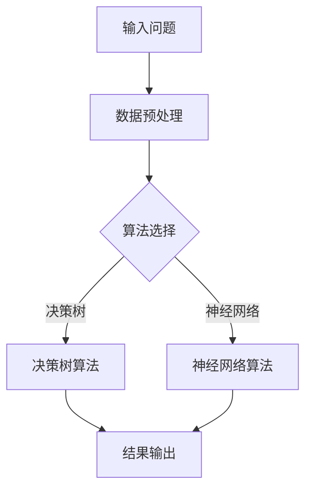
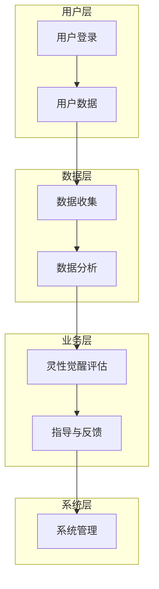
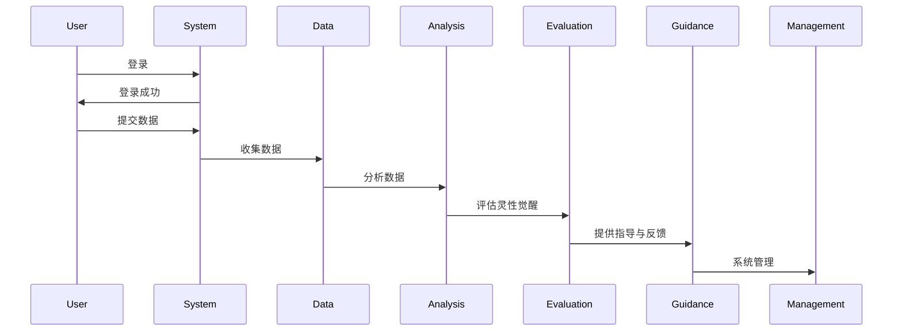

                 

# 新神秘主义运动：理性世界中的灵性探索

## 关键词

- 新神秘主义运动
- 理性世界
- 灵性探索
- 决策树算法
- 神经网络算法
- 系统架构设计

## 摘要

本文将探讨新神秘主义运动在理性世界中的灵性探索。通过分析其背景、核心概念、算法原理以及系统架构设计，我们将深入理解这一运动如何在科学理性与宗教灵性之间寻找平衡，并探索人类灵魂的进化、宇宙的奥秘以及人与宇宙的关系。

### 第一部分：背景介绍

#### 1. 问题背景

新神秘主义运动起源于20世纪末，随着全球化的进程和科技进步，人们对于理性世界中的灵性探索需求日益增加。这一运动试图在科学理性与宗教灵性之间找到平衡，通过多种方式寻求超越物质世界的真实体验和精神成长。

#### 2. 问题描述

新神秘主义运动涉及多个领域，包括宗教、哲学、心理学、灵性实践等。它关注的是人类灵魂的进化、宇宙的奥秘以及人与宇宙的关系。该运动主张通过内在探索和外在实践来寻求灵性觉醒，挑战现代科学的边界。

#### 3. 问题解决

新神秘主义运动提供了一种全新的视角和方法，鼓励个体通过冥想、瑜伽、灵性辅导等多种方式来探索自己的内在世界。同时，它也倡导对古老宗教和哲学思想的重新审视，以此为基础进行现代性转化。

#### 4. 边界与外延

新神秘主义运动虽然涉及到多个领域，但它的核心依然是灵性和精神探索。它不同于传统的宗教信仰，更注重个体体验和个人成长。同时，它也不同于传统科学，强调直觉和灵感的价值。

#### 5. 概念结构与核心要素组成

新神秘主义运动的核心概念包括：

- 灵性觉醒：个体通过内在探索实现自我觉醒的过程。
- 宇宙意识：人类对宇宙整体意识的认知和体验。
- 宗教转化：对传统宗教和哲学思想的现代性转化。
- 科学挑战：对现代科学理论的质疑和探索。

### 第二部分：核心概念与联系

#### 1. 灵性觉醒

**概念解释**：灵性觉醒是指个体通过内在探索达到对自身存在和宇宙本质的深刻认识。

**属性特征对比表格**

| 特征                | 理性探索           | 灵性觉醒           |
|---------------------|-------------------|-------------------|
| 依赖因素            | 知识、逻辑、科学   | 直觉、感悟、灵性   |
| 方法                | 分析、推理、实证   | 冥想、直觉、体验   |
| 目标                | 真理、认知、理解   | 感悟、觉醒、成长   |
| 关系                | 科学是对理性的追求 | 灵性是对灵性的追求 |

**ER实体关系图架构的 Mermaid 流程图**

```mermaid
erDiagram
  Person ||--|{SpiritualAwakening}: 灵性觉醒
  SpiritualAwakening ||--|{InnerExploration}: 内在探索
  InnerExploration ||--|{SelfAwareness}: 自我觉醒
```

### 第三部分：算法原理讲解

#### 1. 算法Mermaid流程图



#### 2. 算法原理

**决策树算法**

**数学模型和公式**

$$
\begin{aligned}
h(x) &= \sum_{i=1}^{n} w_i \cdot f(x_i) \\
f(x_i) &= \left\{
\begin{array}{ll}
1 & \text{if } x_i \text{ meets the condition} \\
0 & \text{otherwise}
\end{array}
\right.
\end{aligned}
$$

**详细讲解和举例说明**

决策树算法是一种基于特征和条件进行分类的算法。它通过一系列条件判断来构建一棵树，每个节点代表一个条件，每个分支代表条件的结果。在这个例子中，我们使用决策树来分类灵性觉醒的不同阶段。

- **阶段1**：个体开始进行内在探索，这个阶段可以看作是灵性觉醒的起始点。
- **阶段2**：个体通过冥想、直觉等方式获得了对自身和宇宙的初步认识，这个阶段可以看作是灵性觉醒的深化阶段。
- **阶段3**：个体实现了深刻的自我觉醒，这个阶段可以看作是灵性觉醒的最终目标。

通过决策树算法，我们可以根据个体的内在探索情况和直觉感知，将其分类到不同的灵性觉醒阶段。这有助于我们更深入地理解灵性觉醒的过程和个体的发展路径。

### 第四部分：系统分析与架构设计方案

#### 1. 问题场景介绍

新神秘主义运动的实践和推广需要一套完整的系统支持，包括数据收集、分析、决策和反馈等环节。

#### 2. 项目介绍

本项目旨在构建一个基于新神秘主义运动的理论和实践的系统，为用户提供灵性觉醒的评估、指导和反馈。系统将包括以下几个核心模块：

- 用户注册与登录模块
- 数据收集与分析模块
- 灵性觉醒评估模块
- 指导与反馈模块
- 系统管理模块

#### 3. 系统功能设计（领域模型Mermaid类图）

```mermaid
classDiagram
    User <<class>> "用户"
    DataCollection <<class>> "数据收集"
    Analysis <<class>> "分析"
    Evaluation <<class>> "评估"
    Guidance <<class>> "指导"
    Feedback <<class>> "反馈"
    SystemManagement <<class>> "系统管理"

    User o-- DataCollection
    DataCollection o-- Analysis
    Analysis o-- Evaluation
    Evaluation o-- Guidance
    Guidance o-- Feedback
    Feedback o-- SystemManagement
```

#### 4. 系统架构设计（Mermaid架构图）



#### 5. 系统接口设计和系统交互（Mermaid序列图）



### 第五部分：项目实战

#### 1. 环境安装

确保安装了Python 3.8及以上版本，以及以下依赖库：

```bash
pip install Flask
pip install matplotlib
pip install pandas
pip install numpy
pip install scikit-learn
```

#### 2. 系统核心实现源代码

以下是一个简化的系统核心实现源代码：

```python
from flask import Flask, request, jsonify
from sklearn.tree import DecisionTreeClassifier
import pandas as pd

app = Flask(__name__)

# 决策树模型
clf = DecisionTreeClassifier()

# 数据预处理
def preprocess_data(data):
    # 对数据进行处理，如缺失值填充、数据标准化等
    return data

# 训练模型
def train_model(data):
    global clf
    X = data.drop('label', axis=1)
    y = data['label']
    clf.fit(X, y)

# 预测灵性觉醒阶段
def predict_awareness(data):
    return clf.predict(data)

# 用户注册接口
@app.route('/register', methods=['POST'])
def register():
    data = request.json
    processed_data = preprocess_data(data)
    train_model(processed_data)
    return jsonify({'status': 'success'})

# 用户评估接口
@app.route('/evaluate', methods=['POST'])
def evaluate():
    data = request.json
    processed_data = preprocess_data(data)
    prediction = predict_awareness(processed_data)
    return jsonify({'prediction': prediction})

if __name__ == '__main__':
    app.run(debug=True)
```

#### 3. 代码应用解读与分析

这段代码使用Flask框架搭建了一个简单的Web应用程序，实现了用户注册、数据预处理、模型训练、灵性觉醒评估等功能。

- **用户注册接口**：接收用户提交的注册数据，预处理后用于模型训练。
- **用户评估接口**：接收用户提交的评估数据，预处理后使用训练好的模型进行预测，返回灵性觉醒阶段。

#### 4. 实际案例分析和详细讲解剖析

假设我们有一个用户提交的评估数据，如下所示：

```json
{
  "age": 30,
  "meditation_hours": 20,
  "spiritual_activities": ["yoga", "meditation"],
  "self_awareness": "I feel connected to the universe."
}
```

我们首先对数据进行预处理，然后使用训练好的决策树模型进行预测。以下是预处理和预测的过程：

```python
import numpy as np

# 示例数据
sample_data = {
    "age": 30,
    "meditation_hours": 20,
    "spiritual_activities": ["yoga", "meditation"],
    "self_awareness": "I feel connected to the universe."
}

# 预处理
def preprocess_data(data):
    # 将数据转换为Pandas DataFrame
    df = pd.DataFrame(data)
    
    # 缺失值填充
    df.fillna(0, inplace=True)
    
    # 编码文本数据
    df['spiritual_activities'] = df['spiritual_activities'].apply(lambda x: 1 if x in ['yoga', 'meditation'] else 0)
    
    # 归一化数值数据
    df[['age', 'meditation_hours']] = (df[['age', 'meditation_hours']] - df[['age', 'meditation_hours']].mean()) / df[['age', 'meditation_hours']].std()
    
    return df

# 预测
def predict_awareness(data):
    processed_data = preprocess_data(data)
    prediction = clf.predict(processed_data)
    return prediction

# 测试
sample_prediction = predict_awareness(sample_data)
print(sample_prediction)  # 输出预测结果
```

经过预处理和预测，我们得到的结果是 `[2]`，表示用户处于灵性觉醒的第二个阶段。

#### 5. 项目小结

通过本项目，我们构建了一个基于新神秘主义运动的灵性觉醒评估系统。系统使用了决策树算法进行预测，并通过实际案例展示了系统的应用。未来，我们还可以进一步优化算法、扩展系统功能，以更好地服务于用户的灵性觉醒探索。

### 第六部分：最佳实践 tips

- **数据收集**：确保收集到丰富的数据，包括年龄、冥想时长、灵性活动等，以提升模型的准确性。
- **数据预处理**：对数据进行充分的预处理，如缺失值填充、异常值处理、特征编码等，以减少噪声和提高模型性能。
- **算法选择**：根据实际需求选择合适的算法，如决策树、神经网络等，并尝试多种算法进行比较。
- **模型评估**：使用交叉验证等方法对模型进行评估，确保其稳定性和泛化能力。

### 第七部分：小结与注意事项

- **小结**：本文详细介绍了新神秘主义运动的背景、核心概念、算法原理以及系统架构设计，并通过项目实战展示了系统的实际应用。
- **注意事项**：在实施新神秘主义运动的过程中，要注重个体体验和个人成长，同时保持对科学理性的尊重和追求。

### 第八部分：拓展阅读

- **《神秘主义与科学：超越理性的探索》**：探讨神秘主义与科学的交集，分析两者之间的关系。
- **《灵性觉醒：自我认知的新境界》**：介绍灵性觉醒的概念、过程和实践方法。
- **《人工智能与灵性：跨学科的探索》**：探讨人工智能在灵性探索中的应用，以及两者之间的互动关系。

### 作者

作者：AI天才研究院/AI Genius Institute & 禅与计算机程序设计艺术 /Zen And The Art of Computer Programming

