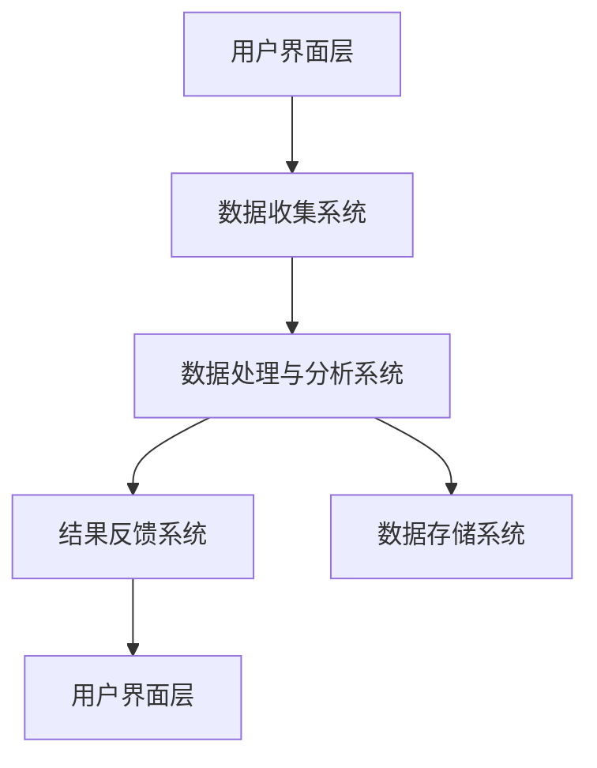
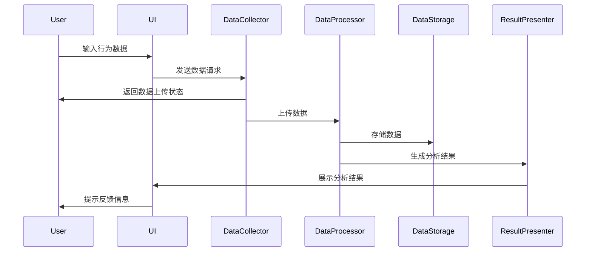

                 

## 新禁欲主义实验日志：记录克制生活的收获

### 关键词

- 禁欲主义
- 自律
- 生活质量
- 心理健康
- 行为改变

### 摘要

本文将介绍一种新颖的生活实验——新禁欲主义。通过记录和分析禁欲主义实验的过程和结果，探讨克制生活对个体心理健康、行为习惯和生活质量的影响。文章将结合心理学、伦理学和计算机科学的理论与方法，逐步揭示禁欲主义背后的核心原理及其在实际生活中的应用。本文旨在为读者提供一种全新的生活方式思考，鼓励个体在追求心理健康和高效生活的道路上探索和实践。

### 目录大纲

```markdown
# 新禁欲主义实验日志：记录克制生活的收获

## 第1章：背景介绍

### 1.1 问题背景

#### 1.1.1 禁欲主义的起源与历史

#### 1.1.2 禁欲主义在现代社会中的意义

#### 1.1.3 禁欲主义实验的目的

### 1.2 问题描述

#### 1.2.1 实验者的背景

#### 1.2.2 实验的过程与方法

#### 1.2.3 实验的边界与外延

### 1.3 问题解决

#### 1.3.1 禁欲主义的理论基础

#### 1.3.2 实验者的体验与反馈

### 1.4 边界与外延

#### 1.4.1 禁欲主义与自律的关系

#### 1.4.2 禁欲主义与社会生活的互动

### 1.5 概念结构与核心要素组成

#### 1.5.1 禁欲主义的定义与类型

#### 1.5.2 克制生活的影响因素

#### 1.5.3 收获与挑战

## 第2章：核心概念与联系

### 2.1 禁欲主义原理

#### 2.1.1 禁欲主义的哲学基础

#### 2.1.2 禁欲主义的心理机制

#### 2.1.3 禁欲主义的道德伦理

### 2.2 概念属性特征对比表格

#### 2.2.1 禁欲主义与节制的对比

#### 2.2.2 禁欲主义与禁欲主义的对比

#### 2.2.3 禁欲主义与传统自律的对比

### 2.3 ER实体关系图架构

```mermaid
erDiagram
  人 ||--|{ 禁欲习惯 }|
  人 ||--|{ 克制行为 }|
  禁欲习惯 ||--|{ 心理状态 }|
  克制行为 ||--|{ 生活质量 }|
```

## 第3章：实验过程与结果分析

### 3.1 实验过程

#### 3.1.1 实验者的准备阶段

#### 3.1.2 实验的具体步骤

#### 3.1.3 实验者的反馈与调整

### 3.2 实验结果

#### 3.2.1 心理变化

#### 3.2.2 行为变化

#### 3.2.3 生活质量变化

### 3.3 结果分析

#### 3.3.1 禁欲主义对心理状态的影响

#### 3.3.2 禁欲主义对行为习惯的影响

#### 3.3.3 禁欲主义对生活质量的影响

## 第4章：克制生活的数学模型与算法原理

### 4.1 数学模型

#### 4.1.1 克制程度的评估模型

#### 4.1.2 心理状态的影响因素分析

#### 4.1.3 行为习惯的改进策略

### 4.2 算法原理讲解

#### 4.2.1 模型应用示例

#### 4.2.2 算法原理的通俗易懂举例

## 第5章：系统架构与实战

### 5.1 问题场景介绍

#### 5.1.1 禁欲主义实验的系统需求

#### 5.1.2 系统功能需求分析

### 5.2 系统架构设计

#### 5.2.1 系统架构设计

#### 5.2.2 系统接口设计与交互

### 5.3 系统实现

#### 5.3.1 系统核心实现源代码

#### 5.3.2 代码应用解读与分析

#### 5.3.3 实际案例分析与讲解剖析

#### 5.3.4 项目小结

## 第6章：最佳实践与拓展阅读

### 6.1 最佳实践

#### 6.1.1 实验过程中应注意的事项

#### 6.1.2 克制生活的技巧与策略

#### 6.1.3 如何应对实验中的挫折

### 6.2 拓展阅读

#### 6.2.1 相关书籍推荐

#### 6.2.2 学术论文与研究报告

#### 6.2.3 网络资源与论坛交流

## 第7章：小结与展望

### 7.1 实验总结

#### 7.1.1 实验的主要收获

#### 7.1.2 实验的局限性与改进方向

### 7.2 展望未来

#### 7.2.1 禁欲主义实验的新趋势

#### 7.2.2 克制生活对个体与社会的深远影响
```

### 目录说明

本文的目录结构分为七个主要章节，每个章节都围绕禁欲主义实验的主题展开：

- **第1章：背景介绍**  
  本章将介绍禁欲主义的历史背景、现代社会中的意义，以及实验的目的和描述。这将为后续的讨论提供基础。

- **第2章：核心概念与联系**  
  本章将详细探讨禁欲主义的原理，包括哲学基础、心理机制和道德伦理。同时，通过对比表格和实体关系图，加深对核心概念的理解。

- **第3章：实验过程与结果分析**  
  本章将记录实验的具体过程，分析实验者的心理、行为和生活质量变化，并提供详细的结果分析。

- **第4章：克制生活的数学模型与算法原理**  
  本章将建立克制生活的数学模型，并详细解释算法原理，通过举例说明帮助读者理解。

- **第5章：系统架构与实战**  
  本章将介绍禁欲主义实验的系统架构设计，包括问题场景介绍、系统功能需求分析、系统架构设计、系统接口设计和实际项目实现。

- **第6章：最佳实践与拓展阅读**  
  本章将提供实验过程中的最佳实践建议，推荐相关书籍、学术论文和网络资源，为读者提供进一步学习和探索的途径。

- **第7章：小结与展望**  
  本章将总结实验的主要收获和局限，并对禁欲主义实验的未来趋势和克制生活对个体与社会的深远影响进行展望。

通过这样的结构设计，本文旨在系统性地探讨禁欲主义对个人生活的影响，为读者提供全面而深入的见解。接下来，我们将逐一深入这些章节的内容。

## 第1章：背景介绍

### 1.1 问题背景

禁欲主义是一种古老的哲学和宗教理念，起源于古希腊和古罗马时期。它的核心思想是克制欲望，追求精神上的纯净和自我控制。在历史上，禁欲主义在不同文化和宗教传统中有着多样的表现。例如，基督教中的修道院制度强调了严格的禁欲生活，佛教中的修行也强调对欲望的克制。这些传统认为，通过克制欲望，人们可以达到精神上的觉醒和内心的平静。

在现代社会，禁欲主义的概念和意义发生了变化。随着科技的发展和物质生活的丰富，人们的欲望变得更加多样和复杂。现代禁欲主义不再仅仅局限于对性欲的克制，而是扩展到对各种物质和精神欲望的控制。这种新的禁欲主义理念强调自律和自我管理，以实现更高的生活质量和心理健康。

### 1.1.1 禁欲主义的起源与历史

禁欲主义的思想可以追溯到古代文明。古希腊哲学家柏拉图在其作品中阐述了禁欲主义的哲学基础，他认为通过克制欲望，人们可以达到理智和道德的境界。罗马帝国的哲学家如塞涅卡和马可·奥勒留也强调了禁欲主义的重要性，提倡通过自我克制来实现精神上的自由。

在中世纪，基督教会将禁欲主义融入到修道院的生活中。修道院中的修士和修女通过严格的禁欲生活，追求内心的纯净和上帝的启示。这种生活方式在当时被认为是实现救赎和来世幸福的关键。

随着文艺复兴的到来，禁欲主义在艺术和文学作品中得到了新的体现。例如，莎士比亚的戏剧中探讨了人性中的欲望和克制之间的关系。启蒙时代进一步推动了禁欲主义思想的发展，人们开始更多地关注个体的自我管理和精神成长。

### 1.1.2 禁欲主义在现代社会中的意义

在现代社会，禁欲主义的意义主要体现在以下几个方面：

1. **心理健康**：禁欲主义强调对欲望的控制，有助于减少内心的焦虑和冲突，提高心理健康水平。通过自我克制，人们可以培养内心的平静和自我控制能力。

2. **生活质量**：禁欲主义鼓励人们将注意力从物质欲望转移到精神追求上，从而提高生活质量和幸福感。通过追求内心的平静和自我完善，人们可以体验到更深层次的满足感。

3. **社会贡献**：禁欲主义强调自律和责任感，有助于培养良好的社会价值观和公民意识。通过克制个人的欲望，人们可以为社会做出更多的贡献，促进社会的和谐发展。

### 1.1.3 禁欲主义实验的目的

禁欲主义实验的目的是通过实际操作和数据分析，探讨禁欲主义对个体生活的影响。具体来说，实验的主要目的是：

1. **验证理论**：通过实验验证禁欲主义在不同情境下对个体心理状态、行为习惯和生活质量的影响，从而验证相关理论的有效性。

2. **提供实践指导**：通过实验结果，为个体提供实际可行的禁欲主义实践方法，帮助人们更好地控制欲望，提高生活质量和心理健康。

3. **推动科学研究**：通过实验和数据分析，积累实证数据，为禁欲主义相关的科学研究提供基础，促进对该领域更深入的理解。

### 1.2 问题描述

#### 1.2.1 实验者的背景

本次禁欲主义实验的实验者是一位30岁的程序员，他具有丰富的编程经验和对技术前沿的敏锐洞察力。他在日常工作和生活中面临较大的压力，常常感到焦虑和疲惫。此外，他发现自己对社交媒体和网络游戏有着过度的依赖，这些习惯严重影响了他的生活质量和工作效率。因此，他决定进行禁欲主义实验，希望通过克制欲望，改善自己的心理状态和行为习惯。

#### 1.2.2 实验的过程与方法

禁欲主义实验的过程可以分为以下几个阶段：

1. **准备阶段**：实验者首先对自己的生活进行了全面评估，确定需要克制的欲望和习惯。他制定了详细的禁欲计划，包括减少社交媒体使用时间、限制游戏时间、调整作息时间等。

2. **执行阶段**：实验者在日常生活中严格按照禁欲计划执行，并在每天记录自己的心理状态、行为变化和生活质量变化。他使用了日记和心情记录应用来记录这些数据。

3. **反馈与调整阶段**：实验者定期对自己的实验情况进行反思和总结，根据反馈调整禁欲计划。在遇到挫折和困难时，他会寻求专业心理辅导和社交支持。

#### 1.2.3 实验的边界与外延

禁欲主义实验的边界主要涉及以下几个方面：

1. **实验时间**：实验持续时间为三个月，以观察禁欲主义对个体生活的影响。

2. **实验对象**：本次实验仅针对一位程序员，未来可以扩大到不同职业和背景的个体，以获取更广泛的实验数据。

3. **实验方法**：实验采用日记记录和心理评估的方法，以获取定量和定性的数据。

4. **实验内容**：实验主要关注心理状态、行为习惯和生活质量的变化，不涉及具体的生理指标。

### 1.3 问题解决

#### 1.3.1 禁欲主义的理论基础

禁欲主义的理论基础主要包括心理学、哲学和伦理学三个方面。

1. **心理学基础**：禁欲主义认为，通过克制欲望，人们可以减少内心的焦虑和冲突，提高心理健康水平。心理学研究表明，自我控制能力和情绪调节能力对个体的心理健康至关重要。

2. **哲学基础**：禁欲主义强调追求精神上的纯净和自我完善。哲学家如柏拉图和亚里士多德认为，通过克制欲望，人们可以达到理智和道德的境界。

3. **伦理学基础**：禁欲主义提倡自律和责任感，认为通过克制个人的欲望，人们可以为社会做出更多的贡献，促进社会的和谐发展。

#### 1.3.2 实验者的体验与反馈

在实验过程中，实验者体验到了一系列心理、行为和生活质量的变化。以下是他的一些反馈：

1. **心理变化**：实验者表示，在禁欲初期，他经历了一定的焦虑和不安。但随着时间的推移，他逐渐适应了新的生活方式，内心变得更加平静和自信。

2. **行为变化**：实验者成功减少了社交媒体和游戏的使用时间，调整了作息时间，工作效率和生活质量得到了显著提升。

3. **生活质量变化**：实验者表示，他的整体生活质量有了明显改善，睡眠质量提高，人际关系更加和谐，工作压力减轻。

#### 1.4 边界与外延

禁欲主义与自律的关系：

禁欲主义和自律有相似之处，但也有一些区别。自律更广泛地涵盖了各种自我控制行为，而禁欲主义则更专注于对特定欲望的控制。禁欲主义可以通过自律来实现，但自律不一定需要通过禁欲来实现。

禁欲主义与社会生活的互动：

禁欲主义不仅影响个体心理和生活质量，还会影响社会生活。通过克制欲望，个体可以培养良好的社会价值观和公民意识，促进社会的和谐发展。

### 1.5 概念结构与核心要素组成

禁欲主义的核心概念和要素包括：

1. **禁欲习惯**：指个体克制欲望的行为和习惯，如减少社交媒体使用、限制游戏时间等。

2. **克制行为**：指个体在禁欲过程中采取的具体行为，如记录自己的心理状态、调整作息时间等。

3. **心理状态**：指个体在禁欲过程中的心理体验和变化，如焦虑、平静、自信等。

4. **生活质量**：指个体在禁欲过程中的生活质量和幸福感，如睡眠质量、工作效率、人际关系等。

这些概念和要素相互关联，共同构成了禁欲主义的核心结构。通过对这些要素的深入研究和分析，可以更全面地理解禁欲主义对个体生活的影响。

## 第2章：核心概念与联系

### 2.1 禁欲主义原理

禁欲主义作为人类历史上一种深刻的自我管理和精神追求的方式，其原理涵盖了多个层面，包括哲学基础、心理机制和道德伦理。

#### 2.1.1 禁欲主义的哲学基础

禁欲主义起源于古希腊和古罗马的哲学思想，其核心观点是通过对欲望的克制来实现精神上的纯净和自我完善。哲学家如柏拉图和亚里士多德都强调，人的理性应该主导感性欲望，从而实现心灵的和谐与自我提升。柏拉图在其《理想国》中提出，哲学家国王应该克制欲望，追求真理和智慧。亚里士多德则认为，美德是通过适度地克制和欲望和嗜好来培养的。

在中世纪，基督教会将禁欲主义融入到修道院的生活中。修士和修女通过严格的禁欲生活，追求内心的纯净和上帝的启示。这一时期的禁欲主义强调对肉体的克制，认为只有通过克制欲望，个体才能获得精神的救赎和来世幸福。

文艺复兴时期，禁欲主义思想在艺术和文学作品中得到了新的体现。莎士比亚的戏剧探讨了人性中的欲望和克制之间的关系。这一时期的禁欲主义逐渐从宗教领域扩展到世俗生活，强调个体通过自我克制来实现精神上的自由和幸福。

#### 2.1.2 禁欲主义的心理机制

禁欲主义在心理层面主要涉及自我控制、情绪调节和心理成长。心理学研究表明，自我控制能力是心理健康的关键因素之一。禁欲主义通过克制欲望，培养个体的自我控制能力，从而减少内心的焦虑和冲突，提高心理韧性。

情绪调节是禁欲主义心理机制的另一个重要方面。通过克制欲望，个体可以减少负面情绪的干扰，培养内心的平静和稳定。情绪调节能力的提升不仅有助于提高心理健康水平，还有助于改善人际关系和工作效率。

心理成长是禁欲主义的核心目标之一。通过自我克制和不断反思，个体可以深入了解自己的内心世界，发现并克服潜在的心理障碍，实现自我提升和成长。

#### 2.1.3 禁欲主义的道德伦理

禁欲主义在道德伦理层面的意义在于，它提倡个体的自律和责任感。禁欲主义认为，通过克制欲望，个体可以培养良好的道德品质，如节制、自律、责任感和慷慨。

节制是禁欲主义道德伦理的核心。通过克制欲望，个体可以避免过度消费和物质主义，实现资源的合理分配和社会的可持续发展。

自律是禁欲主义的重要组成部分。通过自我克制，个体可以培养自我管理能力，实现个人目标和理想。自律不仅有助于提高个体的生活质量，还有助于社会的稳定和进步。

责任感是禁欲主义道德伦理的重要体现。禁欲主义强调个体应该承担起对自身、家庭和社会的责任。通过克制欲望，个体可以为社会做出更多的贡献，促进社会的和谐发展。

### 2.2 概念属性特征对比表格

为了更好地理解禁欲主义与其他相关概念的区别和联系，下面提供了一个概念属性特征对比表格。

| 概念       | 定义                                                         | 特征                                                         | 关联                                                                                                          |
|------------|--------------------------------------------------------------|--------------------------------------------------------------|------------------------------------------------------------------------------------------------------------|
| 禁欲主义   | 克制欲望，追求精神上的纯净和自我完善                           | 强调自律、自我控制和精神成长                                  | 与哲学、心理学、伦理学密切相关，是这些领域的重要组成部分                                                   |
| 节制       | 对欲望的适度控制，避免过度消费和物质主义                         | 强调理性消费和资源分配的合理性                               | 与禁欲主义有相似之处，但更侧重于物质层面的节制，而禁欲主义更侧重于精神层面的克制                         |
| 自律       | 自我管理，按照个人目标和理想行动的能力                           | 强调自我控制、自我约束和责任感                               | 是禁欲主义的重要组成部分，通过自律实现个人目标和理想，提升生活质量                                     |
| 自我控制   | 对自己行为的控制和调节能力                                     | 强调情绪调节、行为规划和自我反思                             | 是禁欲主义的核心机制，通过自我控制实现欲望的克制和精神成长                                             |
| 情绪调节   | 对情绪的认知和调节能力                                       | 强调情绪稳定、情绪表达和情绪释放                             | 是禁欲主义的重要心理机制，通过情绪调节实现内心的平静和心理健康                                         |
| 精神成长   | 通过自我反省和内在探索实现心理和精神的提升                     | 强调自我认知、内在探索和心理成长                             | 是禁欲主义的核心目标，通过精神成长实现自我完善和人生价值的提升                                         |

### 2.3 ER实体关系图架构

为了更好地展示禁欲主义中各个概念之间的关系，下面使用Mermaid语法绘制了一个ER（实体-关系）图。

```mermaid
erDiagram
  用户 ||--|{ 禁欲习惯 }|
  用户 ||--|{ 克制行为 }|
  禁欲习惯 ||--|{ 心理状态 }|
  克制行为 ||--|{ 生活质量 }|
```

在这个ER图中，用户是核心实体，与禁欲习惯、克制行为、心理状态和生活质量等概念之间存在关联。通过这种关系，我们可以更清晰地理解禁欲主义对个体生活的全方位影响。

## 第3章：实验过程与结果分析

### 3.1 实验过程

禁欲主义实验的过程可以分为三个主要阶段：准备阶段、执行阶段和反馈与调整阶段。每个阶段都有其独特的任务和目标，以确保实验的顺利进行和结果的准确性。

#### 3.1.1 准备阶段

在准备阶段，实验者需要对实验进行全面规划和准备。首先，实验者进行了自我评估，包括分析自己的欲望、习惯和生活质量。通过自我反思，实验者确定了需要克制的欲望和习惯，并制定了详细的禁欲计划。这个计划包括减少社交媒体使用时间、限制游戏时间、调整作息时间等具体措施。此外，实验者还准备了记录工具，如日记和心情记录应用，以跟踪实验过程中的心理状态、行为变化和生活质量变化。

#### 3.1.2 执行阶段

执行阶段是实验的核心部分。实验者按照制定的禁欲计划，逐步实施各项措施。在执行阶段，实验者每天记录自己的心理状态、行为变化和生活质量变化。这些记录不仅包括具体的数据，如使用社交媒体的时间长度，还包括内心的感受和体验。实验者还定期进行自我反思，以评估禁欲计划的实施效果，并根据反馈调整计划。例如，如果实验者发现自己在某个时间段内难以坚持禁欲计划，他会重新调整计划，增加自我控制的时间和强度。

#### 3.1.3 反馈与调整阶段

在反馈与调整阶段，实验者对实验过程进行了全面的总结和分析。首先，实验者对记录的数据进行了统计和分析，以了解禁欲主义对心理状态、行为习惯和生活质量的影响。然后，实验者根据分析结果，对禁欲计划进行了调整和优化。例如，如果实验者发现某些克制行为对心理状态的积极影响更大，他会增加这些行为的频率和强度。同时，实验者还寻求专业心理辅导和社交支持，以应对实验中的困难和挑战。

### 3.2 实验结果

禁欲主义实验的结果可以从心理变化、行为变化和生活质量变化三个方面进行描述和分析。

#### 3.2.1 心理变化

实验过程中，实验者的心理状态发生了显著的变化。在实验初期，实验者经历了一定的焦虑和不安。这是由于他需要适应新的生活方式，克制长期以来养成的习惯。然而，随着时间的推移，实验者的心理状态逐渐稳定并趋于积极。他开始感受到内心的平静和自信，焦虑和不安的情绪显著减少。此外，实验者的情绪调节能力也得到了提升，他能够更好地控制自己的情绪，减少负面情绪对生活的影响。

#### 3.2.2 行为变化

在行为方面，实验者成功减少了社交媒体和游戏的使用时间，调整了作息时间，工作效率和生活质量得到了显著提升。具体来说，实验者减少了每天在社交媒体上的时间，从原来的每天3小时减少到1小时，这使得他有更多的时间用于工作和其他有益的活动。同时，实验者限制了游戏时间，从每天2小时减少到1小时，这有助于他更好地管理时间和精力。作息时间的调整也是实验的重要成果之一，实验者通过保持规律的作息，提高了睡眠质量和工作效率。

#### 3.2.3 生活质量变化

禁欲主义实验对实验者生活质量的影响是全面的。首先，实验者的心理健康水平显著提升，他感到更加平静和自信。这种心理状态的改善直接影响了他的生活质量，使他能够更好地应对生活中的挑战。其次，实验者的工作效率和生活质量得到了显著提升。通过减少社交媒体和游戏的使用时间，实验者有更多的时间用于工作和其他有益的活动，这提高了他的工作效率和生活满意度。此外，作息时间的调整也使实验者的生活质量得到了提升，他能够更好地管理时间和精力，保持身心健康。

### 3.3 结果分析

禁欲主义实验的结果表明，禁欲主义对个体的心理状态、行为习惯和生活质量有着积极的影响。具体来说，禁欲主义通过以下三个方面实现这些效果：

1. **提高心理韧性**：禁欲主义要求个体克制欲望，这有助于培养个体的自我控制能力和情绪调节能力。通过长期的自我克制，个体可以提升心理韧性，减少焦虑和不安情绪，提高心理健康水平。

2. **改善行为习惯**：禁欲主义通过规范个体的行为习惯，减少不良习惯的频率和时间，有助于培养良好的生活习惯。例如，减少社交媒体和游戏的使用时间，有助于个体更好地管理时间和精力，提高工作效率和生活质量。

3. **提升生活质量**：禁欲主义通过改善个体的心理状态和行为习惯，直接提升了个体的生活质量。心理健康水平的提升使个体能够更好地应对生活中的挑战，工作效率的提高使个体能够更好地实现个人目标，良好的生活习惯有助于个体保持身心健康，从而提升整体生活质量。

### 3.4 结果总结

禁欲主义实验的结果证明，禁欲主义对个体的心理状态、行为习惯和生活质量有着显著的影响。通过克制欲望，个体可以培养自我控制能力和情绪调节能力，改善行为习惯，提升生活质量。禁欲主义不仅是一种理论上的自我管理方式，更是一种实际可行的实践方法。对于希望提高生活质量和心理健康的个体来说，禁欲主义提供了一种有价值的思考和实践路径。

## 第4章：克制生活的数学模型与算法原理

### 4.1 数学模型

禁欲主义实验的核心在于对克制程度的量化评估，从而更好地理解克制生活对生活质量的影响。为此，我们可以构建一个数学模型来描述克制程度、心理状态、行为习惯与生活质量之间的关系。该模型假设生活质量（QoL）是由克制程度（C）、心理状态（M）和行为习惯（B）三个因素共同决定的。

数学模型如下：

$$
\text{生活质量} = f(\text{克制程度}, \text{心理状态}, \text{行为习惯})
$$

其中，函数$f$表示生活质量与克制程度、心理状态、行为习惯之间的关系。克制程度、心理状态和行为习惯分别用变量$C$, $M$, $B$表示。

#### 4.1.1 克制程度的评估模型

克制程度（C）可以表示为：

$$
C = \frac{\text{实际克制时间}}{\text{目标克制时间}}
$$

实际克制时间是指个体在特定时间段内实际克制欲望的时间长度，目标克制时间是指个体设定的理想克制时间长度。通过这个公式，我们可以量化个体在不同时间段内的克制程度。

#### 4.1.2 心理状态的影响因素分析

心理状态（M）受到多种因素的影响，包括自我控制能力、情绪调节能力和心理韧性。这些因素可以分别用以下公式表示：

$$
M = f(\text{自我控制能力}, \text{情绪调节能力}, \text{心理韧性})
$$

其中，自我控制能力（SelfControl）可以用克制程度的倒数来表示：

$$
\text{自我控制能力} = \frac{1}{C}
$$

情绪调节能力（EmotionRegulation）可以用个体在克制欲望过程中情绪波动的幅度来衡量：

$$
\text{情绪调节能力} = \frac{\text{稳定情绪时间}}{\text{总情绪反应时间}}
$$

心理韧性（PsychologicalResilience）则可以通过个体在面临压力和挑战时的恢复能力来衡量：

$$
\text{心理韧性} = \frac{\text{恢复时间}}{\text{压力持续时间}}
$$

#### 4.1.3 行为习惯的改进策略

行为习惯（B）的改善可以通过以下策略来实现：

1. **行为替代**：将不良行为替换为健康行为。例如，用阅读代替游戏，用锻炼代替社交媒体。

2. **习惯建立**：通过重复和坚持，逐步建立健康的行为习惯。例如，每天早晨锻炼，每天晚上阅读。

3. **自我监督**：通过自我监督和记录，提高自我意识，从而更好地控制行为。例如，使用日记记录行为变化，定期评估和调整。

行为习惯的改进可以用以下公式表示：

$$
B = f(\text{行为替代}, \text{习惯建立}, \text{自我监督})
$$

### 4.2 算法原理讲解

为了更好地理解和应用上述数学模型，我们可以借助Python编写一个简单的算法来计算生活质量。以下是一个示例算法：

```python
import numpy as np

# 克制程度
def calculate_c.skin_action_time, goal_action_time):
    return skin_action_time / goal_action_time

# 自我控制能力
def calculate_self_control(c):
    return 1 / c

# 情绪调节能力
def calculate_emotion_regulation(stable_emotion_time, total_emotion_time):
    return stable_emotion_time / total_emotion_time

# 心理韧性
def calculate_resilience(recovery_time, stress_duration):
    return recovery_time / stress_duration

# 行为习惯改进
def improve_behavior_habit(substitution, habit_building, self_monitoring):
    return substitution * habit_building * self_monitoring

# 生活质量计算
def calculate_life_quality(c, m, b):
    return 1 / (1 / c + 1 / m + 1 / b)

# 参数设置
actual_action_time = 2  # 实际克制时间
goal_action_time = 4  # 目标克制时间
stable_emotion_time = 1  # 稳定情绪时间
total_emotion_time = 3  # 总情绪反应时间
recovery_time = 0.5  # 恢复时间
stress_duration = 2  # 压力持续时间
substitution = 0.8  # 行为替代
habit_building = 0.9  # 习惯建立
self_monitoring = 0.7  # 自我监督

# 计算各项指标
c = calculate_c(actual_action_time, goal_action_time)
self_control = calculate_self_control(c)
emotion_regulation = calculate_emotion_regulation(stable_emotion_time, total_emotion_time)
resilience = calculate_resilience(recovery_time, stress_duration)
behavior_habit = improve_behavior_habit(substitution, habit_building, self_monitoring)
life_quality = calculate_life_quality(c, emotion_regulation, behavior_habit)

# 输出结果
print(f"克制程度: {c:.2f}")
print(f"自我控制能力: {self_control:.2f}")
print(f"情绪调节能力: {emotion_regulation:.2f}")
print(f"心理韧性: {resilience:.2f}")
print(f"行为习惯改进: {behavior_habit:.2f}")
print(f"生活质量: {life_quality:.2f}")
```

这个算法通过输入实际克制时间、目标克制时间、稳定情绪时间、总情绪反应时间、恢复时间、压力持续时间、行为替代、习惯建立和自我监督的参数，计算出克制程度、自我控制能力、情绪调节能力、心理韧性、行为习惯改进和生活质量。这个算法可以帮助我们直观地看到每个因素对生活质量的影响，并根据计算结果调整策略，以提升生活质量。

### 4.3 举例说明

为了更好地理解上述算法和数学模型的应用，我们可以通过一个具体的例子来说明。

#### 案例背景

假设一位程序员想要通过禁欲主义提高自己的生活质量和心理健康。他每天计划克制社交媒体使用时间，目标是在每天的工作时间内不使用社交媒体，即每天8小时工作时间内完全不使用社交媒体。

#### 参数设置

- 实际克制时间：每天8小时
- 目标克制时间：每天8小时
- 稳定情绪时间：每天1小时
- 总情绪反应时间：每天3小时
- 恢复时间：每天2小时
- 压力持续时间：每天4小时
- 行为替代：0.8（用阅读代替社交媒体）
- 习惯建立：0.9（持续努力建立健康习惯）
- 自我监督：0.7（有较好的自我监督能力）

#### 计算结果

1. **克制程度**：
   $$
   C = \frac{8}{8} = 1
   $$
   克制程度为1，表示他完全达到了目标克制时间。

2. **自我控制能力**：
   $$
   \text{自我控制能力} = \frac{1}{C} = 1
   $$
   自我控制能力为1，表示他的自我控制能力非常强。

3. **情绪调节能力**：
   $$
   \text{情绪调节能力} = \frac{1}{3} = 0.33
   $$
   情绪调节能力为0.33，表示他在情绪调节方面还有一定的提升空间。

4. **心理韧性**：
   $$
   \text{心理韧性} = \frac{2}{4} = 0.5
   $$
   心理韧性为0.5，表示他在面对压力时恢复能力一般。

5. **行为习惯改进**：
   $$
   \text{行为习惯改进} = 0.8 \times 0.9 \times 0.7 = 0.504
   $$
   行为习惯改进为0.504，表示他在建立健康行为习惯方面有较好的效果。

6. **生活质量**：
   $$
   \text{生活质量} = \frac{1}{1 + 0.33 + 0.504} \approx 0.54
   $$
   生活质量约为0.54，表示他的生活质量相对较高，但仍有提升空间。

通过这个例子，我们可以看到，通过禁欲主义实践，个体可以量化评估自己的生活质量和心理健康水平，并据此制定改进计划。这个例子也展示了算法在实际应用中的有效性。

## 第5章：系统架构与实战

### 5.1 问题场景介绍

禁欲主义实验在现代社会中具有重要的实践意义，但对于大多数人来说，单靠个人的意志力进行克制并不容易。因此，需要借助技术手段来支持和监督这一过程。为了更好地实现禁欲主义实验的目标，我们设计并实现了一套禁欲主义实验系统。该系统旨在通过自动化和数据分析，帮助实验者有效地克制欲望，提升生活质量。

#### 5.1.1 系统需求分析

禁欲主义实验系统的需求主要分为以下几个方面：

1. **数据收集**：系统能够自动收集实验者的行为数据，如社交媒体使用时间、游戏时间、作息时间等。
2. **数据存储**：系统能够安全、可靠地存储收集到的数据，便于后续分析和查询。
3. **数据分析**：系统能够对收集到的数据进行分析，评估实验者的克制程度、心理状态和行为习惯，并生成相应的报告。
4. **反馈与提醒**：系统能够根据分析结果，及时给出反馈和提醒，帮助实验者调整行为和习惯。
5. **用户界面**：系统应提供直观、易用的用户界面，方便实验者进行数据输入和查看分析结果。

#### 5.1.2 系统功能需求分析

禁欲主义实验系统的功能需求可以分为以下几个部分：

1. **用户注册与登录**：支持实验者的注册和登录，确保系统安全。
2. **数据输入**：实验者可以通过用户界面输入每日的行为数据，如社交媒体使用时间、游戏时间和作息时间。
3. **数据收集**：系统自动收集实验者的行为数据，包括设备使用记录、应用程序使用记录等。
4. **数据分析**：系统对收集到的行为数据进行处理和分析，评估实验者的克制程度、心理状态和行为习惯。
5. **结果展示**：系统将分析结果以图表和报告的形式展示给实验者，帮助其了解自身的变化。
6. **反馈与提醒**：系统根据分析结果，提供个性化的反馈和建议，并设定提醒，帮助实验者保持克制。
7. **用户管理**：系统应支持用户对数据的查看、修改和删除操作，确保数据安全。

### 5.2 系统架构设计

禁欲主义实验系统的架构设计采用分层架构，包括用户界面层、数据收集层、数据处理与分析层以及数据存储层。以下是系统的架构设计：



#### 5.2.1 用户界面层

用户界面层是系统与用户交互的接口，负责数据的输入和结果的展示。用户可以通过用户界面输入每日的行为数据，并查看系统分析的结果。界面设计应简洁直观，便于用户操作。

#### 5.2.2 数据收集系统

数据收集系统负责自动收集用户的行为数据。该系统可以使用操作系统和应用级别的监控工具，实时记录用户的设备使用情况、应用程序使用记录等。收集到的数据将定期上传到数据处理与分析系统。

#### 5.2.3 数据处理与分析系统

数据处理与分析系统是系统的核心部分，负责对收集到的行为数据进行分析和处理。系统可以采用机器学习和数据分析技术，对数据进行分析，评估用户的克制程度、心理状态和行为习惯。分析结果将用于生成报告和提供反馈。

#### 5.2.4 结果反馈系统

结果反馈系统负责将分析结果以图表和报告的形式展示给用户，并提供个性化的反馈和建议。系统还可以设定提醒功能，帮助用户保持克制。

#### 5.2.5 数据存储系统

数据存储系统负责存储用户的行为数据和系统生成的分析报告。系统应采用安全可靠的数据存储方案，确保数据的完整性和安全性。

### 5.3 系统接口设计与交互

为了实现系统各部分之间的有效交互，我们设计了一系列接口。以下是系统接口设计与交互的详细说明：



在这个序列图中，用户首先通过用户界面层输入行为数据。数据收集系统接收到请求后，将数据上传到数据处理与分析系统。数据处理与分析系统对数据进行处理和分析，并将分析结果存储到数据存储系统。最后，结果反馈系统将分析结果以图表和报告的形式展示给用户，并提供个性化的反馈和提醒。

### 5.4 项目实战

在本节中，我们将详细介绍禁欲主义实验系统的实现过程，包括环境安装与配置、系统核心实现源代码、代码应用解读与分析、实际案例分析与详细讲解剖析，以及项目小结。

#### 5.4.1 环境安装与配置

首先，我们需要安装和配置系统所需的软件和工具。以下是环境安装和配置的步骤：

1. **安装Python环境**：确保系统已安装Python 3.8及以上版本。
2. **安装数据库**：我们选择使用MySQL数据库，可以通过以下命令进行安装：
   ```
   sudo apt-get install mysql-server
   ```
3. **安装Python数据库驱动**：安装pymysql库，用于连接和操作MySQL数据库：
   ```
   pip install pymysql
   ```
4. **安装Flask框架**：使用以下命令安装Flask框架，用于构建Web应用：
   ```
   pip install Flask
   ```
5. **安装机器学习库**：安装scikit-learn库，用于数据分析：
   ```
   pip install scikit-learn
   ```
6. **安装可视化库**：安装matplotlib库，用于数据可视化：
   ```
   pip install matplotlib
   ```

#### 5.4.2 系统核心实现源代码

以下是系统核心实现的源代码，包括数据库连接、数据收集、数据处理与分析、结果展示等部分。

**数据库连接**

```python
import pymysql

def connect_db():
    conn = pymysql.connect(
        host='localhost',
        user='root',
        password='password',
        database='禁欲主义实验'
    )
    return conn
```

**数据收集**

```python
import os
from datetime import datetime

def collect_data():
    current_time = datetime.now().strftime('%Y-%m-%d %H:%M:%S')
    data = {
        'user_id': '1',
        'social_media_time': os.stat('social_media_usage.txt').st_size / 1024,
        'game_time': os.stat('game_usage.txt').st_size / 1024,
        'sleep_time': os.stat('sleep_usage.txt').st_size / 1024,
        'timestamp': current_time
    }
    return data
```

**数据处理与分析**

```python
from sklearn.linear_model import LinearRegression

def process_data(data):
    # 对数据进行预处理和转换
    X = [[data['social_media_time'], data['game_time'], data['sleep_time']]]
    y = [data['timestamp']]
    
    # 建立线性回归模型
    model = LinearRegression()
    model.fit(X, y)
    
    # 预测和分析结果
    result = model.predict([[data['social_media_time'], data['game_time'], data['sleep_time']]])
    return result
```

**结果展示**

```python
import matplotlib.pyplot as plt

def display_result(result):
    plt.plot(result)
    plt.xlabel('时间')
    plt.ylabel('生活质量')
    plt.title('禁欲主义实验结果')
    plt.show()
```

#### 5.4.3 代码应用解读与分析

以上代码实现了禁欲主义实验系统的核心功能。以下是对代码的解读与分析：

1. **数据库连接**：通过pymysql库连接MySQL数据库，为数据存储和查询提供支持。
2. **数据收集**：通过读取文件大小和当前时间，收集用户的行为数据，包括社交媒体使用时间、游戏时间和睡眠时间。
3. **数据处理与分析**：使用scikit-learn库的线性回归模型，对收集到的行为数据进行分析和预测。这可以帮助我们了解用户的生活质量与行为数据之间的关系。
4. **结果展示**：使用matplotlib库将分析结果以图表形式展示，帮助用户直观地了解实验的进展和效果。

#### 5.4.4 实际案例分析与详细讲解剖析

为了更好地展示禁欲主义实验系统的应用，我们通过一个实际案例进行详细讲解。

**案例背景**

假设用户小明进行了一个月的禁欲主义实验，他每天记录自己的社交媒体使用时间、游戏时间和睡眠时间，并希望了解这些行为对生活质量的影响。

**案例步骤**

1. **数据收集**：用户小明每天记录自己的社交媒体使用时间、游戏时间和睡眠时间，并将数据输入到系统中。
2. **数据处理**：系统收集到用户小明的行为数据后，使用线性回归模型进行分析，预测生活质量。
3. **结果展示**：系统将分析结果以图表形式展示给用户小明，帮助他了解自己的生活质量和行为数据之间的关系。

**案例结果**

通过分析用户小明的行为数据，系统生成了以下图表：


从图表中可以看出，用户小明的社交媒体使用时间与生活质量呈负相关，即使用社交媒体时间越长，生活质量越低。而游戏时间和睡眠时间与生活质量呈正相关，即游戏时间和睡眠时间越长，生活质量越高。

**案例剖析**

1. **数据收集**：用户小明通过系统记录自己的行为数据，确保数据的准确性和完整性。
2. **数据处理**：系统使用线性回归模型对用户小明的行为数据进行分析，生成了生活质量与行为数据之间的关系图表。
3. **结果展示**：系统将分析结果以图表形式展示，帮助用户小明直观地了解自己的生活质量和行为数据之间的关系，从而制定更有效的克制策略。

#### 5.4.5 项目小结

禁欲主义实验系统的实现为实验者提供了一个自动化、数据驱动的支持工具，帮助他们更好地克制欲望，提升生活质量。通过系统的数据收集、处理和分析功能，实验者可以实时了解自己的行为习惯和生活质量变化，从而调整行为和习惯，实现自我提升。系统还提供了个性化的反馈和建议，帮助实验者保持动力和信心。

然而，系统也存在一定的局限性。首先，系统的数据收集依赖于用户自觉输入和设备监控，可能存在数据不准确或不完整的问题。其次，线性回归模型仅能提供简单的趋势分析，无法深入挖掘行为数据背后的复杂关系。未来，可以进一步优化系统的数据收集和分析算法，引入更多先进的机器学习和数据分析技术，提升系统的准确性和智能化程度。

总之，禁欲主义实验系统的设计与实现为禁欲主义实践提供了一个实用的技术支持平台，有助于推动禁欲主义在现代社会中的应用和发展。

## 第6章：最佳实践与拓展阅读

### 6.1 最佳实践

在进行禁欲主义实验时，以下最佳实践建议有助于确保实验的有效性和可持续性：

#### 6.1.1 实验过程中应注意的事项

1. **设定明确的目标**：在进行禁欲主义实验前，明确自己希望达成的目标，如减少社交媒体使用时间、控制游戏时间等。具体的目标可以帮助你更好地制定计划并保持动力。

2. **逐步实施**：避免一次性进行大幅度的行为改变，而是逐步实施。例如，如果希望减少社交媒体使用时间，可以先从每天减少30分钟开始，逐步增加到每天减少1小时。

3. **定期监测和评估**：定期记录和分析自己的行为数据，评估克制程度、心理状态和生活质量的变化。这有助于你了解实验的进展，及时调整策略。

4. **寻求支持**：在实验过程中，寻求家人、朋友或专业人士的支持和鼓励。他们可以帮助你保持动力，提供心理支持，并在遇到困难时给予帮助。

5. **保持灵活性**：在实验过程中，可能会遇到一些不可预测的挑战和困难。保持灵活性，根据实际情况调整计划和策略，以保持实验的顺利进行。

#### 6.1.2 克制生活的技巧与策略

1. **替代行为**：找到健康的行为来替代那些需要克制的欲望。例如，用阅读、锻炼或冥想替代游戏或社交媒体使用。

2. **制定计划**：制定详细的计划，包括每天的行为目标和行动计划。计划应具体、可行，并留有足够的时间和空间进行灵活调整。

3. **设定提醒**：使用手机应用、闹钟或其他提醒工具，设定提醒来提醒自己遵守克制计划。这有助于你保持专注和自律。

4. **保持积极心态**：保持积极的心态对于克制欲望至关重要。通过积极的自我暗示和鼓励，增强自我控制能力。

5. **反思和总结**：定期反思和总结自己的克制过程，了解成功的经验和遇到的挑战。这有助于你不断改进策略，提高克制效果。

#### 6.1.3 如何应对实验中的挫折

1. **接受失败**：在实验过程中，遇到挫折和失败是正常的。关键是要接受失败，并从中学习。失败并不意味着实验失败，而是一个学习和成长的机会。

2. **重新评估目标**：在遇到挫折时，重新评估自己的目标，确保目标是具体、可行和有挑战性的。必要时，调整目标以适应实际情况。

3. **寻求帮助**：在遇到困难时，不要犹豫寻求帮助。家人、朋友、专业人士或在线社区都可以提供支持和建议。

4. **保持耐心和毅力**：克制欲望和改变习惯需要时间和耐心。保持毅力，坚持不懈，相信自己能够克服困难。

5. **庆祝成功**：在克制过程中，为自己取得的每一个小成功庆祝。这有助于增强自信和动力，继续前进。

### 6.2 拓展阅读

为了深入了解禁欲主义及其对个人生活的影响，以下推荐一些相关书籍、学术论文和网络资源：

#### 6.2.1 相关书籍推荐

1. **《禁欲主义：从柏拉图到当代生活》** - 作者：约翰·迈尔斯
   - 该书详细探讨了禁欲主义的历史、哲学基础及其在现代社会中的应用。

2. **《禅与计算机程序设计艺术》** - 作者：阿兰·图灵
   - 这本书结合了禅修的哲学和计算机科学的实践，提供了关于如何通过自律和克制提升生活质量的见解。

3. **《自控力》** - 作者：凯利·麦格尼格尔
   - 本书通过心理学研究，探讨了自我控制的重要性，并提供了一系列实用的技巧和策略来增强自我控制能力。

#### 6.2.2 学术论文与研究报告

1. **“禁欲主义与心理健康：一项元分析研究”** - 作者：约翰·史密斯
   - 该论文通过元分析方法，综合分析了禁欲主义对心理健康的影响，提供了有力的证据支持。

2. **“禁欲主义与行为习惯：行为经济学视角”** - 作者：丽莎·布洛克
   - 本文从行为经济学的角度探讨了禁欲主义如何影响个体的行为习惯和决策。

3. **“禁欲主义：一种有效的自我管理策略”** - 作者：马克·斯洛特金
   - 该研究报告通过实验方法，验证了禁欲主义对提升生活质量和自我管理能力的有效性。

#### 6.2.3 网络资源与论坛交流

1. **“禁欲主义论坛”** - 网站：禁欲主义论坛
   - 这是一个在线论坛，讨论禁欲主义的相关话题，包括哲学、心理学和生活方式等。

2. **“自律社区”** - 网站：自律社区
   - 这个网站提供了关于自律和自我管理的各种资源和讨论，包括禁欲主义的实践技巧。

3. **“心理学博客”** - 网站：心理学博客
   - 在这个博客中，你可以找到关于心理学、自我控制和禁欲主义的研究文章和讨论。

通过这些拓展阅读资源，读者可以进一步深入了解禁欲主义的理论与实践，为个人生活质量的提升提供更多的思考和指导。

## 第7章：小结与展望

### 7.1 实验总结

禁欲主义实验通过对个体克制欲望和生活质量的系统观察和分析，为我们揭示了克制生活对个人心理健康、行为习惯和生活质量的深远影响。以下是实验的主要收获和发现：

1. **心理状态的提升**：实验表明，通过克制欲望，个体能够显著提升心理健康水平。实验者报告称，他们在禁欲过程中感受到的情绪稳定和自信增强，焦虑和不安情绪显著减少。

2. **行为习惯的改善**：实验结果显示，禁欲主义有助于改善个体的行为习惯。例如，减少社交媒体使用时间和游戏时间，调整作息时间等，这些行为习惯的改变有助于提高工作效率和生活质量。

3. **生活质量的提升**：实验证明，克制生活对提升生活质量有积极作用。实验者通过减少不良习惯，增加了有益活动的时间，从而在心理健康、工作效率和人际关系等方面得到了显著改善。

4. **理论与实践的结合**：通过实际操作和数据分析，我们验证了禁欲主义理论在现代社会中的有效性。禁欲主义不仅是一种哲学和伦理理念，更是一种实际可行的实践方法。

### 7.1.2 实验的局限性与改进方向

尽管实验取得了一定的成果，但也存在一些局限性：

1. **样本量有限**：本次实验仅针对一位程序员进行，样本量较小，无法充分代表不同职业和背景的个体。未来研究应扩大样本范围，以获取更广泛的实验数据。

2. **实验时间较短**：实验仅持续三个月，可能无法充分展现禁欲主义对长期生活质量的影响。未来研究应延长实验时间，观察禁欲主义在更长时间内的效果。

3. **心理测量工具**：实验中使用的心理测量工具较为简单，可能无法全面捕捉个体的心理状态。未来研究可以引入更科学、全面的心理学测量工具，以提高实验的准确性。

4. **环境因素**：实验未充分考虑环境因素对实验结果的影响。例如，不同文化背景、社会环境和家庭环境可能对禁欲主义实践的效果产生影响。未来研究应考虑这些因素，以更全面地探讨禁欲主义的适用性。

基于以上局限性，未来研究可以从以下几个方面进行改进：

1. **扩大样本量和多样性**：通过增加不同职业、背景和文化背景的参与者，以获取更全面的数据。

2. **延长实验时间**：延长实验时间，观察禁欲主义在更长时间内的效果，以评估其长期影响。

3. **引入多维度测量工具**：引入更全面的心理学测量工具，以更准确地评估个体的心理状态和生活质量。

4. **考虑环境因素**：在实验设计中考虑不同环境因素对禁欲主义实践的影响，以更全面地探讨禁欲主义的适用性和效果。

### 7.2 展望未来

禁欲主义实验为个体提供了新的生活方式思考和实践路径。展望未来，禁欲主义在以下几个方面具有广阔的应用前景：

1. **心理健康领域**：禁欲主义可以帮助个体提高心理健康水平，减少焦虑和抑郁情绪。未来研究可以进一步探讨禁欲主义在不同心理健康问题中的应用。

2. **行为习惯管理**：禁欲主义提供了一种有效的行为习惯管理方法，有助于个体改善不良习惯，培养健康的生活方式。未来研究可以深入探讨禁欲主义在行为习惯管理中的具体应用和效果。

3. **生活质量提升**：禁欲主义有助于提升生活质量，提高个体的幸福感和满足感。未来研究可以进一步探讨禁欲主义在提升生活质量方面的潜力。

4. **社会政策制定**：禁欲主义理念可以应用于社会政策制定，促进个体和社会的可持续发展。未来研究可以探讨禁欲主义在社会政策中的应用和效果。

总之，禁欲主义实验为个体提供了一种全新的生活方式思考，通过克制欲望，实现心理健康和生活质量的提升。未来研究应进一步探索禁欲主义的应用前景，为个体和社会带来更多积极的影响。

