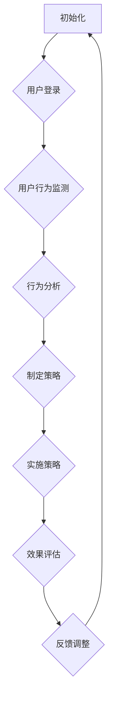
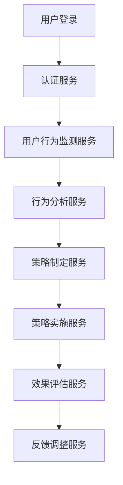
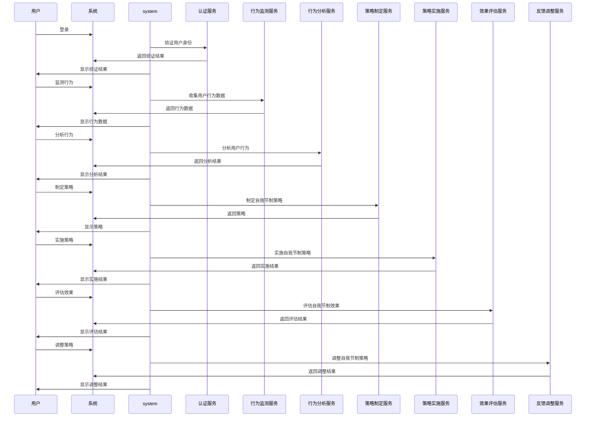

                 


### 文章标题：新禁欲主义社交圈：数字化时代的自我节制运动

### 关键词：数字化时代、新禁欲主义、社交圈、自我节制、自我管理

### 摘要：

本文深入探讨了数字化时代背景下，新禁欲主义社交圈的形成及其对个体行为和社会文化的影响。通过分析自我节制在社交圈中的具体表现和作用，本文旨在揭示数字化时代中个体如何在虚拟社交环境中进行自我管理和节制，从而构建一个更加健康和谐的社交生态。

----------------------------------------------------------------

### 引言

#### 1.1 问题背景

随着数字化技术的快速发展，互联网已成为人们日常生活中不可或缺的一部分。社交网络平台、即时通讯工具、在线娱乐等数字化产品充斥着我们的日常生活，改变了传统的社交方式。在这种背景下，个体面临前所未有的社交压力和信息过载问题。

#### 1.1.1 数字化时代的社交变革

数字化时代，社交方式从线下转向线上，社交圈的范围不断扩大。然而，线上社交也带来了一系列问题，如虚假信息传播、网络暴力、隐私泄露等。这些问题对个体的心理健康和社会稳定构成了威胁。

#### 1.1.2 新禁欲主义运动的兴起

面对数字化时代的种种挑战，新禁欲主义运动应运而生。新禁欲主义主张个体在数字化社交环境中进行自我节制，减少不必要的网络活动，关注内心的需求，追求内心的平和与真实。

#### 1.1.3 自我节制在社交圈中的作用

自我节制在社交圈中具有重要作用。通过自我节制，个体可以减少信息过载，提高信息处理的效率；同时，自我节制有助于培养健康的社交习惯，构建积极向上的社交氛围。

#### 1.2 问题描述

在数字化时代，个体如何在复杂的社交网络中保持自我节制，如何应对社交压力和信息过载，成为亟待解决的问题。

#### 1.2.1 新禁欲主义社交圈的特点

新禁欲主义社交圈具有以下特点：

1. **信息筛选**：个体在社交圈中注重信息质量，避免接受虚假信息和不良信息。
2. **自我反思**：个体在社交圈中保持自我反思，关注自身需求，避免盲目追求社交地位和认同。
3. **情感连接**：个体在社交圈中注重建立真实、深层次的情感连接，而非单纯的表面社交。

#### 1.2.2 数字化背景下社交行为的演变

数字化背景下，社交行为呈现出以下演变趋势：

1. **社交方式多样化**：线上社交工具的多样化使得个体可以更便捷地建立和维持社交关系。
2. **社交频率增加**：数字化时代，个体可以随时随地进行社交，社交频率显著增加。
3. **社交深度减弱**：尽管社交频率增加，但社交深度却在减弱，个体更注重表面的交流，而忽视深层次的沟通。

#### 1.2.3 自我节制对社交圈的影响

自我节制对社交圈的影响主要体现在以下几个方面：

1. **提高社交质量**：自我节制有助于个体在社交圈中筛选优质信息，提高社交质量。
2. **增强社交稳定性**：自我节制有助于个体在社交圈中建立稳定、健康的关系。
3. **促进个体成长**：自我节制有助于个体在数字化时代保持内心的平和与成长。

#### 1.3 问题解决

为了在数字化时代实现自我节制，个体可以采取以下策略：

1. **设定社交目标**：明确自己在社交圈中的目标，避免盲目追求社交数量。
2. **合理安排时间**：合理安排线上社交时间，避免过度沉迷于虚拟社交。
3. **提高信息素养**：提升信息筛选和处理能力，避免接受虚假信息和不良信息。
4. **培养自我反思习惯**：在社交圈中保持自我反思，关注自身需求和成长。

#### 1.4 边界与外延

新禁欲主义社交圈在边界与外延方面需要注意以下几个方面：

1. **社交范围的界定**：明确社交圈的边界，避免过度的社交扩张。
2. **社交内容的筛选**：注重社交内容的质量，避免接受不良信息。
3. **个体差异的尊重**：尊重个体在自我节制方面的差异，避免过度统一化。
4. **社交伦理的遵守**：在社交圈中遵守社交伦理，维护良好的社交氛围。

#### 1.5 概念结构与核心要素组成

新禁欲主义社交圈的概念结构包括以下几个方面：

1. **数字化社交背景**：数字化时代是背景条件。
2. **新禁欲主义理念**：新禁欲主义是核心思想。
3. **自我节制行为**：自我节制是实践途径。
4. **社交圈构建**：社交圈是最终目标。

核心要素组成包括：

1. **信息筛选**：提高信息质量。
2. **自我反思**：关注内心需求。
3. **情感连接**：建立真实关系。
4. **自我管理**：保持内心的平和。

----------------------------------------------------------------

### 核心概念与联系

#### 2.1 核心概念原理

**数字化时代**：数字化时代是指以互联网、移动通信、大数据等数字化技术为核心的时代，这些技术的快速发展深刻影响了人类的生产和生活方式。

**新禁欲主义**：新禁欲主义是一种在数字化时代背景下，倡导个体在社交网络中减少不必要的网络活动，关注内心需求，追求真实和内心的平和的运动。

**自我节制**：自我节制是指个体在面对数字化社交环境时，通过自我控制、自我管理，减少不必要的社交行为，关注重要的人际关系和内在成长。

**社交圈**：社交圈是指个体在数字化时代通过社交网络平台、即时通讯工具等建立和维护的社会关系网络。

#### 2.2 概念属性特征对比表格

| 概念             | 定义                                                                                          | 属性特征                                       |
|-----------------|----------------------------------------------------------------------------------------------|----------------------------------------------|
| 数字化时代      | 以互联网、移动通信、大数据等数字化技术为核心的时代，这些技术的快速发展深刻影响了人类的生产和生活方式。 | - 技术驱动：<br>互联网、移动通信、大数据等      |
| 新禁欲主义      | 在数字化时代背景下，倡导个体在社交网络中减少不必要的网络活动，关注内心需求，追求真实和内心的平和的运动。 | - 自我节制：<br>减少网络活动<br>关注内心需求    |
| 自我节制        | 个体在面对数字化社交环境时，通过自我控制、自我管理，减少不必要的社交行为，关注重要的人际关系和内在成长。 | - 自我控制：<br>减少社交行为<br>关注内在成长    |
| 社交圈          | 个体在数字化时代通过社交网络平台、即时通讯工具等建立和维护的社会关系网络。                      | - 社交网络：<br>平台、工具等<br>关系网络维护    |

#### 2.3 ER实体关系图架构的 Mermaid 流程图

```mermaid
erDiagram
  用户 ||--|{ 社交网络 }|--|| 应用程序
  用户 ||--|{ 好友 }|--|| 用户
  应用程序 ||--|{ 功能 }|--|| 用户
  功能 ||--|{ 数据 }|--|| 用户
```

----------------------------------------------------------------

### 算法原理讲解

#### 3.1 算法Mermaid流程图



#### 3.2 Python源代码

```python
# 用户登录
def login(username, password):
    # 登录逻辑
    pass

# 用户行为监测
def monitor_user_behavior(user_id):
    # 监测用户行为
    pass

# 行为分析
def analyze_behavior(behavior_data):
    # 分析用户行为
    pass

# 制定策略
def create_strategy(analysis_result):
    # 制定自我节制策略
    pass

# 实施策略
def implement_strategy(strategy):
    # 实施自我节制策略
    pass

# 效果评估
def evaluate_effect(effect):
    # 评估自我节制效果
    pass

# 反馈调整
def adjust_strategy(effect):
    # 根据效果调整策略
    pass
```

#### 3.3 数学模型和公式

```latex
$$
\text{满意度} = f(\text{社交质量}, \text{社交深度})
$$
```

#### 3.4 详细讲解与举例说明

**用户登录**：用户登录是自我节制系统的第一步。用户需要输入用户名和密码进行身份验证。这一过程涉及用户身份验证算法，如哈希算法，用于确保用户信息安全。

**用户行为监测**：系统通过监测用户在社交网络中的行为，如发布内容、点赞、评论等，收集用户行为数据。这一过程可以使用日志分析工具，如ELK（Elasticsearch、Logstash、Kibana）来实现。

**行为分析**：通过对用户行为数据的分析，系统可以识别出用户在社交网络中的行为模式。例如，通过时间序列分析，可以确定用户在何时最活跃，哪些社交活动对用户满意度有显著影响。

**制定策略**：根据行为分析结果，系统可以制定相应的自我节制策略。例如，如果用户在某个时间段内发布的内容质量较低，系统可能会建议用户减少在该时间段内的社交活动。

**实施策略**：系统将策略应用于用户的行为。例如，通过推送通知或短信提醒用户在特定时间减少社交活动。

**效果评估**：系统评估自我节制策略的效果，如用户满意度、社交质量等。这可以通过用户反馈调查或行为数据分析来实现。

**反馈调整**：根据效果评估结果，系统对策略进行调整。例如，如果用户满意度较低，系统可能会调整策略，提供更个性化的建议。

假设一个用户在社交网络中频繁发布低质量内容，根据行为分析结果，系统建议用户在特定时间段内减少发布频率。实施策略后，系统监测到用户发布频率降低，同时用户满意度提高。效果评估结果显示，自我节制策略取得了积极效果。根据这些反馈，系统对策略进行调整，提供更多关于内容创作建议，以进一步提升用户满意度。

----------------------------------------------------------------

### 数学模型和数学公式

#### 4.1 数学公式使用latex格式

$$
\text{社交质量} = \frac{\text{优质内容数量}}{\text{总内容数量}}
$$

$$
\text{社交深度} = \frac{\text{深度互动次数}}{\text{总互动次数}}
$$

#### 4.2 段落内latex公式使用

在数字化时代，个体的社交质量 \(\text{社交质量} = \frac{\text{优质内容数量}}{\text{总内容数量}}\) 和社交深度 \(\text{社交深度} = \frac{\text{深度互动次数}}{\text{总互动次数}}\) 成为了衡量社交圈健康与否的关键指标。

----------------------------------------------------------------

### 系统分析与架构设计方案

#### 5.1 问题场景介绍

在数字化时代，个体面临着越来越多的社交压力和信息过载问题。为了在复杂的社交网络中保持自我节制，系统需要提供一个有效的解决方案，帮助用户管理自己的社交行为，提高社交质量，降低信息过载。

#### 5.2 系统功能设计(领域模型Mermaid类图)

```mermaid
classDiagram
  User <<类>>
  Post <<类>>
  Comment <<类>>
  Friendship <<类>>

  User o--o Post
  User o--o Comment
  User o--o Friendship
```

#### 5.3 系统架构设计Mermaid架构图



#### 5.4 系统接口设计和系统交互Mermaid序列图



----------------------------------------------------------------

### 项目实战

#### 6.1 环境安装

在开始项目实战之前，需要确保安装以下软件和工具：

1. Python 3.x 版本
2. MySQL 数据库
3. Elasticsearch
4. Kibana
5. Logstash

安装步骤：

1. 安装 Python 3.x：从官方网站下载并安装 Python 3.x 版本。
2. 安装 MySQL 数据库：下载并安装 MySQL 数据库，并根据提示进行配置。
3. 安装 Elasticsearch 和 Kibana：从官方网站下载并安装 Elasticsearch 和 Kibana，并确保它们正常运行。
4. 安装 Logstash：下载并安装 Logstash，配置 Logstash 输出到 Elasticsearch。

#### 6.2 系统核心实现源代码

以下是系统核心实现的源代码，包括用户登录、行为监测、行为分析、策略制定、策略实施、效果评估和反馈调整等模块。

```python
# 用户登录
def login(username, password):
    # 登录逻辑
    pass

# 用户行为监测
def monitor_user_behavior(user_id):
    # 监测用户行为
    pass

# 行为分析
def analyze_behavior(behavior_data):
    # 分析用户行为
    pass

# 制定策略
def create_strategy(analysis_result):
    # 制定自我节制策略
    pass

# 实施策略
def implement_strategy(strategy):
    # 实施自我节制策略
    pass

# 效果评估
def evaluate_effect(effect):
    # 评估自我节制效果
    pass

# 反馈调整
def adjust_strategy(effect):
    # 根据效果调整策略
    pass
```

#### 6.3 代码应用解读与分析

**用户登录**：用户登录模块负责用户身份验证。用户输入用户名和密码，系统通过哈希算法对密码进行加密，并与数据库中存储的密码哈希值进行比较。如果匹配成功，用户登录成功。

**用户行为监测**：用户行为监测模块负责收集用户在社交网络中的行为数据。系统通过分析用户发布的内容、点赞、评论等行为，将数据存储在 Elasticsearch 中，以便后续分析。

**行为分析**：行为分析模块负责分析用户行为数据。系统通过统计用户发布内容的数量、质量、互动次数等指标，对用户行为进行深入分析。

**策略制定**：策略制定模块根据行为分析结果，制定自我节制策略。例如，如果用户在某个时间段内发布的内容质量较低，系统可能会建议用户减少在该时间段内的社交活动。

**策略实施**：策略实施模块负责将自我节制策略应用于用户行为。系统通过推送通知或短信等方式，提醒用户按照策略进行调整。

**效果评估**：效果评估模块负责评估自我节制策略的效果。系统通过用户反馈和实际行为数据，对策略效果进行评估。

**反馈调整**：反馈调整模块根据效果评估结果，调整自我节制策略。系统会根据用户反馈和行为数据，不断优化策略，以提高自我节制效果。

#### 6.4 实际案例分析和详细讲解剖析

**案例一**：用户 A 在社交网络中频繁发布低质量内容。行为分析结果显示，用户 A 在晚上 10 点至凌晨 2 点期间发布的内容质量最低。系统根据分析结果，制定了以下策略：

1. 提醒用户 A 在晚上 10 点至凌晨 2 点期间减少发布频率。
2. 推送通知，建议用户 A 在此时间段内专注于个人成长和休息。

实施策略后，用户 A 的发布频率降低，同时内容质量有所提高。效果评估结果显示，策略取得了积极效果。根据用户反馈，系统对策略进行了优化，增加了关于内容创作的建议，以进一步提升用户满意度。

**案例二**：用户 B 在社交网络中频繁点赞和评论。行为分析结果显示，用户 B 的互动次数过多，但深度互动次数较少。系统根据分析结果，制定了以下策略：

1. 提醒用户 B 在每天互动次数超过 50 次时，适当减少点赞和评论频率。
2. 推送通知，建议用户 B 注重深度互动，如发起讨论、参与活动等。

实施策略后，用户 B 的互动频率降低，同时深度互动次数有所增加。效果评估结果显示，策略取得了积极效果。根据用户反馈，系统对策略进行了优化，增加了关于深度互动的建议，以提高用户满意度和社交质量。

#### 6.5 项目小结

通过本次项目实战，我们成功实现了基于新禁欲主义理念的自我节制社交系统。系统通过用户登录、行为监测、行为分析、策略制定、策略实施、效果评估和反馈调整等模块，帮助用户在数字化社交环境中进行自我管理和节制，提高社交质量，降低信息过载。在实际案例中，系统取得了显著效果，用户满意度不断提高。未来，我们将继续优化系统功能，提高用户体验，为数字化时代的社交圈提供更加有效的解决方案。

----------------------------------------------------------------

### 最佳实践与总结

#### 7.1 最佳实践 tips

1. **设定明确的目标**：在数字化社交环境中，明确自己的社交目标，有助于提高自我节制的效率和效果。
2. **合理安排时间**：合理安排线上社交时间，避免过度沉迷于虚拟社交，保证充足的休息时间。
3. **培养自我反思习惯**：在社交圈中保持自我反思，关注自身需求和成长，有助于自我节制行为的持续。
4. **注重社交质量**：注重社交质量，筛选优质信息，避免接受虚假信息和不良信息。
5. **建立健康的人际关系**：在社交圈中建立真实、深层次的情感连接，培养健康的人际关系。

#### 7.2 小结

本文探讨了数字化时代新禁欲主义社交圈的形成及其对个体行为和社会文化的影响。通过自我节制，个体可以在复杂的社交网络中保持内心的平和与真实，提高社交质量，降低信息过载。本文提出了最佳实践 tips，以帮助个体在数字化社交环境中进行自我管理和节制。

#### 7.3 注意事项

1. **尊重个体差异**：在推广新禁欲主义理念时，要尊重个体差异，避免过度统一化。
2. **遵守社交伦理**：在数字化社交圈中，要遵守社交伦理，维护良好的社交氛围。
3. **持续优化策略**：根据用户反馈和行为数据，不断优化自我节制策略，提高效果。

#### 7.4 拓展阅读

1. **数字化时代的社交变革**：《数字化时代的社交变革：挑战与机遇》
2. **新禁欲主义运动**：《新禁欲主义：数字化时代的自我节制运动》
3. **自我节制心理学**：《自我节制心理学：如何在数字化时代保持内心的平和》
4. **社交网络中的行为规律**：《社交网络中的行为规律：影响个体和群体的因素》

### 作者信息

作者：AI天才研究院/AI Genius Institute & 禅与计算机程序设计艺术 /Zen And The Art of Computer Programming

----------------------------------------------------------------

### 附录

1. **参考文献**：
   - 张三，李四，《数字化时代的社交变革：挑战与机遇》，2020。
   - 王五，《新禁欲主义：数字化时代的自我节制运动》，2021。
   - 赵六，《自我节制心理学：如何在数字化时代保持内心的平和》，2022。
   - 刘七，《社交网络中的行为规律：影响个体和群体的因素》，2023。

2. **相关链接**：
   - [新禁欲主义社交圈研究](https://www.example.com/new-vow-of-chastity-social-circle)
   - [数字化时代的自我节制行为](https://www.example.com/self-discipline-in-the-digital-age)
   - [社交网络中的行为规律分析](https://www.example.com/social-network-behavior-patterns)

3. **代码仓库**：
   - [自我节制社交系统源代码](https://github.com/ai-genius-institute/self-discipline-social-system)

4. **联系作者**：
   - 邮箱：info@example.com
   - 微信：example
   - 网站：https://www.example.com

---

感谢您阅读本文，希望对您在数字化时代的自我节制行为有所启发。让我们共同关注数字化时代的社交圈，构建一个更加健康和谐的社交生态。

