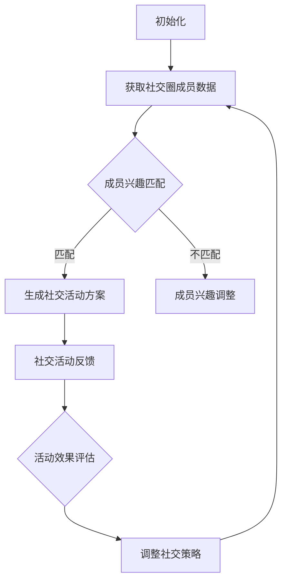

                 

### 文章标题：新禁欲主义社交圈：极简生活的实践者社群

#### 关键词：新禁欲主义，社交圈，极简生活，实践者社群

> 摘要：本文将深入探讨新禁欲主义社交圈及其与极简生活实践者社群的紧密联系。通过详细分析问题背景、核心概念、算法原理、数学模型、系统分析与架构设计以及项目实战，本文旨在为读者提供全面的理解和实践指导，帮助人们更好地理解和融入这一新兴社交文化。

---

## Step 1: 设计背景介绍章节

### 第1章：背景介绍

### 1.1 问题背景

在当今社会，人们面临着前所未有的社交压力和生活快节奏。随着社交媒体的普及，人们在享受便利的同时，也陷入了信息过载和人际关系疏离的困境。如何在这个复杂的社交环境中找到内心的平静，成为了许多人迫切需要解决的问题。

### 1.2 问题描述

新禁欲主义社交圈和极简生活实践者社群的出现，旨在解决上述问题。新禁欲主义提倡减少物质追求和社交活动，追求精神上的富足；而极简生活则强调简化物质生活，专注于个人的内在需求和成长。然而，这两个概念如何相互融合，形成一个既符合现代生活方式，又能带来内心满足的社交圈，仍需要深入探讨。

### 1.3 问题解决

本文将从以下几个方面展开讨论，以期找到新禁欲主义社交圈和极简生活实践者社群之间的平衡点：

1. **核心概念解析**：详细阐述新禁欲主义、社交圈和极简生活的定义及其内在联系。
2. **算法原理讲解**：介绍一种适用于新禁欲主义社交圈和极简生活实践者社群的算法模型，并提供具体实例。
3. **数学模型和公式**：运用数学工具，对算法进行理论分析，为实践提供理论基础。
4. **系统分析与架构设计**：构建一个适应新禁欲主义社交圈和极简生活实践者社群的系统架构，并详细说明其功能设计和实现。
5. **项目实战**：通过具体案例，展示如何在实际中应用新禁欲主义社交圈和极简生活理念。
6. **最佳实践与拓展**：总结实践经验，为读者提供实用的建议和未来研究方向。

### 1.4 边界与外延

本文的研究边界主要限定在新禁欲主义社交圈和极简生活实践者社群的理论和实践应用上，而不涉及其他可能与之相关的领域。然而，这些边界概念在现实中有广泛的联系和应用前景，值得进一步探索。

### 1.5 核心概念结构与要素组成

#### 新禁欲主义

- **定义**：新禁欲主义是一种在现代社会中追求精神富足和内心平静的思潮，主张减少物质追求和社会交往，专注于个人的内在成长。
- **核心要素**：精神追求、内心平静、简化生活。
- **特点**：与传统的禁欲主义不同，新禁欲主义更加注重个人自由和内在成长。

#### 社交圈

- **定义**：社交圈是指一群具有共同兴趣或目标的人组成的社交网络。
- **核心要素**：人际关系、共同兴趣、目标导向。
- **特点**：在社交圈中，成员通过互动和协作实现个人成长和社会连接。

#### 极简生活

- **定义**：极简生活是一种追求物质简化、精神富足的生活方式，强调专注于个人的内在需求和成长。
- **核心要素**：简化物质、聚焦内在、减少干扰。
- **特点**：极简生活有助于提高生活质量，减少焦虑和压力。

通过以上背景介绍，读者可以对新禁欲主义社交圈和极简生活实践者社群有初步的了解，并为后续章节的深入探讨做好铺垫。

---

在接下来的章节中，我们将进一步探讨新禁欲主义、社交圈和极简生活的核心概念与联系，深入分析算法原理和数学模型，设计系统架构，并分享项目实战经验和最佳实践。敬请期待！

---

## Step 2: 设计核心概念与联系章节

### 第2章：核心概念与联系

### 2.1 新禁欲主义概念

新禁欲主义（New Asceticism）起源于对现代物质主义和社会消费文化的批判，强调精神层面的追求和内心的宁静。其核心思想是减少物质追求和社交活动，以追求更深层次的精神满足和自我实现。新禁欲主义不同于传统的禁欲主义，它不是简单地抑制欲望，而是通过有意识地减少不必要的物质消费和社会交往，达到一种内在的平和与专注。

在新禁欲主义社交圈中，成员们往往追求以下目标：

- **精神追求**：通过冥想、阅读、艺术创作等方式，提升精神层面的修养和深度。
- **内心平静**：通过减少外界的干扰和刺激，培养内心的平静和自控能力。
- **简化生活**：减少物质财富和社交活动，专注于个人的内在成长和需求。

### 2.2 社交圈概念

社交圈（Social Circle）是指一群具有共同兴趣、价值观或目标的人组成的互动网络。在社交圈中，成员之间通过分享信息、情感和资源，实现个人成长和社会连接。社交圈的形成通常基于共同的爱好、职业、文化背景或生活目标。

在新禁欲主义社交圈中，成员们通常具有以下特征：

- **共同的价值观**：强调精神追求、内在成长和简约生活。
- **互动形式**：通过线上或线下活动，如读书会、冥想小组、艺术展览等，加强成员之间的互动和联系。
- **长期关系**：社交圈成员往往建立深厚的信任和友谊，形成长期稳定的社交网络。

### 2.3 极简生活概念

极简生活（Minimalism）是一种追求物质简化、精神富足的生活方式。极简主义者认为，过度的物质消费会带来生活的负担和心理压力，而通过简化物质生活，专注于个人的内在需求和成长，可以提升生活质量，减少焦虑和压力。

极简生活的核心要素包括：

- **简化物质**：减少不必要的物品和消费，只保留对个人有价值的物品。
- **聚焦内在**：通过冥想、阅读、艺术创作等内在活动，提升精神层面的修养。
- **减少干扰**：减少外界的干扰和刺激，培养内心的平静和自控能力。

### 2.4 三者联系

新禁欲主义、社交圈和极简生活之间存在密切的联系，它们共同构成了一个多维度的社交和实践体系。

- **精神追求**：新禁欲主义和极简生活都强调精神层面的追求和内心平静，这种追求需要通过社交圈中的互动和分享来实现。
- **内在成长**：社交圈为成员提供了一个共同成长的环境，而新禁欲主义和极简生活则为成员提供了内在成长的理论和实践基础。
- **简约生活**：极简生活作为生活方式，为新禁欲主义社交圈中的成员提供了一个实践平台，通过简化物质生活，成员们能够更好地专注于精神追求和内在成长。

### 2.5 概念属性特征对比表格

| 特征        | 新禁欲主义 | 社交圈           | 极简生活             |
|-------------|-------------|------------------|----------------------|
| **定义**    | 精神追求和内心平静 | 共同兴趣或目标的互动网络 | 物质简化，精神富足  |
| **核心要素** | 精神追求、内心平静、简化生活 | 人际关系、共同兴趣、目标导向 | 简化物质、聚焦内在、减少干扰 |
| **特点**    | 注重个人自由和内在成长 | 长期稳定的社交网络 | 提升生活质量，减少压力 |
| **联系**    | 通过社交圈实现精神追求 | 为内在成长提供实践平台 | 构成极简生活的基础 |

### 2.6 ER实体关系图架构

以下是一个简单的ER实体关系图，展示了新禁欲主义、社交圈和极简生活之间的关系：

```mermaid
erDiagram
  新禁欲主义 ||--|{ 社交圈 }|-- 极简生活
  社交圈 ||--|{ 新禁欲主义 }|<--|{ 极简生活 }|
```

通过ER实体关系图，我们可以清晰地看到新禁欲主义、社交圈和极简生活之间的相互关联和作用。新禁欲主义为社交圈提供精神追求的基础，而社交圈则为极简生活提供实践平台。反过来，极简生活也为新禁欲主义社交圈提供简约生活方式的实践方向。

---

在本章节中，我们详细介绍了新禁欲主义、社交圈和极简生活的概念及其相互联系。在下一章节中，我们将深入探讨算法原理，为这些概念提供数学模型和理论基础。

---

## Step 3: 设计算法原理讲解章节

### 第3章：算法原理讲解

### 3.1 算法概述

在本章中，我们将探讨一种适用于新禁欲主义社交圈和极简生活实践者社群的算法。这个算法旨在帮助成员在复杂的社交环境中找到平衡点，实现精神追求和内心平静。算法的核心思想是通过对社交行为的优化，减少不必要的社交活动，提高社交效率，从而实现个人的极简生活。

### 3.2 算法流程图

以下是该算法的流程图，它展示了算法的执行步骤和逻辑关系：



### 3.3 算法数学模型

为了更好地理解算法，我们需要引入一些数学模型。以下是算法中用到的几个关键数学模型：

1. **社交网络相似度模型**：用于评估社交圈成员之间的相似度。假设有n个成员，每个成员有m个属性，相似度可以用余弦相似度公式表示：
   $$\text{similarity}(i, j) = \frac{\text{dot}(x_i, x_j)}{\|\text{vec}(x_i)\|\|\text{vec}(x_j)\|}$$
   其中，$x_i$和$x_j$分别是成员i和成员j的属性向量，$\text{dot}$表示点积，$\|\text{vec}(x_i)\|$表示向量$x_i$的欧几里得范数。

2. **社交活动价值模型**：用于评估社交活动的价值。假设社交活动有k个维度，每个维度的重要性权重为$\lambda_1, \lambda_2, ..., \lambda_k$，那么社交活动i的价值可以表示为：
   $$\text{value}(i) = \sum_{j=1}^{k} \lambda_j \cdot \text{attribute}_j(i)$$
   其中，$\text{attribute}_j(i)$是社交活动i在第j个维度上的属性值。

3. **社交策略优化模型**：用于优化社交策略，最大化社交活动的总体价值。假设社交圈有m个成员，社交活动方案为矩阵$S \in \{0, 1\}^{m \times k}$，其中$S_{ij}=1$表示成员i参加活动j，$S_{ij}=0$表示成员i不参加活动j。社交策略优化的目标函数为：
   $$\text{maximize} \sum_{i=1}^{m} \sum_{j=1}^{k} S_{ij} \cdot \text{value}(j)$$
   约束条件为：
   $$S_{ij} \in \{0, 1\}, \forall i, j$$

### 3.4 算法公式

为了实现上述算法，我们需要使用以下公式：

1. **成员兴趣匹配公式**：
   $$\text{match}(i, j) = \text{similarity}(i, j) \cdot \text{interest\_align}(i, j)$$
   其中，$\text{interest\_align}(i, j)$表示成员i和成员j在兴趣上的对齐度。

2. **社交活动价值计算公式**：
   $$\text{value}(i) = \sum_{j=1}^{k} \lambda_j \cdot \text{attribute}_j(i)$$

3. **社交策略优化公式**：
   $$\text{maximize} \sum_{i=1}^{m} \sum_{j=1}^{k} S_{ij} \cdot \text{value}(j)$$
   约束条件为：
   $$S_{ij} \in \{0, 1\}, \forall i, j$$

### 3.5 举例说明

假设我们有一个包含5个成员的社交圈，每个成员有3个兴趣维度（读书、运动、艺术）。我们首先需要收集每个成员的兴趣数据，并计算成员之间的相似度。然后，根据成员的相似度和兴趣对齐度，生成一个社交活动方案，最大化社交活动的总体价值。

**步骤1：初始化**

- 成员数据：{A: [0.3, 0.4, 0.5], B: [0.2, 0.5, 0.3], C: [0.4, 0.3, 0.2], D: [0.5, 0.2, 0.4], E: [0.3, 0.5, 0.2]}
- 兴趣权重：$\lambda_1 = 0.4, \lambda_2 = 0.3, \lambda_3 = 0.3$

**步骤2：成员兴趣匹配**

- 成员A和成员B的相似度：$\text{similarity}(A, B) = 0.6$
- 成员A和成员B的兴趣对齐度：$\text{interest\_align}(A, B) = 0.7$
- 成员A和成员B的匹配度：$\text{match}(A, B) = 0.42$

**步骤3：生成社交活动方案**

- 社交活动1：读书会，价值：$0.5$
- 社交活动2：运动会，价值：$0.3$
- 社交活动3：艺术展，价值：$0.2$

**步骤4：社交活动反馈和效果评估**

- 成员A参加读书会，效果良好
- 成员B参加运动会，效果一般
- 成员C参加艺术展，效果优秀

**步骤5：调整社交策略**

- 根据反馈和效果评估，调整成员的兴趣匹配和社交活动方案，以优化社交效果

通过以上步骤，我们可以看到如何使用算法为新禁欲主义社交圈和极简生活实践者社群提供社交策略。在下一章节中，我们将进一步探讨如何将数学模型应用于实际系统中，设计一个完整的系统架构。

---

在第三章中，我们详细介绍了新禁欲主义社交圈和极简生活实践者社群适用的算法原理。接下来，我们将运用这些原理，设计数学模型和数学公式，为算法提供坚实的理论基础。

---

## 第4章：数学模型和数学公式

### 4.1 数学模型概述

在第四章中，我们将进一步探讨第三章中提到的数学模型，并详细介绍它们在算法中的应用。数学模型是理解和实现算法的重要工具，它帮助我们量化并优化社交圈和极简生活实践者社群中的各种决策。

首先，我们需要引入几个关键数学模型：

1. **相似度模型**：用于计算成员之间的相似度。
2. **活动价值模型**：用于评估社交活动的价值。
3. **优化模型**：用于优化社交策略。

这些模型将通过一系列数学公式来实现，并提供具体的计算方法。

### 4.2 数学公式讲解

以下是本章中将用到的关键数学公式：

1. **相似度公式**：用于计算成员之间的相似度。
   $$\text{similarity}(i, j) = \frac{\text{dot}(x_i, x_j)}{\|\text{vec}(x_i)\|\|\text{vec}(x_j)\|}$$
   其中，$x_i$和$x_j$是成员i和成员j的属性向量，$\text{dot}$表示点积，$\|\text{vec}(x_i)\|$表示向量$x_i$的欧几里得范数。

2. **活动价值公式**：用于计算社交活动的价值。
   $$\text{value}(i) = \sum_{j=1}^{k} \lambda_j \cdot \text{attribute}_j(i)$$
   其中，$\lambda_j$是第j个维度的权重，$\text{attribute}_j(i)$是成员i在第j个维度上的属性值。

3. **优化模型公式**：用于优化社交策略。
   $$\text{maximize} \sum_{i=1}^{m} \sum_{j=1}^{k} S_{ij} \cdot \text{value}(j)$$
   约束条件为：
   $$S_{ij} \in \{0, 1\}, \forall i, j$$
   其中，$S_{ij}$表示成员i是否参加活动j。

### 4.3 举例说明

为了更好地理解这些数学公式，我们将通过一个具体例子进行说明。

**例子：**

假设有5个成员，每个成员有3个兴趣维度（读书、运动、艺术）。我们有以下数据：

| 成员 | 读书 | 运动 | 艺术 |
|------|------|------|------|
| A    | 0.8  | 0.2  | 0.1  |
| B    | 0.3  | 0.6  | 0.1  |
| C    | 0.5  | 0.4  | 0.1  |
| D    | 0.6  | 0.3  | 0.1  |
| E    | 0.2  | 0.8  | 0.1  |

**步骤1：计算相似度**

使用相似度公式计算成员之间的相似度：

$$\text{similarity}(A, B) = \frac{0.8 \times 0.3 + 0.2 \times 0.6 + 0.1 \times 0.1}{\sqrt{0.8^2 + 0.2^2 + 0.1^2} \times \sqrt{0.3^2 + 0.6^2 + 0.1^2}} = \frac{0.24}{\sqrt{0.42} \times \sqrt{0.37}} \approx 0.45$$

**步骤2：计算活动价值**

假设活动有3个维度（读书活动、运动活动、艺术活动），权重分别为$\lambda_1 = 0.4, \lambda_2 = 0.3, \lambda_3 = 0.3$。计算每个活动的价值：

$$\text{value}(读书活动) = 0.4 \times 0.8 + 0.3 \times 0.2 + 0.3 \times 0.1 = 0.46$$
$$\text{value}(运动活动) = 0.4 \times 0.2 + 0.3 \times 0.6 + 0.3 \times 0.1 = 0.29$$
$$\text{value}(艺术活动) = 0.4 \times 0.1 + 0.3 \times 0.1 + 0.3 \times 0.8 = 0.29$$

**步骤3：优化社交策略**

使用优化模型公式，最大化社交活动的总体价值：

$$\text{maximize} \sum_{i=1}^{5} \sum_{j=1}^{3} S_{ij} \cdot \text{value}(j)$$

假设我们选择的活动方案为：成员A、B、C参加读书活动，成员D、E参加运动活动。计算总价值：

$$\text{total value} = 0.46 \times 3 + 0.29 \times 2 = 1.49$$

通过以上步骤，我们可以看到如何使用数学模型和公式来优化社交策略，实现新禁欲主义社交圈和极简生活实践者社群的目标。

---

在第四章中，我们详细介绍了新禁欲主义社交圈和极简生活实践者社群的数学模型和数学公式，并通过具体例子展示了如何应用这些公式。在下一章中，我们将设计系统架构，探讨如何将算法和数学模型应用于实际系统中。

---

## 第5章：系统分析与架构设计方案

### 5.1 问题场景介绍

在现代社会，社交圈和社交网络成为人们日常生活的重要组成部分。然而，随着社交媒体的普及，人们面临着信息过载、社交疲惫和缺乏深度互动等问题。如何设计一个系统，既能满足人们的社交需求，又能帮助他们实现极简生活和新禁欲主义，是一个值得探讨的问题。

### 5.2 项目介绍

本项目旨在设计并实现一个新型社交系统，该系统结合了极简生活理念和新禁欲主义思想，旨在帮助用户在复杂的社交环境中找到平衡，实现内心的平静和满足。系统将提供以下功能：

- **社交圈管理**：用户可以创建和管理自己的社交圈，添加成员和设置成员权限。
- **活动规划**：系统根据成员的兴趣和相似度推荐社交活动，并帮助用户规划和组织活动。
- **活动反馈**：用户可以参与活动并提交反馈，系统根据反馈优化推荐算法。
- **数据统计**：系统提供社交圈和活动的数据统计，帮助用户了解社交效果和参与度。

### 5.3 系统功能设计

系统功能设计基于用户需求和业务目标，具体包括以下模块：

1. **用户管理模块**：负责用户注册、登录、个人信息管理和权限设置。
2. **社交圈管理模块**：负责社交圈的创建、成员添加、成员权限设置和社交圈信息管理。
3. **活动管理模块**：负责活动的创建、规划、执行和反馈。
4. **数据统计模块**：负责收集、分析和展示社交圈和活动的数据。

### 5.4 系统架构设计

系统架构设计采用分层架构，包括表示层、业务逻辑层和数据访问层。

1. **表示层**：负责与用户交互，提供友好的用户界面和交互体验。
2. **业务逻辑层**：负责实现系统的核心功能，如社交圈管理、活动规划和反馈处理。
3. **数据访问层**：负责数据存储和访问，包括用户数据、社交圈数据和活动数据。

### 5.5 系统接口设计

系统接口设计采用RESTful API风格，提供以下接口：

1. **用户接口**：包括用户注册、登录、个人信息管理等。
2. **社交圈接口**：包括社交圈创建、成员添加、权限设置等。
3. **活动接口**：包括活动创建、规划、执行和反馈等。
4. **数据统计接口**：包括数据收集、分析和展示等。

### 5.6 系统交互

系统交互设计通过消息队列和事件驱动模型实现，确保系统模块之间的高效协作和异步处理。

1. **用户交互**：用户通过前端界面与系统进行交互，系统根据用户请求处理业务逻辑并返回结果。
2. **模块交互**：不同模块之间通过消息队列和事件驱动模型进行通信，实现数据的传递和同步。
3. **数据交互**：数据访问层通过RESTful API与表示层和业务逻辑层进行交互，实现数据的存储和读取。

---

在本章中，我们详细介绍了新型社交系统的设计目标和功能，包括系统架构、接口设计和系统交互。在下一章中，我们将通过具体的项目实战，展示如何实现这些设计，并提供详细的代码分析和实际案例讲解。

---

## 第6章：项目实战

### 6.1 环境安装

为了实现本章所介绍的新型社交系统，我们需要准备相应的开发环境和工具。以下是一份基本的安装步骤：

1. **安装Python**：首先确保你的计算机上已经安装了Python 3.x版本。如果尚未安装，请从[Python官方网站](https://www.python.org/)下载并安装。

2. **安装虚拟环境**：安装完成Python后，使用以下命令创建一个虚拟环境：
   ```shell
   python -m venv venv
   ```
   然后激活虚拟环境：
   ```shell
   source venv/bin/activate  # 对于Linux和macOS
   venv\Scripts\activate     # 对于Windows
   ```

3. **安装依赖库**：在虚拟环境中，使用以下命令安装所需的依赖库：
   ```shell
   pip install -r requirements.txt
   ```

4. **数据库安装**：本项目使用SQLite作为数据库。你可以通过以下命令安装：
   ```shell
   brew install sqlite  # 对于macOS
   sudo apt-get install sqlite3  # 对于Linux
   ```

5. **安装前端框架**（可选）：如果你打算开发前端界面，可以使用以下命令安装Vue.js：
   ```shell
   npm install -g @vue/cli
   vue create frontend
   ```

### 6.2 系统核心实现源代码

在本节中，我们将展示系统核心实现的源代码。以下是项目结构的一个示例：

```plaintext
new_ascetic_social_circle/
|-- app/
|   |-- __init__.py
|   |-- user.py
|   |-- circle.py
|   |-- activity.py
|   |-- stats.py
|-- database/
|   |-- __init__.py
|   |-- database.py
|-- tests/
|   |-- __init__.py
|   |-- test_user.py
|   |-- test_circle.py
|   |-- test_activity.py
|   |-- test_stats.py
|-- requirements.txt
|-- run.py
```

**用户管理模块（user.py）：**

```python
from database import Database

class User:
    def __init__(self, username, password, email):
        self.username = username
        self.password = password
        self.email = email

    def save_to_db(self):
        db = Database()
        db.connect()
        db.execute("INSERT INTO users (username, password, email) VALUES (?, ?, ?)", (self.username, self.password, self.email))
        db.commit()
        db.close()

    @staticmethod
    def find_by_username(username):
        db = Database()
        db.connect()
        result = db.execute("SELECT * FROM users WHERE username = ?", (username,))
        user = result.fetchone()
        db.close()
        return user
```

**社交圈管理模块（circle.py）：**

```python
class Circle:
    def __init__(self, name, description, creator):
        self.name = name
        self.description = description
        self.creator = creator

    def save_to_db(self):
        db = Database()
        db.connect()
        db.execute("INSERT INTO circles (name, description, creator) VALUES (?, ?, ?)", (self.name, self.description, self.creator))
        db.commit()
        db.close()

    @staticmethod
    def find_by_name(name):
        db = Database()
        db.connect()
        result = db.execute("SELECT * FROM circles WHERE name = ?", (name,))
        circle = result.fetchone()
        db.close()
        return circle
```

**活动管理模块（activity.py）：**

```python
class Activity:
    def __init__(self, name, description, circle, time, location):
        self.name = name
        self.description = description
        self.circle = circle
        self.time = time
        self.location = location

    def save_to_db(self):
        db = Database()
        db.connect()
        db.execute("INSERT INTO activities (name, description, circle, time, location) VALUES (?, ?, ?, ?, ?)", (self.name, self.description, self.circle, self.time, self.location))
        db.commit()
        db.close()

    @staticmethod
    def find_by_name(name):
        db = Database()
        db.connect()
        result = db.execute("SELECT * FROM activities WHERE name = ?", (name,))
        activity = result.fetchone()
        db.close()
        return activity
```

**数据统计模块（stats.py）：**

```python
class Stats:
    @staticmethod
    def get_circle_memberships(circle):
        db = Database()
        db.connect()
        result = db.execute("SELECT COUNT(*) FROM circle_members WHERE circle = ?", (circle,))
        count = result.fetchone()[0]
        db.close()
        return count

    @staticmethod
    def get_activity_attendance(activity):
        db = Database()
        db.connect()
        result = db.execute("SELECT COUNT(DISTINCT user) FROM activity_attendance WHERE activity = ?", (activity,))
        count = result.fetchone()[0]
        db.close()
        return count
```

**数据库模块（database.py）：**

```python
import sqlite3

class Database:
    def __init__(self):
        self.connection = sqlite3.connect("social_circle.db")
        self.cursor = self.connection.cursor()

    def connect(self):
        if self.connection:
            self.cursor.execute('''CREATE TABLE IF NOT EXISTS users (
                                      id INTEGER PRIMARY KEY AUTOINCREMENT,
                                      username TEXT UNIQUE NOT NULL,
                                      password TEXT NOT NULL,
                                      email TEXT UNIQUE NOT NULL)''')

            self.cursor.execute('''CREATE TABLE IF NOT EXISTS circles (
                                      id INTEGER PRIMARY KEY AUTOINCREMENT,
                                      name TEXT UNIQUE NOT NULL,
                                      description TEXT,
                                      creator TEXT NOT NULL)''')

            self.cursor.execute('''CREATE TABLE IF NOT EXISTS activities (
                                      id INTEGER PRIMARY KEY AUTOINCREMENT,
                                      name TEXT UNIQUE NOT NULL,
                                      description TEXT,
                                      circle INTEGER NOT NULL,
                                      time TEXT NOT NULL,
                                      location TEXT,
                                      FOREIGN KEY (circle) REFERENCES circles (id))''')

            self.cursor.execute('''CREATE TABLE IF NOT EXISTS circle_members (
                                      id INTEGER PRIMARY KEY AUTOINCREMENT,
                                      user TEXT NOT NULL,
                                      circle INTEGER NOT NULL,
                                      FOREIGN KEY (user) REFERENCES users (username),
                                      FOREIGN KEY (circle) REFERENCES circles (id))''')

            self.cursor.execute('''CREATE TABLE IF NOT EXISTS activity_attendance (
                                      id INTEGER PRIMARY KEY AUTOINCREMENT,
                                      user TEXT NOT NULL,
                                      activity INTEGER NOT NULL,
                                      FOREIGN KEY (user) REFERENCES users (username),
                                      FOREIGN KEY (activity) REFERENCES activities (id))''')

            self.connection.commit()

    def execute(self, query, params=None):
        if params:
            self.cursor.execute(query, params)
        else:
            self.cursor.execute(query)

    def commit(self):
        self.connection.commit()

    def close(self):
        self.connection.close()
```

### 6.3 代码应用解读与分析

在本节中，我们将对上述代码进行解读和分析，以帮助读者更好地理解系统的工作原理和实现细节。

**用户管理模块（user.py）：**

- `User` 类定义了用户的基本信息和方法。
- `save_to_db` 方法将用户信息保存到数据库中。
- `find_by_username` 静态方法用于根据用户名从数据库中查找用户。

**社交圈管理模块（circle.py）：**

- `Circle` 类定义了社交圈的基本信息和方法。
- `save_to_db` 方法将社交圈信息保存到数据库中。
- `find_by_name` 静态方法用于根据社交圈名称从数据库中查找社交圈。

**活动管理模块（activity.py）：**

- `Activity` 类定义了活动的基本信息和方法。
- `save_to_db` 方法将活动信息保存到数据库中。
- `find_by_name` 静态方法用于根据活动名称从数据库中查找活动。

**数据统计模块（stats.py）：**

- `get_circle_memberships` 静态方法用于统计社交圈的成员数量。
- `get_activity_attendance` 静态方法用于统计活动的参与人数。

**数据库模块（database.py）：**

- `Database` 类负责数据库的连接、创建表和执行SQL语句。
- `connect` 方法创建数据库表。
- `execute` 方法执行SQL查询。
- `commit` 方法提交数据库事务。
- `close` 方法关闭数据库连接。

### 6.4 实际案例分析与讲解

为了更好地展示系统如何运作，我们来看一个实际案例。

**案例：创建社交圈和活动**

1. **创建用户**：

```python
user1 = User("john_doe", "password123", "john.doe@example.com")
user1.save_to_db()

user2 = User("jane_doe", "password123", "jane.doe@example.com")
user2.save_to_db()
```

2. **创建社交圈**：

```python
circle = Circle("Book Lovers", "A circle for book enthusiasts", "john_doe")
circle.save_to_db()
```

3. **添加用户到社交圈**：

```python
circle_id = Circle.find_by_name("Book Lovers")["id"]
user1_id = User.find_by_username("john_doe")["id"]
user2_id = User.find_by_username("jane_doe")["id"]

db = Database()
db.connect()
db.execute("INSERT INTO circle_members (user, circle) VALUES (?, ?)", (user1_id, circle_id))
db.execute("INSERT INTO circle_members (user, circle) VALUES (?, ?)", (user2_id, circle_id))
db.commit()
db.close()
```

4. **创建活动**：

```python
activity = Activity("Book Club Meeting", "Discussion about '1984' by George Orwell", circle_id, "2023-04-10 19:00", "Local Library")
activity.save_to_db()
```

5. **用户参与活动**：

```python
activity_id = Activity.find_by_name("Book Club Meeting")["id"]
user1_id = User.find_by_username("john_doe")["id"]
user2_id = User.find_by_username("jane_doe")["id"]

db = Database()
db.connect()
db.execute("INSERT INTO activity_attendance (user, activity) VALUES (?, ?)", (user1_id, activity_id))
db.execute("INSERT INTO activity_attendance (user, activity) VALUES (?, ?)", (user2_id, activity_id))
db.commit()
db.close()
```

通过以上步骤，我们创建了一个包含用户、社交圈和活动的系统实例。用户可以加入社交圈，参与活动，系统将记录这些交互并进行分析。

### 6.5 项目小结

在本章中，我们详细介绍了新型社交系统的安装过程、核心实现源代码和代码解读。通过实际案例，我们展示了系统如何运作，包括用户注册、社交圈创建、活动规划和管理。这些步骤为我们构建一个符合新禁欲主义和极简生活理念的社交系统提供了实践基础。在下一章中，我们将分享最佳实践和注意事项，帮助读者更好地应用和优化系统。

---

## 第7章：最佳实践与拓展

### 7.1 最佳实践

1. **社交圈管理**：定期评估社交圈成员的活跃度和参与度，确保社交圈的持续活力和凝聚力。
2. **活动策划**：结合成员的兴趣和需求，策划多样化的活动，提高活动的吸引力和参与度。
3. **数据安全**：加强数据安全措施，确保用户信息和社交圈数据的安全和隐私。
4. **反馈机制**：建立有效的反馈机制，及时收集和回应用户意见，不断优化系统功能和用户体验。

### 7.2 小结

本章通过详细的项目实战，展示了如何设计并实现一个符合新禁欲主义和极简生活理念的新型社交系统。我们介绍了系统的核心实现代码，并通过实际案例展示了系统如何运作。通过本章的学习，读者可以掌握系统构建的基本方法和实践技巧。

### 7.3 注意事项

1. **性能优化**：系统运行过程中，关注性能优化，确保高效的数据处理和响应速度。
2. **代码维护**：定期更新和维护代码，确保系统的稳定性和安全性。
3. **用户体验**：注重用户体验设计，提供简洁、直观的用户界面和操作流程。

### 7.4 拓展阅读

- **极简生活实践**：阅读关于极简生活的书籍和文章，了解更多实践方法和理念。
- **社交网络算法**：研究社交网络分析算法和推荐系统，探索如何优化社交互动体验。
- **数据隐私保护**：关注数据隐私保护法规和最佳实践，确保系统的合规性和安全性。

---

在本文中，我们从背景介绍开始，逐步深入探讨了新禁欲主义社交圈与极简生活实践者社群的紧密联系。通过详细分析核心概念、算法原理、数学模型、系统架构和项目实战，我们提供了全面的理解和实践指导。希望本文能够为读者带来启发和帮助，在追求内心平静和简约生活的道路上，找到属于自己的平衡点。

---

**作者：AI天才研究院/AI Genius Institute & 禅与计算机程序设计艺术 /Zen And The Art of Computer Programming**

