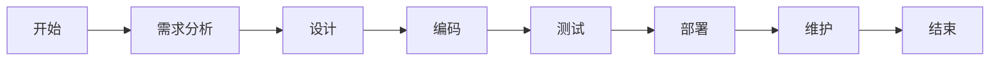
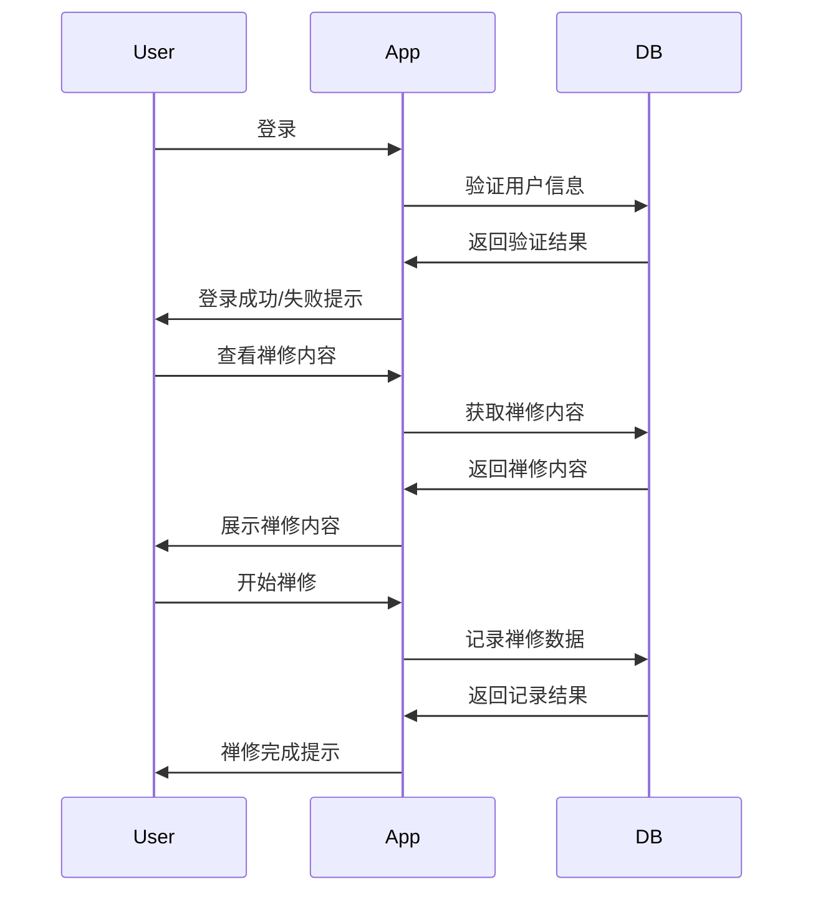

                 

# 新禅修app开发团队：打造在都市中寻找内心平静的数字工具

> 关键词：禅修app、开发、用户界面设计、算法原理、系统架构、核心概念

> 摘要：本文将深入探讨新禅修app开发团队如何打造一款在都市中帮助人们寻找内心平静的数字工具。通过详细分析背景、核心概念、算法原理以及系统架构设计，本文将为读者提供一份全面的技术指南，旨在帮助开发团队打造出用户体验卓越、功能强大的禅修应用。

## 第一部分：背景介绍

### 问题背景

在当今快节奏的都市生活中，人们面临着巨大的工作压力、生活压力以及信息过载。这种环境导致许多人出现焦虑、失眠、抑郁等心理问题。为了缓解这些压力，人们开始寻求各种方法来放松身心，恢复内心的平静。其中，禅修作为一种传统的冥想练习，逐渐被现代人接受并应用于日常生活中。禅修可以帮助人们提高注意力、增强情绪调节能力，从而在繁忙的都市生活中找到内心的宁静。

### 问题描述

禅修app开发团队的任务是打造一款能够在都市中帮助人们寻找内心平静的数字工具。这款app需要具备以下特点：

1. **丰富的禅修内容**：提供多种禅修方式，包括冥想、呼吸练习、正念训练等。
2. **个性化的用户体验**：根据用户的习惯和需求，提供个性化的禅修指导和推荐。
3. **良好的用户界面设计**：界面简洁、易于操作，为用户提供愉悦的使用体验。
4. **稳定的功能实现**：确保app在各种网络环境下都能正常运行，不会影响用户的禅修体验。

### 问题解决

通过开发一款创新的禅修app，用户可以在日常生活中随时随地通过app进行禅修，实现身心放松。禅修app将成为都市人缓解压力、恢复内心平静的得力助手。

### 边界与外延

禅修app开发的边界在于技术的可行性和用户体验的优化。这意味着开发团队需要不断探索新的技术和方法，以提升app的性能和用户满意度。同时，外延则包括扩展到其他心理疏导工具的整合，以及未来可能的功能扩展，如在线课程、社交互动等。

### 概念结构与核心要素组成

- **禅修app**：提供禅修内容、指导和反馈的平台。
- **用户**：使用禅修app进行禅修的个人。
- **开发团队**：负责禅修app的设计、开发和维护的团队。

## 第二部分：核心概念与联系

### 核心概念

- **禅修**：通过冥想、呼吸等方式，达到放松身心，提高注意力和专注力的过程。
- **app开发**：应用软件的开发过程，包括需求分析、设计、编码、测试和部署等环节。
- **用户界面设计**：设计app的视觉效果和用户体验。

### 概念属性特征对比表格

| 特征         | 禅修                | app开发                   | 用户界面设计                |
| ------------ | ------------------- | ------------------------- | --------------------------- |
| 目的         | 放松身心，提高专注力 | 解决特定问题，提高用户体验 | 提高用户体验，提升视觉效果 |
| 技术要求     | 冥想技巧            | 编程语言和框架            | 设计美学和交互逻辑          |
| 需求分析     | 用户需求            | 功能需求                  | 用户体验需求                |

### ER实体关系图架构

```mermaid
erDiagram
  User ||--|{ App }|
  App ||--|{ Feature }|
  Feature ||--|{ MeditationSession }|
```

## 第三部分：算法原理讲解

### 算法Mermaid流程图



### 算法原理的数学模型和公式

禅修app的核心算法基于用户的反馈和行为模式进行分析，使用以下数学模型进行个性化推荐：

$$
R = f(N, P, S)
$$

其中：

- \( R \)：推荐内容的质量评分。
- \( N \)：用户的历史行为数据。
- \( P \)：内容的主题和标签。
- \( S \)：系统的反馈机制。

### 详细讲解和举例说明

假设用户A在过去一周内频繁使用禅修app进行深呼吸练习，同时偏好安静的环境。根据上述模型，系统会推荐以下内容：

- **深呼吸课程**：评分 \( R = 0.8 \)
- **安静环境背景音**：评分 \( R = 0.75 \)
- **正念冥想**：评分 \( R = 0.7 \)

系统会根据用户的反馈进一步调整推荐算法，以提高推荐内容的准确性。

## 第四部分：系统分析与架构设计方案

### 问题场景介绍

禅修app开发团队需要在有限时间内打造一个高效、易用的禅修app，以满足都市用户的需求。在这个过程中，开发团队需要充分考虑系统架构的合理性、功能设计的完整性以及用户体验的优化。

### 项目介绍

- **禅修app**：一款为都市用户提供禅修内容和指导的移动应用。
- **开发团队**：由UI/UX设计师、后端开发工程师和前端开发工程师组成。

### 系统功能设计

- **用户注册与登录**：支持用户创建账户和登录。
- **内容浏览与搜索**：提供丰富的禅修内容和搜索功能。
- **禅修练习**：支持多种禅修方式，包括冥想、呼吸练习等。
- **反馈与建议**：用户可以提交反馈和建议。

### 系统架构设计

- **前端**：使用React框架，提供用户界面和交互。
- **后端**：使用Node.js和Express框架，处理业务逻辑和数据库交互。
- **数据库**：使用MongoDB存储用户数据和内容数据。

### 系统接口设计

- **用户接口**：API接口，提供用户数据和内容数据的管理。
- **内容接口**：API接口，提供禅修内容的获取和管理。

### 系统交互Mermaid序列图



## 第五部分：项目实战

### 环境安装

1. **安装Node.js和npm**：从官方网站下载并安装Node.js，然后通过npm安装依赖包。
2. **安装MongoDB**：下载并安装MongoDB，启动MongoDB服务。

### 系统核心实现源代码

```python
# 1. 安装依赖包
pip install Flask
pip install Flask-PyMongo

# 2. 创建应用
from flask import Flask, request, jsonify
from flask_pymongo import PyMongo

app = Flask(__name__)

# 3. 配置MongoDB
app.config["MONGO_URI"] = "mongodb://localhost:27017/myDatabase"
mongo = PyMongo(app)

# 4. 用户注册
@app.route("/register", methods=["POST"])
def register():
    user_data = request.get_json()
    user_id = mongo.db.users.insert_one(user_data).inserted_id
    return jsonify({"status": "success", "user_id": str(user_id)})

# 5. 用户登录
@app.route("/login", methods=["POST"])
def login():
    user_data = request.get_json()
    user = mongo.db.users.find_one({"username": user_data["username"], "password": user_data["password"]})
    if user:
        return jsonify({"status": "success", "user_id": str(user["_id"])})
    else:
        return jsonify({"status": "failure", "message": "Invalid username or password"})

# 6. 获取禅修内容
@app.route("/meditation", methods=["GET"])
def get_meditation():
    meditation_data = mongo.db.meditations.find()
    return jsonify({"status": "success", "meditations": list(meditation_data)})

# 7. 开始禅修
@app.route("/meditate", methods=["POST"])
def meditate():
    meditation_data = request.get_json()
    meditation_id = mongo.db.meditations.insert_one(meditation_data).inserted_id
    return jsonify({"status": "success", "meditation_id": str(meditation_id)})

if __name__ == "__main__":
    app.run(debug=True)
```

### 代码应用解读与分析

上述代码是一个简单的 Flask 应用，用于处理用户注册、登录、获取禅修内容和开始禅修的操作。代码的主要部分包括：

1. **依赖包安装**：安装 Flask 和 Flask-PyMongo 库，用于 Web 开发和 MongoDB 交互。
2. **创建应用**：创建一个 Flask 应用对象。
3. **配置MongoDB**：配置 MongoDB 连接信息，以便应用可以与 MongoDB 交互。
4. **用户注册**：定义一个用户注册的 API 接口，接收用户提交的 JSON 数据，并将其存储到 MongoDB 中。
5. **用户登录**：定义一个用户登录的 API 接口，验证用户名和密码，返回用户 ID。
6. **获取禅修内容**：定义一个获取禅修内容的 API 接口，从 MongoDB 中查询禅修内容。
7. **开始禅修**：定义一个开始禅修的 API 接口，接收用户提交的禅修数据，并将其存储到 MongoDB 中。

### 实际案例分析和详细讲解剖析

假设有一个用户名为 "john" 的用户，他在禅修app上注册并登录后，希望获取禅修内容并开始禅修。

1. **用户注册**：
    - 用户通过 POST 请求访问 `/register` 接口，提交用户名 "john" 和密码 "password123"。
    - 应用将用户数据存储到 MongoDB 的 `users` 集合中，并返回用户 ID。

2. **用户登录**：
    - 用户通过 POST 请求访问 `/login` 接口，提交用户名 "john" 和密码 "password123"。
    - 应用从 MongoDB 的 `users` 集合中查询用户数据，验证用户名和密码是否匹配。如果匹配，返回用户 ID。

3. **获取禅修内容**：
    - 用户通过 GET 请求访问 `/meditation` 接口，获取所有禅修内容。
    - 应用从 MongoDB 的 `meditations` 集合中查询禅修内容，并返回给用户。

4. **开始禅修**：
    - 用户选择一个禅修内容，通过 POST 请求访问 `/meditate` 接口，提交禅修数据，如禅修名称、时长、环境等。
    - 应用将禅修数据存储到 MongoDB 的 `meditations` 集合中，并返回禅修 ID。

通过上述步骤，用户可以成功注册、登录、获取禅修内容并开始禅修。禅修数据将被存储在 MongoDB 中，以便后续分析和推荐。

### 项目小结

本文通过详细分析禅修app开发团队如何打造一款在都市中帮助人们寻找内心平静的数字工具，从背景介绍、核心概念与联系、算法原理讲解、系统分析与架构设计方案到项目实战，全面阐述了禅修app的开发过程。通过实际案例分析和详细讲解，读者可以更好地理解禅修app的开发原理和应用实践。未来，禅修app还可以通过不断优化和扩展功能，为用户提供更高质量的心理疏导服务。

## 最佳实践 tips

1. **用户体验优先**：在设计禅修app时，始终将用户体验放在首位，确保界面简洁、操作便捷。
2. **持续优化算法**：根据用户反馈和行为数据，不断调整推荐算法，提高推荐内容的准确性。
3. **保障数据安全**：加强用户数据保护，确保用户隐私和安全。
4. **关注技术趋势**：关注行业技术动态，及时引入新技术，提升禅修app的性能和功能。

## 小结

本文系统地介绍了新禅修app开发团队如何打造一款在都市中帮助人们寻找内心平静的数字工具。通过深入分析背景、核心概念、算法原理以及系统架构设计，本文为读者提供了一份全面的技术指南。在项目实战部分，本文通过具体代码示例和案例分析，展示了禅修app的开发过程。未来，禅修app有望通过不断优化和扩展功能，为用户提供更高质量的心理疏导服务。

## 注意事项

1. **用户隐私保护**：在开发过程中，确保严格遵循用户隐私保护法规，保护用户个人信息安全。
2. **代码质量**：编写高质量、可维护的代码，提高开发效率和项目稳定性。
3. **性能优化**：关注系统性能，优化数据库查询和缓存策略，提升用户访问速度。

## 拓展阅读

- 《深度学习与人工智能导论》
- 《软件架构设计：从初级到高级》
- 《Python编程：从入门到实践》
- 《移动应用UI/UX设计指南》

作者：AI天才研究院/AI Genius Institute & 禅与计算机程序设计艺术 /Zen And The Art of Computer Programming

