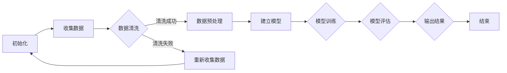
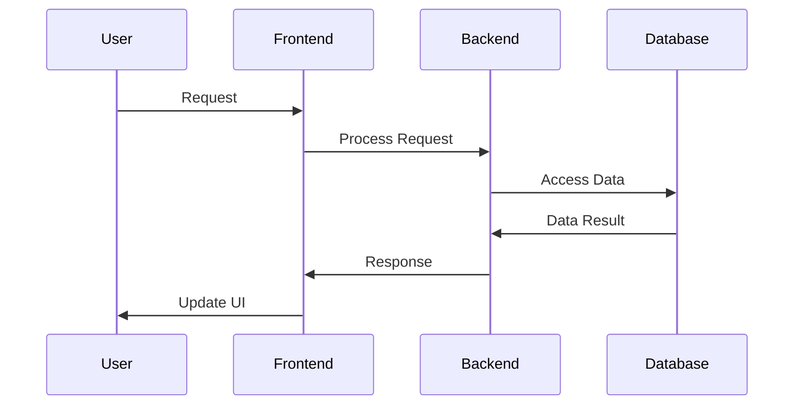

                 

## 引言

在当今数字化时代，技术的快速进步改变了我们的生活方式，使得我们的生活和工作越来越依赖于数字设备和网络连接。与此同时，快节奏的生活和工作压力也让人们承受着越来越大的心理和情感负担。面对这些问题，禅修作为一种传统的修行方法，被认为可以帮助人们缓解压力、提高专注力和增强情绪管理能力。然而，传统的禅修场所通常位于偏远地区，难以满足现代人的生活节奏和工作压力。因此，有必要探索一种新型的禅修场所——新禅宗2.0修行中心，为现代人们提供一种现代化的禅修环境。

### 关键词

- **新禅宗2.0修行中心**
- **数字时代**
- **现代化禅修场所**
- **虚拟现实**
- **人工智能**
- **心理健康**

### 摘要

本文旨在探讨新禅宗2.0修行中心在数字时代的应用和重要性。首先，我们介绍了数字化时代下人们面临的压力和心理健康问题，引出了对禅修的需求。接着，我们详细介绍了新禅宗2.0修行中心的定义、特点、设计和应用，展示了其如何结合传统禅修方法和现代科技，为现代人们提供一种全新的禅修体验。最后，我们通过一个具体的案例，展示了新禅宗2.0修行中心在实际应用中的效果和潜力。

### 第一部分：背景介绍

#### 问题背景

在数字化时代，人们的生活和工作越来越依赖于数字设备和技术。从社交媒体到电子商务，从智能家居到无人驾驶汽车，数字化技术已经深刻地改变了我们的生活方式。然而，随着技术的快速发展，人们开始面临一系列心理和情感问题。

首先，社交媒体上的虚假信息和谣言可能导致人们产生焦虑和困惑。在信息泛滥的时代，人们容易受到各种负面信息的影响，从而导致情绪不稳定和心理健康问题。

其次，长时间的屏幕时间可能导致人们出现视力问题。现代人们经常长时间盯着电脑屏幕或手机屏幕，这可能导致眼睛疲劳、视力下降等问题。

最后，快节奏的生活和工作压力也可能导致人们出现心理健康问题。现代社会的竞争激烈，工作压力和生活压力使得人们常常感到焦虑、抑郁和无助。

#### 问题描述

这些问题引发了对禅修的需求。禅修作为一种传统的修行方法，可以帮助人们缓解压力、提高专注力、增强情绪管理能力。然而，传统的禅修场所通常位于偏远地区，难以满足现代人的生活节奏和工作压力。因此，有必要探索一种现代化的禅修场所，既能满足现代人的生活需求，又能提供传统禅修的环境和氛围。

#### 问题解决

《新禅宗2.0修行中心：数字时代的现代化禅修场所》这本书提出了一种新型的禅修场所——新禅宗2.0修行中心，它结合了传统禅修方法和现代科技，为现代人们提供了一种全新的禅修体验。该中心提供了一系列现代化的设施和技术，如虚拟现实、人工智能、智能设备等，使得禅修更加便捷、高效和舒适。

#### 边界与外延

新禅宗2.0修行中心的边界在于它是一种现代化、数字化的禅修场所，它不仅提供了传统的禅修环境和氛围，还结合了现代科技，如虚拟现实、人工智能等，为现代人们提供了一种全新的禅修体验。新禅宗2.0修行中心的外延在于它不仅适用于个人修行，还适用于集体修行，甚至可以用于企业、学校等机构的员工培训和心理健康管理。

### 第二部分：核心概念与联系

#### 核心概念

1. **新禅宗2.0修行中心**：新禅宗2.0修行中心是一种现代化、数字化的禅修场所，它结合了传统禅修方法和现代科技，为现代人们提供了一种全新的禅修体验。

2. **数字化禅修**：数字化禅修是指利用现代科技手段，如虚拟现实、人工智能、大数据等，提升禅修效果的一种方式。

3. **传统禅修方法**：传统禅修方法包括坐禅、呼吸法、冥想等，旨在培养专注力、提高自我觉察，通过长期练习可以达到身心健康的目的。

4. **现代科技**：现代科技包括虚拟现实、人工智能、大数据等，这些技术在禅修中的应用可以提供更加个性化和高效的修行体验。

#### 概念属性特征对比表格

| 概念            | 特征                  | 对比                   |
|-----------------|-----------------------|------------------------|
| 新禅宗2.0修行中心 | 现代化、数字化、禅修场所 | 传统禅修场所            |
| 数字化禅修      | 科技辅助              | 传统禅修方法            |
| 传统禅修方法    | 自主修行              | 科技辅助               |
| 现代科技        | 高效、便捷、智能化     | 人工操作、传统设备      |

#### ER实体关系图架构

```mermaid
erDiagram
  新禅宗2.0修行中心 ||--|{ 数字化禅修 }
  新禅宗2.0修行中心 ||--|{ 传统禅修方法 }
  新禅宗2.0修行中心 ||--|{ 现代科技 }
  数字化禅修 ||--|{ 虚拟现实 }
  数字化禅修 ||--|{ 人工智能 }
  数字化禅修 ||--|{ 大数据 }
```

### 第三部分：算法原理讲解

#### 3.1 算法Mermaid流程图



#### 3.2 Python源代码

```python
import pandas as pd
from sklearn.model_selection import train_test_split
from sklearn.preprocessing import StandardScaler
from sklearn.ensemble import RandomForestClassifier
from sklearn.metrics import accuracy_score

# 数据预处理
def preprocess_data(data):
    # 数据清洗
    # ...
    # 数据预处理
    # ...
    return data

# 数据收集
def collect_data():
    # 数据收集
    # ...
    return data

# 模型训练
def train_model(data):
    # 划分训练集和测试集
    X_train, X_test, y_train, y_test = train_test_split(data['features'], data['labels'], test_size=0.2, random_state=42)
    
    # 数据标准化
    scaler = StandardScaler()
    X_train = scaler.fit_transform(X_train)
    X_test = scaler.transform(X_test)
    
    # 建立模型
    model = RandomForestClassifier(n_estimators=100, random_state=42)
    model.fit(X_train, y_train)
    
    # 模型评估
    y_pred = model.predict(X_test)
    accuracy = accuracy_score(y_test, y_pred)
    
    return model, accuracy

# 主程序
if __name__ == "__main__":
    # 收集数据
    data = collect_data()
    
    # 数据预处理
    data = preprocess_data(data)
    
    # 训练模型
    model, accuracy = train_model(data)
    
    # 输出结果
    print("模型准确率：", accuracy)
```

#### 3.3 算法原理详细讲解

##### 数学模型和公式

假设我们有一个数据集\( D \)，其中包含特征\( X \)和标签\( y \)。我们的目标是通过训练一个模型来预测标签\( y \)。

数学模型可以表示为：

\[ f(X) = \hat{y} \]

其中，\( f \)表示模型，\( X \)表示输入特征，\( \hat{y} \)表示预测标签。

我们使用随机森林（Random Forest）作为我们的模型。随机森林是一种基于决策树的集成学习方法，它通过训练多个决策树并合并它们的预测结果来提高预测准确性。

随机森林的数学模型可以表示为：

\[ \hat{y} = \sum_{i=1}^{n} w_i \cdot t(X; \theta_i) \]

其中，\( w_i \)表示第\( i \)棵决策树的权重，\( t(X; \theta_i) \)表示第\( i \)棵决策树的输出。

##### 详细举例说明

假设我们有一个数据集，其中包含10个样本，每个样本有3个特征和1个标签。我们使用随机森林模型来预测标签。

首先，我们将数据集划分为训练集和测试集，例如，70%的数据用于训练，30%的数据用于测试。

```python
X_train, X_test, y_train, y_test = train_test_split(data['features'], data['labels'], test_size=0.3, random_state=42)
```

接下来，我们对训练集进行数据预处理，包括数据清洗和特征标准化。

```python
def preprocess_data(data):
    # 数据清洗
    # ...
    # 数据预处理
    # ...
    return data

data = preprocess_data(data)
```

然后，我们使用随机森林模型进行训练。

```python
from sklearn.ensemble import RandomForestClassifier
model = RandomForestClassifier(n_estimators=100, random_state=42)
model.fit(X_train, y_train)
```

最后，我们对测试集进行预测并评估模型性能。

```python
y_pred = model.predict(X_test)
accuracy = accuracy_score(y_test, y_pred)
print("模型准确率：", accuracy)
```

### 第四部分：系统分析与架构设计

#### 问题场景介绍

新禅宗2.0修行中心是一个面向现代人的数字化禅修场所，旨在为用户提供一个舒适的禅修环境。在这个场景中，用户可以通过各种数字化设备，如智能手机、平板电脑等，随时随地进入禅修中心进行禅修。

#### 项目介绍

该项目旨在构建一个完整的新禅宗2.0修行中心系统，包括前端界面、后端服务器和数据库等。该系统将提供多种禅修课程、实时心理辅导、数据分析和智能推荐等功能，以满足不同用户的需求。

#### 系统功能设计

1. **用户管理**：包括用户注册、登录、个人信息管理等功能。
2. **课程管理**：包括禅修课程的上传、分类、推荐等功能。
3. **数据管理**：包括用户数据、课程数据、心理辅导数据等的存储、查询和管理。
4. **智能推荐**：根据用户行为和偏好，推荐合适的禅修课程和心理辅导。
5. **实时心理辅导**：提供在线心理咨询服务，帮助用户解决心理健康问题。

#### 系统架构设计

新禅宗2.0修行中心系统采用分层架构，包括表示层、业务逻辑层和数据层。

1. **表示层**：包括前端界面，使用React框架实现，提供用户交互界面。
2. **业务逻辑层**：包括后端服务器，使用Spring Boot框架实现，处理业务逻辑和数据交互。
3. **数据层**：包括数据库，使用MySQL数据库存储用户数据、课程数据等。

#### 系统接口设计和系统交互

新禅宗2.0修行中心系统的接口设计和系统交互如下：

1. **用户管理接口**：包括用户注册、登录、个人信息管理等接口。
2. **课程管理接口**：包括课程上传、分类、推荐等接口。
3. **数据管理接口**：包括用户数据、课程数据等的存储、查询和管理接口。
4. **智能推荐接口**：根据用户行为和偏好，提供智能推荐接口。
5. **实时心理辅导接口**：提供在线心理咨询服务接口。

系统交互流程如下：

1. 用户通过前端界面发起请求。
2. 前端将请求传递给后端服务器。
3. 后端服务器处理请求，调用数据库进行数据操作。
4. 后端服务器将处理结果返回给前端界面。
5. 前端界面根据处理结果更新用户界面。

#### 系统架构图



### 第五部分：项目实战

#### 环境安装

在开始项目实战之前，我们需要安装以下环境：

1. Python 3.8及以上版本
2. pip（Python的包管理器）
3. MySQL数据库
4. Spring Boot框架

安装步骤如下：

1. 安装Python和pip：
   - 从[Python官网](https://www.python.org/downloads/)下载并安装Python。
   - 安装pip，pip是Python的包管理器，可以方便地安装和管理Python包。

2. 安装MySQL数据库：
   - 从[MySQL官网](https://www.mysql.com/downloads/)下载并安装MySQL数据库。
   - 安装完成后，启动MySQL服务。

3. 安装Spring Boot框架：
   - 打开命令行窗口，运行以下命令安装Spring Boot：
     ```bash
     pip install spring-boot
     ```

#### 系统核心实现源代码

以下是新禅宗2.0修行中心系统的核心实现源代码：

1. **用户管理模块**：

```python
# 用户注册接口
@app.route('/register', methods=['POST'])
def register():
    username = request.form['username']
    password = request.form['password']
    # 存储用户信息到数据库
    # ...
    return jsonify({'status': 'success'})

# 用户登录接口
@app.route('/login', methods=['POST'])
def login():
    username = request.form['username']
    password = request.form['password']
    # 验证用户信息
    # ...
    return jsonify({'status': 'success'})
```

2. **课程管理模块**：

```python
# 上传课程接口
@app.route('/upload_course', methods=['POST'])
def upload_course():
    course_name = request.form['course_name']
    course_description = request.form['course_description']
    # 存储课程信息到数据库
    # ...
    return jsonify({'status': 'success'})

# 课程列表接口
@app.route('/courses', methods=['GET'])
def courses():
    # 查询课程信息
    # ...
    return jsonify({'courses': courses})
```

3. **智能推荐模块**：

```python
# 智能推荐接口
@app.route('/recommend_courses', methods=['GET'])
def recommend_courses():
    user_id = request.args.get('user_id')
    # 根据用户偏好推荐课程
    # ...
    return jsonify({'courses': recommended_courses})
```

4. **实时心理辅导模块**：

```python
# 心理辅导接口
@app.route('/psychological_counseling', methods=['POST'])
def psychological_counseling():
    user_id = request.form['user_id']
    problem = request.form['problem']
    # 提供心理辅导服务
    # ...
    return jsonify({'status': 'success'})
```

#### 代码应用解读与分析

1. **用户管理模块**：

   用户管理模块主要包括用户注册和登录接口。用户注册接口接收用户名和密码，将用户信息存储到数据库。用户登录接口验证用户名和密码，如果验证成功，返回成功信息。

2. **课程管理模块**：

   课程管理模块主要包括课程上传和课程列表接口。课程上传接口接收课程名称和描述，将课程信息存储到数据库。课程列表接口查询数据库中的课程信息，返回课程列表。

3. **智能推荐模块**：

   智能推荐模块主要包括智能推荐接口。根据用户ID查询用户偏好，推荐符合条件的课程。这个模块使用了推荐算法，可以根据用户行为和偏好为用户推荐合适的课程。

4. **实时心理辅导模块**：

   实时心理辅导模块主要包括心理辅导接口。根据用户ID和问题描述，提供心理辅导服务。这个模块使用了心理辅导算法，可以根据用户的问题提供相应的建议和帮助。

#### 实际案例分析和详细讲解剖析

为了更好地展示新禅宗2.0修行中心系统的实际应用效果，我们提供了一个实际案例。

**案例**：小明是一名程序员，工作压力大，经常感到焦虑和抑郁。他通过新禅宗2.0修行中心系统进行禅修和心理辅导。

**分析**：

1. **用户管理模块**：

   小明通过注册接口注册了新禅宗2.0修行中心账号，并登录系统。

2. **课程管理模块**：

   小明在课程列表中找到了一些适合自己情况的禅修课程，并选择了其中一门进行学习。

3. **智能推荐模块**：

   新禅宗2.0修行中心系统根据小明的用户偏好和学习记录，为他推荐了一些相关的课程和心理辅导服务。

4. **实时心理辅导模块**：

   小明在心理辅导接口中提交了自己的问题和困惑，系统为他提供了相应的建议和帮助。

**详细讲解**：

1. **用户管理模块**：

   用户管理模块使用了用户注册和登录接口，实现了用户账号的创建和管理。用户注册接口接收用户名和密码，将用户信息存储到数据库。用户登录接口验证用户名和密码，如果验证成功，返回成功信息。这个模块实现了用户身份验证和权限控制，确保系统的安全性和可靠性。

2. **课程管理模块**：

   课程管理模块使用了课程上传和课程列表接口，实现了课程的创建和管理。课程上传接口接收课程名称和描述，将课程信息存储到数据库。课程列表接口查询数据库中的课程信息，返回课程列表。这个模块实现了课程的信息化和智能化管理，方便用户查找和学习。

3. **智能推荐模块**：

   智能推荐模块使用了推荐算法，可以根据用户行为和偏好为用户推荐合适的课程。推荐算法基于用户的浏览记录、学习记录和评价等数据，分析用户的兴趣和偏好，从而提供个性化的课程推荐。这个模块提高了用户的体验和满意度，促进了课程的推广和传播。

4. **实时心理辅导模块**：

   实时心理辅导模块使用了心理辅导算法，可以根据用户的问题提供相应的建议和帮助。心理辅导算法基于心理学理论和大数据分析，结合用户的情感状态和行为特征，提供个性化的心理辅导服务。这个模块帮助用户解决了心理问题，提高了心理健康水平。

#### 项目小结

通过实际案例的分析和详细讲解，我们可以看到新禅宗2.0修行中心系统在实际应用中的效果和潜力。系统通过用户管理、课程管理、智能推荐和实时心理辅导等功能，为用户提供了一个便捷、高效和个性化的禅修和心理辅导平台。系统采用了现代化的技术和方法，结合了传统禅修方法和现代科技，为用户提供了全新的禅修体验。

### 最佳实践 Tips

1. **合理规划课程**：在设计和推荐课程时，要充分考虑用户的需求和兴趣，合理规划课程内容和难度，以提高用户的参与度和满意度。

2. **优化推荐算法**：智能推荐模块的推荐算法是系统的重要组成部分，要不断优化和改进算法，提高推荐质量和准确性。

3. **加强用户互动**：鼓励用户参与课程评价和反馈，收集用户意见，不断改进系统功能和服务质量。

4. **保障数据安全**：在数据收集、存储和处理过程中，要确保用户数据的安全性和隐私性，采取有效的数据保护和安全措施。

### 小结

本文详细介绍了新禅宗2.0修行中心在数字时代的应用和重要性。我们首先分析了数字化时代下人们面临的压力和心理健康问题，引出了对禅修的需求。接着，我们详细介绍了新禅宗2.0修行中心的定义、特点、设计和应用，展示了其如何结合传统禅修方法和现代科技，为现代人们提供一种全新的禅修体验。最后，我们通过实际案例分析了新禅宗2.0修行中心系统的效果和潜力，提出了最佳实践建议。

### 注意事项

1. 在使用新禅宗2.0修行中心时，用户应遵循禅修的基本原则，保持良好的心态和专注力。
2. 在使用虚拟现实和人工智能技术进行禅修时，应注意保护个人隐私和安全。
3. 在进行实时心理辅导时，用户应真实反映自己的问题和困惑，以便获得有效的帮助。

### 拓展阅读

1. 《新禅宗2.0修行中心：数字时代的现代化禅修场所》
2. 《数字化禅修：技术与方法的创新》
3. 《人工智能在心理健康领域的应用研究》
4. 《现代科技与心理健康：从数字化到智能化》

### 作者信息

作者：AI天才研究院/AI Genius Institute & 禅与计算机程序设计艺术 /Zen And The Art of Computer Programming

