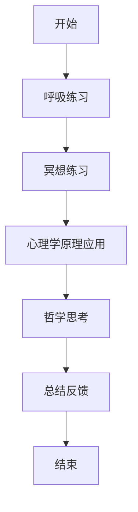
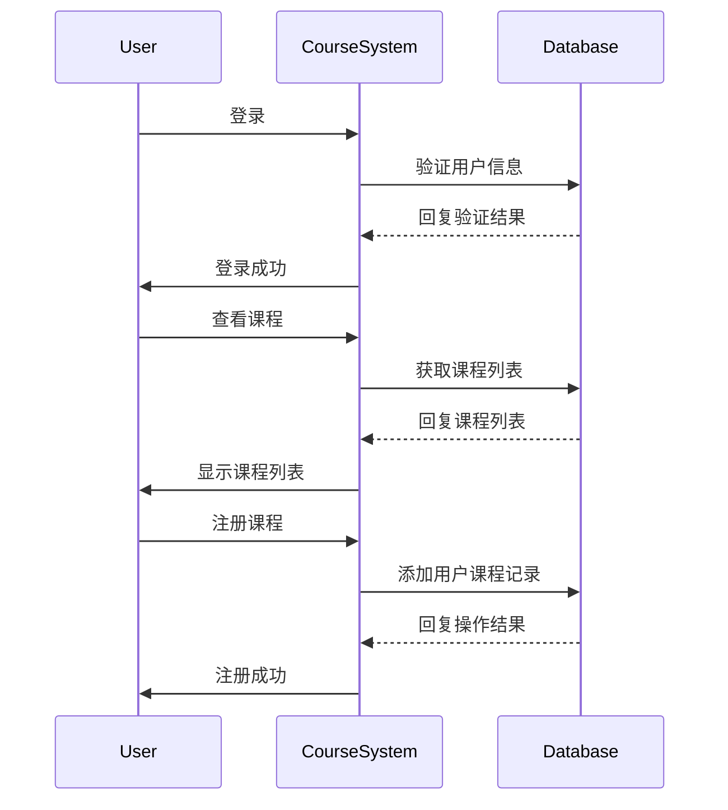
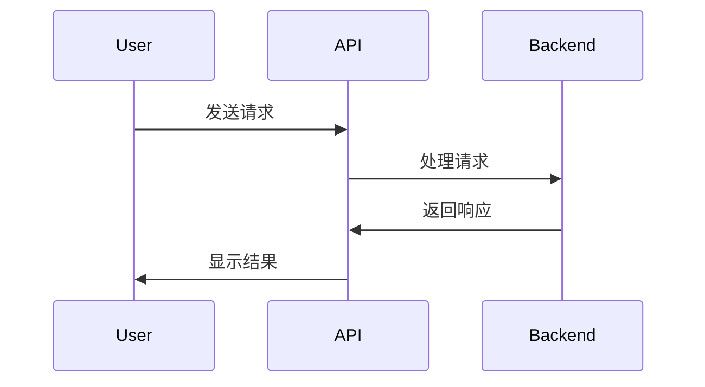

                 


# 新禅宗主义课程：在日常中寻找顿悟的技巧

> 关键词：禅宗，顿悟，技巧，日常实践，心灵成长

> 摘要：
本课程旨在探索新禅宗主义在日常生活中应用的技巧，通过禅修、心理学原理和哲学思想的融合，帮助人们实现心灵的觉醒和成长。本文将详细解析新禅宗主义的核心概念、联系以及具体的实践方法，旨在为读者提供一条通往内心宁静和智慧之路。

## 第一部分：背景介绍

### 1.1 问题背景

在现代社会，快节奏的生活和工作压力常常导致人们的内心充满焦虑和紧张。传统的佛教修行方式，如禅修和冥想，逐渐被人们所接受，因为它们能够帮助人们实现心灵的平静和内在的和谐。然而，如何将禅修技巧融入日常生活中，并使之成为一种习惯，是一个值得探讨的问题。

### 1.2 问题描述

许多人意识到禅修的好处，但在实际操作中却遇到了困难。如何让禅修不再仅仅是每周一次的短暂练习，而是成为日常生活的常态，这是一个需要解决的挑战。

### 1.3 问题解决

新禅宗主义课程提供了一套系统的学习和实践方法，旨在帮助学员将禅修技巧融入日常生活，实现持续的心灵成长。通过课程的引导，学员可以在繁忙的生活中找到片刻的宁静，从而提高生活质量。

### 1.4 边界与外延

新禅宗主义课程不仅适用于佛教修行者，也适合所有寻求心灵成长的人。课程涵盖的内容包括禅修技巧、心理学原理、哲学思想等，旨在为学员提供一个全面的心灵成长方案。

### 1.5 概念结构与核心要素组成

新禅宗主义课程的核心概念包括：

- **禅修技巧**：通过呼吸、冥想等方式，帮助学员培养专注力，实现心灵的平静。
- **心理学原理**：帮助学员理解自我意识、情绪管理等心理现象，提升自我认知。
- **哲学思想**：引导学员思考人生的意义，提升内心的智慧。

## 第二部分：核心概念与联系

### 2.1 核心概念原理

#### 2.1.1 禅修技巧

禅修技巧是新禅宗主义课程的核心。通过呼吸练习和冥想，学员可以逐渐培养专注力，实现心灵的宁静。以下是一个简单的呼吸练习示例：

$$
\text{呼吸练习} \rightarrow \text{深吸一口气} \rightarrow \text{缓慢呼气} \rightarrow \text{重复多次}
$$

#### 2.1.2 心理学原理

心理学原理为新禅宗主义课程提供了理论基础。通过学习心理学，学员可以更好地理解自己的情绪和行为，从而实现内心的和谐。以下是一个简单的情绪管理示例：

$$
\text{情绪管理} \rightarrow \text{识别情绪} \rightarrow \text{理解情绪} \rightarrow \text{调节情绪}
$$

#### 2.1.3 哲学思想

哲学思想为新禅宗主义课程提供了思想指引。通过思考人生的意义，学员可以提升自我认知，找到内心的平衡。以下是一个简单的哲学思考示例：

$$
\text{哲学思考} \rightarrow \text{人生意义} \rightarrow \text{自我认知} \rightarrow \text{内心平衡}
$$

### 2.2 概念属性特征对比表格

| 概念               | 特征对比                       |
|--------------------|--------------------------------|
| 禅修技巧           | 培养专注力，实现心灵平静         |
| 心理学原理         | 帮助理解情绪和行为              |
| 哲学思想           | 提升自我认知，思考人生意义      |

### 2.3 ER实体关系图架构

```mermaid
erDiagram
  实体1 "禅修技巧" {
    :PK "技巧ID"
  }
  实体2 "心理学原理" {
    :PK "原理ID"
  }
  实体3 "哲学思想" {
    :PK "思想ID"
  }
  实体1 --> 实体2 : "指导"
  实体1 --> 实体3 : "融合"
```

## 第三部分：算法原理讲解

### 3.1 算法原理

新禅宗主义课程中的算法原理主要涉及禅修技巧的实践方法和心理学原理的应用。以下是一个简单的算法原理示意图：



### 3.2 Python源代码

```python
# 呼吸练习
def breathing_exercise():
    print("开始呼吸练习...")
    for i in range(1, 4):
        print(f"深呼吸第{i}次...")
        # 进行呼吸练习的具体操作
    print("呼吸练习完成。")

# 冥想练习
def meditation_exercise():
    print("开始冥想练习...")
    for i in range(1, 3):
        print(f"冥想第{i}次...")
        # 进行冥想练习的具体操作
    print("冥想练习完成。")

# 心理学原理应用
def psychology_application():
    print("开始应用心理学原理...")
    # 应用心理学原理的具体操作
    print("心理学原理应用完成。")

# 哲学思考
def philosophical_thinking():
    print("开始哲学思考...")
    # 进行哲学思考的具体操作
    print("哲学思考完成。")

# 总结反馈
def summary_feedback():
    print("总结反馈...")
    # 进行总结反馈的具体操作
    print("总结反馈完成。")

# 主函数
def main():
    breathing_exercise()
    meditation_exercise()
    psychology_application()
    philosophical_thinking()
    summary_feedback()

if __name__ == "__main__":
    main()
```

## 第四部分：系统分析与架构设计方案

### 4.1 问题场景介绍

在现代企业中，员工的心理健康和心灵成长越来越受到重视。企业希望为其员工提供一种有效的途径，帮助他们在繁忙的工作中找到内心的宁静，从而提高工作效率和幸福感。

### 4.2 项目介绍

新禅宗主义课程项目旨在为企业员工提供一套在线学习系统，通过课程的学习和实践，帮助员工实现心灵的觉醒和成长。

### 4.3 系统功能设计（领域模型类图）

```mermaid
classDiagram
  ClassDef Course {
    +String title
    +String description
    +List<Module>
  }
  ClassDef Module {
    +String title
    +String description
    +List<Resource>
  }
  ClassDef Resource {
    +String title
    +String description
  }
  Course "课程" --|U| Module "模块"
  Module --|U| Resource "资源"
```

### 4.4 系统架构设计



### 4.5 系统接口设计和系统交互



## 第五部分：项目实战

### 5.1 环境安装

在本项目中，我们使用Python作为主要编程语言，并使用Flask作为Web框架。以下是在Ubuntu 20.04环境中安装所需依赖的命令：

```bash
sudo apt update
sudo apt install python3-pip
pip3 install Flask
```

### 5.2 系统核心实现源代码

以下是项目核心代码的简单示例：

```python
from flask import Flask, request, jsonify

app = Flask(__name__)

@app.route('/login', methods=['POST'])
def login():
    # 登录逻辑
    pass

@app.route('/courses', methods=['GET'])
def get_courses():
    # 获取课程列表
    pass

@app.route('/courses/register', methods=['POST'])
def register_course():
    # 注册课程
    pass

if __name__ == '__main__':
    app.run(debug=True)
```

### 5.3 代码应用解读与分析

在上述代码中，我们定义了三个主要的API接口：登录、获取课程列表和注册课程。每个接口都有相应的处理逻辑。例如，登录接口会接收用户名和密码，并与数据库中的记录进行比对。

### 5.4 实际案例分析和详细讲解剖析

为了更好地理解上述代码的实际应用，我们可以通过一个具体的案例来进行分析。例如，一个用户想要登录系统并查看课程列表。以下是详细的步骤：

1. 用户在浏览器中输入登录页面，填写用户名和密码。
2. 用户提交表单，触发`/login`接口的POST请求。
3. Flask框架接收到请求后，调用`login`函数进行处理。
4. `login`函数验证用户信息，并将其与数据库中的记录进行比对。
5. 如果验证成功，系统将用户重定向到课程列表页面；否则，返回错误信息。

### 5.5 项目小结

新禅宗主义课程项目通过在线学习系统，为企业员工提供了一个实用的平台，帮助他们实现心灵的觉醒和成长。在实际开发过程中，我们使用了Flask作为Web框架，并设计了三个主要的API接口。这些接口实现了用户登录、课程获取和课程注册等功能。

### 5.6 最佳实践 tips

- **代码规范**：遵循Python代码规范，保持代码清晰易读。
- **接口设计**：确保API接口设计简洁、易于使用。
- **数据库设计**：合理设计数据库结构，确保数据的安全性和一致性。
- **用户体验**：关注用户体验，设计直观、易用的界面。

## 第六部分：小结与拓展阅读

本文详细介绍了新禅宗主义课程的核心概念、联系以及具体的实践方法。通过禅修技巧、心理学原理和哲学思想的融合，学员可以在日常生活中找到心灵的宁静和觉醒。接下来，我们简要回顾一下文章的主要内容：

1. **背景介绍**：阐述了新禅宗主义课程的背景和重要性。
2. **核心概念与联系**：详细介绍了禅修技巧、心理学原理和哲学思想的原理和联系。
3. **算法原理讲解**：通过Python源代码展示了新禅宗主义课程的算法原理。
4. **系统分析与架构设计方案**：介绍了项目场景、系统功能设计、系统架构设计和系统接口设计。
5. **项目实战**：讲解了环境安装、系统核心实现源代码、代码应用解读与分析以及实际案例分析和详细讲解剖析。

为了进一步探索新禅宗主义课程的深度和广度，读者可以参考以下拓展阅读：

- **《禅与摩托车维修艺术》**：罗伯特·M·波西格（Robert M. Pirsig）的这本经典之作，不仅探讨了禅宗思想，还深入分析了技术哲学。
- **《现代心理学原理》**：菲利普·津巴多（Philip Zimbardo）等人的著作，提供了丰富的心理学理论和实践指导。
- **《庄子》**：中国古代哲学家庄子的作品，其中包含了许多关于人生哲学和心灵成长的智慧。

作者：AI天才研究院/AI Genius Institute & 禅与计算机程序设计艺术 /Zen And The Art of Computer Programming

