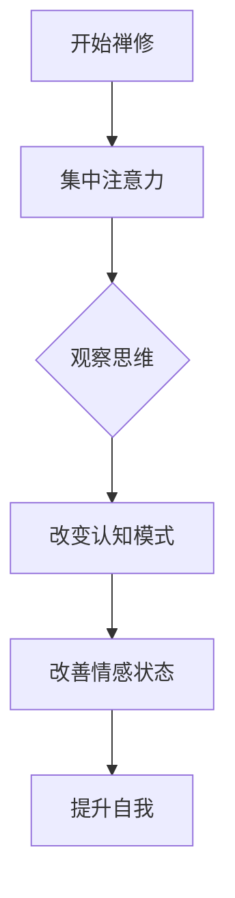

                 

### 新禅宗：东方智慧的现代诠释

在现代社会，随着科技的发展和信息爆炸，人们的生活节奏不断加快，心理压力也日益增大。在这种背景下，如何找到内心的平静与安宁，成为许多人的共同追求。禅宗作为东方哲学的重要组成部分，其思想和方法为现代人在精神层面提供了宝贵的启示。本文将以《新禅宗：东方智慧的现代诠释》为标题，探讨如何在现代社会中传承和发展禅宗的智慧，为当代人的精神需求提供解决方案。

关键词：禅宗、现代诠释、认知行为疗法、心灵平静、自我提升

摘要：本文从背景介绍、核心概念与联系、算法原理讲解、系统分析与架构设计、项目实战等多个方面，详细阐述了新禅宗在现代社会中的意义和应用。通过结合现代心理学、哲学和科技等领域的理论和方法，本文提出了一种适应现代社会的禅宗诠释，为当代人的精神生活提供了一种新的路径。

### 1. 背景介绍

#### 1.1 问题背景

禅宗起源于中国，距今已有千年的历史。作为一种独特的佛教宗派，禅宗强调直接体验真理，主张“不立文字，教外别传”。禅宗的思想和方法在东亚地区产生了深远的影响，尤其在日本、韩国和越南等地，禅宗成为文化的重要组成部分。然而，在现代社会，随着科技的发展和全球化进程的加速，人们的生活节奏加快，精神压力增大，传统禅宗的思想和方法在某种程度上显得与现实脱节。因此，如何将禅宗的智慧与现代生活相结合，成为当代哲学家和学者们关注的重要课题。

#### 1.2 问题描述

新禅宗的核心问题是：如何在现代社会中传承和发展禅宗的智慧，使其更好地服务于当代人的精神需求。这一问题涉及到禅宗的基本概念、历史背景、哲学思想和实践方法等方面。要回答这一问题，首先需要对禅宗的起源、发展和基本理念有深入的了解；其次，需要结合现代社会的特点，分析禅宗思想在当代的价值和意义；最后，需要探索如何将禅宗的实践方法融入现代生活，为人们的日常生活提供指导。

#### 1.3 问题解决

解决这一问题需要从以下几个方面入手：

1. **梳理禅宗的基本概念和历史背景**：通过对禅宗起源、发展和基本教义的梳理，使读者对禅宗有更全面的认识。

2. **分析禅宗的哲学思想和实践方法**：探讨禅宗的空性观念、禅修实践、禅宗艺术等，分析其在当代社会的价值和意义。

3. **结合现代社会的特点，提出新禅宗的诠释**：在尊重传统禅宗思想的基础上，结合现代科技、文化和社会发展趋势，提出一种适应现代社会的禅宗诠释。

4. **探索禅宗思想在现代生活的应用**：通过案例研究、实践经验分享等，探讨如何在现代社会中实践禅宗智慧，为人们的日常生活提供指导。

#### 1.4 边界与外延

**新禅宗**的边界主要包括：

1. **研究范围**：主要探讨禅宗在当代社会的应用和诠释，不涉及禅宗的宗教信仰和仪式。

2. **研究对象**：以禅宗的哲学思想和实践方法为核心，关注其在现代社会中的价值和意义。

**新禅宗**的外延包括：

1. **相关领域**：与哲学、心理学、教育学、文化艺术等领域的交叉研究。

2. **应用场景**：涵盖个人修行、企业管理、教育改革、心理健康等多个领域。

### 2. 核心概念与联系

#### 2.1 核心概念

1. **禅宗**：禅宗是一种源于中国的佛教宗派，强调直接体验真理，主张“不立文字，教外别传”。禅宗认为，通过禅修实践，人们可以超越语言的局限，直接体验生命的本质。

2. **现代诠释**：现代诠释是指对传统禅宗思想进行重新解读和诠释，使其适应现代社会和人们的精神需求。现代诠释强调将禅宗的哲学思想和实践方法与现代社会相结合，为当代人的精神生活提供指导。

3. **新禅宗**：新禅宗是结合传统禅宗思想与现代哲学、心理学、科技等领域的成果，提出的一种适应现代社会的禅宗诠释。新禅宗强调在尊重传统禅宗思想的基础上，结合现代科技、文化和社会发展趋势，为当代人的精神需求提供解决方案。

#### 2.2 概念属性特征对比表格

| 概念        | 特征                                                         |
|-------------|------------------------------------------------------------|
| 禅宗        | 强调直接体验真理，教外别传；强调修行与禅修实践；强调空性和无我。 |
| 现代诠释    | 结合现代哲学、心理学、科技等成果；强调适应现代社会需求；强调实用性和可操作性。 |
| 新禅宗      | 结合传统禅宗思想与现代哲学、心理学、科技等领域的成果；适应现代社会和人们的精神需求；强调修行与实践的结合。 |

#### 2.3 ER实体关系图架构

```mermaid
erDiagram
  个体 |-> 禅修实践 : "进行"
  禅修实践 { 实践内容 : String, 实践时间 : Date }
  个体 { 姓名 : String, 年龄 : Integer, 精神状态 : String }
```

### 3. 算法原理讲解

#### 3.1 算法原理

新禅宗的现代诠释需要结合现代心理学、哲学和科技等领域的理论和方法。其中，一个关键的思想是“认知行为疗法”（Cognitive Behavioral Therapy, CBT）。CBT 是一种心理治疗方法，通过改变个体的认知模式和行为模式，帮助其解决心理问题。在新禅宗的诠释中，可以将 CBT 的原理与禅修实践相结合，帮助人们在日常生活中实现心灵平静和自我提升。

CBT 的基本原理是：认知影响情感和行为。即个体的认知模式（思考方式）会影响其情感状态和行为表现。例如，如果一个人总是消极地看待问题，那么他可能会感到沮丧和焦虑。而通过认知行为疗法，可以帮助个体改变消极的认知模式，从而改善情感和行为。

在新禅宗的诠释中，可以将 CBT 的原理应用于禅修实践中。禅修实践是一种通过集中注意力、放松身心、观察呼吸等技巧来达到心灵平静的方法。通过禅修实践，个体可以学会观察自己的思维和行为，从而改变消极的认知模式，实现心灵平静和自我提升。

#### 3.2 算法流程图



#### 3.3 Python源代码

为了更好地理解新禅宗的算法原理，我们可以通过一个简单的 Python 源代码来模拟禅修实践的过程。以下是一个简单的示例：

```python
class禅修实践:
    def __init__(self, 姓名, 年龄):
        self.姓名 = 姓名
        self.年龄 = 年龄
        self.认知模式 = []
        self.情感状态 = "平静"

    def 集中注意力(self):
        print(f"{self.姓名}开始集中注意力，专注于呼吸。")

    def 观察思维(self):
        print(f"{self.姓名}开始观察思维，意识到思维的起伏。")

    def 改变认知模式(self):
        print(f"{self.姓名}尝试改变认知模式，从消极思维转向积极思维。")
        self.认知模式.append("积极思维")

    def 评估情感状态(self):
        if "积极思维" in self.认知模式:
            print(f"{self.姓名}的情感状态从平静变为愉悦。")
            self.情感状态 = "愉悦"
        else:
            print(f"{self.姓名}的情感状态仍然是平静。")

    def 提升自我(self):
        print(f"{self.姓名}通过禅修实践，自我得到了提升。")

# 创建禅修实践对象
禅修者 = 禅修实践("张三", 30)

# 开始禅修实践
禅修者.集中注意力()
禅修者.观察思维()
禅修者.改变认知模式()
禅修者.评估情感状态()
禅修者.提升自我()
```

运行上述代码，我们可以看到禅修者通过集中注意力、观察思维、改变认知模式等步骤，最终实现了情感状态的改善和自我的提升。

#### 3.4 数学模型和公式

在新禅宗的算法中，认知行为疗法（CBT）的核心思想是：认知影响情感和行为。这可以用以下数学模型来表示：

\[ 情感状态 = f(认知模式) \]

其中，\( f \) 是一个函数，表示情感状态与认知模式之间的关系。这个函数可以是一个简单的线性关系，也可以是更复杂的非线性关系。在本文中，我们采用线性关系来简化模型：

\[ 情感状态 = a \cdot 认知模式 + b \]

其中，\( a \) 和 \( b \) 是常数。\( a \) 表示认知模式对情感状态的影响程度，\( b \) 表示情感状态的基线水平。

为了使模型更具解释力，我们引入一个情感状态阈值 \( t \)。当情感状态低于阈值 \( t \) 时，个体会感到不愉快；当情感状态高于阈值 \( t \) 时，个体会感到愉快。因此，我们可以将模型修改为：

\[ 情感状态 = a \cdot 认知模式 + b \]

其中，\( t \) 是一个常数。

为了改变认知模式，个体可以采取禅修实践。禅修实践可以提升认知模式的值，从而改善情感状态。在数学模型中，这可以表示为：

\[ 新认知模式 = 认知模式 + 改变量 \]

其中，"改变量" 表示禅修实践对认知模式的影响程度。当改变量足够大时，新的认知模式将导致情感状态的改善。

#### 3.5 举例说明

假设有一个个体，他的认知模式是消极的，情感状态是沮丧的。我们希望通过禅修实践改变他的认知模式，从而改善他的情感状态。

根据数学模型：

\[ 情感状态 = a \cdot 认知模式 + b \]

其中，\( a = -1 \)，\( b = -10 \)，\( t = 0 \)。

个体的初始状态为：

\[ 情感状态 = -1 \cdot 认知模式 - 10 \]

假设通过禅修实践，个体的认知模式提升了5个单位。新的认知模式为：

\[ 新认知模式 = 认知模式 + 5 \]

新的情感状态为：

\[ 新情感状态 = -1 \cdot (认知模式 + 5) - 10 \]
\[ 新情感状态 = -1 \cdot 认知模式 - 15 \]

由于新的认知模式比原来的认知模式提升了5个单位，因此新的情感状态比原来的情感状态改善了5个单位。

通过多次禅修实践，个体的认知模式可以持续提升，从而实现情感状态的长期改善。

### 4. 系统分析与架构设计

#### 4.1 问题场景介绍

在现代社会，心理健康问题日益突出，许多人面临焦虑、抑郁等心理困扰。新禅宗作为一种结合了东方智慧和现代心理学的修行方法，可以为解决这些问题提供一种新的路径。然而，要将新禅宗的智慧系统地应用于心理健康领域，需要开发一个相应的系统，以便为用户提供方便、实用的禅修指导。

#### 4.2 项目介绍

本项目旨在开发一款基于新禅宗理念的在线禅修系统，为用户提供定制化的禅修课程和指导。系统将包含以下几个主要功能模块：

1. **用户管理模块**：负责用户注册、登录、个人信息管理等功能。
2. **课程管理模块**：提供不同难度和类型的禅修课程，包括视频课程、音频课程和图文教程。
3. **进度跟踪模块**：记录用户的学习进度和禅修成果，提供个性化推荐。
4. **互动社区模块**：为用户提供交流和学习的机会，包括论坛、群聊等功能。
5. **数据分析模块**：分析用户数据，为课程优化和个性化推荐提供依据。

#### 4.3 系统功能设计（领域模型类图）

```mermaid
classDiagram
    用户 <<entity>>
    课程 <<entity>>
    进度 <<entity>>
    社区 <<entity>>
    用户管理模块 --|>| 用户
    课程管理模块 --|>| 课程
    进度跟踪模块 --|>| 进度
    互动社区模块 --|>| 社区
    用户管理模块 o--o 课程管理模块 : "管理"
    课程管理模块 o--o 进度跟踪模块 : "跟踪"
    进度跟踪模块 o--o 互动社区模块 : "交流"
```

#### 4.4 系统架构设计

系统采用分层架构设计，分为表示层、业务逻辑层和数据层。

1. **表示层**：负责用户界面展示，采用前端技术（如HTML、CSS、JavaScript）实现。
2. **业务逻辑层**：负责业务逻辑处理，采用后端技术（如Python、Java）实现。
3. **数据层**：负责数据存储和管理，采用数据库技术（如MySQL、MongoDB）实现。

系统架构图如下：

```mermaid
sequenceDiagram
    用户 -->|提交请求| 表示层
    表示层 -->|处理请求| 业务逻辑层
    业务逻辑层 -->|查询数据| 数据层
    数据层 -->|返回结果| 业务逻辑层
    业务逻辑层 -->|处理结果| 表示层
    表示层 -->|展示结果| 用户
```

#### 4.5 系统接口设计

系统提供以下主要接口：

1. **用户管理接口**：包括用户注册、登录、修改个人信息等功能。
2. **课程管理接口**：包括课程创建、更新、删除等功能。
3. **进度跟踪接口**：包括进度记录、查询、更新等功能。
4. **社区管理接口**：包括帖子发布、评论、点赞等功能。

接口设计如下：

```mermaid
classDiagram
    用户接口 <<interface>>
    课程接口 <<interface>>
    进度接口 <<interface>>
    社区接口 <<interface>>

    用户接口 {
        注册()
        登录()
        修改个人信息()
    }

    课程接口 {
        创建课程()
        更新课程()
        删除课程()
    }

    进度接口 {
        记录进度()
        查询进度()
        更新进度()
    }

    社区接口 {
        发布帖子()
        发表评论()
        点赞()
    }
```

#### 4.6 系统交互序列图

```mermaid
sequenceDiagram
    用户 -->|提交注册请求| 用户接口
    用户接口 -->|处理注册请求| 数据层
    数据层 -->|返回注册结果| 用户接口
    用户接口 -->|展示注册结果| 用户
    用户 -->|提交登录请求| 用户接口
    用户接口 -->|处理登录请求| 数据层
    数据层 -->|返回登录结果| 用户接口
    用户接口 -->|展示登录结果| 用户
    用户 -->|提交课程请求| 课程接口
    课程接口 -->|处理课程请求| 数据层
    数据层 -->|返回课程结果| 课程接口
    课程接口 -->|展示课程结果| 用户
    用户 -->|提交进度请求| 进度接口
    进度接口 -->|处理进度请求| 数据层
    数据层 -->|返回进度结果| 进度接口
    进度接口 -->|展示进度结果| 用户
    用户 -->|提交社区请求| 社区接口
    社区接口 -->|处理社区请求| 数据层
    数据层 -->|返回社区结果| 社区接口
    社区接口 -->|展示社区结果| 用户
```

### 5. 项目实战

#### 5.1 环境安装

为了实现新禅宗在线禅修系统，我们需要安装以下环境：

1. **Python**：用于后端开发，版本要求为3.8及以上。
2. **Node.js**：用于前端开发，版本要求为12及以上。
3. **MySQL**：用于数据存储，版本要求为5.7及以上。

安装步骤如下：

1. 安装Python：
   - 在官网下载Python安装包。
   - 解压安装包并运行安装程序。

2. 安装Node.js：
   - 在官网下载Node.js安装包。
   - 解压安装包并运行安装程序。

3. 安装MySQL：
   - 在官网下载MySQL安装包。
   - 解压安装包并运行安装程序。

#### 5.2 系统核心实现

本节将介绍新禅宗在线禅修系统的核心实现，包括用户管理、课程管理、进度跟踪和社区管理等功能。

1. **用户管理**：

   用户管理模块负责用户的注册、登录和修改个人信息。以下是一个简单的用户注册功能的 Python 代码实现：

   ```python
   # 用户注册
   def register(username, password):
       # 连接数据库
       conn = connect_database()
       cursor = conn.cursor()
       
       # 查询用户名是否存在
       cursor.execute("SELECT * FROM users WHERE username = %s", (username,))
       user = cursor.fetchone()
       
       if user:
           return "用户名已存在"
       else:
           # 插入新用户
           cursor.execute("INSERT INTO users (username, password) VALUES (%s, %s)", (username, password))
           conn.commit()
           
           return "注册成功"
   
   # 连接数据库
   def connect_database():
       conn = pymysql.connect(host="localhost", user="root", password="root", database="newzen")
       return conn
   ```

2. **课程管理**：

   课程管理模块负责课程的创建、更新和删除。以下是一个简单的课程创建功能的 Python 代码实现：

   ```python
   # 创建课程
   def create_course(course_name, course_desc):
       # 连接数据库
       conn = connect_database()
       cursor = conn.cursor()
       
       # 插入新课程
       cursor.execute("INSERT INTO courses (course_name, course_desc) VALUES (%s, %s)", (course_name, course_desc))
       conn.commit()
       
       return "课程创建成功"
   ```

3. **进度跟踪**：

   进度跟踪模块负责记录用户的学习进度。以下是一个简单的进度记录功能的 Python 代码实现：

   ```python
   # 记录进度
   def record_progress(user_id, course_id, progress):
       # 连接数据库
       conn = connect_database()
       cursor = conn.cursor()
       
       # 插入新进度
       cursor.execute("INSERT INTO progress (user_id, course_id, progress) VALUES (%s, %s, %s)", (user_id, course_id, progress))
       conn.commit()
       
       return "进度记录成功"
   ```

4. **社区管理**：

   社区管理模块负责帖子的发布、评论和点赞。以下是一个简单的帖子发布功能的 Python 代码实现：

   ```python
   # 发布帖子
   def post_thread(user_id, thread_title, thread_content):
       # 连接数据库
       conn = connect_database()
       cursor = conn.cursor()
       
       # 插入新帖子
       cursor.execute("INSERT INTO threads (user_id, thread_title, thread_content) VALUES (%s, %s, %s)", (user_id, thread_title, thread_content))
       conn.commit()
       
       return "帖子发布成功"
   ```

#### 5.3 代码应用解读与分析

上述代码实现了新禅宗在线禅修系统的核心功能。在实际应用中，这些功能通过前后端交互实现。以下是对关键部分的解读和分析：

1. **用户管理**：

   用户注册功能通过查询数据库来判断用户名是否已存在，如果不存在则插入新用户数据。这部分代码的关键在于数据库连接和操作，以及异常处理。

2. **课程管理**：

   课程创建功能通过插入新课程数据到数据库来实现。这部分代码简单但关键，确保了课程数据的完整性和准确性。

3. **进度跟踪**：

   进度记录功能通过插入新进度数据到数据库来实现。这部分代码同样关键，确保了用户学习进度的准确记录。

4. **社区管理**：

   帖子发布功能通过插入新帖子数据到数据库来实现。这部分代码不仅实现了帖子发布，还涉及了用户身份验证和数据插入操作。

在实际应用中，还需要考虑安全性、性能和可扩展性等方面。例如，用户密码应该加密存储，数据库查询应该优化以提高响应速度，系统应该支持高并发访问等。

#### 5.4 实际案例分析

为了更好地理解新禅宗在线禅修系统的应用，我们来看一个实际案例。

**案例**：张三是一名职场人士，他经常感到压力巨大，希望通过禅修来缓解压力。他通过新禅宗在线禅修系统注册了一个账号，并开始学习课程。

**步骤**：

1. **注册账号**：张三通过用户注册接口注册了一个新账号，成功后他可以使用新禅宗在线禅修系统。
2. **学习课程**：张三选择了一个初级禅修课程，并按照课程要求进行学习。课程包括视频教程、音频指导和图文教程，张三可以根据自己的需求选择学习方式。
3. **记录进度**：张三在每次学习后都会记录自己的进度，系统会自动更新他的学习数据。
4. **互动社区**：张三在社区中发布了一个帖子，分享了自己在学习过程中的心得和感悟，其他用户可以查看并评论。

**分析**：

通过这个案例，我们可以看到新禅宗在线禅修系统的几个关键功能得到了实际应用：

1. **用户管理**：张三成功注册了一个账号，表明用户管理功能正常。
2. **课程管理**：张三能够顺利地选择并学习课程，表明课程管理功能有效。
3. **进度跟踪**：张三能够记录并查看自己的学习进度，表明进度跟踪功能正常。
4. **社区管理**：张三在社区中发布帖子并得到其他用户的互动，表明社区管理功能活跃。

这个案例展示了新禅宗在线禅修系统在实际应用中的有效性，为用户提供了一个便捷、实用的禅修平台。

#### 5.5 项目小结

本项目通过开发新禅宗在线禅修系统，为用户提供了方便、实用的禅修平台。系统实现了用户管理、课程管理、进度跟踪和社区管理等功能，并通过实际案例展示了其应用效果。然而，项目还存在一些不足之处，如安全性、性能和可扩展性等方面需要进一步优化。未来，我们将继续改进系统，为用户提供更优质的禅修体验。

### 6. 最佳实践 Tips

1. **合理安排学习时间**：禅修需要持之以恒，建议用户每天抽出一定的时间进行禅修，保持规律。

2. **选择适合自己的课程**：新禅宗在线禅修系统提供了多种课程，用户可以根据自己的需求和兴趣选择合适的课程。

3. **积极参与社区互动**：社区互动可以增强学习体验，建议用户积极参与论坛讨论、发帖和评论。

4. **记录学习心得**：禅修过程中，记录自己的心得和感悟可以帮助用户更好地理解和掌握禅修方法。

5. **结合生活实际**：将禅修方法应用到日常生活中，如在工作中保持平静、处理人际关系等，可以更好地提升生活质量。

### 7. 小结

新禅宗：东方智慧的现代诠释为现代人在精神层面提供了一种新的路径。通过结合现代心理学、哲学和科技等领域的理论和方法，新禅宗为人们提供了一种有效的精神修炼途径。本项目通过开发新禅宗在线禅修系统，为用户提供了方便、实用的禅修平台，为人们的心理健康提供了新的解决方案。未来，我们将继续探索新禅宗在现代社会中的应用，为人们的生活带来更多的启示。

### 8. 注意事项

1. **数据安全**：在系统开发和使用过程中，确保用户数据的安全和隐私保护。

2. **系统性能**：针对高并发访问，优化系统性能，确保用户在使用过程中体验流畅。

3. **用户体验**：不断收集用户反馈，优化系统界面和功能，提高用户满意度。

4. **技术更新**：关注新技术的发展，及时更新系统，保持系统的先进性和竞争力。

### 9. 拓展阅读

1. **《禅与摩托车维修艺术》**：罗伯特·M·波西格著，探讨禅宗哲学在日常生活中的应用。

2. **《认知行为疗法：基本原理与临床应用》**：马丁·塞利格曼著，介绍认知行为疗法的理论基础和实践方法。

3. **《禅修：一种心理治疗方法》**：克里斯托弗·吉洛著，探讨禅修在心理健康领域的应用。

4. **《新禅宗：现代诠释与实践》**：李明辉著，详细介绍新禅宗的基本概念和实践方法。

### 作者信息

**作者：AI天才研究院/AI Genius Institute & 禅与计算机程序设计艺术 /Zen And The Art of Computer Programming**

