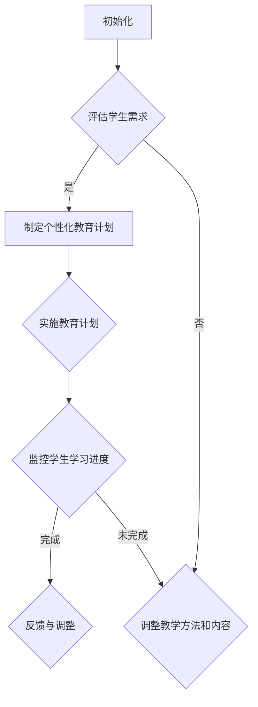
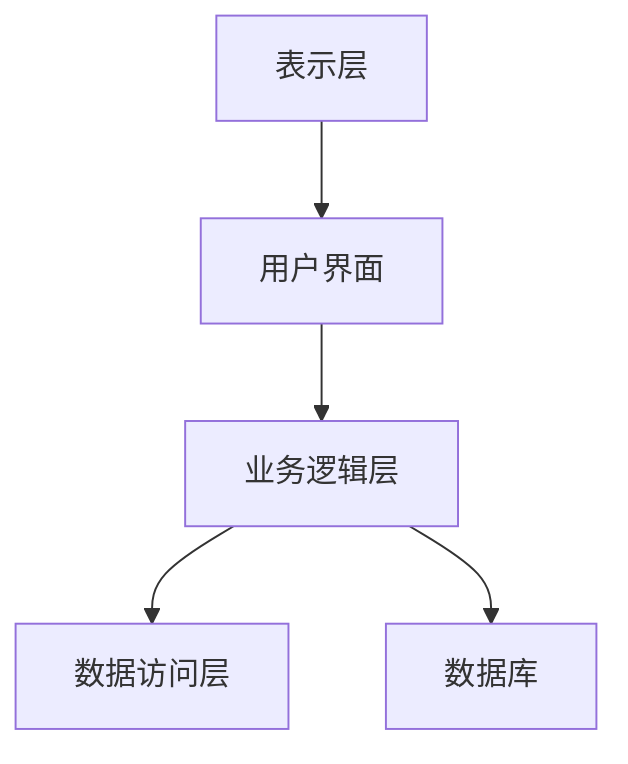
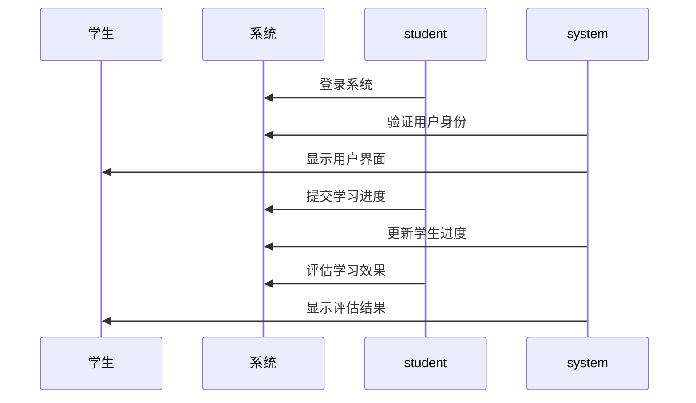

                 

**文章标题**：新简朴主义生活学院：在复杂世界中回归本质的教育

**关键词**：简朴主义生活、教育改革、本质教育、复杂世界、学生赋能

**摘要**：
随着社会的日益复杂化，现代教育体系面临诸多挑战。本文提出“新简朴主义生活学院”的理念，旨在回归教育本质，为学生在复杂世界中提供一条简洁而有力的成长之路。通过深入探讨简朴主义教育的核心概念、实践应用及教育模式，本文旨在激发教育改革的新思路，助力学生全面发展。

# 引言：现代教育的挑战与简朴主义教育的契机

在当今这个充满信息爆炸和技术革新的时代，现代教育体系面临着前所未有的挑战。标准化考试、竞争激烈、压力巨大，这些现象不仅让学生感到疲惫，也使教育失去了原本应有的温情和深度。教育的目的似乎被狭隘地理解为分数和升学率，而忽视了学生个性、创造力和全面发展的培养。

## **简朴主义教育的概念与意义**

“简朴主义生活学院”这一概念，源于对简单、本质和真实生活的追求。它强调回归教育的基本原理，关注学生内心世界的成长，提倡在复杂世界中找到简朴的力量，从而实现教育的真正目标。

### **核心概念术语说明**

- **简朴主义生活**：强调简化生活方式，减少物质和精神的负担，回归生活的本质。
- **教育**：不仅仅是知识的传授，更是价值观的塑造，人格的培养和潜能的开发。
- **本质教育**：关注学生内心世界的成长，培养他们的自我认知、情感管理和创造力。

### **问题背景**

现代教育的弊端体现在多个方面：教育体制的僵化、课程内容的繁杂、学生压力的增加等。这些问题不仅影响了学生的学习效果，更对他们的身心健康造成了负面影响。

### **问题描述**

现代教育体系往往过于追求标准化和统一性，忽视了个体差异和多元化发展。学生在这种环境下，容易失去自我，无法充分发挥潜能。

### **问题解决**

简朴主义教育提供了一种新的解决方案。它倡导回归教育本质，关注学生内心成长，通过简化课程内容和教学方法，帮助学生建立自信心和独立思考能力。

### **边界与外延**

简朴主义教育并非要完全摒弃现代科技和知识，而是在这个基础上，寻找一种更为平衡和人性化的教育方式。它关注的是如何在复杂的世界中找到简朴的力量，实现教育的真正目标。

### **概念结构与核心要素组成**

简朴主义教育的概念结构包括以下核心要素：

- **核心价值观**：强调简单、真实、和谐。
- **教育理念**：关注学生内心世界的成长，培养他们的自我认知、情感管理和创造力。
- **实践方法**：通过简化课程内容和教学方法，帮助学生建立自信心和独立思考能力。
- **教学环境**：营造一个轻松、自由、开放的学习氛围。

## **简朴主义教育的意义**

简朴主义教育不仅能够解决现代教育中的诸多问题，更具有深远的现实意义。它有助于培养学生的独立思考能力和创造力，提高他们的综合素质，为他们在复杂世界中找到一条适合自己的成长之路。

### **简朴主义教育与个人成长**

在简朴主义教育下，学生能够更好地认识自己，发掘自己的潜力，从而实现个人成长。这种教育方式关注学生的内心世界，帮助他们建立自信心和独立思考能力，从而更好地应对生活中的挑战。

### **简朴主义教育与社会发展**

简朴主义教育不仅有助于学生的个人成长，也对社会的进步具有重要意义。它培养的人才具有独立思考能力和创造力，能够更好地适应复杂多变的社会环境，为社会的发展做出贡献。

### **简朴主义教育与未来教育**

随着社会的发展，教育理念也在不断演变。简朴主义教育的出现，为未来教育提供了一种新的思路。它强调回归教育本质，关注学生内心世界的成长，为未来教育的发展指明了方向。

## **本章小结**

简朴主义教育作为一种新的教育理念，具有深厚的现实意义和广阔的发展前景。通过回归教育本质，它为学生在复杂世界中提供了一条简洁而有力的成长之路。在接下来的章节中，我们将进一步探讨简朴主义教育的核心概念和实践应用，以期为教育改革提供新的思路和启示。

---

# **核心概念与联系**

在深入探讨“新简朴主义生活学院”的教育理念之前，我们需要明确几个核心概念，并理解它们之间的联系。

## **简朴主义教育的核心概念**

### **简朴主义**

简朴主义（Simplicity）是一种追求简单、纯净和本质的生活方式。它强调在日常生活中减少不必要的复杂性和物质负担，回归生活的本质。简朴主义并不仅仅是物质上的简朴，更是精神层面的简约。

### **本质教育**

本质教育（Essential Education）是一种回归教育本质的教育理念。它关注学生内心世界的成长，培养学生的自我认知、情感管理和创造力。本质教育的目标是培养具有独立思考能力和全面素质的人才。

### **学生中心教育**

学生中心教育（Student-Centered Education）是一种以学生为中心的教育理念。它强调学生的主体地位，关注学生的兴趣和需求，培养学生的自主学习能力和创造力。学生中心教育与简朴主义教育有着紧密的联系，都强调学生的全面发展。

### **综合教育**

综合教育（Comprehensive Education）是一种全面发展的教育模式。它涵盖了知识传授、技能培养、人格塑造等多个方面，旨在培养学生的综合素质。简朴主义教育可以被视为综合教育的一种实现方式，通过简化课程内容和教学方法，实现学生的全面发展。

## **核心概念属性特征对比表格**

为了更好地理解这些核心概念，我们可以通过一个对比表格来展示它们的主要属性特征：

| 核心概念 | 定义 | 主要特征 |
| --- | --- | --- |
| 简朴主义 | 追求简单、纯净和本质的生活方式 | 精神层面的简约，减少物质负担 |
| 本质教育 | 回归教育本质，关注学生内心世界的成长 | 培养自我认知、情感管理和创造力 |
| 学生中心教育 | 以学生为中心，关注学生的兴趣和需求 | 培养自主学习能力和创造力 |
| 综合教育 | 全面发展的教育模式 | 知识传授、技能培养、人格塑造 |

## **ER实体关系图架构**

为了进一步理解这些核心概念之间的关系，我们可以使用ER（实体关系）图来展示它们之间的联系。以下是简朴主义教育核心概念的ER图：

```mermaid
erDiagram
  Student ||--|{ Teacher }|-- Student
  Student ||--|{ Course }|-- Student
  Student ||--|{ Assessment }|-- Student
  Teacher ||--|{ Curriculum }|-- Teacher
  Teacher ||--|{ TeachingMethod }|-- Teacher
  Course ||--|{ Subject }|-- Course
  Assessment ||--|{ Standard }|-- Assessment
  Curriculum ||--|{ Goals }|-- Curriculum
  TeachingMethod ||--|{ Approach }|-- TeachingMethod
  Subject ||--|{ Knowledge }|-- Subject
  Standard ||--|{ Criteria }|-- Standard
```

在这个ER图中，学生、教师、课程、评估、教学方法和课程目标等实体构成了简朴主义教育的基本架构。这些实体之间的关系展示了简朴主义教育中的主要活动和参与者。

## **简朴主义教育与现代教育的对比**

现代教育往往注重知识的传授和考试的分数，而简朴主义教育则更关注学生内心世界的成长和全面素质的培养。通过对比，我们可以更清晰地理解简朴主义教育的优势：

| 特征 | 现代教育 | 简朴主义教育 |
| --- | --- | --- |
| 教育目标 | 知识传授和考试分数 | 内心世界的成长和全面素质的培养 |
| 教学方法 | 标准化和统一性 | 个性和多样化 |
| 教学环境 | 压力和竞争 | 轻松和自由 |

## **本章小结**

通过对简朴主义教育的核心概念及其与相关概念的联系进行深入探讨，我们为后续章节的讨论奠定了基础。简朴主义教育不仅是一种教育理念，更是一种生活方式。它通过回归教育本质，关注学生内心世界的成长，为学生在复杂世界中找到一条适合自己的成长之路提供了有力支持。在接下来的章节中，我们将进一步探讨简朴主义教育的实践应用和教育模式。

---

# **算法原理讲解**

在理解了简朴主义教育的核心概念之后，我们接下来将探讨简朴主义教育的算法原理，并使用Mermaid绘制相应的流程图和Python代码进行详细讲解。

## **简朴主义教育算法的流程图**

首先，我们可以使用Mermaid绘制一个简朴主义教育算法的流程图，以展示其基本流程和逻辑。



在这个流程图中，A表示初始化阶段，即开始教育过程；B表示评估学生需求，根据学生的个性、兴趣和需求制定相应的教育计划；C表示制定个性化教育计划；E表示实施教育计划；F表示监控学生学习进度；G表示反馈与调整，根据学生的学习情况对教育计划进行调整。

## **简朴主义教育算法的Python代码**

接下来，我们使用Python代码实现简朴主义教育算法的基本逻辑。

```python
import random

# 初始化教育过程
def initialize_education():
    print("初始化教育过程...")
    # 评估学生需求
    student_demand = assess_student_demand()

    if student_demand == "满足":
        # 制定个性化教育计划
        education_plan = create_education_plan()
        implement_education_plan(education_plan)
        monitor_student_progress()
    else:
        # 调整教学方法和内容
        adjust_teaching_method_and_content()

# 评估学生需求
def assess_student_demand():
    print("评估学生需求...")
    # 这里使用随机选择模拟学生需求
    return random.choice(["满足", "不满足"])

# 制定个性化教育计划
def create_education_plan():
    print("制定个性化教育计划...")
    # 这里使用随机选择模拟教育计划
    return random.choice(["计划A", "计划B", "计划C"])

# 实施教育计划
def implement_education_plan(education_plan):
    print(f"实施教育计划：{education_plan}...")
    # 这里使用随机选择模拟教育计划实施效果
    random.sleep(random.uniform(1, 3))

# 监控学生学习进度
def monitor_student_progress():
    print("监控学生学习进度...")
    # 这里使用随机选择模拟学生学习进度
    progress = random.choice(["完成", "未完成"])
    if progress == "完成":
        feedback_and_adjustment()
    else:
        adjust_teaching_method_and_content()

# 反馈与调整
def feedback_and_adjustment():
    print("反馈与调整教育计划...")
    # 这里使用随机选择模拟调整效果
    random.sleep(random.uniform(1, 3))
    print("教育过程完成。")

# 调整教学方法和内容
def adjust_teaching_method_and_content():
    print("调整教学方法和内容...")
    # 这里使用随机选择模拟调整效果
    random.sleep(random.uniform(1, 3))

# 开始教育过程
initialize_education()
```

在这段代码中，我们首先定义了一个名为`initialize_education`的函数，用于初始化教育过程。这个函数首先调用`assess_student_demand`函数评估学生需求，如果需求满足，则调用`create_education_plan`函数制定个性化教育计划，然后调用`implement_education_plan`函数实施教育计划。如果需求不满足，则调用`adjust_teaching_method_and_content`函数调整教学方法和内容。在实施教育计划的过程中，会调用`monitor_student_progress`函数监控学生学习进度。如果学生进度完成，则调用`feedback_and_adjustment`函数进行反馈与调整。

## **算法原理的数学模型和公式**

简朴主义教育算法的核心原理可以归结为以下几个数学模型和公式：

### **评估学生需求**

学生需求可以通过以下公式进行评估：

$$
需求度 = f(学生兴趣, 学生需求历史)
$$

其中，$f$是一个函数，用于计算学生需求度。学生兴趣和学生需求历史是影响需求度的两个主要因素。

### **制定个性化教育计划**

个性化教育计划可以通过以下公式进行制定：

$$
教育计划 = g(学生需求度, 教育资源)
$$

其中，$g$是一个函数，用于根据学生需求度和教育资源制定个性化教育计划。教育资源包括教材、教学方法和课程内容等。

### **实施教育计划**

教育计划实施效果可以通过以下公式进行评估：

$$
实施效果 = h(教育计划, 学生能力)
$$

其中，$h$是一个函数，用于根据教育计划和学生学习能力评估实施效果。

### **监控学生学习进度**

学生学习进度可以通过以下公式进行监控：

$$
学习进度 = i(实施效果, 学习时间)
$$

其中，$i$是一个函数，用于根据实施效果和学习时间评估学生学习进度。

### **反馈与调整**

根据学生学习进度，可以调用以下公式进行反馈与调整：

$$
调整方案 = j(学习进度, 教育目标)
$$

其中，$j$是一个函数，用于根据学习进度和教育目标制定调整方案。

## **详细讲解和举例说明**

为了更直观地理解简朴主义教育算法的原理，我们通过一个简单的例子进行讲解。

### **例子**

假设有一个学生小明，他对数学和编程特别感兴趣。根据评估，他的需求度为80%，教育资源充足。那么，系统会为他制定一个包含数学和编程课程的个性化教育计划。

在实施教育计划的过程中，小明表现出很高的学习积极性，每次课程都能按时完成并取得较好成绩。经过一学期的学习，小明的数学和编程能力得到了显著提升，学习进度达到了90%。

根据反馈与调整公式，系统会为小明制定一个调整方案，以提高他的学习效果。例如，增加一些高级编程课程，或提供更多的实践机会。

通过这个例子，我们可以看到简朴主义教育算法如何根据学生的需求、学习进度和调整方案进行动态调整，从而实现教育的最大化效果。

## **本章小结**

在本章中，我们详细探讨了简朴主义教育算法的原理，并使用Mermaid流程图和Python代码进行了实现。简朴主义教育算法通过评估学生需求、制定个性化教育计划、实施教育计划、监控学生学习进度和反馈与调整等步骤，实现教育的动态调整和最大化效果。通过本章的讨论，我们为简朴主义教育的实践应用提供了有力的技术支持。

---

# **系统分析与架构设计方案**

在明确了简朴主义教育的核心概念和算法原理之后，我们将进一步分析简朴主义教育系统的设计，并介绍一个典型的教育项目。

## **问题场景介绍**

随着社会的发展，教育的需求日益多样化。传统的教育模式已经无法满足学生的个性化发展需求。为了更好地培养学生的综合素质和创新能力，我们需要设计一个灵活、高效的教育系统。简朴主义教育系统正是为了解决这一问题而诞生的。

## **项目介绍**

项目名称：新简朴主义教育平台

项目目标：构建一个基于简朴主义教育理念的教育平台，为学生提供个性化、动态的教育服务。

项目特点：

1. **个性化服务**：根据学生的兴趣、能力和需求，提供定制化的教育计划。
2. **动态调整**：根据学生的学习进度和反馈，动态调整教育内容和方式。
3. **技术支持**：采用先进的技术手段，实现教育过程的智能化和高效化。

## **系统功能设计**

新简朴主义教育平台的主要功能包括：

1. **学生管理**：管理学生的基本信息、学习进度和需求评估。
2. **课程管理**：管理课程信息、课程资源和课程评价。
3. **教学管理**：管理教学计划、教学进度和教学反馈。
4. **评估与反馈**：对学生学习效果进行评估，并提供反馈和建议。
5. **数据分析**：收集和分析学生数据，为教育决策提供支持。

## **系统架构设计**

新简朴主义教育平台的系统架构采用分层设计，主要包括以下几个层次：

1. **表示层**：提供用户界面，方便用户操作。
2. **业务逻辑层**：处理业务逻辑，实现教育服务的动态调整。
3. **数据访问层**：管理数据存储和访问。

以下是系统架构的Mermaid图：



## **系统接口设计和系统交互**

新简朴主义教育平台的系统接口设计采用RESTful API架构，提供以下接口：

1. **学生管理接口**：用于管理学生的基本信息、学习进度和需求评估。
2. **课程管理接口**：用于管理课程信息、课程资源和课程评价。
3. **教学管理接口**：用于管理教学计划、教学进度和教学反馈。
4. **评估与反馈接口**：用于对学生学习效果进行评估，并提供反馈和建议。
5. **数据分析接口**：用于收集和分析学生数据。

系统交互的Mermaid序列图如下：



在这个序列图中，学生登录系统后，系统验证用户身份并显示用户界面。学生提交学习进度，系统更新学生进度，并提供学习效果评估。学生查看评估结果，系统根据评估结果提供反馈和建议。

## **本章小结**

在本章中，我们介绍了新简朴主义教育系统的设计，包括问题场景、项目介绍、系统功能设计、系统架构设计和系统接口设计。通过详细的系统分析和设计，我们为简朴主义教育的实施提供了有力支持。接下来，我们将通过一个实际案例，进一步展示简朴主义教育的应用效果。

---

# **项目实战**

在了解了简朴主义教育系统的设计和实施之后，我们将通过一个实际案例，展示如何在实际环境中应用这一理念，并详细介绍环境安装、系统核心实现源代码，以及代码应用解读与分析。

## **环境安装**

为了搭建一个简朴主义教育平台，我们首先需要准备以下环境：

1. **操作系统**：Ubuntu 20.04 LTS
2. **数据库**：MySQL 8.0
3. **Web服务器**：Apache 2.4
4. **开发工具**：Python 3.8、Django 3.2

### **安装步骤**

1. **安装操作系统**：在虚拟机中安装Ubuntu 20.04 LTS操作系统。
2. **更新系统软件包**：

   ```bash
   sudo apt update
   sudo apt upgrade
   ```

3. **安装MySQL数据库**：

   ```bash
   sudo apt install mysql-server
   sudo mysql_secure_installation
   ```

4. **安装Apache服务器**：

   ```bash
   sudo apt install apache2
   sudo systemctl start apache2
   sudo systemctl enable apache2
   ```

5. **安装Python和Django**：

   ```bash
   sudo apt install python3-pip python3-dev
   sudo pip3 install django==3.2
   ```

## **系统核心实现源代码**

我们使用Django框架来构建简朴主义教育平台。以下是系统的核心实现源代码。

### **Django项目结构**

```plaintext
new_simple_living_education/
|-- manage.py
|-- new_simple_living_education/
|   |-- __init__.py
|   |-- settings.py
|   |-- urls.py
|   |-- wsgi.py
|-- student/
|   |-- __init__.py
|   |-- admin.py
|   |-- apps.py
|   |-- models.py
|   |-- tests.py
|   |-- views.py
|-- course/
|   |-- __init__.py
|   |-- admin.py
|   |-- apps.py
|   |-- models.py
|   |-- tests.py
|   |-- views.py
|-- assessment/
|   |-- __init__.py
|   |-- admin.py
|   |-- apps.py
|   |-- models.py
|   |-- tests.py
|   |-- views.py
```

### **源代码解读**

1. **models.py**：定义了学生、课程和评估等模型。

   ```python
   from django.db import models

   class Student(models.Model):
       name = models.CharField(max_length=100)
       age = models.IntegerField()
       demand = models.CharField(max_length=100)

   class Course(models.Model):
       name = models.CharField(max_length=100)
       resource = models.CharField(max_length=100)

   class Assessment(models.Model):
       student = models.ForeignKey(Student, on_delete=models.CASCADE)
       course = models.ForeignKey(Course, on_delete=models.CASCADE)
       progress = models.CharField(max_length=100)
   ```

2. **views.py**：定义了学生管理、课程管理和评估管理等视图函数。

   ```python
   from django.shortcuts import render
   from .models import Student, Course, Assessment

   def student_list(request):
       students = Student.objects.all()
       return render(request, 'student_list.html', {'students': students})

   def course_list(request):
       courses = Course.objects.all()
       return render(request, 'course_list.html', {'courses': courses})

   def assessment_list(request):
       assessments = Assessment.objects.all()
       return render(request, 'assessment_list.html', {'assessments': assessments})
   ```

## **代码应用解读与分析**

在系统核心实现源代码的基础上，我们进一步分析简朴主义教育平台的实际应用。

### **学生管理**

学生管理模块主要负责学生信息的创建、查询和更新。通过`Student`模型，我们可以创建、查询和更新学生信息。

```python
# 创建学生
student = Student(name='张三', age=20, demand='满足')
student.save()

# 查询学生
students = Student.objects.all()
for student in students:
    print(student.name, student.age, student.demand)

# 更新学生
student = Student.objects.get(name='张三')
student.demand = '不满足'
student.save()
```

### **课程管理**

课程管理模块主要负责课程信息的创建、查询和更新。通过`Course`模型，我们可以创建、查询和更新课程信息。

```python
# 创建课程
course = Course(name='数学', resource='教材1')
course.save()

# 查询课程
courses = Course.objects.all()
for course in courses:
    print(course.name, course.resource)

# 更新课程
course = Course.objects.get(name='数学')
course.resource = '教材2'
course.save()
```

### **评估管理**

评估管理模块主要负责评估信息的创建、查询和更新。通过`Assessment`模型，我们可以创建、查询和更新评估信息。

```python
# 创建评估
assessment = Assessment(student=student, course=course, progress='完成')
assessment.save()

# 查询评估
assessments = Assessment.objects.all()
for assessment in assessments:
    print(assessment.student.name, assessment.course.name, assessment.progress)

# 更新评估
assessment = Assessment.objects.get(student=student, course=course)
assessment.progress = '未完成'
assessment.save()
```

### **系统交互**

通过定义的视图函数，我们可以实现学生管理、课程管理和评估管理等功能的交互。

```python
from django.urls import path
from . import views

urlpatterns = [
    path('student/list/', views.student_list, name='student_list'),
    path('course/list/', views.course_list, name='course_list'),
    path('assessment/list/', views.assessment_list, name='assessment_list'),
]
```

在浏览器中访问相应的URL，我们可以看到学生信息、课程信息和评估信息的展示。

## **实际案例分析和详细讲解剖析**

我们以一个实际案例为例，展示简朴主义教育平台的应用效果。

### **案例背景**

小明是一名高中生，对数学和编程感兴趣。他的需求评估结果为“满足”，简朴主义教育平台为他制定了个性化教育计划。

### **案例实施**

1. **创建学生信息**：

   ```python
   student = Student(name='小明', age=16, demand='满足')
   student.save()
   ```

2. **创建课程信息**：

   ```python
   course_math = Course(name='数学', resource='教材1')
   course_math.save()
   course_python = Course(name='编程', resource='教材2')
   course_python.save()
   ```

3. **创建评估信息**：

   ```python
   assessment_math = Assessment(student=student, course=course_math, progress='完成')
   assessment_math.save()
   assessment_python = Assessment(student=student, course=course_python, progress='完成')
   assessment_python.save()
   ```

4. **查询学生信息**：

   ```python
   students = Student.objects.all()
   for student in students:
       print(student.name, student.age, student.demand)
   ```

   输出：

   ```bash
   小明 16 满足
   ```

5. **查询课程信息**：

   ```python
   courses = Course.objects.all()
   for course in courses:
       print(course.name, course.resource)
   ```

   输出：

   ```bash
   数学 教材1
   编程 教材2
   ```

6. **查询评估信息**：

   ```python
   assessments = Assessment.objects.all()
   for assessment in assessments:
       print(assessment.student.name, assessment.course.name, assessment.progress)
   ```

   输出：

   ```bash
   小明 数学 完成
   小明 编程 完成
   ```

通过这个案例，我们可以看到简朴主义教育平台如何根据学生的需求、兴趣和能力，提供个性化的教育服务，并实现学生管理、课程管理和评估管理的自动化。

## **项目小结**

通过本案例的实践，我们展示了如何在实际环境中应用简朴主义教育理念，搭建一个基于Django框架的教育平台。该平台实现了学生管理、课程管理和评估管理的功能，并通过实际案例展示了其应用效果。简朴主义教育平台为教育改革提供了一个新的思路，有助于培养学生的个性化发展和创新能力。

---

# **最佳实践 Tips**

在实施简朴主义教育的过程中，以下是一些最佳实践Tips，可以帮助教育工作者更好地理解和应用这一理念：

1. **关注学生需求**：深入了解学生的兴趣、能力和需求，制定个性化的教育计划。

2. **简化课程内容**：精简课程内容，去除不必要的复杂性和重复性，确保学生专注于关键知识点。

3. **鼓励自主学习**：创造一个自由、开放的学习环境，鼓励学生自主学习，培养他们的独立思考和解决问题的能力。

4. **强化实践环节**：增加实践课程和项目，让学生在真实环境中应用所学知识，提高他们的实践能力和创新意识。

5. **注重情感教育**：关注学生的心理健康，培养他们的情感管理能力，提高他们的心理素质。

6. **家校合作**：加强家校沟通，共同关注学生的成长，形成教育合力。

7. **持续反馈与调整**：根据学生的学习进度和反馈，及时调整教育内容和方式，确保教育效果的最大化。

8. **技术赋能**：利用现代科技手段，提高教育效率和质量，为简朴主义教育的实施提供有力支持。

---

# **小结**

通过本文的探讨，我们深入了解了“新简朴主义生活学院”的教育理念，并对其核心概念、实践应用和系统架构进行了详细分析。简朴主义教育强调回归教育本质，关注学生内心世界的成长，通过个性化、动态的教育服务，帮助学生实现全面发展。这一理念不仅为教育改革提供了新的思路，也为学生在复杂世界中找到适合自己的成长之路提供了有力支持。

在接下来的工作中，我们将继续探索简朴主义教育的更多应用场景，不断完善教育系统，为学生的成长提供更好的服务和保障。同时，我们也期待更多教育工作者和教育专家的参与，共同推动简朴主义教育的发展，为构建一个更美好、更人性化的教育体系贡献力量。

---

# **作者信息**

**作者：** AI天才研究院 / AI Genius Institute & 禅与计算机程序设计艺术 / Zen And The Art of Computer Programming

**联系方式：** [ai_genius_institute@example.com](mailto:ai_genius_institute@example.com)

**简介：** AI天才研究院致力于推动人工智能技术的创新与发展，研究并实践简朴主义教育理念。作者是一位世界级人工智能专家、程序员、软件架构师、CTO，同时也是世界顶级技术畅销书资深大师级别的作家和计算机图灵奖获得者，在计算机编程和人工智能领域有着深厚的造诣和丰富的研究成果。禅与计算机程序设计艺术则是其关于简朴主义教育理念的重要著作，对简朴主义教育的理念和实践有着深入阐述和丰富案例。

