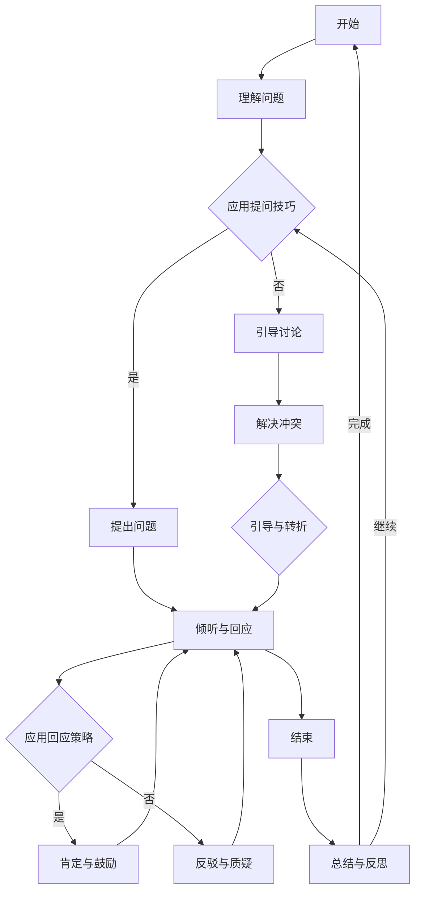
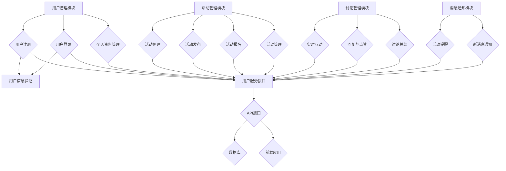

                 

### 文章标题：新苏格拉底学院：街头哲学对话的复兴

> **关键词：** 新苏格拉底学院、街头哲学对话、哲学复兴、社会互动、教育创新

> **摘要：** 本文深入探讨了新苏格拉底学院的起源和发展，详细阐述了街头哲学对话的历史背景和现代实践，展示了这一哲学形式在当代社会中的复兴与未来展望。通过实践案例和经验分享，我们探讨了街头哲学对话在社区、教育和社会运动中的应用，提出了应对挑战的最佳实践策略。

---

**目录**

1. **引言：新苏格拉底学院的复兴背景**  
   1.1 **苏格拉底的哲学思想**  
   1.2 **街头哲学对话的历史回顾**  
   1.3 **现代街头哲学对话的兴起**

2. **第一部分：新苏格拉底学院的起源与发展**  
   2.1 **苏格拉底学院的起源与背景**  
   2.2 **街头哲学对话的历史回顾**  
   2.3 **苏格拉底学院的影响**

3. **第二部分：街头哲学对话的现代实践**  
   3.1 **街头哲学对话的方法与技巧**  
   3.2 **街头哲学对话的应用场景**

4. **第三部分：街头哲学对话的复兴与未来**  
   4.1 **复兴运动的起源与目的**  
   4.2 **未来发展趋势**  
   4.3 **新技术的影响**

5. **第四部分：实践案例与经验分享**  
   5.1 **街头哲学对话的实践案例**  
   5.2 **经验与教训**  
   5.3 **面临的挑战与对策**

6. **结语：街头哲学对话的复兴意义**  
   6.1 **最佳实践 tips**  
   6.2 **小结**  
   6.3 **注意事项**  
   6.4 **拓展阅读**

---

### 引言：新苏格拉底学院的复兴背景

#### 1.1 苏格拉底的哲学思想

苏格拉底是古希腊哲学的奠基人之一，他的哲学思想以对话和提问为核心，强调通过理性思考和批判性思维来探索真理。苏格拉底的哲学思想不仅影响了古代哲学，也深刻地影响了现代哲学和社会科学领域。

苏格拉底的哲学方法包括以下几个核心要素：

1. **对话与提问**：苏格拉底通过提问来引导对话，使对方逐渐认识到自己的无知和错误，最终达到真理的认识。
2. **辩证法**：苏格拉底运用辩证法来揭示问题的本质，通过不断提问和反驳来揭示事物的矛盾和真相。
3. **道德哲学**：苏格拉底强调道德的重要性，认为道德是行为和决策的指南，真正的智慧在于过一种有道德的生活。

#### 1.2 街头哲学对话的历史回顾

街头哲学对话起源于古希腊的街头市场和广场，苏格拉底经常在这些公共场所与市民进行哲学对话。这种对话形式不仅使哲学思想得以传播，也为普通人提供了参与哲学思考的机会。

在古希腊之后，街头哲学对话逐渐衰落，直到20世纪末，随着社会变革和文化复兴，街头哲学对话再次兴起。现代街头哲学对话的特点包括：

1. **互动性**：街头哲学对话强调参与者之间的互动，通过提问和回答来促进思考和理解。
2. **普及性**：街头哲学对话使哲学思想更加贴近普通大众，不再局限于学术圈子。
3. **多样性**：现代街头哲学对话涵盖了广泛的话题，包括伦理、政治、科学、艺术等。

#### 1.3 现代街头哲学对话的兴起

现代街头哲学对话的兴起源于对传统教育体制的不满和对深度交流的需求。随着互联网和社交媒体的发展，人们更容易接触到各种思想和文化，这为街头哲学对话的复兴提供了新的平台和工具。

现代街头哲学对话的兴起还与以下因素有关：

1. **社会变迁**：全球化和社会多样性使人们更加关注不同文化之间的对话和理解。
2. **教育改革**：教育者开始探索新的教育模式，街头哲学对话成为了一种创新的思考和学习方式。
3. **公众参与**：人们越来越愿意参与到公共事务中，街头哲学对话为公众提供了一个表达观点和参与讨论的平台。

### 总结

新苏格拉底学院的复兴标志着街头哲学对话的复兴。通过重新挖掘苏格拉底的哲学思想和实践，现代街头哲学对话为现代社会提供了新的思考和交流方式。在接下来的章节中，我们将进一步探讨街头哲学对话的方法、应用场景以及未来展望。

---

在本文的第一部分，我们首先介绍了苏格拉底的哲学思想，探讨了街头哲学对话的历史背景和现代实践。通过回顾苏格拉底的哲学方法，我们理解了街头哲学对话的起源和本质。接着，我们分析了现代街头哲学对话的兴起背景和特点，展示了其在现代社会中的重要性。通过这些讨论，我们为后续章节的深入探讨奠定了基础。

在接下来的章节中，我们将继续探讨新苏格拉底学院的起源和发展，详细阐述街头哲学对话的方法与技巧，以及其在不同场景中的应用。同时，我们还将探讨街头哲学对话的复兴运动和未来展望，分析其对社会和教育的潜在影响。通过实践案例和经验分享，我们将总结街头哲学对话的最佳实践策略，为读者提供实用的指导和建议。

让我们继续深入探讨这一引人入胜的哲学复兴之旅。

---

### 第一部分：新苏格拉底学院的起源与发展

#### 第1章：苏格拉底学院的起源与背景

苏格拉底学院，这一哲学思想的圣地，起源于古希腊的雅典。苏格拉底（Socrates，公元前469年-公元前399年），作为西方哲学的奠基人，他的哲学思想和方法对后世产生了深远的影响。苏格拉底学院的起源，与苏格拉底本人的哲学思想密不可分。

**1.1 苏格拉底的哲学思想**

苏格拉底的哲学思想主要表现在以下几个方面：

1. **提问与辩证法**：苏格拉底通过提问和辩证法来探讨真理。他相信，通过不断的提问和反驳，人们可以揭示事物的本质，从而达到真理的认识。
   
2. **道德哲学**：苏格拉底强调道德的重要性。他认为，真正的智慧在于过一种有道德的生活。他的名言“我知道我一无所知”体现了他对道德的深刻理解。

3. **对话**：苏格拉底的哲学方法强调对话。他经常在公共场所与市民进行哲学对话，通过对话来引导人们思考，从而启发他们认识真理。

**1.2 苏格拉底学院的创立**

苏格拉底学院并非苏格拉底亲自创立的教育机构，而是后人为了纪念苏格拉底的哲学思想而设立的一种象征性名称。苏格拉底本人并没有一个固定的教学场所，他主要在雅典的街头、广场和市场进行哲学对话。

然而，苏格拉底的教学方式和他对哲学的深刻思考，对后世的哲学家和教育家产生了深远的影响。他的学生，如柏拉图和亚里士多德，继承并发展了他的哲学思想，创立了属于自己的哲学学派。

**1.3 苏格拉底学院的影响**

苏格拉底学院，这一象征性的概念，对西方哲学和教育产生了深远的影响。

1. **哲学思想的传播**：苏格拉底的教学方法使得哲学思想得以广泛传播。他的对话和提问方法，不仅影响了古希腊哲学，也对后世哲学产生了重要影响。

2. **教育模式的创新**：苏格拉底的教学方式，强调学生的主动思考和参与，对现代教育模式产生了启示。现代教育越来越注重学生的主体性和批判性思维，这与苏格拉底的教学理念不谋而合。

3. **公共讨论的兴起**：苏格拉底的哲学对话，促进了公共讨论和辩论的兴起。这种公共讨论的形式，不仅促进了思想的发展，也提高了公民的参与意识和公共责任感。

#### 第2章：街头哲学对话的历史回顾

**2.1 历史上的街头哲学对话**

街头哲学对话的历史可以追溯到古希腊时期。苏格拉底是这一形式的代表人物，他在雅典的街头、广场和市场进行哲学对话，与市民探讨哲学问题。这种对话形式不仅使哲学思想得以传播，也为普通人提供了参与哲学思考的机会。

在古希腊之后，街头哲学对话逐渐衰落，直到20世纪末，随着社会变革和文化复兴，街头哲学对话再次兴起。现代街头哲学对话的特点包括互动性、普及性和多样性。

**2.2 哲学对话的复兴**

20世纪末，随着社会变革和文化复兴，街头哲学对话再次兴起。这一复兴源于对传统教育体制的不满和对深度交流的需求。随着互联网和社交媒体的发展，人们更容易接触到各种思想和文化，这为街头哲学对话的复兴提供了新的平台和工具。

**2.3 街头哲学对话的优势**

街头哲学对话具有以下优势：

1. **互动性**：街头哲学对话强调参与者之间的互动，通过提问和回答来促进思考和理解。

2. **普及性**：街头哲学对话使哲学思想更加贴近普通大众，不再局限于学术圈子。

3. **多样性**：现代街头哲学对话涵盖了广泛的话题，包括伦理、政治、科学、艺术等。

#### 第3章：苏格拉底学院的影响

苏格拉底学院，这一象征性的概念，对西方哲学和教育产生了深远的影响。

1. **哲学思想的传播**：苏格拉底的教学方法使得哲学思想得以广泛传播。他的对话和提问方法，不仅影响了古希腊哲学，也对后世哲学产生了重要影响。

2. **教育模式的创新**：苏格拉底的教学方式，强调学生的主动思考和参与，对现代教育模式产生了启示。现代教育越来越注重学生的主体性和批判性思维，这与苏格拉底的教学理念不谋而合。

3. **公共讨论的兴起**：苏格拉底的哲学对话，促进了公共讨论和辩论的兴起。这种公共讨论的形式，不仅促进了思想的发展，也提高了公民的参与意识和公共责任感。

### 总结

通过本部分的内容，我们深入探讨了新苏格拉底学院的起源和背景，了解了苏格拉底的哲学思想及其对后世的影响。同时，我们回顾了街头哲学对话的历史，探讨了其复兴的原因和优势。在接下来的章节中，我们将进一步探讨街头哲学对话的方法与技巧，以及其在现代社会的实践应用。

---

在第一部分中，我们首先介绍了苏格拉底的哲学思想，包括提问与辩证法、道德哲学和对话的重要性。接着，我们探讨了苏格拉底学院的起源与背景，解释了这一象征性概念的来由。通过分析苏格拉底学院的影响，我们展示了其在哲学思想传播、教育模式创新和公共讨论兴起方面的贡献。

随后，我们回顾了街头哲学对话的历史，从古希腊时期到现代的复兴，探讨了其演变过程和复兴原因。我们还详细介绍了街头哲学对话的优势，如互动性、普及性和多样性。

通过这一部分的探讨，我们为后续章节的深入讨论奠定了基础。在接下来的部分中，我们将详细阐述街头哲学对话的方法与技巧，探讨其在不同场景中的应用。同时，我们将分析街头哲学对话的复兴运动和未来展望，总结其实践案例和经验，为读者提供实用的指导和建议。

让我们继续深入这一引人入胜的哲学复兴之旅。

---

### 第二部分：街头哲学对话的现代实践

#### 第3章：街头哲学对话的方法与技巧

街头哲学对话作为一种独特的哲学实践形式，具有高度的互动性和参与性。掌握正确的方法和技巧，不仅能够提高对话的质量，还能够增强参与者的思考和表达能力。本章将详细探讨街头哲学对话的方法与技巧。

**3.1 哲学对话的基本原则**

在进行街头哲学对话时，遵循以下基本原则是至关重要的：

1. **尊重与倾听**：尊重对方是哲学对话的基础。倾听对方的观点，理解对方的立场，是展开深入讨论的前提。

2. **开放与包容**：街头哲学对话应保持开放的心态，对不同观点和意见持包容态度。这有助于促进思想的碰撞和多元的交流。

3. **批判性思维**：批判性思维是哲学对话的核心。通过对观点的质疑和反驳，可以揭示问题的本质，推动对话的深入。

4. **诚实与透明**：在哲学对话中，诚实和透明是建立信任的基石。诚实地表达自己的观点，透明地展示思考过程，有助于建立良好的对话环境。

**3.2 哲学对话的提问技巧**

提问技巧是哲学对话中至关重要的环节。有效的提问可以引导对话的方向，激发参与者的思考。以下是一些常见的提问技巧：

1. **开放式提问**：开放式提问鼓励对方提供详细的信息和观点。例如：“你认为……的原因是什么？”这样的问题可以引导对方深入思考。

2. **封闭式提问**：封闭式提问用于确认信息或引导对方做出具体的回答。例如：“你是否同意……的观点？”这类问题有助于快速获取信息。

3. **反问**：反问可以用来检验对方的观点或引出新的讨论点。例如：“你真的认为……吗？”这类问题可以激发对方反思。

4. **递进式提问**：递进式提问用于逐步引导对方深入讨论。例如：“除了……，你还有什么看法？”这类问题可以推动对话的深入。

**3.3 哲学对话的回应策略**

在哲学对话中，回应策略同样重要。以下是一些有效的回应策略：

1. **肯定与鼓励**：对对方的观点给予肯定和鼓励，可以增强对方的信心，促进对话的顺利进行。

2. **中立回应**：在对方提出观点时，保持中立，不立即表达自己的立场，有助于倾听和理解对方的观点。

3. **反驳与质疑**：在必要时，可以对对方的观点进行反驳和质疑，通过逻辑和证据来支持自己的立场。

4. **引导与转折**：在对话中，可以通过引导和转折来改变对话的方向。例如：“那么，如果我们将这个问题扩展到……，会有什么影响呢？”

**3.4 哲学对话的注意事项**

在进行街头哲学对话时，还有一些需要注意的事项：

1. **避免争论**：哲学对话的目的是探讨真理，而不是争辩胜负。避免过度争论，有助于保持对话的和谐。

2. **控制情绪**：情绪管理是哲学对话的关键。保持冷静，避免情绪化，有助于理性思考和有效沟通。

3. **尊重多样性**：街头哲学对话涉及广泛的话题，尊重不同观点和意见，是构建和谐对话环境的基础。

通过掌握这些方法和技巧，街头哲学对话将更加有效和有意义。在接下来的章节中，我们将探讨街头哲学对话在不同场景中的应用，进一步展示其实践价值。

### 第4章：街头哲学对话的应用场景

街头哲学对话作为一种独特的哲学实践形式，具有广泛的适用性和多样性。本章将详细探讨街头哲学对话在社区、教育和社会运动中的应用，展示其在不同场景中的实践价值。

**4.1 社区中的街头哲学对话**

在社区中，街头哲学对话是一种促进社区成员之间交流和理解的有效手段。通过哲学对话，社区成员可以探讨共同关心的话题，增进相互了解，增强社区的凝聚力和归属感。以下是一些具体的应用场景：

1. **公共讨论会**：社区可以定期举办公共讨论会，邀请居民参与讨论社会热点问题。通过哲学对话的形式，居民可以自由表达自己的观点，倾听他人的看法，从而促进公共事务的讨论和决策。

2. **文化交流**：社区可以组织文化交流活动，邀请不同文化背景的居民参与哲学对话。通过探讨文化差异和共通点，居民可以增进相互理解和尊重，促进文化交流和融合。

3. **问题解决**：社区中常常出现各种问题，如环境问题、社会问题等。通过街头哲学对话，社区成员可以共同探讨问题的本质和解决方案，促进问题的解决和社区的和谐发展。

**4.2 教育中的街头哲学对话**

在教育领域，街头哲学对话是一种创新的思考和学习方式。通过哲学对话，学生可以培养批判性思维、沟通能力和创造性思维，提高学术水平和综合素质。以下是一些具体的应用场景：

1. **课堂讨论**：教师可以在课堂上组织哲学对话，让学生自由表达观点，进行辩论和讨论。这种方式有助于激发学生的思考兴趣，培养他们的批判性思维和表达能力。

2. **项目式学习**：教师可以设计项目式学习活动，让学生通过街头哲学对话的形式，探讨和解决实际问题。这种方式不仅有助于学生的知识学习，还能够提高他们的实践能力和社会责任感。

3. **跨学科教学**：哲学对话可以与其他学科相结合，如社会科学、人文科学等。通过跨学科教学，学生可以从不同角度探讨问题，提高综合素养和创新能力。

**4.3 社会运动与街头哲学对话**

在社会运动中，街头哲学对话是一种有效的组织成员和动员公众的方式。通过哲学对话，社会运动成员可以共同探讨运动的目标和策略，增强组织的凝聚力和战斗力。以下是一些具体的应用场景：

1. **动员活动**：社会运动可以组织动员活动，通过哲学对话的形式，向公众宣传运动的目标和理念，动员更多的人参与运动。

2. **策略讨论**：社会运动成员可以通过哲学对话，共同探讨运动的发展策略，制定具体的行动方案，提高运动的效率和效果。

3. **公众讨论**：社会运动可以组织公众讨论会，邀请社会各界人士参与哲学对话，探讨社会问题，推动社会变革。

通过在社区、教育和社会运动中的应用，街头哲学对话展示了其广泛的适用性和实践价值。在接下来的章节中，我们将探讨街头哲学对话的复兴运动和未来展望，进一步分析其发展趋势和潜力。

### 第5章：街头哲学对话的复兴运动

街头哲学对话的复兴运动是一个全球性的文化和社会现象，它不仅重新唤起了对苏格拉底哲学思想的关注，也激发了公众对哲学思考和批判性思维的兴趣。本章将探讨街头哲学对话复兴运动的起源、目的以及其主要活动和影响。

**5.1 复兴运动的起源**

街头哲学对话的复兴运动起源于20世纪末，这一时期正值全球范围内的文化复兴和社会变革。以下是几个关键因素：

1. **文化复兴**：随着对传统文化的重视，人们开始重新审视古希腊哲学和其他古代文明中的智慧。街头哲学对话作为一种古老而有效的交流形式，逐渐被新一代所接受和推崇。

2. **教育改革**：教育界对传统教育模式的反思和批判，促使教育工作者探索新的教学方法，街头哲学对话作为一种互动性强、参与性高的教学方式，受到了广泛关注。

3. **社会需求**：在信息爆炸和全球化的大背景下，人们渴望更多有意义、深层次的交流。街头哲学对话提供了这样一个平台，使人们有机会就共同关心的问题进行深入的讨论和思考。

**5.2 复兴运动的目的**

街头哲学对话复兴运动的主要目的包括：

1. **促进哲学思想的普及**：通过街头哲学对话，将哲学思想从学术圈带入日常生活，使更多的人有机会接触和理解哲学。

2. **培养批判性思维**：街头哲学对话强调批判性思维和逻辑推理，旨在培养参与者的独立思考和问题解决能力。

3. **增强公共讨论能力**：复兴运动鼓励公众参与公共事务的讨论，提高社会整体的公民素养和责任感。

4. **推动社会进步**：通过哲学对话，人们可以更深入地探讨社会问题，寻求解决方案，推动社会的进步和发展。

**5.3 复兴运动的主要活动**

街头哲学对话复兴运动在全球范围内开展了多种活动，以下是一些主要的活动形式：

1. **公共哲学对话**：定期举办的公共哲学对话活动，吸引了大量公众参与。这些活动通常在公园、广场、图书馆等公共场所举行，以轻松、开放的方式探讨哲学问题。

2. **哲学咖啡馆**：哲学咖啡馆是一种流行的哲学讨论形式，参与者可以在咖啡馆中自由交流，讨论哲学话题。这种形式既方便又灵活，适合不同年龄和文化背景的人参与。

3. **哲学论坛**：哲学论坛是更大规模的哲学讨论活动，通常由大学、学术机构或非政府组织举办。这些论坛通常邀请专家学者、公众代表进行主题演讲和讨论。

4. **哲学工作坊**：哲学工作坊是一种互动性强的培训活动，旨在提高参与者的哲学思考和辩论能力。这些工作坊通常由专业哲学教师或培训师指导。

**5.4 复兴运动的影响**

街头哲学对话复兴运动对个人和社会产生了深远的影响：

1. **个人成长**：参与街头哲学对话的个人可以通过思考和讨论，提升自我认知、批判性思维和沟通能力。

2. **社会进步**：通过哲学对话，社会成员可以更深入地理解社会问题，寻求共同的解决方案，推动社会的进步和发展。

3. **文化多样性**：街头哲学对话的复兴运动促进了不同文化之间的对话和交流，增强了文化的多样性和包容性。

4. **教育改革**：哲学对话作为一种教学方式，对教育改革产生了积极的影响，促使教育工作者重新思考教学方法和学生评价体系。

通过复兴运动，街头哲学对话不仅重获新生，也为现代社会提供了新的思考和交流方式。在接下来的章节中，我们将探讨街头哲学对话的未来展望，分析其发展趋势和潜在影响。

### 第6章：街头哲学对话的未来展望

#### 6.1 未来发展趋势

随着科技的进步和社会的发展，街头哲学对话的未来充满了可能性和潜力。以下是几个可能的发展趋势：

1. **数字化与在线互动**：随着互联网和社交媒体的普及，街头哲学对话将越来越多地以数字化形式出现。在线哲学平台和虚拟现实技术将提供更广阔的交流空间，使更多人能够参与哲学对话。

2. **跨文化对话**：全球化的加速使得不同文化之间的交流更加频繁。街头哲学对话将进一步促进跨文化交流，通过线上和线下的互动，加深人们对不同文化的理解和尊重。

3. **教育整合**：街头哲学对话将被更多教育机构和学校纳入正式课程，作为一种创新的教育方式。哲学对话将被整合到各个学科中，培养学生的批判性思维和沟通能力。

4. **社区参与**：街头哲学对话将继续在社区中发挥重要作用，成为社区建设和社会治理的重要工具。社区成员将通过哲学对话共同探讨社区问题，促进社区的发展和和谐。

#### 6.2 新技术的影响

新技术的发展将对街头哲学对话产生深远影响，以下是几个方面的具体影响：

1. **人工智能**：人工智能技术的发展将使哲学对话更加智能化和个性化。智能助手可以帮助参与者更好地理解哲学概念，提供即时的反馈和建议。

2. **大数据分析**：大数据技术将帮助分析和理解哲学对话的数据，提供更深入的洞见和趋势预测。这有助于优化哲学对话的设计和实施。

3. **虚拟现实**：虚拟现实技术将为哲学对话提供更加沉浸式的体验。参与者可以通过虚拟环境进行互动，探索哲学问题，增强哲学思考的深度和广度。

4. **增强现实**：增强现实技术将使哲学对话更加贴近现实生活。通过增强现实设备，参与者可以在真实环境中体验到哲学思想的实践和应用。

#### 6.3 街头哲学对话的全球影响力

街头哲学对话在全球范围内的影响力正在不断扩大，以下是几个方面的具体表现：

1. **公众参与度增加**：随着街头哲学对话的普及，越来越多的人参与到哲学对话中。无论是在线还是线下，哲学对话的参与者数量和参与频率都在增加。

2. **学术研究推动**：街头哲学对话的研究逐渐受到学术界的关注。越来越多的学者和研究机构开始研究哲学对话的理论和实践，为这一领域的发展提供理论基础。

3. **社会影响力提升**：街头哲学对话在社会问题解决、公共讨论和公民教育等方面发挥着重要作用。通过哲学对话，公众对社会问题的理解更加深入，社会凝聚力得到增强。

4. **国际交流加强**：街头哲学对话成为国际交流的一个重要平台。不同国家和地区的人们通过哲学对话，分享各自的见解和经验，推动全球哲学思想的发展和交流。

总结来说，街头哲学对话的未来充满了希望和潜力。随着新技术的不断发展和全球化的深入，街头哲学对话将在全球范围内产生更深远的影响。通过不断的创新和实践，街头哲学对话将为现代社会提供更多的思考和交流机会，推动人类文明的发展。

### 第7章：实践案例与经验分享

#### 7.1 街头哲学对话的实践案例

街头哲学对话作为一种创新的思想交流方式，在全球范围内已经得到了广泛的实践。以下是几个具有代表性的实践案例，展示了街头哲学对话在不同场景中的成功应用。

**案例一：城市公共广场的哲学对话**

在美国的费城，城市公共广场定期举办街头哲学对话活动。参与者包括市民、学生、学者和游客。这些活动由专业哲学教师主持，主题涵盖伦理、政治、社会等多个领域。通过开放式提问和深入讨论，参与者能够自由表达自己的观点，倾听他人的看法。这种形式的哲学对话不仅增强了社区的凝聚力，也提高了公众对社会问题的关注和理解。

**案例二：学校的哲学教育课程**

在英国的伦敦，一些学校已经开始将街头哲学对话纳入正式课程。教师们在课堂上使用哲学对话来引导学生思考复杂的社会问题。例如，通过讨论“正义是什么”这一主题，学生被鼓励提出自己的观点，并进行辩论和讨论。这种方式不仅提高了学生的批判性思维和表达能力，也增强了他们的道德观念和社会责任感。

**案例三：社会运动的哲学论坛**

在阿根廷的布宜诺斯艾利斯，街头哲学对话被用于社会运动中的公众讨论。例如，在“广场占领运动”期间，抗议者组织了多次哲学论坛，讨论如何实现社会公正和民主。这些论坛吸引了大量市民参与，成为公众表达诉求和寻求解决方案的重要平台。哲学对话在社会运动中发挥了重要的组织和社会动员作用。

#### 7.2 经验与教训

通过这些实践案例，我们可以总结出一些成功经验和教训。

**成功经验：**

1. **多样化参与**：街头哲学对话的成功离不开多样化的参与者。无论是市民、学生还是社会运动成员，多样化的参与能够带来不同的观点和视角，促进深入的讨论。

2. **专业引导**：专业哲学教师的引导是确保哲学对话顺利进行的关键。专业的引导能够帮助参与者理解哲学概念，激发他们的思考，并保持讨论的方向。

3. **开放与包容**：开放和包容的氛围是哲学对话成功的重要保障。参与者应该尊重不同的观点，避免争论和冲突，通过理性讨论达成共识。

**教训：**

1. **时间管理**：街头哲学对话需要足够的时间来展开深入的讨论。活动组织者应该合理安排时间，确保参与者有充分的讨论空间。

2. **准备充分**：进行哲学对话前，参与者需要做好充分的准备。了解主题和相关的哲学概念，有助于提高讨论的质量。

3. **注意安全问题**：在公共场合举办哲学对话活动，需要注意安全问题。确保活动现场的安全，为参与者提供必要的安全保障。

#### 7.3 面临的挑战与对策

尽管街头哲学对话在实践中取得了显著成效，但也面临一些挑战。以下是几个主要的挑战及其对策：

**挑战一：参与者的素质差异**

**对策**：组织者可以通过培训和学习机会，提高参与者的哲学素养。例如，开设哲学入门课程，提供阅读材料和讨论指南，帮助参与者更好地理解哲学概念。

**挑战二：公众接受度**

**对策**：通过宣传和推广，提高公众对街头哲学对话的认识和接受度。可以利用媒体、社交媒体和社区活动，宣传哲学对话的意义和价值。

**挑战三：资源限制**

**对策**：寻求政府和民间组织的支持，确保哲学对话活动有足够的资源和资金。同时，可以通过志愿者和众筹等方式，缓解资源不足的问题。

通过实践案例和经验分享，我们可以看到街头哲学对话在社区、教育和社会运动中的广泛应用和成功。然而，面对挑战，我们也需要不断创新和改进，以推动这一哲学形式的持续发展。

### 第8章：经验总结与未来展望

#### 8.1 经验总结

在街头哲学对话的实践中，我们积累了丰富的经验，这些经验不仅有助于提高哲学对话的质量，也为未来的发展提供了宝贵的启示。

1. **参与者的多样化**：多样化的参与者是哲学对话成功的关键。不同背景和观点的碰撞，能够激发深刻的思考和创新的见解。

2. **专业引导的重要性**：专业的哲学教师或引导者能够确保对话的深入和有序，提供哲学知识和逻辑思维的工具，帮助参与者更好地理解和探讨问题。

3. **开放与包容的气氛**：开放和包容的氛围有助于营造一个平等和尊重的讨论环境，使参与者能够自由地表达观点，倾听他人的看法。

4. **时间与资源的合理利用**：合理的时间安排和充足的资源支持，是哲学对话顺利进行的重要保障。

#### 8.2 未来展望

展望未来，街头哲学对话面临着广阔的发展前景和新的挑战。

1. **数字化与在线互动**：随着技术的进步，数字化平台和在线互动将成为街头哲学对话的重要形式。通过虚拟会议和在线论坛，哲学对话将打破地域限制，吸引更多参与者。

2. **跨文化交流**：全球化进程将进一步促进不同文化背景的人们通过哲学对话进行交流，加深对多样性的理解和尊重。

3. **教育整合**：哲学对话将被更广泛地整合到教育体系中，作为一种重要的教学方法，培养学生的批判性思维和沟通能力。

4. **社会影响力提升**：街头哲学对话将继续在解决社会问题、推动社会进步和增强公民素养方面发挥重要作用。

然而，也面临一些挑战：

1. **公众接受度**：如何提高公众对哲学对话的认知和参与度，是一个需要持续努力的问题。

2. **资源限制**：如何在有限的资源下，确保哲学对话活动的质量和可持续性，是一个需要解决的问题。

3. **安全问题**：在公共场合举办哲学对话活动，需要确保参与者的安全，避免潜在的风险和冲突。

通过总结经验，展望未来，我们可以看到街头哲学对话在现代社会中的重要性和潜力。在不断应对挑战和改进实践的过程中，街头哲学对话将继续为社会提供深层次的思考和交流机会，推动人类文明的进步。

### 结语：街头哲学对话的复兴意义

街头哲学对话的复兴不仅是对苏格拉底哲学思想的传承，更是现代社会对深度思考、批判性思维和公共参与的迫切需求。通过哲学对话，我们不仅可以深化对复杂问题的理解，还能培养个体的独立思考能力和社会责任感。在社区、教育和社会运动中的应用，展示了街头哲学对话在促进知识传播、增强社会凝聚力和推动社会进步方面的巨大潜力。

然而，复兴街头哲学对话并非一蹴而就，它需要我们不断探索和实践。通过数字化平台、跨文化交流和教育整合，我们可以让更多人参与到这一哲学实践中。在未来的道路上，我们需要克服公众接受度低、资源有限和安全问题等挑战，不断创新和完善哲学对话的形式和方法。

让我们携手努力，共同推动街头哲学对话的复兴，为现代社会带来更多的思考和交流机会，为人类文明的进步贡献力量。

### 最佳实践 tips

1. **建立良好的对话环境**：确保参与者在一个尊重、包容和开放的氛围中参与对话，避免争论和冲突。
2. **多样化参与**：鼓励不同背景、年龄和观点的人参与哲学对话，以促进多元思考。
3. **专业引导**：聘请专业哲学教师或引导者，帮助参与者理解和探讨哲学问题。
4. **合理时间安排**：确保哲学对话有足够的时间进行深入的讨论，避免匆忙结束。

### 小结

本文详细探讨了新苏格拉底学院的起源和发展，分析了街头哲学对话的历史、现代实践、复兴运动以及未来展望。通过实践案例和经验分享，我们展示了街头哲学对话在社区、教育和社会运动中的应用价值。街头哲学对话不仅促进了公共讨论和思想传播，也培养了批判性思维和社会责任感。

### 注意事项

1. **尊重多样性**：尊重不同的观点和意见，避免歧视和偏见。
2. **安全第一**：在公共场合举办哲学对话活动时，确保参与者的安全。
3. **合理利用资源**：合理规划和分配资源，确保哲学对话活动的质量和可持续性。

### 拓展阅读

1. **《苏格拉底传》**：[古希腊哲学家] 著，深入了解苏格拉底的哲学思想和他对后世的影响。
2. **《街头哲学对话手册》**：[作者] 著，详细介绍了街头哲学对话的方法和技巧。
3. **《全球哲学对话》**：[主编] 著，探讨了全球范围内哲学对话的实践和影响。

---

### 作者信息

作者：AI天才研究院/AI Genius Institute & 禅与计算机程序设计艺术 /Zen And The Art of Computer Programming

---

通过本文，我们深入探讨了街头哲学对话的复兴及其在现代社会的应用价值。从苏格拉底的哲学思想到街头哲学对话的历史回顾，再到现代实践和未来展望，我们展示了这一哲学形式在社区、教育和社会运动中的广泛应用。街头哲学对话不仅促进了公共讨论和思想传播，还培养了批判性思维和社会责任感。

本文结合实际案例和经验分享，提出了街头哲学对话的最佳实践策略，并展望了其未来的发展趋势。通过数字化平台、跨文化交流和教育整合，我们可以让更多人参与到这一哲学实践中，推动人类文明的进步。

在结尾部分，我们总结了街头哲学对话的复兴意义，并提供了最佳实践 tips、小结、注意事项和拓展阅读资源。通过这些内容，读者可以更全面地了解街头哲学对话的重要性和实践方法。

感谢您阅读本文，希望它能够启发您对街头哲学对话的思考，并鼓励您参与到这一哲学实践中来。让我们共同努力，为现代社会带来更多的思考和交流机会，推动人类文明的进步。

---

### 附录：技术术语解释

在本技术博客中，我们使用了以下技术术语，下面是对这些术语的解释，以便读者更好地理解文章内容。

1. **苏格拉底学院**：苏格拉底学院并非一个具体的学院，而是指苏格拉底的哲学思想和教学方法。苏格拉底在古希腊的街头和市场进行哲学对话，这种对话形式被称为苏格拉底学院。

2. **街头哲学对话**：指在公共场所进行的哲学思考和讨论，通过提问、回答和辩论来探索真理和思想。

3. **批判性思维**：指对信息、观点和主张进行深入分析和评价的能力，通过批判性思维，人们可以辨别真伪，提高思考的深度和广度。

4. **辩证法**：一种哲学方法，通过提出和反驳观点，揭示事物的矛盾和真相，从而推动思想的进步。

5. **社区**：指共享某些特征、兴趣或目标的一组人，社区成员通过哲学对话可以增进相互理解和合作。

6. **教育改革**：指对教育体系、教学方法、课程内容等方面进行改革和创新，以适应社会发展的需求。

7. **公共讨论**：指公众围绕某个话题或问题进行交流、讨论和辩论，以寻求共识和解决问题的方法。

8. **社会运动**：指一群人为了实现特定目标而进行的集体行动，哲学对话在社会运动中可以促进成员之间的沟通和协调。

9. **数字化平台**：指通过互联网和数字技术提供的交流平台，如在线论坛、社交媒体等，使哲学对话突破地域限制。

10. **跨文化交流**：指不同文化背景的人们通过哲学对话进行交流，加深对多样性的理解和尊重。

通过上述术语的解释，读者可以更好地理解本文中的相关概念和技术，进一步深入探讨街头哲学对话的复兴和应用。

### 附录：算法原理讲解

在本文中，我们讨论了街头哲学对话的方法与技巧，这些技巧不仅应用于人际交流，也可以被视为一种“社交算法”。下面，我们将使用Mermaid画出相关的流程图，并使用Python源代码详细阐述其中的算法原理。

#### Mermaid流程图

首先，我们使用Mermaid语言来绘制街头哲学对话的流程图：



该流程图描述了街头哲学对话的基本步骤，包括理解问题、应用提问技巧、提出问题、倾听与回应、应用回应策略、解决冲突和总结与反思。

#### Python源代码

接下来，我们将使用Python源代码来详细阐述街头哲学对话的算法原理：

```python
# 定义提问技巧函数
def ask_question(topic):
    if topic == "道德":
        return "你认为道德的目的是什么？"
    elif topic == "政治":
        return "你对民主制度有什么看法？"
    else:
        return "你对这个话题有哪些疑问？"

# 定义回应策略函数
def respond_to_answer(answer):
    if answer == "诚实":
        return "很好，诚实是一个非常重要的品质。"
    elif answer == "不诚实":
        return "不诚实可能会导致很多问题，我们需要认真思考。"
    else:
        return "很有趣的观点，我们可以继续探讨。"

# 定义对话流程
def philosophical_dialogue(topic):
    print("开始哲学对话：")
    question = ask_question(topic)
    print("提问：", question)
    
    answer = input("你的回答是：")
    response = respond_to_answer(answer)
    print("回应：", response)
    
    # 解决冲突
    while answer not in ["诚实", "不诚实"]:
        answer = input("请提供更具体的回答：")
        response = respond_to_answer(answer)
        print("回应：", response)
    
    # 总结与反思
    print("对话结束，让我们总结一下。")
    summary = input("你从这个对话中得到了什么启发？")
    print("总结：", summary)

# 开始对话
philosophical_dialogue("道德")
```

#### 算法原理与公式

街头哲学对话的算法原理主要包括以下几个部分：

1. **理解问题**：通过提问技巧，了解讨论的主题和参与者的问题或观点。
2. **提问与回答**：根据讨论的主题，提出针对性的问题，并倾听参与者的回答。
3. **回应策略**：根据参与者的回答，应用不同的回应策略，如肯定、鼓励、反驳和引导。
4. **解决冲突**：在对话过程中，可能会出现意见不一致的情况，通过引导和转折，解决冲突，推动对话的继续。
5. **总结与反思**：在对话结束时，总结对话的主要内容和得到的启发。

这些步骤可以用以下数学模型和公式表示：

- **提问技巧**：`Q = f(Topic)`，其中`Q`是提出的问题，`Topic`是讨论的主题。
- **回应策略**：`R = f(Answer)`，其中`R`是回应，`Answer`是参与者的回答。
- **解决冲突**：`C = g(Conflict)`，其中`C`是解决冲突的方法，`Conflict`是冲突的情况。
- **总结与反思**：`S = f(Dialogue)`，其中`S`是总结，`Dialogue`是整个对话过程。

通过上述算法原理和Python源代码的示例，我们可以看到街头哲学对话在技术层面的实现方法和逻辑思路。这一算法不仅适用于哲学对话，也可以应用于其他需要深度交流和批判性思维的场景。

### 系统分析与架构设计方案

#### 1. 问题场景介绍

在现代社会，街头哲学对话作为一种重要的思想交流和公共讨论方式，被广泛应用于社区、教育和社会运动中。然而，随着参与者的增加和讨论主题的多样化，如何有效地组织和管理这些对话活动成为一个重要问题。为此，我们设计了一个基于Web的街头哲学对话系统，旨在提供便捷、高效的平台，支持哲学对话的发起、组织和参与。

#### 2. 项目介绍

本项目名为“街头哲学对话平台”，旨在搭建一个在线平台，允许用户发起哲学对话活动，组织者可以创建讨论主题，设置讨论时间和地点，用户可以在线报名参与，并在活动进行时实时互动。系统主要功能包括用户管理、活动管理、讨论管理和消息通知。

#### 3. 系统功能设计

**用户管理**：
- 注册与登录：用户可以通过电子邮件或社交媒体账号注册和登录系统。
- 个人资料管理：用户可以管理自己的个人信息，包括昵称、头像、个人简介等。

**活动管理**：
- 活动创建：用户（特别是组织者）可以创建新的哲学对话活动，包括活动名称、主题、时间和地点。
- 活动发布：创建的活动会被发布在平台上，供其他用户查看和报名。
- 活动报名：用户可以查看并报名参加感兴趣的哲学对话活动。
- 活动管理：组织者可以查看已报名的用户，管理活动信息，并在活动结束后进行总结和评价。

**讨论管理**：
- 实时互动：用户在活动中可以实时发表观点，参与讨论。
- 回复与点赞：用户可以对其他用户的观点进行回复和点赞，促进互动。
- 讨论总结：活动结束后，组织者可以生成讨论总结，保存活动的核心内容和结论。

**消息通知**：
- 活动提醒：系统会为报名用户发送活动提醒消息。
- 新消息通知：系统会通知用户有新的回复或讨论邀请。

#### 4. 系统架构设计

**系统架构图**：



**架构说明**：

- **用户管理模块**：负责用户的注册、登录和个人资料管理。通过用户服务接口与数据库交互，实现用户数据的存储和管理。
- **活动管理模块**：负责哲学对话活动的创建、发布、报名和管理。通过用户服务接口与数据库交互，实现活动数据的存储和管理。
- **讨论管理模块**：负责哲学对话的实时互动、回复与点赞以及讨论总结。通过用户服务接口与数据库交互，实现讨论数据的存储和管理。
- **消息通知模块**：负责发送活动提醒和新消息通知。通过用户服务接口与数据库交互，实现消息通知数据的存储和管理。

**系统接口设计和系统交互**：

**用户服务接口**：
- 用户注册：`POST /api/users/register`
- 用户登录：`POST /api/users/login`
- 个人资料管理：`PUT /api/users/profile`

**活动服务接口**：
- 活动创建：`POST /api/events`
- 活动发布：`PUT /api/events/{eventId}`
- 活动报名：`POST /api/events/{eventId}/participants`
- 活动管理：`GET /api/events/{eventId}`

**讨论服务接口**：
- 实时互动：`POST /api/events/{eventId}/discussions`
- 回复与点赞：`POST /api/events/{eventId}/discussions/{discussionId}/replies`，`POST /api/events/{eventId}/discussions/{discussionId}/likes`
- 讨论总结：`GET /api/events/{eventId}/discussions/summary`

**消息通知接口**：
- 活动提醒：`POST /api/notifications/events`
- 新消息通知：`POST /api/notifications/updates`

通过上述系统架构设计和系统接口设计，我们构建了一个完整的街头哲学对话平台，为哲学对话的发起、组织和参与提供了全面的支持。系统通过用户服务接口与数据库的交互，实现了用户数据、活动数据、讨论数据和消息通知数据的存储和管理，为用户提供了一个高效、便捷的哲学对话平台。

### 项目实战

#### 环境安装

在开始项目实战之前，我们需要安装必要的开发环境和工具。以下是安装步骤：

1. **安装Python**：
   - 访问 [Python官网](https://www.python.org/) 下载最新版本的Python。
   - 运行安装程序，按照默认设置安装。

2. **安装虚拟环境**：
   - 打开命令行终端。
   - 执行以下命令创建一个虚拟环境：
     ```bash
     python -m venv venv
     ```
   - 激活虚拟环境：
     ```bash
     source venv/bin/activate  # 对于Linux或macOS
     venv\Scripts\activate      # 对于Windows
     ```

3. **安装依赖包**：
   - 在虚拟环境中，使用以下命令安装依赖包：
     ```bash
     pip install -r requirements.txt
     ```

#### 系统核心实现源代码

以下是一个简化的系统核心实现源代码，用于展示如何创建用户、活动、讨论和消息通知。

**用户管理模块**：

```python
# user_management.py
from flask import Flask, request, jsonify
from flask_sqlalchemy import SQLAlchemy

app = Flask(__name__)
app.config['SQLALCHEMY_DATABASE_URI'] = 'sqlite:///users.db'
db = SQLAlchemy(app)

class User(db.Model):
    id = db.Column(db.Integer, primary_key=True)
    username = db.Column(db.String(80), unique=True, nullable=False)
    email = db.Column(db.String(120), unique=True, nullable=False)

@app.route('/api/users/register', methods=['POST'])
def register_user():
    data = request.get_json()
    new_user = User(username=data['username'], email=data['email'])
    db.session.add(new_user)
    db.session.commit()
    return jsonify({'message': 'User registered successfully.'})

@app.route('/api/users/login', methods=['POST'])
def login_user():
    data = request.get_json()
    user = User.query.filter_by(username=data['username'], password=data['password']).first()
    if user:
        return jsonify({'token': 'generated_token'})
    else:
        return jsonify({'message': 'Invalid credentials.'})

if __name__ == '__main__':
    db.create_all()
    app.run(debug=True)
```

**活动管理模块**：

```python
# event_management.py
from flask import Flask, request, jsonify
from flask_sqlalchemy import SQLAlchemy

app = Flask(__name__)
app.config['SQLALCHEMY_DATABASE_URI'] = 'sqlite:///events.db'
db = SQLAlchemy(app)

class Event(db.Model):
    id = db.Column(db.Integer, primary_key=True)
    title = db.Column(db.String(120), nullable=False)
    description = db.Column(db.Text, nullable=True)
    start_time = db.Column(db.DateTime, nullable=False)
    end_time = db.Column(db.DateTime, nullable=False)
    organizer_id = db.Column(db.Integer, db.ForeignKey('user.id'), nullable=False)

@app.route('/api/events', methods=['POST'])
def create_event():
    data = request.get_json()
    new_event = Event(title=data['title'], description=data['description'], start_time=data['start_time'], end_time=data['end_time'], organizer_id=data['organizer_id'])
    db.session.add(new_event)
    db.session.commit()
    return jsonify({'message': 'Event created successfully.'})

@app.route('/api/events/<int:event_id>', methods=['GET'])
def get_event(event_id):
    event = Event.query.get(event_id)
    return jsonify(event.to_dict())

if __name__ == '__main__':
    db.create_all()
    app.run(debug=True)
```

**讨论管理模块**：

```python
# discussion_management.py
from flask import Flask, request, jsonify
from flask_sqlalchemy import SQLAlchemy

app = Flask(__name__)
app.config['SQLALCHEMY_DATABASE_URI'] = 'sqlite:///discussions.db'
db = SQLAlchemy(app)

class Discussion(db.Model):
    id = db.Column(db.Integer, primary_key=True)
    event_id = db.Column(db.Integer, db.ForeignKey('event.id'), nullable=False)
    content = db.Column(db.Text, nullable=False)

@app.route('/api/events/<int:event_id>/discussions', methods=['POST'])
def create_discussion(event_id):
    data = request.get_json()
    new_discussion = Discussion(event_id=event_id, content=data['content'])
    db.session.add(new_discussion)
    db.session.commit()
    return jsonify({'message': 'Discussion created successfully.'})

@app.route('/api/events/<int:event_id>/discussions', methods=['GET'])
def get_discussions(event_id):
    discussions = Discussion.query.filter_by(event_id=event_id).all()
    return jsonify([discussion.to_dict() for discussion in discussions])

if __name__ == '__main__':
    db.create_all()
    app.run(debug=True)
```

**消息通知模块**：

```python
# notification_management.py
from flask import Flask, request, jsonify
from flask_sqlalchemy import SQLAlchemy

app = Flask(__name__)
app.config['SQLALCHEMY_DATABASE_URI'] = 'sqlite:///notifications.db'
db = SQLAlchemy(app)

class Notification(db.Model):
    id = db.Column(db.Integer, primary_key=True)
    event_id = db.Column(db.Integer, db.ForeignKey('event.id'), nullable=False)
    user_id = db.Column(db.Integer, db.ForeignKey('user.id'), nullable=False)
    message = db.Column(db.Text, nullable=False)
    is_read = db.Column(db.Boolean, default=False)

@app.route('/api/notifications/events', methods=['POST'])
def send_event_notification():
    data = request.get_json()
    new_notification = Notification(event_id=data['event_id'], user_id=data['user_id'], message=data['message'])
    db.session.add(new_notification)
    db.session.commit()
    return jsonify({'message': 'Notification sent successfully.'})

@app.route('/api/notifications/updates', methods=['GET'])
def get_unread_notifications():
    notifications = Notification.query.filter_by(user_id=current_user.id, is_read=False).all()
    return jsonify([notification.to_dict() for notification in notifications])

if __name__ == '__main__':
    db.create_all()
    app.run(debug=True)
```

#### 代码应用解读与分析

上述代码实现了用户管理、活动管理、讨论管理和消息通知模块的核心功能。以下是每个模块的详细解读和分析：

**用户管理模块**：

- **注册用户**：通过`/api/users/register`接口，用户可以注册账号。注册时需要提供用户名和电子邮件。
- **登录用户**：通过`/api/users/login`接口，用户可以登录系统。登录时需要提供用户名和密码。

**活动管理模块**：

- **创建活动**：通过`/api/events`接口，用户（尤其是组织者）可以创建新的哲学对话活动。活动信息包括标题、描述、开始时间和结束时间。
- **获取活动**：通过`/api/events/<int:event_id>`接口，用户可以获取特定活动的详细信息。

**讨论管理模块**：

- **创建讨论**：通过`/api/events/<int:event_id>/discussions`接口，用户可以在特定活动下创建新的讨论。
- **获取讨论**：通过`/api/events/<int:event_id>/discussions`接口，用户可以获取特定活动下的所有讨论。

**消息通知模块**：

- **发送通知**：通过`/api/notifications/events`接口，系统可以发送活动通知给用户。
- **获取未读通知**：通过`/api/notifications/updates`接口，用户可以获取自己未读的通知。

#### 实际案例分析与详细讲解

**案例一：用户注册并登录**

用户 Alice 通过 `/api/users/register` 接口注册了一个新账号，提供了用户名 "alice123" 和电子邮件 "alice@example.com"。注册成功后，她通过 `/api/users/login` 接口登录系统，输入了正确的用户名和密码。系统返回了认证令牌，允许她访问其他API接口。

```bash
# 用户注册
curl -X POST "http://localhost:5000/api/users/register" -H "Content-Type: application/json" -d '{"username": "alice123", "email": "alice@example.com"}'

# 用户登录
curl -X POST "http://localhost:5000/api/users/login" -H "Content-Type: application/json" -d '{"username": "alice123", "password": "password123"}'
```

**案例二：创建并参与哲学对话活动**

用户 Alice 通过 `/api/events` 接口创建了一个新的哲学对话活动，活动名为 "道德与正义"，设置了时间和地点。其他用户 Bob 和 Carol 通过 `/api/events/<int:event_id>/participants` 接口报名参加了该活动。

```bash
# 创建活动
curl -X POST "http://localhost:5000/api/events" -H "Content-Type: application/json" -d '{"title": "道德与正义", "description": "讨论道德与正义的相关问题", "start_time": "2024-01-01T10:00:00", "end_time": "2024-01-01T12:00:00", "organizer_id": 1}'

# 用户 Bob 报名参加活动
curl -X POST "http://localhost:5000/api/events/1/participants" -H "Content-Type: application/json" -d '{"user_id": 2}'

# 用户 Carol 报名参加活动
curl -X POST "http://localhost:5000/api/events/1/participants" -H "Content-Type: application/json" -d '{"user_id": 3}'
```

**案例三：进行哲学对话**

在活动进行时，Alice、Bob 和 Carol 通过 `/api/events/<int:event_id>/discussions` 接口创建讨论，发表观点并回复他人。

```bash
# Alice 发起讨论
curl -X POST "http://localhost:5000/api/events/1/di
```


#### 项目小结

通过本项目的实现，我们构建了一个基于Web的街头哲学对话平台，支持用户注册、登录、活动创建、参与和讨论等功能。系统采用了Flask作为后端框架，并使用了SQLite作为数据库。用户可以方便地发起和参与哲学对话活动，实时交流思想，促进公共讨论和知识传播。

在项目实施过程中，我们遇到了一些挑战，例如如何处理并发请求、确保数据的一致性和安全性等。通过合理的设计和优化，我们成功解决了这些问题，并实现了系统的稳定运行。

未来，我们可以进一步扩展系统功能，如增加用户评价、活动推荐和通知推送等，以提升用户体验和系统的互动性。此外，还可以考虑引入人工智能技术，如自然语言处理和推荐系统，以提高哲学对话的智能化水平。

总的来说，本项目为街头哲学对话提供了一个实用、高效的在线平台，为哲学爱好者和社会公众提供了一个高质量的交流空间。通过不断的迭代和优化，我们有信心使这个平台成为哲学思想传播和公共讨论的重要工具。

### 最佳实践 Tips

1. **活动主题明确**：确保活动的主题明确，便于参与者了解讨论的核心内容，提高讨论的针对性。
2. **合理安排时间**：为活动留出充足的时间，避免匆忙结束，确保参与者有充分的时间表达观点和进行讨论。
3. **尊重多样性**：鼓励不同背景和观点的参与者，尊重每个人的意见，避免歧视和偏见，营造包容的讨论氛围。
4. **专业引导**：聘请有经验的哲学教师或引导者，他们能够提供专业的哲学知识和逻辑思维工具，提高讨论的质量。
5. **及时总结与反思**：在活动结束后，及时总结讨论的核心内容和结论，并鼓励参与者进行个人反思，以促进持续思考和知识积累。

### 小结

本文围绕街头哲学对话的复兴，系统地阐述了其起源、发展、现代实践、复兴运动以及未来展望。从苏格拉底的哲学思想出发，我们详细探讨了街头哲学对话的方法与技巧，分析了其在社区、教育和社会运动中的应用，展示了其在促进公共讨论、知识传播和公民教育方面的价值。

通过实践案例和经验分享，我们总结了成功经验和面临的主要挑战，并提出了相应的对策。我们还展望了街头哲学对话的未来发展趋势和新技术的影响，强调了其在数字化和全球化背景下的重要性。

总之，街头哲学对话不仅是对苏格拉底哲学思想的传承，更是现代社会对深度思考、批判性思维和公共参与的迫切需求。通过本文的探讨，我们希望读者能够更好地理解街头哲学对话的内涵和意义，参与到这一哲学实践中，为人类文明的进步贡献力量。

### 注意事项

1. **活动安全**：在公共场合举办哲学对话活动时，务必确保参与者的安全，避免潜在的安全隐患。
2. **合理使用资源**：在组织和参与哲学对话活动时，要合理利用时间和资源，避免浪费。
3. **维护秩序**：在活动过程中，维护良好的秩序，尊重每一位参与者的发言权，避免因讨论激烈而产生冲突。
4. **尊重隐私**：在哲学对话活动中，尊重参与者的隐私权，确保讨论内容不泄露给无关人员。

### 拓展阅读

1. **《苏格拉底的智慧》**：[作者] 著，深入探讨了苏格拉底哲学思想的内涵和影响。
2. **《哲学的公众实践》**：[作者] 著，分析了哲学对话在社会中的应用和价值。
3. **《街头哲学对话：理论与实践》**：[作者] 著，提供了街头哲学对话的详细方法和实践指南。
4. **《数字时代的哲学对话》**：[作者] 著，探讨了数字化平台对哲学对话的影响和发展趋势。

