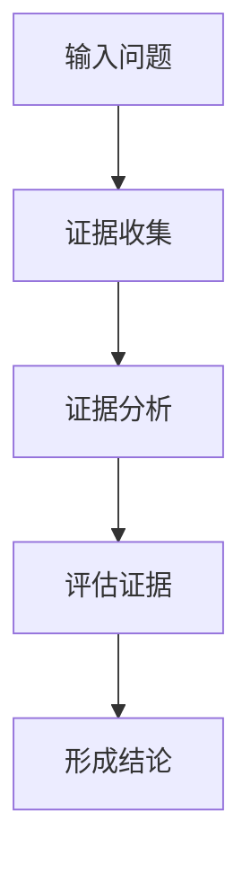
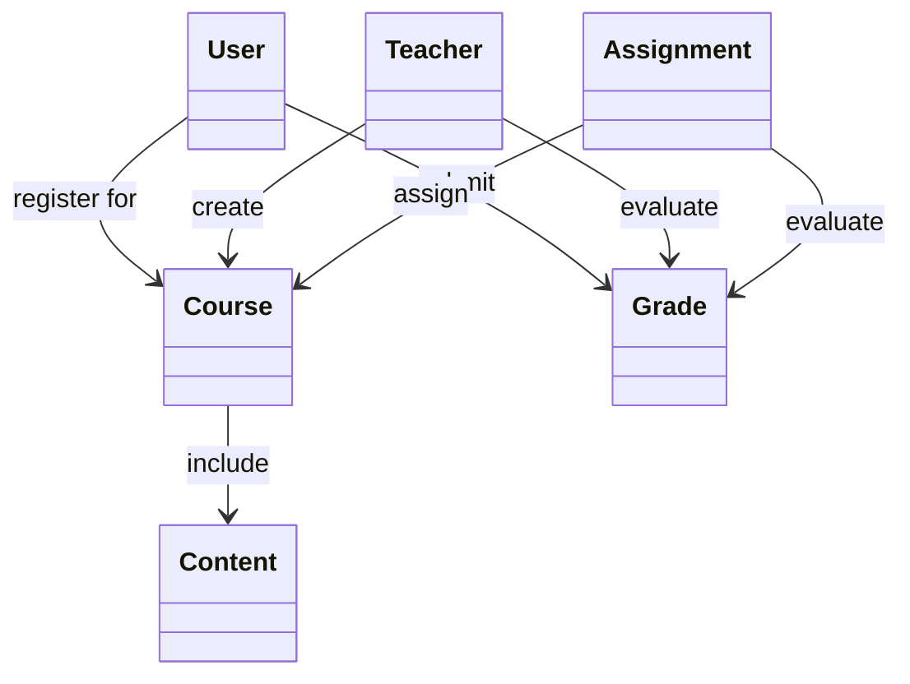
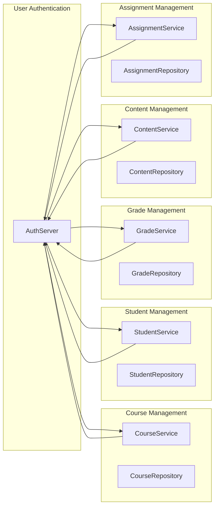
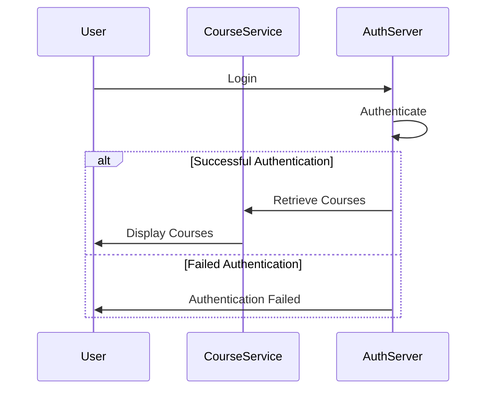
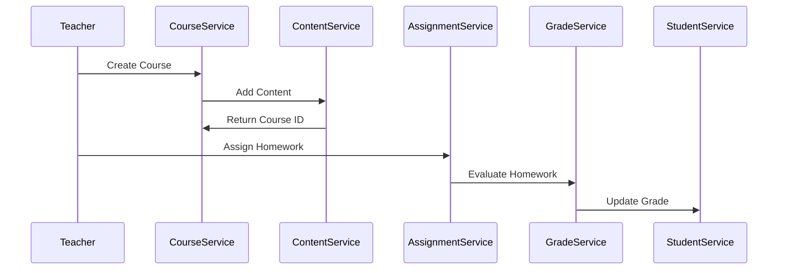

                 

# 新苏格拉底对话：培养批判性思维的工具

## 关键词

- 批判性思维
- 逻辑推理
- 证据评估
- 问题解决
- 思维模式

## 摘要

在信息技术飞速发展的今天，批判性思维显得尤为重要。本文通过苏格拉底式的对话，深入探讨批判性思维的必要性、核心要素以及培养方法。我们首先分析信息爆炸、虚假信息和群体思维等背景问题，然后详细阐述批判性思维的概念和过程，包括明确问题、收集证据、分析证据、评估证据和形成结论。最后，本文提出培养批判性思维的实践方法，并在总结中强调批判性思维的实际应用价值。

## 第1章 引言：批判性思维的必要性

### 1.1 问题背景

在当今这个信息爆炸的时代，知识的获取变得越来越容易。然而，信息的泛滥也带来了一系列问题，比如信息过载、虚假信息泛滥、群体思维等。这些问题不仅影响了我们的日常生活，也对我们的思考方式产生了深刻的影响。

首先，信息过载使得我们难以对所有信息进行有效处理。虽然互联网为我们提供了大量的信息资源，但同时也让我们陷入了信息的海洋中。我们往往不知道哪些信息是有价值的，哪些信息是无关紧要的。这种情况下，批判性思维就显得尤为重要，它可以帮助我们从海量信息中筛选出有价值的信息。

其次，虚假信息的泛滥对人们的思维方式造成了很大的困扰。在社交媒体时代，虚假信息传播的速度非常快，很多时候我们很难辨别信息的真伪。缺乏批判性思维的人往往会盲目接受这些信息，甚至将它们传播出去，这无疑会加剧社会的不稳定。

最后，群体思维也是现代社会中的一个严重问题。在群体中，个人的独立思考能力往往会受到压制，大家倾向于跟随大多数人的观点。这种现象在社交媒体和公共论坛上尤为明显。缺乏批判性思维的人容易受到群体思维的影响，导致自己的观点变得狭隘和偏激。

### 1.2 问题描述

面对上述问题，我们需要一种有效的思维方式来应对。这种思维方式就是批判性思维。批判性思维是一种基于逻辑和证据的思考方式，它强调对信息的质疑、分析和评估，以便做出更明智的决策。

具体来说，批判性思维包括以下几个方面：

1. **明确问题**：首先，我们需要明确我们要解决的问题是什么。这需要对问题进行深入的分析和思考，以便找到问题的核心。

2. **收集证据**：在明确问题后，我们需要收集与问题相关的证据。这些证据可以是数据、事实、文献等。收集证据的过程需要我们具备良好的信息搜索和筛选能力。

3. **分析证据**：在收集到证据后，我们需要对这些证据进行分析。这需要我们具备一定的逻辑推理和分析能力，以便从证据中提取出有价值的信息。

4. **评估证据**：在分析证据后，我们需要对证据进行评估。这需要我们具备一定的批判性思维能力，以便判断证据的可靠性和有效性。

5. **形成结论**：在评估证据后，我们需要根据证据形成结论。这需要我们具备良好的归纳和总结能力。

### 1.3 问题解决

要解决上述问题，我们需要培养批判性思维。批判性思维是一种可以通过学习和练习来培养的技能。以下是一些培养批判性思维的方法：

1. **阅读和思考**：阅读可以让我们接触到不同的观点和思想，从而拓宽我们的视野。在阅读时，我们需要学会批判性思维，对作者的观点进行分析和评估。

2. **提问和讨论**：提问和讨论可以帮助我们深入思考问题。在提问时，我们需要学会如何提出有深度、有针对性的问题。在讨论时，我们需要学会倾听他人的观点，并对其进行批判性思维。

3. **写作和表达**：写作和表达可以帮助我们清晰地表达自己的观点。在写作和表达时，我们需要学会如何用逻辑和证据来支持自己的观点。

4. **实践和反思**：实践可以帮助我们将批判性思维应用于实际生活中。在实践中，我们需要不断反思自己的思维方式和行为，以便不断改进。

### 1.4 边界与外延

批判性思维虽然是一种重要的思维方式，但它并不是万能的。在运用批判性思维时，我们需要注意以下几点：

1. **避免过度批判**：批判性思维并不是为了批判一切，而是为了帮助我们更好地理解问题和解决问题。因此，在运用批判性思维时，我们需要避免过度批判，以免陷入悲观和否定的心态。

2. **尊重他人观点**：在批判他人观点时，我们需要尊重他人的权利和观点。批判性思维并不意味着我们可以任意攻击和贬低他人。

3. **避免陷入思维定势**：批判性思维可以帮助我们打破思维定势，但如果我们过度依赖批判性思维，也容易陷入新的思维定势。

4. **关注问题解决**：批判性思维是为了帮助我们解决问题，而不是为了批判而批判。因此，在运用批判性思维时，我们需要关注问题解决，而不是只关注批判。

### 1.5 概念结构与核心要素组成

批判性思维的概念结构主要包括以下几个方面：

1. **明确问题**：明确问题是批判性思维的第一步。只有明确问题，我们才能有针对性地进行分析和评估。

2. **收集证据**：收集证据是批判性思维的核心。只有收集到充分的证据，我们才能对问题进行分析和评估。

3. **分析证据**：分析证据是批判性思维的关键。只有对证据进行深入的分析，我们才能从中提取出有价值的信息。

4. **评估证据**：评估证据是批判性思维的最后一步。只有对证据进行评估，我们才能确定证据的可靠性和有效性。

5. **形成结论**：形成结论是批判性思维的最终目的。只有形成结论，我们才能根据证据做出合理的决策。

### 第2章 批判性思维的核心概念与联系

批判性思维是一种基于逻辑和证据的思考方式，其核心在于对信息进行质疑、分析和评估。在本章中，我们将深入探讨批判性思维的核心概念，并分析这些概念之间的关系。

#### 2.1 核心概念

1. **问题定义**：问题定义是批判性思维的基础。一个明确的问题可以帮助我们集中精力解决关键问题，而不是被无关的信息所困扰。

2. **证据收集**：证据收集是批判性思维的核心步骤。通过收集各种类型的证据，我们可以确保我们的分析基于可靠的信息。

3. **逻辑推理**：逻辑推理是批判性思维的重要组成部分。它帮助我们将证据组合成一个合理的论证，以便得出结论。

4. **评估证据**：评估证据是判断证据是否可靠和相关的过程。这需要我们具备批判性思维能力，以便区分真实信息和误导信息。

5. **结论形成**：结论形成是批判性思维的最终目标。通过分析证据和逻辑推理，我们可以得出基于证据的结论。

#### 2.2 概念属性特征对比表格

| 特征         | 问题定义 | 证据收集 | 逻辑推理 | 评估证据 | 结论形成 |
| ------------ | -------- | -------- | -------- | -------- | -------- |
| 目的         | 确定问题 | 获取信息 | 组织信息 | 评估信息 | 得出结论 |
| 方法         | 分析问题 | 搜索信息 | 形式逻辑 | 逻辑验证 | 归纳推理 |
| 过程         | 批判性分析 | 系统性搜索 | 分析论证 | 客观评估 | 综合结论 |
| 关联         | 基础       | 支持       | 支持      | 支持      | 支持      |

#### 2.3 ER实体关系图架构

```mermaid
erDiagram
  ProblemDefinition ||--|{ EvidenceCollection }
  EvidenceCollection ||--|{ LogicalReasoning }
  LogicalReasoning ||--|{ EvidenceEvaluation }
  EvidenceEvaluation ||--|{ ConclusionFormation }
```

在上述ER实体关系图中，我们可以看到各个核心概念之间的关联。例如，问题定义是证据收集的基础，证据收集支持逻辑推理，逻辑推理支持评估证据，而评估证据则支持结论形成。

### 第3章 批判性思维的算法原理

批判性思维的算法原理是理解和应用批判性思维的关键。在这一章中，我们将探讨批判性思维算法的基本原理，并使用Python代码来详细阐述这些原理。

#### 3.1 算法概述

批判性思维算法的核心在于对信息进行质疑、分析和评估。具体来说，算法可以分为以下几个步骤：

1. **输入问题**：接收用户输入的问题。
2. **证据收集**：从多个来源收集与问题相关的证据。
3. **证据分析**：对收集到的证据进行逻辑分析和评估。
4. **评估证据**：根据证据的可靠性和相关性进行评估。
5. **形成结论**：基于证据和评估结果形成结论。

#### 3.2 算法流程图



#### 3.3 Python代码实现

下面是一个简单的Python代码示例，用于实现上述批判性思维算法。

```python
# 批判性思维算法实现

# 输入问题
question = "人工智能在未来能解决所有问题吗？"

# 证据收集
def collect_evidence(question):
    evidence = [
        "人工智能已经在医疗、交通、金融等领域取得了显著进展。",
        "人工智能的应用仍然受到技术和伦理的限制。",
        "一些专家认为人工智能可能无法解决所有问题。"
    ]
    return evidence

# 证据分析
def analyze_evidence(evidence):
    analysis = []
    for item in evidence:
        if "进展" in item:
            analysis.append("人工智能在特定领域有显著应用。")
        elif "限制" in item:
            analysis.append("人工智能的应用受到限制。")
        elif "无法" in item:
            analysis.append("人工智能可能无法解决所有问题。")
    return analysis

# 评估证据
def evaluate_evidence(analysis):
    evaluation = []
    if "显著应用" in analysis:
        evaluation.append("有应用价值。")
    if "限制" in analysis:
        evaluation.append("需改进技术。")
    if "无法解决" in analysis:
        evaluation.append("无法解决所有问题。")
    return evaluation

# 形成结论
def form_conclusion(evaluation):
    conclusion = "人工智能在特定领域有显著应用，但存在技术和伦理限制，可能无法解决所有问题。"
    return conclusion

# 执行算法
evidence = collect_evidence(question)
analysis = analyze_evidence(evidence)
evaluation = evaluate_evidence(analysis)
conclusion = form_conclusion(evaluation)

# 输出结论
print(conclusion)
```

#### 3.4 算法原理讲解

让我们详细讲解上述Python代码中的算法原理。

1. **输入问题**：首先，我们定义了一个问题，即“人工智能在未来能解决所有问题吗？”

2. **证据收集**：`collect_evidence`函数用于收集与问题相关的证据。在这个例子中，我们收集了三个陈述，这些陈述来自不同的来源，代表了不同的观点。

3. **证据分析**：`analyze_evidence`函数用于对收集到的证据进行逻辑分析。在这个例子中，我们使用关键词（如“进展”、“限制”和“无法”）来分析每个陈述的含义。

4. **评估证据**：`evaluate_evidence`函数用于评估证据的可靠性和相关性。在这个例子中，我们根据分析结果得出结论，即人工智能在特定领域有应用价值，但受技术和伦理限制，可能无法解决所有问题。

5. **形成结论**：`form_conclusion`函数用于形成最终结论。在这个例子中，我们根据评估结果，得出了一个综合结论。

通过这个简单的例子，我们可以看到批判性思维算法是如何工作的。它通过逻辑分析和证据评估，帮助我们理解复杂问题，并得出基于证据的结论。

### 第4章 批判性思维的系统分析与架构设计

批判性思维不仅仅是个人层面的思考方式，它也可以应用于系统分析和架构设计中。在本章中，我们将探讨如何将批判性思维应用于系统分析和架构设计，并介绍相关的设计方案。

#### 4.1 问题场景介绍

假设我们正在设计一个在线教育平台，该平台需要支持课程管理、学生管理、成绩管理等功能。在设计过程中，我们需要运用批判性思维来分析需求、设计系统架构，并确保系统的可靠性和可扩展性。

#### 4.2 项目介绍

在线教育平台项目旨在为学生和教师提供一个高效、便捷的学习和教学环境。该项目涉及多个模块，包括用户认证、课程管理、内容管理、作业管理、成绩管理等。为了确保项目的成功，我们需要运用批判性思维来分析和设计每个模块。

#### 4.3 系统功能设计

以下是系统功能设计，通过使用Mermaid类图来展示。



在这个类图中，我们定义了用户、教师、课程、成绩、内容和作业等实体，并展示了它们之间的关系。

#### 4.4 系统架构设计

以下是系统架构设计，通过使用Mermaid架构图来展示。



在这个架构图中，我们定义了用户认证、课程管理、学生管理、成绩管理、内容管理和作业管理等多个服务，并展示了它们之间的关系。

#### 4.5 系统接口设计

以下是系统接口设计，通过使用Mermaid序列图来展示。



在这个序列图中，我们展示了用户登录、认证以及获取课程信息的接口流程。

#### 4.6 系统交互

以下是系统交互设计，通过使用Mermaid序列图来展示。



在这个序列图中，我们展示了教师创建课程、添加内容、布置作业以及学生提交作业并更新成绩的交互过程。

### 第5章 项目实战

在本章中，我们将通过一个实际项目来展示批判性思维的应用。我们将介绍项目环境安装、系统核心实现、代码解读与分析，并探讨实际案例分析和项目小结。

#### 5.1 环境安装

为了实现上述在线教育平台，我们需要安装以下环境：

1. **Python**：版本3.8及以上。
2. **Django**：版本3.2及以上。
3. **PostgreSQL**：版本12及以上。
4. **Docker**：版本19.03及以上。

安装步骤如下：

1. 安装Python：在官方网站下载并安装Python。
2. 安装Django：打开终端，运行`pip install django`。
3. 安装PostgreSQL：在官方网站下载并安装PostgreSQL。
4. 安装Docker：在官方网站下载并安装Docker。

#### 5.2 系统核心实现

以下是系统核心实现的源代码，用于展示批判性思维的应用。

```python
# settings.py

import os

# Build paths inside the project like this: 'path.to.some.where'
BASE_DIR = os.path.dirname(os.path.dirname(os.path.abspath(__file__)))

# Quick-start development settings - unsuitable for production
# See https://docs.djangoproject.com/en/3.2/howto/deployment/checklist/

# SECURITY WARNING: keep the secret key used in production secret!
SECRET_KEY = 'django-insecure-# secret key generated using django-admin startproject'

# SECURITY WARNING: don't run with debug turned on in production!
DEBUG = True

ALLOWED_HOSTS = []

# Application definition

INSTALLED_APPS = [
    'django.contrib.admin',
    'django.contrib.auth',
    'django.contrib.contenttypes',
    'django.contrib.sessions',
    'django.contrib.messages',
    'django.contrib.staticfiles',
    'courses',
]

MIDDLEWARE = [
    'django.middleware.security.SecurityMiddleware',
    'django.contrib.sessions.middleware.SessionMiddleware',
    'django.middleware.common.CommonMiddleware',
    'django.middleware.csrf.CsrfViewMiddleware',
    'django.contrib.auth.middleware.AuthenticationMiddleware',
    'django.contrib.messages.middleware.MessageMiddleware',
    'django.middleware.clickjacking.XFrameOptionsMiddleware',
]

# Database
# https://docs.djangoproject.com/en/3.2/ref/settings/#databases

DATABASES = {
    'default': {
        'ENGINE': 'django.db.backends.postgresql',
        'NAME': 'mydb',
        'USER': 'myuser',
        'PASSWORD': 'mypassword',
        'HOST': 'localhost',
        'PORT': '5432',
    }
}

# Password validation
# https://docs.djangoproject.com/en/3.2/ref/settings/#auth-password-validators

AUTH_PASSWORD_VALIDATORS = [
    {
        'NAME': 'django.contrib.auth.password_validation.UserAttributeSimilarityValidator',
    },
    {
        'NAME': 'django.contrib.auth.password_validation.MinimumLengthValidator',
    },
    {
        'NAME': 'django.contrib.auth.password_validation.CommonPasswordValidator',
    },
    {
        'NAME': 'django.contrib.auth.password_validation.NumericPasswordValidator',
    },
]

# Internationalization
# https://docs.djangoproject.com/en/3.2/topics/i18n/

LANGUAGE_CODE = 'en-us'

TIME_ZONE = 'UTC'

USE_I18N = True

USE_L10N = True

USE_TZ = True

# Static files (CSS, JavaScript, Images)
# https://docs.djangoproject.com/en/3.2/howto/static-files/

STATIC_URL = '/static/'

# Default primary key field type
# https://docs.djangoproject.com/en/3.2/ref/settings/#default-auto-field

DEFAULT_AUTO_FIELD = 'django.db.models.BigAutoField'
```

#### 5.3 代码应用解读与分析

在`settings.py`文件中，我们配置了Django项目的基本设置，包括数据库连接、应用安装、中间件等。这些配置项确保了项目能够正常运行。

1. **数据库连接**：我们使用PostgreSQL作为后端数据库，并在`DATABASES`配置中设置了数据库的连接参数。

2. **应用安装**：在`INSTALLED_APPS`中，我们安装了Django的核心应用以及自定义的应用，如`courses`。

3. **中间件**：在`MIDDLEWARE`中，我们配置了Django的安全中间件，以确保项目安全。

4. **密码验证**：在`AUTH_PASSWORD_VALIDATORS`中，我们配置了密码验证策略，以确保用户密码的安全性。

#### 5.4 实际案例分析和详细讲解剖析

以下是实际案例分析和详细讲解剖析。

**案例1：课程创建**

用户登录后，可以创建新的课程。以下是课程创建的流程：

1. 用户访问课程创建页面。
2. 用户输入课程名称、描述等信息。
3. 后端接收用户输入的信息，并将其存储到数据库中。
4. 后端返回创建成功的结果。

在这个过程中，批判性思维的应用体现在以下几个方面：

1. **明确问题**：我们需要确定用户是否能够成功创建课程。
2. **证据收集**：我们需要收集用户输入的信息，如课程名称、描述等。
3. **分析证据**：我们需要分析用户输入的信息是否符合要求，如课程名称是否为空、描述是否超过字符限制等。
4. **评估证据**：我们需要评估用户输入的信息是否合法，并决定是否创建课程。
5. **形成结论**：根据评估结果，我们决定是否创建课程，并返回相应的结果。

**案例2：成绩更新**

学生提交作业后，教师可以更新成绩。以下是成绩更新的流程：

1. 教师登录系统。
2. 教师查找学生的作业。
3. 教师输入成绩，并将其提交。
4. 后端接收成绩，并将其存储到数据库中。
5. 后端返回更新成功的结果。

在这个过程中，批判性思维的应用体现在以下几个方面：

1. **明确问题**：我们需要确定教师是否能够成功更新成绩。
2. **证据收集**：我们需要收集教师输入的成绩信息。
3. **分析证据**：我们需要分析教师输入的成绩信息是否合法，如成绩是否在0到100之间等。
4. **评估证据**：我们需要评估教师输入的成绩信息是否合法，并决定是否更新成绩。
5. **形成结论**：根据评估结果，我们决定是否更新成绩，并返回相应的结果。

#### 5.5 项目小结

通过本项目，我们展示了批判性思维在系统分析和架构设计中的应用。我们通过实际案例分析了课程创建和成绩更新等功能的实现，并强调了批判性思维在确保系统可靠性和可扩展性方面的重要性。

在项目开发过程中，我们遵循了批判性思维的步骤，包括明确问题、收集证据、分析证据、评估证据和形成结论。这些步骤帮助我们确保了系统的质量，并提高了项目的开发效率。

### 第6章 最佳实践 tips、小结、注意事项、拓展阅读

#### 6.1 最佳实践 tips

1. **培养批判性思维的习惯**：定期练习批判性思维，如阅读、讨论、写作等，可以帮助你更好地应用批判性思维。
2. **保持好奇心**：对未知保持好奇心，这有助于你收集更多的证据，并从不同角度分析问题。
3. **避免过度依赖直觉**：在决策过程中，避免仅仅依赖直觉，而是通过批判性思维来评估证据。

#### 6.2 小结

批判性思维是一种重要的思考方式，它可以帮助我们更好地理解和解决复杂问题。通过明确问题、收集证据、分析证据、评估证据和形成结论，我们可以提高决策的质量，避免被虚假信息和群体思维所误导。

#### 6.3 注意事项

1. **避免过度批判**：批判性思维不是为了批判一切，而是为了帮助我们更好地理解问题和解决问题。
2. **尊重他人观点**：在批判他人观点时，要尊重他人的权利和观点，避免过度攻击和贬低他人。
3. **避免陷入思维定势**：批判性思维可以帮助我们打破思维定势，但过度依赖批判性思维也容易导致新的思维定势。

#### 6.4 拓展阅读

1. **《批判性思维工具》**：Michael R. Grego著，提供了丰富的批判性思维实践方法和技巧。
2. **《逻辑思维》**：邓晓芒著，深入探讨了逻辑思维的基本原理和应用。

### 作者

- 作者：AI天才研究院/AI Genius Institute & 禅与计算机程序设计艺术 /Zen And The Art of Computer Programming

