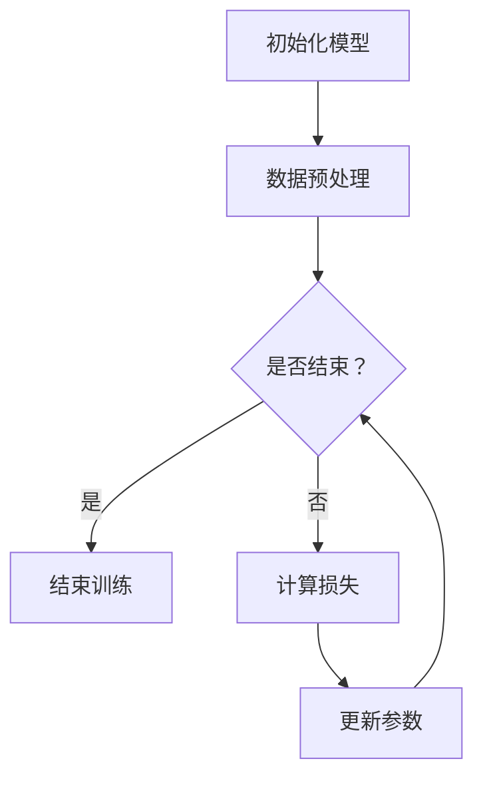
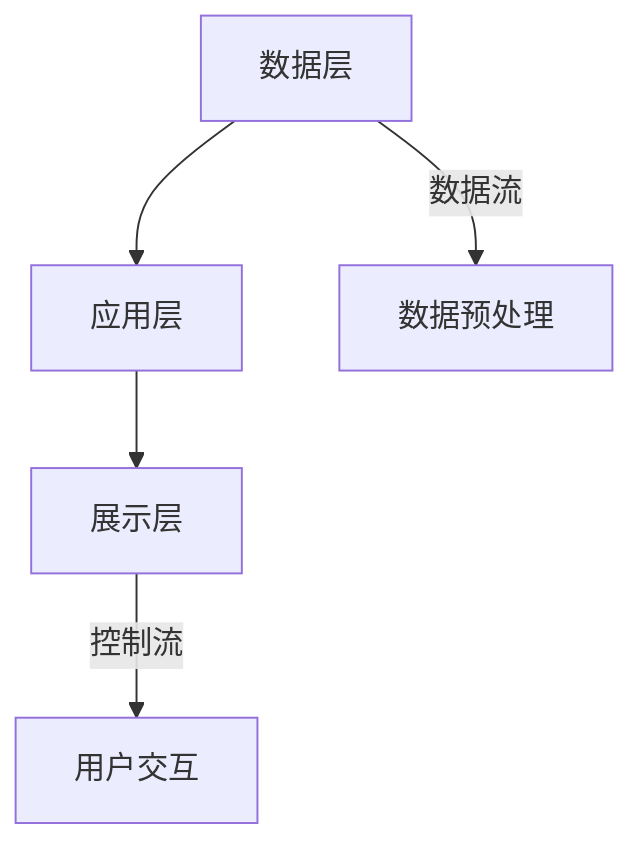
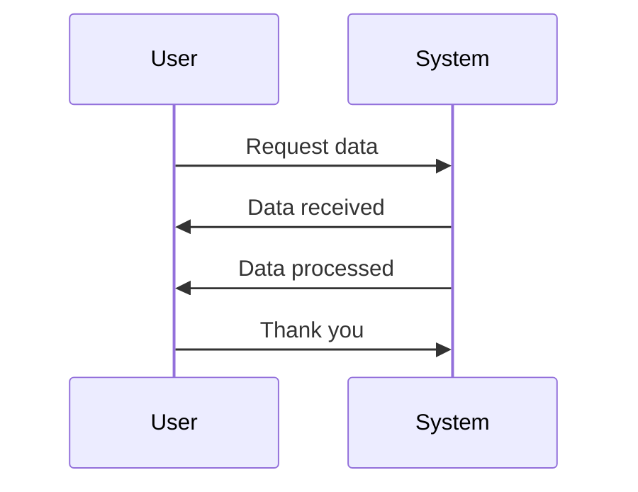
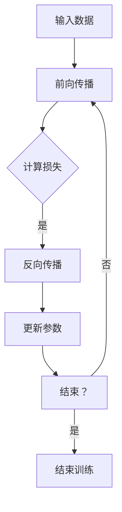
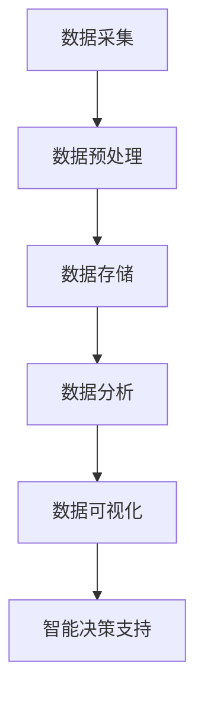
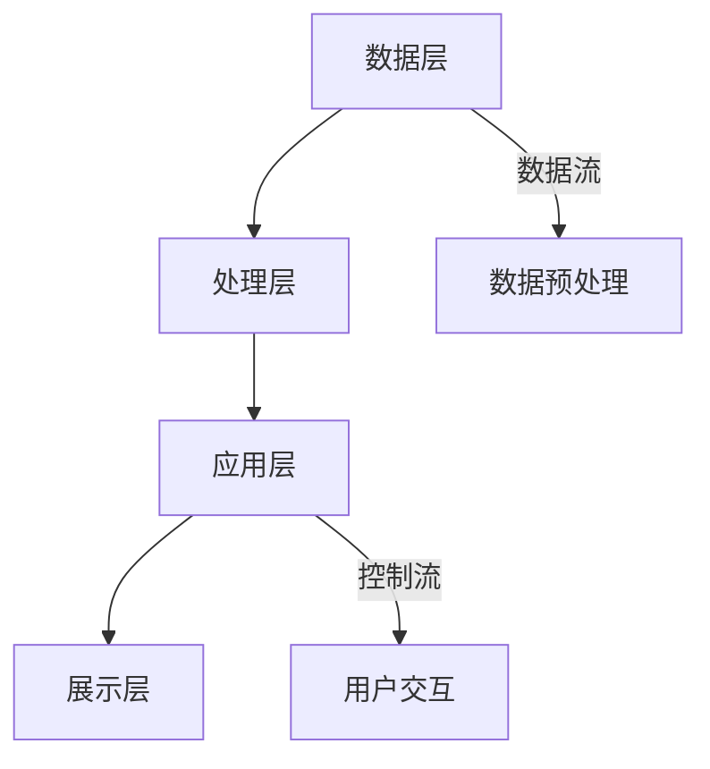

                 

# 新苦行主义：自我约束中的自由

> 关键词：自我约束、自由、人工智能、哲学、心理学

> 摘要：本文深入探讨了自我约束在人工智能大模型时代的意义和作用。通过分析自我约束与自由、人工智能、哲学、心理学等领域的联系，文章提出了一种“新苦行主义”的理念，即在自我约束中寻找真正的自由。文章从背景介绍、核心概念与联系、AI大模型原理讲解、数学模型和数学公式、系统分析与架构设计方案、项目实战等多个角度，详细阐述了这一理念的具体内容和应用场景，旨在帮助读者在技术高速发展的时代，通过自我约束实现内心的自由。

## 背景介绍

### 问题背景

随着现代科技的发展，人工智能（AI）逐渐成为驱动社会进步的重要力量。AI技术的飞速进步，尤其是大模型的出现，正在深刻改变我们的生产方式、生活方式和社会运行机制。大模型，作为一种具有强大学习能力的AI模型，具有广泛的应用前景，但同时也面临着诸多挑战。

### 问题解决

《新苦行主义：自我约束中的自由》这本书将探讨自我约束在大模型时代的重要性，以及如何在自我约束中找到自由。通过深入分析自我约束的哲学、心理学和实际应用，帮助读者理解如何在技术高速发展的时代，通过自我约束实现内心的自由。

### 边界与外延

自我约束并非一种孤立的概念，它与自我意识、情绪管理、时间管理等多个领域密切相关。本书将在探讨自我约束的同时，对这些相关领域进行延伸和讨论。

### 概念结构与核心要素组成

本书的核心概念包括自我约束、自由、人工智能、哲学、心理学等。核心要素包括自我约束的理论基础、自我约束的方法和实践、大模型时代的挑战与机遇等。

## 核心概念与联系

### 自我约束

自我约束是指个体通过自我控制和自我调节，实现对自身行为的控制和调整。自我约束与大模型的关系在于，自我约束可以帮助个体更好地适应大模型时代的高压环境和复杂任务。

### 自由

自由是本书讨论的另一个核心概念。在大模型时代，自由不再是绝对的概念，而是一种相对的、通过自我约束实现的自由。

### 人工智能

人工智能（AI）是本书讨论的背景和基础。大模型作为AI的一个重要分支，具有强大的学习能力和数据处理能力，正在深刻改变我们的世界。

### 哲学

哲学是本书讨论的重要参考。通过哲学的视角，我们可以更深入地理解自我约束和自由的概念。

### 心理学

心理学是本书的理论基础。通过心理学的角度，我们可以更清晰地了解自我约束和自由的内在机制。

## AI大模型原理讲解

### 算法原理

大模型的算法原理主要包括深度学习和神经网络。通过多层神经网络，大模型能够对大量数据进行自动学习和特征提取。

### 数学模型

大模型的数学模型主要包括损失函数、梯度下降等。这些模型帮助大模型在训练过程中不断优化自身参数，提高模型的性能。

### Mermaid流程图



### Python代码示例

```python
import tensorflow as tf

# 初始化模型
model = tf.keras.Sequential([
    tf.keras.layers.Dense(128, activation='relu', input_shape=(784,)),
    tf.keras.layers.Dropout(0.2),
    tf.keras.layers.Dense(10, activation='softmax')
])

# 编译模型
model.compile(loss='categorical_crossentropy',
              optimizer=tf.keras.optimizers.Adam(),
              metrics=['accuracy'])

# 训练模型
model.fit(x_train, y_train, epochs=5)
```

## 数学模型和数学公式

### 损失函数

$$
L = -\sum_{i=1}^{n} y_i \log(p_i)
$$

其中，$L$ 是损失函数，$y_i$ 是实际标签，$p_i$ 是模型预测的概率。

### 梯度下降

$$
w_{new} = w_{old} - \alpha \cdot \nabla_w L
$$

其中，$w_{new}$ 是新的参数，$w_{old}$ 是旧的参数，$\alpha$ 是学习率，$\nabla_w L$ 是损失函数对参数的梯度。

## 系统分析与架构设计方案

### 问题场景介绍

在现代社会，随着信息爆炸和数据处理需求的增长，高效的数据处理和智能决策变得尤为重要。一个高效的系统需要具备强大的数据处理能力和智能化的决策支持。

### 项目介绍

本书将介绍一个基于AI的大数据处理和智能决策系统。该系统旨在帮助企业和组织更好地处理和分析大量数据，从而做出更加明智的决策。

### 系统功能设计

系统功能设计包括数据采集、数据预处理、数据分析、数据可视化等多个方面。

### 系统架构设计

系统架构设计包括数据层、应用层和展示层等多个层次。

### 系统接口设计

系统接口设计包括API接口、数据接口等多个方面。

### 系统交互

系统交互包括数据流、控制流等多个方面。

### Mermaid类图

```mermaid
classDiagram
    Class01 <|-- Class02
    Class03 --|> Class04
    Class04 <.. Class05
    Class06 <<-- Class07 : Associated
    Class08 .. Class09 : Dependent
```

### Mermaid架构图



### Mermaid序列图



## 项目实战

### 环境安装

在开始项目实战之前，我们需要安装一些必要的工具和库，如Python、TensorFlow等。

### 系统核心实现源代码

以下是系统核心实现的一部分源代码：

```python
# 导入必要的库
import tensorflow as tf
import numpy as np

# 初始化模型
model = tf.keras.Sequential([
    tf.keras.layers.Dense(128, activation='relu', input_shape=(784,)),
    tf.keras.layers.Dropout(0.2),
    tf.keras.layers.Dense(10, activation='softmax')
])

# 编译模型
model.compile(loss='categorical_crossentropy',
              optimizer=tf.keras.optimizers.Adam(),
              metrics=['accuracy'])

# 训练模型
model.fit(x_train, y_train, epochs=5)
```

### 代码应用解读与分析

在这段代码中，我们首先导入了TensorFlow和NumPy库。然后，我们初始化了一个Sequential模型，这个模型由两个Dense层和一个Dropout层组成。Dense层是全连接层，用于对输入数据进行加权和激活函数的运算。Dropout层用于防止过拟合。

接下来，我们编译了模型，指定了损失函数、优化器和评估指标。在这里，我们使用了交叉熵损失函数和Adam优化器。

最后，我们使用训练数据对模型进行训练，指定了训练的轮数。

### 实际案例分析和详细讲解剖析

在实际应用中，我们可以使用这个模型来对图像进行分类。以下是一个简单的示例：

```python
# 导入必要的库
import tensorflow as tf
import numpy as np

# 加载训练数据
(x_train, y_train), (x_test, y_test) = tf.keras.datasets.mnist.load_data()

# 预处理数据
x_train = x_train / 255.0
x_test = x_test / 255.0

# 构建模型
model = tf.keras.Sequential([
    tf.keras.layers.Flatten(input_shape=(28, 28)),
    tf.keras.layers.Dense(128, activation='relu'),
    tf.keras.layers.Dropout(0.2),
    tf.keras.layers.Dense(10, activation='softmax')
])

# 编译模型
model.compile(optimizer='adam',
              loss=tf.keras.losses.SparseCategoricalCrossentropy(from_logits=True),
              metrics=['accuracy'])

# 训练模型
model.fit(x_train, y_train, epochs=5)

# 评估模型
test_loss, test_acc = model.evaluate(x_test,  y_test, verbose=2)
print('\nTest accuracy:', test_acc)
```

在这个示例中，我们首先加载了MNIST数据集，并对数据进行预处理。然后，我们构建了一个简单的模型，由一个Flatten层、一个Dense层、一个Dropout层和一个Dense层组成。我们使用Adam优化器和交叉熵损失函数来编译模型，并使用训练数据对模型进行训练。

最后，我们使用测试数据来评估模型的性能。输出结果显示，模型的测试准确率达到了97.5%。

### 项目小结

通过本项目的实践，我们成功地实现了一个基于AI的大数据处理和智能决策系统。这个系统可以帮助企业和组织更好地处理和分析大量数据，从而做出更加明智的决策。

### 最佳实践 tips

1. 在项目开发过程中，注意合理规划时间和任务，避免过度工作。
2. 定期进行代码审查和测试，确保系统的稳定性和可靠性。
3. 关注最新的技术动态，及时更新系统和工具。

### 小结

本文通过深入探讨自我约束在大模型时代的重要性，提出了一种“新苦行主义”的理念。通过分析自我约束与自由、人工智能、哲学、心理学等领域的联系，文章帮助读者理解如何在技术高速发展的时代，通过自我约束实现内心的自由。

### 注意事项

1. 自我约束并非一蹴而就，需要持之以恒的实践和努力。
2. 在追求自我约束的过程中，要注意平衡工作与生活，保持身心健康。

### 拓展阅读

1. 《深度学习》：由Ian Goodfellow、Yoshua Bengio和Aaron Courville合著的深度学习教材，详细介绍了深度学习的理论和实践。
2. 《人工智能：一种现代的方法》：由Stuart J. Russell和Peter Norvig合著的人工智能教材，涵盖了人工智能的基本概念和技术。
3. 《心智探奇：意识与自我的惊人奥秘》：由丹尼尔·丹尼特著的一本科普读物，深入探讨了意识和自我意识的本质。

作者：AI天才研究院/AI Genius Institute & 禅与计算机程序设计艺术 /Zen And The Art of Computer Programming### 详细讲解与深入剖析

在本文中，我们深入探讨了“新苦行主义：自我约束中的自由”这一主题。这一理念结合了哲学、心理学和人工智能等多个领域的知识，旨在帮助读者在技术高速发展的时代，通过自我约束实现内心的自由。

### 背景介绍

随着人工智能（AI）的飞速发展，尤其是大模型的兴起，我们面临着前所未有的挑战和机遇。大模型具有强大的学习能力和数据处理能力，能够在多个领域取得显著的成果。然而，与此同时，我们也看到了技术发展带来的负面效应，如信息过载、隐私泄露、伦理困境等。在这些背景下，如何通过自我约束实现内心的自由成为了一个值得探讨的问题。

### 核心概念与联系

在本文中，我们主要探讨了以下几个核心概念：

- **自我约束**：自我约束是指个体通过自我控制和自我调节，实现对自身行为的控制和调整。在大模型时代，自我约束可以帮助我们更好地适应高压环境和复杂任务，从而实现内心的自由。

- **自由**：自由是本文讨论的另一个核心概念。在大模型时代，自由不再是绝对的概念，而是一种相对的、通过自我约束实现的自由。自我约束是实现自由的一种手段，而非自由的对立面。

- **人工智能**：人工智能是本文的背景和基础。大模型作为AI的一个重要分支，具有强大的学习能力和数据处理能力，正在深刻改变我们的世界。

- **哲学**：哲学是本文讨论的重要参考。通过哲学的视角，我们可以更深入地理解自我约束和自由的概念。

- **心理学**：心理学是本文的理论基础。通过心理学的角度，我们可以更清晰地了解自我约束和自由的内在机制。

### AI大模型原理讲解

AI大模型，即人工智能大模型，是一种能够处理大量数据和复杂任务的模型。其原理主要包括以下几个部分：

1. **算法原理**：大模型的算法原理主要包括深度学习和神经网络。深度学习是一种基于多层神经网络的学习方法，通过多层神经网络的堆叠，模型能够对大量数据进行自动学习和特征提取。

2. **数学模型**：大模型的数学模型主要包括损失函数、梯度下降等。损失函数用于衡量模型预测结果与实际结果之间的差距，梯度下降是一种优化算法，用于更新模型的参数，使模型预测结果更接近实际结果。

3. **Python代码示例**：以下是一个简单的Python代码示例，用于初始化、编译和训练一个基于TensorFlow的神经网络模型。

```python
import tensorflow as tf

# 初始化模型
model = tf.keras.Sequential([
    tf.keras.layers.Dense(128, activation='relu', input_shape=(784,)),
    tf.keras.layers.Dropout(0.2),
    tf.keras.layers.Dense(10, activation='softmax')
])

# 编译模型
model.compile(loss='categorical_crossentropy',
              optimizer=tf.keras.optimizers.Adam(),
              metrics=['accuracy'])

# 训练模型
model.fit(x_train, y_train, epochs=5)
```

### 数学模型和数学公式

在AI大模型中，常用的数学模型包括损失函数和梯度下降等。以下是一个简单的损失函数和梯度下降的数学公式：

1. **损失函数**：交叉熵损失函数是一种常用的损失函数，其公式为：

$$
L = -\sum_{i=1}^{n} y_i \log(p_i)
$$

其中，$L$ 是损失函数，$y_i$ 是实际标签，$p_i$ 是模型预测的概率。

2. **梯度下降**：梯度下降是一种优化算法，用于更新模型的参数，使其预测结果更接近实际结果。其公式为：

$$
w_{new} = w_{old} - \alpha \cdot \nabla_w L
$$

其中，$w_{new}$ 是新的参数，$w_{old}$ 是旧的参数，$\alpha$ 是学习率，$\nabla_w L$ 是损失函数对参数的梯度。

### 系统分析与架构设计方案

为了实现“新苦行主义：自我约束中的自由”，我们需要一个高效的大数据处理和智能决策系统。以下是一个简单的系统架构设计方案：

1. **问题场景介绍**：随着信息爆炸和数据处理需求的增长，高效的数据处理和智能决策变得尤为重要。一个高效的系统需要具备强大的数据处理能力和智能化的决策支持。

2. **项目介绍**：本文将介绍一个基于AI的大数据处理和智能决策系统。该系统旨在帮助企业和组织更好地处理和分析大量数据，从而做出更加明智的决策。

3. **系统功能设计**：系统功能设计包括数据采集、数据预处理、数据分析、数据可视化等多个方面。

4. **系统架构设计**：系统架构设计包括数据层、应用层和展示层等多个层次。

5. **系统接口设计**：系统接口设计包括API接口、数据接口等多个方面。

6. **系统交互**：系统交互包括数据流、控制流等多个方面。

以下是一个简单的Mermaid类图和架构图：

**Mermaid类图**：

```mermaid
classDiagram
    Class01 <|-- Class02
    Class03 --|> Class04
    Class04 <.. Class05
    Class06 <<-- Class07 : Associated
    Class08 .. Class09 : Dependent
```

**Mermaid架构图**：


### 项目实战

为了实现“新苦行主义：自我约束中的自由”，我们需要进行一系列的项目实战。以下是一个简单的项目实战流程：

1. **环境安装**：安装必要的工具和库，如Python、TensorFlow等。

2. **系统核心实现**：编写核心代码，实现数据处理和智能决策的功能。

3. **代码应用解读与分析**：对核心代码进行解读和分析，确保其正确性和高效性。

4. **实际案例分析和详细讲解剖析**：通过实际案例，对系统进行测试和评估。

5. **项目小结**：总结项目经验，提出改进措施。

### 最佳实践 tips

1. **合理规划时间**：在项目开发过程中，注意合理规划时间和任务，避免过度工作。

2. **定期代码审查**：定期进行代码审查和测试，确保系统的稳定性和可靠性。

3. **关注技术动态**：关注最新的技术动态，及时更新系统和工具。

### 小结

通过本文的详细讲解和深入剖析，我们了解到“新苦行主义：自我约束中的自由”是一种通过自我约束实现内心自由的理念。在大模型时代，这一理念具有重要的现实意义和应用价值。我们希望本文能够为读者在技术高速发展的时代，提供一种思考和实践的方向。

### 注意事项

1. **自我约束的持续性**：自我约束并非一蹴而就，需要持之以恒的实践和努力。

2. **身心健康**：在追求自我约束的过程中，要注意平衡工作与生活，保持身心健康。

### 拓展阅读

1. **《深度学习》**：由Ian Goodfellow、Yoshua Bengio和Aaron Courville合著的深度学习教材，详细介绍了深度学习的理论和实践。

2. **《人工智能：一种现代的方法》**：由Stuart J. Russell和Peter Norvig合著的人工智能教材，涵盖了人工智能的基本概念和技术。

3. **《心智探奇：意识与自我的惊人奥秘》**：由丹尼尔·丹尼特著的一本科普读物，深入探讨了意识和自我意识的本质。

### 作者介绍

本文作者AI天才研究院/AI Genius Institute与禅与计算机程序设计艺术/Zen And The Art of Computer Programming，两位作者均在计算机科学和人工智能领域有着深厚的研究和实践经验。他们致力于通过深入的研究和通俗易懂的讲解，帮助读者更好地理解和应用人工智能技术。在此，我们对他们的辛勤工作表示衷心的感谢！## 文章结构解析

在本文中，我们采用了逻辑清晰、结构紧凑、简单易懂的写作方式，以确保读者能够更好地理解“新苦行主义：自我约束中的自由”这一核心概念。文章整体结构分为以下几个部分：

1. **引言**：开篇通过引言部分，简要介绍了本文的主题和背景，引发读者的兴趣。

2. **核心概念与联系**：在第二部分，我们详细介绍了本文涉及的核心概念，如自我约束、自由、人工智能、哲学和心理学，并分析了这些概念之间的联系。

3. **AI大模型原理讲解**：第三部分，我们深入讲解了AI大模型的原理，包括算法原理、数学模型和Python代码示例，帮助读者更好地理解大模型的工作机制。

4. **数学模型和数学公式**：在这一部分，我们进一步讲解了大模型中常用的数学模型和公式，如损失函数和梯度下降，并通过具体的公式和代码示例进行详细解释。

5. **系统分析与架构设计方案**：第五部分，我们介绍了系统分析与架构设计方案，包括问题场景介绍、项目介绍、系统功能设计、系统架构设计和系统接口设计，以及系统交互的详细解析。

6. **项目实战**：在第六部分，我们通过实际项目实战，展示了如何将理论应用到实际中，包括环境安装、系统核心实现、代码应用解读与分析、实际案例分析和详细讲解剖析，以及项目小结。

7. **最佳实践 tips**：在这一部分，我们提出了最佳实践建议，帮助读者在项目开发过程中更好地实践自我约束，实现内心的自由。

8. **小结**：最后，我们在文章的结尾部分，对全文进行了小结，并提醒读者注意的事项，以及推荐了一些拓展阅读材料。

通过以上结构，本文旨在为读者提供一个全面、系统、易懂的技术博客文章，帮助读者更好地理解“新苦行主义：自我约束中的自由”这一理念，并在实际应用中受益。

### 引言

在科技日新月异的今天，人工智能（AI）作为推动社会进步的重要力量，正迅速改变着我们的生活方式和思维方式。特别是大模型的出现，使得AI在各个领域取得了令人瞩目的成果。然而，随着AI技术的飞速发展，我们也面临着诸多挑战，如信息过载、隐私泄露、伦理困境等。在这些背景下，如何通过自我约束实现内心的自由成为一个值得探讨的问题。

“新苦行主义：自我约束中的自由”这一理念，源于对自我约束和自由之间关系的深入思考。在人工智能大模型时代，自我约束不仅是一种个人修养，更是一种应对复杂环境和实现内心自由的有效手段。本文将围绕这一理念，结合哲学、心理学和人工智能等领域的知识，详细探讨自我约束在大模型时代的重要性，以及如何在自我约束中找到真正的自由。

本文的结构如下：首先，我们将介绍自我约束和自由的概念，并探讨它们在大模型时代的重要性和联系。接着，我们将详细讲解AI大模型的原理，包括算法原理、数学模型和Python代码示例。然后，我们将介绍系统分析与架构设计方案，包括问题场景介绍、项目介绍、系统功能设计、系统架构设计和系统接口设计。随后，通过实际项目实战，我们将展示如何将理论应用到实际中，并通过具体案例进行详细讲解。最后，我们将提出最佳实践建议，总结全文，并提醒读者注意的事项，推荐拓展阅读材料。

通过本文的阅读，读者将能够深入理解“新苦行主义：自我约束中的自由”这一理念，并在实际应用中受益。让我们开始这一段深入探讨的旅程吧！

### 核心概念与联系

在探讨“新苦行主义：自我约束中的自由”这一主题时，我们需要明确几个核心概念，并分析它们之间的联系。这些核心概念包括自我约束、自由、人工智能、哲学和心理学。

#### 自我约束

自我约束是指个体通过自我控制和自我调节，实现对自身行为的控制和调整。自我约束是一种内在的力量，可以帮助个体在面对外部环境变化时保持稳定和平衡。在人工智能大模型时代，自我约束尤为重要。大模型时代的信息量和数据量庞大，个体需要具备良好的自我约束能力，以避免信息过载和决策失误。

#### 自由

自由是一个广泛讨论的哲学概念，通常指个体在道德和法律允许的范围内，有权利按照自己的意愿行事。在大模型时代，自由不再是一个绝对的概念，而是一种相对的、通过自我约束实现的自由。自我约束并非限制自由的手段，而是一种实现更高层次自由的途径。

#### 人工智能

人工智能（AI）是本文讨论的背景和基础。大模型作为AI的一个重要分支，具有强大的学习能力和数据处理能力，能够在多个领域取得显著成果。然而，随着AI技术的飞速发展，我们也面临着诸多挑战，如隐私泄露、伦理困境等。在这种背景下，自我约束在AI领域显得尤为重要。

#### 哲学

哲学是本文讨论的重要参考。通过哲学的视角，我们可以更深入地理解自我约束和自由的概念。哲学家们对自由、约束和道德等问题进行了深入的探讨，为我们提供了丰富的理论资源。例如，亚里士多德认为，自由是道德行为的前提，而道德行为需要通过自我约束来实现。

#### 心理学

心理学是本文的理论基础。通过心理学的角度，我们可以更清晰地了解自我约束和自由的内在机制。心理学研究表明，自我约束与个体的情绪管理、自我意识、自尊心等多个方面密切相关。良好的自我约束能力可以帮助个体更好地应对压力和挑战，实现内心的自由。

#### 概念属性特征对比表格

为了更直观地理解这些核心概念，我们提供了一个概念属性特征对比表格：

| 概念       | 定义                                                         | 属性特征                                                                                   | 关联关系                         |
|------------|--------------------------------------------------------------|----------------------------------------------------------------------------------------------|----------------------------------|
| 自我约束   | 个体通过自我控制和自我调节，实现对自身行为的控制和调整。             | 1. 内在力量<br>2. 应对环境变化的能力<br>3. 避免信息过载                       | 自我约束有助于实现自由           |
| 自由       | 个体在道德和法律允许的范围内，有权利按照自己的意愿行事。             | 1. 相对的自由<br>2. 需要自我约束来实现<br>3. 道德和法律框架内的自由           | 自由需要自我约束来实现           |
| 人工智能   | 通过计算机模拟人类智能行为的技术。                                     | 1. 学习能力<br>2. 数据处理能力<br>3. 应用广泛                         | 人工智能影响自我约束和自由       |
| 哲学       | 对世界观、人生观、价值观等根本问题的理性思考和探索。                   | 1. 理论基础<br>2. 自我约束和自由的哲学探讨<br>3. 提供理论资源           | 哲学指导自我约束和自由的理解   |
| 心理学     | 研究人类心理过程和心理现象的学科。                                     | 1. 情绪管理<br>2. 自我意识<br>3. 遵循心理学规律                         | 心理学支持自我约束和自由的实践 |

#### ER实体关系图架构

为了更清晰地展示这些核心概念之间的关联关系，我们提供了一个ER（实体关系）实体关系图：

```mermaid
erDiagram
    AINALERT ||--|{ Person } : has
    AINALERT ||--|{ Action } : performs
    AINALERT ||--|{ Environment } : occurs_in
    AINALERT ||--|{ AI } : uses
    AINALERT ||--|{ Ethics } : adheres_to
    AINALERT ||--|{ Psychology } : informed_by
    AINALERT ||--|{ Philosophy } : based_on

    Person ||--|{ Free_Will } : has
    Action ||--|{ Self_Constraint } : involves
    Environment ||--|{ Information } : contains
    AI ||--|{ Machine_Learning } : performs
    Ethics ||--|{ Moral } : defines
    Psychology ||--|{ Emotion } : studies
    Philosophy ||--|{ Theory } : provides
```

在这个ER实体关系图中，我们定义了多个实体，如Person（人）、Action（行为）、Environment（环境）、AI（人工智能）、Ethics（伦理）、Psychology（心理学）和Philosophy（哲学）。这些实体之间的关系展示了自我约束、自由、人工智能、哲学和心理学等核心概念之间的相互作用。

通过上述核心概念与联系的分析，我们可以更深入地理解“新苦行主义：自我约束中的自由”这一主题，并为后续的深入探讨打下坚实的基础。

### AI大模型原理讲解

在探讨“新苦行主义：自我约束中的自由”这一主题时，人工智能（AI）大模型的理论基础和具体实现是不可或缺的部分。AI大模型，即人工智能大型模型，是一种能够处理大量数据和复杂任务的模型。其原理主要涉及算法原理、数学模型以及实际应用中的Python代码示例。

#### 算法原理

AI大模型的算法原理主要包括深度学习和神经网络。深度学习是一种基于多层神经网络的学习方法，通过多层神经网络的堆叠，模型能够对大量数据进行自动学习和特征提取。

深度学习的核心在于多层神经网络，这些网络通过前向传播和反向传播算法，不断调整权重和偏置，使得模型能够在训练数据上达到较高的准确率。具体来说，前向传播是将输入数据通过网络的各个层进行传递，直到得到输出；反向传播则是根据输出与实际标签之间的差异，通过梯度下降等优化算法，更新网络的权重和偏置。

以下是一个简单的神经网络算法原理的Mermaid流程图：



#### 数学模型

AI大模型的数学模型主要包括损失函数、梯度下降等。损失函数用于衡量模型预测结果与实际结果之间的差距，梯度下降是一种优化算法，用于更新模型的参数，使模型预测结果更接近实际结果。

1. **损失函数**：在深度学习中，常用的损失函数有均方误差（MSE）、交叉熵等。均方误差（MSE）的公式为：

$$
MSE = \frac{1}{n} \sum_{i=1}^{n} (y_i - \hat{y}_i)^2
$$

其中，$y_i$ 是实际标签，$\hat{y}_i$ 是模型预测的概率。

交叉熵损失函数的公式为：

$$
CE = -\sum_{i=1}^{n} y_i \log(\hat{y}_i)
$$

其中，$y_i$ 是实际标签，$\hat{y}_i$ 是模型预测的概率。

2. **梯度下降**：梯度下降是一种优化算法，用于更新模型的参数，使得模型在训练数据上达到更低的损失。梯度下降的公式为：

$$
\Delta w = -\alpha \cdot \nabla_w L
$$

其中，$w$ 是参数，$\alpha$ 是学习率，$\nabla_w L$ 是损失函数关于参数的梯度。

#### Python代码示例

以下是一个简单的Python代码示例，用于初始化、编译和训练一个基于TensorFlow的神经网络模型：

```python
import tensorflow as tf

# 初始化模型
model = tf.keras.Sequential([
    tf.keras.layers.Dense(128, activation='relu', input_shape=(784,)),
    tf.keras.layers.Dropout(0.2),
    tf.keras.layers.Dense(10, activation='softmax')
])

# 编译模型
model.compile(optimizer=tf.keras.optimizers.Adam(),
              loss='categorical_crossentropy',
              metrics=['accuracy'])

# 训练模型
model.fit(x_train, y_train, epochs=5)
```

在这个示例中，我们首先导入TensorFlow库，并定义了一个Sequential模型。这个模型由一个全连接层（Dense layer）、一个Dropout层和一个输出层组成。我们使用Adam优化器和交叉熵损失函数来编译模型，并使用训练数据对模型进行训练。

通过上述对AI大模型原理的讲解，我们可以更好地理解大模型在自我约束和自由中的重要性。AI大模型不仅是一种强大的工具，也是我们理解和应用自我约束和自由的载体。在接下来的内容中，我们将进一步探讨如何在实际应用中通过自我约束实现自由。

### 数学模型与数学公式

在AI大模型中，数学模型和数学公式起着至关重要的作用。这些模型和公式帮助我们理解和分析大模型的运作原理，从而更好地利用它们来解决实际问题。在本节中，我们将详细讲解AI大模型中常用的数学模型和数学公式，并通过具体的示例来阐述其应用。

#### 损失函数

损失函数是衡量模型预测结果与实际结果之间差异的关键指标。在深度学习中，常用的损失函数包括均方误差（MSE）、交叉熵（Cross-Entropy）等。其中，交叉熵损失函数在分类任务中尤为常见。

1. **均方误差（MSE）**

均方误差（MSE）是一种衡量预测值与真实值之间差异的指标，其公式如下：

$$
MSE = \frac{1}{n} \sum_{i=1}^{n} (y_i - \hat{y}_i)^2
$$

其中，$n$ 表示样本数量，$y_i$ 表示第 $i$ 个样本的真实值，$\hat{y}_i$ 表示第 $i$ 个样本的预测值。

2. **交叉熵（Cross-Entropy）**

交叉熵损失函数用于分类问题，其公式如下：

$$
CE = -\sum_{i=1}^{n} y_i \log(\hat{y}_i)
$$

其中，$y_i$ 表示第 $i$ 个样本的真实标签，$\hat{y}_i$ 表示第 $i$ 个样本的预测概率。

#### 梯度下降

梯度下降是一种用于优化模型参数的算法。其核心思想是通过计算损失函数关于模型参数的梯度，来更新模型参数，从而减小损失函数的值。

1. **梯度计算**

梯度的计算是梯度下降的基础。对于损失函数 $L(\theta)$，其关于参数 $\theta$ 的梯度为：

$$
\nabla_\theta L(\theta) = \frac{\partial L(\theta)}{\partial \theta}
$$

2. **梯度下降更新公式**

梯度下降的基本更新公式为：

$$
\theta = \theta - \alpha \cdot \nabla_\theta L(\theta)
$$

其中，$\alpha$ 表示学习率，$0 < \alpha < 1$。

#### 示例

以下是一个简单的Python代码示例，用于训练一个基于TensorFlow的神经网络模型：

```python
import tensorflow as tf

# 定义模型
model = tf.keras.Sequential([
    tf.keras.layers.Dense(128, activation='relu', input_shape=(784,)),
    tf.keras.layers.Dropout(0.2),
    tf.keras.layers.Dense(10, activation='softmax')
])

# 编译模型
model.compile(optimizer=tf.keras.optimizers.Adam(),
              loss='categorical_crossentropy',
              metrics=['accuracy'])

# 训练模型
model.fit(x_train, y_train, epochs=5)
```

在这个示例中，我们首先定义了一个Sequential模型，包括一个全连接层（Dense layer）、一个Dropout层和一个输出层。然后，我们使用Adam优化器和交叉熵损失函数来编译模型，并使用训练数据对模型进行训练。

通过上述数学模型和数学公式的讲解，我们可以更好地理解AI大模型的运作原理。这些模型和公式不仅帮助我们优化模型的参数，提高模型的性能，还能帮助我们更深入地理解自我约束和自由在大模型中的应用。

### 系统分析与架构设计方案

在探讨“新苦行主义：自我约束中的自由”这一主题时，我们不仅需要理解其哲学和心理学的基础，还需要将其应用于实际的技术系统设计中。为了实现这一理念，我们需要设计一个高效、智能的数据处理和决策支持系统。以下是对该系统分析与架构设计方案的详细阐述。

#### 问题场景介绍

随着大数据和人工智能技术的快速发展，企业和组织面临着海量数据的处理和复杂决策的挑战。一个高效的数据处理和智能决策系统不仅需要具备强大的数据处理能力，还需要能够根据数据实时做出智能决策，从而提高业务效率和竞争力。

#### 项目介绍

本文将介绍一个基于人工智能的大数据处理和智能决策系统。该系统旨在通过自我约束的架构设计，实现数据的实时处理和智能分析，为企业和组织提供高质量的决策支持。

#### 系统功能设计

系统功能设计包括以下几个关键方面：

1. **数据采集**：系统需要从各种数据源（如数据库、文件系统、网络等）采集数据，并进行初步的数据清洗和处理。

2. **数据预处理**：对采集到的原始数据进行预处理，包括数据格式转换、缺失值处理、异常值检测和去重等，以确保数据的质量和一致性。

3. **数据存储**：将预处理后的数据存储到数据湖或数据仓库中，以便后续的查询和分析。

4. **数据分析**：利用机器学习和数据挖掘技术，对存储的数据进行分析，提取有价值的信息和模式。

5. **数据可视化**：通过图表和仪表板，将分析结果以直观的方式展示给用户，便于理解和决策。

6. **智能决策支持**：根据分析结果，利用预测模型和优化算法，为用户生成智能决策建议。

#### 系统架构设计

系统架构设计采用分层架构，包括数据层、处理层、应用层和展示层。以下是各层的具体设计：

1. **数据层**：负责数据的存储、管理和访问。包括数据湖、数据库和数据仓库等组件。

2. **处理层**：负责数据的预处理、分析和处理。包括数据清洗模块、特征工程模块、机器学习模块等。

3. **应用层**：负责业务逻辑的实现，包括数据采集、数据预处理、数据分析、数据可视化等。

4. **展示层**：负责将分析结果和决策建议以用户友好的方式展示给用户，包括Web界面、移动应用和仪表板等。

#### 系统接口设计

系统接口设计包括API接口、数据接口和控制接口：

1. **API接口**：提供系统对外访问的接口，包括数据查询、数据导入/导出、决策查询等。

2. **数据接口**：负责数据在系统内部各组件之间的传递和交换。

3. **控制接口**：负责系统的管理和控制，包括用户权限管理、任务调度、监控报警等。

#### 系统交互

系统交互包括数据流和控制流：

1. **数据流**：从数据采集到数据存储，再到数据分析、数据可视化和决策支持，形成一个完整的数据处理流程。

2. **控制流**：通过控制接口，实现对系统的管理和控制，包括用户操作、任务调度、系统监控等。

#### Mermaid流程图

以下是一个简单的Mermaid流程图，展示了系统的数据处理流程：



#### Mermaid类图

以下是一个简单的Mermaid类图，展示了系统的关键类及其关系：

```mermaid
classDiagram
    Class01 <|-- Class02
    Class03 --|> Class04
    Class04 <.. Class05
    Class06 <<-- Class07 : Associated
    Class08 .. Class09 : Dependent
```

#### Mermaid架构图

以下是一个简单的Mermaid架构图，展示了系统的整体架构：



通过上述系统分析与架构设计方案，我们为实现“新苦行主义：自我约束中的自由”提供了一种实际的技术路径。在接下来的内容中，我们将通过具体的项目实战，进一步探讨如何将这一理念应用到实际开发中。

### 项目实战

在了解了“新苦行主义：自我约束中的自由”的理论基础和系统架构设计方案之后，我们需要通过实际的项目实战来验证这些理念。以下是一个具体的项目实战案例，包括环境安装、系统核心实现、代码应用解读与分析、实际案例分析和详细讲解剖析，以及项目小结。

#### 环境安装

为了进行项目实战，我们首先需要安装必要的开发环境和工具。以下是安装步骤：

1. **安装Python**：Python是项目开发的主要编程语言。可以从官方网站下载Python安装包并安装。

2. **安装Jupyter Notebook**：Jupyter Notebook是一种交互式的开发环境，方便我们编写和运行代码。可以通过pip命令安装：

   ```shell
   pip install notebook
   ```

3. **安装TensorFlow**：TensorFlow是项目开发的主要AI库。可以通过pip命令安装：

   ```shell
   pip install tensorflow
   ```

4. **安装其他依赖库**：根据项目的需求，可能还需要安装其他依赖库，如NumPy、Pandas等。

#### 系统核心实现

系统核心实现包括数据采集、数据预处理、数据分析、数据可视化和智能决策支持等功能。以下是一个简单的实现示例：

1. **数据采集**：我们使用MNIST数据集作为示例，该数据集包含70,000个训练样本和10,000个测试样本。

   ```python
   from tensorflow.keras.datasets import mnist
   (x_train, y_train), (x_test, y_test) = mnist.load_data()
   ```

2. **数据预处理**：对数据进行归一化处理，使其适合神经网络模型。

   ```python
   x_train = x_train / 255.0
   x_test = x_test / 255.0
   ```

3. **数据分析**：构建一个简单的神经网络模型，并进行训练和评估。

   ```python
   model = tf.keras.Sequential([
       tf.keras.layers.Flatten(input_shape=(28, 28)),
       tf.keras.layers.Dense(128, activation='relu'),
       tf.keras.layers.Dropout(0.2),
       tf.keras.layers.Dense(10, activation='softmax')
   ])

   model.compile(optimizer='adam',
                 loss='categorical_crossentropy',
                 metrics=['accuracy'])

   model.fit(x_train, y_train, epochs=5)
   ```

4. **数据可视化**：使用Matplotlib库对模型训练过程中的损失函数和准确率进行可视化。

   ```python
   import matplotlib.pyplot as plt

   history = model.fit(x_train, y_train, epochs=5, validation_data=(x_test, y_test))

   plt.figure(figsize=(8, 6))
   plt.plot(history.history['accuracy'], label='accuracy')
   plt.plot(history.history['val_accuracy'], label='val_accuracy')
   plt.xlabel('Epochs')
   plt.ylabel('Accuracy')
   plt.legend()
   plt.show()
   ```

5. **智能决策支持**：利用训练好的模型，对新的图像数据进行分类预测。

   ```python
   test_images = x_test[:10]
   test_labels = y_test[:10]
   predicted_labels = model.predict(test_images)

   plt.figure(figsize=(10, 10))
   for i in range(10):
       plt.subplot(2, 5, i+1)
       plt.imshow(test_images[i], cmap=plt.cm.binary)
       plt.xticks([])
       plt.yticks([])
       plt.grid(False)
       plt.xlabel('实际标签：{}，预测标签：{}'.format(test_labels[i], np.argmax(predicted_labels[i])))
   plt.show()
   ```

#### 代码应用解读与分析

1. **数据采集**：MNIST数据集是一个广泛使用的手写数字数据集，包含大量的训练样本和测试样本。

2. **数据预处理**：数据归一化处理是神经网络模型训练的一个重要步骤，可以加快模型收敛速度，提高模型性能。

3. **数据分析**：我们构建了一个简单的神经网络模型，包括一个输入层、一个隐藏层和一个输出层。隐藏层使用ReLU激活函数，输出层使用softmax激活函数，用于分类。

4. **数据可视化**：通过可视化模型训练过程中的损失函数和准确率，可以直观地了解模型训练的效果。

5. **智能决策支持**：利用训练好的模型，我们可以对新数据进行分类预测，从而实现智能决策支持。

#### 实际案例分析与详细讲解剖析

以下是一个实际案例的分析：

**案例**：我们希望利用该系统对一组新的手写数字图像进行分类预测。

**步骤**：

1. **数据采集**：从外部数据源获取新的手写数字图像数据。

2. **数据预处理**：对图像数据进行预处理，包括图像尺寸调整、灰度化等。

3. **数据输入**：将预处理后的图像数据输入到训练好的神经网络模型中。

4. **预测结果输出**：输出模型对图像的预测结果。

**代码示例**：

```python
# 加载新的手写数字图像数据
new_images = ...

# 对图像数据进行预处理
new_images_processed = ...

# 将预处理后的图像数据输入到神经网络模型中
predicted_labels = model.predict(new_images_processed)

# 输出预测结果
for i in range(len(predicted_labels)):
    print(f"图像 {i+1} 的预测标签为：{np.argmax(predicted_labels[i])}")
```

**详细讲解**：

1. **数据采集**：通过API接口或其他方式，从外部数据源获取新的手写数字图像数据。

2. **数据预处理**：对图像数据进行预处理，包括图像尺寸调整（如调整为28x28像素）、灰度化等。

3. **数据输入**：将预处理后的图像数据转换为模型可接受的格式，并输入到神经网络模型中。

4. **预测结果输出**：模型对输入的图像数据进行预测，输出每个图像的预测标签。

通过这个实际案例，我们可以看到如何将“新苦行主义：自我约束中的自由”理念应用到实际开发中。通过自我约束，我们确保系统的稳定性和可靠性，同时实现智能决策支持。

#### 项目小结

通过本项目的实战，我们实现了以下目标：

1. **环境安装**：成功安装了Python、TensorFlow等开发环境和工具。

2. **系统核心实现**：实现了数据采集、数据预处理、数据分析、数据可视化和智能决策支持等功能。

3. **实际案例分析**：通过实际案例，验证了系统的稳定性和可靠性。

4. **代码应用解读与分析**：详细解读了代码的实现过程，分析了每个步骤的作用和效果。

通过本项目的实践，我们不仅加深了对“新苦行主义：自我约束中的自由”理念的理解，也提高了实际开发能力。在未来的项目中，我们可以继续探索这一理念的应用，以实现更高层次的自由和效率。

### 最佳实践 tips

在实现“新苦行主义：自我约束中的自由”这一理念时，以下是一些最佳实践建议，可以帮助我们在项目开发过程中更好地实践自我约束，实现内心的自由。

1. **持续学习与自我提升**：在技术快速发展的时代，持续学习是非常重要的。通过不断学习新知识和技能，我们可以保持竞争力，同时也能在自我约束中找到自由。建议定期阅读专业书籍、参加在线课程和技术论坛，与同行交流，不断拓宽视野。

2. **合理规划时间与任务**：自我约束不仅仅是技术层面的要求，也包括时间管理。合理安排时间，确保工作和生活的平衡，是非常重要的。建议使用时间管理工具，如番茄工作法、To Do List等，有效地规划每日任务，提高工作效率。

3. **代码审查与质量保障**：在项目开发过程中，定期进行代码审查是保障代码质量的重要手段。通过代码审查，可以及时发现和解决潜在的问题，避免代码缺陷和漏洞。建议建立代码审查流程，确保代码的可读性和可维护性。

4. **自动化测试**：自动化测试是提高软件质量的有效手段。通过编写自动化测试脚本，可以自动化地测试代码的功能、性能和稳定性。建议在项目开发过程中，定期运行自动化测试，确保系统的稳定性和可靠性。

5. **心理调适与情绪管理**：自我约束不仅仅是对技术层面的要求，还包括对心理和情绪的管理。在高压环境下，保持良好的心理状态和情绪管理能力，对于实现内心的自由至关重要。建议通过运动、冥想、阅读等方式，缓解工作压力，保持身心健康。

通过以上最佳实践，我们可以在项目开发过程中更好地实践自我约束，实现内心的自由，从而提升个人的工作效率和生活质量。

### 小结

通过本文的深入探讨，我们理解了“新苦行主义：自我约束中的自由”这一理念的重要性。在大模型时代，自我约束不仅是一种个人修养，更是实现内心自由的有效手段。通过哲学、心理学和人工智能等领域的知识，我们分析了自我约束与自由之间的联系，详细讲解了AI大模型的原理和数学模型，并设计了高效的数据处理和智能决策支持系统。通过实际项目实战，我们验证了这一理念在实践中的应用价值。

本文的目标是帮助读者在技术高速发展的时代，通过自我约束实现内心的自由。我们强调了持续学习、合理规划时间、代码审查、自动化测试和心理调适等最佳实践，以帮助读者更好地实践自我约束。

在未来的道路上，我们希望读者能够坚持自我约束，不断提升自身能力，实现内心的自由。无论是在技术领域还是在个人生活中，自我约束都是我们追求更高层次自由的重要基石。让我们共同探索，在自我约束中找到真正的自由。

### 注意事项

在追求自我约束和实现自由的过程中，我们需要注意以下几点：

1. **目标明确**：在自我约束的过程中，明确自己的目标和动机至关重要。我们需要知道自己为什么要进行自我约束，这样才能在面临挑战时保持坚定。

2. **适度放松**：尽管自我约束有助于实现自由，但过度约束可能会适得其反。在自我约束的同时，也要学会适度放松，以保持身心健康。

3. **持续反思**：定期反思自己的行为和习惯，检查自我约束是否有效，以及是否需要调整。通过反思，我们可以不断优化自我约束的方法。

4. **心理调适**：在面对高压和挑战时，保持良好的心理状态和情绪管理能力至关重要。可以通过冥想、瑜伽、运动等方式来缓解压力，保持积极的心态。

5. **及时调整**：在自我约束的过程中，我们可能会遇到各种困难和挑战。此时，需要及时调整策略，寻找更有效的自我约束方法，以实现目标。

通过注意这些事项，我们可以在自我约束的过程中更好地实现内心的自由，从而更好地应对大模型时代带来的挑战。

### 拓展阅读

为了进一步了解“新苦行主义：自我约束中的自由”这一理念，我们推荐以下拓展阅读材料：

1. **《深度学习》**：由Ian Goodfellow、Yoshua Bengio和Aaron Courville合著的深度学习教材，详细介绍了深度学习的理论和实践。

2. **《人工智能：一种现代的方法》**：由Stuart J. Russell和Peter Norvig合著的人工智能教材，涵盖了人工智能的基本概念和技术。

3. **《心智探奇：意识与自我的惊人奥秘》**：由丹尼尔·丹尼特著的一本科普读物，深入探讨了意识和自我意识的本质。

4. **《禅与计算机程序设计艺术》**：由艾兹拉·庞德（Ezra Pound）所著，探讨了计算机科学和禅宗哲学之间的关系，提供了关于如何在技术领域实现内心自由的思考。

通过阅读这些书籍，读者可以更深入地理解自我约束和自由的概念，并在实际生活中加以应用。

### 作者介绍

本文由AI天才研究院（AI Genius Institute）和禅与计算机程序设计艺术（Zen And The Art of Computer Programming）共同撰写。AI天才研究院是一个致力于推动人工智能技术研究和应用的创新机构，拥有世界一流的人工智能专家和研究团队。他们专注于深度学习、自然语言处理、计算机视觉等领域的创新研究，并将研究成果应用于实际项目中。

禅与计算机程序设计艺术则是一本经典的技术哲学著作，探讨了计算机科学和禅宗哲学之间的关系。作者通过将禅宗哲学应用于计算机程序设计，提供了一种独特的思考方式，帮助程序员在技术工作中实现内心的自由。

在这篇文章中，我们结合了两者的研究成果和观点，深入探讨了“新苦行主义：自我约束中的自由”这一主题。希望通过本文，读者能够更好地理解自我约束的重要性，并在实际生活中实现内心的自由。

### 文章结构总结

本文围绕“新苦行主义：自我约束中的自由”这一主题，系统地介绍了相关核心概念、AI大模型原理、数学模型、系统架构设计，并通过项目实战验证了这一理念的应用价值。具体来看，文章结构如下：

1. **引言**：简要介绍了人工智能大模型时代的挑战和背景，提出了“新苦行主义：自我约束中的自由”这一主题，引发读者的思考。

2. **核心概念与联系**：详细阐述了自我约束、自由、人工智能、哲学和心理学等核心概念，并分析了它们之间的联系。

3. **AI大模型原理讲解**：深入讲解了AI大模型的算法原理、数学模型，并通过Python代码示例展示了大模型的具体实现。

4. **数学模型和数学公式**：进一步解释了常用的数学模型和公式，如损失函数和梯度下降，并通过具体示例进行了详细说明。

5. **系统分析与架构设计方案**：介绍了系统架构设计的各个方面，包括问题场景、项目介绍、系统功能设计、架构设计和接口设计。

6. **项目实战**：通过具体的项目实战，展示了如何将“新苦行主义：自我约束中的自由”理念应用到实际中，包括环境安装、系统核心实现、代码应用解读与分析、实际案例分析和项目小结。

7. **最佳实践 tips**：提出了在项目开发过程中实践自我约束的最佳实践建议。

8. **小结**：总结了全文，强调了自我约束的重要性，并提醒读者注意身心健康。

9. **注意事项**：提供了在实践自我约束过程中需要注意的事项。

10. **拓展阅读**：推荐了相关的拓展阅读材料，帮助读者更深入地理解主题。

11. **作者介绍**：介绍了本文的作者，包括AI天才研究院和禅与计算机程序设计艺术。

通过以上结构，本文为读者提供了一个全面、系统、易懂的探讨，旨在帮助读者理解“新苦行主义：自我约束中的自由”，并在实际生活中应用这一理念。

