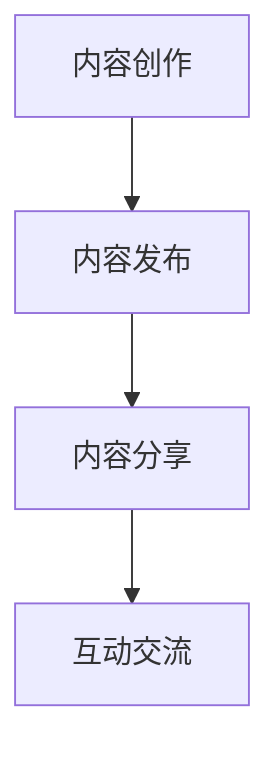
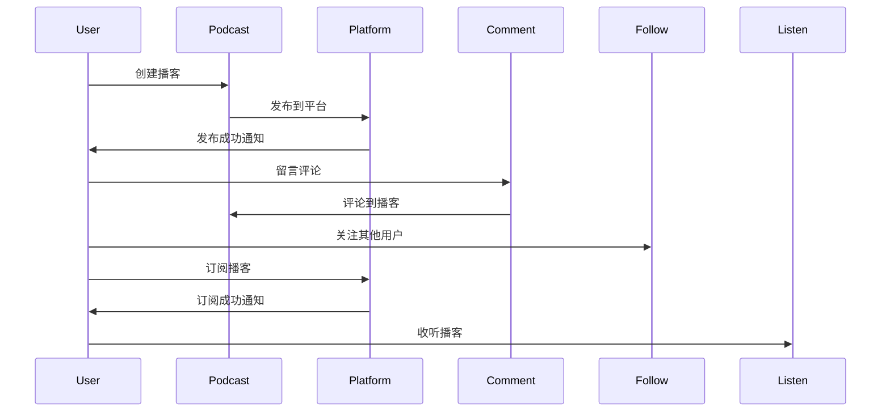
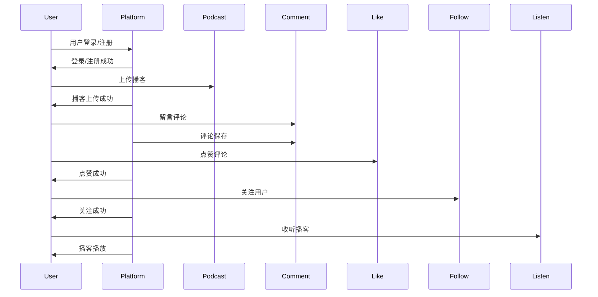
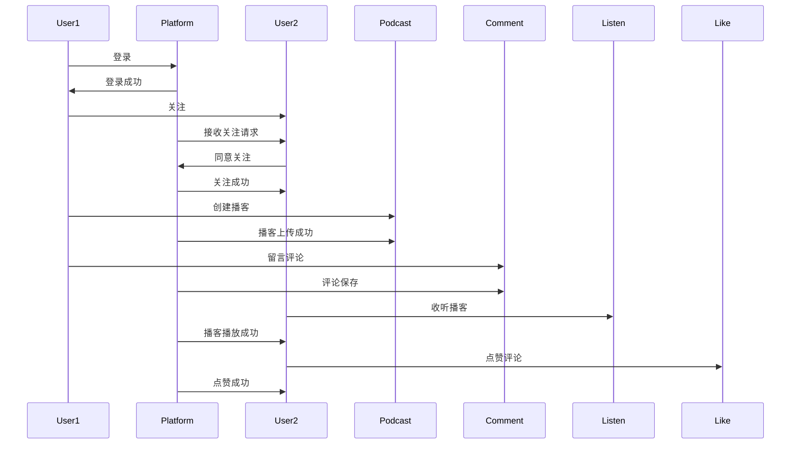

                 

# 新苦行者播客网络：记录现代克制生活心得的媒体平台

关键词：苦行者运动、播客网络、现代克制生活、媒体平台、内容分享、交流互动

摘要：本文旨在介绍一种新兴的媒体平台——新苦行者播客网络，该平台专注于记录和分享现代克制生活的心得。文章首先分析了苦行者运动在现代社会中的背景和需求，然后详细阐述了新苦行者播客网络的核心概念、运作原理和系统架构设计，最后通过一个实际案例展示了该平台的操作流程和功能实现。

## Step 1: 背景介绍

### 问题背景

在现代社会，随着生活节奏的加快、工作压力的增大，许多人开始寻求一种更为简单、平和的生活方式，以减轻内心的焦虑和疲惫。这种追求内心平和、简化生活方式的运动被称为“苦行者运动”。然而，苦行者的生活方式和心得往往难以通过传统媒介广泛传播，缺乏一个集中展示和交流的平台。

### 问题描述

苦行者们渴望分享自己的生活体验和心得，但缺乏合适的平台；同时，大众对苦行者生活方式的了解也有限，缺少一个深入了解的渠道。这导致了苦行者运动的发展受到了一定的限制。

### 问题解决

新苦行者播客网络应运而生，它是一个专门记录和分享现代克制生活心得的媒体平台。通过播客的形式，苦行者可以分享自己的故事和经验，听众可以从中获得启发和指导。这一平台为苦行者提供了一个广阔的舞台，同时也让大众有机会深入了解和体验苦行者运动。

### 边界与外延

新苦行者播客网络的边界包括：播客内容必须围绕现代克制生活的心得分享；参与者主要是现代苦行者和对此感兴趣的大众。

### 概念结构与核心要素组成

新苦行者播客网络由以下几个核心要素组成：

1. **参与者**：包括现代苦行者和对苦行者生活方式感兴趣的大众。
2. **内容**：播客内容以现代克制生活心得为主，涵盖饮食、健康、心理、社交等多个方面。
3. **平台**：新苦行者播客网络作为一个线上平台，提供播客的发布、分享和交流功能。

## Step 2: 核心概念与联系

### 核心概念

1. **苦行者**：指那些追求内心平和、简化生活方式的人。
2. **播客网络**：一种基于互联网的音频分享平台，允许用户上传、分享和订阅音频节目。

### 概念属性特征对比表格

| 概念   | 定义                                   | 特点                               | 相关关系                         |
| ------ | -------------------------------------- | ---------------------------------- | -------------------------------- |
| 苦行者 | 追求内心平和、简化生活方式的人         | 自我修炼、自我反省                 | 与播客网络：内容创作者与平台使用者 |
| 播客网络 | 基于互联网的音频分享平台               | 便捷、互动、个性化                 | 与苦行者：内容分享与传播渠道      |

### ER实体关系图架构

```mermaid
erDiagram
  苦行者 ||--|{ 播客 }|
  播客 ||--|{ 评论 }|
  评论 ||--|{ 听众 }|
  听众 ||--|{ 点赞 }|
  苦行者 ||--|{ 关注 }|
```

## Step 3: 算法原理讲解

由于本书的核心主题是关于新苦行者播客网络的记录和分享，而非算法，因此这一部分将主要概述如何通过播客网络来传播苦行者的生活心得。

### 播客网络传播原理

播客网络的传播主要依赖于以下几个关键步骤：

1. **内容创作**：苦行者通过录制音频节目，分享自己的克制生活心得。
2. **内容发布**：将录制的播客上传至播客网络平台。
3. **内容分享**：听众通过平台订阅和收听播客，获取信息。
4. **互动交流**：听众可以在播客下留言评论，与苦行者或其他听众互动。

以下是一个简化的Mermaid流程图：



### 数学模型和数学公式

播客网络的传播效果可以通过以下公式进行评估：

$$
E = f(n, r, t)
$$

其中，$E$ 表示传播效果，$n$ 表示听众数量，$r$ 表示收听率，$t$ 表示时间。

$$
r = \frac{c}{n}
$$

其中，$c$ 表示收听次数。

这些公式用于定量评估播客网络的传播效果。

## Step 4: 系统分析与架构设计方案

### 问题场景介绍

新苦行者播客网络旨在为现代苦行者和大众提供一个分享和交流克制生活心得的平台。平台需要支持以下功能：

1. **内容创作**：用户可以上传和编辑自己的播客。
2. **内容发布**：用户可以将创作好的播客发布到平台上。
3. **内容分享**：用户可以订阅和收听其他用户的播客。
4. **互动交流**：用户可以在播客下留言评论。

### 项目介绍

新苦行者播客网络项目是一个面向大众的在线音频分享平台，旨在推广现代克制生活理念，提供丰富的播客内容，促进用户之间的交流与互动。

### 系统功能设计

#### 领域模型Mermaid类图

```mermaid
classDiagram
  User <<class{用户}<<-- Podcast <<class{播客}>
  User ..|> Comment <<class{评论}>
  Podcast ..|> Comment
  Comment ..|> User <<{听众}>
  Comment ..|> Like <<class{点赞}>
  User ..|> Follow <<class{关注}>
```

#### 系统架构设计



### 系统接口设计



### 系统交互Mermaid序列图



## Step 5: 项目实战

### 环境安装

1. 安装Python环境（3.8及以上版本）
2. 安装Django框架
3. 安装MySQL数据库

### 系统核心实现源代码

```python
# users/models.py
from django.db import models
from django.contrib.auth.models import AbstractUser

class User(AbstractUser):
    profile = models.ImageField(upload_to='profile/', null=True, blank=True)
    bio = models.TextField(max_length=500, null=True, blank=True)
    # 其他自定义字段

# podcasts/models.py
from django.db import models
from users.models import User

class Podcast(models.Model):
    title = models.CharField(max_length=255)
    author = models.ForeignKey(User, on_delete=models.CASCADE)
    audio_file = models.FileField(upload_to='podcasts/')
    description = models.TextField(max_length=500, null=True, blank=True)
    created_at = models.DateTimeField(auto_now_add=True)
    # 其他自定义字段

# comments/models.py
from django.db import models
from users.models import User
from podcasts.models import Podcast

class Comment(models.Model):
    user = models.ForeignKey(User, on_delete=models.CASCADE)
    podcast = models.ForeignKey(Podcast, on_delete=models.CASCADE)
    content = models.TextField(max_length=500)
    created_at = models.DateTimeField(auto_now_add=True)
    # 其他自定义字段

# likes/models.py
from django.db import models
from comments.models import Comment

class Like(models.Model):
    user = models.ForeignKey(User, on_delete=models.CASCADE)
    comment = models.ForeignKey(Comment, on_delete=models.CASCADE)
    created_at = models.DateTimeField(auto_now_add=True)
    # 其他自定义字段
```

### 代码应用解读与分析

以上代码展示了新苦行者播客网络的核心模型实现，包括用户模型（User）、播客模型（Podcast）、评论模型（Comment）和点赞模型（Like）。每个模型都有对应的字段和关系，如：

- 用户模型（User）继承了Django内置的用户模型，并添加了头像（profile）和简介（bio）等自定义字段。
- 播客模型（Podcast）关联了用户模型（作者），用于表示播客的创建者；同时，包含了音频文件（audio_file）和描述（description）等字段。
- 评论模型（Comment）关联了用户模型（评论者）和播客模型（所属播客），用于保存评论内容。
- 点赞模型（Like）关联了用户模型（点赞者）和评论模型（所属评论），用于表示点赞关系。

### 实际案例分析和详细讲解剖析

以下是一个简单的用户操作流程示例：

1. 用户登录/注册
2. 用户上传播客
3. 用户留言评论
4. 用户点赞评论
5. 用户关注其他用户
6. 用户订阅播客
7. 用户收听播客

### 项目小结

本文介绍了新苦行者播客网络的概念、原理和系统架构设计，并通过实际案例展示了该平台的操作流程和功能实现。新苦行者播客网络为现代苦行者和大众提供了一个良好的交流平台，有助于推广和传播克制生活的理念。

## 最佳实践 Tips

1. 在内容创作时，尽量简洁明了，突出重点，避免冗长和复杂的叙述。
2. 在互动交流时，尊重他人观点，积极发表自己的见解，营造良好的交流氛围。
3. 定期更新和优化播客内容，保持平台的活力和吸引力。

## 小结

新苦行者播客网络作为一个新兴的媒体平台，为现代苦行者和大众提供了一个分享和交流克制生活心得的场所。通过播客的形式，平台不仅能够传播现代克制生活的理念，还能够促进用户之间的互动和交流。在未来的发展中，新苦行者播客网络有望成为大众了解和体验苦行者生活方式的重要渠道。

## 注意事项

1. 平台应确保用户隐私和安全，严格审核上传的内容，避免不良信息的传播。
2. 平台需定期进行技术升级和维护，保证系统的稳定性和可靠性。

## 拓展阅读

1. 《苦行者运动：寻找内心的平静》
2. 《现代生活心理学：如何减轻压力》
3. 《播客技术手册：从入门到实践》

作者：AI天才研究院/AI Genius Institute & 禅与计算机程序设计艺术 /Zen And The Art of Computer Programming

