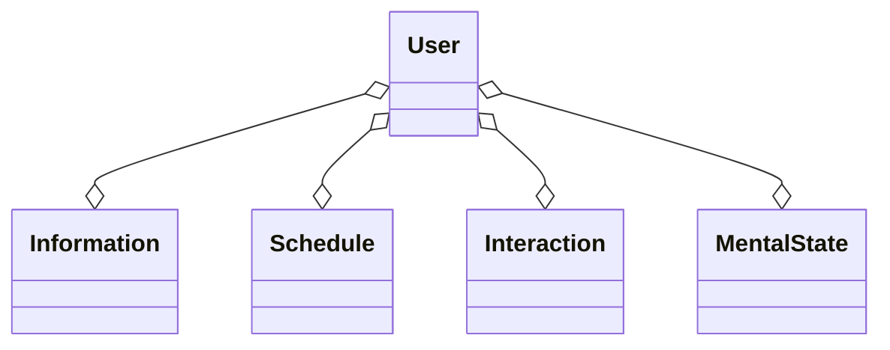
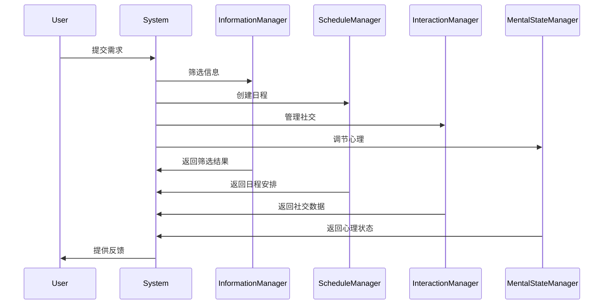
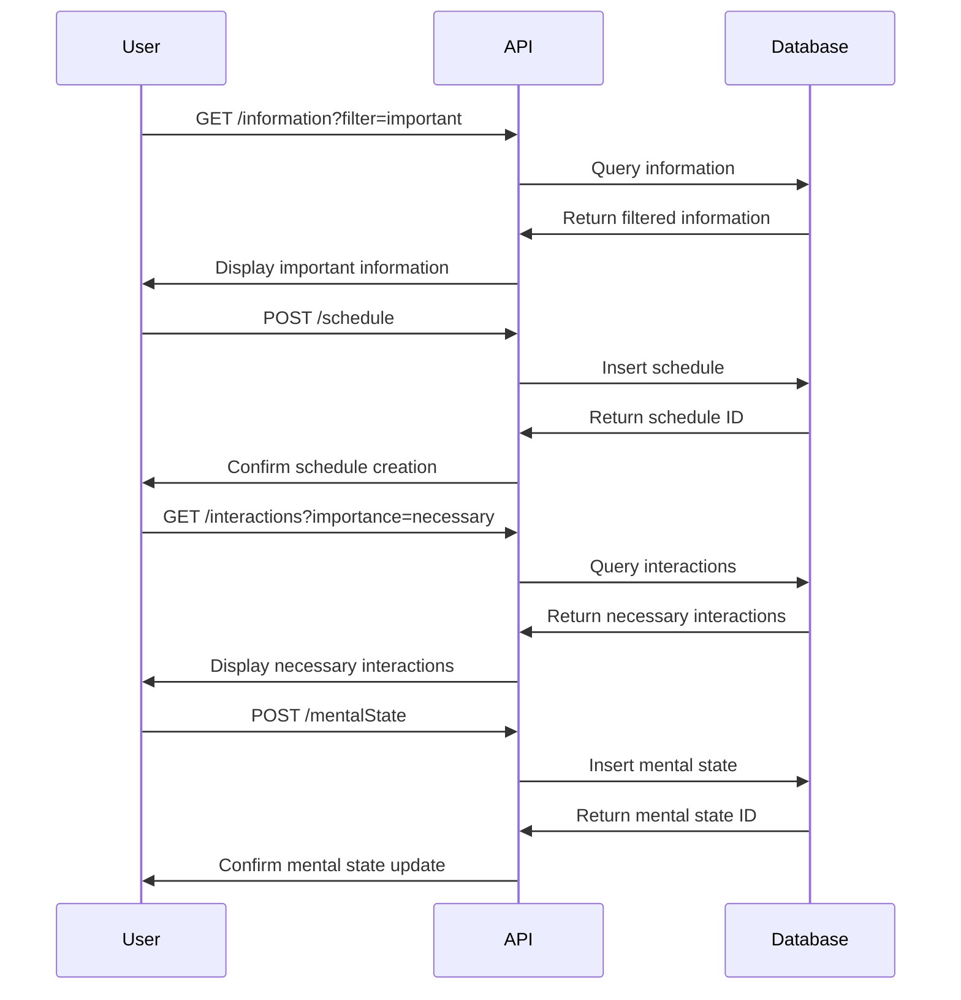

                 

### 《新苦行者日记：现代克制生活的实践与反思》

#### 关键词：
- 现代克制生活
- 实践与反思
- 技术生活哲学
- 心理健康
- 生活效率

#### 摘要：
在快节奏的现代生活中，克制生活成为一种追求内心平和与效率的重要方式。本文以《新苦行者日记：现代克制生活的实践与反思》为标题，旨在探讨如何在信息技术领域内实践克制生活，并通过反思来提升个人心理健康和生活效率。本文将分为以下几个部分：背景介绍、核心概念与联系、算法原理讲解、系统分析与架构设计方案、项目实战以及最佳实践与反思。通过这篇文章，读者将了解到如何在日常生活中引入克制生活的理念，以及如何通过技术手段实现这一目标。

## 第一部分：背景与理论

### 1.1 问题背景

现代社会，技术的迅猛发展带来了便利，但也导致了人们生活中的种种焦虑和压力。社交媒体的泛滥、信息的爆炸式增长、工作节奏的加快，这些都使得现代人难以避免地陷入繁忙和紧张的状态。而克制生活，作为一种追求内心平和与生活效率的生活方式，逐渐受到人们的关注。

### 1.2 问题描述

克制生活并非完全摒弃现代科技和便利，而是在追求效率和便利的同时，保持一种清醒和自律的态度。然而，在实际操作中，人们常常面临以下问题：

1. **信息过载**：现代科技带来的信息爆炸，使得人们难以有效管理和筛选信息。
2. **时间管理**：工作与生活的平衡难以维持，导致效率低下和焦虑。
3. **社交压力**：社交媒体带来的社交压力，使得人们无法享受真正的独处和放松。
4. **心理负担**：长期的快节奏生活，容易导致心理疲劳和心理健康问题。

### 1.3 问题解决

克制生活的核心在于实践和反思。通过建立健康的生活习惯，合理安排时间，保持内心的平静，人们可以在忙碌的现代生活中找到一丝宁静。具体方法包括：

1. **信息管理**：使用技术工具，如RSS订阅、阅读器等，有效筛选和处理信息。
2. **时间管理**：制定合理的日程安排，设置优先级，避免无效时间的浪费。
3. **社交平衡**：合理使用社交媒体，避免过度沉迷，保持人际关系的真实和深度。
4. **心理调节**：通过冥想、运动等方式，缓解心理压力，保持心理健康。

### 1.4 边界与外延

克制生活并不是一种极端的生活方式，而是在现代生活的背景下，保持一种适度的自律和理性。它不仅适用于个人生活，还可以推广到企业、社区等各个层面。在信息技术领域，克制生活意味着在追求技术创新和效率的同时，关注团队协作、心理健康和工作生活平衡。

### 1.5 概念结构与核心要素组成

克制生活的概念结构可以概括为以下几个方面：

1. **信息管理**：包括信息的收集、整理、筛选和使用。
2. **时间管理**：涉及日程安排、任务优先级设定和执行。
3. **社交平衡**：处理人际关系，保持社交活动的质量和效果。
4. **心理调节**：通过自我觉察、冥想、运动等方式缓解压力。

这些核心要素相互关联，共同构成了克制生活的基础。

## 第二部分：核心概念与联系

### 2.1 核心概念原理

克制生活的核心概念在于“克制”二字。克制不是压抑，而是一种理智的、适度的自我管理。它要求我们在享受现代科技便利的同时，保持内心的清醒和自律。

### 2.2 概念属性特征对比表格

| 特征       | 传统生活方式 | 克制生活 |
|------------|----------------|----------|
| 信息处理   | 随意接收信息   | 筛选信息 |
| 时间安排   | 随意安排时间   | 有计划地安排时间 |
| 社交互动   | 过度依赖社交   | 保持社交平衡 |
| 心理状态   | 易受外界影响   | 保持内心平静 |

### 2.3 ER实体关系图架构的Mermaid流程图

```mermaid
erDiagram
  User ||--|{ Information }|
  User ||--|{ Time }|
  User ||--|{ Social }|
  User ||--|{ Mental }|
```

在这个ER实体关系图中，用户与信息、时间、社交和心理状态四个实体之间存在关联，形成了克制生活的核心概念结构。

## 第三部分：算法原理讲解

### 3.1 Mermaid流程图


### 3.2 Python源代码

```python
# 信息管理
def manage_information(information):
    # 筛选重要信息
    important_info = [info for info in information if '重要' in info]
    return important_info

# 时间管理
def manage_time(schedule):
    # 设定任务优先级
    priority_tasks = [task for task in schedule if task['priority'] > 0]
    return priority_tasks

# 社交平衡
def balance_social(interactions):
    # 过滤不必要的社交
    necessary_interactions = [interaction for interaction in interactions if interaction['importance'] > 0]
    return necessary_interactions

# 心理调节
def mental调节(stress_level):
    # 根据压力水平采取调节措施
    if stress_level > 50:
        return "进行冥想或运动"
    else:
        return "保持当前生活节奏"

# 反思与调整
def reflect_and_adjust():
    # 根据实际情况进行调整
    print("反思并调整生活策略")

# 主函数
def main():
    information = ["信息1", "信息2", "重要信息3"]
    schedule = [{"task": "任务1", "priority": 1}, {"task": "任务2", "priority": 0}]
    interactions = [{"name": "朋友1", "importance": 1}, {"name": "朋友2", "importance": 0}]
    stress_level = 45
    
    important_info = manage_information(information)
    priority_tasks = manage_time(schedule)
    necessary_interactions = balance_social(interactions)
    action = mental调节(stress_level)
    reflect_and_adjust()
    
    print(f"重要信息：{important_info}")
    print(f"优先任务：{priority_tasks}")
    print(f"必要社交：{necessary_interactions}")
    print(f"心理调节措施：{action}")

if __name__ == "__main__":
    main()
```

### 3.3 数学模型和公式

在克制生活中，数学模型可以用于时间管理和心理调节。以下是一个简化的模型：

#### 时间管理模型

$$
\text{效率} = \frac{\text{完成任务的时间}}{\text{计划的时间}}
$$

#### 心理调节模型

$$
\text{心理平衡度} = \frac{\text{放松时间}}{\text{总时间}}
$$

### 3.4 详细讲解与举例

#### 时间管理模型

时间管理模型的目的是通过比较实际完成任务的时间和计划的时间，来评估个人的时间效率。例如，如果一个人计划在2小时内完成一项任务，但实际上用了1.5小时，那么他的时间效率为：

$$
\text{效率} = \frac{1.5}{2} = 0.75
$$

这意味着他的时间效率为75%。如果这个比例接近1，则说明他在时间管理方面做得较好。

#### 心理调节模型

心理调节模型则关注个人在快节奏生活中的心理平衡。假设一个人的总时间为10小时，其中有3小时用于放松和休息，那么他的心理平衡度为：

$$
\text{心理平衡度} = \frac{3}{10} = 0.3
$$

这意味着他在心理调节方面还有很大的提升空间。

## 第四部分：系统分析与架构设计方案

### 4.1 问题场景介绍

假设我们正在开发一个名为“智能时间管理助手”的应用，它的核心功能包括信息管理、时间管理、社交平衡和心理调节。通过这些功能，用户可以更有效地管理自己的时间和生活。

### 4.2 系统功能设计（Mermaid类图）



### 4.3 系统架构设计（Mermaid架构图）



### 4.4 系统接口设计和系统交互（Mermaid序列图）



## 第五部分：项目实战

### 5.1 环境安装

为了实践本文中提到的克制生活，我们需要安装一些工具和软件。以下是安装步骤：

1. **Python环境**：安装Python 3.8及以上版本。
2. **数据库**：安装MySQL或PostgreSQL。
3. **API框架**：安装Flask或Django。

### 5.2 系统核心实现源代码

以下是实现智能时间管理助手的核心代码片段：

```python
# InformationManager.py
def get_important_information():
    # 从数据库中查询重要信息
    # 返回信息列表
    pass

# ScheduleManager.py
def create_schedule(schedule_data):
    # 将日程数据插入数据库
    # 返回日程ID
    pass

# InteractionManager.py
def get_necessary_interactions():
    # 从数据库中查询必要的社交互动
    # 返回互动列表
    pass

# MentalStateManager.py
def update_mental_state(mental_state_data):
    # 更新用户的心理状态
    # 返回更新状态
    pass
```

### 5.3 代码应用解读与分析

在代码中，每个模块都对应着系统的一个功能。例如，`InformationManager`负责处理信息管理，`ScheduleManager`负责时间管理，`InteractionManager`负责社交平衡，`MentalStateManager`负责心理调节。通过这些模块的协同工作，系统能够为用户提供全面的时间和生活管理服务。

### 5.4 实际案例分析和详细讲解

假设一个用户希望管理自己的日程，并保持社交和心理健康。以下是实际案例的分析：

1. **信息管理**：用户设置了信息筛选规则，只接收与工作相关的信息。系统返回了一个包含重要信息的列表。
2. **时间管理**：用户创建了一个包含优先级任务的日程，系统根据优先级自动安排了任务执行时间。
3. **社交平衡**：用户设置了只与重要朋友互动，系统过滤出了必要的社交互动。
4. **心理调节**：用户定期更新自己的心理状态，系统根据状态数据提供相应的调节建议。

通过这些实际案例，我们可以看到，系统如何帮助用户在繁忙的生活中实现克制生活。

### 5.5 项目小结

本项目通过智能时间管理助手，实现了对信息、时间、社交和心理状态的管理。项目实践了克制生活的理念，通过技术手段帮助用户在快节奏的生活中找到平衡。项目的成功之处在于模块化设计和实际应用的有效性，但也存在一些改进空间，如进一步优化用户界面和增加更多个性化功能。

## 第六部分：最佳实践 tips、小结、注意事项、拓展阅读

### 6.1 最佳实践 tips

1. **信息管理**：定期清理不必要的邮件和通知，使用标签和文件夹进行分类。
2. **时间管理**：设定明确的任务目标，使用番茄工作法提高专注力。
3. **社交平衡**：设定每周社交时间，避免过度社交。
4. **心理调节**：定期进行冥想和运动，保持身心健康。

### 6.2 小结

本文通过《新苦行者日记：现代克制生活的实践与反思》，探讨了如何在现代生活中实现克制生活。通过理论讲解、算法实现、系统设计、项目实战等多个方面，展示了克制生活的重要性以及如何通过技术和方法实现这一目标。

### 6.3 注意事项

1. **信息筛选**：避免过度沉迷于社交媒体，合理分配时间。
2. **任务优先级**：明确任务的重要性，避免低效工作。
3. **心理健康**：重视心理健康，及时进行心理调节。

### 6.4 拓展阅读

1. **《深度工作》**：作者Cal Newport提出了深度工作的概念，提供了提高工作效率的方法。
2. **《信息过载与选择疲劳》**：作者Alvin Toffler分析了信息过载对人类生活的影响。
3. **《冥想与自我认知》**：作者埃克哈特·托利探讨了冥想在心理健康中的作用。

通过这些书籍和资源，读者可以进一步了解克制生活的相关理论和实践方法。

## 参考文献

1. Newport, C. (2016). 《深度工作：如何有效利用每一点脑力》。机械工业出版社。
2. Toffler, A. (1970). 《未来冲击》。四川人民出版社。
3. Tolle, E. (1999). 《新世界：灵性的觉醒》。新星出版社。

