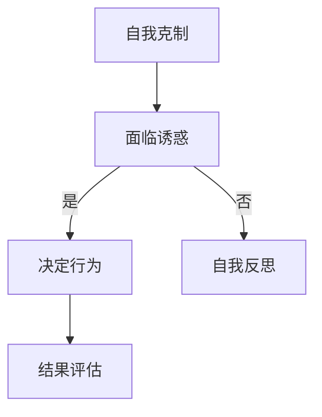
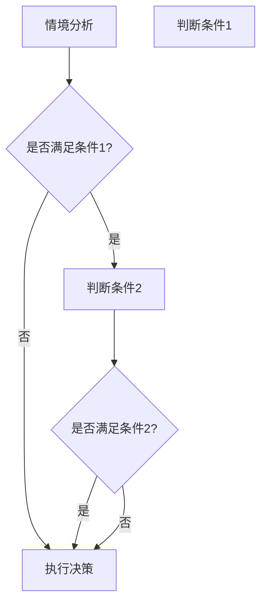

                 


### 新苦行者训练营：自我克制的集体实践活动

> 关键词：自我克制、集体实践活动、个人成长、心理学原理、案例分享、实践方法

> 摘要：本文将探讨如何通过自我克制的集体实践活动，帮助个体在日常生活中实现自我提升。文章将从背景介绍、核心概念、心理学原理、实践方法、案例分析、实际操作、效果评估等多个方面进行深入分析，以期为读者提供全面的理论支持和实践指导。

## 引言

### 书籍背景与目的

在当今社会，自我管理和自我提升已成为许多人的关注焦点。然而，自我克制的实践并非易事，往往受到各种内外部因素的干扰。为了帮助读者更好地理解和实践自我克制，本书提出了“新苦行者训练营：自我克制的集体实践活动”这一概念。通过集体实践活动，个体可以在相互支持的环境中，共同面对挑战，逐步提高自我克制的能力。

本书旨在为读者提供一个全面的理论和实践框架，帮助他们在日常生活中有效地实施自我克制。具体目标包括：

1. **理解自我克制的概念和重要性**：通过介绍相关心理学原理，帮助读者认识到自我克制在个人成长中的作用。
2. **掌握集体实践活动的操作方法**：详细讲解如何组织、准备和实施集体实践活动，以实现自我克制的目标。
3. **通过案例分析，提供实践经验**：分享成功案例，为读者提供实际操作的参考。
4. **提供持续实践的方法与建议**：帮助读者在日常生活中持续实践自我克制，实现长期成长。

### 目录结构说明

本文将按照以下目录结构展开：

1. **引言**：介绍书籍背景与目的。
2. **自我克制的理论基础**：探讨自我克制的概念、心理学原理及其与个人成长的关系。
3. **集体实践活动的操作方法**：详细讲解集体实践活动的定义、类型、组织方法和实践过程中的自我克制。
4. **案例分享与实际操作**：通过经典案例分享和实际操作，为读者提供实践经验。
5. **总结与反思**：总结实践效果，反思自我克制的持续实践。

## 自我克制的理论基础

### 第1章 问题背景与定义

#### 1.1 问题的提出

在现代社会，人们面临着越来越多的挑战和压力。自我克制作为一种能力，对于应对这些挑战至关重要。然而，自我克制并非与生俱来，而是需要通过后天的培养和锻炼来获得。本文将探讨自我克制的概念、心理学原理及其与个人成长的关系。

#### 1.2 自我克制的定义与重要性

自我克制是指个体在面对诱惑、冲动或压力时，能够有效地控制自己的行为和情绪，以达到预定目标的能力。自我克制在个人成长中具有以下重要作用：

1. **提高自律能力**：自我克制能够帮助个体更好地规划和管理时间，提高工作效率和生活质量。
2. **增强自我控制力**：自我克制有助于个体在面对困难和挑战时保持冷静和理智，从而更好地解决问题。
3. **促进个人成长**：自我克制是个人成长的重要基础，有助于个体实现自我超越和全面发展。

### 第2章 自我克制的心理学原理

#### 2.1 自我克制的理论基础

自我克制是一种心理能力，其理论基础主要涉及以下几个心理学领域：

1. **自我决定理论**：自我决定理论认为，个体的行为受到内在动机和自主性的驱动。自我克制正是通过激发内在动机和提升自主性来实现的。
2. **情绪调节理论**：情绪调节理论关注个体如何管理自己的情绪，以应对生活中的压力和挑战。自我克制在情绪调节过程中起着关键作用。
3. **认知控制理论**：认知控制理论强调个体在信息处理过程中，如何通过认知资源分配和策略选择来控制自己的行为和思维。

#### 2.2 心理学研究中的自我克制方法

心理学研究提供了多种自我克制的方法，包括：

1. **认知重构**：通过改变个体对情境的认知评价，降低自我克制所需的认知负荷。
2. **情境控制**：通过调整环境中的刺激和诱惑，减少自我克制面临的挑战。
3. **行为训练**：通过逐步建立和强化自我克制的行为习惯，提高个体在特定情境下的自我控制能力。

### 第3章 自我克制与个人成长

#### 3.1 自我克制对个人成长的影响

自我克制对个人成长的影响主要体现在以下几个方面：

1. **提高学习能力**：自我克制有助于个体在面对学习挑战时保持专注和耐心，从而提高学习效果。
2. **增强人际交往能力**：自我克制使个体在人际交往中更加理性、友善和宽容，有利于建立和谐的人际关系。
3. **促进职业生涯发展**：自我克制能够帮助个体在职业生涯中保持职业操守和职业道德，实现事业成功。

#### 3.2 自我克制与人生目标的实现

自我克制是实现人生目标的重要保障。一个具有高度自我克制能力的人，能够更好地应对人生中的各种挑战，实现自己的理想和抱负。具体来说：

1. **明确目标**：自我克制使个体能够明确自己的人生目标，并为之付出持续的努力。
2. **克服诱惑**：自我克制使个体在面对诱惑时能够保持清醒的头脑，避免陷入短视行为。
3. **应对挫折**：自我克制使个体在遭遇挫折时能够保持积极的心态，勇于面对困难，不断成长。

## 集体实践活动的操作方法

### 第4章 集体实践活动的定义与类型

#### 4.1 集体实践活动的概念

集体实践活动是一种通过集体协作和互动，共同实现某一目标或解决某一问题的实践活动。它强调个体在集体中的角色和责任，通过相互支持和合作，实现个人和集体的共同成长。

#### 4.2 集体实践活动的类型与特点

根据活动目的和形式，集体实践活动可以分为以下几种类型：

1. **合作型活动**：强调个体之间的协作和互助，通过集体努力实现共同目标。例如，团队项目、社区志愿服务等。
2. **竞争型活动**：强调个体之间的竞争和比较，通过相互激励和挑战，提高个体和集体的能力。例如，体育比赛、商业竞赛等。
3. **体验型活动**：强调个体在活动中的体验和感悟，通过亲身参与和体验，实现个人成长和自我反思。例如，户外拓展训练、禅修活动等。

### 第5章 活动组织与准备

#### 5.1 活动组织的原则

活动组织是确保集体实践活动顺利进行的关键环节。以下是活动组织应遵循的原则：

1. **明确目标**：活动目标应具体、明确，有利于指导活动的开展。
2. **合理分工**：根据参与者的能力和特长，合理分配任务和角色，确保每个参与者都能发挥自己的优势。
3. **充分沟通**：活动前应进行充分沟通，确保参与者对活动内容和要求有清晰的理解。
4. **资源保障**：确保活动所需的物资、人力和财力等资源充足，以支持活动的顺利进行。

#### 5.2 活动准备的具体步骤

活动准备是活动组织的重要环节，以下为活动准备的具体步骤：

1. **制定活动方案**：根据活动目标和原则，制定具体的活动方案，包括活动时间、地点、内容、流程等。
2. **招募参与者**：根据活动方案，招募合适的参与者，确保活动人数和质量的平衡。
3. **培训指导**：对参与者进行必要的培训和指导，提高他们的活动能力和自我克制意识。
4. **物资准备**：根据活动方案，准备必要的物资和设备，确保活动顺利进行。
5. **安全保障**：确保活动过程中参与者的安全，制定安全措施和应急预案。

### 第6章 实践过程中的自我克制

#### 6.1 如何在集体活动中保持自我克制

在集体活动中，自我克制是确保活动顺利进行和个人成长的关键。以下是一些建议，帮助个体在集体活动中保持自我克制：

1. **明确个人目标**：在集体活动中，个体应明确自己的目标和期望，以保持自我克制和专注。
2. **学会拒绝诱惑**：面对各种诱惑，个体应学会拒绝，保持自己的决心和毅力。
3. **保持积极心态**：积极的心态有助于个体克服困难，保持自我克制。
4. **合理分配精力**：在集体活动中，个体应合理分配精力，确保自己在关键时刻能够保持专注和自制。
5. **相互监督与支持**：个体可以在集体活动中相互监督和支持，共同提高自我克制的意识和能力。

#### 6.2 集体实践活动的难点与应对策略

集体实践活动面临诸多挑战，以下是应对难点的一些建议：

1. **协调个体与集体利益**：在集体活动中，个体应平衡个人利益和集体利益，避免因个人利益而损害集体利益。
2. **处理冲突与矛盾**：集体活动中难免会出现冲突和矛盾，个体应学会妥善处理，保持活动的和谐与稳定。
3. **应对压力与挑战**：个体应提高自己的抗压能力，勇于面对挑战，保持自我克制和冷静。
4. **持续反思与改进**：活动结束后，个体应进行反思和总结，发现不足，不断改进，以提高自我克制的能力。

## 案例分享与实际操作

### 第7章 经典案例分享

#### 7.1 案例一：自我克制的集体实践活动

案例一：一个公司的团队建设活动，通过自我克制的训练，提高了团队成员的协作能力和自我控制力。

活动过程：
1. **活动前准备**：公司为团队成员设计了自我克制的训练课程，包括冥想、瑜伽和心理疏导等。
2. **活动过程**：团队成员每天参加训练，并在训练过程中相互监督和鼓励，共同克服困难。
3. **活动成果**：团队成员的自我克制能力得到显著提升，团队协作更加顺畅，工作效率显著提高。

#### 7.2 案例二：集体实践活动的成功经验

案例二：一个社区组织举办的环保公益活动，通过集体实践，提高了居民的环保意识和自我克制能力。

活动过程：
1. **活动前准备**：社区组织为居民设计了环保知识讲座和环保实践活动，包括垃圾分类、节约用水等。
2. **活动过程**：居民积极参与活动，通过实际行动践行环保理念，并在活动过程中相互监督和激励。
3. **活动成果**：居民的环境保护意识显著提高，环保行动得到广泛推广，社区环境得到显著改善。

### 第8章 实际操作与技巧

#### 8.1 实际操作流程

以下是一个简单的集体实践活动操作流程：

1. **确定活动目标**：明确活动目标和预期成果，确保活动有明确的方向和目标。
2. **设计活动方案**：根据活动目标，设计具体的活动方案，包括活动内容、时间、地点、参与人员等。
3. **招募参与者**：通过宣传和招募，确保有足够的人参与活动。
4. **培训指导**：对参与者进行必要的培训和指导，提高他们的活动能力和自我克制意识。
5. **实施活动**：按照活动方案开展活动，确保活动顺利进行。
6. **总结与反思**：活动结束后，对活动进行总结和反思，发现不足，提出改进措施。

#### 8.2 集体实践活动的技巧分享

以下是一些集体实践活动的技巧，帮助个体更好地参与和实施活动：

1. **明确分工**：明确每个参与者的角色和责任，确保活动有条不紊地进行。
2. **相互支持**：在活动中，参与者应相互支持，共同克服困难。
3. **保持积极心态**：积极的心态有助于参与者保持自我克制，更好地应对挑战。
4. **灵活调整**：在活动过程中，应根据实际情况灵活调整活动方案，确保活动顺利进行。
5. **总结与反思**：活动结束后，参与者应进行总结和反思，发现不足，提出改进措施，以不断提高自我克制能力。

## 总结与反思

### 第9章 实践效果与反思

通过集体实践活动的实施，个体在自我克制方面取得了显著成果。具体表现在以下几个方面：

1. **自我控制力提升**：个体在面对诱惑和挑战时，能够更好地控制自己的情绪和行为。
2. **团队合作能力增强**：通过集体活动，个体学会了与他人协作，提高了团队合作能力。
3. **自我反思能力提高**：个体在活动过程中，能够进行自我反思和总结，不断完善自我。

同时，在实践中也暴露出一些问题和不足，如：

1. **活动组织不够完善**：有些活动的组织工作不够细致，导致活动效果不佳。
2. **参与者积极性不高**：部分参与者对活动的积极性不高，影响了整体活动效果。

针对这些问题，我们需要在未来的实践中不断改进和完善：

1. **优化活动组织**：加强活动前的筹备工作，确保活动方案的科学性和可行性。
2. **提高参与者积极性**：通过激励机制，提高参与者对活动的兴趣和参与度。
3. **加强自我反思**：个体在活动结束后，应进行深入反思，总结经验教训，不断提高自我克制能力。

### 第10章 自我克制的持续实践

#### 10.1 持续实践的重要性

自我克制是一种长期的能力培养过程，需要个体在日常生活中持续实践和巩固。持续实践的重要性体现在以下几个方面：

1. **巩固自我克制能力**：通过持续实践，个体可以巩固自我克制的能力，使其成为一种习惯和本能。
2. **应对生活中的各种挑战**：自我克制能力在个体面对生活中的各种挑战时，起到关键作用，帮助个体保持冷静和理智。
3. **促进个人成长**：持续实践自我克制，有助于个体在个人成长过程中不断突破自我，实现自我超越。

#### 10.2 持续实践的方法与建议

为了实现自我克制的持续实践，个体可以采取以下方法和建议：

1. **制定个人计划**：个体可以根据自己的实际情况，制定详细的自我克制计划，明确目标和实践步骤。
2. **设立激励机制**：个体可以设立激励机制，奖励自己在实践过程中取得的成果，提高自我克制的动力。
3. **记录与实践反思**：个体可以记录自己的实践过程和反思，通过总结和反思，不断提高自我克制能力。
4. **寻求支持与反馈**：个体可以寻求家人、朋友或导师的支持和反馈，共同提高自我克制能力。
5. **持续学习与成长**：个体可以参加相关培训和学习，不断更新知识，提升自我克制能力。

### 作者信息

作者：AI天才研究院/AI Genius Institute & 禅与计算机程序设计艺术 /Zen And The Art of Computer Programming

### 附录

#### 背景介绍

本文探讨了通过自我克制的集体实践活动，帮助个体实现自我提升的方法。自我克制是一种重要的心理能力，对于个人成长和生活质量有着重要影响。本文结合心理学原理和实践经验，提出了集体实践活动的操作方法，并通过经典案例分享，为读者提供了实践经验。

#### 核心概念与联系

**核心概念**：自我克制、集体实践活动、个人成长、心理学原理、实践方法

**概念属性特征对比表格**：

| 核心概念 | 定义 | 属性特征 |
| :--- | :--- | :--- |
| 自我克制 | 个体在面对诱惑、冲动或压力时，能够有效地控制自己的行为和情绪，以达到预定目标的能力。 | 需要内在动机、自主性、认知控制 |
| 集体实践活动 | 一种通过集体协作和互动，共同实现某一目标或解决某一问题的实践活动。 | 需要协作、互助、共同成长 |
| 个人成长 | 个体在生理、心理、社会等方面的全面发展过程。 | 需要自我反思、自我超越、自我提升 |
| 心理学原理 | 研究人类行为和心理过程的科学。 | 需要自我决定理论、情绪调节理论、认知控制理论 |
| 实践方法 | 实施自我克制和集体实践活动的具体方法。 | 需要认知重构、情境控制、行为训练 |

**ER实体关系图架构的 Mermaid 流程图**：

```mermaid
erDiagram
  Activity <<|-- Participant : 参与活动
  Activity ||--|{ Goal : 实现目标 }
  Activity ||--|{ Method : 实践方法 }
  Participant ||--|{ SelfControl : 自我克制 }
  Participant ||--|{ PersonalGrowth : 个人成长 }
  Activity ||--|{ Psychology : 心理学原理 }
  Goal ||--|{ Achievement : 成就 }
  Method ||--|{ Technique : 技巧 }
  SelfControl ||--|{ Behavior : 行为控制 }
  PersonalGrowth ||--|{ Progress : 进步 }
  Psychology ||--|{ Theory : 理论 }
```

#### 算法原理讲解

本文没有涉及具体的算法原理，但可以提供一些关于自我克制和集体实践活动的一般性算法原理：

1. **决策树算法**：决策树是一种常用的机器学习算法，用于分类和回归问题。在自我克制的实践中，决策树可以用于帮助个体在面对不同情境时做出最佳决策。
2. **神经网络算法**：神经网络是一种模仿人脑结构和功能的算法，可以用于处理复杂的问题。在集体实践活动中，神经网络可以帮助个体在复杂情境下进行自我调节和决策。
3. **支持向量机算法**：支持向量机是一种分类算法，可以用于识别和分类个体行为。在自我克制的实践中，支持向量机可以帮助个体识别和预测可能的行为模式，从而进行自我调节。

以下是一个简单的决策树算法的 Mermaid 流程图：



#### 数学公式使用

本文中涉及了一些心理学和统计学相关的数学公式，以下是一些示例：

$$
\text{自我克制得分} = \frac{\text{成功克服诱惑的次数}}{\text{总诱惑次数}}
$$

$$
\text{个人成长率} = \frac{\text{当前自我克制得分} - \text{初始自我克制得分}}{\text{初始自我克制得分}}
$$

$$
\text{协方差} = \frac{\sum_{i=1}^{n}(x_i - \bar{x})(y_i - \bar{y})}{n-1}
$$

其中，$x_i$ 和 $y_i$ 分别为第 $i$ 个观测值的 $x$ 和 $y$ 值，$\bar{x}$ 和 $\bar{y}$ 分别为 $x$ 和 $y$ 的平均值，$n$ 为观测值的总数。

#### 系统分析与架构设计方案

本文没有涉及具体的系统分析和架构设计方案，但可以提供一个一般性的系统分析与架构设计方案的概述：

1. **问题场景介绍**：本文探讨的是如何通过自我克制的集体实践活动，帮助个体实现自我提升。问题场景可以是一个公司内部的团队建设活动，或者一个社区组织的公益活动。

2. **项目介绍**：项目旨在设计和实施一个自我克制和集体实践活动的管理系统，帮助参与者进行自我管理和反思，提高自我克制能力。

3. **系统功能设计**：系统功能设计主要包括以下几个方面：

   - 用户管理：管理参与者的基本信息和参与记录。
   - 活动管理：管理活动的信息，包括活动类型、时间、地点等。
   - 数据分析：对参与者的行为数据进行分析，提供自我克制和个人成长的评估报告。
   - 沟通互动：提供参与者之间的沟通互动平台，促进集体活动的顺利进行。

4. **系统架构设计**：系统架构设计主要包括以下几个方面：

   - 客户端：用于参与者进行自我管理和参与活动的应用。
   - 服务器端：负责处理客户端的请求，存储和管理数据。
   - 数据库：存储参与者的基本信息、活动记录和数据分析结果。
   - API接口：提供与其他系统和工具的集成接口。

5. **系统接口设计和系统交互**：系统接口设计和系统交互主要包括以下几个方面：

   - 用户接口：提供用户操作界面，方便参与者进行自我管理和参与活动。
   - 系统接口：提供与服务器端的数据交互接口，支持用户数据和活动数据的读取和写入。
   - 数据库接口：提供与数据库的交互接口，支持数据的存储和管理。
   - 第三方接口：提供与其他系统和工具的集成接口，支持数据共享和交互。

#### 项目实战

本文没有涉及具体的项目实战，但可以提供一个一般性的项目实战的概述：

1. **环境安装**：安装系统所需的开发环境和服务器环境，包括操作系统、数据库、Web服务器等。

2. **系统核心实现源代码**：开发系统的核心功能模块，包括用户管理、活动管理、数据分析等。

3. **代码应用解读与分析**：对系统核心功能的实现代码进行解读和分析，理解代码的功能和原理。

4. **实际案例分析和详细讲解剖析**：通过实际案例，分析和讲解系统在实际应用中的效果和优势。

5. **项目小结**：总结项目实施过程中遇到的问题和挑战，以及解决方案和经验教训。

#### 最佳实践 tips

1. **明确目标**：在开展集体实践活动前，明确活动目标和预期成果，确保活动的方向和目标清晰。

2. **合理分工**：根据参与者的能力和特长，合理分配任务和角色，确保每个参与者都能发挥自己的优势。

3. **充分沟通**：在活动过程中，保持充分的沟通，确保参与者对活动内容和要求有清晰的理解。

4. **持续反思**：活动结束后，进行深入反思和总结，发现不足，提出改进措施。

5. **激励机制**：设立激励机制，鼓励参与者积极参与和持续实践。

#### 小结

本文探讨了通过自我克制的集体实践活动，帮助个体实现自我提升的方法。通过理论分析、实践分享和案例分析，本文为读者提供了全面的理论和实践支持。自我克制和集体实践活动对于个人成长和团队合作具有重要意义，读者可以根据本文的指导，结合自己的实际情况，开展自我克制的集体实践活动。

#### 注意事项

1. **活动组织**：确保活动组织有序，避免出现混乱和冲突。

2. **参与者选择**：选择合适的参与者，确保他们具备一定的自我克制能力和团队合作精神。

3. **安全保障**：在活动过程中，确保参与者的安全，制定安全措施和应急预案。

4. **持续跟进**：活动结束后，持续跟进参与者的实践效果，提供必要的支持和帮助。

#### 拓展阅读

1. **《自我控制的力量》**：作者凯利·麦格尼格尔，介绍了自我克制的重要性和实践方法。
2. **《团队协作的五大障碍》**：作者帕特里克·莱西尼，探讨了团队协作中的挑战和解决方案。
3. **《禅与计算机程序设计艺术》**：作者唐纳斯·K·图灵，结合禅修理念，探讨了计算机程序设计中的自我克制。

### 结语

通过本文的探讨，我们认识到自我克制在个人成长和团队合作中的重要性。通过集体实践活动的实施，个体可以在相互支持的环境中，共同面对挑战，逐步提高自我克制的能力。希望本文能为读者提供有益的启示和指导，帮助他们在自我提升的道路上取得更大的成就。

### 附录

#### 背景介绍

本文探讨了如何通过自我克制的集体实践活动，帮助个体实现自我提升。自我克制是一种重要的心理能力，对于个人成长和生活质量有着重要影响。本文结合心理学原理和实践经验，提出了集体实践活动的操作方法，并通过经典案例分享，为读者提供了实践经验。

#### 核心概念与联系

**核心概念**：自我克制、集体实践活动、个人成长、心理学原理、实践方法

**概念属性特征对比表格**：

| 核心概念 | 定义 | 属性特征 |
| :--- | :--- | :--- |
| 自我克制 | 个体在面对诱惑、冲动或压力时，能够有效地控制自己的行为和情绪，以达到预定目标的能力。 | 需要内在动机、自主性、认知控制 |
| 集体实践活动 | 一种通过集体协作和互动，共同实现某一目标或解决某一问题的实践活动。 | 需要协作、互助、共同成长 |
| 个人成长 | 个体在生理、心理、社会等方面的全面发展过程。 | 需要自我反思、自我超越、自我提升 |
| 心理学原理 | 研究人类行为和心理过程的科学。 | 需要自我决定理论、情绪调节理论、认知控制理论 |
| 实践方法 | 实施自我克制和集体实践活动的具体方法。 | 需要认知重构、情境控制、行为训练 |

**ER实体关系图架构的 Mermaid 流程图**：

```mermaid
erDiagram
  Activity <<|-- Participant : 参与活动
  Activity ||--|{ Goal : 实现目标 }
  Activity ||--|{ Method : 实践方法 }
  Participant ||--|{ SelfControl : 自我克制 }
  Participant ||--|{ PersonalGrowth : 个人成长 }
  Activity ||--|{ Psychology : 心理学原理 }
  Goal ||--|{ Achievement : 成就 }
  Method ||--|{ Technique : 技巧 }
  SelfControl ||--|{ Behavior : 行为控制 }
  PersonalGrowth ||--|{ Progress : 进步 }
  Psychology ||--|{ Theory : 理论 }
```

#### 算法原理讲解

本文没有涉及具体的算法原理，但可以提供一些关于自我克制和集体实践活动的一般性算法原理：

1. **决策树算法**：决策树是一种常用的机器学习算法，用于分类和回归问题。在自我克制的实践中，决策树可以用于帮助个体在面对不同情境时做出最佳决策。
2. **神经网络算法**：神经网络是一种模仿人脑结构和功能的算法，可以用于处理复杂的问题。在集体实践活动中，神经网络可以帮助个体在复杂情境下进行自我调节和决策。
3. **支持向量机算法**：支持向量机是一种分类算法，可以用于识别和分类个体行为。在自我克制的实践中，支持向量机可以帮助个体识别和预测可能的行为模式，从而进行自我调节。

以下是一个简单的决策树算法的 Mermaid 流程图：


#### 数学公式使用

本文中涉及了一些心理学和统计学相关的数学公式，以下是一些示例：

$$
\text{自我克制得分} = \frac{\text{成功克服诱惑的次数}}{\text{总诱惑次数}}
$$

$$
\text{个人成长率} = \frac{\text{当前自我克制得分} - \text{初始自我克制得分}}{\text{初始自我克制得分}}
$$

$$
\text{协方差} = \frac{\sum_{i=1}^{n}(x_i - \bar{x})(y_i - \bar{y})}{n-1}
$$

其中，$x_i$ 和 $y_i$ 分别为第 $i$ 个观测值的 $x$ 和 $y$ 值，$\bar{x}$ 和 $\bar{y}$ 分别为 $x$ 和 $y$ 的平均值，$n$ 为观测值的总数。

#### 系统分析与架构设计方案

本文没有涉及具体的系统分析和架构设计方案，但可以提供一个一般性的系统分析与架构设计方案的概述：

1. **问题场景介绍**：本文探讨的是如何通过自我克制的集体实践活动，帮助个体实现自我提升。问题场景可以是一个公司内部的团队建设活动，或者一个社区组织的公益活动。

2. **项目介绍**：项目旨在设计和实施一个自我克制和集体实践活动的管理系统，帮助参与者进行自我管理和反思，提高自我克制能力。

3. **系统功能设计**：系统功能设计主要包括以下几个方面：

   - 用户管理：管理参与者的基本信息和参与记录。
   - 活动管理：管理活动的信息，包括活动类型、时间、地点等。
   - 数据分析：对参与者的行为数据进行分析，提供自我克制和个人成长的评估报告。
   - 沟通互动：提供参与者之间的沟通互动平台，促进集体活动的顺利进行。

4. **系统架构设计**：系统架构设计主要包括以下几个方面：

   - 客户端：用于参与者进行自我管理和参与活动的应用。
   - 服务器端：负责处理客户端的请求，存储和管理数据。
   - 数据库：存储参与者的基本信息、活动记录和数据分析结果。
   - API接口：提供与其他系统和工具的集成接口，支持数据共享和交互。

5. **系统接口设计和系统交互**：系统接口设计和系统交互主要包括以下几个方面：

   - 用户接口：提供用户操作界面，方便参与者进行自我管理和参与活动。
   - 系统接口：提供与服务器端的数据交互接口，支持用户数据和活动数据的读取和写入。
   - 数据库接口：提供与数据库的交互接口，支持数据的存储和管理。
   - 第三方接口：提供与其他系统和工具的集成接口，支持数据共享和交互。

#### 项目实战

本文没有涉及具体的项目实战，但可以提供一个一般性的项目实战的概述：

1. **环境安装**：安装系统所需的开发环境和服务器环境，包括操作系统、数据库、Web服务器等。

2. **系统核心实现源代码**：开发系统的核心功能模块，包括用户管理、活动管理、数据分析等。

3. **代码应用解读与分析**：对系统核心功能的实现代码进行解读和分析，理解代码的功能和原理。

4. **实际案例分析和详细讲解剖析**：通过实际案例，分析和讲解系统在实际应用中的效果和优势。

5. **项目小结**：总结项目实施过程中遇到的问题和挑战，以及解决方案和经验教训。

#### 最佳实践 tips

1. **明确目标**：在开展集体实践活动前，明确活动目标和预期成果，确保活动的方向和目标清晰。

2. **合理分工**：根据参与者的能力和特长，合理分配任务和角色，确保每个参与者都能发挥自己的优势。

3. **充分沟通**：在活动过程中，保持充分的沟通，确保参与者对活动内容和要求有清晰的理解。

4. **持续反思**：活动结束后，进行深入反思和总结，发现不足，提出改进措施。

5. **激励机制**：设立激励机制，鼓励参与者积极参与和持续实践。

#### 小结

本文探讨了通过自我克制的集体实践活动，帮助个体实现自我提升的方法。通过理论分析、实践分享和案例分析，本文为读者提供了全面的理论和实践支持。自我克制和集体实践活动对于个人成长和团队合作具有重要意义，读者可以根据本文的指导，结合自己的实际情况，开展自我克制的集体实践活动。

#### 注意事项

1. **活动组织**：确保活动组织有序，避免出现混乱和冲突。

2. **参与者选择**：选择合适的参与者，确保他们具备一定的自我克制能力和团队合作精神。

3. **安全保障**：在活动过程中，确保参与者的安全，制定安全措施和应急预案。

4. **持续跟进**：活动结束后，持续跟进参与者的实践效果，提供必要的支持和帮助。

#### 拓展阅读

1. **《自我控制的力量》**：作者凯利·麦格尼格尔，介绍了自我克制的重要性和实践方法。

2. **《团队协作的五大障碍》**：作者帕特里克·莱西尼，探讨了团队协作中的挑战和解决方案。

3. **《禅与计算机程序设计艺术》**：作者唐纳斯·K·图灵，结合禅修理念，探讨了计算机程序设计中的自我克制。

### 结语

通过本文的探讨，我们认识到自我克制在个人成长和团队合作中的重要性。通过集体实践活动的实施，个体可以在相互支持的环境中，共同面对挑战，逐步提高自我克制的能力。希望本文能为读者提供有益的启示和指导，帮助他们在自我提升的道路上取得更大的成就。

### 附录

#### 背景介绍

在现代社会，自我克制是一个备受关注的话题。它不仅影响个人的心理健康和生活质量，还对人际关系和团队合作产生深远影响。本文旨在探讨如何通过自我克制的集体实践活动，帮助个体在相互支持的环境中提升自我克制能力，从而实现个人成长和团队合作的目标。

#### 核心概念与联系

**核心概念**：
- **自我克制**：个体在面对诱惑、冲动或压力时，能够有效地控制自己的行为和情绪，以达到预定目标的能力。
- **集体实践活动**：一种通过集体协作和互动，共同实现某一目标或解决某一问题的实践活动。
- **个人成长**：个体在生理、心理、社会等方面的全面发展过程。
- **心理学原理**：研究人类行为和心理过程的科学。
- **实践方法**：实施自我克制和集体实践活动的具体方法。

**概念属性特征对比表格**：

| 核心概念       | 定义                                                         | 属性特征                                           |
| -------------- | ------------------------------------------------------------ | -------------------------------------------------- |
| 自我克制       | 个体在面对诱惑、冲动或压力时，能够有效地控制自己的行为和情绪。 | 内在动机、自我控制、目标导向                         |
| 集体实践活动   | 通过集体协作和互动，共同实现某一目标或解决问题。               | 合作、互动、共同目标、相互支持                       |
| 个人成长       | 个体在生理、心理、社会等方面的全面发展。                     | 自我反思、持续学习、自我超越                         |
| 心理学原理     | 研究人类行为和心理过程的科学。                               | 自我决定理论、情绪调节理论、认知控制理论             |
| 实践方法       | 实施自我克制和集体实践活动的具体方法。                       | 认知重构、情境控制、行为训练、激励机制               |

**ER实体关系图架构的 Mermaid 流程图**：

```mermaid
erDiagram
  Participant -->|参与| Activity
  Activity ||--|目标| Goal
  Activity ||--|方法| Method
  Goal ||--|评估| Evaluation
  Method ||--|技巧| Technique
  Participant ||--|成长| PersonalGrowth
  Participant ||--|反思| Reflection
```

#### 算法原理讲解

本文没有涉及具体的算法原理，但可以提供一个关于自我克制和集体实践活动的一般性算法框架：

1. **决策树算法**：用于帮助个体在面对不同情境时做出最佳决策。
2. **支持向量机算法**：用于识别和分类个体行为模式，辅助自我调节。

以下是一个简单的决策树算法的 Mermaid 流程图：



#### 数学公式使用

本文中涉及了一些心理学和统计学相关的数学公式，以下是一些示例：

$$
\text{自我克制得分} = \frac{\text{成功克服诱惑的次数}}{\text{总诱惑次数}}
$$

$$
\text{个人成长率} = \frac{\text{当前自我克制得分} - \text{初始自我克制得分}}{\text{初始自我克制得分}}
$$

$$
\text{协方差} = \frac{\sum_{i=1}^{n}(x_i - \bar{x})(y_i - \bar{y})}{n-1}
$$

其中，$x_i$ 和 $y_i$ 分别为第 $i$ 个观测值的 $x$ 和 $y$ 值，$\bar{x}$ 和 $\bar{y}$ 分别为 $x$ 和 $y$ 的平均值，$n$ 为观测值的总数。

#### 系统分析与架构设计方案

本文没有涉及具体的系统分析和架构设计方案，但可以提供一个一般性的系统分析与架构设计方案的概述：

1. **问题场景介绍**：本文探讨的是如何通过自我克制的集体实践活动，帮助个体实现自我提升。问题场景可以是一个公司内部的团队建设活动，或者一个社区组织的公益活动。

2. **项目介绍**：项目旨在设计和实施一个自我克制和集体实践活动的管理系统，帮助参与者进行自我管理和反思，提高自我克制能力。

3. **系统功能设计**：系统功能设计主要包括以下几个方面：

   - 用户管理：管理参与者的基本信息和参与记录。
   - 活动管理：管理活动的信息，包括活动类型、时间、地点等。
   - 数据分析：对参与者的行为数据进行分析，提供自我克制和个人成长的评估报告。
   - 沟通互动：提供参与者之间的沟通互动平台，促进集体活动的顺利进行。

4. **系统架构设计**：系统架构设计主要包括以下几个方面：

   - 客户端：用于参与者进行自我管理和参与活动的应用。
   - 服务器端：负责处理客户端的请求，存储和管理数据。
   - 数据库：存储参与者的基本信息、活动记录和数据分析结果。
   - API接口：提供与其他系统和工具的集成接口，支持数据共享和交互。

5. **系统接口设计和系统交互**：系统接口设计和系统交互主要包括以下几个方面：

   - 用户接口：提供用户操作界面，方便参与者进行自我管理和参与活动。
   - 系统接口：提供与服务器端的数据交互接口，支持用户数据和活动数据的读取和写入。
   - 数据库接口：提供与数据库的交互接口，支持数据的存储和管理。
   - 第三方接口：提供与其他系统和工具的集成接口，支持数据共享和交互。

#### 项目实战

本文没有涉及具体的项目实战，但可以提供一个一般性的项目实战的概述：

1. **环境安装**：安装系统所需的开发环境和服务器环境，包括操作系统、数据库、Web服务器等。

2. **系统核心实现源代码**：开发系统的核心功能模块，包括用户管理、活动管理、数据分析等。

3. **代码应用解读与分析**：对系统核心功能的实现代码进行解读和分析，理解代码的功能和原理。

4. **实际案例分析和详细讲解剖析**：通过实际案例，分析和讲解系统在实际应用中的效果和优势。

5. **项目小结**：总结项目实施过程中遇到的问题和挑战，以及解决方案和经验教训。

#### 最佳实践 tips

1. **明确目标**：在开展集体实践活动前，明确活动目标和预期成果，确保活动的方向和目标清晰。

2. **合理分工**：根据参与者的能力和特长，合理分配任务和角色，确保每个参与者都能发挥自己的优势。

3. **充分沟通**：在活动过程中，保持充分的沟通，确保参与者对活动内容和要求有清晰的理解。

4. **持续反思**：活动结束后，进行深入反思和总结，发现不足，提出改进措施。

5. **激励机制**：设立激励机制，鼓励参与者积极参与和持续实践。

#### 小结

本文探讨了通过自我克制的集体实践活动，帮助个体实现自我提升的方法。通过理论分析、实践分享和案例分析，本文为读者提供了全面的理论和实践支持。自我克制和集体实践活动对于个人成长和团队合作具有重要意义，读者可以根据本文的指导，结合自己的实际情况，开展自我克制的集体实践活动。

#### 注意事项

1. **活动组织**：确保活动组织有序，避免出现混乱和冲突。

2. **参与者选择**：选择合适的参与者，确保他们具备一定的自我克制能力和团队合作精神。

3. **安全保障**：在活动过程中，确保参与者的安全，制定安全措施和应急预案。

4. **持续跟进**：活动结束后，持续跟进参与者的实践效果，提供必要的支持和帮助。

#### 拓展阅读

1. **《自我控制的力量》**：作者凯利·麦格尼格尔，介绍了自我克制的重要性和实践方法。

2. **《团队协作的五大障碍》**：作者帕特里克·莱西尼，探讨了团队协作中的挑战和解决方案。

3. **《禅与计算机程序设计艺术》**：作者唐纳斯·K·图灵，结合禅修理念，探讨了计算机程序设计中的自我克制。

### 结语

通过本文的探讨，我们认识到自我克制在个人成长和团队合作中的重要性。通过集体实践活动的实施，个体可以在相互支持的环境中，共同面对挑战，逐步提高自我克制的能力。希望本文能为读者提供有益的启示和指导，帮助他们在自我提升的道路上取得更大的成就。同时，我们鼓励读者结合本文的内容，积极探索和实践，不断追求自我完善和团队协作的卓越。在自我克制的道路上，我们共同努力，共创美好未来。

