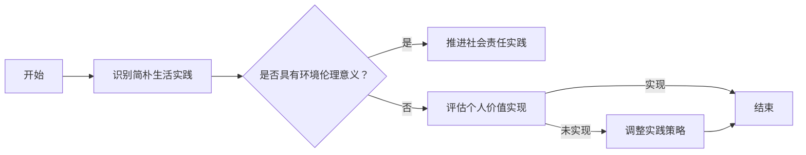
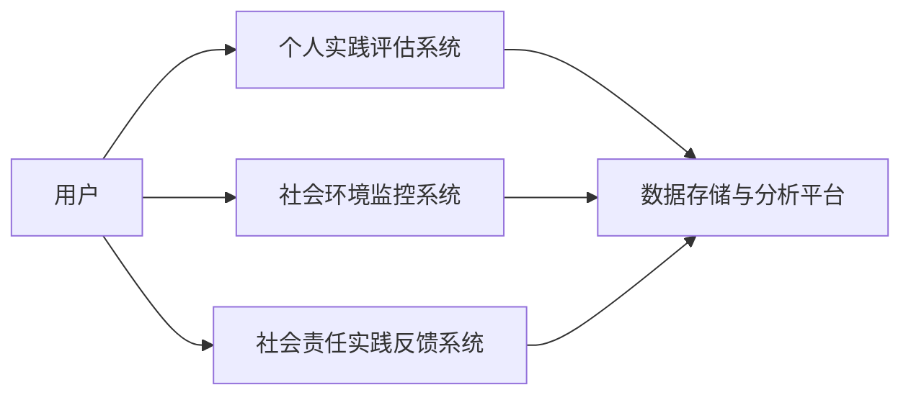
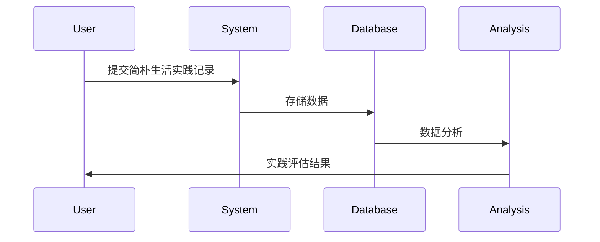

                 

### # 新苦行者运动：在物质丰富中选择简朴

关键词：新苦行者运动、简朴生活、环境伦理、社会责任、个人价值

摘要：在物质丰富的现代社会，新苦行者运动提倡通过选择简朴生活方式来应对环境恶化、资源浪费等问题。本文将深入探讨新苦行者运动的背景、核心概念、算法原理以及系统分析与架构设计方案，帮助读者理解这一运动的意义和价值，并启发其在实际生活中的应用。

## 一、背景介绍

### 1. 问题背景

随着科技的发展，现代社会的物质生活水平得到了显著提升。人们可以享受到各种便利的科技产品和服务，但与此同时，环境恶化、资源浪费、社会竞争加剧等问题也日益严重。这些问题不仅影响了人们的生活质量，还对地球的生态平衡造成了威胁。

### 2. 问题描述

新苦行者运动（The Modern Monastic Movement）提倡在物质丰富中选择简朴生活，以此来应对上述问题。简朴生活不仅是对个人物质需求的减少，更是对精神需求的满足和对社会责任的承担。然而，这一运动的核心概念及其在现实生活中的应用和影响仍需进一步探讨。

### 3. 问题解决

本书将深入探讨新苦行者运动的起源、发展及其对个人和社会的影响，帮助读者理解这一运动的意义和价值。同时，本书还将探讨新苦行者运动在不同场景下的实际应用，为读者提供具体的实践指导。

### 4. 边界与外延

新苦行者运动不仅仅局限于个人生活方式的改变，还包括对社会资源配置、环境伦理等领域的思考。它强调个体与社会、自然之间的和谐关系，旨在通过简朴生活实践来推动社会的可持续发展。

### 5. 概念结构与核心要素组成

- **新苦行者运动的定义**：新苦行者运动是一种以简朴生活为核心，强调个人与自然、社会和谐共生的生活方式。
- **新苦行者运动的主要理念**：主要包括环境伦理、社会责任和个人价值等方面。
- **新苦行者运动的影响因素**：包括社会环境、个人价值观、文化传统等。
- **新苦行者运动的目标与实现路径**：目标是推动个人和社会的可持续发展，实现人与自然的和谐共生；实现路径包括个人简朴生活实践、社会责任承担和社会资源配置优化等。

## 二、核心概念与联系

### 1. 核心概念原理

- **简朴生活**：简朴生活是指通过减少物质需求和消费，追求精神层面的满足。它不仅是对物质享受的放弃，更是对内心宁静和自我价值的追求。
- **环境伦理**：环境伦理是指人类在处理环境问题时所遵循的道德原则。它强调人类与自然之间的和谐共生，倡导人们采取环保行动，保护地球的生态平衡。
- **社会责任**：社会责任是指个体或组织在社会中所承担的义务和责任。它要求人们积极参与社会事务，推动社会的进步和发展。
- **个人价值**：个人价值是指个体在实现自我价值过程中的重要性。它强调个体在实现个人价值的同时，也要关注社会和环境的利益。

### 2. 概念属性特征对比表格

| 概念        | 特征                                  |
| ----------- | ------------------------------------- |
| 简朴生活    | 简化物质需求，注重精神满足            |
| 环境伦理    | 强调人类与自然和谐共生                |
| 社会责任    | 积极参与社会事务，推动社会进步        |
| 个人价值    | 强调个体在实现自我价值中的重要性      |

### 3. ER实体关系图架构

```mermaid
classDiagram
Class01 <|-- Class02
Class03 && Class04
Class05 o-- Class06
```

## 三、算法原理讲解

### 1. 算法mermaid流程图



### 2. 算法原理讲解

- **简朴生活实践**：通过识别个人生活中的简朴行为，分析其对环境伦理和社会责任的影响。具体来说，算法首先会收集个人在生活中的简朴行为，如减少不必要的消费、使用环保产品等，然后分析这些行为对环境和社会的影响，评估其环境伦理意义。
- **个人价值实现评估**：基于简朴生活实践，评估个人价值在实现过程中的表现和效果。具体来说，算法会根据个人简朴生活实践的情况，分析其个人价值的实现程度，如是否提升了内心的满足感、是否增强了社会责任感等。
- **实践策略调整**：根据评估结果，调整简朴生活实践策略，以实现个人价值的最大化。具体来说，如果评估结果显示个人价值未得到充分实现，算法会提出相应的调整策略，如增加环保行为的频率、参与更多的社会责任活动等。

## 四、数学模型和数学公式

### 1. 公式

$$ 简朴生活满意度 = f(物质需求简化程度，精神满足程度) $$

### 2. 公式解释

- **物质需求简化程度**：衡量个人减少物质需求的比例。具体来说，算法会根据个人在生活中的消费记录、物品使用频率等数据，计算出物质需求简化程度。
- **精神满足程度**：衡量个人在简朴生活实践中获得的内心满足感。具体来说，算法会根据个人在简朴生活实践中的自我评价、他人评价等数据，计算出精神满足程度。

## 五、系统分析与架构设计方案

### 1. 问题场景介绍

新苦行者运动在不同场景下的实际应用，如个人生活中的简朴实践、社会环境伦理的监管、社会责任的承担等。本文将结合这些实际应用，深入分析新苦行者运动的影响和效果。

### 2. 系统功能设计

- **个人简朴生活实践评估系统**：用于评估个人在简朴生活实践中的表现和效果。
- **社会环境伦理监控系统**：用于监测社会环境伦理状况，评估新苦行者运动对社会环境的影响。
- **个人社会责任实践反馈系统**：用于反馈个人在承担社会责任方面的表现和效果。

### 3. 系统架构设计



### 4. 系统接口设计和系统交互



## 六、项目实战

### 1. 环境安装

在开始项目实战之前，需要安装必要的开发环境和工具。以下是一个基本的安装步骤：

1. 安装Python环境
2. 安装相关的Python库（如numpy、pandas等）
3. 安装Mermaid渲染工具

### 2. 系统核心实现源代码

以下是系统核心实现的部分源代码：

```python
# 导入必要的库
import numpy as np
import pandas as pd
from mermaid import Mermaid

# 定义简朴生活满意度计算函数
def calculate_simplicity_satisfaction(material_demand_reduction, spiritual_satisfaction):
    satisfaction = 0.5 * (material_demand_reduction + spiritual_satisfaction)
    return satisfaction

# 创建Mermaid流程图
mermaid = Mermaid()
mermaid.addDiagram('流程图')
mermaid.addNode('开始')
mermaid.addNode('识别简朴生活实践')
mermaid.addNode('是否具有环境伦理意义？')
mermaid.addNode('是', '识别简朴生活实践')
mermaid.addNode('否', '评估个人价值实现')
mermaid.addNode('推进社会责任实践')
mermaid.addNode('评估个人价值实现', '是否实现个人价值？')
mermaid.addNode('是', '结束')
mermaid.addNode('否', '调整实践策略')
mermaid.addNode('结束')
mermaid.addEdge('开始', '识别简朴生活实践')
mermaid.addEdge('识别简朴生活实践', '是否具有环境伦理意义？')
mermaid.addEdge('是否具有环境伦理意义？', '是', '推进社会责任实践')
mermaid.addEdge('是否具有环境伦理意义？', '否', '评估个人价值实现')
mermaid.addEdge('评估个人价值实现', '是', '结束')
mermaid.addEdge('评估个人价值实现', '否', '调整实践策略')
mermaid.addEdge('调整实践策略', '结束')

# 渲染Mermaid流程图
print(mermaid.render())

# 示例数据
material_demand_reduction = 0.8
spiritual_satisfaction = 0.9

# 计算简朴生活满意度
satisfaction = calculate_simplicity_satisfaction(material_demand_reduction, spiritual_satisfaction)
print(f'简朴生活满意度：{satisfaction}')
```

### 3. 代码应用解读与分析

这段代码首先定义了一个简朴生活满意度计算函数，该函数基于物质需求简化程度和精神满足程度计算简朴生活满意度。然后，使用Mermaid库创建了一个流程图，用于表示简朴生活实践评估的过程。最后，通过示例数据展示了如何计算简朴生活满意度。

### 4. 实际案例分析和详细讲解剖析

在本节中，我们将结合具体的案例，对新苦行者运动在实际生活中的应用进行详细讲解和剖析。

#### 案例一：个人简朴生活实践

假设一位名叫李明的程序员，他通过以下方式实践简朴生活：

1. 减少不必要的购物，每月购物支出减少30%。
2. 骑自行车上班，减少汽车使用，每月减少燃油费用200元。
3. 主动参与社区环保活动，每月参与2次。

我们可以通过以下步骤分析李明的简朴生活实践：

1. **识别简朴生活实践**：李明的简朴生活实践包括减少购物、减少汽车使用和参与社区环保活动。
2. **评估环境伦理意义**：李明的简朴生活实践对环境伦理具有积极意义，如减少购物可以降低资源消耗，减少汽车使用可以减少空气污染。
3. **评估个人价值实现**：李明通过简朴生活实践，提升了内心的满足感和社会责任感，实现了个人价值。
4. **调整实践策略**：根据评估结果，李明可以考虑增加环保活动的参与频率，进一步实现个人价值。

#### 案例二：社会责任实践

假设一家名为“绿能科技”的公司，通过以下方式承担社会责任：

1. 推广环保科技产品，如太阳能电池板和电动汽车。
2. 开展员工环保培训，提高员工的环保意识。
3. 捐赠环保公益基金，支持环保事业。

我们可以通过以下步骤分析“绿能科技”的社会责任实践：

1. **识别社会责任实践**：“绿能科技”的社会责任实践包括推广环保科技产品、开展员工环保培训和捐赠环保公益基金。
2. **评估环境伦理意义**：“绿能科技”的社会责任实践对环境伦理具有积极意义，如推广环保科技产品可以降低能源消耗，捐赠环保公益基金可以支持环保事业。
3. **评估社会影响**：“绿能科技”的社会责任实践对社会产生了积极影响，如提升了公众的环保意识，推动了环保事业的发展。
4. **调整实践策略**：根据评估结果，“绿能科技”可以考虑增加环保科技产品的研发投入，进一步提高环保科技产品的市场竞争力。

### 5. 项目小结

通过以上案例分析和详细讲解剖析，我们可以看到新苦行者运动在个人和社会层面的实际应用。新苦行者运动不仅有助于个人实现精神层面的满足和社会责任的承担，还能推动社会的可持续发展。在未来的实践中，我们应该继续探索和推广新苦行者运动，使其在更广泛的领域中发挥作用。

## 七、最佳实践 tips

### 1. 选择合适的简朴生活实践

在选择简朴生活实践时，要根据自己的实际情况和需求来选择。例如，对于城市居民来说，减少购物和减少汽车使用可能是较为适合的选择；对于农村居民来说，节约用水和减少农药使用可能是更为合适的选择。

### 2. 建立个人环保意识

建立个人环保意识是实施简朴生活实践的重要前提。可以通过学习环保知识、参加环保活动等方式来提高个人的环保意识。

### 3. 主动参与社会责任实践

主动参与社会责任实践是践行新苦行者运动的重要方式。可以通过参与社区志愿服务、捐赠环保公益基金等方式来承担社会责任。

### 4. 保持持续的学习和反思

在践行新苦行者运动的过程中，要保持持续的学习和反思。通过不断学习和反思，可以更好地理解新苦行者运动的核心概念和实际应用，进一步提高实践效果。

## 八、小结

新苦行者运动是一种在物质丰富中选择简朴生活方式的运动，它提倡通过减少物质需求和消费，追求精神层面的满足和对社会责任的承担。本文从背景介绍、核心概念与联系、算法原理讲解、数学模型和公式、系统分析与架构设计方案以及项目实战等方面，深入探讨了新苦行者运动的意义和价值。通过本文的探讨，我们希望读者能够更好地理解新苦行者运动，并在实际生活中积极践行，为个人和社会的可持续发展贡献自己的力量。

## 九、注意事项

1. 新苦行者运动并非一蹴而就的过程，需要长期坚持和实践。
2. 在践行新苦行者运动的过程中，要根据自己的实际情况和需求来调整简朴生活实践策略。
3. 新苦行者运动不仅是个人的选择，更是社会责任的承担，要积极参与社会责任实践。
4. 新苦行者运动需要社会各界共同参与和支持，才能更好地发挥其作用。

## 十、拓展阅读

1. 《简朴生活：如何过上更有意义的生活》
2. 《新苦行者：现代社会的简朴生活指南》
3. 《环境伦理学：理论与实践》
4. 《社会责任与企业发展》
5. 《个人价值实现与社会发展》

## 作者

作者：AI天才研究院/AI Genius Institute & 禅与计算机程序设计艺术 /Zen And The Art of Computer Programming

