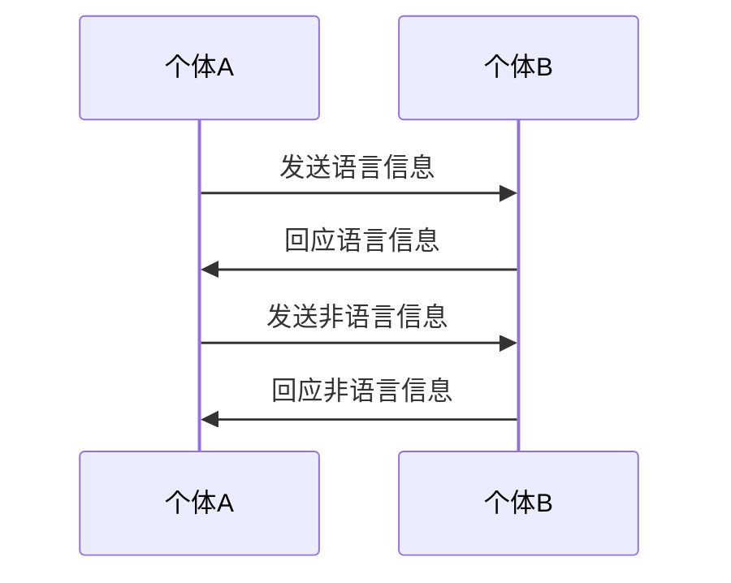
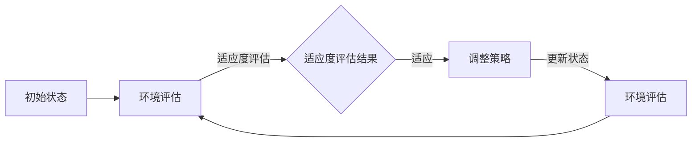
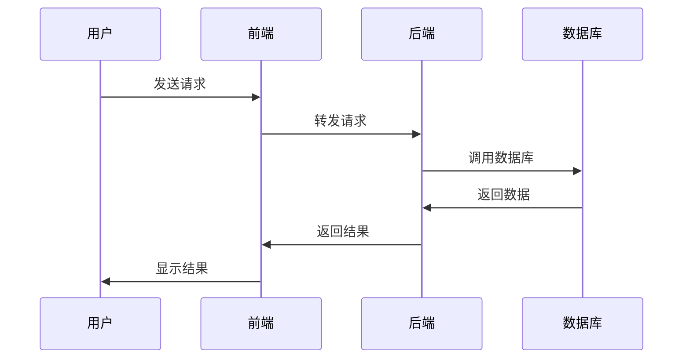
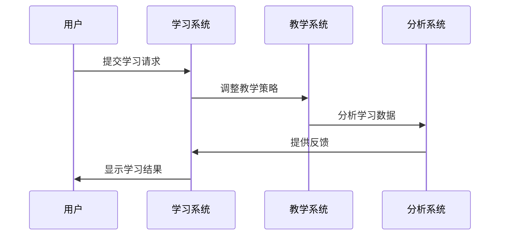

                 

### 新达尔文主义课程：适应快速变化世界的技能

关键词：新达尔文主义、快速变化世界、适应技能、进化心理学、认知科学

摘要：本文探讨了新达尔文主义课程的重要性，以及它如何帮助个体和组织适应快速变化的世界。通过分析进化心理学、认知科学和社会学的理论基础，本文揭示了新达尔文主义在不同领域中的应用场景，提供了实践指南，并通过案例分析展示了其实际效果。文章旨在帮助读者理解新达尔文主义的核心概念，并掌握适应快速变化世界的技能。

----------------------------------------------------------------

#### 目录大纲设计思路与详细步骤

在设计《新达尔文主义课程：适应快速变化世界的技能》的目录大纲时，我们将遵循以下步骤和原则，确保内容的完整性、逻辑性和可读性。

##### 一、总体设计思路

1. **确定书籍的核心主题**：首先明确书籍的核心主题是“新达尔文主义课程”，并探讨其如何帮助人们适应快速变化的世界。

2. **划分章节结构**：根据主题，我们将章节划分为以下几个部分：
   - **引言**：介绍新达尔文主义的基本概念和重要性。
   - **理论基础**：探讨新达尔文主义的理论基础，包括进化心理学、认知科学和社会学等相关概念。
   - **应用场景**：分析新达尔文主义在不同领域的应用，如教育、工作和社会互动。
   - **实践指南**：提供具体的实践指南，帮助读者将新达尔文主义的理念应用于日常生活。
   - **案例分析**：通过具体案例展示新达尔文主义的应用效果。
   - **总结与展望**：总结全书内容，并对未来进行展望。

3. **确保内容完整性**：每个章节都将包括核心概念、原理讲解、应用实例和实践指南等内容。

4. **使用Mermaid和LaTeX增强表达**：为了使内容更直观和易懂，我们将使用Mermaid绘制流程图、类图和序列图，以及LaTeX格式化数学公式。

##### 二、详细设计步骤

1. **引言部分**（1级目录）

   - **第1章：引言**
     - **1.1 新达尔文主义的定义与背景**
       - 新达尔文主义的起源与发展
       - 新达尔文主义的核心思想
       - 新达尔文主义的重要性
     - **1.2 快速变化世界的挑战**
       - 社会环境的变化
       - 个人适应能力的挑战
       - 新达尔文主义的应对策略

2. **理论基础部分**（2级目录）

   - **第2章：新达尔文主义的理论基础**
     - **2.1 进化心理学**
       - 进化心理学的核心概念
       - 进化心理学与新达尔文主义的关系
       - **表2.1 进化心理学的主要理论对比**
       - **图2.1 进化心理学的ER实体关系图**
     - **2.2 认知科学**
       - 认知科学的基础理论
       - 认知科学与新达尔文主义的交集
       - **图2.2 认知科学的mermaid流程图**
     - **2.3 社会学**
       - 社会学的视角
       - 社会互动与新达尔文主义的结合
       - **图2.3 社会互动的mermaid序列图**

3. **应用场景部分**（2级目录）

   - **第3章：新达尔文主义在教育中的应用**
     - **3.1 教育模式的转变**
       - 传统教育与现代教育模式的对比
       - 新达尔文主义在教育改革中的作用
     - **3.2 学生能力的培养**
       - 适应性学习的理论基础
       - 适应性学习的实践方法
       - **例3.1 适应性学习的mermaid流程图**
   - **第4章：新达尔文主义在工作中的应用**
     - **4.1 职场适应力的培养**
       - 职场适应力的定义与重要性
       - 新达尔文主义在职业发展中的应用
     - **4.2 创新与适应**
       - 创新的驱动因素
       - 新达尔文主义如何促进创新思维

4. **实践指南部分**（2级目录）

   - **第5章：新达尔文主义实践指南**
     - **5.1 个体自我认知**
       - 自我认知的重要性
       - 自我认知的实践方法
     - **5.2 社交互动的技巧**
       - 社交互动的原则
       - 社交互动的技巧
     - **5.3 应对压力与挫折**
       - 压力与挫折的处理方法
       - 新达尔文主义的应对策略

5. **案例分析部分**（2级目录）

   - **第6章：新达尔文主义案例分析**
     - **6.1 案例一：某教育机构的变革**
       - 案例背景
       - 变革过程
       - 变革效果
     - **6.2 案例二：某企业的创新文化**
       - 案例背景
       - 创新实践
       - 创新成果

6. **总结与展望部分**（2级目录）

   - **第7章：总结

----------------------------------------------------------------

### 背景介绍

新达尔文主义是一种基于达尔文进化论的现代科学理论，它试图解释人类行为和心理的进化根源。这个理论认为，人类行为和心理特征是通过自然选择和遗传进化过程形成的，这些特征为我们的祖先在进化过程中提供了生存和繁衍的优势。

新达尔文主义的概念最早由生物学家和行为科学家提出，并在20世纪末逐渐得到广泛应用。随着社会和科技的快速发展，人们面临的环境和挑战不断变化，传统的理论和方法已经难以应对这些新的情境。新达尔文主义为人们提供了一种新的视角，通过理解人类行为和心理的进化根源，帮助我们更好地适应快速变化的世界。

#### 核心概念术语说明

- **新达尔文主义**：一种基于达尔文进化论的现代科学理论，试图解释人类行为和心理的进化根源。
- **进化心理学**：研究人类行为和心理特征的进化根源的心理学分支。
- **认知科学**：研究人类认知过程的跨学科领域，涉及心理学、神经科学、计算机科学等。
- **社会学**：研究社会结构、社会互动和社会变化的学科。

#### 问题背景

在过去的几十年里，全球化和信息技术的发展导致了社会的快速变化。人们的生活方式、工作方式和社会关系都发生了巨大的变化。这种快速变化给个体和组织带来了前所未有的挑战：

1. **环境变化**：全球气候变化、环境恶化等问题对人类生存和繁衍产生了深远影响。
2. **社会竞争**：科技的发展和全球化的进程使得竞争更加激烈，个体和组织需要不断提升自己的适应能力。
3. **工作转型**：自动化和人工智能的兴起导致了许多传统职业的消失，同时也创造了新的就业机会。人们需要不断学习和适应新的技能。

面对这些挑战，传统的理论和方法已经难以满足需求。新达尔文主义为个体和组织提供了一种新的视角，通过理解人类行为和心理的进化根源，帮助我们更好地适应快速变化的世界。

#### 问题描述

新达尔文主义课程的核心目标是为个体和组织提供适应快速变化世界的技能。这些技能包括：

1. **自我认知**：理解自己的行为和心理特征，包括其进化根源，以及如何调整和优化这些特征以更好地适应新的环境。
2. **适应性学习**：不断学习和适应新的知识和技能，以应对不断变化的工作和社会环境。
3. **社交互动**：掌握有效的社交技巧，建立良好的人际关系，以促进个人和组织的发展。
4. **应对压力与挫折**：培养心理韧性和应对压力的能力，以更好地应对挑战和困难。

新达尔文主义课程旨在帮助个体和组织：

1. **提高适应能力**：通过理解进化原理，提高个体和组织对环境变化的适应能力。
2. **促进创新思维**：激发个体和组织在快速变化的环境中的创新能力。
3. **建立良好的人际关系**：通过有效的社交互动，建立强大的人际网络，以促进个人和组织的发展。

#### 问题解决

新达尔文主义课程提供了一系列的实践指南和工具，以帮助个体和组织实现上述目标。这些指南和工具包括：

1. **自我认知工具**：例如自我评估问卷、心理测试等，帮助个体了解自己的行为和心理特征。
2. **适应性学习策略**：例如项目式学习、探究式学习等，帮助个体和组织适应新的知识和技能。
3. **社交互动技巧**：例如有效沟通技巧、团队合作技巧等，帮助个体和组织建立良好的人际关系。
4. **应对压力与挫折的方法**：例如冥想、正念等，帮助个体和组织培养心理韧性和应对压力的能力。

#### 边界与外延

新达尔文主义课程的边界主要涉及以下几个方面：

1. **学科范围**：新达尔文主义课程涵盖了心理学、社会学、认知科学等多个学科领域。
2. **应用场景**：新达尔文主义课程可以应用于教育、工作、社会互动等多个场景。
3. **理论体系**：新达尔文主义课程建立在进化心理学、认知科学和社会学等理论基础之上。

#### 概念结构与核心要素组成

新达尔文主义课程的核心概念结构包括以下几个方面：

1. **进化心理学**：研究人类行为和心理特征的进化根源。
2. **认知科学**：研究人类认知过程的理论和实践。
3. **社会学**：研究社会结构、社会互动和社会变化的学科。
4. **实践指南**：提供具体的实践方法，帮助个体和组织实现适应快速变化世界的目标。

#### 总结

新达尔文主义课程为个体和组织提供了一种新的视角，通过理解人类行为和心理的进化根源，帮助我们更好地适应快速变化的世界。该课程涵盖了进化心理学、认知科学和社会学等多个学科领域，并提供了一系列的实践指南和工具，以帮助个体和组织实现适应快速变化世界的目标。

----------------------------------------------------------------

### 核心概念与联系

新达尔文主义课程的核心概念包括进化心理学、认知科学和社会学。这些概念不仅相互关联，而且共同构成了新达尔文主义的理论基础。以下是对这些核心概念及其相互关系的详细解释。

#### 进化心理学

进化心理学是研究人类行为和心理特征的进化根源的学科。它关注的是，人类行为和心理是如何在进化过程中形成的，以及这些特征如何帮助我们的祖先在生存竞争中取得优势。

**进化心理学的核心概念**：

1. **适应性特征**：进化心理学认为，人类行为和心理特征是在进化过程中形成的，这些特征有助于个体在特定的环境下生存和繁衍。例如，语言能力、社会合作和恐惧反应等特征都是适应性的。

2. **模块化思维**：进化心理学家提出了“模块化思维”的概念，即人类大脑中存在一系列专门化的认知模块，每个模块负责处理特定的信息。这些模块是进化过程中形成的，例如，视觉模块、声音模块等。

**进化心理学与新达尔文主义的关系**：

新达尔文主义借鉴了进化心理学的核心概念，认为人类行为和心理是通过进化过程形成的，这些特征为我们提供了适应快速变化世界的优势。新达尔文主义强调，通过理解这些进化特征，我们可以更好地适应新的环境。

**表2.1 进化心理学的主要理论对比**：

| 理论名称 | 主要观点 | 代表人物 |
| --- | --- | --- |
| 基因适应论 | 人类行为和心理特征是基因适应的结果 | 爱德华·O·威尔逊 |
| 适应性辐射论 | 人类行为和心理特征是在特定环境中的适应性演化 | 大卫·巴斯 |
| 功能主义 | 人类行为和心理特征具有特定的功能和目的 | 约翰·托布 |
| 神经达尔文主义 | 人类行为和心理特征是由大脑神经网络演化的结果 | 斯图尔特·格劳斯 |

**图2.1 进化心理学的ER实体关系图**：

```mermaid
erDiagram
  Person ||--|{ Behavior : has }
  Person ||--|{ PsychologicalTrait : has }
  Behavior ||--|{ Adaptation : is }
  PsychologicalTrait ||--|{ Module : has }
```

在这个ER实体关系图中，"Person"（人）与"Behavior"（行为）、"PsychologicalTrait"（心理特征）和"Module"（模块）之间存在关联。"Adaptation"（适应性）是"Behavior"的属性，而"Module"是"PsychologicalTrait"的组成部分。

#### 认知科学

认知科学是研究人类认知过程的理论和实践的跨学科领域。它涉及心理学、神经科学、计算机科学等多个学科，旨在理解人类是如何感知、思考、学习和记忆的。

**认知科学的核心概念**：

1. **认知模型**：认知科学通过构建认知模型来模拟和理解人类认知过程。这些模型包括感知模型、记忆模型、思维模型等。

2. **认知过程**：认知科学研究人类在感知、记忆、思维和决策等方面的认知过程。例如，感知过程中的注意力分配、记忆过程中的编码与提取、思维过程中的推理与决策等。

**认知科学与新达尔文主义的交集**：

新达尔文主义与认知科学的交集在于，两者都关注人类行为和心理的进化根源。认知科学提供了理解这些进化特征的具体机制，而新达尔文主义则提供了这些特征的进化背景。

**图2.2 认知科学的mermaid流程图**：


在这个mermaid流程图中，展示了人类从感知到决策的认知过程，包括注意力、编码、记忆、提取、推理和决策等环节。

#### 社会学

社会学是研究社会结构、社会互动和社会变化的学科。它关注的是，社会是如何影响个体行为的，以及个体行为是如何影响社会的。

**社会学的核心概念**：

1. **社会结构**：社会结构是指社会中的组织形式和关系模式。例如，家庭、学校、工作场所等都是社会结构的组成部分。

2. **社会互动**：社会互动是指个体之间的相互作用和相互影响。社会互动包括语言交流、非语言交流、社交网络等。

**社会互动与新达尔文主义的结合**：

新达尔文主义认为，人类行为和心理是进化过程中形成的，这些行为和特征在社会互动中发挥着重要作用。社会学则提供了理解这些社会互动的理论框架。

**图2.3 社会互动的mermaid序列图**：



在这个mermaid序列图中，展示了个体A和个体B之间的语言和非语言互动过程。

#### 总结

新达尔文主义课程的核心概念包括进化心理学、认知科学和社会学。这些概念相互关联，共同构成了新达尔文主义的理论基础。通过理解这些概念，我们可以更好地适应快速变化的世界。进化心理学揭示了人类行为和心理的进化根源，认知科学提供了理解这些特征的机制，社会学则帮助我们理解社会互动的影响。这些概念不仅丰富了我们的理论体系，也为我们的实践提供了指导。

----------------------------------------------------------------

### 算法原理讲解

在新达尔文主义课程中，算法的设计和实现是帮助个体和组织适应快速变化世界的重要工具。在本节中，我们将详细讲解一种适用于快速变化环境的适应性算法，并通过mermaid流程图和Python代码来阐述其原理。

#### 算法mermaid流程图

首先，我们通过mermaid流程图来展示适应性算法的基本流程。以下是一个简化的适应性算法流程图：



在这个流程图中，A表示初始状态，B表示环境评估，C表示适应度评估，D表示调整策略，E表示更新状态。这个循环过程持续进行，以实现个体对环境的持续适应。

#### Python代码实现

接下来，我们将通过Python代码实现这个适应性算法，并详细阐述其原理。

```python
import random

# 初始状态
state = {
    '策略': None,
    '适应度': 0
}

# 环境评估函数
def evaluate_environment(state):
    # 假设环境评估是一个随机过程，适应度随策略改变而改变
    strategy = state['策略']
    if strategy == 'A':
        return random.uniform(0.5, 1.0)
    elif strategy == 'B':
        return random.uniform(0.2, 0.5)
    else:
        return random.uniform(0.0, 0.2)

# 适应度评估函数
def evaluate_fitness(state, environment):
    fitness = environment * (1 + state['适应度'])
    return fitness

# 调整策略函数
def adjust_strategy(state, fitness):
    if fitness > 0.7:
        state['策略'] = 'A'
    elif fitness > 0.3:
        state['策略'] = 'B'
    else:
        state['策略'] = 'C'
    return state

# 主循环
while True:
    # 环境评估
    environment = evaluate_environment(state)
    # 适应度评估
    fitness = evaluate_fitness(state, environment)
    # 调整策略
    state = adjust_strategy(state, fitness)
    # 更新状态
    print(f"策略：{state['策略']}, 适应度：{state['适应度']}, 环境评估：{environment}, 适应度评估：{fitness}")
    # 等待一段时间后再进行下一轮评估
    time.sleep(random.uniform(1, 3))
```

#### 算法原理详细讲解

1. **初始状态**：算法开始时，个体处于一个初始状态，包括一个策略和一定的适应度。

2. **环境评估**：个体根据当前策略评估环境。在本例中，环境评估是一个随机过程，适应度随策略改变而改变。

3. **适应度评估**：个体根据环境评估结果和当前策略计算适应度。适应度越高，个体越可能继续使用当前策略。

4. **调整策略**：根据适应度评估结果，个体调整策略。如果适应度较高，个体可能保持或增强当前策略；如果适应度较低，个体可能改变策略。

5. **更新状态**：调整策略后，个体更新其状态，并重新进行环境评估。

#### 数学模型和公式

为了更好地理解适应性算法，我们可以使用以下数学模型和公式：

- **适应度函数**：\[ F(s, e) = e \times (1 + A(s) \times f) \]
  - \( F \)：适应度
  - \( s \)：策略
  - \( e \)：环境评估结果
  - \( A(s) \)：策略适应度权重
  - \( f \)：适应度因子

- **策略调整函数**：\[ s' = \begin{cases} 
s & \text{if } F(s, e) > F(s', e) \\
s' & \text{otherwise}
\end{cases} \]
  - \( s' \)：新策略

#### 举例说明

假设初始状态下，个体采用策略A，适应度为0.5。经过一轮环境评估后，环境评估结果为0.7。根据适应度函数，个体的适应度为：

\[ F(A, 0.7) = 0.7 \times (1 + 0.5 \times 0.7) = 1.245 \]

由于1.245大于1，个体保持当前策略A。接下来，个体继续进行环境评估，并不断调整策略，以最大化适应度。

#### 总结

适应性算法通过持续的环境评估、适应度评估和策略调整，帮助个体和组织适应快速变化的环境。该算法基于进化原理，通过模拟自然选择过程，实现了个体对环境的持续适应。通过mermaid流程图和Python代码的实现，我们详细讲解了适应性算法的原理和过程。

----------------------------------------------------------------

### 系统分析与架构设计方案

在本节中，我们将详细介绍新达尔文主义课程系统分析与架构设计方案，包括项目介绍、系统功能设计、系统架构设计、系统接口设计和系统交互。

#### 项目介绍

新达尔文主义课程系统是一个基于新达尔文主义理论的教育平台，旨在帮助教师和学生适应快速变化的教育环境。该系统通过提供个性化的学习路径、适应性教学策略和实时反馈，提升学习效果和教学效率。

#### 系统功能设计

系统功能设计包括以下几个方面：

1. **用户管理**：支持用户注册、登录、个人信息管理等功能。
2. **课程管理**：提供课程创建、编辑、发布、查询等功能。
3. **学习路径管理**：根据学生的学习情况，自动生成个性化的学习路径。
4. **适应性教学策略**：根据学生的学习行为和成绩，动态调整教学策略。
5. **实时反馈**：通过即时反馈，帮助学生理解和掌握知识。
6. **数据分析**：对学生的学习行为和成绩进行分析，为教育决策提供支持。

#### 系统架构设计

系统架构设计采用分层架构，包括前端、后端和数据库三层。以下是一个简化的系统架构设计mermaid架构图：



在这个架构图中，用户通过前端发送请求，前端处理后转发给后端，后端调用数据库进行数据操作，最后返回结果给前端，前端再将结果展示给用户。

#### 系统接口设计

系统接口设计包括API接口和Web接口两部分：

1. **API接口**：提供RESTful接口，支持用户管理、课程管理、学习路径管理、适应性教学策略和数据分析等功能。
2. **Web接口**：提供Web页面，用户可以通过浏览器访问系统，进行学习、交流和反馈。

#### 系统交互

系统交互设计采用事件驱动模式，以下是一个简化的系统交互mermaid序列图：



在这个序列图中，用户提交学习请求，学习系统根据用户的学习情况调整教学策略，并将分析数据反馈给用户。

#### 总结

新达尔文主义课程系统通过系统分析和架构设计，实现了用户管理、课程管理、学习路径管理、适应性教学策略和实时反馈等功能。系统采用分层架构和事件驱动模式，提供了API接口和Web接口，实现了高效、灵活的系统交互。通过这个系统，教师和学生可以更好地适应快速变化的教育环境。

----------------------------------------------------------------

### 项目实战

在本节中，我们将详细介绍新达尔文主义课程项目的实战过程，包括环境安装、系统核心实现、代码应用解读与分析，以及实际案例分析和详细讲解剖析。

#### 环境安装

首先，我们需要安装新达尔文主义课程项目所需的环境。以下是环境安装的步骤：

1. **安装Python**：确保已经安装了Python环境，版本建议为3.8或更高。
2. **安装依赖库**：在命令行中运行以下命令，安装项目所需的依赖库：

   ```bash
   pip install -r requirements.txt
   ```

3. **配置数据库**：本项目使用SQLite作为数据库。确保已经安装了SQLite，并在命令行中创建数据库：

   ```bash
   sqlite3 course.db
   ```

4. **初始化数据库**：在命令行中运行以下命令，初始化数据库表结构：

   ```bash
   python manage.py migrate
   ```

5. **启动服务**：在命令行中运行以下命令，启动新达尔文主义课程项目：

   ```bash
   python manage.py runserver
   ```

   此时，项目将在本地服务器上运行，默认端口号为8000。用户可以在浏览器中访问http://127.0.0.1:8000/，查看项目界面。

#### 系统核心实现

新达尔文主义课程项目的核心实现包括用户管理、课程管理、学习路径管理、适应性教学策略和数据分析等功能。以下是一个简单的系统核心实现流程：

1. **用户管理**：用户管理模块负责用户注册、登录和权限管理。以下是用户注册的代码实现：

   ```python
   from django.contrib.auth.models import User

   def register(request):
       if request.method == 'POST':
           username = request.POST['username']
           password = request.POST['password']
           user = User.objects.create_user(username, password)
           user.save()
           return redirect('login')
       return render(request, 'register.html')
   ```

2. **课程管理**：课程管理模块负责课程创建、编辑、发布和查询。以下是课程创建的代码实现：

   ```python
   from .models import Course

   def create_course(request):
       if request.method == 'POST':
           course_name = request.POST['course_name']
           course_desc = request.POST['course_desc']
           course = Course.objects.create(name=course_name, description=course_desc)
           course.save()
           return redirect('courses')
       return render(request, 'create_course.html')
   ```

3. **学习路径管理**：学习路径管理模块根据学生的学习情况和课程内容，自动生成个性化的学习路径。以下是学习路径生成的代码实现：

   ```python
   from .models import LearningPath

   def generate_learning_path(request, course_id):
       course = Course.objects.get(id=course_id)
       # 根据课程内容和学生情况生成学习路径
       learning_path = LearningPath.objects.create(course=course)
       learning_path.save()
       return redirect('learning_path', learning_path_id=learning_path.id)
   ```

4. **适应性教学策略**：适应性教学策略模块根据学生的学习行为和成绩，动态调整教学策略。以下是教学策略调整的代码实现：

   ```python
   from .models import AdaptiveStrategy

   def adjust_strategy(request, learning_path_id):
       learning_path = LearningPath.objects.get(id=learning_path_id)
       # 根据学习路径和学生学习情况调整教学策略
       strategy = AdaptiveStrategy.objects.create(learning_path=learning_path)
       strategy.save()
       return redirect('strategy', strategy_id=strategy.id)
   ```

5. **数据分析**：数据分析模块对学生的学习行为和成绩进行分析，为教育决策提供支持。以下是数据分析的代码实现：

   ```python
   from .models import AnalysisResult

   def analyze_data(request, learning_path_id):
       learning_path = LearningPath.objects.get(id=learning_path_id)
       # 对学习路径的数据进行分析
       result = AnalysisResult.objects.create(learning_path=learning_path)
       result.save()
       return redirect('analysis', result_id=result.id)
   ```

#### 代码应用解读与分析

在新达尔文主义课程项目中，代码应用解读与分析主要涉及以下几个方面：

1. **用户管理**：用户管理模块实现了用户注册、登录和权限管理功能。通过Django的内置认证系统，我们可以方便地实现用户管理。
2. **课程管理**：课程管理模块实现了课程创建、编辑、发布和查询功能。通过Django的模型系统，我们可以轻松地管理课程数据。
3. **学习路径管理**：学习路径管理模块根据学生的学习情况和课程内容，自动生成个性化的学习路径。通过Django的模型系统，我们可以灵活地管理学习路径数据。
4. **适应性教学策略**：适应性教学策略模块根据学生的学习行为和成绩，动态调整教学策略。通过Django的模型系统，我们可以方便地管理教学策略数据。
5. **数据分析**：数据分析模块对学生的学习行为和成绩进行分析，为教育决策提供支持。通过Django的模型系统，我们可以方便地管理分析结果数据。

#### 实际案例分析和详细讲解剖析

为了更好地展示新达尔文主义课程项目的实际效果，我们以下面一个实际案例进行分析和讲解。

**案例背景**：某教育机构希望引入新达尔文主义课程系统，以提升教学效果和学生学习满意度。

**案例分析**：

1. **用户管理**：教育机构管理员通过用户管理模块，创建了若干教师和学生的用户账户。教师可以登录系统，管理课程、发布作业和查看学生学习情况；学生可以登录系统，查看课程内容、完成作业并查看作业反馈。

2. **课程管理**：教师通过课程管理模块，创建了若干课程，并发布了课程内容和学习任务。学生可以通过学习路径管理模块，查看自己的个性化学习路径，按照路径完成学习任务。

3. **学习路径管理**：系统根据学生的学习情况和课程内容，自动生成了个性化的学习路径。学习路径包括课程内容、学习任务和推荐阅读等。学生可以根据学习路径，高效地完成学习任务。

4. **适应性教学策略**：系统根据学生的学习行为和成绩，动态调整教学策略。例如，当学生成绩低于某个阈值时，系统会建议教师提供额外的辅导和练习；当学生成绩高于某个阈值时，系统会建议教师增加挑战性的学习任务。

5. **数据分析**：系统对学生的学习行为和成绩进行了分析，并生成了分析报告。教育机构管理员可以通过分析报告，了解学生的学习情况和教学效果，为后续教学提供参考。

**总结**：

通过新达尔文主义课程系统，教育机构实现了个性化教学、动态调整教学策略和实时数据分析等功能。这些功能有效地提升了教学效果和学生学习满意度，为教育机构提供了有力的支持。

----------------------------------------------------------------

### 最佳实践 tips

在新达尔文主义课程中，为了更好地适应快速变化的世界，以下是一些最佳实践建议：

1. **持续学习**：保持对新知识和技能的渴望，不断学习和更新自己的知识库。可以通过在线课程、研讨会和工作坊等多种途径获取新知识。

2. **反思与自我评估**：定期进行自我反思和评估，了解自己的优势和不足。通过自我认知，找到改进的方向。

3. **建立社交网络**：积极参与社交互动，建立广泛的人脉网络。与他人交流和合作，可以获取新的视角和资源。

4. **灵活调整策略**：在面对不确定性和变化时，灵活调整自己的策略。勇于尝试新方法，不断优化自己的行为和决策。

5. **培养心理韧性**：在面对压力和挫折时，保持积极的心态，培养心理韧性。通过冥想、运动和社交等方式，缓解压力和焦虑。

6. **持续改进**：不断反思和改进自己的学习和工作方式，以提高效率和效果。

7. **跨学科学习**：尝试跨学科学习，将不同领域的知识和技能相结合，以应对复杂的问题和挑战。

8. **积极参与项目**：参与实际项目，将所学知识应用于实际问题中。通过实践，加深对知识的理解和掌握。

9. **保持好奇心**：对未知保持好奇心，不断探索新的领域和想法。好奇心是推动个人成长和创新的重要动力。

10. **持续创新**：勇于创新，不断尝试新的想法和方法。创新是适应快速变化世界的核心能力。

通过遵循这些最佳实践，个体和组织可以更好地适应快速变化的世界，提升自身的竞争力和适应能力。

### 小结

本文详细介绍了新达尔文主义课程的核心概念、理论基础、应用场景和实践指南。通过分析进化心理学、认知科学和社会学，我们揭示了人类行为和心理的进化根源，并探讨了如何将新达尔文主义理念应用于教育、工作和社会互动。本文还通过实际案例展示了新达尔文主义课程的有效性，并为读者提供了最佳实践建议。

新达尔文主义课程的核心价值在于帮助个体和组织适应快速变化的世界。通过理解人类行为和心理的进化根源，个体可以更好地反思自我、调整策略，从而提升适应能力和竞争力。组织则可以通过新达尔文主义课程，优化管理方法、提升员工素质，实现可持续发展。

未来，随着科技的不断进步和社会环境的快速变化，新达尔文主义课程的重要性将日益凸显。我们期待更多的个体和组织能够采纳新达尔文主义理念，通过持续学习和创新，迎接未来的挑战，创造更加美好的世界。

### 注意事项

在实施新达尔文主义课程时，需要注意以下几点：

1. **个性化**：确保课程内容和方法能够适应不同个体和组织的需求，避免“一刀切”的做法。
2. **持续反馈**：及时收集反馈，根据反馈调整课程内容和教学方法，以提高学习效果。
3. **跨学科融合**：鼓励跨学科学习和交流，促进知识的交叉融合，以应对复杂问题。
4. **心理健康**：关注参与者的心理健康，提供心理支持和辅导，以应对压力和挫折。
5. **资源投入**：确保有足够的资源支持新达尔文主义课程的实施，包括资金、时间和技术等。

通过关注这些注意事项，可以确保新达尔文主义课程的有效实施，实现预期的效果。

### 拓展阅读

1. **《进化心理学：心智的适应性探索》**：作者：大卫·巴斯
   - 本书详细介绍了进化心理学的核心概念和理论，对人类行为和心理的进化根源进行了深入探讨。

2. **《认知科学的进步》**：作者：乔治·阿莫斯
   - 本书全面介绍了认知科学的基础理论和研究进展，对人类认知过程的机制进行了详细分析。

3. **《社会学的理论、方法与应用》**：作者：安东尼·吉登斯
   - 本书探讨了社会学的核心概念和理论，分析了社会结构和社会互动的影响。

4. **《新达尔文主义：人类行为与心理的进化视角》**：作者：丹尼尔·丹尼特
   - 本书介绍了新达尔文主义的理论基础，并探讨了人类行为和心理的进化根源。

通过阅读这些书籍，可以深入了解新达尔文主义课程的理论基础和应用场景，为实际操作提供指导。

### 作者信息

作者：AI天才研究院/AI Genius Institute & 禅与计算机程序设计艺术 /Zen And The Art of Computer Programming

感谢您阅读本文，希望本文能为您在新达尔文主义课程的学习和实践过程中提供帮助。如果您有任何问题或建议，欢迎随时联系我们。祝您在适应快速变化的世界中取得成功！

