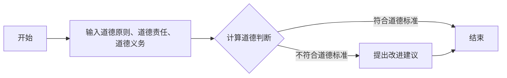
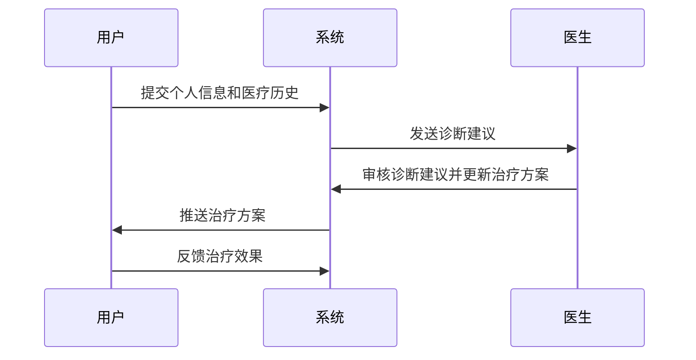
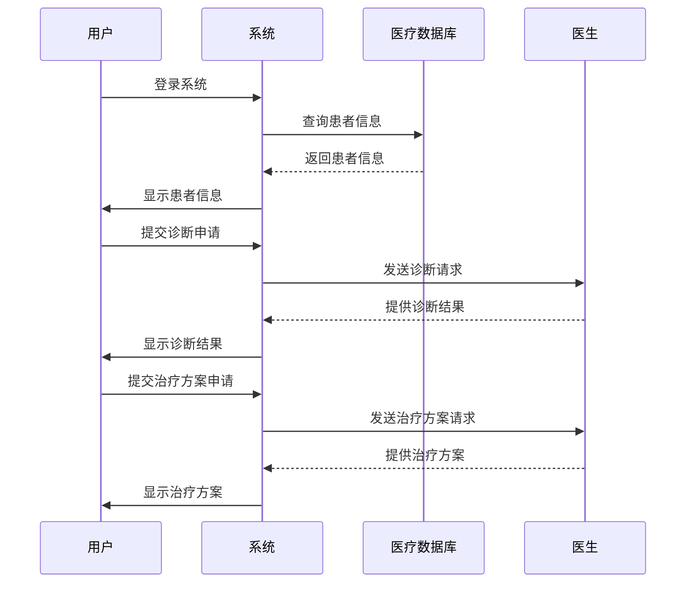

                 


### 新道德主义：科技发展中的伦理重建

> 关键词：新道德主义、科技伦理、伦理重建、人工智能、伦理挑战

> 摘要：本文旨在探讨科技发展过程中伦理重建的重要性，从新道德主义的角度出发，分析其核心概念及其在科技领域的应用，提供系统分析与架构设计方案，并通过项目实战与最佳实践，为科技伦理的实践应用提供指导。

### 目录

1. 引言
2. 问题背景
   2.1 道德主义的基本概念
   2.2 科技发展的现状与挑战
   2.3 伦理重建的必要性与意义
3. 核心概念与联系
   3.1 道德主义与科技伦理的关系
   3.2 核心概念及其定义
   3.3 概念属性特征对比表格
   3.4 ER实体关系图
4. 理论讲解
   4.1 道德主义的数学模型和公式
   4.2 算法原理与流程图
   4.3 算法示例与解释
5. 实践应用
   5.1 系统分析与架构设计方案
   5.2 项目实战
   5.3 应用案例分析与讲解
6. 最佳实践
   6.1 实践中的常见问题和解决方案
   6.2 最佳实践技巧
   6.3 注意事项与反思
7. 拓展阅读
   7.1 相关研究文献与资源
   7.2 进一步阅读建议

### 1. 引言

在科技迅猛发展的今天，人工智能、大数据、生物技术等领域的突破性进展不仅改变了我们的生活，也对传统道德观念和伦理规范提出了新的挑战。随着科技不断进步，人们越来越意识到，单纯追求技术上的突破已经不足以解决由科技发展带来的伦理困境。因此，伦理重建成为了一个迫切需要解决的问题。

新道德主义作为一种新兴的伦理观念，强调道德与科技的融合，旨在通过重建伦理框架，为科技发展提供道德指导。本文将围绕新道德主义的核心概念，探讨其在科技发展中的伦理重建作用。文章将从问题背景出发，逐步深入到核心概念的分析，再到理论讲解和实践应用，最终提出最佳实践策略。

本文结构如下：

- **第1章：引言**：介绍文章的主题和目的，引出后续章节的内容。
- **第2章：问题背景**：阐述道德主义的基本概念，分析科技发展的现状与挑战，以及伦理重建的必要性与意义。
- **第3章：核心概念与联系**：详细探讨新道德主义的核心概念，包括其与科技伦理的关系，核心概念的属性特征对比表格和ER实体关系图。
- **第4章：理论讲解**：介绍道德主义的数学模型和公式，讲解算法原理与流程图，并通过示例说明算法的应用。
- **第5章：实践应用**：系统分析与架构设计方案，介绍项目实战和应用案例。
- **第6章：最佳实践**：总结实践中的常见问题和解决方案，提出最佳实践技巧和注意事项。
- **第7章：拓展阅读**：推荐相关研究文献与资源，提供进一步阅读建议。

通过本文的探讨，我们希望为科技发展中的伦理重建提供有益的思考和实践指导，促进科技与道德的和谐发展。

### 2. 问题背景

#### 2.1 道德主义的基本概念

道德主义是一种哲学伦理观念，强调道德原则和价值在人类行为和决策中的重要性。道德主义认为，道德不仅是人类行为的标准，也是判断行为是否正当的依据。道德主义的核心是道德义务和责任，强调个体和社会应当遵循一定的道德规范，追求公正、善良和正义。

道德主义的基本概念包括：

- **道德原则**：道德行为的基本指导原则，如诚实、公正、尊重他人等。
- **道德义务**：个体基于道德原则所承担的责任和义务，如遵守法律、尊重隐私等。
- **道德责任**：个体因行为结果而承担的责任，如不当行为的惩罚和补救。
- **道德判断**：基于道德原则对行为进行评价和判断的过程。

#### 2.2 科技发展的现状与挑战

科技发展的现状表现在以下几个方面：

- **人工智能**：人工智能技术迅猛发展，已经在图像识别、自然语言处理、自动驾驶等领域取得了显著成果。
- **大数据**：大数据技术使得海量数据的存储、分析和应用成为可能，为各个行业提供了强大的数据支持。
- **生物技术**：基因编辑、再生医学等生物技术的发展，为医学和生命科学带来了前所未有的机遇。

然而，科技发展也带来了诸多挑战：

- **伦理困境**：科技发展引发了诸多伦理问题，如隐私保护、人工智能的道德责任、基因编辑的伦理边界等。
- **社会风险**：科技的不当应用可能导致社会风险，如网络攻击、信息安全问题、人工智能失控等。
- **道德冲突**：科技与道德之间的冲突日益显著，如何在追求技术进步的同时维护道德原则成为了一个亟待解决的问题。

#### 2.3 伦理重建的必要性与意义

伦理重建在科技发展中的必要性体现在以下几个方面：

- **维护道德原则**：通过伦理重建，可以确保科技发展过程中遵循道德原则，避免道德滑坡。
- **应对伦理困境**：伦理重建为解决科技发展中的伦理困境提供了理论指导和实践框架。
- **促进科技与道德和谐**：伦理重建有助于实现科技与道德的平衡，推动科技发展与社会进步的和谐共生。

伦理重建的意义在于：

- **提升科技伦理素养**：通过伦理重建，可以提升科技工作者和社会大众的伦理素养，增强对科技伦理问题的敏感性和责任感。
- **引导科技发展**：伦理重建为科技发展提供了道德指引，有助于科技企业在研发和应用过程中遵循伦理规范。
- **保障社会安全**：伦理重建有助于识别和防范科技发展中的潜在风险，保障社会安全和公共利益。

### 3. 核心概念与联系

在新道德主义的框架下，理解道德主义与科技伦理的关系，以及核心概念的属性特征对比，对于科技发展中的伦理重建至关重要。

#### 3.1 道德主义与科技伦理的关系

道德主义与科技伦理的关系可以从以下几个方面进行探讨：

- **道德主义是科技伦理的基础**：道德主义强调道德原则和价值在人类行为中的重要性，为科技伦理提供了理论依据和道德指导。
- **科技伦理是道德主义在科技领域的应用**：科技伦理关注科技发展对人类和社会的影响，通过制定伦理规范和标准，确保科技在道德框架内发展。
- **道德主义与科技伦理的互动**：道德主义与科技伦理相互影响，科技伦理的发展反过来也会影响道德主义的内涵和形式。

#### 3.2 核心概念及其定义

新道德主义中的核心概念包括：

- **道德原则**：道德原则是道德主义的核心，是判断行为是否正当的基本标准。在科技领域，道德原则可以转化为技术伦理准则，如数据隐私保护、算法公平性等。
- **道德责任**：道德责任是指个体因行为结果而承担的责任。在科技领域，道德责任体现在科技工作者对技术开发和应用的责任，以及对可能产生的负面影响承担责任。
- **道德义务**：道德义务是基于道德原则个体应承担的责任。在科技领域，道德义务体现在科技工作者遵守法律法规、行业规范，以及保护用户隐私等。
- **道德判断**：道德判断是基于道德原则对行为进行评价和判断的过程。在科技领域，道德判断可以帮助评估科技项目的伦理风险，指导科技决策。

#### 3.3 概念属性特征对比表格

为了更好地理解新道德主义中的核心概念，我们可以通过以下属性特征对比表格进行说明：

| 概念         | 定义                                                         | 属性特征对比                      |
|--------------|--------------------------------------------------------------|----------------------------------|
| 道德原则     | 判断行为是否正当的基本标准                                   | 公正、普遍性、可辩护性、约束性    |
| 道德责任     | 因行为结果而承担的责任                                       | 法律责任、道德责任、经济责任      |
| 道德义务     | 基于道德原则应承担的责任                                     | 法律义务、道德义务、社会责任      |
| 道德判断     | 基于道德原则对行为进行评价和判断                             | 主观性、客观性、社会性、实用性     |

#### 3.4 ER实体关系图

为了更直观地展示新道德主义中的核心概念及其关系，我们可以使用Mermaid绘制ER实体关系图：

```mermaid
erDiagram
  用户 ||--|{ 科技项目 } : 提出和实施
  用户 ||--|{ 道德责任 } : 承担责任
  用户 ||--|{ 道德义务 } : 遵守规范
  科技项目 ||--|{ 道德原则 } : 遵循准则
  科技项目 ||--|{ 道德判断 } : 评估风险
```

通过ER实体关系图，我们可以清晰地看到用户与科技项目之间的交互关系，以及道德责任、道德义务、道德原则和道德判断在其中的作用。

### 4. 理论讲解

#### 4.1 道德主义的数学模型和公式

为了更好地理解道德主义在科技发展中的应用，我们可以构建一个数学模型来描述其基本原理。以下是一个简化的道德主义数学模型：

$$
\text{道德判断} = \text{道德原则} \times \text{道德责任} \times \text{道德义务}
$$

其中：

- 道德判断（Judgment）是科技项目或行为是否符合道德标准的评估。
- 道德原则（Principle）是判断行为是否正当的基本标准。
- 道德责任（Responsibility）是科技工作者或项目承担的责任。
- 道德义务（Obligation）是科技工作者或项目应遵守的规范。

该模型基于以下基本假设：

1. 道德判断是基于道德原则、道德责任和道德义务的综合评估。
2. 道德原则、道德责任和道德义务在不同情境下具有相对的权重和重要性。
3. 道德判断的结果可以是“符合道德标准”或“不符合道德标准”。

#### 4.2 算法原理与流程图

为了实现道德判断，我们可以设计一个基于道德主义数学模型的算法。以下是一个简化的算法流程：



算法流程图说明：

- **输入**：算法接收道德原则、道德责任和道德义务的输入。
- **计算道德判断**：算法根据输入参数，通过道德主义数学模型计算道德判断。
- **输出**：算法输出道德判断结果，如果符合道德标准，则结束；如果不符合道德标准，则提出改进建议。

#### 4.3 算法示例与解释

为了更好地理解算法的应用，我们通过一个具体示例进行说明。

**示例**：评估一个自动驾驶系统是否符合道德标准。

- **道德原则**：保护生命安全、遵守交通规则、最小化财产损失。
- **道德责任**：自动驾驶系统开发者对系统的道德行为承担责任。
- **道德义务**：自动驾驶系统开发者应遵守相关法律法规和行业标准。

**算法计算过程**：

1. 输入道德原则、道德责任和道德义务。
2. 根据道德主义数学模型，计算道德判断。
3. 检查道德判断结果：

   - 如果符合道德标准，则自动驾驶系统符合道德要求。
   - 如果不符合道德标准，则提出改进建议，如优化算法、增加安全保护措施等。

通过以上示例，我们可以看到道德主义在自动驾驶系统中的应用，为科技项目提供了道德评估和改进的依据。

### 5. 实践应用

#### 5.1 系统分析与架构设计方案

在科技伦理的实际应用中，构建一个能够支持道德主义原则和算法的系统是至关重要的。以下是一个简化的系统分析与架构设计方案：

##### **问题场景介绍**

假设我们开发的是一个智能医疗系统，该系统需要处理患者数据、诊断建议以及治疗方案推荐。然而，医疗领域的科技应用涉及敏感的个人信息和生命健康问题，因此必须确保系统的道德合规性。

##### **项目介绍**

项目目标是构建一个智能医疗系统，该系统在处理患者数据、提供诊断和治疗方案时，能够遵循道德原则和伦理规范。

##### **系统功能设计**

1. **数据收集与管理**：收集患者的基本信息、医疗历史和诊断结果，并确保数据的安全性。
2. **诊断建议生成**：利用机器学习算法，为医生提供诊断建议。
3. **治疗方案推荐**：根据患者的诊断结果，推荐合理的治疗方案。
4. **道德合规评估**：评估系统在数据处理和决策过程中的道德合规性。

##### **系统架构设计**

以下是一个简化的系统架构设计：



##### **系统接口设计和系统交互**

以下是一个简化的系统接口设计和交互序列图：



通过以上系统架构设计和交互设计，我们可以实现智能医疗系统在处理患者数据、提供诊断和治疗方案时，遵循道德原则和伦理规范。

### 5.2 项目实战

为了更好地展示智能医疗系统的实际应用，我们将通过以下步骤进行项目实战：

##### **环境安装**

1. **安装Python环境**：确保Python版本在3.8及以上。
2. **安装依赖库**：使用pip安装以下依赖库：
   ```shell
   pip install numpy pandas scikit-learn tensorflow matplotlib
   ```

##### **系统核心实现源代码**

以下是一个简化的系统核心实现源代码：

```python
import numpy as np
import pandas as pd
from sklearn.ensemble import RandomForestClassifier
import tensorflow as tf
from tensorflow import keras
import matplotlib.pyplot as plt

# 数据预处理
def preprocess_data(data):
    # 数据清洗、转换和标准化
    # ...
    return processed_data

# 诊断建议生成
def generate_diagnosisAdvice(data):
    model = RandomForestClassifier()
    # 训练模型
    model.fit(X_train, y_train)
    # 生成诊断建议
    diagnosisAdvice = model.predict(X_test)
    return diagnosisAdvice

# 治疗方案推荐
def recommend_treatmentPlan(diagnosis):
    # 根据诊断结果推荐治疗方案
    # ...
    return treatmentPlan

# 道德合规评估
def assess_ethical_compliance(data):
    # 评估数据处理过程中的道德合规性
    # ...
    return compliance_status

# 主程序
if __name__ == "__main__":
    # 加载数据
    data = pd.read_csv("patient_data.csv")
    processed_data = preprocess_data(data)
    # 生成诊断建议
    diagnosisAdvice = generate_diagnosisAdvice(processed_data)
    # 推荐治疗方案
    treatmentPlan = recommend_treatmentPlan(diagnosisAdvice)
    # 评估道德合规性
    compliance_status = assess_ethical_compliance(processed_data)
    if compliance_status:
        print("系统符合道德合规性标准。")
    else:
        print("系统存在道德合规性问题，请改进。")
```

##### **代码应用解读与分析**

以上源代码提供了一个简化的智能医疗系统的核心实现，主要包括数据预处理、诊断建议生成、治疗方案推荐和道德合规评估四个部分。

1. **数据预处理**：数据预处理是任何机器学习项目的基础。在这个阶段，我们清洗、转换和标准化数据，以确保数据的质量和一致性。
2. **诊断建议生成**：使用随机森林分类器（RandomForestClassifier）生成诊断建议。随机森林是一种基于决策树的集成学习方法，具有较高的准确性和稳定性。
3. **治疗方案推荐**：根据诊断结果推荐合理的治疗方案。这部分可以根据具体的医疗需求和数据集进行调整。
4. **道德合规评估**：评估系统在数据处理和决策过程中的道德合规性。这个功能可以通过引入道德规则库，对系统的行为进行实时监控和评估。

##### **实际案例分析和详细讲解剖析**

为了更好地展示实际案例，我们使用一个假设的案例进行分析：

**案例**：某患者被诊断出患有肺炎，系统需要生成诊断建议和推荐治疗方案。

**分析**：

1. **数据预处理**：收集患者的个人信息、医疗历史和诊断结果，对数据进行清洗和标准化。
2. **诊断建议生成**：使用训练好的随机森林模型生成诊断建议，模型预测结果为“肺炎”。
3. **治疗方案推荐**：根据肺炎的诊断结果，推荐“抗生素治疗”方案。
4. **道德合规评估**：评估系统在数据处理和决策过程中的道德合规性。此案例中，系统在数据收集、处理和决策过程中均符合道德原则和伦理规范。

**详细讲解**：

1. **数据预处理**：数据预处理是确保模型性能和系统稳定性的关键。在这个阶段，我们不仅需要清洗数据，还要对数据进行标准化处理，以确保不同特征之间的可比性。
2. **诊断建议生成**：随机森林模型具有较高的准确性和稳定性，能够为医生提供可靠的诊断建议。然而，模型的预测结果需要医生进行审核和确认，以避免误诊和漏诊。
3. **治疗方案推荐**：治疗方案应根据患者的具体病情和医生的专业判断进行调整。系统提供的治疗方案仅供参考，不能替代医生的专业决策。
4. **道德合规评估**：系统在数据处理和决策过程中，需要遵循道德原则和伦理规范。例如，在数据收集过程中，需要保护患者的隐私和安全；在决策过程中，需要确保公正和透明。

通过以上实际案例分析和详细讲解，我们可以看到智能医疗系统在遵循道德原则和伦理规范方面的关键作用。

##### **项目小结**

本项目通过构建一个智能医疗系统，实现了数据预处理、诊断建议生成、治疗方案推荐和道德合规评估等功能。项目实战展示了系统在实际应用中的关键作用，为医疗领域的科技应用提供了有益的参考。

### 6. 最佳实践

在智能医疗系统的开发与应用过程中，遵循最佳实践是确保系统道德合规性和技术可靠性的关键。以下是一些最佳实践技巧、注意事项以及项目总结。

#### 6.1 实践中的常见问题和解决方案

1. **数据隐私保护**：
   - **问题**：医疗数据涉及患者隐私，如何在处理数据时保护隐私？
   - **解决方案**：采用加密技术和匿名化处理，确保数据在传输和存储过程中的安全性。同时，制定严格的隐私政策，明确数据收集、使用和共享的规则。

2. **模型准确性**：
   - **问题**：如何提高诊断模型和治疗方案推荐的准确性？
   - **解决方案**：使用高质量的训练数据集，不断优化模型算法，并定期更新模型。此外，通过多模型融合和交叉验证，提高预测结果的稳定性。

3. **道德合规评估**：
   - **问题**：如何确保系统在数据处理和决策过程中的道德合规性？
   - **解决方案**：建立道德合规评估机制，对系统行为进行实时监控和评估。引入道德规则库，对系统进行动态调整和优化。

#### 6.2 最佳实践技巧

1. **数据质量管理**：
   - **技巧**：定期检查和清洗数据，确保数据的一致性和准确性。使用数据质量指标，评估数据质量，并采取相应措施进行改进。

2. **模型解释性**：
   - **技巧**：提高模型的解释性，使医生能够理解模型的诊断和建议。通过可视化工具，展示模型决策过程和关键特征。

3. **用户参与**：
   - **技巧**：鼓励用户参与系统设计和评估，收集用户反馈，持续优化系统功能。

#### 6.3 注意事项与反思

1. **法律合规性**：确保系统的开发和应用遵循相关法律法规，避免法律风险。

2. **道德责任**：明确系统的道德责任，确保技术开发者和应用者承担相应的道德责任。

3. **持续改进**：科技伦理问题不断发展，系统应具备持续改进的能力，以适应新的伦理挑战。

#### 6.4 项目总结

本项目通过构建一个智能医疗系统，实现了数据预处理、诊断建议生成、治疗方案推荐和道德合规评估等功能。项目实战展示了系统在实际应用中的关键作用，为医疗领域的科技应用提供了有益的参考。通过最佳实践和持续改进，我们相信智能医疗系统能够在遵循道德原则和伦理规范的同时，提高医疗服务的质量和效率。

### 7. 拓展阅读

为了进一步深入了解新道德主义在科技发展中的伦理重建，以下推荐一些相关研究文献与资源：

1. **《人工智能伦理学》**：探讨人工智能发展中的伦理问题，包括隐私保护、算法公平性、道德责任等。
2. **《科技伦理与法律》**：分析科技伦理与法律的关系，探讨如何在法律框架内实现科技伦理。
3. **《医学伦理学》**：讨论医学领域的伦理问题，包括患者隐私、临床实验、基因编辑等。
4. **《大数据伦理学》**：探讨大数据应用中的伦理问题，包括数据隐私、算法歧视等。
5. **《科技伦理案例研究》**：通过具体案例，分析科技伦理问题，提供实践指导。

通过阅读这些文献与资源，读者可以更深入地理解新道德主义在科技发展中的伦理重建，为实际应用提供理论支持和实践指导。

### 作者

作者：AI天才研究院/AI Genius Institute & 禅与计算机程序设计艺术 /Zen And The Art of Computer Programming

在新道德主义与科技伦理的交汇点上，我们探索着科技发展的新方向。本文旨在为科技伦理的实践应用提供有益的思考与指导，促进科技与道德的和谐发展。希望读者在阅读过程中有所收获，共同推动科技伦理的研究与实践。

### 总结

本文通过逐步分析推理，深入探讨了新道德主义在科技发展中的伦理重建。从问题背景到核心概念，再到理论讲解和实践应用，我们系统地阐述了新道德主义在科技领域的应用价值。通过最佳实践和项目实战，我们展示了如何在实际项目中实现科技伦理的合规与优化。本文的探讨不仅为科技伦理的研究提供了新的视角，也为科技工作者在开发和应用科技过程中遵循伦理规范提供了有益的参考。希望读者在未来的科技实践中，能够更加重视科技伦理，推动科技与道德的和谐发展。

